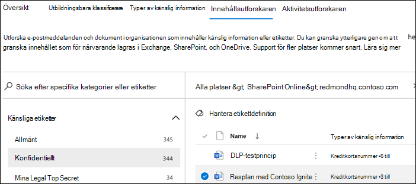
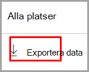
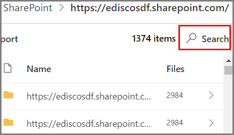

# Kom igång med innehållsutforskaren

Med innehållsutforskaren för dataklassificering kan du se objekten som sammanfattas på översiktssidan.

## Förutsättningar

Varje konto som har åtkomst till och använder dataklassificering, måste ha en tilldelad licens från någon av dessa prenumerationer:

- Microsoft 365 (E5)
- Office 365 (E5)
- Tillägget Advanced Compliance (E5)
- Tillägget Advanced Threat Intelligence (E5)
- Microsoft 365 E5/A5 – Informationsskydd och styrning
- Microsoft 365 E5/A5 – Efterlevnad

### Behörigheter

För att få åtkomst till fliken Innehållsutforskare måste ett konto tilldelas medlemskap i någon av nedanstående roller eller rollgrupper. 

**Microsoft 365-rollgrupper**

- Global administratör
- Efterlevnadsadministratör
- Säkerhetsadministratör
- Administratör för efterlevnadsdata

> [!IMPORTANT]
> Medlemskapet i rollgrupperna tillåter inte att du visar listan med objekt eller innehållet i objekten i innehållsutforskaren.

### Behörigheter som krävs för åtkomst till objekt i innehållsutforskaren

Åtkomsten till innehållsutforskaren är mycket begränsad eftersom den innebär att du kan läsa innehållet i genomsökta filer.

> [!IMPORTANT]
> Dessa behörigheter ersätter behörigheter som har tilldelats lokalt till objekten, vilket innebär att innehållet kan visas. 

Det finns två roller som ger åtkomst till innehållsutforskaren och som tilldelas via [Microsofts säkerhets- och efterlevnadscenter](https://protection.office.com/permissions):

- **Listvy för innehållsutforskare**: Med ett medlemskap i den här rollgruppen kan du se alla objekt och deras platser i listvyn. Rollen `data classification list viewer` har tilldelats till rollgruppen i förväg.

- **Innehållshanterare för innehållsutforskaren**: Med ett medlemskap i den här rollgruppen kan du se innehållet för alla objekt i listan. Rollen `data classification content viewer` har tilldelats till rollgruppen i förväg.

Kontot som du använder för att komma åt innehållsutforskaren måste finnas i ena eller båda rollgrupperna. Det här är fristående rollgrupper som inte är kumulativa. Om du till exempel vill ge ett konto möjlighet att enbart se objekten och deras platser, beviljar du behörighet till innehållsutforskarens listvy. Om du vill att samma konto också ska kunna se innehållet för objekten i listan, beviljar du även behörighet till innehållshanteraren för innehållsutforskaren.

Du kan också tilldela den ena eller båda rollerna till en anpassad rollgrupp för att anpassa åtkomsten till innehållsutforskaren.

En global administratör, efterlevnadsadministratör eller dataadministratör kan tilldela det nödvändiga medlemskapet i rollgruppen till innehållsutforskarens listvy eller innehållshanterare.

## Innehållsutforskaren

I innehållsutforskaren visas en aktuell ögonblicksbild av objekt som har en känslighetsetikett, en kvarhållningsetikett eller som har klassificeras med en typ av känslig information i organisationen.

### Typer av känslig information

Med en [DLP-princip](dlp-learn-about-dlp.md) skyddar du känslig information som har definierats med en **typ av känslig information**. Microsoft 365 innehåller [definitioner av många vanliga typer av känslig information](sensitive-information-type-entity-definitions.md) från olika regioner som du kan använda direkt. Det kan exempelvis vara kreditkortsnummer, bankkontonummer, nationella ID-nummer och Windows Live ID-tjänstnummer.

> [!NOTE]
> Innehållsutforskaren söker för närvarande inte efter typer av känslig information i Exchange Online.

### Känslighetsetiketter

En [känslighetsetikett](sensitivity-labels.md) är helt enkelt en tagg som anger värdet för objektet i din organisation. Den kan tillämpas manuellt eller automatiskt. När den används bäddas den in i dokumentet och medföljer det överallt. En känslighetsetikett möjliggör olika säkerhetsmetoder, till exempel obligatorisk vattenstämpel eller kryptering.

Känslighetsetiketter måste vara aktiverade för filer som finns i SharePoint och OneDrive för att motsvarande data ska visas på dataklassificeringssidan. Mer information finns i [Aktivera känslighetsetiketter för Office-filer i SharePoint och OneDrive](sensitivity-labels-sharepoint-onedrive-files.md).

### Kvarhållningsetiketter

Med en [kvarhållningsetikett](retention.md) kan du ange hur länge ett etiketterat objekt ska behållas och vilka steg som ska vidtas innan det tas bort. De kan tillämpas manuellt eller automatiskt via principer. De kan användas för att hjälpa din organisation att följa juridiska krav och regelkrav.

### Använda innehållsutforskaren

1. Öppna **Microsoft 365 Efterlevnadscenter**  > **Dataklassificering** > **Innehållsutforskaren**.
2. Om du känner till namnet på etiketten eller typen av känslig information kan du skriva det i filterrutan.
3. Du kan också bläddra efter objektet genom att expandera etikettypen och välja etiketten i listan.
4. Välj en plats under **Alla platser** och öka detaljnivån i objektets mappstruktur.
5. Dubbelklicka för att öppna objektet i innehållsutforskaren.

### Exportera
**Exporten** skapar en .csv-fil med en lista över det som visas i fönstret **Alla platser**.

### Söka

När du ökar detaljnivån för en plats, till exempel en Exchange-mapp eller en SharePoint- eller OneDrive-webbplats, visas **sök**-verktyget.

Verktygets sökomfång visas i rutan **Alla platser**. Vad du kan söka efter varierar beroende på den valda platsen. 

När **Exchange** är den valda platsen kan du söka efter den fullständiga e-postadressen för postlådan, till exempel `user@domainname.com`.

När antingen **SharePoint** eller **OneDrive** har valts som plats, visas sökverktyget när du ökar detaljnivån för webbplatsnamn, mappar och filer. 

> [!NOTE]
> **OneDrive** Vi har lyssnat på den värdefulla feedbacken om OneDrive-integreringen från förhandsversionen. Baserat på feedbacken finns OneDrive-funktionerna kvar i förhandsversionen tills alla korrigeringar har gjorts. Beroende på din klientorganisation kanske vissa kunder inte ser OneDrive som en plats. Vi uppskattar ditt fortsatta stöd för detta.

Du kan söka på:

|värde|exempel  |
|---------|---------|
|fullständigt webbplatsnamn    |`https://contoso.onmicrosoft.com/sites/sitename`    |
|rotmappens namn – hämtar alla undermappar    | `/sites`        |
|filnamn    |    `RES_Resume_1234.txt`     |
|text i början av filnamnet| `RES`|
|text efter ett understreck (_) i filnamnet|`Resume` eller `1234`| 
|filtillägg|`txt`|

## Se även

- [Mer information om känslighetsetiketter](sensitivity-labels.md)
- [Mer information om kvarhållningsprinciper och kvarhållningsetiketter](retention.md)
- [Entitetsdefinitioner för typer av känslig information](sensitive-information-type-entity-definitions.md)
- [Mer information om dataförlustskydd](dlp-learn-about-dlp.md)