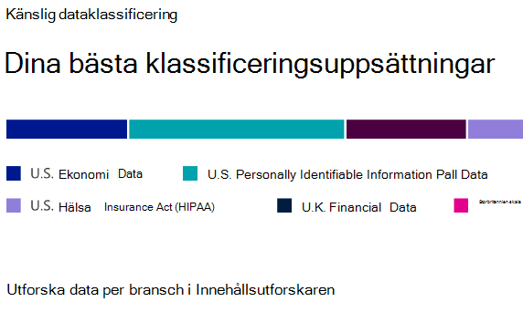
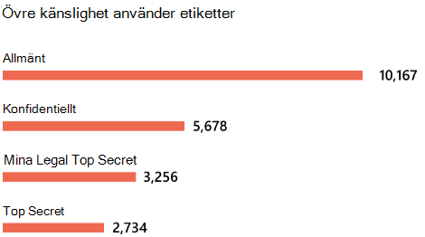

# Mer information om dataklassificering

Som Microsoft 365-administratör eller efterlevnadsadministratör kan du utvärdera och sedan tagga innehåll i organisationen för att kunna styra vart innehållet hamnar, skydda det oavsett var det är och säkerställa att det bevaras och tas bort enligt organisationens behov. Det gör du genom att använda [känslighetsetiketter](sensitivity-labels.md), [kvarhållningsetiketter](retention.md#retention-labels) och klassificering av känsliga informationstyper. Det finns olika sätt för identifieringen, utvärderingen och taggningen, men slutresultatet blir att du kanske har ett mycket stort antal dokument och e-postmeddelanden som är taggade och klassificerade med den ena eller båda etiketterna. När du har använt kvarhållningsetiketter och känslighetsetiketter kan du se hur etiketterna används i hela klientorganisationen och vad som utförs med objekten. Dataklassificeringssidan ger insyn i innehållstexten, mer specifikt:

- antalet objekt som har klassificerats som en känslig informationstyp och vilka klassificeringarna är
- de mest använda känslighetsetiketterna i både Microsoft 365 och Azure Information Protection
- de mest använda kvarhållningsetiketterna
- en sammanfattning av aktiviteter som användarna vidtar på känsligt innehåll
- platser för känsliga data och data som behållits

Du kan också hantera de här funktionerna på dataklassificeringssidan:

- [träningsbara klassificerare](classifier-learn-about.md)
- [typer av känslig information](sensitive-information-type-learn-about.md)
- [exakta datamatchningar](create-custom-sensitive-information-types-with-exact-data-match-based-classification.md)
- [innehållsutforskaren](data-classification-content-explorer.md)
- [aktivitetsutforskaren](data-classification-activity-explorer.md)

Du hittar dataklassificeringen i **Microsoft 365 Efterlevnadscenter** eller **Microsoft 365 Säkerhetscenter** > **Klassificering** > **Dataklassificering**.

Ta en rundtur i våra funktioner för dataklassificering.

> [!VIDEO https://www.microsoft.com/videoplayer/embed/RE4vx8x]

Dataklassificeringen genomsöker känsligt innehåll och etiketterat innehåll innan du skapar några principer. Detta kallas för **hantering av nolländringar**. Du kan därmed se vilken effekt alla kvarhållnings- och känslighetsetiketter har i miljön och börja utvärdera dina behov av säkerhets- och styrningsprinciper.

## Förutsättningar

Ett antal olika prenumerationer har stöd för slutpunkts-DLP. Mer information om licensalternativ för slutpunkts-DLP finns i [Information Protection-licensiering för vägledning](/office365/servicedescriptions/microsoft-365-service-descriptions/microsoft-365-tenantlevel-services-licensing-guidance/microsoft-365-security-compliance-licensing-guidance#information-protection). 

### Behörigheter

 För att få åtkomst till dataklassificeringssidan måste ett konto tilldelas medlemskap i någon av dessa roller eller rollgrupper.

**Microsoft 365-rollgrupper**

- Global administratör
- Efterlevnadsadministratör
- Säkerhetsadministratör
- Administratör för efterlevnadsdata

> [!NOTE]
> Vi rekommenderar att du alltid använder rollen med minsta möjliga behörighet för att bevilja åtkomst till Microsoft 365-dataklassificering.

## De typer av känslig information som används mest i innehållet

Microsoft 365 innehåller många definitioner av typer av känslig information, till exempel objekt som innehåller personnummer eller kreditkortsnummer. Mer information om typer av känslig information finns i [Entitetsdefinitioner av känsliga informationstyper](sensitive-information-type-entity-definitions.md).

Kortet med den känsliga informationstypen visar de vanligaste typerna av känslig information som har hittats och etiketterats i hela organisationen.

För att ta reda på hur många objekt som ingår i en viss klassificeringskategori hovrar du över fältet för kategorin.

> [!NOTE]
> Om meddelandet ”Inga data hittades med känslig information” visas på kortet. Det innebär att inga objekt i organisationen har klassificerats att vara av typen känslig information eller att inga objekt har crawlats. Så här kommer du igång med etiketter:
>- [Komma igång med känslighetsetiketter](get-started-with-sensitivity-labels.md)
>- [Komma igång med kvarhållningsprinciper och kvarhållningsetiketter](get-started-with-retention.md)
>- [Entitetsdefinitioner för typer av känslig information](sensitive-information-type-entity-definitions.md)

## Vanligaste känslighetsetiketter som tillämpats på innehåll

När du använder en känslighetsetikett på ett objekt, antingen via Microsoft 365 eller Azure Information Protection (AIP) händer två saker:

- en tagg som anger värdet för objektet i din organisation bäddas in i dokumentet och följer det överallt
- taggen möjliggör olika skyddsbeteenden, till exempel obligatorisk vattenstämpel eller kryptering. När slutpunktskyddet är aktiverat kan du till och med förhindra att ett objekt lämnar organisationens kontroll.

Mer information om känslighetsetiketter finns i: [Mer information om känslighetsetiketter](sensitivity-labels.md)

Känslighetsetiketter måste vara aktiverade för filer som finns i SharePoint och OneDrive för att motsvarande data ska visas på dataklassificeringssidan. Mer information finns i [Aktivera känslighetsetiketter för Office-filer i SharePoint och OneDrive](sensitivity-labels-sharepoint-onedrive-files.md).

Kortet för känslighetsetiketten visar antalet objekt (e-post eller dokument) efter känslighetsnivå.

> [!NOTE]
> Om du inte har skapat eller publicerat några känslighetsetiketter eller om inget innehåll har använt en känslighetsetikett visas meddelandet "Inga känslighetsetiketter har identifierats". Information om hur du kommer igång med känslighetsetiketter finns i:
>- [Komma igång med känslighetsetiketter](get-started-with-sensitivity-labels.md) eller för AIP [Konfigurera Azure Information Protection-principen](/azure/information-protection/configure-policy)

## Vanligaste kvarhållningsetiketter som tillämpats på innehåll

Kvarhållningsetiketter används för att hantera kvarhållning och disposition av innehåll i organisationen. De kan användas för att styra hur ett objekt ska lagras före borttagningen, om det ska granskas innan det tas bort, när dess kvarhållningsperiod upphör och om det ska markeras som en post. Mer information finns i [Mer information om kvarhållningsprinciper och kvarhållningsetiketter](retention.md).

På kortet med de vanligaste kvarhållningsetiketterna ser du hur många objekt som har en viss kvarhållningsetikett.

> [!NOTE]
> Om meddelandet ”Inga kvarhållningsetiketter upptäcktes” visas på kortet har du inte skapat eller publicerat några kvarhållningsetiketter eller så har inget innehåll någon kvarhållningsetikett. Komma igång med kvarhållningsetiketter:
>- [Komma igång med kvarhållningsprinciper och kvarhållningsetiketter](get-started-with-retention.md)

## Vanligaste aktiviteter som upptäckts

På kortet visas en snabb sammanfattning av de vanligaste åtgärderna som användare vidtar på de känsliga objekten. Du kan använda [aktivitetsutforskaren](data-classification-activity-explorer.md) för att se mer information om olika aktiviteter som Microsoft 365 spårar i etiketterat innehåll och innehåll som finns i Windows 10-slutpunkter.

> [!NOTE]
> Om meddelandet ”Ingen aktivitet upptäcktes” visas på kortet betyder det att det inte har skett någon aktivitet i filerna eller att användar- och administratörsgranskning inte har aktiverats. Information om hur du aktiverar granskningsloggarna finns i:
>- [Söka i granskningsloggen i Säkerhets- och efterlevnadscenter](search-the-audit-log-in-security-and-compliance.md)

## Känslighets- och kvarhållningsetiketter på data efter plats

Poängen med dataklassificeringsrapporteringen är att ge insyn i antalet objekt som har de olika etiketterna samt var de finns. På korten visas hur många etiketterade objekt som finns i Exchange, SharePoint, OneDrive osv.

> [!NOTE]
> Om meddelandet ”Inga platser upptäcktes” visas på kortet betyder det att du inte har skapat eller publicerat några känslighetsetiketter eller att inget innehåll har någon kvarhållningsetikett. Information om hur du kommer igång med känslighetsetiketter finns i:
>- [Känslighetsetiketter](sensitivity-labels.md)

## Se även

- [Visa etikettaktivitet](data-classification-activity-explorer.md)
- [Visa etiketterat innehåll](data-classification-content-explorer.md)
- [Mer information om känslighetsetiketter](sensitivity-labels.md)
- [Mer information om kvarhållningsprinciper och kvarhållningsetiketter](retention.md)
- [Mer information om typer av känslig information](sensitive-information-type-learn-about.md)
- [Entitetsdefinitioner för typer av känslig information](sensitive-information-type-entity-definitions.md)
- [Mer information om utbildningsbara klassificerare (förhandsversion)](classifier-learn-about.md)

Information om hur du använder dataklassificering för att följa datasekretessföreskrifter finns i [Distribuera informationsskydd för datasekretessföreskrifter med Microsoft 365](../solutions/information-protection-deploy.md)  (aka.ms/m365dataprivacy).