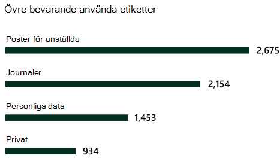

# Mer information om dataklassificeringLearn about data classification

Som Microsoft 365-administratör eller efterlevnadsadministratör kan du utvärdera och sedan tagga innehåll i organisationen för att kunna styra vart innehållet hamnar, skydda det oavsett var det är och säkerställa att det bevaras och tas bort enligt organisationens behov.As a Microsoft 365 administrator or compliance administrator, you can evaluate and then tag content in your organization in order to control where it goes, protect it no matter where it is and to ensure that it is preserved and deleted according to your organizations needs. Det gör du genom att använda [känslighetsetiketter](sensitivity-labels.md), [kvarhållningsetiketter](retention.md#retention-labels) och klassificering av känsliga informationstyper.You do this through the application of [sensitivity labels](sensitivity-labels.md), [retention labels](retention.md#retention-labels), and sensitive information type classification. Det finns olika sätt för identifieringen, utvärderingen och taggningen, men slutresultatet blir att du kanske har ett mycket stort antal dokument och e-postmeddelanden som är taggade och klassificerade med den ena eller båda etiketterna.There are various ways to do the discovery, evaluation and tagging, but the end result is that you may have very large number of documents and emails that are tagged and classified with one or both of these labels. När du har använt kvarhållningsetiketter och känslighetsetiketter kan du se hur etiketterna används i hela klientorganisationen och vad som utförs med objekten.After you apply your retention labels and sensitivity labels, you'll want to see how the labels are being used across your tenant and what is being done with those items. Dataklassificeringssidan ger insyn i innehållstexten, mer specifikt:The data classification page provides visibility into that body of content, specifically:

- antalet objekt som har klassificerats som en känslig informationstyp och vilka klassificeringarna ärthe number items that have been classified as a sensitive information type and what those classifications are
- de mest använda känslighetsetiketterna i både Microsoft 365 och Azure Information Protectionthe top applied sensitivity labels in both Microsoft 365 and Azure Information Protection
- de mest använda kvarhållningsetiketternathe top applied retention labels
- en sammanfattning av aktiviteter som användarna vidtar på känsligt innehålla summary of activities that users are taking on your sensitive content
- platser för känsliga data och data som behållitsthe locations of your sensitive and retained data

Du kan också hantera de här funktionerna på dataklassificeringssidan:You also manage these features on the data classification page:

- [träningsbara klassificeraretrainable classifiers](classifier-learn-about.md)
- [typer av känslig informationsensitive information types](sensitive-information-type-learn-about.md)
- [exakta datamatchningarexact data matches](create-custom-sensitive-information-types-with-exact-data-match-based-classification.md)
- [innehållsutforskarencontent explorer](data-classification-content-explorer.md)
- [aktivitetsutforskarenactivity explorer](data-classification-activity-explorer.md)

Du hittar dataklassificeringen i **Microsoft 365 Efterlevnadscenter** eller **Microsoft 365 Säkerhetscenter** > **Klassificering** > **Dataklassificering**.You can find data classification in the **Microsoft 365 compliance center** or **Microsoft 365 security center** > **Classification** > **Data Classification**.

Ta en rundtur i våra funktioner för dataklassificering.Take a video tour of our data classification features.

> [!VIDEO https://www.microsoft.com/videoplayer/embed/RE4vx8x]

Dataklassificeringen genomsöker känsligt innehåll och etiketterat innehåll innan du skapar några principer.Data classification will scan your sensitive content and labeled content before you create any policies. Detta kallas för **hantering av nolländringar**.This is called **zero change management**. Du kan därmed se vilken effekt alla kvarhållnings- och känslighetsetiketter har i miljön och börja utvärdera dina behov av säkerhets- och styrningsprinciper.This lets you see the impact that all the retention and sensitivity labels are having in your environment and empower you to start assessing your protection and governance policy needs.

## FörutsättningarPrerequisites

Ett antal olika prenumerationer har stöd för slutpunkts-DLP.A number of different subscriptions support Endpoint DLP. Mer information om licensalternativ för slutpunkts-DLP finns i [Information Protection-licensiering för vägledning](/office365/servicedescriptions/microsoft-365-service-descriptions/microsoft-365-tenantlevel-services-licensing-guidance/microsoft-365-security-compliance-licensing-guidance#information-protection).To see licensing options for Endpoint DLP see [Information Protection licensing for guidance](/office365/servicedescriptions/microsoft-365-service-descriptions/microsoft-365-tenantlevel-services-licensing-guidance/microsoft-365-security-compliance-licensing-guidance#information-protection). 

### BehörigheterPermissions

 För att få åtkomst till dataklassificeringssidan måste ett konto tilldelas medlemskap i någon av dessa roller eller rollgrupper.In order to get access to the data classification page, an account must be assigned membership in any one of these roles or role groups.

**Microsoft 365-rollgrupper****Microsoft 365 role groups**

- Global administratörGlobal administrator
- EfterlevnadsadministratörCompliance administrator
- SäkerhetsadministratörSecurity administrator
- Administratör för efterlevnadsdataCompliance data administrator

> [!NOTE]
> Vi rekommenderar att du alltid använder rollen med minsta möjliga behörighet för att bevilja åtkomst till Microsoft 365-dataklassificering.As a best practice, always use the role with least privilege to grant access to Microsoft 365 Data Classification.

## De typer av känslig information som används mest i innehålletSensitive information types used most in your content

Microsoft 365 innehåller många definitioner av typer av känslig information, till exempel objekt som innehåller personnummer eller kreditkortsnummer.Microsoft 365 comes with many definitions of sensitive information types, such as an item containing a social security number or a credit card number. Mer information om typer av känslig information finns i [Entitetsdefinitioner av känsliga informationstyper](sensitive-information-type-entity-definitions.md).For more information on sensitive information types, see [Sensitive information type entity definitions](sensitive-information-type-entity-definitions.md).

Kortet med den känsliga informationstypen visar de vanligaste typerna av känslig information som har hittats och etiketterats i hela organisationen.The sensitive information type card shows the top sensitive information types that have been found and labeled across your organization.

För att ta reda på hur många objekt som ingår i en viss klassificeringskategori hovrar du över fältet för kategorin.To find out how many items are in any given classification category, hover over the bar for the category.

> [!NOTE]
> Om meddelandet ”Inga data hittades med känslig information” visas på kortet.If the card displays the message "No data found with sensitive information". Det innebär att inga objekt i organisationen har klassificerats att vara av typen känslig information eller att inga objekt har crawlats.It means that there are no items in your organization that have been classified as being a sensitive information type or no items that have been crawled. Så här kommer du igång med etiketter:To get started with labels, see:
>- [Komma igång med känslighetsetiketterGet started with sensitivity labels](get-started-with-sensitivity-labels.md)
>- [Komma igång med kvarhållningsprinciper och kvarhållningsetiketterGet started with retention policies and retention labels](get-started-with-retention.md)
>- [Entitetsdefinitioner för typer av känslig informationSensitive information type entity definitions](sensitive-information-type-entity-definitions.md)

## Vanligaste känslighetsetiketter som tillämpats på innehållTop sensitivity labels applied to content

När du använder en känslighetsetikett på ett objekt, antingen via Microsoft 365 eller Azure Information Protection (AIP) händer två saker:When you apply a sensitivity label to an item either through Microsoft 365 or Azure Information Protection (AIP), two things happen:

- en tagg som anger värdet för objektet i din organisation bäddas in i dokumentet och följer det överallta tag that indicates the value of the item to your org is embedded in the document and will follow it everywhere it goes
- taggen möjliggör olika skyddsbeteenden, till exempel obligatorisk vattenstämpel eller kryptering.the presence of the tag enables various protective behaviors, such as mandatory watermarking or encryption. När slutpunktskyddet är aktiverat kan du till och med förhindra att ett objekt lämnar organisationens kontroll.With end point protection enabled you can even prevent an item from leaving your organizational control.

Mer information om känslighetsetiketter finns i: [Mer information om känslighetsetiketter](sensitivity-labels.md)For more information on sensitivity labels, see: [Learn about sensitivity labels](sensitivity-labels.md)

Känslighetsetiketter måste vara aktiverade för filer som finns i SharePoint och OneDrive för att motsvarande data ska visas på dataklassificeringssidan.Sensitivity labels must be enabled for files that are in SharePoint and OneDrive in order for the corresponding data to surface in the data classification page. Mer information finns i [Aktivera känslighetsetiketter för Office-filer i SharePoint och OneDrive](sensitivity-labels-sharepoint-onedrive-files.md).For more information, see [Enable sensitivity labels for Office files in SharePoint and OneDrive](sensitivity-labels-sharepoint-onedrive-files.md).

Kortet för känslighetsetiketten visar antalet objekt (e-post eller dokument) efter känslighetsnivå.The sensitivity label card shows the number of items (email or document) by sensitivity level.

> [!NOTE]
> Om du inte har skapat eller publicerat några känslighetsetiketter eller om inget innehåll har använt en känslighetsetikett visas meddelandet "Inga känslighetsetiketter har identifierats". Information om hur du kommer igång med känslighetsetiketter finns i:If you haven't created or published any sensitivity labels or no content has had a sensitivity label applied, this card will display the message "No sensitivity labels detected". To get started with sensitivity labels, see:
>- [Komma igång med känslighetsetiketter](get-started-with-sensitivity-labels.md) eller för AIP [Konfigurera Azure Information Protection-principen](/azure/information-protection/configure-policy)[Get started with sensitivity labels](get-started-with-sensitivity-labels.md) or for AIP [Configure the Azure information protection policy](/azure/information-protection/configure-policy)

## Vanligaste kvarhållningsetiketter som tillämpats på innehållTop retention labels applied to content

Kvarhållningsetiketter används för att hantera kvarhållning och disposition av innehåll i organisationen.Retention labels are used to manage the retention and disposition of content in your organization. De kan användas för att styra hur ett objekt ska lagras före borttagningen, om det ska granskas innan det tas bort, när dess kvarhållningsperiod upphör och om det ska markeras som en post.When applied, they can be used to control how an item will be kept before deletion, whether it should be reviewed prior to deletion, when its retention period expires, and whether it should be marked as a record. Mer information finns i [Mer information om kvarhållningsprinciper och kvarhållningsetiketter](retention.md).For more information, see [Learn about retention policies and retention labels](retention.md).

På kortet med de vanligaste kvarhållningsetiketterna ser du hur många objekt som har en viss kvarhållningsetikett.The top applied retention labels card shows you how many items have a given retention label.

> [!NOTE]
> Om meddelandet ”Inga kvarhållningsetiketter upptäcktes” visas på kortet har du inte skapat eller publicerat några kvarhållningsetiketter eller så har inget innehåll någon kvarhållningsetikett.If this card displays the message, "No retention labels detected", it means you haven't created or published any retention labels or no content has had a retention label applied. Komma igång med kvarhållningsetiketter:To get started with retention labels, see:
>- [Komma igång med kvarhållningsprinciper och kvarhållningsetiketterGet started with retention policies and retention labels](get-started-with-retention.md)

## Vanligaste aktiviteter som upptäcktsTop activities detected

På kortet visas en snabb sammanfattning av de vanligaste åtgärderna som användare vidtar på de känsliga objekten.This card provides a quick summary of the most common actions that users are taking on the sensitivity labeled items. Du kan använda [aktivitetsutforskaren](data-classification-activity-explorer.md) för att se mer information om olika aktiviteter som Microsoft 365 spårar i etiketterat innehåll och innehåll som finns i Windows 10-slutpunkter.You can use the [Activity explorer](data-classification-activity-explorer.md) to drill deep down on the different activities that Microsoft 365 tracks on labeled content and content that is located on Windows 10 endpoints.

> [!NOTE]
> Om meddelandet ”Ingen aktivitet upptäcktes” visas på kortet betyder det att det inte har skett någon aktivitet i filerna eller att användar- och administratörsgranskning inte har aktiverats. Information om hur du aktiverar granskningsloggarna finns i:If this card displays the message, "No activity detected" it means that there's been no activity on the files or that user and admin auditing isn't turned on. To turn the audit logs on , see:
>- [Söka i granskningsloggen i Säkerhets- och efterlevnadscenterSearch the audit log in security & compliance center](search-the-audit-log-in-security-and-compliance.md)

## Känslighets- och kvarhållningsetiketter på data efter platsSensitivity and retention labeled data by location

Poängen med dataklassificeringsrapporteringen är att ge insyn i antalet objekt som har de olika etiketterna samt var de finns.The point of the data classification reporting is to provide visibility into the number of items that have which label as well as their location. På korten visas hur många etiketterade objekt som finns i Exchange, SharePoint, OneDrive osv.These cards let you know how many labeled items the are in Exchange, SharePoint, and OneDrive etc.

> [!NOTE]
> Om meddelandet ”Inga platser upptäcktes” visas på kortet betyder det att du inte har skapat eller publicerat några känslighetsetiketter eller att inget innehåll har någon kvarhållningsetikett. Information om hur du kommer igång med känslighetsetiketter finns i:If this card displays the message, "No locations detected, it means you haven't created or published any sensitivity labels or no content has had a retention label applied. To get started with sensitivity labels, see:
>- [KänslighetsetiketterSensitivity labels](sensitivity-labels.md)

## Se ävenSee also

- [Visa etikettaktivitetView label activity](data-classification-activity-explorer.md)
- [Visa etiketterat innehållView labeled content](data-classification-content-explorer.md)
- [Mer information om känslighetsetiketterLearn about sensitivity labels](sensitivity-labels.md)
- [Mer information om kvarhållningsprinciper och kvarhållningsetiketterLearn about retention policies and retention labels](retention.md)
- [Mer information om typer av känslig informationLearn about sensitive information types](sensitive-information-type-learn-about.md)
- [Entitetsdefinitioner för typer av känslig informationSensitive information type entity definitions](sensitive-information-type-entity-definitions.md)
- [Mer information om utbildningsbara klassificerare (förhandsversion)Learn about trainable classifiers (preview)](classifier-learn-about.md)

Information om hur du använder dataklassificering för att följa datasekretessföreskrifter finns i [Distribuera informationsskydd för datasekretessföreskrifter med Microsoft 365](../solutions/information-protection-deploy.md)  (aka.ms/m365dataprivacy).To learn how to use data classification to comply with data privacy regulations, see [Deploy information protection for data privacy regulations with Microsoft 365](../solutions/information-protection-deploy.md)  (aka.ms/m365dataprivacy).