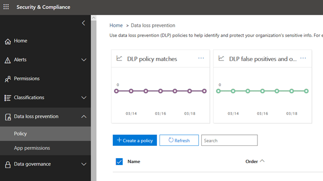
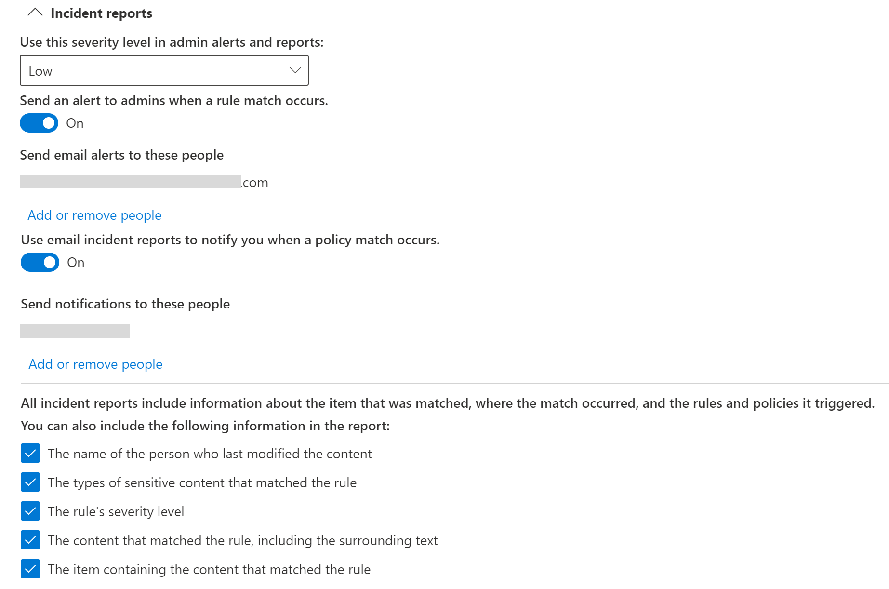

# Referens för dataförlustskyddData loss prevention reference
 
> [!IMPORTANT]
> Det här referensavsnittet är inte längre huvudresursen Microsoft 365 skydd mot dataförlust (DLP).This is reference topic is no longer the main resource for Microsoft 365 data loss prevention (DLP) information. DLP-innehållsuppsättningen uppdateras och struktureras om.The DLP content set is being updated and restructured. Artiklarna i den här artikeln flyttas till nya, uppdaterade artiklar.The topics covered in this article will be moving to new, updated articles. Mer information om DLP finns i [Läs mer om skydd mot dataförlust.](dlp-learn-about-dlp.md)For more information about DLP, see [Learn about data loss prevention](dlp-learn-about-dlp.md).

<!-- this topic needs to be split into smaller, more coherent ones. It is confusing as it is. -->
<!-- move this note to a more appropriate place, no topic should start with a note -->
> [!NOTE]
> Funktioner för dataförlustskydd har nyligen lagts till i Microsoft Teams chatt- och kanalmeddelanden för användare som är licensierade för Office 365 Advanced Compliance, som är tillgängligt som ett fristående alternativ och ingår i Office 365 E5 och Microsoft 365 E5 Compliance.Data loss prevention capabilities were recently added to Microsoft Teams chat and channel messages for users licensed for Office 365 Advanced Compliance, which is available as a standalone option and is included in Office 365 E5 and Microsoft 365 E5 Compliance. Mer information om licenskrav finns i [licensvägledning Microsoft 365 Tenant-Level Services Licensing Guidance](/office365/servicedescriptions/microsoft-365-service-descriptions/microsoft-365-tenantlevel-services-licensing-guidance).To learn more about licensing requirements, see [Microsoft 365 Tenant-Level Services Licensing Guidance](/office365/servicedescriptions/microsoft-365-service-descriptions/microsoft-365-tenantlevel-services-licensing-guidance).

<!-- MOVED TO LEARN ABOUT To comply with business standards and industry regulations, organizations must protect sensitive information and prevent its inadvertent disclosure. Sensitive information can include financial data or personally identifiable information (PII) such as credit card numbers, social security numbers, or health records. With a data loss prevention (DLP) policy in the Office 365 Security &amp; Compliance Center, you can identify, monitor, and automatically protect sensitive information across Office 365.
  
With a DLP policy, you can:
  
- **Identify sensitive information across many locations, such as Exchange Online, SharePoint Online, OneDrive for Business, and Microsoft Teams.**
    
    For example, you can identify any document containing a credit card number that's stored in any OneDrive for Business site, or you can monitor just the OneDrive sites of specific people.
    
- **Prevent the accidental sharing of sensitive information**. 
    
    For example, you can identify any document or email containing a health record that's shared with people outside your organization, and then automatically block access to that document or block the email from being sent.
    
- **Monitor and protect sensitive information in the desktop versions of Excel, PowerPoint, and Word.**
    
    Just like in Exchange Online, SharePoint Online, and OneDrive for Business, these Office desktop programs include the same capabilities to identify sensitive information and apply DLP policies. DLP provides continuous monitoring when people share content in these Office programs.
    
- **Help users learn how to stay compliant without interrupting their workflow.**
    
    You can educate your users about DLP policies and help them remain compliant without blocking their work. For example, if a user tries to share a document containing sensitive information, a DLP policy can both send them an email notification and show them a policy tip in the context of the document library that allows them to override the policy if they have a business justification. The same policy tips also appear in Outlook on the web, Outlook, Excel, PowerPoint, and Word.
    
- **View DLP alerts and reports showing content that matches your organization’s DLP policies.**
    
    To view alerts and metadata related to your DLP policies you can use the [DLP Alerts Management Dashboard](dlp-configure-view-alerts-policies.md). You can also view policy match reports to assess how your organization is complying with a DLP policy. If a DLP policy allows users to override a policy tip and report a false positive, you can also view what users have reported

-->    
## Skapa och hantera DLP-principerCreate and manage DLP policies

Du skapar och hanterar DLP-principer på sidan Skydd mot dataförlust i Microsoft 365 Efterlevnadscenter.You create and manage DLP policies on the Data loss prevention page in the Microsoft 365 Compliance center.
  

  
<!-- MOVED TO LEARN ABOUT ## What a DLP policy contains

A DLP policy contains a few basic things:
  
- Where to protect the content: **locations** such as Exchange Online, SharePoint Online, and OneDrive for Business sites, as well as Microsoft Teams chat and channel messages. 
    
- When and how to protect the content by enforcing **rules** comprised of: 
    
  - **Conditions** the content must match before the rule is enforced. For example, a rule might be configured to look only for content containing Social Security numbers that's been shared with people outside your organization. 
    
  - **Actions** that you want the rule to take automatically when content matching the conditions is found. For example, a rule might be configured to block access to a document and send both the user and compliance officer an email notification. -->
    
Du kan använda en regel för att uppfylla ett särskilt skyddskrav och sedan använda en DLP-princip för att gruppera samman vanliga skyddskrav, till exempel alla regler som krävs för att uppfylla en viss regel.You can use a rule to meet a specific protection requirement, and then use a DLP policy to group together common protection requirements, such as all of the rules needed to comply with a specific regulation.
  
Du kan till exempel ha en DLP-princip som hjälper dig att identifiera förekomsten av information som omfattas av HIPAA (Health Insurance Portability and Accountability Act).For example, you might have a DLP policy that helps you detect the presence of information subject to the Health Insurance Portability and Accountability Act (HIPAA). Den här DLP-principen kan skydda HIPAA-data (vad) på alla SharePoint Online-webbplatser och alla OneDrive för företag-webbplatser (där) genom att hitta alla dokument som innehåller den här känsliga informationen som delas med personer utanför organisationen (villkoren) och sedan blockera åtkomsten till dokumentet och skicka ett meddelande (åtgärderna).This DLP policy could help protect HIPAA data (the what) across all SharePoint Online sites and all OneDrive for Business sites (the where) by finding any document containing this sensitive information that's shared with people outside your organization (the conditions) and then blocking access to the document and sending a notification (the actions). Dessa krav lagras som enskilda regler och grupperas tillsammans som en DLP-princip för att förenkla hantering och rapportering.These requirements are stored as individual rules and grouped together as a DLP policy to simplify management and reporting.
  

  
<!-- MOVED TO LEARN ABOUT ### Locations

DLP policies are applied to sensitive items across Microsoft 365 locations and can be further scoped as detailed in this table.

|Location | Include/exclude by|
|---------|---------|
|Exchange email| distribution groups|
|SharePoint sites |sites |
|OneDrive accounts |accounts |
|Teams chat and channel messages |accounts |
|Windows 10 devices |user or group |
|Microsoft Cloud App Security |instance |
 -->

Om du väljer att inkludera specifika distributionsgrupper i Exchange omfattningen av DLP-principen endast till medlemmar i den gruppen.If you choose to include specific distribution groups in Exchange, the DLP policy will be scoped only to the members of that group. På samma sätt utesluter du en distributionsgrupp alla medlemmar i distributionsgruppen från principutvärderingen.Similarly excluding a distribution group will exclude all the members of that distribution group from policy evaluation. Du kan välja att begränsa en princip till medlemmar i distributionslistor, dynamiska distributionsgrupper och säkerhetsgrupper.You can choose to scope a policy to the members of distribution lists, dynamic distribution groups, and security groups. En DLP-princip får inte innehålla fler än 50 sådana inkludering och undantag.A DLP policy can contain no more than 50 such inclusions and exclusions.

Om du väljer att inkludera eller exkludera specifika SharePoint webbplatser kan en DLP-princip inte innehålla fler än 100 sådana inkludering och undantag.If you choose to include or exclude specific SharePoint sites, a DLP policy can contain no more than 100 such inclusions and exclusions. Även om den här gränsen finns kan du överskrida den här gränsen genom att använda en organisationsomfattande princip eller en princip som gäller för hela platser.Although this limit exists, you can exceed this limit by applying either an org-wide policy or a policy that applies to entire locations.

Om du väljer att inkludera eller exkludera specifika OneDrive-konton eller grupper kan en DLP-princip innehålla högst 100 användarkonton eller 50 grupper som inkludering eller undantag.If you choose to include or exclude specific OneDrive accounts or groups, a DLP policy can contain no more than 100 user accounts or 50 groups as inclusion or exclusion.

> [!NOTE]
> OneDrive för företag-principens användning av konton eller grupper är en offentlig förhandsversion.OneDrive for business policy scoping using accounts or groups is in public preview. Under den här fasen kan du antingen inkludera eller exkludera användarkonton och grupper som en del av en DLP-princip.During this phase, you can either include or exclude user accounts and groups as part of a DLP policy. Både inkludering och undantag som en del av samma princip stöds inte.Both inclusion and exclusion as part of the same policy is not supported.
  
### ReglerRules

> [!NOTE]
> När det inte finns någon konfigurerad avisering ska standardbeteendet för en DLP-princip vara att inte avisering eller utlösare.The default behavior of a DLP policy, when there is no alert configured, is not to alert or trigger. Det här gäller endast för standardinformationstyper.This applies only to default information types. För anpassade informationstyper varnas systemet även om det inte finns någon definierad åtgärd i principen.For custom information types, the system will alert even if there is no action defined in the policy.

Regler är det som tillämpar affärskraven på organisationens innehåll.Rules are what enforce your business requirements on your organization's content. En princip innehåller en eller flera regler och varje regel består av villkor och åtgärder.A policy contains one or more rules, and each rule consists of conditions and actions. När villkoren uppfylls för varje regel vidtas åtgärderna automatiskt.For each rule, when the conditions are met, the actions are taken automatically. Regler körs sekventiellt och börjar med regeln med högst prioritet i varje princip.Rules are executed sequentially, starting with the highest-priority rule in each policy.
  
En regel innehåller också alternativ för att meddela användare (med principtips och e-postaviseringar) och administratörer (med rapporter om e-posttillbud) som har matchat regeln.A rule also provides options to notify users (with policy tips and email notifications) and admins (with email incident reports) that content has matched the rule.
  
Här är komponenterna i en regel, som förklaras nedan.Here are the components of a rule, each explained below.
  

  
#### VillkorConditions

Villkoren är viktiga eftersom de avgör vilka typer av information du letar efter och när de ska vidta en åtgärd.Conditions are important because they determine what types of information you're looking for, and when to take an action. Du kan till exempel välja att ignorera innehåll som innehåller passnummer om inte innehållet innehåller fler än 10 sådana nummer och delas med personer utanför organisationen.For example, you might choose to ignore content containing passport numbers unless the content contains more than 10 such numbers and is shared with people outside your organization.
  
Villkor fokuserar **på innehållet,** t.ex. vilka typer av känslig information du letar efter, och även på **sammanhanget,** t.ex. vem dokumentet delas med.Conditions focus on the **content**, such as what types of sensitive information you're looking for, and also on the **context**, such as who the document is shared with. Du kan använda villkor för att tilldela olika åtgärder till olika risknivåer.You can use conditions to assign different actions to different risk levels. Till exempel kan känsligt innehåll som delas internt vara en lägre risk och kräver färre åtgärder än känsligt innehåll som delas med personer utanför organisationen.For example, sensitive content shared internally might be lower risk and require fewer actions than sensitive content shared with people outside the organization. 
  

  
De tillgängliga villkoren kan avgöra om:The conditions now available can determine if:
  
- Innehållet innehåller en typ av känslig information.Content contains a type of sensitive information.
    
- Innehållet innehåller en etikett.Content contains a label. Mer information finns i avsnittet Använda en bevarandeetikett som ett [villkor i en DLP-princip nedan.](#using-a-retention-label-as-a-condition-in-a-dlp-policy)For more information, see the below section [Using a retention label as a condition in a DLP policy](#using-a-retention-label-as-a-condition-in-a-dlp-policy).
    
- Innehåll delas med personer utanför eller inom organisationen.Content is shared with people outside or inside your organization.

  > [!NOTE]
  > Användare som har icke-gästkonton i värdorganisationens Active Directory eller Azure Active Directory betraktas som personer i organisationen.Users who have non-guest accounts in a host organization's Active Directory or Azure Active Directory tenant are considered as people inside the organization.
    
#### Typer av känslig informationTypes of sensitive information

En DLP-princip kan skydda känslig information som definieras som en **typ av känslig information.**A DLP policy can help protect sensitive information, which is defined as a **sensitive information type**. Microsoft 365 innehåller definitioner av vanliga typer av känslig information i många olika regioner som är färdiga att använda, till exempel kreditkortsnummer, bankkontonummer, nationella ID-nummer och passnummer.Microsoft 365 includes definitions for many common sensitive information types across many different regions that are ready for you to use, such as a credit card number, bank account numbers, national ID numbers, and passport numbers. 
  

  
När en DLP-princip söker efter en typ av känslig information, till exempel kreditkortsnummer, söker den inte bara efter ett nummer med 16 siffror.When a DLP policy looks for a sensitive information type such as a credit card number, it doesn't simply look for a 16-digit number. Varje typ av känslig information definieras och identifieras genom en kombination av följande:Each sensitive information type is defined and detected by using a combination of:
  
- Nyckelord.Keywords.
    
- Interna funktioner för att validera kontrollsummar eller sammansättning.Internal functions to validate checksums or composition.
    
- Utvärdering av reguljära uttryck för att hitta mönstermatchningar.Evaluation of regular expressions to find pattern matches.
    
- Andra innehållsundersökningar.Other content examination.
    
Det här hjälper DLP-identifiering att uppnå en hög grad av exakthet samtidigt som antalet falska positiva identifieringar som kan avbryta personers arbete minskar.This helps DLP detection achieve a high degree of accuracy while reducing the number of false positives that can interrupt peoples' work.
  
#### ÅtgärderActions

När innehållet matchar ett villkor i en regel kan du använda åtgärder för att automatiskt skydda innehållet.When content matches a condition in a rule, you can apply actions to automatically protect the content.
  

  
När åtgärderna är tillgängliga kan du göra följande:With the actions now available, you can:
  
- **Begränsa åtkomst till innehållet** Beroende på dina behov kan du begränsa åtkomsten till innehåll på tre sätt:**Restrict access to the content** Depending on your need, you can restrict access to content in three ways:

  1. Begränsa åtkomsten till innehåll för alla.Restrict access to content for everyone.
  2. Begränsa åtkomst till innehåll för personer utanför organisationen.Restrict access to content for people outside the organization.
  3. Begränsa åtkomsten till Alla som har länken.Restrict access to "Anyone with the link."

  För webbplatsinnehåll innebär det att behörigheterna för dokumentet är begränsade för alla utom den primära administratören för webbplatssamlingen, dokumentägaren och personen som senast ändrade dokumentet.For site content, this means that permissions for the document are restricted for everyone except the primary site collection administrator, document owner, and person who last modified the document. De här personerna kan ta bort den känsliga informationen från dokumentet eller vidta andra åtgärder.These people can remove the sensitive information from the document or take other remedial action. När dokumentet uppfyller alla regler och regler återställs de ursprungliga behörigheterna automatiskt.When the document is in compliance, the original permissions are automatically restored. När åtkomsten till ett dokument blockeras visas dokumentet med en särskild principtipsikon i biblioteket på webbplatsen.When access to a document is blocked, the document appears with a special policy tip icon in the library on the site. 
    
  
  
  För e-postinnehåll blockerar den här åtgärden meddelandet från att skickas.For email content, this action blocks the message from being sent. Beroende på hur DLP-regeln har konfigurerats ser avsändaren en NDR-meddelande eller (om regeln använder ett meddelande) ett principtips och/eller ett e-postmeddelande.Depending on how the DLP rule is configured, the sender sees an NDR or (if the rule uses a notification) a policy tip and/or email notification.
    
  
  
#### Användarmeddelanden och åsidosättningar av användareUser notifications and user overrides

Du kan använda meddelanden och åsidosättningar för att informera användarna om DLP-principer och hjälpa dem att uppfylla alla regler utan att blockera deras arbete.You can use notifications and overrides to educate your users about DLP policies and help them remain compliant without blocking their work. Om en användare till exempel försöker dela ett dokument som innehåller känslig information kan en DLP-princip både skicka ett e-postmeddelande till dem och visa dem ett principtips inom ramen för dokumentbiblioteket som gör att de kan åsidosätta principen om de har en affärs-justering.For example, if a user tries to share a document containing sensitive information, a DLP policy can both send them an email notification and show them a policy tip in the context of the document library that allows them to override the policy if they have a business justification.
  

  
I e-postmeddelandet kan personen som skickade, delade eller senast ändrade innehållet meddelas och, för webbplatsinnehåll, den primära administratören för webbplatssamlingen och dokumentets ägare.The email can notify the person who sent, shared, or last modified the content and, for site content, the primary site collection administrator and document owner. Du kan dessutom lägga till eller ta bort vilka du vill i e-postmeddelandet.In addition, you can add or remove whomever you choose from the email notification.
  
Förutom att skicka ett e-postmeddelande visar en användare ett principtips:In addition to sending an email notification, a user notification displays a policy tip:
  
- I Outlook och Outlook på webben.In Outlook and Outlook on the web.
    
- För dokumentet på en SharePoint Online eller OneDrive för företag webbplats.For the document on a SharePoint Online or OneDrive for Business site.
    
- I Excel, PowerPoint och Word, när dokumentet lagras på en webbplats som ingår i en DLP-princip.In Excel, PowerPoint, and Word, when the document is stored on a site included in a DLP policy.
    
E-postmeddelandet och principtipset förklarar varför innehållet står i konflikt med en DLP-princip.The email notification and policy tip explain why content conflicts with a DLP policy. Om du väljer kan e-postaviseringar och principtips tillåta användare att åsidosätta en regel genom att rapportera en felaktig positiv eller ange en affärs motivering.If you choose, the email notification and policy tip can allow users to override a rule by reporting a false positive or providing a business justification. På så sätt kan du utbilda användarna om DLP-principerna och tillämpa dem utan att hindra personer från att göra sina arbeten.This can help you educate users about your DLP policies and enforce them without preventing people from doing their work. Information om åsidosättningar och falska positiva resultat loggas också för rapportering (se nedan om DLP-rapporter) och inkluderas i incidentrapporterna (nästa avsnitt), så att efterlevnadsombudet regelbundet kan granska den här informationen.Information about overrides and false positives is also logged for reporting (see below about the DLP reports) and included in the incident reports (next section), so that the compliance officer can regularly review this information.
  
Så här ser ett principtips ut i ett OneDrive för företag konto.Here's what a policy tip looks like in a OneDrive for Business account.
  

 Mer information om användarmeddelanden och principtips i DLP-principer finns i [Använda meddelanden och principtips.](use-notifications-and-policy-tips.md)To learn more about user notifications and policy tips in DLP policies, see [Use notifications and policy tips](use-notifications-and-policy-tips.md).

#### Aviseringar och incidentrapporterAlerts and Incident reports

När en regel matchas kan du skicka ett e-postmeddelande med en avisering till efterlevnadsombudet (eller till valfri person) med information om aviseringen.When a rule is matched, you can send an alert email to your compliance officer ( or any person(s) you choose) with details of the alert. Det här e-postmeddelandet med en länk till Instrumentpanelen för hantering av [DLP-aviseringar](dlp-configure-view-alerts-policies.md) som efterlevnadsombud kan gå till för att visa information om händelser och händelser.This alert email will carry a link of the [DLP Alerts Management Dashboard](dlp-configure-view-alerts-policies.md) which the compliance officer can go to view the details of alert and events. Instrumentpanelen innehåller information om händelsen som utlöste aviseringen tillsammans med information om matchad DLP-princip och vilket känsligt innehåll som upptäckts.The dashboard contains details of the event that triggered the alert along with details of the DLP policy matched and the sensitive content detected.

Dessutom kan du skicka en incidentrapport med information om händelsen.In addition, you can also send an incident report with details of the event. Den här rapporten innehåller information om det objekt som matchades, det faktiska innehållet som matchade regeln och namnet på den person som senast ändrade innehållet.This report includes information about the item that was matched, the actual content that matched the rule, and the name of the person who last modified the content. För e-postmeddelanden innehåller rapporten också det ursprungliga meddelandet som matchar en DLP-princip som en bifogad fil.For email messages, the report also includes as an attachment the original message that matches a DLP policy.

> [!div class="mx-imgBorder"]
> 

DLP söker igenom e-post på ett annat sätt än objekten SharePoint online eller OneDrive för företag.DLP scans email differently from items in SharePoint Online or OneDrive for Business. I SharePoint Online OneDrive för företag genomsöker DLP både befintliga och nya objekt och genererar en avisering och incidentrapport när en matchning hittas.In SharePoint Online and OneDrive for Business, DLP scans existing items as well as new ones and generates an alert and incident report whenever a match is found. I Exchange Online söker DLP bara igenom nya e-postmeddelanden och genererar en rapport om det finns en principmatchning.In Exchange Online, DLP only scans new email messages and generates a report if there is a policy match. DLP ***söker inte igenom*** eller matchar tidigare befintliga e-postobjekt som lagrats i en postlåda eller ett arkiv.DLP ***does not*** scan or match previously existing email items that are stored in a mailbox or archive.
  
## Grupperingsoperatorer och logiska operatorerGrouping and logical operators

Ofta har DLP-principen ett enkelt krav, till exempel att identifiera allt innehåll som innehåller ett amerikanskt personnummer.Often your DLP policy has a straightforward requirement, such as to identify all content that contains a U.S. Social Security Number. I andra fall kan dock DLP-principen behöva identifiera mer löst definierade data.However, in other scenarios, your DLP policy might need to identify more loosely defined data.
  
Om du till exempel vill identifiera innehåll som omfattas av U.S. Health Insurance Act (HIPAA) måste du leta efter:For example, to identify content subject to the U.S. Health Insurance Act (HIPAA), you need to look for:
  
- Innehåll som innehåller särskilda typer av känslig information, till exempel ett U.S. Social Security Number eller DeA (DeA).Content that contains specific types of sensitive information, such as a U.S. Social Security Number or Drug Enforcement Agency (DEA) Number.
    
    OCHAND
    
- Innehåll som är svårare att identifiera, till exempel kommunikation om en patientvård eller beskrivningar av medicinsk information.Content that's more difficult to identify, such as communications about a patient's care or descriptions of medical services provided. För att kunna identifiera det här innehållet krävs matchande nyckelord från mycket stora nyckelordslistor, till exempel den internationella klassificeringen av tidsklassificering (ICD-9 CM eller ICD-10-CM).Identifying this content requires matching keywords from very large keyword lists, such as the International Classification of Diseases (ICD-9-CM or ICD-10-CM).
    
Du kan enkelt identifiera lösa data med hjälp av grupperingsoperatorer och logiska operatorer (OCH, ELLER).You can easily identify such loosely defined data by using grouping and logical operators (AND, OR). När du skapar en DLP-princip kan du:When you create a DLP policy, you can:
  
- Gruppera typer av känslig information.Group sensitive information types.
    
- Välj den logiska operatorn mellan typerna av känslig information i en grupp och mellan grupperna.Choose the logical operator between the sensitive information types within a group and between the groups themselves.
    
### Välja operator inom en gruppChoosing the operator within a group

Inom en grupp kan du välja om något eller samtliga av villkoren i gruppen ska vara uppfyllda för att innehållet ska matcha regeln.Within a group, you can choose whether any or all of the conditions in that group must be satisfied for the content to match the rule.
  

  
### Lägga till en gruppAdding a group

Du kan snabbt lägga till en grupp, som kan ha egna villkor och operatorer inom den gruppen.You can quickly add a group, which can have its own conditions and operator within that group.
  

  
### Välja operator mellan grupperChoosing the operator between groups

Mellan grupper kan du välja om villkoren i bara en grupp eller alla grupper ska vara uppfyllda för att innehållet ska matcha regeln.Between groups, you can choose whether the conditions in just one group or all of the groups must be satisfied for the content to match the rule.
  
Den inbyggda amerikanska **HIPAA-policyn** har till exempel en regel som använder en **OCH-operator** mellan grupperna så att den identifierar innehåll som innehåller:For example, the built-in **U.S. HIPAA** policy has a rule that uses an **AND** operator between the groups so that it identifies content that contains: 
  
- från gruppens **PII-identifierare** (minst ett SSN-nummer **ELLER** DEA-nummer)from the group **PII Identifiers** (at least one SSN number **OR** DEA number) 
    
    **OCH****AND**
    
- från gruppens **medicinska villkor** (minst ett ICD-9-CM-nyckelord **ELLER** ICD-10-CM-nyckelord)from the group **Medical Terms** (at least one ICD-9-CM keyword **OR** ICD-10-CM keyword) 
    

  
## Prioritet som regler bearbetas medThe priority by which rules are processed

När du skapar regler i en princip tilldelas varje regel prioritet i den ordning som den skapas, det vill säga att den regel som skapas först har första prioritet, den regel som skapas först har den andra prioriteten och så vidare.When you create rules in a policy, each rule is assigned a priority in the order in which it's created — meaning, the rule created first has first priority, the rule created second has second priority, and so on.

> [!div class="mx-imgBorder"]
> 
  
När du har konfigurerat fler än en DLP-princip kan du ändra prioriteten för en eller flera principer.After you have set up more than one DLP policy, you can change the priority of one or more policies. Det gör du genom att välja en princip, **välja Redigera** princip och ange **prioritet i** listan Prioritet.To do that, select a policy, choose **Edit policy**, and use the **Priority** list to specify its priority.

> [!div class="mx-imgBorder"]
> 

När innehåll utvärderas mot regler bearbetas reglerna i prioritetsordning.When content is evaluated against rules, the rules are processed in priority order. Om innehållet matchar flera regler bearbetas reglerna i prioritetsordning och den mest restriktiva åtgärden tillämpas.If content matches multiple rules, the rules are processed in priority order and the most restrictive action is enforced. Om innehållet till exempel matchar alla följande regler tillämpas regel 3 eftersom den har högsta prioritet och mest restriktiv regel:For example, if content matches all of the following rules, Rule 3 is enforced because it's the highest priority, most restrictive rule:
  
- Regel 1: Endast meddelar användarnaRule 1: only notifies users
    
- Regel 2: Meddelar användarna, begränsar åtkomsten och tillåter att användaren åsidosätterRule 2: notifies users, restricts access, and allows user overrides
    
- Regel 3: Meddelar användarna, begränsar åtkomsten och tillåter inte åsidosättningar av användareRule 3: notifies users, restricts access, and does not allow user overrides
    
- Regel 4: Meddelar endast användarnaRule 4: only notifies users
    
- Regel 5: Begränsar åtkomstenRule 5: restricts access
    
- Regel 6: Meddelar användare, begränsar åtkomsten och tillåter inte åsidosättningar av användareRule 6: notifies users, restricts access, and does not allow user overrides
    
I det här exemplet registreras matchningar för alla regler i granskningsloggarna och visas i DLP-rapporterna, även om endast den mest restriktiva regeln tillämpas.In this example, note that matches for all of the rules are recorded in the audit logs and shown in the DLP reports, even though only the most restrictive rule is enforced.
  
Observera följande när det gäller policytips:Regarding policy tips, note that:
  
- Endast principtipset med högst prioritet, den mest restriktiva regeln visas.Only the policy tip from the highest priority, most restrictive rule will be shown. Till exempel kommer ett principtips från en regel som blockerar åtkomst till innehåll att visas över ett principtips från en regel som helt enkelt skickar ett meddelande.For example, a policy tip from a rule that blocks access to content will be shown over a policy tip from a rule that simply sends a notification. Det gör att det inte går att se en störtlapp av principtips.This prevents people from seeing a cascade of policy tips.
    
- Om principtipset i den mest restriktiva regeln tillåter att användare åsidosätter regeln åsidosätter den här regeln även eventuella andra regler som det matchade innehållet.If the policy tips in the most restrictive rule allow people to override the rule, then overriding this rule also overrides any other rules that the content matched.
    
## Justera regler så att de blir lättare eller svårare att matchaTuning rules to make them easier or harder to match

När användare skapar och aktiverar sina DLP-principer kan de ibland få följande problem:After people create and turn on their DLP policies, they sometimes run into these issues:
  
- För mycket innehåll som **inte är** känslig information matchar reglerna, med andra ord för många falska positiva resultat.Too much content that **is not** sensitive information matches the rules — in other words, too many false positives. 
    
- För lite innehåll som **är känslig** information matchar reglerna.Too little content that **is** sensitive information matches the rules. Skyddsåtgärder upprätthålls alltså inte för den känsliga informationen.In other words, the protective actions aren't being enforced on the sensitive information. 
    
För att åtgärda dessa problem kan du justera reglerna genom att justera antalet förekomster och matchningsprecisionen för att göra det svårare eller enklare för innehållet att matcha reglerna.To address these issues, you can tune your rules by adjusting the instance count and match accuracy to make it harder or easier for content to match the rules. Varje typ av känslig information som används i en regel har både antal förekomster och matchningsprecision.Each sensitive information type used in a rule has both an instance count and match accuracy.
  
### Antal instanserInstance count

Antal förekomster innebär bara hur många förekomster av en viss typ av känslig information som måste finnas för att innehållet ska matcha regeln.Instance count means simply how many occurrences of a specific type of sensitive information must be present for content to match the rule. Innehåll matchar till exempel regeln nedan om mellan 1 och 9 unika usa eller Storbritannien.For example, content matches the rule shown below if between 1 and 9 unique U.S. or U.K. passnummer identifieras.passport numbers are identified.

> [!NOTE]
> Antalet förekomster omfattar endast **unika matchningar** för typer av känslig information och nyckelord.The instance count includes only **unique** matches for sensitive information types and keywords. Om ett e-postmeddelande till exempel innehåller 10 förekomster av samma kreditkortsnummer räknas dessa tio förekomster som en enskild förekomst av ett kreditkortsnummer.For example, if an email contains 10 occurrences of the same credit card number, those 10 occurrences count as a single instance of a credit card number.
  
Om du vill använda antal instanser för att finjustera regler är vägledningen enkel:To use instance count to tune rules, the guidance is straightforward:
  
- För att regeln ska bli lättare att matcha minskar du **minantalet** och/eller ökar **maxantalet.**To make the rule easier to match, decrease the **min** count and/or increase the **max** count. Du kan också ange **maxvärdet** för **ett värde genom** att ta bort det numeriska värdet.You can also set **max** to **any** by deleting the numerical value. 
    
- Öka minantalet för att regeln ska bli svårare **att matcha.**To make the rule harder to match, increase the **min** count. 
    
Vanligtvis använder du mindre restriktiva åtgärder, till exempel att skicka användarmeddelanden, i en regel med ett lägre antal instanser (till exempel 1–9).Typically, you use less restrictive actions, such as sending user notifications, in a rule with a lower instance count (for example, 1-9). Och du använder mer restriktiva åtgärder, till exempel att begränsa åtkomsten till innehåll utan att tillåta åsidosättningar av användare, i en regel med ett högre antal förekomster (till exempel 10-alla).And you use more restrictive actions, such as restricting access to content without allowing user overrides, in a rule with a higher instance count (for example, 10-any).
  

  
### MatchningsprecisionMatch accuracy

Enligt beskrivningen ovan definieras och identifieras en typ av känslig information genom en kombination av olika typer av bevis.As described above, a sensitive information type is defined and detected by using a combination of different types of evidence. En typ av känslig information definieras ofta av flera sådana kombinationer, så kallade mönster.Commonly, a sensitive information type is defined by multiple such combinations, called patterns. Ett mönster som kräver mindre bevis har en lägre matchningsprecision (eller konfidensnivå), medan ett mönster som kräver fler bevis har högre matchningsprecision (eller konfidensnivå).A pattern that requires less evidence has a lower match accuracy (or confidence level), while a pattern that requires more evidence has a higher match accuracy (or confidence level). Mer information om de faktiska mönster och konfidensnivåer som används av alla typer av känslig information finns i Definitioner av [typ av känslig information.](sensitive-information-type-entity-definitions.md)To learn more about the actual patterns and confidence levels used by every sensitive information type, see [Sensitive information type entity definitions](sensitive-information-type-entity-definitions.md).
  
Den typ av känslig information som heter Kreditkortsnummer definieras till exempel med två mönster:For example, the sensitive information type named Credit Card Number is defined by two patterns:
  
- Ett mönster med 65 % konfidens som kräver:A pattern with 65% confidence that requires:
    
  - Ett tal i ett kreditkortsnummer.A number in the format of a credit card number.
    
  - Ett tal som klarar kontrollsumman.A number that passes the checksum.
    
- Ett mönster med 85 % säkerhet som kräver:A pattern with 85% confidence that requires:
    
  - Ett tal i ett kreditkortsnummer.A number in the format of a credit card number.
    
  - Ett tal som klarar kontrollsumman.A number that passes the checksum.
    
  - Ett nyckelord eller ett utgångsdatum i rätt format.A keyword or an expiration date in the right format.
    
Du kan använda dessa konfidensnivåer (eller matchningsprecision) i reglerna.You can use these confidence levels (or match accuracy) in your rules. Vanligtvis använder du mindre restriktiva åtgärder, till exempel att skicka användarmeddelanden, i en regel med lägre matchningsprecision.Typically, you use less restrictive actions, such as sending user notifications, in a rule with lower match accuracy. Och du använder mer restriktiva åtgärder, till exempel att begränsa åtkomsten till innehåll utan att tillåta åsidosättningar av användare, i en regel med högre matchningsprecision.And you use more restrictive actions, such as restricting access to content without allowing user overrides, in a rule with higher match accuracy.
  
Det är viktigt att förstå att när en viss typ av känslig information, t.ex. kreditkortsnummer, identifieras i innehåll returneras bara ett enda konfidensnivå:It's important to understand that when a specific type of sensitive information, such as a credit card number, is identified in content, only a single confidence level is returned:
  
- Om alla matchningar gäller för ett enda mönster returneras konfidensnivån för det mönstret.If all of the matches are for a single pattern, the confidence level for that pattern is returned.
    
- Om det finns matchningar för fler än ett mönster (det vill säga det finns matchningar med två olika konfidensnivåer), returneras en konfidensnivå som är högre än något av de enskilda mönsteren.If there are matches for more than one pattern (that is, there are matches with two different confidence levels), a confidence level higher than any of the single patterns alone is returned. Det här är den knepiga delen.This is the tricky part. Om både 65 % och 85 % mönster matchas för ett kreditkort, är den konfidensnivå som returneras för den känsliga informationstypen större än 90 % eftersom fler bevis innebär mer förtroende.For example, for a credit card, if both the 65% and 85% patterns are matched, the confidence level returned for that sensitive information type is greater than 90% because more evidence means more confidence.
    
Så om du vill skapa två ömsesidigt uteslutande regler för kreditkort, en för 65 % matchningsprecision och en för 85 % matchningsprecision, skulle intervallen för matchningsprecision se ut så här.So if you want to create two mutually exclusive rules for credit cards, one for the 65% match accuracy and one for the 85% match accuracy, the ranges for match accuracy would look like this. Den första regeln tar endast upp matchningar för mönstret på 65 %.The first rule picks up only matches of the 65% pattern. Den andra regeln tar upp matchningar **med minst en** matchning på 85 % och kan potentiellt ha andra matchningar med lägre förtroende. The second rule picks up matches with **at least one** 85% match and **can potentially have** other lower-confidence matches. 
  

  
Därför är vägledningen för att skapa regler med olika matchningsprecision:For these reasons, the guidance for creating rules with different match accuracies is:
  
- Den lägsta konfidensnivån använder vanligtvis samma värde för **min och** **max** (inte ett intervall).The lowest confidence level typically uses the same value for **min** and **max** (not a range). 
    
- Den högsta konfidensnivån är vanligtvis ett intervall från strax över den lägre konfidensnivån till 100.The highest confidence level is typically a range from just above the lower confidence level to 100.
    
- Konfidensnivåer mellan konfidensnivåer ligger normalt strax över den lägre konfidensnivån till strax under den högre konfidensnivån.Any in-between confidence levels typically range from just above the lower confidence level to just below the higher confidence level.
    
## Använda en bevarandeetikett som ett villkor i en DLP-principUsing a retention label as a condition in a DLP policy

När du använder en tidigare skapad och publicerad [bevarandeetikett](retention.md#retention-labels) som ett villkor i en DLP-princip finns det några saker du bör känna till:When you use a previously created and published [retention label](retention.md#retention-labels) as a condition in a DLP policy, there are some things to be aware of:

- Bevarandeetiketten måste skapas och publiceras innan du kan använda den som ett villkor i en DLP-princip.The retention label must be created and published before you attempt to use it as a condition in a DLP policy.
- Publicerade bevarandeetiketter kan ta från en till sju dagar att synkronisera. Mer information finns  i När bevarandeetiketter blir tillgängliga för bevarandeetiketter som publiceras i en bevarandeprincip och Hur lång tid det tar för de bevarandeetiketter som publiceras automatiskt att gälla. Published retention labels can take from one to seven days to sync. For more information, see [When retention labels become available to apply](create-apply-retention-labels.md#when-retention-labels-become-available-to-apply) for retention labels published in a retention policy, and [How long it takes for retention labels to take effect](apply-retention-labels-automatically.md#how-long-it-takes-for-retention-labels-to-take-effect) for retention labels that are auto-published.
- Bevarandeetiketter stöds bara för objekt i SharePoint och OneDrive\*\*\*.Using a retention label in a policy \*\*is only supported for items in SharePoint and OneDrive\*\*\*.

  

  Du kanske vill använda en bevarandeetikett i en DLP-princip om det finns objekt som ligger under bevarande och disposition, och du även vill tillämpa andra kontroller på dem, till exempel:You might want to use a retention label in a DLP policy if you have items that are under retention and disposition, and you also want to apply other controls to them, for example:

  - Du publicerade en bevarandeetikett med namnet Moms **år 2018,** som när den används för skattedokument från 2018 som lagras i SharePoint behåller dem i 10 år.You published a retention label named **tax year 2018**, which when applied to tax documents from 2018 that are stored in SharePoint retains them for 10 years then disposes of them. Du vill inte heller att de objekten ska delas utanför organisationen, vilket du kan göra med en DLP-princip.You also don't want those items being shared outside your organization, which you can do with a DLP policy.

  > [!IMPORTANT]
  > Det här felmeddelandet visas om du anger en bevarandeetikett som ett villkor i en DLP-princip och du även tar med Exchange och/eller Teams som en plats: "Skydda märkt innehåll i e-postmeddelanden och gruppmeddelanden stöds **inte. Ta antingen bort etiketten nedan eller inaktivera Exchange och Teams som en plats".**You'll get this error if you specify a retention label as a condition in a DLP policy and you also include Exchange and/or Teams as a location: **"Protecting labeled content in email and teams messages isn't supported. Either remove the label below or turn off Exchange and Teams as a location."** Det beror på Exchange transport inte utvärderar etikettmetadata vid sändning och leverans av meddelanden.This is because Exchange transport does not evaluate the label metadata during message submission and delivery. 

### Använda en känslighetsetikett som ett villkor i en DLP-principUsing a sensitivity label as a condition in a DLP policy

Känslighetsetikett som ett villkor i DLP-principer är för närvarande i förhandsgranskning.Sensitivity label as a condition in DLP policies is currently in preview. [Mer information](./dlp-sensitivity-label-as-condition.md).[Learn more](./dlp-sensitivity-label-as-condition.md).
  
### Hur den här funktionen relaterar till andra funktionerHow this feature relates to other features

Flera funktioner kan användas på innehåll som innehåller känslig information:Several features can be applied to content containing sensitive information:
  
- [Bevarandeetiketter och bevarandeprinciper kan](retention.md) både tillämpa **bevarandeåtgärder** på innehållet.A [retention label and a retention policy](retention.md) can both enforce **retention** actions on this content. 
    
- En DLP-princip kan tillämpa **skyddsåtgärder** på det här innehållet.A DLP policy can enforce **protection** actions on this content. Innan dessa åtgärder framtvingas kan en DLP-princip kräva att andra villkor uppfylls utöver det innehåll som innehåller en etikett.And before enforcing these actions, a DLP policy can require other conditions to be met in addition to the content containing a label. 
    

  
Observera att en DLP-princip har bättre identifieringsfunktioner än en etikett- eller kvarhållningsprincip som används för känslig information.Note that a DLP policy has a richer detection capability than a label or retention policy applied to sensitive information. En DLP-princip kan tillämpa skyddsåtgärder för innehåll som innehåller känslig information och om den känsliga informationen tas bort från innehållet ångras skyddsåtgärderna nästa gång innehållet genomsöks.A DLP policy can enforce protective actions on content containing sensitive information, and if the sensitive information is removed from the content, those protective actions are undone the next time the content's scanned. Men om en bevarandeprincip eller etikett används på innehåll som innehåller känslig information är det en enda åtgärd som inte kan ångras även om den känsliga informationen tas bort.But if a retention policy or label is applied to content containing sensitive information, that's a one-time action that won't be undone even if the sensitive information is removed.
  
Genom att använda en etikett som ett villkor i en DLP-princip kan du tillämpa både bevarande- och skyddsåtgärder på innehåll med den etiketten.By using a label as a condition in a DLP policy, you can enforce both retention and protection actions on content with that label. Du kan tänka på innehåll som innehåller en etikett exakt som innehåll som innehåller känslig information – både en etikett och en typ av känslig information används för att klassificera innehåll, så att du kan tillämpa åtgärder på innehållet.You can think of content containing a label exactly like content containing sensitive information - both a label and a sensitive information type are properties used to classify content, so that you can enforce actions on that content.
  

  
## Enkla inställningar jämfört med avancerade inställningarSimple settings vs. advanced settings

När du skapar en DLP-princip väljer du mellan enkla eller avancerade inställningar:When you create a DLP policy, you'll choose between simple or advanced settings:
  
- **Med enkla** inställningar är det enkelt att skapa den vanligaste typen av DLP-princip utan att använda regelredigeraren för att skapa eller ändra regler.**Simple settings** make it easy to create the most common type of DLP policy without using the rule editor to create or modify rules. 
    
- **Avancerade inställningar** använder regelredigeraren för att ge dig fullständig kontroll över alla inställningar för DLP-principen.**Advanced settings** use the rule editor to give you complete control over every setting for your DLP policy. 
    
Men oroa dig inte. Enkla inställningar och avancerade inställningar fungerar på exakt samma sätt under tvingande regler som utgörs av villkor och åtgärder, men med enkla inställningar visas inte regelredigeraren.Don't worry, under the covers, simple settings and advanced settings work exactly the same, by enforcing rules comprised of conditions and actions—only with simple settings, you don't see the rule editor. Det är ett snabbt sätt att skapa en DLP-princip.It's a quick way to create a DLP policy.
  
### Enkla inställningarSimple settings

Det vanligaste DLP-scenariot är att skapa en princip som hjälper till att skydda innehåll som innehåller känslig information från att delas med personer utanför organisationen, och vidta en automatisk åtgärd, till exempel att begränsa vem som kan komma åt innehållet, skicka meddelanden till slutanvändaren eller administratörer och granska händelsen för senare undersökning.By far, the most common DLP scenario is creating a policy to help protect content containing sensitive information from being shared with people outside your organization, and taking an automatic remediating action such as restricting who can access the content, sending end-user or admin notifications, and auditing the event for later investigation. Användare använder DLP för att förhindra att känslig information oavsiktligt delar på informationen.People use DLP to help prevent the inadvertent disclosure of sensitive information.
  
Om du vill göra det enklare att uppnå detta mål kan du när du skapar en DLP-princip **välja Använd enkla inställningar.**To simplify achieving this goal, when you create a DLP policy, you can choose **Use simple settings**. Med de här inställningarna får du allt du behöver för att implementera den vanligaste DLP-principen utan att behöva gå in i regelredigeraren.These settings provide everything you need to implement the most common DLP policy, without having to go into the rule editor.
  

  
### Avancerade inställningarAdvanced settings

Om du behöver skapa mer anpassade DLP-principer kan du välja **Använd avancerade inställningar.**If you need to create more customized DLP policies, you can choose **Use advanced settings**.
  
I de avancerade inställningarna visas regelredigeraren, där du har full kontroll över alla möjliga alternativ, inklusive antal förekomster och matchning av noggrannhet (konfidensnivå) för varje regel.The advanced settings present you with the rule editor, where you have full control over every possible option, including the instance count and match accuracy (confidence level) for each rule.
  
Om du snabbt vill hoppa till ett avsnitt klickar du på ett objekt i det övre navigeringsfältet i regelredigeraren för att gå till avsnittet nedan.To jump to a section quickly, click an item in the top navigation of the rule editor to go to that section below.
  

  
## DLP-principmallarDLP policy templates

Det första steget när du skapar en DLP-princip är att välja vilken information som ska skyddas.The first step in creating a DLP policy is choosing what information to protect. Genom att börja med en DLP-mall sparar du arbetet med att skapa en ny uppsättning regler från grunden och ta reda på vilka typer av information som ska ingå som standard.By starting with a DLP template, you save the work of building a new set of rules from scratch, and figuring out which types of information should be included by default. Du kan sedan lägga till eller ändra dessa krav för att finjustera regeln så att den uppfyller organisationens specifika krav.You can then add to or modify these requirements to fine tune the rule to meet your organization's specific requirements.
  
En förkonfigurerad DLP-principmall kan hjälpa dig att identifiera särskilda typer av känslig information, t.ex. HIPAA-data, PENO-DSS-data, Gramm-Leach-Bliley Act-data eller till och med språkspecifik personligt identifierbar information (P.I.).A preconfigured DLP policy template can help you detect specific types of sensitive information, such as HIPAA data, PCI-DSS data, Gramm-Leach-Bliley Act data, or even locale-specific personally identifiable information (P.I.). För att göra det enkelt för dig att hitta och skydda vanliga typer av känslig information innehåller principmallarna i Microsoft 365 redan de vanligaste typerna av känslig information så att du kan komma igång.To make it easy for you to find and protect common types of sensitive information, the policy templates included in Microsoft 365 already contain the most common sensitive information types necessary for you to get started.
  

  
Organisationen kan också ha egna specifika krav. I sådana fall kan du skapa en DLP-princip från grunden genom att välja **alternativet Anpassad** princip.Your organization may also have its own specific requirements, in which case you can create a DLP policy from scratch by choosing the **Custom policy** option. En anpassad princip är tom och innehåller inga förinmade regler.A custom policy is empty and contains no premade rules. 
  
## Distribuera DLP-principer gradvis med testlägeRoll out DLP policies gradually with test mode

När du skapar DLP-principerna bör du överväga att lansera dem gradvis för att bedöma deras påverkan och testa deras effektivitet innan du helt tillämpar dem.When you create your DLP policies, you should consider rolling them out gradually to assess their impact and test their effectiveness before fully enforcing them. Du vill t.ex. inte att en ny DLP-princip oavsiktligt ska blockera åtkomst till tusentals dokument som personer behöver åtkomst till för att få jobbet gjort.For example, you don't want a new DLP policy to unintentionally block access to thousands of documents that people require access to in order to get their work done.
  
Om du skapar DLP-principer med stor potential rekommenderar vi att du följer den här ordningen:If you're creating DLP policies with a large potential impact, we recommend following this sequence:
  
1. **Börja i testläge utan Tips** och använd sedan DLP-rapporter och eventuella incidentrapporter för att bedöma påverkan.**Start in test mode without Policy Tips** and then use the DLP reports and any incident reports to assess the impact. Du kan använda DLP-rapporter för att visa antal, plats, typ och allvarlighetsgrad för principmatchningar.You can use DLP reports to view the number, location, type, and severity of policy matches. Baserat på resultatet kan du finjustera reglerna efter behov.Based on the results, you can fine tune the rules as needed. I testläge påverkar inte DLP-principerna produktiviteten för personer som arbetar i organisationen.In test mode, DLP policies will not impact the productivity of people working in your organization. 
    
2. **Flytta till testläge med** meddelanden och princip Tips så att du kan börja lära användarna om dina efterlevnadsprinciper och förbereda dem för de regler som ska tillämpas.**Move to Test mode with notifications and Policy Tips** so that you can begin to teach users about your compliance policies and prepare them for the rules that are going to be applied. I det här läget kan du också be användarna att rapportera falska positiva resultat så att du kan ytterligare förfina reglerna.At this stage, you can also ask users to report false positives so that you can further refine the rules. 
    
3. **Börja tillämpa principerna fullt ut** så att åtgärderna i reglerna tillämpas och att innehållet skyddas.**Start full enforcement on the policies** so that the actions in the rules are applied and the content's protected. Fortsätt att övervaka DLP-rapporterna och eventuella incidentrapporter och -aviseringar för att se till att du får de resultat du vill ha.Continue to monitor the DLP reports and any incident reports or notifications to make sure that the results are what you intend. 

    

    Du kan inaktivera en DLP-princip när som helst, vilket påverkar alla regler i principen.You can turn off a DLP policy at any time, which affects all rules in the policy. Men varje regel kan också inaktiveras individuellt genom att växla status i regelredigeraren.However, each rule can also be turned off individually by toggling its status in the rule editor.

    

    Du kan också ändra prioriteten för flera regler i en princip.You can also change the priority of multiple rules in a policy. Det gör du genom att öppna en princip för redigering.To do that, open a policy for editing. På en rad för en regel väljer du ellipsen (**...**) och väljer sedan ett alternativ, till exempel Flytta **ned** eller **Bring to last**.In a row for a rule, choose the ellipses (**...**), and then choose an option, such as **Move down** or **Bring to last**.

    > [!div class="mx-imgBorder"]
    > 
  
## DLP-rapporterDLP reports

När du har skapat och aktiverar DLP-principerna ska du kontrollera att de fungerar som du tänkt dig och hjälpa dig att uppfylla kraven.After you create and turn on your DLP policies, you'll want to verify that they're working as you intended and helping you stay compliant. Med DLP-rapporter kan du snabbt se antalet matchningar och matchningar av DLP-regler över tid och antalet felaktiga matchningar och åsidosättanden.With DLP reports, you can quickly view the number of DLP policy and rule matches over time, and the number of false positives and overrides. För varje rapport kan du filtrera matchningarna efter plats, tidsram och till och med begränsa det till en viss princip, regel eller åtgärd.For each report, you can filter those matches by location, time frame, and even narrow it down to a specific policy, rule, or action.
  
Med DLP-rapporterna kan du få affärsinsikter och:With the DLP reports, you can get business insights and:
  
- Fokusera på vissa tidsperioder och förstå orsakerna till toppar och trender.Focus on specific time periods and understand the reasons for spikes and trends.
    
- Upptäck affärsprocesser som strider mot organisationens efterlevnadsprinciper.Discover business processes that violate your organization's compliance policies.
    
- Förstå alla affärseffekter i DLP-principerna.Understand any business impact of the DLP policies.
    
Du kan dessutom använda DLP-rapporterna för att finjustera DLP-principerna när du kör dem.In addition, you can use the DLP reports to fine tune your DLP policies as you run them.
  

  
## Så här fungerar DLP-principerHow DLP policies work

DLP identifierar känslig information med hjälp av djup innehållsanalys (inte bara en enkel genomsökning av text).DLP detects sensitive information by using deep content analysis (not just a simple text scan). Den djupa innehållsanalysen använder matchningar för nyckelord, matchningar i ordlistor, utvärdering av reguljära uttryck, interna funktioner och andra metoder för att identifiera innehåll som matchar dina DLP-principer.This deep content analysis uses keyword matches, dictionary matches, the evaluation of regular expressions, internal functions, and other methods to detect content that matches your DLP policies. Potentiellt sett är endast en liten procentandel av alla data att betrakta som känsliga.Potentially only a small percentage of your data is considered sensitive. En DLP-princip kan automatiskt identifiera, övervaka och skydda endast dessa data, utan att påverka eller påverka personer som arbetar med resten av innehållet.A DLP policy can identify, monitor, and automatically protect just that data, without impeding or affecting people who work with the rest of your content.
  
### Principer synkroniserasPolicies are synced

När du har skapat en DLP-princip i Säkerhetsefterlevnadscenter lagras den i en central principkälla och synkroniseras sedan med de olika &amp; innehållskällorna, till exempel:After you create a DLP policy in the Security &amp; Compliance Center, it's stored in a central policy store, and then synced to the various content sources, including:
  
- Exchange Online och vidare till Outlook på webben och Outlook.Exchange Online, and from there to Outlook on the web and Outlook.
    
- OneDrive för företag webbplatser.OneDrive for Business sites.
    
- SharePoint Onlinewebbplatser.SharePoint Online sites.
    
- Office -skrivbordsprogram (Excel, PowerPoint och Word).Office desktop programs (Excel, PowerPoint, and Word).

- Microsoft Teams kanaler och chattmeddelanden.Microsoft Teams channels and chat messages.
    
När principen har synkroniserats till rätt platser börjar den utvärdera innehåll och tillämpa åtgärder.After the policy's synced to the right locations, it starts to evaluate content and enforce actions.
<!-- what is the time delay for first deployment of a policy and what is the sync schedule? -->
  
### Principutvärderingar i OneDrive för företag och SharePoint onlinewebbplatserPolicy evaluation in OneDrive for Business and SharePoint Online sites

I alla SharePoint Online-webbplatser och OneDrive för företag ändras ändras dokumenten kontinuerligt – de skapas, redigeras, delas och så vidare.Across all of your SharePoint Online sites and OneDrive for Business sites, documents are constantly changing — they're continually being created, edited, shared, and so on. Det innebär att dokumenten när som helst kan gå i konflikt med eller bli kompatibla med en DLP-princip.This means documents can conflict or become compliant with a DLP policy at any time. En person kan till exempel ladda upp ett dokument som inte innehåller någon känslig information på gruppwebbplatsen, men någon annan person kan senare redigera samma dokument och lägga till känslig information i det.For example, a person can upload a document that contains no sensitive information to their team site, but later, a different person can edit the same document and add sensitive information to it.
  
Därför söker DLP-principerna igenom dokument ofta i bakgrunden efter principmatchning.For this reason, DLP policies check documents for policy matches frequently in the background. Tänk på det som en asynkron principutvärdering.You can think of this as asynchronous policy evaluation.
<!-- what is the frequency? looks like it is tied to the search crawl schedule -->
  
#### Så här fungerar detHow it works
 
När andra lägger till eller ändrar dokument på sina webbplatser söker sökmotor igenom innehållet så att du kan söka efter det senare.As people add or change documents in their sites, the search engine scans the content, so that you can search for it later. När detta händer genomsöks även innehållet efter känslig information och för att kontrollera om det delas.While this is happening, the content's also scanned for sensitive information and to check if it's shared. Känslig information som hittas lagras på ett säkert sätt i sökindexet, så att bara efterlevnadsteamet kan komma åt den, men inte vanliga användare.Any sensitive information that's found is stored securely in the search index, so that only the compliance team can access it, but not typical users. Varje DLP-princip som du har aktiverat körs i bakgrunden (asynkront), söker ofta efter innehåll som matchar en princip och tillämpar åtgärder för att skydda den från oavsiktliga läckor.Each DLP policy that you've turned on runs in the background (asynchronously), checking search frequently for any content that matches a policy, and applying actions to protect it from inadvertent leaks.
  

  
<!-- conflict with a DLP policy is bad wording -->
Slutligen kan dokument vara i konflikt med en DLP-princip, men de kan också bli kompatibla med en DLP-princip.Finally, documents can conflict with a DLP policy, but they can also become compliant with a DLP policy. Om en person lägger till kreditkortsnummer i ett dokument kan det leda till att åtkomsten till dokumentet blockeras automatiskt av DLP-principen.For example, if a person adds credit card numbers to a document, it might cause a DLP policy to block access to the document automatically. Men om personen senare tar bort den känsliga informationen ångras åtgärden (i det här fallet blockeringen) automatiskt nästa gång dokumentet utvärderas mot principen.But if the person later removes the sensitive information, the action (in this case, blocking) is automatically undone the next time the document is evaluated against the policy.
  
DLP utvärderar allt innehåll som kan indexeras.DLP evaluates any content that can be indexed. Mer information om vilka filtyper som crawlas som standard finns i Filnamnstillägg som crawlas som standard och filtyper som [analyseras i SharePoint Server.](/SharePoint/technical-reference/default-crawled-file-name-extensions-and-parsed-file-types)For more information on what file types are crawled by default, see [Default crawled file name extensions and parsed file types in SharePoint Server](/SharePoint/technical-reference/default-crawled-file-name-extensions-and-parsed-file-types).

> [!NOTE]
> För att förhindra att dokument delas innan DLP-principerna kunde analyseras kan delning av nya filer i SharePoint blockeras tills dess innehåll har indexerats.In order to prevent documents from being shared before DLP policies had the opportunity to analyze them, sharing of new files in SharePoint can be blocked until its content has been indexed. Mer information [finns i Markera nya filer som känsliga som](/sharepoint/sensitive-by-default) standard.See, [Mark new files as sensitive by default](/sharepoint/sensitive-by-default) for detailed information. 
  
### Principutvärderingar i Exchange Online, Outlook och Outlook på webbenPolicy evaluation in Exchange Online, Outlook, and Outlook on the web

När du skapar en DLP-princip som innehåller Exchange Online som en plats synkroniseras principen från säkerhetsefterlevnadscentret för Office 365 till Exchange Online och sedan från Exchange Online till Outlook på webben &amp; och Outlook.When you create a DLP policy that includes Exchange Online as a location, the policy's synced from the Office 365 Security &amp; Compliance Center to Exchange Online, and then from Exchange Online to Outlook on the web and Outlook.
  
När ett meddelande skapas i Outlook kan användaren se principtips när innehållet som skapas utvärderas mot DLP-principer.When a message is being composed in Outlook, the user can see policy tips as the content being created is evaluated against DLP policies. När ett meddelande har skickats utvärderas det mot DLP-principer som en normal del av e-postflödet, tillsammans med Exchange-e-postflödesregler (kallas även transportregler) och DLP-principer som skapats i Exchange-administrationscentret.And after a message is sent, it's evaluated against DLP policies as a normal part of mail flow, along with Exchange mail flow rules (also known as transport rules) and DLP policies created in the Exchange admin center. DLP-principer söker igenom både meddelandet och eventuella bifogade filer.DLP policies scan both the message and any attachments.
  
### Principutvärdering i Office skrivbordsprogramPolicy evaluation in the Office desktop programs

<!-- same capability to identify sensitive information line conflates sensitive information types and such -->
Excel, PowerPoint och Word har samma funktion för att identifiera känslig information och använda DLP-principer som SharePoint Online och OneDrive för företag.Excel, PowerPoint, and Word include the same capability to identify sensitive information and apply DLP policies as SharePoint Online and OneDrive for Business. Dessa Office-program synkroniserar sina DLP-principer direkt från det centrala principarkivet och utvärderar sedan kontinuerligt innehållet mot DLP-principerna när personer arbetar med dokument som öppnas från en webbplats som ingår i en DLP-princip.These Office programs sync their DLP policies directly from the central policy store, and then continuously evaluate the content against the DLP policies when people work with documents opened from a site that's included in a DLP policy.
  
Utvärdering av DLP-Office i Office har utformats för att inte påverka programs prestanda eller produktiviteten för personer som arbetar med innehåll.DLP policy evaluation in Office is designed not to affect the performance of the programs or the productivity of people working on content. Om användaren arbetar med ett stort dokument eller om användarens dator är upptagen kan det ta några sekunder innan ett principtips visas.If they're working on a large document, or the user's computer is busy, it might take a few seconds for a policy tip to appear.

### Principutvärdering i Microsoft TeamsPolicy evaluation in Microsoft Teams
 <!--what do you mean that it's synched to user accounts?  I thought DLP policies were applied to locations not users like sensitivity labels are  -->

När du skapar en DLP-princip som innehåller Microsoft Teams som en plats synkroniseras principen från säkerhetsefterlevnadscentret för Office 365 till användarkonton och Microsoft Teams kanaler och &amp; chattmeddelanden.When you create a DLP policy that includes Microsoft Teams as a location, the policy's synced from the Office 365 Security &amp; Compliance Center to user accounts and Microsoft Teams channels and chat messages. När någon försöker dela känslig information i ett Microsoft Teams-chatt- eller kanalmeddelande kan meddelandet blockeras eller återkallas, beroende på hur DLP-principerna är konfigurerade.Depending on how DLP policies are configured, when someone attempts to share sensitive information in a Microsoft Teams chat or channel message, the message can be blocked or revoked. Och dokument som innehåller känslig information och som delas med gäster (externa användare) öppnas inte för dessa användare.And, documents that contain sensitive information and that are shared with guests (external users) won't open for those users. Mer information finns i [Skydd mot dataförlust och Microsoft Teams.](dlp-microsoft-teams.md)To learn more, see [Data loss prevention and Microsoft Teams](dlp-microsoft-teams.md).
 
## BehörigheterPermissions

Medlemmar i efterlevnadsteamet som ska skapa DLP-principer behöver behörighet till &amp; Säkerhetsefterlevnadscenter.Members of your compliance team who will create DLP policies need permissions to the Security &amp; Compliance Center. Som standard har din innehavaradministratör åtkomst till den här platsen och kan ge efterlevnadsansvariga och andra personer tillgång till Säkerhetsefterlevnadscenter, utan att ge dem alla behörigheter som en administratör för &amp; klientorganisationen har. För att göra det rekommenderar vi att du:By default, your tenant admin will have access to this location and can give compliance officers and other people access to the Security &amp; Compliance Center, without giving them all of the permissions of a tenant admin. To do this, we recommend that you:
  
1. Skapa en grupp i Microsoft 365 och lägg till efterlevnadsansvariga i den.Create a group in Microsoft 365 and add compliance officers to it.
    
2. Skapa en rollgrupp på **sidan Behörigheter** i &amp; Säkerhetsefterlevnad.Create a role group on the **Permissions** page of the Security &amp; Compliance Center. 

3. När du skapar rollgruppen använder du **avsnittet Välj roller** för att lägga till följande roll i rollgruppen: **DLP-efterlevnadshantering.**While creating the role group, use the **Choose Roles** section to add the following role to the Role Group: **DLP Compliance Management**.
    
4. Använd avsnittet **Välj medlemmar** för att lägga till Microsoft 365 grupp som du skapade före i rollgruppen.Use the **Choose Members** section to add the Microsoft 365 group you created before to the role group.

Du kan också skapa en rollgrupp med endast visningsbehörighet för DLP-principerna och DLP-rapporter genom att ge rollen **Endast visa-efterlevnadshantering för DLP.**You can also create a role group with view-only privileges to the DLP policies and DLP reports by granting the **View-Only DLP Compliance Management** role.

Mer information finns i [Ge användarna tillgång till Office 365 kompatibilitetscenter.](../security/office-365-security/grant-access-to-the-security-and-compliance-center.md)For more information, see [Give users access to the Office 365 Compliance Center](../security/office-365-security/grant-access-to-the-security-and-compliance-center.md).
  
De här behörigheterna krävs endast för att skapa och tillämpa en DLP-princip.These permissions are required only to create and apply a DLP policy. Tillämpning av policyer kräver inte åtkomst till innehållet.Policy enforcement does not require access to the content.
  
## Hitta DLP-cmdlet:arnaFind the DLP cmdlets

Om du vill använda de flesta cmdlets för &amp; Säkerhetsefterlevnadscenter måste du:To use most of the cmdlets for the Security &amp; Compliance Center, you need to:
  
1. [Anslut till Office 365 säkerhet &amp; Efterlevnadscenter med fjärr-PowerShell.](/powershell/exchange/connect-to-scc-powershell)[Connect to the Office 365 Security &amp; Compliance Center using remote PowerShell](/powershell/exchange/connect-to-scc-powershell).
    
2. Använd någon av dessa [cmdlets med policy-and-compliance-dlp.](/powershell/module/exchange/export-dlppolicycollection)Use any of these [policy-and-compliance-dlp cmdlets](/powershell/module/exchange/export-dlppolicycollection).
    
Men DLP-rapporter behöver hämta data från hela Microsoft 365, inklusive Exchange Online.However, DLP reports need pull data from across Microsoft 365, including Exchange Online. Därför är **cmdlet:arna för DLP-rapporterna tillgängliga i Exchange Online Powershell – inte i Powershell för &amp; säkerhetsefterlevnad.**For this reason, **the cmdlets for the DLP reports are available in Exchange Online Powershell -- not in Security &amp; Compliance Center Powershell**. Om du vill använda cmdlet:ar för DLP-rapporterna måste du därför:Therefore, to use the cmdlets for the DLP reports, you need to:
  
1. [Ansluta till Exchange Online med fjärr-PowerShell](/powershell/exchange/connect-to-exchange-online-powershell).[Connect to Exchange Online using remote PowerShell](/powershell/exchange/connect-to-exchange-online-powershell).
    
2. Använd någon av följande cmdlets för DLP-rapporter:Use any of these cmdlets for the DLP reports:
    
    - [Get-DlpDetectionsReportGet-DlpDetectionsReport](/powershell/module/exchange/Get-DlpDetectionsReport)

    - [Get-DlpDetailReportGet-DlpDetailReport](/powershell/module/exchange/Get-DlpDetailReport)
    
## Mer informationMore information

- [Skapa en DLP-princip från en mallCreate a DLP policy from a template](create-a-dlp-policy-from-a-template.md)
    
- [Skicka meddelanden och visa principtips för DLP-principerSend notifications and show policy tips for DLP policies](use-notifications-and-policy-tips.md)
    
- [Skapa en DLP-princip för att skydda dokument med FCI eller andra egenskaperCreate a DLP policy to protect documents with FCI or other properties](protect-documents-that-have-fci-or-other-properties.md)
    
- [Det här innehåller DLP-principmallarnaWhat the DLP policy templates include](what-the-dlp-policy-templates-include.md)
    
- [Entitetsdefinitioner för typer av känslig informationSensitive information type entity definitions](sensitive-information-type-entity-definitions.md)
    
- [Vad DLP-funktionerna letar efterWhat the DLP functions look for](what-the-dlp-functions-look-for.md)
    
- [Skapa en anpassad typ av känslig informationCreate a custom sensitive information type](create-a-custom-sensitive-information-type.md)
