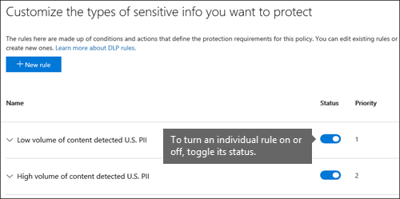

# Referens för dataförlustskydd

> [!IMPORTANT]
> Det här referensavsnittet är inte längre huvudresursen Microsoft 365 skydd mot dataförlust (DLP). DLP-innehållsuppsättningen uppdateras och struktureras om. Artiklarna i den här artikeln flyttas till nya, uppdaterade artiklar. Mer information om DLP finns i [Läs mer om skydd mot dataförlust.](dlp-learn-about-dlp.md)

<!-- this topic needs to be split into smaller, more coherent ones. It is confusing as it is. -->
<!-- move this note to a more appropriate place, no topic should start with a note -->
> [!NOTE]
> Funktioner för skydd mot dataförlust har nyligen lagts till i Microsoft Teams chatt- och kanalmeddelanden för användare som är licensierade för Office 365 Advanced Compliance, som är tillgängligt som ett fristående alternativ och ingår i Office 365 E5 och Microsoft 365 E5 Compliance. Mer information om licenskrav finns i [licensvägledning Microsoft 365 Tenant-Level Services Licensing Guidance](/office365/servicedescriptions/microsoft-365-service-descriptions/microsoft-365-tenantlevel-services-licensing-guidance).

<!-- MOVED TO LEARN ABOUT To comply with business standards and industry regulations, organizations must protect sensitive information and prevent its inadvertent disclosure. Sensitive information can include financial data or personally identifiable information (PII) such as credit card numbers, social security numbers, or health records. With a data loss prevention (DLP) policy in the Office 365 Security &amp; Compliance Center, you can identify, monitor, and automatically protect sensitive information across Office 365.

With a DLP policy, you can:

- **Identify sensitive information across many locations, such as Exchange Online, SharePoint Online, OneDrive for Business, and Microsoft Teams.**

    For example, you can identify any document containing a credit card number that's stored in any OneDrive for Business site, or you can monitor just the OneDrive sites of specific people.

- **Prevent the accidental sharing of sensitive information**.

    For example, you can identify any document or email containing a health record that's shared with people outside your organization, and then automatically block access to that document or block the email from being sent.

- **Monitor and protect sensitive information in the desktop versions of Excel, PowerPoint, and Word.**

    Just like in Exchange Online, SharePoint Online, and OneDrive for Business, these Office desktop programs include the same capabilities to identify sensitive information and apply DLP policies. DLP provides continuous monitoring when people share content in these Office programs.

- **Help users learn how to stay compliant without interrupting their workflow.**

    You can educate your users about DLP policies and help them remain compliant without blocking their work. For example, if a user tries to share a document containing sensitive information, a DLP policy can both send them an email notification and show them a policy tip in the context of the document library that allows them to override the policy if they have a business justification. The same policy tips also appear in Outlook on the web, Outlook, Excel, PowerPoint, and Word.

- **View DLP alerts and reports showing content that matches your organization’s DLP policies.**

    To view alerts and metadata related to your DLP policies you can use the [DLP Alerts Management Dashboard](dlp-configure-view-alerts-policies.md). You can also view policy match reports to assess how your organization is complying with a DLP policy. If a DLP policy allows users to override a policy tip and report a false positive, you can also view what users have reported

-->
## Skapa och hantera DLP-principer

Du skapar och hanterar DLP-principer på sidan Skydd mot dataförlust i Microsoft 365 Efterlevnadscenter.

<!-- MOVED TO LEARN ABOUT ## What a DLP policy contains

A DLP policy contains a few basic things:

- Where to protect the content: **locations** such as Exchange Online, SharePoint Online, and OneDrive for Business sites, as well as Microsoft Teams chat and channel messages.

- When and how to protect the content by enforcing **rules** comprised of:

  - **Conditions** the content must match before the rule is enforced. For example, a rule might be configured to look only for content containing Social Security numbers that's been shared with people outside your organization.

  - **Actions** that you want the rule to take automatically when content matching the conditions is found. For example, a rule might be configured to block access to a document and send both the user and compliance officer an email notification. -->

Du kan använda en regel för att uppfylla ett särskilt skyddskrav och sedan använda en DLP-princip för att gruppera samman vanliga skyddskrav, till exempel alla regler som krävs för att uppfylla en viss regel.

Du kan till exempel ha en DLP-princip som hjälper dig att identifiera förekomsten av information som omfattas av HIPAA (Health Insurance Portability and Accountability Act). Den här DLP-principen kan skydda HIPAA-data (vad) på alla SharePoint Online-webbplatser och alla OneDrive för företag-webbplatser (där) genom att hitta alla dokument som innehåller den här känsliga informationen som delas med personer utanför organisationen (villkoren) och sedan blockera åtkomsten till dokumentet och skicka ett meddelande (åtgärderna). Dessa krav lagras som enskilda regler och grupperas tillsammans som en DLP-princip för att förenkla hantering och rapportering.

<!-- MOVED TO LEARN ABOUT ### Locations

DLP policies are applied to sensitive items across Microsoft 365 locations and can be further scoped as detailed in this table.

|Location | Include/exclude by|
|---------|---------|
|Exchange email| distribution groups|
|SharePoint sites |sites |
|OneDrive accounts |accounts |
|Teams chat and channel messages |accounts |
|Windows 10 devices |user or group |
|Microsoft Cloud App Security |instance |
 -->

Om du väljer att inkludera specifika distributionsgrupper i Exchange omfattningen av DLP-principen endast till medlemmar i den gruppen. På samma sätt utesluter du en distributionsgrupp alla medlemmar i distributionsgruppen från principutvärderingen. Du kan välja att begränsa en princip till medlemmar i distributionslistor, dynamiska distributionsgrupper och säkerhetsgrupper. En DLP-princip får inte innehålla fler än 50 sådana inkludering och undantag.

Om du väljer att inkludera eller exkludera specifika SharePoint webbplatser kan en DLP-princip inte innehålla fler än 100 sådana inkludering och undantag. Även om den här gränsen finns kan du överskrida den här gränsen genom att använda en organisationsomfattande princip eller en princip som gäller för hela platser.

Om du väljer att inkludera eller exkludera specifika OneDrive-konton eller grupper kan en DLP-princip innehålla högst 100 användarkonton eller 50 grupper som inkludering eller undantag.

### Regler

> [!NOTE]
> När det inte finns någon konfigurerad avisering ska standardbeteendet för en DLP-princip vara att inte avisering eller utlösare. Det här gäller endast för standardinformationstyper. För anpassade informationstyper varnas systemet även om det inte finns någon definierad åtgärd i principen.

Regler är det som tillämpar affärskraven på organisationens innehåll. En princip innehåller en eller flera regler och varje regel består av villkor och åtgärder. När villkoren uppfylls för varje regel vidtas åtgärderna automatiskt. Regler körs sekventiellt och börjar med regeln med högst prioritet i varje princip.

En regel innehåller också alternativ för att meddela användare (med principtips och e-postaviseringar) och administratörer (med rapporter om e-posttillbud) som har matchat regeln.

Här är komponenterna i en regel, som förklaras nedan.

#### Villkor

Villkoren är viktiga eftersom de avgör vilka typer av information du letar efter och när de ska vidta en åtgärd. Du kan till exempel välja att ignorera innehåll som innehåller passnummer om inte innehållet innehåller fler än 10 sådana nummer och delas med personer utanför organisationen.

Villkor fokuserar **på innehållet,** t.ex. vilka typer av känslig information du letar efter, och även på **sammanhanget,** t.ex. vem dokumentet delas med. Du kan använda villkor för att tilldela olika åtgärder till olika risknivåer. Till exempel kan känsligt innehåll som delas internt vara en lägre risk och kräver färre åtgärder än känsligt innehåll som delas med personer utanför organisationen.

De tillgängliga villkoren kan avgöra om:

- Innehållet innehåller en typ av känslig information.

- Innehållet innehåller en etikett. Mer information finns i avsnittet Använda en bevarandeetikett som ett [villkor i en DLP-princip nedan.](#using-a-retention-label-as-a-condition-in-a-dlp-policy)

- Innehåll delas med personer utanför eller inom organisationen.

  > [!NOTE]
  > Användare som har icke-gästkonton i värdorganisationens Active Directory eller Azure Active Directory betraktas som personer i organisationen.

#### Typer av känslig information

Med en DLP-princip skyddar du känslig information som har definierats med en **typ av känslig information**. Microsoft 365 innehåller definitioner av vanliga typer av känslig information i många olika regioner som är färdiga att använda, till exempel kreditkortsnummer, bankkontonummer, nationella ID-nummer och passnummer.

När en DLP-princip söker efter en typ av känslig information, till exempel kreditkortsnummer, söker den inte bara efter ett nummer med 16 siffror. Varje typ av känslig information definieras och identifieras genom en kombination av följande:

- Nyckelord.

- Interna funktioner för att validera kontrollsummar eller sammansättning.

- Utvärdering av reguljära uttryck för att hitta mönstermatchningar.

- Andra innehållsundersökningar.

Det här hjälper DLP-identifiering att uppnå en hög grad av exakthet samtidigt som antalet falska positiva identifieringar som kan avbryta personers arbete minskar.

#### Åtgärder

När innehållet matchar ett villkor i en regel kan du använda åtgärder för att automatiskt skydda innehållet.

När åtgärderna är tillgängliga kan du göra följande:

- **Begränsa åtkomst till innehållet** Beroende på dina behov kan du begränsa åtkomsten till innehåll på tre sätt:

  1. Begränsa åtkomsten till innehåll för alla.
  2. Begränsa åtkomst till innehåll för personer utanför organisationen.
  3. Begränsa åtkomsten till Alla som har länken.

  För webbplatsinnehåll innebär det att behörigheterna för dokumentet är begränsade för alla utom den primära administratören för webbplatssamlingen, dokumentägaren och personen som senast ändrade dokumentet. De här personerna kan ta bort den känsliga informationen från dokumentet eller vidta andra åtgärder. När dokumentet uppfyller alla regler och regler återställs de ursprungliga behörigheterna automatiskt. När åtkomsten till ett dokument blockeras visas dokumentet med en särskild principtipsikon i biblioteket på webbplatsen.

  

  För e-postinnehåll blockerar den här åtgärden meddelandet från att skickas. Beroende på hur DLP-regeln har konfigurerats ser avsändaren en NDR-meddelande eller (om regeln använder ett meddelande) ett principtips och/eller ett e-postmeddelande.

  

#### Användarmeddelanden och åsidosättningar av användare

Du kan använda meddelanden och åsidosättningar för att informera användarna om DLP-principer och hjälpa dem att uppfylla alla regler utan att blockera deras arbete. Om en användare till exempel försöker dela ett dokument som innehåller känslig information kan en DLP-princip både skicka ett e-postmeddelande till dem och visa dem ett principtips inom ramen för dokumentbiblioteket som gör att de kan åsidosätta principen om de har en affärs-justering.

I e-postmeddelandet kan personen som skickade, delade eller senast ändrade innehållet meddelas och, för webbplatsinnehåll, den primära administratören för webbplatssamlingen och dokumentets ägare. Du kan dessutom lägga till eller ta bort vilka du vill i e-postmeddelandet.

Förutom att skicka ett e-postmeddelande visar en användare ett principtips:

- I Outlook och Outlook på webben.

- För dokumentet på en SharePoint Online eller OneDrive för företag webbplats.

- I Excel, PowerPoint och Word, när dokumentet lagras på en webbplats som ingår i en DLP-princip.

E-postmeddelandet och principtipset förklarar varför innehållet står i konflikt med en DLP-princip. Om du väljer kan e-postaviseringar och principtips tillåta användare att åsidosätta en regel genom att rapportera en felaktig positiv eller ange en affärs motivering. På så sätt kan du utbilda användarna om DLP-principerna och tillämpa dem utan att hindra personer från att göra sina arbeten. Information om åsidosättningar och falska positiva resultat loggas också för rapportering (se nedan om DLP-rapporter) och inkluderas i incidentrapporterna (nästa avsnitt), så att efterlevnadsombudet regelbundet kan granska den här informationen.

Så här ser ett principtips ut i ett OneDrive för företag konto.

 Mer information om användarmeddelanden och principtips i DLP-principer finns i [Använda meddelanden och principtips.](use-notifications-and-policy-tips.md)

#### Aviseringar och incidentrapporter

När en regel matchas kan du skicka ett e-postmeddelande med en avisering till efterlevnadsombudet (eller till valfri person) med information om aviseringen. Det här e-postmeddelandet med en länk till Instrumentpanelen för hantering av [DLP-aviseringar](dlp-configure-view-alerts-policies.md) som efterlevnadsombud kan gå till för att visa information om händelser och händelser. Instrumentpanelen innehåller information om händelsen som utlöste aviseringen tillsammans med information om matchad DLP-princip och vilket känsligt innehåll som upptäckts.

Dessutom kan du skicka en incidentrapport med information om händelsen. Den här rapporten innehåller information om det objekt som matchades, det faktiska innehållet som matchade regeln och namnet på den person som senast ändrade innehållet. För e-postmeddelanden innehåller rapporten också det ursprungliga meddelandet som matchar en DLP-princip som en bifogad fil.

> [!div class="mx-imgBorder"]
> 

DLP söker igenom e-post på ett annat sätt än objekten SharePoint online eller OneDrive för företag. I SharePoint Online OneDrive för företag genomsöker DLP både befintliga och nya objekt och genererar en avisering och incidentrapport när en matchning hittas. I Exchange Online söker DLP bara igenom nya e-postmeddelanden och genererar en rapport om det finns en principmatchning. DLP ***söker inte igenom*** eller matchar tidigare befintliga e-postobjekt som lagrats i en postlåda eller ett arkiv.

## Grupperingsoperatorer och logiska operatorer

Ofta har DLP-principen ett enkelt krav, till exempel att identifiera allt innehåll som innehåller ett amerikanskt personnummer. I andra fall kan dock DLP-principen behöva identifiera mer löst definierade data.

Om du till exempel vill identifiera innehåll som omfattas av U.S. Health Insurance Act (HIPAA) måste du leta efter:

- Innehåll som innehåller särskilda typer av känslig information, till exempel ett U.S. Social Security Number eller DeA (DeA).

    OCH

- Innehåll som är svårare att identifiera, till exempel kommunikation om en patientvård eller beskrivningar av medicinsk information. För att kunna identifiera det här innehållet krävs matchande nyckelord från mycket stora nyckelordslistor, till exempel den internationella klassificeringen av tidsklassificering (ICD-9 CM eller ICD-10-CM).

Du kan enkelt identifiera lösa data med hjälp av grupperingsoperatorer och logiska operatorer (OCH, ELLER). När du skapar en DLP-princip kan du:

- Gruppera typer av känslig information.

- Välj den logiska operatorn mellan typerna av känslig information i en grupp och mellan grupperna.

### Välja operator inom en grupp

Inom en grupp kan du välja om något eller samtliga av villkoren i gruppen ska vara uppfyllda för att innehållet ska matcha regeln.

### Lägga till en grupp

Du kan snabbt lägga till en grupp, som kan ha egna villkor och operatorer inom den gruppen.

### Välja operator mellan grupper

Mellan grupper kan du välja om villkoren i bara en grupp eller alla grupper ska vara uppfyllda för att innehållet ska matcha regeln.

Den inbyggda amerikanska **HIPAA-policyn** har till exempel en regel som använder en **OCH-operator** mellan grupperna så att den identifierar innehåll som innehåller:

- från gruppens **PII-identifierare** (minst ett SSN-nummer **ELLER** DEA-nummer)

    **OCH**

- från gruppens **medicinska villkor** (minst ett ICD-9-CM-nyckelord **ELLER** ICD-10-CM-nyckelord)

## Prioritet som regler bearbetas med

När du skapar regler i en princip tilldelas varje regel prioritet i den ordning som den skapas, det vill säga att den regel som skapas först har första prioritet, den regel som skapas först har den andra prioriteten och så vidare.

> [!div class="mx-imgBorder"]
> 

När du har konfigurerat fler än en DLP-princip kan du ändra prioriteten för en eller flera principer. Det gör du genom att välja en princip, **välja Redigera** princip och ange **prioritet i** listan Prioritet.

> [!div class="mx-imgBorder"]
> 

När innehåll utvärderas mot regler bearbetas reglerna i prioritetsordning. Om innehållet matchar flera regler bearbetas reglerna i prioritetsordning och den mest restriktiva åtgärden tillämpas. Om innehållet till exempel matchar alla följande regler tillämpas regel 3 eftersom den har högsta prioritet och mest restriktiv regel:

- Regel 1: Endast meddelar användarna

- Regel 2: Meddelar användarna, begränsar åtkomsten och tillåter att användaren åsidosätter

- Regel 3: Meddelar användarna, begränsar åtkomsten och tillåter inte åsidosättningar av användare

- Regel 4: Meddelar endast användarna

- Regel 5: Begränsar åtkomsten

- Regel 6: Meddelar användare, begränsar åtkomsten och tillåter inte åsidosättningar av användare

I det här exemplet registreras matchningar för alla regler i granskningsloggarna och visas i DLP-rapporterna, även om endast den mest restriktiva regeln tillämpas.

Observera följande när det gäller policytips:

- Endast principtipset med högst prioritet, den mest restriktiva regeln visas. Till exempel kommer ett principtips från en regel som blockerar åtkomst till innehåll att visas över ett principtips från en regel som helt enkelt skickar ett meddelande. Det gör att det inte går att se en störtlapp av principtips.

- Om principtipset i den mest restriktiva regeln tillåter att användare åsidosätter regeln åsidosätter den här regeln även eventuella andra regler som det matchade innehållet.

## Justera regler så att de blir lättare eller svårare att matcha

När användare skapar och aktiverar sina DLP-principer kan de ibland få följande problem:

- För mycket innehåll som **inte är** känslig information matchar reglerna, med andra ord för många falska positiva resultat.

- För lite innehåll som **är känslig** information matchar reglerna. Skyddsåtgärder upprätthålls alltså inte för den känsliga informationen.

För att åtgärda dessa problem kan du justera reglerna genom att justera antalet förekomster och matchningsprecisionen för att göra det svårare eller enklare för innehållet att matcha reglerna. Varje typ av känslig information som används i en regel har både antal förekomster och matchningsprecision.

### Antal instanser

Antal förekomster innebär bara hur många förekomster av en viss typ av känslig information som måste finnas för att innehållet ska matcha regeln. Innehåll matchar till exempel regeln nedan om mellan 1 och 9 unika usa eller Storbritannien. passnummer identifieras.

> [!NOTE]
> Antalet förekomster omfattar endast **unika matchningar** för typer av känslig information och nyckelord. Om ett e-postmeddelande till exempel innehåller 10 förekomster av samma kreditkortsnummer räknas dessa tio förekomster som en enskild förekomst av ett kreditkortsnummer.

Om du vill använda antal instanser för att finjustera regler är vägledningen enkel:

- För att regeln ska bli lättare att matcha minskar du **minantalet** och/eller ökar **maxantalet.** Du kan också ange **maxvärdet** för **ett värde genom** att ta bort det numeriska värdet.

- Öka minantalet för att regeln ska bli svårare **att matcha.**

Vanligtvis använder du mindre restriktiva åtgärder, till exempel att skicka användarmeddelanden, i en regel med ett lägre antal instanser (till exempel 1–9). Och du använder mer restriktiva åtgärder, till exempel att begränsa åtkomsten till innehåll utan att tillåta åsidosättningar av användare, i en regel med ett högre antal förekomster (till exempel 10-alla).

### Matchningsprecision

Enligt beskrivningen ovan definieras och identifieras en typ av känslig information genom en kombination av olika typer av bevis. En typ av känslig information definieras ofta av flera sådana kombinationer, så kallade mönster. Ett mönster som kräver mindre bevis har en lägre matchningsprecision (eller konfidensnivå), medan ett mönster som kräver fler bevis har högre matchningsprecision (eller konfidensnivå). Mer information om de faktiska mönster och konfidensnivåer som används av alla typer av känslig information finns i Definitioner av [typ av känslig information.](sensitive-information-type-entity-definitions.md)

Den typ av känslig information som heter Kreditkortsnummer definieras till exempel med två mönster:

- Ett mönster med 65 % konfidens som kräver:

  - Ett tal i ett kreditkortsnummer.

  - Ett tal som klarar kontrollsumman.

- Ett mönster med 85 % säkerhet som kräver:

  - Ett tal i ett kreditkortsnummer.

  - Ett tal som klarar kontrollsumman.

  - Ett nyckelord eller ett utgångsdatum i rätt format.

Du kan använda dessa konfidensnivåer (eller matchningsprecision) i reglerna. Vanligtvis använder du mindre restriktiva åtgärder, till exempel att skicka användarmeddelanden, i en regel med lägre matchningsprecision. Och du använder mer restriktiva åtgärder, till exempel att begränsa åtkomsten till innehåll utan att tillåta åsidosättningar av användare, i en regel med högre matchningsprecision.

Det är viktigt att förstå att när en viss typ av känslig information, t.ex. kreditkortsnummer, identifieras i innehåll returneras bara ett enda konfidensnivå:

- Om alla matchningar gäller för ett enda mönster returneras konfidensnivån för det mönstret.

- Om det finns matchningar för fler än ett mönster (det vill säga det finns matchningar med två olika konfidensnivåer), returneras en konfidensnivå som är högre än något av de enskilda mönsteren. Det här är den knepiga delen. Om både 65 % och 85 % mönster matchas för ett kreditkort, är den konfidensnivå som returneras för den känsliga informationstypen större än 90 % eftersom fler bevis innebär mer förtroende.

Så om du vill skapa två ömsesidigt uteslutande regler för kreditkort, en för 65 % matchningsprecision och en för 85 % matchningsprecision, skulle intervallen för matchningsprecision se ut så här. Den första regeln tar endast upp matchningar för mönstret på 65 %. Den andra regeln tar upp matchningar **med minst en** matchning på 85 % och kan potentiellt ha andra matchningar med lägre förtroende. 

Därför är vägledningen för att skapa regler med olika matchningsprecision:

- Den lägsta konfidensnivån använder vanligtvis samma värde för **min och** **max** (inte ett intervall).

- Den högsta konfidensnivån är vanligtvis ett intervall från strax över den lägre konfidensnivån till 100.

- Konfidensnivåer mellan konfidensnivåer ligger normalt strax över den lägre konfidensnivån till strax under den högre konfidensnivån.

## Använda en kvarhållningsetikett som ett villkor i en DLP-princip

När du använder en tidigare skapad och publicerad [bevarandeetikett](retention.md#retention-labels) som ett villkor i en DLP-princip finns det några saker du bör känna till:

- Bevarandeetiketten måste skapas och publiceras innan du kan använda den som ett villkor i en DLP-princip.
- Publicerade bevarandeetiketter kan ta från en till sju dagar att synkronisera. Mer information finns  i När bevarandeetiketter blir tillgängliga för bevarandeetiketter som publiceras i en bevarandeprincip och Hur lång tid det tar för de bevarandeetiketter som publiceras automatiskt att gälla. 
- Bevarandeetiketter stöds bara för objekt i SharePoint och OneDrive***.

  

  Du kanske vill använda en bevarandeetikett i en DLP-princip om det finns objekt som ligger under bevarande och disposition, och du även vill tillämpa andra kontroller på dem, till exempel:

  - Du publicerade en bevarandeetikett med namnet Moms **år 2018,** som när den används för skattedokument från 2018 som lagras i SharePoint behåller dem i 10 år. Du vill inte heller att de objekten ska delas utanför organisationen, vilket du kan göra med en DLP-princip.

  > [!IMPORTANT]
  > Det här felmeddelandet visas om du anger en bevarandeetikett som ett villkor i en DLP-princip och du även tar med Exchange och/eller Teams som en plats: "Skydda märkt innehåll i e-postmeddelanden och gruppmeddelanden stöds **inte. Ta antingen bort etiketten nedan eller inaktivera Exchange och Teams som en plats".** Det beror på Exchange transport inte utvärderar etikettmetadata vid sändning och leverans av meddelanden.

### Använda en känslighetsetikett som ett villkor i en DLP-princip

[Läs mer](./dlp-sensitivity-label-as-condition.md) om att använda känslighetsetikett som ett villkor i DLP-principer.

### Hur den här funktionen relaterar till andra funktioner

Flera funktioner kan användas på innehåll som innehåller känslig information:

- [Bevarandeetiketter och bevarandeprinciper kan](retention.md) både tillämpa **bevarandeåtgärder** på innehållet.

- En DLP-princip kan tillämpa **skyddsåtgärder** på det här innehållet. Innan dessa åtgärder framtvingas kan en DLP-princip kräva att andra villkor uppfylls utöver det innehåll som innehåller en etikett.

Observera att en DLP-princip har bättre identifieringsfunktioner än en etikett- eller kvarhållningsprincip som används för känslig information. En DLP-princip kan tillämpa skyddsåtgärder för innehåll som innehåller känslig information och om den känsliga informationen tas bort från innehållet ångras skyddsåtgärderna nästa gång innehållet genomsöks. Men om en bevarandeprincip eller etikett används på innehåll som innehåller känslig information är det en enda åtgärd som inte kan ångras även om den känsliga informationen tas bort.

Genom att använda en etikett som ett villkor i en DLP-princip kan du tillämpa både bevarande- och skyddsåtgärder på innehåll med den etiketten. Du kan tänka på innehåll som innehåller en etikett exakt som innehåll som innehåller känslig information – både en etikett och en typ av känslig information används för att klassificera innehåll, så att du kan tillämpa åtgärder på innehållet.

## Enkla inställningar jämfört med avancerade inställningar

När du skapar en DLP-princip väljer du mellan enkla eller avancerade inställningar:

- **Med enkla** inställningar är det enkelt att skapa den vanligaste typen av DLP-princip utan att använda regelredigeraren för att skapa eller ändra regler.

- **Avancerade inställningar** använder regelredigeraren för att ge dig fullständig kontroll över alla inställningar för DLP-principen.

Men oroa dig inte. Enkla inställningar och avancerade inställningar fungerar på exakt samma sätt under tvingande regler som utgörs av villkor och åtgärder, men med enkla inställningar visas inte regelredigeraren. Det är ett snabbt sätt att skapa en DLP-princip.

### Enkla inställningar

Det vanligaste DLP-scenariot är att skapa en princip som hjälper till att skydda innehåll som innehåller känslig information från att delas med personer utanför organisationen, och vidta en automatisk åtgärd, till exempel att begränsa vem som kan komma åt innehållet, skicka meddelanden till slutanvändaren eller administratörer och granska händelsen för senare undersökning. Användare använder DLP för att förhindra att känslig information oavsiktligt delar på informationen.

Om du vill göra det enklare att uppnå detta mål kan du när du skapar en DLP-princip **välja Använd enkla inställningar.** Med de här inställningarna får du allt du behöver för att implementera den vanligaste DLP-principen utan att behöva gå in i regelredigeraren.

### Avancerade inställningar

Om du behöver skapa mer anpassade DLP-principer kan du välja **Använd avancerade inställningar.**

I de avancerade inställningarna visas regelredigeraren, där du har full kontroll över alla möjliga alternativ, inklusive antal förekomster och matchning av noggrannhet (konfidensnivå) för varje regel.

Om du snabbt vill hoppa till ett avsnitt klickar du på ett objekt i det övre navigeringsfältet i regelredigeraren för att gå till avsnittet nedan.

## DLP-principmallar

Det första steget när du skapar en DLP-princip är att välja vilken information som ska skyddas. Genom att börja med en DLP-mall sparar du arbetet med att skapa en ny uppsättning regler från grunden och ta reda på vilka typer av information som ska ingå som standard. Du kan sedan lägga till eller ändra dessa krav för att finjustera regeln så att den uppfyller organisationens specifika krav.

En förkonfigurerad DLP-principmall kan hjälpa dig att identifiera särskilda typer av känslig information, t.ex. HIPAA-data, PENO-DSS-data, Gramm-Leach-Bliley Act-data eller till och med språkspecifik personligt identifierbar information (P.I.). För att göra det enkelt för dig att hitta och skydda vanliga typer av känslig information innehåller principmallarna i Microsoft 365 redan de vanligaste typerna av känslig information så att du kan komma igång.

Organisationen kan också ha egna specifika krav. I sådana fall kan du skapa en DLP-princip från grunden genom att välja **alternativet Anpassad** princip. En anpassad princip är tom och innehåller inga förinmade regler.

<!-- ## Roll out DLP policies gradually with test mode

rehomed to Plan for DLP

When you create your DLP policies, you should consider rolling them out gradually to assess their impact and test their effectiveness before fully enforcing them. For example, you don't want a new DLP policy to unintentionally block access to thousands of documents that people require access to in order to get their work done.

If you're creating DLP policies with a large potential impact, we recommend following this sequence:

1. **Start in test mode without Policy Tips** and then use the DLP reports and any incident reports to assess the impact. You can use DLP reports to view the number, location, type, and severity of policy matches. Based on the results, you can fine tune the rules as needed. In test mode, DLP policies will not impact the productivity of people working in your organization.

2. **Move to Test mode with notifications and Policy Tips** so that you can begin to teach users about your compliance policies and prepare them for the rules that are going to be applied. At this stage, you can also ask users to report false positives so that you can further refine the rules.

3. **Start full enforcement on the policies** so that the actions in the rules are applied and the content's protected. Continue to monitor the DLP reports and any incident reports or notifications to make sure that the results are what you intend.

    

    You can turn off a DLP policy at any time, which affects all rules in the policy. However, each rule can also be turned off individually by toggling its status in the rule editor.

    

    You can also change the priority of multiple rules in a policy. To do that, open a policy for editing. In a row for a rule, choose the ellipses (**...**), and then choose an option, such as **Move down** or **Bring to last**.

    > [!div class="mx-imgBorder"]
    > -->

## DLP-rapporter

När du har skapat och aktiverar DLP-principerna ska du kontrollera att de fungerar som du tänkt dig och hjälpa dig att uppfylla kraven. Med DLP-rapporter kan du snabbt se antalet matchningar och matchningar av DLP-regler över tid och antalet felaktiga matchningar och åsidosättanden. För varje rapport kan du filtrera matchningarna efter plats, tidsram och till och med begränsa det till en viss princip, regel eller åtgärd.

Med DLP-rapporterna kan du få affärsinsikter och:

- Fokusera på vissa tidsperioder och förstå orsakerna till toppar och trender.

- Upptäck affärsprocesser som strider mot organisationens efterlevnadsprinciper.

- Förstå alla affärseffekter i DLP-principerna.

Du kan dessutom använda DLP-rapporterna för att finjustera DLP-principerna när du kör dem.

## Så här fungerar DLP-principer

DLP identifierar känslig information med hjälp av djup innehållsanalys (inte bara en enkel genomsökning av text). Den djupa innehållsanalysen använder matchningar för nyckelord, matchningar i ordlistor, utvärdering av reguljära uttryck, interna funktioner och andra metoder för att identifiera innehåll som matchar dina DLP-principer. Potentiellt sett är endast en liten procentandel av alla data att betrakta som känsliga. En DLP-princip kan automatiskt identifiera, övervaka och skydda endast dessa data, utan att påverka eller påverka personer som arbetar med resten av innehållet.

### Principer synkroniseras

När du har skapat en DLP-princip i Säkerhetsefterlevnadscenter lagras den i en central principkälla och synkroniseras sedan med de olika &amp; innehållskällorna, till exempel:

- Exchange Online och därifrån till Outlook på webben och Outlook.

- OneDrive för företag webbplatser.

- SharePoint Onlinewebbplatser.

- Office -skrivbordsprogram (Excel, PowerPoint och Word).

- Microsoft Teams kanaler och chattmeddelanden.

När principen har synkroniserats till rätt platser börjar den utvärdera innehåll och tillämpa åtgärder.
<!-- what is the time delay for first deployment of a policy and what is the sync schedule? -->

### Principutvärderingar i OneDrive för företag och SharePoint onlinewebbplatser

I alla SharePoint Online-webbplatser och OneDrive för företag ändras ändras dokumenten kontinuerligt – de skapas, redigeras, delas och så vidare. Det innebär att dokumenten när som helst kan gå i konflikt med eller bli kompatibla med en DLP-princip. En person kan till exempel ladda upp ett dokument som inte innehåller någon känslig information på gruppwebbplatsen, men någon annan person kan senare redigera samma dokument och lägga till känslig information i det.

Därför söker DLP-principerna igenom dokument ofta i bakgrunden efter principmatchning. Tänk på det som en asynkron principutvärdering.
<!-- what is the frequency? looks like it is tied to the search crawl schedule -->

#### Så här fungerar det

När andra lägger till eller ändrar dokument på sina webbplatser söker sökmotor igenom innehållet så att du kan söka efter det senare. När detta händer genomsöks även innehållet efter känslig information och för att kontrollera om det delas. Känslig information som hittas lagras på ett säkert sätt i sökindexet, så att bara efterlevnadsteamet kan komma åt den, men inte vanliga användare. Varje DLP-princip som du har aktiverat körs i bakgrunden (asynkront), söker ofta efter innehåll som matchar en princip och tillämpar åtgärder för att skydda den från oavsiktliga läckor.

<!-- conflict with a DLP policy is bad wording -->
Slutligen kan dokument vara i konflikt med en DLP-princip, men de kan också bli kompatibla med en DLP-princip. Om en person lägger till kreditkortsnummer i ett dokument kan det leda till att åtkomsten till dokumentet blockeras automatiskt av DLP-principen. Men om personen senare tar bort den känsliga informationen ångras åtgärden (i det här fallet blockeringen) automatiskt nästa gång dokumentet utvärderas mot principen.

DLP utvärderar allt innehåll som kan indexeras. Mer information om vilka filtyper som crawlas som standard finns i Filnamnstillägg som crawlas som standard och filtyper som [analyseras i SharePoint Server.](/SharePoint/technical-reference/default-crawled-file-name-extensions-and-parsed-file-types)

> [!NOTE]
> För att förhindra att dokument delas innan DLP-principerna kunde analyseras kan delning av nya filer i SharePoint blockeras tills dess innehåll har indexerats. Mer information [finns i Markera nya filer som känsliga som](/sharepoint/sensitive-by-default) standard.

### Principutvärderingar i Exchange Online, Outlook och Outlook på webben

När du skapar en DLP-princip som innehåller Exchange Online som en plats synkroniseras principen från säkerhetsefterlevnadscentret för Office 365 till Exchange Online och sedan från Exchange Online till &amp; Outlook på webben och Outlook.

När ett meddelande skapas i Outlook kan användaren se principtips när innehållet som skapas utvärderas mot DLP-principer. När ett meddelande har skickats utvärderas det mot DLP-principer som en normal del av e-postflödet, tillsammans med Exchange-e-postflödesregler (kallas även transportregler) och DLP-principer som skapats i Exchange-administrationscentret. DLP-principer söker igenom både meddelandet och eventuella bifogade filer.

### Principutvärdering i Office skrivbordsprogram

<!-- same capability to identify sensitive information line conflates sensitive information types and such -->
Excel, PowerPoint och Word har samma funktion för att identifiera känslig information och använda DLP-principer som SharePoint Online och OneDrive för företag. Dessa Office-program synkroniserar sina DLP-principer direkt från det centrala principarkivet och utvärderar sedan kontinuerligt innehållet mot DLP-principerna när personer arbetar med dokument som öppnas från en webbplats som ingår i en DLP-princip.

Utvärdering av DLP-Office i Office har utformats för att inte påverka programs prestanda eller produktiviteten för personer som arbetar med innehåll. Om användaren arbetar med ett stort dokument eller om användarens dator är upptagen kan det ta några sekunder innan ett principtips visas.

### Principutvärdering i Microsoft Teams
 <!--what do you mean that it's synched to user accounts?  I thought DLP policies were applied to locations not users like sensitivity labels are  -->

När du skapar en DLP-princip som innehåller Microsoft Teams som en plats synkroniseras principen från säkerhetsefterlevnadscentret för Office 365 till användarkonton och Microsoft Teams kanaler och &amp; chattmeddelanden. När någon försöker dela känslig information i ett Microsoft Teams-chatt- eller kanalmeddelande kan meddelandet blockeras eller återkallas, beroende på hur DLP-principerna är konfigurerade. Och dokument som innehåller känslig information och som delas med gäster (externa användare) öppnas inte för dessa användare. Mer information finns i [Skydd mot dataförlust och Microsoft Teams.](dlp-microsoft-teams.md)

## Behörigheter

Som standard får globala administratörer, säkerhetsadministratörer och efterlevnadsadministratörer åtkomst till att skapa och tillämpa en DLP-princip. Andra medlemmar i efterlevnadsteamet som skapar DLP-principer behöver behörighet till &amp; Säkerhetsefterlevnadscenter. Som standard har din innehavaradministratör åtkomst till den här platsen och kan ge efterlevnadsansvariga och andra personer tillgång till Säkerhetsefterlevnadscenter, utan att ge dem alla behörigheter som en administratör &amp; för klientorganisationen har. För att göra det rekommenderar vi att du:

1. Skapa en grupp i Microsoft 365 och lägg till efterlevnadsansvariga i den.

2. Skapa en rollgrupp på **sidan Behörigheter** i &amp; Säkerhetsefterlevnad.

3. När du skapar rollgruppen använder du **avsnittet Välj roller** för att lägga till följande roll i rollgruppen: **DLP-efterlevnadshantering.**

4. Använd avsnittet **Välj medlemmar** för att lägga till Microsoft 365 grupp som du skapade före i rollgruppen.

Du kan också skapa en rollgrupp med endast visningsbehörighet för DLP-principerna och DLP-rapporter genom att ge rollen **Endast visa-efterlevnadshantering för DLP.**

Mer information finns i [Ge användarna tillgång till Office 365 kompatibilitetscenter.](../security/office-365-security/grant-access-to-the-security-and-compliance-center.md)

De här behörigheterna krävs endast för att skapa och tillämpa en DLP-princip. Tillämpning av policyer kräver inte åtkomst till innehållet.

## Hitta DLP-cmdlet:arna

Om du vill använda de flesta cmdlets för &amp; Säkerhetsefterlevnadscenter måste du:

1. [Anslut till Office 365 säkerhet &amp; Efterlevnadscenter med fjärr-PowerShell.](/powershell/exchange/connect-to-scc-powershell)

2. Använd någon av dessa [cmdlets med policy-and-compliance-dlp.](/powershell/module/exchange/export-dlppolicycollection)

Men DLP-rapporter behöver hämta data från hela Microsoft 365, inklusive Exchange Online. Därför är **cmdlet:arna för DLP-rapporterna tillgängliga i Exchange Online Powershell – inte i Powershell för &amp; säkerhetsefterlevnad.** Om du vill använda cmdlet:ar för DLP-rapporterna måste du därför:

1. [Ansluta till Exchange Online med fjärr-PowerShell](/powershell/exchange/connect-to-exchange-online-powershell).

2. Använd någon av följande cmdlets för DLP-rapporter:

    - [Get-DlpDetectionsReport](/powershell/module/exchange/Get-DlpDetectionsReport)

    - [Get-DlpDetailReport](/powershell/module/exchange/Get-DlpDetailReport)

## Mer information

- [Skapa en DLP-princip från en mall](create-a-dlp-policy-from-a-template.md)

- [Skicka meddelanden och visa principtips för DLP-principer](use-notifications-and-policy-tips.md)

- [Skapa en DLP-princip för att skydda dokument med FCI eller andra egenskaper](protect-documents-that-have-fci-or-other-properties.md)

- [Det här innehåller DLP-principmallarna](what-the-dlp-policy-templates-include.md)

- [Entitetsdefinitioner för typer av känslig information](sensitive-information-type-entity-definitions.md)

- [Vad DLP-funktionerna letar efter](what-the-dlp-functions-look-for.md)

- [Skapa en anpassad känslig informationstyp](create-a-custom-sensitive-information-type.md)
