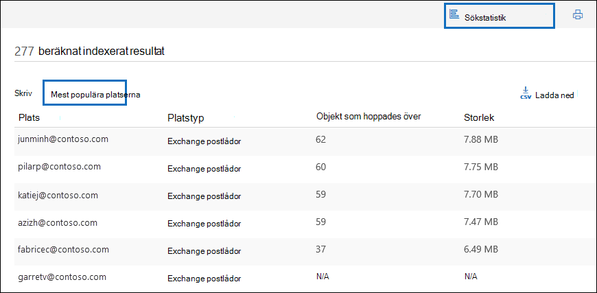

# eDiscovery-lösningsserie: Scenario för data spill – sökning och rensning

 **Vad är data spill och varför ska du bry dig?** Spill av data inges när ett konfidentiellt dokument släpps i en miljö som inte är betrodd. När ett data spillhändelse upptäcks är det viktigt att snabbt bedöma storleken och placeringen av spillet, undersöka användaraktiviteter runt det och sedan permanent rensa ut spilldata från systemet. 
  
## Scenario: Data spill

Du är säkerhetsansvarig på Contoso. Du informeras om en data spillsituation där en anställd, som tidigare delat ett konfidentiellt dokument med flera personer, har delats via e-post. Du vill snabbt bedöma vilka som fått det här dokumentet internt och externt. När de har identifierats vill du dela ärenderesultat med andra fall att granska och sedan permanent ta bort data från Office 365. När undersökningen är klar vill du generera en rapport med bevis för permanent borttagning och annan ärendeinformation för framtida referens.
  
### Den här artikelns omfattning

Det här dokumentet innehåller en lista med instruktioner om hur du tar bort ett meddelande permanent från Microsoft 365 så att det inte går att komma åt eller återställa det. Om du vill ta bort ett meddelande och göra det återställningsbart tills bevarandeperioden för borttagna objekt löper ut kan du gå till Söka efter och ta bort [e-postmeddelanden i organisationen.](search-for-and-delete-messages-in-your-organization.md)
  
## Arbetsflöde för hantering av data spilltillbud

Så här hanterar du ett data spillhändelse:

  
[(Valfritt) Steg 1: Hantera vem som kan komma åt ärendet och ange efterlevnadsgränser](#optional-step-1-manage-who-can-access-the-case-and-set-compliance-boundaries) 
[Steg 2: Skapa ett eDiscovery-ärende](#step-2-create-an-ediscovery-case) 
[Steg 3: Sök efter data som har spillts](#step-3-search-for-the-spilled-data) 
[Steg 4: Granska och validera fallresultat](#step-4-review-and-validate-case-findings) 
[Steg 5: Använd meddelandespårningslogg för att kontrollera hur spillda data har delats](#step-5-use-message-trace-log-to-check-how-spilled-data-was-shared) 
[Steg 6: Förbereda postlådorna](#step-6-prepare-the-mailboxes) 
[Steg 7: Ta bort data som har spillts permanent](#step-7-permanently-delete-the-spilled-data) 
[Steg 8: Verifiera, ange ett bevis för borttagning och granskning](#step-8-verify-provide-a-proof-of-deletion-and-audit) 

## Bra att veta innan du börjar

- När en postlåda är undantaget finns ett borttaget meddelande kvar i mappen Återställningsbara objekt tills bevarandetiden löper ut eller när undantaget släpps. [Steg 6](#step-6-prepare-the-mailboxes) beskriver hur du tar bort isen från postlådorna. Kontrollera med din hantering av arkivhandlingar eller juridiska avdelningar innan du tar bort krysset. Organisationen kan ha en princip som definierar om en postlåda som är väntad eller ett data spill har prioritet. 
    
- Om du vill styra vilka användarpostlådor en data spillande kan söka och hantera vem som kan komma åt ärendet, kan du konfigurera efterlevnadsgränser och skapa en anpassad rollgrupp, som beskrivs i steg [1.](#optional-step-1-manage-who-can-access-the-case-and-set-compliance-boundaries) För att göra det måste du vara medlem i rollgruppen Organisationshantering eller ha rollen rollhantering. Om du eller administratören i organisationen redan har angett efterlevnadsgränser kan du hoppa över steg 1.
    
- Om du vill skapa ett ärende måste du vara medlem i rollgruppen för eDiscovery-hanteraren eller vara medlem i en anpassad rollgrupp som har tilldelats rollen Ärendehantering. Om du inte är medlem kan du be en Microsoft 365 att lägga till dig i [rollgruppen för eDiscovery-hanteraren.](assign-ediscovery-permissions.md)
    
- Om du vill skapa och köra en innehållssökning måste du vara medlem i rollgruppen eDiscovery Manager eller ha tilldelats hanteringsrollen för efterlevnadssökning. Om du vill ta bort meddelanden måste du vara medlem i rollgruppen Organisationshantering eller ha tilldelats hanteringsrollen för sökning och rensning. Mer information om hur du lägger till användare i en rollgrupp finns i [Tilldela eDiscovery-behörigheter i Säkerhets- och efterlevnadscenter](./assign-ediscovery-permissions.md).
    
- Om du vill söka i eDiscovery-aktiviteter för granskningsloggen i steg 8 måste granskning vara aktiverad för din organisation. Du kan söka efter aktiviteter som har utförts under de senaste 90 dagarna. Mer information om hur du aktiverar och använder granskning finns i [avsnittet Granska undersökningen](#auditing-the-data-spillage-investigation-process) om data spill i steg 8. 
    
## (Valfritt) Steg 1: Hantera vem som kan komma åt ärendet och ange efterlevnadsgränser

Beroende på din organisations övning behöver du kontrollera vem som kan komma åt eDiscovery-ärendet som används för att undersöka data spill och konfigurera efterlevnadsgränser. Det enklaste sättet att göra det är att lägga till rollgruppen som medlemmar i en befintlig rollgrupp i Säkerhets- & och efterlevnadscenter och sedan lägga till rollgruppen som medlem i eDiscovery-ärendet. Mer information om de inbyggda rollgrupperna för eDiscovery och hur du lägger till medlemmar i ett eDiscovery-fall finns i [Tilldela eDiscovery-behörigheter.](assign-ediscovery-permissions.md)
  
Du kan också skapa en ny rollgrupp som passar organisationens behov. Du kanske till exempel vill att en grupp data spiller i organisationen ska kunna komma åt och samarbeta om alla fall av data spill. Det kan du göra genom att skapa rollgruppen "Data spill och fall", tilldela rätt roller (Exportera, RMS-dekryptera, granska, förhandsgranska, efterlevnadssökning och ärendehantering), lägga till data spill från rollgruppen och sedan lägga till rollgruppen som medlem i eDiscovery-fall för data spill. I [Konfigurera efterlevnadsgränser för eDiscovery-undersökningar i Office 365](tagging-and-assessment-in-advanced-ediscovery.md) för detaljerade anvisningar om hur du gör detta. 
  
## Steg 2: Skapa ett eDiscovery-ärende

Ett eDiscovery-ärende är ett effektivt sätt att hantera undersökning av data spill. Du kan lägga till medlemmar i rollgruppen som du skapade i steg 1, lägga till rollgruppen som medlem i ett nytt eDiscovery-ärende, utföra iterativa sökningar för att hitta data som har spillts, exportera en rapport för att dela, spåra ärendets status och sedan gå tillbaka till information om ärendet om det behövs. Överväg att upprätta en namngivningskonvention för eDiscovery-ärenden som används för data spillärenden, och ange så mycket information som du kan i ärendets namn och beskrivning så att du kan hitta och referera till i framtiden om det behövs.
  
Om du vill skapa ett nytt ärende kan du använda eDiscovery i säkerhets- och efterlevnadscentret. Se "Skapa ett nytt ärende" i [Komma igång med Core eDiscovery](get-started-core-ediscovery.md#step-3-create-a-core-ediscovery-case).
  
## Steg 3: Sök efter data som har spillts

Nu när du har skapat ett ärende och hanterad åtkomst kan du använda ärendet för att iterativt söka efter spilldata och identifiera postlådorna som innehåller de spillta data. Du använder samma sökfråga som du använde för att hitta e-postmeddelanden för att ta bort samma meddelanden i [steg 7.](#step-7-permanently-delete-the-spilled-data)
  
Om du vill skapa en innehållssökning kopplad till ett e-dataidentifieringsfall kan du gå till Söka efter innehåll i [ett grundläggande eDiscovery-ärende.](search-for-content-in-core-ediscovery.md)
  
> [!IMPORTANT]
> De nyckelord som du använder i sökfrågan kan innehålla de faktiska spilldata som du söker efter. Om du till exempel söker efter dokument som innehåller ett personnummer och använder det som sökord måste du ta bort frågan efteråt för att undvika ytterligare spill. Se [Ta bort sökfrågan](#deleting-the-search-query) i steg 8.
  
## Steg 4: Granska och validera fallresultat

När du har skapat en innehållssökning måste du granska och verifiera att sökresultaten och kontrollera att de endast består av de e-postmeddelanden som måste tas bort. I en innehållssökning kan du förhandsgranska ett slumpmässigt urval av 1 000 e-postmeddelanden utan att exportera sökresultaten för att undvika ytterligare data spill. Du kan läsa mer om förhandsgranskningsbegränsningarna [i Begränsningar för innehållssökning.](limits-for-content-search.md)
  
Om du har fler än 1 000 postlådor eller fler än 100 e-postmeddelanden per postlåda som ska granskas kan du dela upp den första sökningen i flera sökningar genom att använda ytterligare nyckelord eller villkor som datumintervall eller avsändare/mottagare och granska resultaten för varje sökning individuellt. Notera alla sökfrågor som du ska använda när du tar bort meddelanden i [steg 7.](#step-7-permanently-delete-the-spilled-data)

Om en vårdnadshavare eller slutanvändare tilldelas en Office 365 E5-licens kan du undersöka upp till 10 000 sökresultat samtidigt med hjälp av Advanced eDiscovery. Om det finns fler än 10 000 e-postmeddelanden att granska kan du dela sökfrågan efter datumintervall och granska varje resultat individuellt allt eftersom sökresultat sorteras efter datum. I Advanced eDiscovery kan du tagga sökresultat  med hjälp av funktionen Etikett som i förhandsgranskningspanelen och filtrera sökresultatet efter taggen du märka. Det här är användbart när du samarbetar med en sekundär granskare. Genom att använda ytterligare analysverktyg i Advanced eDiscovery, till exempel optisk teckenigenkänning, e-posttrådning och förutsägelsekodning, kan du snabbt bearbeta och granska tusentals meddelanden och tagga dem för ytterligare granskning. Se [Snabbinstallation för Advanced eDiscovery](./get-started-with-advanced-ediscovery.md).

När du hittar ett e-postmeddelande som innehåller data som har spillts kontrollerar du om meddelandets mottagare har delats externt. Om du vill spåra ett meddelande ytterligare kan du samla in avsändarinformation och datumintervall så att du kan använda meddelandespårningsloggarna. Den här processen beskrivs i [steg 5.](#step-5-use-message-trace-log-to-check-how-spilled-data-was-shared)

När du har verifierat sökresultaten kanske du vill dela resultaten med andra för en sekundär granskning. Personer som du har tilldelat ärendet i steg 1 kan granska ärendeinnehållet i både eDiscovery och Advanced eDiscovery och godkänna resultat från ärendet. Du kan också skapa en rapport utan att exportera själva innehållet. Du kan också använda samma rapport som ett bevis på borttagning, som beskrivs i [steg 8.](#step-8-verify-provide-a-proof-of-deletion-and-audit)
  
 **Så här skapar du en statistisk rapport:**
  
1. Gå till sidan **Sök** i eDiscovery-ärendet och klicka på sökningen som du vill skapa en rapport för. 
    
2. Klicka på Mer i > **Exportera rapport**.
 
      Sidan Exportera rapport visas.

    
    
3. Markera Alla objekt, även sådana som har **okänt format,** krypteras eller inte indexeras av andra orsaker och klicka sedan på **Generera rapport.**

4. I eDiscovery-fallet klickar du på **Exportera** för att visa listan med exportjobb. Du kan behöva klicka på **Uppdatera** för att uppdatera listan så att exportjobbet du skapade visas.

5. Klicka på exportjobbet och sedan på **Ladda ned** rapport på den utfällsbara sidan.
 
    

Rapporten **Exportsammanfattning** innehåller antalet platser som hittades med resultat och storleken på sökresultaten. Du kan använda den för att jämföra med den rapport som genererats efter borttagningen och som ett bevis på borttagning. **Resultatrapporten** innehåller en mer detaljerad sammanfattning av sökresultaten, inklusive ämne, avsändare och mottagare, om meddelandet lästs, datum och storlek för varje meddelande. Om någon av informationen i rapporten innehåller de faktiska spilldata ska du ta bort filen permanent Results.csv när undersökningen är klar.

Mer information om hur du exporterar rapporter finns i [Exportera en rapport för innehållssökning.](export-a-content-search-report.md)
    
## Steg 5: Använd meddelandespårningslogg för att kontrollera hur spillda data har delats

För att ytterligare undersöka om e-post med spilldata delades kan du fråga meddelandespårningsloggarna med avsändarinformationen och datumintervallinformationen som du hämtade i steg 4. Bevarandetiden för meddelandespårning är 30 dagar för realtidsdata och 90 dagar för historiska data.
  
Du kan använda Meddelandespårning i säkerhets- och efterlevnadscentret eller använda motsvarande cmdlets i Exchange Online PowerShell. Det är viktigt att observera att meddelandespårning inte ger fullständiga garantier för att data som returneras är fullständiga. Mer information om hur du använder meddelandespårning finns i: 
  
- [Meddelandespårning i Säkerhets- & Säkerhets- och efterlevnadscenter](../security/office-365-security/message-trace-scc.md)
    
- [Nytt meddelandespårning i Säkerhets- & Efterlevnadscenter](https://blogs.technet.microsoft.com/exchange/2018/05/02/new-message-trace-in-office-365-security-compliance-center/)
    
## Steg 6: Förbereda postlådorna

När du har granskat och kontrollerat att sökresultatet bara innehåller de meddelanden som måste tas bort måste du samla in en lista med e-postadresserna till de påverkade postlådorna som ska användas i steg 7 när du tar bort data som spillts. Du kan också behöva förbereda postlådorna innan du kan ta bort e-postmeddelanden permanent beroende på om återställning av enstaka objekt är aktiverad för postlådor som innehåller data som har spillts, eller om någon av postlådorna är väntad.
  
### Visa en lista över adresser till postlådor med data som har spillts

Det finns två sätt att samla in en lista med e-postadresser för postlådor med data som har spillts.

**Alternativ 1: Visa en lista över adresser för postlådor med data som har spillts**

1. Öppna eDiscovery-ärendet, gå till **sidan Sök** och välj lämplig innehållssökning. 
    
2. Klicka på Visa resultat på den **utfällade sidan.**
    
3. Klicka på **Sökstatistik** i listrutan **Individuella resultat**.
    
4. I **listrutan** Typ klickar du **på Top locations**.
    
    

    En lista med postlådor som innehåller sökresultat visas. Antalet objekt i varje postlåda som matchar sökfrågan visas också.
    
5. Kopiera informationen i listan och spara den i en fil eller klicka på Ladda ned **för** att ladda ned informationen till en CSV-fil. 
    
**Alternativ 2: Hämta postlådeplatser från exportrapporten**

Öppna rapporten Exportsammanfattning som du hämtade i [steg 4.](#step-4-review-and-validate-case-findings) I den första kolumnen i rapporten visas e-postadressen för varje postlåda under **Platser.**
  
### Förbereda postlådorna så att du kan ta bort data som har spillts

Om återställning av enstaka objekt är aktiverat eller om en postlåda har satts på en plats behålls ett permanent borttaget meddelande (borttaget) i mappen för permanent borttagna objekt. Så innan du kan tömma spilldata måste du kontrollera de befintliga postlådekonfigurationerna och inaktivera återställning av enstaka objekt och ta bort eventuella bevarande- och bevarandeprinciper. Tänk på att du kan förbereda en postlåda i taget och sedan köra samma kommando på olika postlådor eller skapa ett PowerShell-skript för att förbereda flera postlådor samtidigt.

- Se "Steg 1: Samla [in](delete-items-in-the-recoverable-items-folder-of-mailboxes-on-hold.md#step-1-collect-information-about-the-mailbox) information om postlådan" i Ta bort objekt i mappen Återställningsbara objekt i molnbaserade postlådor för anvisningar om hur du kontrollerar om återställning av enstaka objekt är aktiverad eller om postlådan är satt på bevarande eller tilldelas till en bevarandeprincip. 

- Se "Steg 2: Förbereda  postlådan" i Ta bort objekt i mappen Återställningsbara objekt i molnbaserade postlådor för anvisningar om hur du inaktiverar återställning av enstaka objekt. 

- Se "Steg 3: Ta bort alla  bevarande från postlådan" i Ta bort objekt i mappen Återställningsbara objekt i molnbaserade postlådor om du vill ha anvisningar om hur du tar bort en bevarande- eller bevarandeprincip från en postlåda. 

- Se "Steg 4: Ta bort fördröjningar  från postlådan" i Ta bort objekt i mappen Återställningsbara objekt i molnbaserade postlådor om du vill ha instruktioner om hur du tar bort fördröjningar som placeras i postlådan när någon typ av återställning har tagits bort.

> [!IMPORTANT]
> Kontrollera med din hantering av arkivhandlingar eller juridiska avdelningar innan du tar bort en bevarande- eller bevarandeprincip. Organisationen kan ha en princip som definierar om en postlåda som är väntad eller ett data spill har prioritet. 
  
Se till att återställa postlådan till tidigare konfigurationer när du har verifierat att spilldata har tagits bort permanent. Se informationen i [steg 7.](#step-7-permanently-delete-the-spilled-data)

## Steg 7: Ta bort data som har spillts permanent

Med hjälp av postlådeplatserna som du samlade in och förberedde i steg 6 och sökfrågan som skapades och förfinades i steg 3 för att hitta e-postmeddelanden som innehåller spilldata kan du nu permanent ta bort data som spillts.  Som tidigare förklarats måste du vara medlem i rollgruppen Organisationshantering eller ha tilldelats rollen för hantering av sökning och rensning, om du vill ta bort meddelanden. Mer information om hur du lägger till användare i en rollgrupp finns i [Tilldela eDiscovery-behörigheter i Säkerhets- och efterlevnadscenter](./assign-ediscovery-permissions.md).

Information om hur du tar bort spillda meddelanden finns [i Söka efter och ta bort e-postmeddelanden.](search-for-and-delete-messages-in-your-organization.md)

Tänk på följande begränsningar när du tar bort data som har spillts:

- Det maximala antalet postlådor i en sökning som du kan använda för att ta bort objekt genom att göra en sök- och rensningsåtgärd är 50 000. Om sökningen som du skapar i steg 3 söker i fler än 50 000 postlådor misslyckas åtgärden för rensning. Sökning i fler än 50 000 postlådor i en enda sökning kan inträffa när du konfigurerar sökningen så att den omfattar alla postlådor i organisationen. Denna begränsning gäller fortfarande även om mindre än 50 000 postlådor innehåller objekt som matchar sökfrågan.

- Du kan ta bort högst tio objekt per postlåda samtidigt. Eftersom funktionen att söka efter och ta bort meddelanden är avsedd att vara ett verktyg för incidentrespons hjälper den här gränsen till att säkerställa att meddelanden snabbt tas bort från postlådor. Den här funktionen är inte avsedd för att rensa i användarnas postlådor.

> [!IMPORTANT]
> E-postobjekt i en granskningsuppsättning i ett avancerat eDiscovery-ärende kan inte tas bort med hjälp av procedurerna i den här artikeln. Det beror på att artiklar i en granskningsuppsättning är kopior av artiklar i livetjänsten som kopieras och lagras på en Azure Storage plats. Det innebär att de inte returneras av en innehållssökning som du skapar i steg 3. Om du vill ta bort objekt i en granskningsuppsättning måste du ta bort det Advanced eDiscovery-ärende som innehåller granskningsuppsättningen. Mer information finns i [Stänga eller ta bort ett Advanced eDiscovery-ärende](close-or-delete-case.md).
  
## Steg 8: Verifiera, ange ett bevis för borttagning och granskning

Det sista steget i arbetsflödet för att hantera ett data spillhändelse är att kontrollera att data som spillts permanent har tagits bort från postlådan genom att gå till eDiscovery-ärendet och köra samma sökfråga igen som användes för att ta bort dessa data för att bekräfta att inga resultat returneras. När du har bekräftat att de spillda data har tagits bort permanent kan du exportera en rapport och inkludera den (tillsammans med den ursprungliga rapporten) som ett bevis på borttagning. Därefter kan [du stänga ärendet,](close-reopen-delete-core-ediscovery-cases.md) vilket gör att du kan öppna det igen om du behöver hänvisa till det i framtiden. Du kan också återställa postlådor till det tidigare tillståndet, ta bort sökfrågan som används för att hitta spilldata och söka efter granskningsposter för aktiviteter som utförts vid hantering av incidenten för data spill.
  
### Återställa postlådorna till det tidigare tillståndet

Om du ändrade en postlådekonfiguration i steg 6 för att förbereda postlådorna innan de spillta data togs bort måste du återställa dem till det tidigare tillståndet. Se "Steg 6: Återställ postlådan till det tidigare tillståndet" i Ta bort objekt i mappen Återställningsbara objekt i molnbaserade [postlådor som är på plats.](delete-items-in-the-recoverable-items-folder-of-mailboxes-on-hold.md#step-6-revert-the-mailbox-to-its-previous-state)
  
### Ta bort sökfrågan

Om nyckelorden i sökfrågan som du skapade och använde i steg 3 innehåller några av de verkliga spilldata bör du ta bort sökfrågan för att förhindra att data spiller ytterligare.
  
1. I säkerhets- och efterlevnadscentret öppnar du eDiscovery-ärendet, går till sidan **Sök** och väljer rätt innehållssökning.

2. Klicka på Ta bort på den utfällade **sidan.**

    

### Granska undersökning av data spill

Du kan söka i granskningsloggen efter de eDiscovery-aktiviteter som utfördes under undersökningen. Du kan också söka i granskningsloggen för att returnera granskningsposterna för **kommandot New-ComplianceSearchAction -Purge** som du körde i steg 7 för att ta bort spilldata. Mer information finns i:

- [Söka i granskningsloggen](search-the-audit-log-in-security-and-compliance.md)

- [Söka efter eDiscovery-aktiviteter i granskningsloggen](search-for-ediscovery-activities-in-the-audit-log.md)
