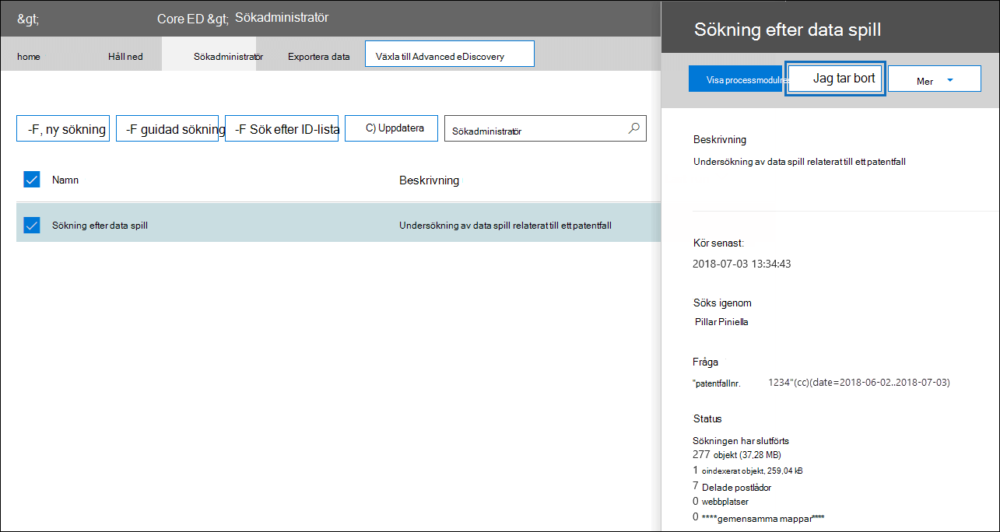

# eDiscovery-lösningsserie: Scenario för data spill – sökning och rensningeDiscovery solution series: Data spillage scenario - Search and purge

 **Vad är data spill och varför ska du bry dig?****What is data spillage and why should you care?** Spill av data inges när ett konfidentiellt dokument släpps i en miljö som inte är betrodd.Data spillage is when a confidential document is released into an untrusted environment. När ett data spillhändelse upptäcks är det viktigt att snabbt bedöma storleken och placeringen av spillet, undersöka användaraktiviteter runt det och sedan permanent rensa ut spilldata från systemet.When a data spillage incident is detected, it's important to quickly assess the size and locations of the spillage, examine user activities around it,  and then permanently purge the spilled data from the system. 
  
## Scenario: Data spillData spillage scenario

Du är säkerhetsansvarig på Contoso.You're a lead information security officer at Contoso. Du informeras om en data spillsituation där en anställd, som tidigare delat ett konfidentiellt dokument med flera personer, har delats via e-post.You are informed of a data spillage situation where an employee unknowingly shared a highly confidential document with multiple people through email. Du vill snabbt bedöma vilka som fått det här dokumentet internt och externt.You want to quickly assess who received this document internally and externally. När de har identifierats vill du dela ärenderesultat med andra fall att granska och sedan permanent ta bort data från Office 365.Once identified, you would like to share case findings with other investigators to review, and then permanently remove the data from Office 365. När undersökningen är klar vill du generera en rapport med bevis för permanent borttagning och annan ärendeinformation för framtida referens.After the investigation is complete, you want to generate a report with the evidence of permanent removal and other case details for any future reference.
  
### Den här artikelns omfattningScope of this article

Det här dokumentet innehåller en lista med instruktioner om hur du tar bort ett meddelande permanent från Microsoft 365 så att det inte går att komma åt eller återställa det.This document provides a list of instructions on how to permanently remove a message from Microsoft 365 so that it's not accessible or recoverable. Om du vill ta bort ett meddelande och göra det återställningsbart tills bevarandeperioden för borttagna objekt löper ut kan du gå till Söka efter och ta bort [e-postmeddelanden i organisationen.](search-for-and-delete-messages-in-your-organization.md)To delete a message and make it recoverable until the deleted item retention period expires, see [Search for and delete email messages in your organization](search-for-and-delete-messages-in-your-organization.md).
  
## Arbetsflöde för hantering av data spilltillbudWorkflow for managing data spillage incidents

Så här hanterar du ett data spillhändelse:Here's a how to manage a data spillage incident:

  
[(Valfritt) Steg 1: Hantera vem som kan komma åt ärendet och ange efterlevnadsgränser(Optional) Step 1: Manage who can access the case and set compliance boundaries](#optional-step-1-manage-who-can-access-the-case-and-set-compliance-boundaries) 
[Steg 2: Skapa ett eDiscovery-ärendeStep 2: Create an eDiscovery case](#step-2-create-an-ediscovery-case) 
[Steg 3: Sök efter data som har spilltsStep 3: Search for the spilled data](#step-3-search-for-the-spilled-data) 
[Steg 4: Granska och validera fallresultatStep 4: Review and validate case findings](#step-4-review-and-validate-case-findings) 
[Steg 5: Använd meddelandespårningslogg för att kontrollera hur spillda data har delatsStep 5: Use message trace log to check how spilled data was shared](#step-5-use-message-trace-log-to-check-how-spilled-data-was-shared) 
[Steg 6: Förbereda postlådornaStep 6: Prepare the mailboxes](#step-6-prepare-the-mailboxes) 
[Steg 7: Ta bort data som har spillts permanentStep 7: Permanently delete the spilled data](#step-7-permanently-delete-the-spilled-data) 
[Steg 8: Verifiera, ange ett bevis för borttagning och granskningStep 8: Verify, provide a proof of deletion, and audit](#step-8-verify-provide-a-proof-of-deletion-and-audit) 

## Bra att veta innan du börjarThings to know before you start

- När en postlåda är undantaget finns ett borttaget meddelande kvar i mappen Återställningsbara objekt tills bevarandetiden löper ut eller när undantaget släpps.When a mailbox is on hold, a deleted message remains in the Recoverable Items folder until the retention period expires or the hold is released. [Steg 6](#step-6-prepare-the-mailboxes) beskriver hur du tar bort isen från postlådorna.[Step 6](#step-6-prepare-the-mailboxes) describes how to remove hold from the mailboxes. Kontrollera med din hantering av arkivhandlingar eller juridiska avdelningar innan du tar bort krysset.Check with your records management or legal departments before removing the hold. Organisationen kan ha en princip som definierar om en postlåda som är väntad eller ett data spill har prioritet.Your organization might have a policy that defines whether a mailbox on hold or a data spillage incident takes priority. 
    
- Om du vill styra vilka användarpostlådor en data spillande kan söka och hantera vem som kan komma åt ärendet, kan du konfigurera efterlevnadsgränser och skapa en anpassad rollgrupp, som beskrivs i steg [1.](#optional-step-1-manage-who-can-access-the-case-and-set-compliance-boundaries)To control which user mailboxes a data spillage investigator can search and manage who can access the case, you can set up compliance boundaries and create a custom role group, which is described in [Step 1](#optional-step-1-manage-who-can-access-the-case-and-set-compliance-boundaries). För att göra det måste du vara medlem i rollgruppen Organisationshantering eller ha rollen rollhantering.To do this, you have to be a member of the Organization Management role group or be assigned the role management role. Om du eller en administratör i organisationen redan har angett efterlevnadsgränser kan du hoppa över steg 1.If you or an administrator in your organization has already set compliance boundaries, you can skip Step 1.
    
- Om du vill skapa ett ärende måste du vara medlem i rollgruppen för eDiscovery-hanteraren eller vara medlem i en anpassad rollgrupp som har tilldelats rollen Ärendehantering.To create a case, you must be a member of the eDiscovery Manager role group or be a member of a custom role group that's assigned the Case Management role. Om du inte är medlem kan du be en Microsoft 365 att lägga till dig i [rollgruppen för eDiscovery-hanteraren.](assign-ediscovery-permissions.md)If you're not a member, ask a Microsoft 365 administrator to [add you to the eDiscovery manager role group](assign-ediscovery-permissions.md).
    
- Om du vill skapa och köra en innehållssökning måste du vara medlem i rollgruppen eDiscovery Manager eller ha tilldelats hanteringsrollen för efterlevnadssökning.To create and run a Content Search, you have to be a member of the eDiscovery Manager role group or be assigned the Compliance Search management role. Om du vill ta bort meddelanden måste du vara medlem i rollgruppen Organisationshantering eller ha tilldelats hanteringsrollen för sökning och rensning.To delete messages, you have to be a member of the Organization Management role group or be assigned the Search And Purge management role. Mer information om hur du lägger till användare i en rollgrupp finns i [Tilldela eDiscovery-behörigheter i Säkerhets- och efterlevnadscenter](./assign-ediscovery-permissions.md).For information about adding users to a role group, see [Assign eDiscovery permissions in the Security & Compliance Center](./assign-ediscovery-permissions.md).
    
- Om du vill söka i eDiscovery-aktiviteter för granskningsloggen i steg 8 måste granskning vara aktiverad för din organisation.To search the audit log eDiscovery activities in Step 8, auditing must be turned on for your organization. Du kan söka efter aktiviteter som har utförts under de senaste 90 dagarna.You can search for activities that were performed within the last 90 days. Mer information om hur du aktiverar och använder granskning finns i [avsnittet Granska undersökningen](#auditing-the-data-spillage-investigation-process) om data spill i steg 8.To learn more about how to enable and use auditing, see the [Auditing the data spillage investigation process](#auditing-the-data-spillage-investigation-process) section in Step 8. 
    
## (Valfritt) Steg 1: Hantera vem som kan komma åt ärendet och ange efterlevnadsgränser(Optional) Step 1: Manage who can access the case and set compliance boundaries

Beroende på din organisations övning behöver du kontrollera vem som kan komma åt eDiscovery-ärendet som används för att undersöka data spill och konfigurera efterlevnadsgränser.Depending on your organizational practice, you need to control who can access the eDiscovery case used to investigate a data spillage incident and set up compliance boundaries. Det enklaste sättet att göra det är att lägga till rollgruppen som medlemmar i en befintlig rollgrupp i Säkerhets- & och efterlevnadscenter och sedan lägga till rollgruppen som medlem i eDiscovery-ärendet.The easiest way to do this is to add investigators as members of an existing role group in the Security & Compliance Center and then add the role group as a member of the eDiscovery case. Mer information om de inbyggda rollgrupperna för eDiscovery och hur du lägger till medlemmar i ett eDiscovery-fall finns i [Tilldela eDiscovery-behörigheter.](assign-ediscovery-permissions.md)For information about the built-in eDiscovery role groups and how to add members to an eDiscovery case, see [Assign eDiscovery permissions](assign-ediscovery-permissions.md).
  
Du kan också skapa en ny rollgrupp som passar organisationens behov.You can also create a new role group that aligns with your organizational needs. Du kanske till exempel vill att en grupp data spiller i organisationen ska kunna komma åt och samarbeta om alla fall av data spill.For example, you might want a group of data spillage investigators in the organization to access and collaborate on all data spillage cases. Det kan du göra genom att skapa rollgruppen "Data spill och fall", tilldela rätt roller (Exportera, RMS-dekryptera, granska, förhandsgranska, efterlevnadssökning och ärendehantering), lägga till data spill från rollgruppen och sedan lägga till rollgruppen som medlem i eDiscovery-fall för data spill.You can do this by creating a "Data Spillage Investigator" role group, assigning the appropriate roles (Export, RMS Decrypt, Review, Preview, Compliance Search, and Case Management), adding the data spillage investigators to the role group, and then adding the role group as a member of the data spillage eDiscovery case. I [Konfigurera efterlevnadsgränser för eDiscovery-undersökningar i Office 365](set-up-compliance-boundaries.md) för detaljerade anvisningar om hur du gör detta.See [Set up compliance boundaries for eDiscovery investigations in Office 365](set-up-compliance-boundaries.md) for detailed instructions on how to do this. 
  
## Steg 2: Skapa ett eDiscovery-ärendeStep 2: Create an eDiscovery case

Ett eDiscovery-ärende är ett effektivt sätt att hantera undersökning av data spill.An eDiscovery case provides an effective way to manage your data spillage investigation. Du kan lägga till medlemmar i rollgruppen som du skapade i steg 1, lägga till rollgruppen som medlem i ett nytt eDiscovery-ärende, utföra iterativa sökningar för att hitta data som har spillts, exportera en rapport för att dela, spåra ärendets status och sedan gå tillbaka till information om ärendet om det behövs.You can add members to the role group that you created in Step 1, add the role group as a member of new a eDiscovery case, perform iterative searches to find the spilled data, export a report to share, track the status of the case, and then refer back to the details of the case if needed. Överväg att upprätta en namngivningskonvention för eDiscovery-ärenden som används för data spillärenden, och ange så mycket information som du kan i ärendets namn och beskrivning så att du kan hitta och referera till i framtiden om det behövs.Consider establishing a naming convention for eDiscovery cases used for data spillage incidents, and provide as much information as you can in the case name and description so you can locate and refer to in the future if necessary.
  
Om du vill skapa ett nytt ärende kan du använda eDiscovery i säkerhets- och efterlevnadscentret.To create a new case, you can use eDiscovery in the security and compliance center. Se "Skapa ett nytt ärende" i [Komma igång med Core eDiscovery](get-started-core-ediscovery.md#step-3-create-a-core-ediscovery-case).See "Create a new case" in [Get started with Core eDiscovery](get-started-core-ediscovery.md#step-3-create-a-core-ediscovery-case).
  
## Steg 3: Sök efter data som har spilltsStep 3: Search for the spilled data

Nu när du har skapat ett ärende och hanterad åtkomst kan du använda ärendet för att iterativt söka efter spilldata och identifiera postlådorna som innehåller de spillta data.Now that you've created a case and managed access, you can use the case to iteratively search to find the spilled data and identify the mailboxes that contain the spilled data. Du använder samma sökfråga som du använde för att hitta e-postmeddelanden för att ta bort samma meddelanden i [steg 7.](#step-7-permanently-delete-the-spilled-data)You will use the same search query that you used to find the email messages to delete those same messages in [Step 7](#step-7-permanently-delete-the-spilled-data).
  
Om du vill skapa en innehållssökning kopplad till ett e-dataidentifieringsfall kan du gå till Söka efter innehåll i [ett grundläggande eDiscovery-ärende.](search-for-content-in-core-ediscovery.md)To create a content search associated with an eDiscovery case, see [Search for content in a Core eDiscovery case](search-for-content-in-core-ediscovery.md).
  
> [!IMPORTANT]
> De nyckelord som du använder i sökfrågan kan innehålla de faktiska spilldata som du söker efter.The keywords that you use in the search query may contain the actual spilled data that you're searching for. Om du till exempel söker efter dokument som innehåller ett personnummer och använder det som sökord måste du ta bort frågan efteråt för att undvika ytterligare spill.For example, if you searching for documents containing a social security number and you use the it as search keyword, you must delete the query afterwards to avoid further spillage. Se [Ta bort sökfrågan](#deleting-the-search-query) i steg 8.See [Deleting the search query](#deleting-the-search-query) in Step 8.
  
## Steg 4: Granska och validera fallresultatStep 4: Review and validate case findings

När du har skapat en innehållssökning måste du granska och verifiera att sökresultaten och kontrollera att de endast består av de e-postmeddelanden som måste tas bort.After you create a content search, you need to review and validate that the search results and verify that they consist only of the email messages that must be deleted. I en innehållssökning kan du förhandsgranska ett slumpmässigt urval av 1 000 e-postmeddelanden utan att exportera sökresultaten för att undvika ytterligare data spill.In a content search, you can preview a random sampling of 1,000 email messages without exporting the search results to avoid further data spillage. Du kan läsa mer om förhandsgranskningsbegränsningarna [i Begränsningar för innehållssökning.](limits-for-content-search.md)You can read more about the preview limitations at [Limits for Content Search](limits-for-content-search.md).
  
Om du har fler än 1 000 postlådor eller fler än 100 e-postmeddelanden per postlåda som ska granskas kan du dela upp den första sökningen i flera sökningar genom att använda ytterligare nyckelord eller villkor som datumintervall eller avsändare/mottagare och granska resultaten för varje sökning individuellt.If you have more than 1,000 mailboxes or more than 100 email messages per mailbox to review, you can divide the initial search into multiple searches by using additional keywords or conditions such as date range or sender/recipient and review the results of each search individually. Notera alla sökfrågor som du ska använda när du tar bort meddelanden i [steg 7.](#step-7-permanently-delete-the-spilled-data)Make sure to note down all search queries to use when you delete messages in [Step 7](#step-7-permanently-delete-the-spilled-data).

Om en vårdnadshavare eller slutanvändare tilldelas en Office 365 E5-licens kan du undersöka upp till 10 000 sökresultat samtidigt med hjälp av Advanced eDiscovery.If a custodian or end user is assigned an Office 365 E5 license, you can examine up to 10,000 search results at once using Advanced eDiscovery. Om det finns fler än 10 000 e-postmeddelanden att granska kan du dela sökfrågan efter datumintervall och granska varje resultat individuellt allt eftersom sökresultat sorteras efter datum.If there are more than 10,000 email messages to review, you can divide the search query by date range and review each result individually as search results are sorted by date. I Advanced eDiscovery kan du tagga sökresultat  med hjälp av funktionen Etikett som i förhandsgranskningspanelen och filtrera sökresultatet efter taggen du märka.In Advanced eDiscovery, you can tag search results using the **Label as** feature in the preview panel and filter the search result by the tag you labeled. Det här är användbart när du samarbetar med en sekundär granskare.This is helpful when you collaborate with a secondary reviewer. Genom att använda ytterligare analysverktyg i Advanced eDiscovery, till exempel optisk teckenigenkänning, e-posttrådning och förutsägelsekodning, kan du snabbt bearbeta och granska tusentals meddelanden och tagga dem för ytterligare granskning.By using additional analytics tools in Advanced eDiscovery, such as optical character recognition, email threading, and predictive coding, you can quickly process and review thousands of messages and tag them for further review. Se [Snabbinstallation för Advanced eDiscovery](./get-started-with-advanced-ediscovery.md).See [Quick setup for Advanced eDiscovery](./get-started-with-advanced-ediscovery.md).

När du hittar ett e-postmeddelande som innehåller data som har spillts kontrollerar du om meddelandets mottagare har delats externt.When you find an email message that contains spilled data, check the recipients of the message to determine if it was shared externally. Om du vill spåra ett meddelande ytterligare kan du samla in avsändarinformation och datumintervall så att du kan använda meddelandespårningsloggarna.To further trace a message, you can collect sender information and date ranges so you can use the message trace logs. Den här processen beskrivs i [steg 5.](#step-5-use-message-trace-log-to-check-how-spilled-data-was-shared)This process is described in [Step 5](#step-5-use-message-trace-log-to-check-how-spilled-data-was-shared).

När du har verifierat sökresultaten kanske du vill dela resultaten med andra för en sekundär granskning.After you verified the search results, you may want to share your findings with others for a secondary review. Personer som du har tilldelat ärendet i steg 1 kan granska ärendeinnehållet i både eDiscovery och Advanced eDiscovery och godkänna resultat från ärendet.People who you assigned to the case in Step 1 can review the case content in both eDiscovery and Advanced eDiscovery and approve case findings. Du kan också skapa en rapport utan att exportera själva innehållet.You can also generate a report without exporting the actual content. Du kan också använda samma rapport som ett bevis på borttagning, som beskrivs i [steg 8.](#step-8-verify-provide-a-proof-of-deletion-and-audit)You can also use this same report as a proof of deletion, which is described in [Step 8](#step-8-verify-provide-a-proof-of-deletion-and-audit).
  
 **Så här skapar du en statistisk rapport:****To generate a statistical report:**
  
1. Gå till sidan **Sök** i eDiscovery-ärendet och klicka på sökningen som du vill skapa en rapport för.Go to the **Search** page in the eDiscovery case, and click the search that you want to generate a report for. 
    
2. Klicka på Mer i > **Exportera rapport**.On the flyout page, click **More > Export report**.
 
      Sidan Exportera rapport visas.The Export report page is displayed.

    
    
3. Markera Alla objekt, även sådana som har **okänt format,** krypteras eller inte indexeras av andra orsaker och klicka sedan på **Generera rapport.**Select **All items, including ones that have unrecognized format, are encrypted, or weren't indexed for other reasons** and then click **Generate report**.

4. I eDiscovery-fallet klickar du på **Exportera** för att visa listan med exportjobb.In the eDiscovery case, click **Export** to display the list of export jobs. Du kan behöva klicka på **Uppdatera** för att uppdatera listan så att exportjobbet du skapade visas.You may have to click **Refresh** to update the list to display the export job you created.

5. Klicka på exportjobbet och sedan på **Ladda ned** rapport på den utfällsbara sidan.Click the export job, and then click **Download** report on the flyout page.
 
    

Rapporten **Exportsammanfattning** innehåller antalet platser som hittades med resultat och storleken på sökresultaten.The **Export Summary** report contains the number of locations found with results and the size of the search results. Du kan använda den för att jämföra med den rapport som genererats efter borttagningen och som ett bevis på borttagning.You can use this to compare with the report generated after deletion and provide as a proof of deletion. **Resultatrapporten** innehåller en mer detaljerad sammanfattning av sökresultaten, inklusive ämne, avsändare och mottagare, om meddelandet lästs, datum och storlek för varje meddelande.The **Results** report contains a more detailed summary of the search results, including the subject, sender, recipients, if the email was read, dates, and size of each message. Om någon av informationen i rapporten innehåller de faktiska spilldata ska du ta bort filen permanent Results.csv när undersökningen är klar.If any of the details in this report contains that actual spilled data, be sure to permanently delete the Results.csv file when the investigation is complete.

Mer information om hur du exporterar rapporter finns i [Exportera en rapport för innehållssökning.](export-a-content-search-report.md)For more information about exporting reports, see [Export a Content Search report](export-a-content-search-report.md).
    
## Steg 5: Använd meddelandespårningslogg för att kontrollera hur spillda data har delatsStep 5: Use message trace log to check how spilled data was shared

För att ytterligare undersöka om e-post med spilldata delades kan du fråga meddelandespårningsloggarna med avsändarinformationen och datumintervallinformationen som du hämtade i steg 4.To further investigate if email with spilled data was shared, you can optionally query the message trace logs with the sender information and the date range information that you gathered in Step 4. Bevarandetiden för meddelandespårning är 30 dagar för realtidsdata och 90 dagar för historiska data.The retention period for message trace is 30 days for real-time data and 90 days for historical data.
  
Du kan använda Meddelandespårning i säkerhets- och efterlevnadscentret eller använda motsvarande cmdlets i Exchange Online PowerShell.You can use Message trace in the security and compliance center or use the corresponding cmdlets in Exchange Online PowerShell. Det är viktigt att observera att meddelandespårning inte ger fullständiga garantier för att data som returneras är fullständiga.It's important to note that message tracing doesn't offer full guarantees on the completeness of data returned. Mer information om hur du använder meddelandespårning finns i:For more information about using Message trace, see: 
  
- [Meddelandespårning i Säkerhets- & Säkerhets- och efterlevnadscenterMessage trace in the Security & Compliance Center](../security/office-365-security/message-trace-scc.md)
    
- [Nytt meddelandespårning i Säkerhets- & EfterlevnadscenterNew Message Trace in Security & Compliance Center](https://techcommunity.microsoft.com/t5/exchange-team-blog/new-message-trace-in-office-365-security-038-compliance-center/ba-p/607893)
    
## Steg 6: Förbereda postlådornaStep 6: Prepare the mailboxes

När du har granskat och kontrollerat att sökresultatet bara innehåller de meddelanden som måste tas bort måste du samla in en lista med e-postadresserna till de påverkade postlådorna som ska användas i steg 7 när du tar bort data som spillts.After you review and validate that the search results contain only the messages that must be deleted, you need to collect a list of the email addresses of the impacted mailboxes to use in Step 7 when you delete the spilled data. Du kan också behöva förbereda postlådorna innan du kan ta bort e-postmeddelanden permanent beroende på om återställning av enstaka objekt är aktiverad för postlådor som innehåller data som har spillts, eller om någon av postlådorna är väntad.You may also have to prepare the mailboxes before you can permanently delete email messages depending on whether single item recovery is enabled on the mailboxes that contain the spilled data or if any of those mailboxes are on hold.
  
### Visa en lista över adresser till postlådor med data som har spilltsGet a list of addresses of mailboxes with spilled data

Det finns två sätt att samla in en lista med e-postadresser för postlådor med data som har spillts.There are two ways to collect a list of email addresses of mailboxes with spilled data.

**Alternativ 1: Visa en lista över adresser för postlådor med data som har spillts****Option 1: Get a list of addresses of mailboxes with spilled data**

1. Öppna eDiscovery-ärendet, gå till **sidan Sök** och välj lämplig innehållssökning.Open the eDiscovery case, go to the **Search** page and select the appropriate content search. 
    
2. Klicka på Visa resultat på den **utfällade sidan.**On the flyout page, click **View results**.
    
3. Klicka på **Sökstatistik** i listrutan **Individuella resultat**.In the **Individual results** drop down list, click **Search statistics**.
    
4. I **listrutan** Typ klickar du **på Top locations**.In the **Type** drop down list, click **Top locations**.
    
    

    En lista med postlådor som innehåller sökresultat visas.A list of mailboxes that contain search results is displayed. Antalet objekt i varje postlåda som matchar sökfrågan visas också.The number of items in each mailbox that match the search query is also displayed.
    
5. Kopiera informationen i listan och spara den i en fil eller klicka på Ladda ned **för** att ladda ned informationen till en CSV-fil.Copy the information in the list and save it to a file or click **Download** to download the information to a CSV file. 
    
**Alternativ 2: Hämta postlådeplatser från exportrapporten****Option 2: Get mailbox locations from the export report**

Öppna rapporten Exportsammanfattning som du hämtade i [steg 4.](#step-4-review-and-validate-case-findings)Open the Export Summary report that you downloaded in [Step 4](#step-4-review-and-validate-case-findings). I den första kolumnen i rapporten visas e-postadressen för varje postlåda under **Platser.**In the first column in the report, the email address of each mailbox is listed under **Locations**.
  
### Förbereda postlådorna så att du kan ta bort data som har spilltsPrepare the mailboxes so you can delete the spilled data

Om återställning av enstaka objekt är aktiverat eller om en postlåda har satts på en plats behålls ett permanent borttaget meddelande (borttaget) i mappen för permanent borttagna objekt.If single item recovery is enabled or if a mailbox is placed on hold, a permanently deleted (purged) message will be retained in Recoverable Items folder. Så innan du kan tömma spilldata måste du kontrollera de befintliga postlådekonfigurationerna och inaktivera återställning av enstaka objekt och ta bort eventuella bevarande- och bevarandeprinciper.So before you can purge spilled data, you need to check the existing mailbox configurations and disable single item recovery and remove any hold or retention policy. Tänk på att du kan förbereda en postlåda i taget och sedan köra samma kommando på olika postlådor eller skapa ett PowerShell-skript för att förbereda flera postlådor samtidigt.Keep in mind that you can prepare one mailbox at a time, and then run the same command on different mailboxes or create a PowerShell script to prepare multiple mailboxes at the same time.

- Se "Steg 1: Samla [in](delete-items-in-the-recoverable-items-folder-of-mailboxes-on-hold.md#step-1-collect-information-about-the-mailbox) information om postlådan" i Ta bort objekt i mappen Återställningsbara objekt i molnbaserade postlådor för anvisningar om hur du kontrollerar om återställning av enstaka objekt är aktiverad eller om postlådan är satt på bevarande eller tilldelas till en bevarandeprincip.See "Step 1: Collect information about the mailbox" in [Delete items in the Recoverable Items folder of cloud-based mailboxes on hold](delete-items-in-the-recoverable-items-folder-of-mailboxes-on-hold.md#step-1-collect-information-about-the-mailbox) for instructions about how to check if single item recovery is enabled or if the mailbox is placed on hold or it's assigned to a retention policy. 

- Se "Steg 2: Förbereda  postlådan" i Ta bort objekt i mappen Återställningsbara objekt i molnbaserade postlådor för anvisningar om hur du inaktiverar återställning av enstaka objekt.See "Step 2: Prepare the mailbox" in [Delete items in the Recoverable Items folder of cloud-based mailboxes on hold](delete-items-in-the-recoverable-items-folder-of-mailboxes-on-hold.md#step-2-prepare-the-mailbox) for instructions about disabling single item recovery. 

- Se "Steg 3: Ta bort alla  bevarande från postlådan" i Ta bort objekt i mappen Återställningsbara objekt i molnbaserade postlådor om du vill ha anvisningar om hur du tar bort en bevarande- eller bevarandeprincip från en postlåda.See "Step 3: Remove all holds from the mailbox" in [Delete items in the Recoverable Items folder of cloud-based mailboxes on hold](delete-items-in-the-recoverable-items-folder-of-mailboxes-on-hold.md#step-3-remove-all-holds-from-the-mailbox) for instructions about how to remove a hold or retention policy from a mailbox. 

- Se "Steg 4: Ta bort fördröjningar  från postlådan" i Ta bort objekt i mappen Återställningsbara objekt i molnbaserade postlådor om du vill ha instruktioner om hur du tar bort fördröjningar som placeras i postlådan när någon typ av återställning har tagits bort.See "Step 4: Remove the delay hold from the mailbox" in [Delete items in the Recoverable Items folder of cloud-based mailboxes on hold](delete-items-in-the-recoverable-items-folder-of-mailboxes-on-hold.md#step-4-remove-the-delay-hold-from-the-mailbox) for instructions about removing the delay hold that is placed on the mailbox after any type of hold is removed.

> [!IMPORTANT]
> Kontrollera med din hantering av arkivhandlingar eller juridiska avdelningar innan du tar bort en bevarande- eller bevarandeprincip.Check with your records management or legal departments before removing a hold or retention policy. Organisationen kan ha en princip som definierar om en postlåda som är väntad eller ett data spill har prioritet.Your organization may have a policy that defines whether a mailbox on hold or a data spillage incident takes priority. 
  
Se till att återställa postlådan till tidigare konfigurationer när du har verifierat att spilldata har tagits bort permanent.Be sure to revert the mailbox to previous configurations after you verify that the spilled data has been permanently deleted. Se informationen i [steg 7.](#step-7-permanently-delete-the-spilled-data)See the details in [Step 7](#step-7-permanently-delete-the-spilled-data).

## Steg 7: Ta bort data som har spillts permanentStep 7: Permanently delete the spilled data

Med hjälp av postlådeplatserna som du samlade in och förberedde i steg 6 och sökfrågan som skapades och förfinades i steg 3 för att hitta e-postmeddelanden som innehåller spilldata kan du nu permanent ta bort data som spillts.Using the mailbox locations that you collected and prepared in Step 6 and the search query that was created and refined in Step 3 to find email messages that contain the spilled data, you can now permanently delete the spilled data.  Som tidigare förklarats måste du vara medlem i rollgruppen Organisationshantering eller ha tilldelats rollen för hantering av sökning och rensning, om du vill ta bort meddelanden.As previously explained, to delete messages, you have to be a member of the Organization Management role group or be assigned the Search And Purge management role. Mer information om hur du lägger till användare i en rollgrupp finns i [Tilldela eDiscovery-behörigheter i Säkerhets- och efterlevnadscenter](./assign-ediscovery-permissions.md).For information about adding users to a role group, see [Assign eDiscovery permissions in the Security & Compliance Center](./assign-ediscovery-permissions.md).

Information om hur du tar bort spillda meddelanden finns [i Söka efter och ta bort e-postmeddelanden.](search-for-and-delete-messages-in-your-organization.md)To delete the spilled messages, see [Search for and delete email messages](search-for-and-delete-messages-in-your-organization.md).

Tänk på följande begränsningar när du tar bort data som har spillts:Keep the following limits in mind when deleting spilled data:

- Det maximala antalet postlådor i en sökning som du kan använda för att ta bort objekt genom att göra en sök- och rensningsåtgärd är 50 000.The maximum number of mailboxes in a search that you can use to delete items by doing a search and purge action is 50,000. Om sökningen som du skapar i steg 3 söker i fler än 50 000 postlådor misslyckas åtgärden för rensning.If the search that you create in Step 3 searches more than 50,000 mailboxes, the purge action will fail. Sökning i fler än 50 000 postlådor i en enda sökning kan inträffa när du konfigurerar sökningen så att den omfattar alla postlådor i organisationen.Searching more than 50,000 mailbox in a single search might typically happen when you configure the search to include all mailboxes in your organization. Denna begränsning gäller fortfarande även om mindre än 50 000 postlådor innehåller objekt som matchar sökfrågan.This restriction still applies even when less than 50,000 mailboxes contain items that match the search query.

- Du kan ta bort högst tio objekt per postlåda samtidigt.A maximum of 10 items per mailbox can be removed at one time. Eftersom funktionen att söka efter och ta bort meddelanden är avsedd att vara ett verktyg för incidentrespons hjälper den här gränsen till att säkerställa att meddelanden snabbt tas bort från postlådor.Because the capability to search for and remove messages is intended to be an incident-response tool, this limit helps ensure that messages are quickly removed from mailboxes. Den här funktionen är inte avsedd för att rensa i användarnas postlådor.This feature isn't intended to clean up user mailboxes.

> [!IMPORTANT]
> E-postobjekt i en granskningsuppsättning i ett avancerat eDiscovery-ärende kan inte tas bort med hjälp av procedurerna i den här artikeln.Email items in a review set in an Advanced eDiscovery case can't be deleted by using the procedures in this article. Det beror på att artiklar i en granskningsuppsättning är kopior av artiklar i livetjänsten som kopieras och lagras på en Azure Storage plats.That's because items in a review set are copies of items in the live service that are copied and stored in an Azure Storage location. Det innebär att de inte returneras av en innehållssökning som du skapar i steg 3.This means they won't be returned by a content search that you create in Step 3. Om du vill ta bort objekt i en granskningsuppsättning måste du ta bort det Advanced eDiscovery-ärende som innehåller granskningsuppsättningen.To delete items in a review set, you have to delete the Advanced eDiscovery case that contains the review set. Mer information finns i [Stänga eller ta bort ett Advanced eDiscovery-ärende](close-or-delete-case.md).For more information, see [Close or delete an Advanced eDiscovery case](close-or-delete-case.md).
  
## Steg 8: Verifiera, ange ett bevis för borttagning och granskningStep 8: Verify, provide a proof of deletion, and audit

Det sista steget i arbetsflödet för att hantera ett data spillhändelse är att kontrollera att data som spillts permanent har tagits bort från postlådan genom att gå till eDiscovery-ärendet och köra samma sökfråga igen som användes för att ta bort dessa data för att bekräfta att inga resultat returneras.The final step in the workflow to manage a data spillage incident is to verify that the spilled data was permanently removed from the mailbox by going to the eDiscovery case and rerunning the same search query that was used to delete that data to confirm that no results are returned. När du har bekräftat att de spillda data har tagits bort permanent kan du exportera en rapport och inkludera den (tillsammans med den ursprungliga rapporten) som ett bevis på borttagning.After you confirm the spilled data has been permanently removed, you can export a report and include it (along with the original report) as a proof of deletion. Därefter kan [du stänga ärendet,](close-reopen-delete-core-ediscovery-cases.md) vilket gör att du kan öppna det igen om du behöver hänvisa till det i framtiden.Then you can [close the case](close-reopen-delete-core-ediscovery-cases.md) which will allow you to reopen it if you have to refer to it in the future. Du kan också återställa postlådor till det tidigare tillståndet, ta bort sökfrågan som används för att hitta spilldata och söka efter granskningsposter för aktiviteter som utförts vid hantering av incidenten för data spill.Additionally, you can also revert mailboxes to their previous state, delete the search query used to find the spilled data, and search for auditing records of tasks performed when managing the data spillage incident.
  
### Återställa postlådorna till det tidigare tillståndetReverting the mailboxes to their previous state

Om du ändrade en postlådekonfiguration i steg 6 för att förbereda postlådorna innan de spillta data togs bort måste du återställa dem till det tidigare tillståndet.If you changed any mailbox configuration in Step 6 to prepare the mailboxes before the spilled data was deleted, you will need to revert them to their previous state. Se "Steg 6: Återställ postlådan till det tidigare tillståndet" i Ta bort objekt i mappen Återställningsbara objekt i molnbaserade [postlådor som är på plats.](delete-items-in-the-recoverable-items-folder-of-mailboxes-on-hold.md#step-6-revert-the-mailbox-to-its-previous-state)See "Step 6: Revert the mailbox to its previous state" in [Delete items in the Recoverable Items folder of cloud-based mailboxes on hold](delete-items-in-the-recoverable-items-folder-of-mailboxes-on-hold.md#step-6-revert-the-mailbox-to-its-previous-state).
  
### Ta bort sökfråganDeleting the search query

Om nyckelorden i sökfrågan som du skapade och använde i steg 3 innehåller några av de verkliga spilldata bör du ta bort sökfrågan för att förhindra att data spiller ytterligare.If the keywords in the search query that you created and used in Step 3 contains some of all of the actual spilled data, you should delete the search query to prevent further data spillage.
  
1. I säkerhets- och efterlevnadscentret öppnar du eDiscovery-ärendet, går till sidan **Sök** och väljer rätt innehållssökning.In the security and compliance center, open the eDiscovery case, go to the **Search** page, and select the appropriate content search.

2. Klicka på Ta bort på den utfällade **sidan.**On the flyout page, click **Delete**.

    

### Granska undersökning av data spillAuditing the data spillage investigation process

Du kan söka i granskningsloggen efter de eDiscovery-aktiviteter som utfördes under undersökningen.You can search the audit log for the eDiscovery activities that were performed during the investigation. Du kan också söka i granskningsloggen för att returnera granskningsposterna för **kommandot New-ComplianceSearchAction -Purge** som du körde i steg 7 för att ta bort spilldata.You can also search the audit log to return the audit records for the **New-ComplianceSearchAction -Purge** command that you ran in Step 7 to delete the spilled data. Mer information finns i:For more information, see:

- [Söka i granskningsloggenSearch the audit log](search-the-audit-log-in-security-and-compliance.md)

- [Söka efter eDiscovery-aktiviteter i granskningsloggenSearch for eDiscovery activities in the audit log](search-for-ediscovery-activities-in-the-audit-log.md)
