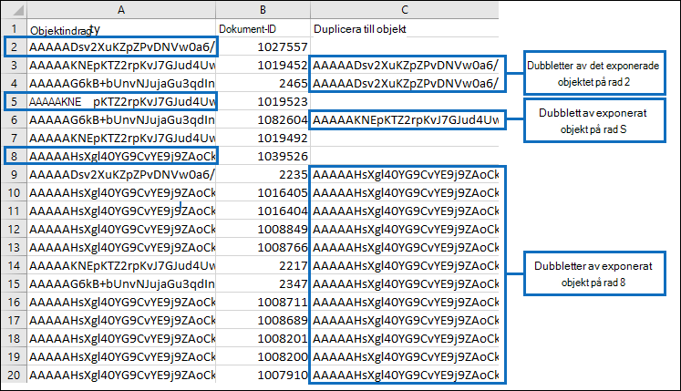
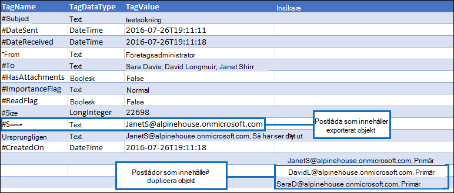

# Avduplicering i eDiscovery-sökresultat

I den här artikeln beskrivs hur avduplicering av eDiscovery-sökresultat fungerar och hur begränsningarna med algoritmen för avduplicering fungerar.
  
När du använder eDiscovery-verktyg för att exportera resultatet av en eDiscovery-sökning kan du välja att deplicera resultaten som exporteras. Vad betyder det här? När du aktiverar avduplicering (avduplicering är som standard inte aktiverat) exporteras bara en kopia av ett e-postmeddelande, även om flera förekomster av samma meddelande kan ha hittats i de postlådor som har sökts. Med avduplicering kan du spara tid genom att minska antalet objekt som du behöver granska och analysera efter att sökresultaten exporterats. Men det är viktigt att förstå hur avduplicering fungerar och att vara medveten om att det finns begränsningar i algoritmen som kan leda till att ett unikt objekt markeras som en dubblett under exporten.
  
## Så här identifieras dubblettmeddelanden

Verktyg för e-dataidentifiering använder en kombination av följande e-postegenskaper för att avgöra om ett meddelande är en dubblett:
  
- **InternetMessageId** – Den här egenskapen anger Identifieraren för Internetmeddelanden i ett e-postmeddelande, som är en globalt unik identifierare som refererar till en viss version av ett specifikt meddelande. Detta ID genereras av avsändarens e-postklientprogram eller värd för e-postsystemet som skickar meddelandet. Om en person skickar ett meddelande till fler än en mottagare är Internetmeddelande-ID detsamma för varje förekomst av meddelandet. Senare ändringar av det ursprungliga meddelandet får en annan meddelandeidentifierare. 

- **ConversationTopic** – Den här egenskapen anger ämnet för konversationstråden i ett meddelande. Värdet för egenskapen **ConversationTopic** är strängen som beskriver det övergripande ämnet för konversationen. En svars svar består av ett första meddelande och alla meddelanden som skickas som svar på det ursprungliga meddelandet. Meddelanden i samma konversation har samma värde för egenskapen **ConversationTopic.** Värdet för den här egenskapen är vanligtvis raden Ämne från det första meddelandet som utser konversationen. 

- **BodyTagInfo** – det här är en intern Exchange store-egenskap. Värdet för den här egenskapen beräknas genom att kontrollera olika attribut i meddelandets brödtext. Den här egenskapen används för att identifiera skillnader i meddelandetexten. 

Under exporten av eDiscovery jämförs dessa tre egenskaper för varje meddelande som matchar sökvillkoren. Om dessa egenskaper är identiska för två (eller flera) meddelanden, avgörs dessa meddelanden som dubbletter och resultatet är att endast en kopia av meddelandet exporteras om avdupliceringen är aktiverad. Meddelandet som exporteras kallas "källobjekt". Information om dubbletter av meddelanden ingår **iResults.csv** **ochManifest.xml** som ingår i exporterade sökresultat. I Results.csvpostfilen identifieras ett dubblettmeddelande genom att ha ett värde i kolumnen **Duplicera till** objekt. Värdet i den här kolumnen matchar värdet i **kolumnen Objektidentitet** för meddelandet som exporterades. 
  
Följande bild visar hur dubbletter av meddelanden visas **iResults.csv** och **Manifest.xml** som exporteras med sökresultatet. De här rapporterna innehåller inte de e-postegenskaper som beskrivits tidigare, som används i avdupliceringsalgoritmen. Rapporterna innehåller i stället den **objektidentitetsegenskap** som är tilldelad till objekt från Exchange butik. 
  
 ### Results.csv (visas i Excel)
  

  
 ### Manifest.xml (visas i Excel)
  

  
Dessutom inkluderas andra egenskaper från dubblettmeddelanden i exportrapporterna. Det omfattar den postlåda som duplicerade meddelandet finns i, om meddelandet skickades till en distributionsgrupp och om meddelandet var Kopia eller Hemlig kopia till en annan användare.
  
## Begränsningar i algoritmen för duplicering

Det finns några kända begränsningar i avdupliceringsalgoritmen som kan göra att unika element markeras som dubbletter. Det är viktigt att förstå dessa begränsningar så att du kan bestämma om du vill använda den valfria funktionen för avduplicering.
  
Det finns en situation där funktionen för avduplicering av misstag identifierar ett meddelande som en dubblett och inte exporterar det (men fortfarande citerar det som en dubblett i exportrapporterna). Det här är meddelanden som en användare redigerar men inte skickar. Anta till exempel att en användare markerar ett meddelande i Outlook, kopierar innehållet i meddelandet och klistrar sedan in det i ett nytt meddelande. Sedan ändrar användaren en av kopiorna genom att ta bort eller lägga till en bifogad fil, eller ändra ämnesraden eller själva brödtexten. Om de här två meddelandena matchar frågan för en eDiscovery-sökning exporteras bara ett av meddelandena om avduplicering är aktiverat när sökresultaten exporteras. Så även om det ursprungliga meddelandet eller det kopierade meddelandet ändrades skickades inget av de reviderade meddelandena och därför uppdaterades inte värdena för **egenskaperna InternetMessageId,** **ConversationTopic** och **BodyTagInfo.** Men som tidigare förklarats visas båda meddelandena i exportrapporterna 
  
Unika meddelanden kan också markeras som dubbletter när sidskyddsfunktionen Kopiera på skriv är aktiverad, som för postlådor med bevarande av juridiska skäl eller In-Place bevarande. Funktionen Kopiera vid skrivning kopierar det ursprungliga meddelandet (och sparar det i mappen Versioner i användarens Återställningsbara objekt-mapp) innan ändringen av ett originalobjekt sparas. I det här fallet kan den ändrade kopian och det ursprungliga meddelandet (i mappen Återställningsbara objekt) ses som dubblettmeddelanden och därför exporteras bara ett av dem.
  
> [!IMPORTANT]
> Om begränsningarna i avdupliceringsalgoritmen kan påverka kvaliteten på sökresultaten bör du inte aktivera avduplicering när du exporterar objekt. Om det som beskrivs i det här avsnittet inte är någon faktor i sökresultatet och du vill minska antalet objekt som troligen är dubbletter, bör du överväga att aktivera avduplicering. 
  
## Mer information

- Informationen i den här artikeln är relevant när du exporterar sökresultat med något av följande eDiscovery-verktyg:

  - Innehållssökning i efterlevnadscenter i Office 365

  - In-Place eDiscovery i Exchange Online

  - eDiscovery Center i SharePoint Online

- Mer information om hur du exporterar sökresultat finns i:

  - [Exportera innehållssökning](export-search-results.md)

  - [Exportera en rapport för innehållssökning](export-a-content-search-report.md)

  - [Exportera In-Place eDiscovery-sökresultat till en PST-fil](/exchange/security-and-compliance/in-place-ediscovery/export-search-results)

  - [Exportera innehåll och skapa rapporter i eDiscovery Center](/SharePoint/governance/export-content-and-create-reports-in-the-ediscovery-center)