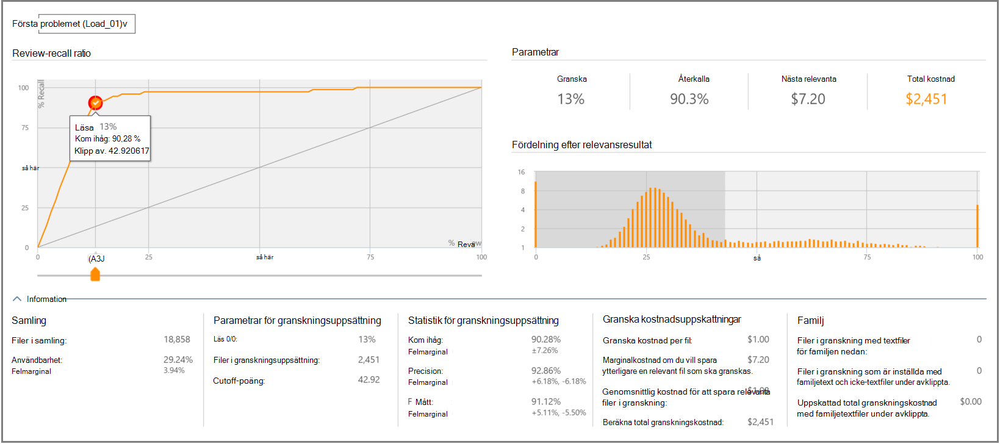

# Beslut baserade på relevansresultat i Advanced eDiscoveryDecisions based on Relevance results in Advanced eDiscovery
  
I modulen Relevans i Advanced eDiscovery på fliken Bestämmer finns mer information för att visa och använda statistik för beslutssupport för att fastställa storleken på granskningsuppsättningen av ärendefiler.In the Relevance module in Advanced eDiscovery, the Decide tab provides additional information for viewing and using decision-support statistics for determining the size of the review set of case files.
  
## Använda fliken BestämmerUsing the Decide tab

  
Den här fliken innehåller följande komponenter:This tab includes the following components:
  
- **Problem:** Härifrån kan du välja intressefrågan i listan.**Issue**: From here, you can select the issue of interest from the list.

- **Review-recall ratio**: Jämförelser av Advanced eDiscovery granska i enlighet med relevansresultat.**Review-recall ratio**: Comparisons of Advanced eDiscovery review according to Relevance scores. Brytpunkten i diagrammet representerar procentandelen filer att granska, mappade till ett relevansresultat.The Cutoff point in the chart represents the percentage of files to review, mapped to a Relevance score. Det här används i fasen Relevanstest och som ett exporttröskelvärde för testning.This is used in the Relevance Test phase and as an Export threshold for culling. Som standard är saldot mellan Återkallelse och Precision optimalt för antalet filer som ska granskas.The default cutoff point, for the number of files to review is at the point in which the balance between Recall and Precision is optimal. Den faktiska brytpunkten ska fastställas av användaren beroende på mål och kostnads kompromiss (%review) och risk (%recall).The actual cutoff point should be determined by the user depending on objectives and the cost tradeoff (%review) and risk (%recall). Med skjutreglaget kan du justera brytpunkten och se effekten på diagrammet och parametrarna, när du justerar hur många procent av relevanta filer som ska hämtas och innan du verifierar ett beslut.Using the slider, you can adjust the cutoff point and see the effect on the graph and parameters, when adjusting the percent of relevant files to be retrieved, and before validating a decision.

- **Parametrar:** Granska, Återkalla, Nästa relevanta parametrar och Parametrar för totalkostnad är ackumulerad beräknad statistik som hör till granskningsuppsättningen i relation till samlingen för hela ärendet.**Parameters**: Review, Recall, Next relevant and Total cost parameters are cumulative calculated statistics pertaining to the review set in relation to the collection for the entire case. Definitioner för dessa parametrar är följande:Definitions for these parameters are as follows:

  - **Granska:** Procentandel av filer som ska granskas baserat på den här brytningen.**Review**: Percentage of files to review based on this cutoff.

  - **Återkalla:** Procentandel av relevanta filer i granskningsuppsättningen.**Recall**: Percentage of relevant files in the review set.

  - **Nästa relevanta**: Kostnad för granskning och identifiera en annan relevant fil som inte finns med i granskningsuppsättningen.**Next relevant**: Cost to review and identify another relevant file that is not currently in the review set.

  - **Total kostnad:** Kostnad för att granska denna procent av ärendefilerna.**Total cost**: Cost for reviewing this percentage of the case files. Kostnadsparameterinställningar kan anges av ärendehanteraren.Cost parameter settings can be set by the Case manager.

  - **Fördelning efter relevansresultat:** Filer i den mörkgrå visningen till vänster är under brytresultatet.**Distribution by relevance score**: Files in the dark gray display to the left are below the cutoff score. I en verktygstips visas Relevansresultat och den relaterade procentandelen filer i granskningsfilen som angetts i förhållande till det totala antalet filer.A tool-tip displays the Relevance score and the related percentage of files in the review file set in relation to the total files.

I det utökade **informationsfönstret** visas mer information.The expanded **Details** pane displays more details. Filer på samlingsfigurer omfattar inte tomma eller nebulous-filer.Files in collection figures do not include empty or nebulous files. Familjefiler representerar filer som inte lästs in i Relevans, men fortfarande räknas som en del av familjen.Family files figures represent files that are not loaded in Relevance, yet still counted as part of the family.
