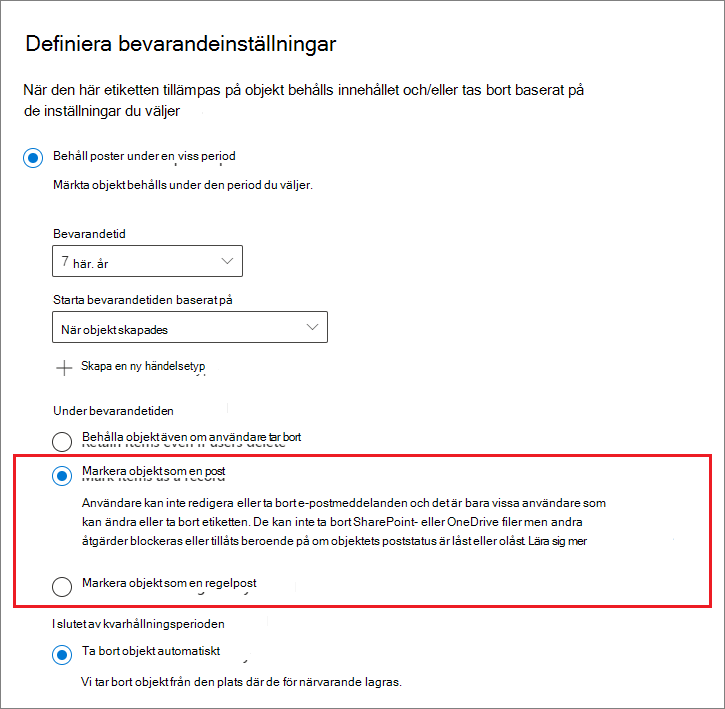
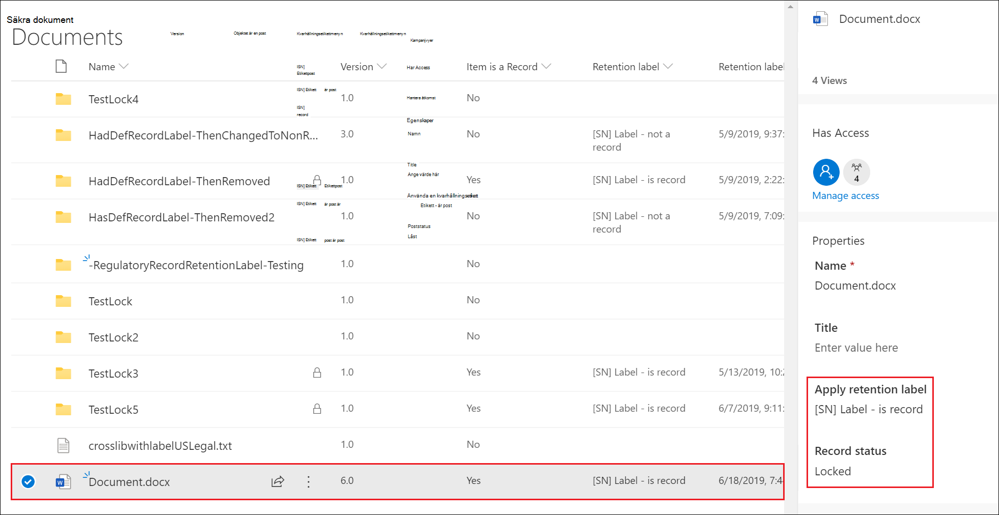

# <a name="declare-records-by-using-retention-labels"></a>Deklarera poster med hjälp av kvarhållningsetiketter

>*[Licensieringsvägledning för Microsoft 365 för säkerhet och efterlevnad](/office365/servicedescriptions/microsoft-365-service-descriptions/microsoft-365-tenantlevel-services-licensing-guidance/microsoft-365-security-compliance-licensing-guidance).*

Om du vill deklarera dokument och e-postmeddelanden som [poster](records-management.md#records) kan du använda [kvarhållningsetiketter](retention.md#retention-labels) som markerar innehållet som en **post** eller som en **regelbaserad post**.

Om du är osäker på om du bör använda en post eller en regelbaserad post kan du läsa [Jämför begränsningarna för vilka åtgärder som tillåts och blockeras](records-management.md#compare-restrictions-for-what-actions-are-allowed-or-blocked). Om du behöver använda regelbaserade poster måste du först köra ett PowerShell-kommando enligt anvisningarna i följande avsnitt.

Därefter kan du antingen publicera etiketterna i en policy för kvarhållningsetiketter, så att användare och administratörer kan använda dem på innehåll, eller använda automatisk användning av etiketterna på innehåll som du vill deklarera som en post (gäller etiketter som markerar objekt som poster, dock ej som regelbaserade poster).

## <a name="how-to-display-the-option-to-mark-content-as-a-regulatory-record"></a>Så här visar du alternativet för att markera innehåll som en regelbaserad post

>[!NOTE] 
> Följande procedur är en granskningsbar åtgärd som medför att **Aktivering av alternativet för regelbaserade poster för kvarhållningsetiketter** loggas i avsnittet [Kvarhållningspolicy och aktiviteter gällande kvarhållningsetiketter](search-the-audit-log-in-security-and-compliance.md#retention-policy-and-retention-label-activities) i granskningsloggen.

Som standard visas inte alternativet för kvarhållningsetiketter, där innehåll kan markeras som en regelbaserad post, i guiden för kvarhållningsetiketter. Om du vill att det här alternativet ska visas måste du först köra ett PowerShell-kommando:

1. [Anslut till Säkerhets- och efterlevnadscenter för Office 365 via PowerShell](/powershell/exchange/office-365-scc/connect-to-scc-powershell/connect-to-scc-powershell).

2. Kör följande cmdlet:
    
    ```powershell
    Set-RegulatoryComplianceUI -Enabled $true
    ````
    Du behöver inte bekräfta åtgärden och inställningen börjar gälla omedelbart.

Om du ångrar dig och inte längre vill att alternativet ska visas i guiden kan du dölja det genom att köra samma cmdlet med värdet **falskt**: `Set-RegulatoryComplianceUI -Enabled $false` 

## <a name="configuring-retention-labels-to-declare-records"></a>Konfigurera kvarhållningsetiketter för att deklarera poster

När du skapar en kvarhållningsetikett via lösningen **Hantering av arkivhandlingar** i Microsoft 365 Efterlevnadscenter får du möjlighet att markera objekt som poster. Om du har kört PowerShell-kommandot enligt anvisningarna i ovanstående avsnitt kan du även markera objekt som regelbaserade poster.

Till exempel:



Därefter kan du vid behov använda kvarhållningsetiketten på Exchange-meddelanden eller SharePoint- och OneDrive-dokument. 

Fullständiga instruktioner:

- [Skapa kvarhållningsetiketter och använda dem i appar](create-apply-retention-labels.md)

- [Automatisk användning av kvarhållningsetiketter på innehåll](apply-retention-labels-automatically.md) (stöds ej för regelbaserade poster)


## <a name="applying-the-configured-retention-label-to-content"></a>Använda en konfigurerad kvarhållningsetikett på innehåll

När kvarhållningsetiketter som markerar objekt som en post eller en regelbaserad post görs tillgängliga för användare som vill använda dem i appar:

- I Exchange kan alla användare som har skrivbehörighet till postlådan använda dessa etiketter. 
- I SharePoint och OneDrive kan alla användare i standardmedlemsgruppen (med behörighetsnivån Delta) använda dessa etiketter.

Exempel på ett dokument som markerats som en post med hjälp av en kvarhållningsetikett:



## <a name="next-steps"></a>Nästa steg

En lista över fall som stöds via hantering av arkivhandlingar finns här: [Vanliga scenarier för hantering av arkivhandlingar](get-started-with-records-management.md#common-scenarios-for-records-management).
