# Distribuera en koppling för att arkivera data på Facebook Business-sidor

Den här artikeln innehåller stegvisa instruktioner för att distribuera en koppling som använder tjänsten Office 365 för att importera data från Facebook Business-sidor till Microsoft 365. En översikt över den här processen och en lista över förutsättningar för att distribuera en Facebook-anslutning finns i Konfigurera en anslutning för att [arkivera Facebook-data.](archive-facebook-data-with-sample-connector.md)

## Steg 1: Skapa en app i Azure Active Directory

1. Gå till <https://portal.azure.com> och logga in med autentiseringsuppgifterna för ett globalt administratörskonto.

    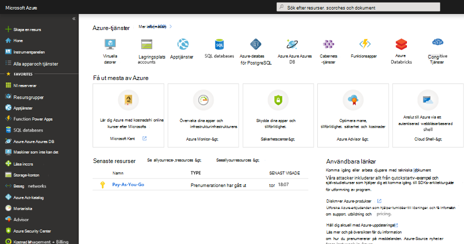

2. I det vänstra navigeringsfönstret klickar du på **Azure Active Directory**.

    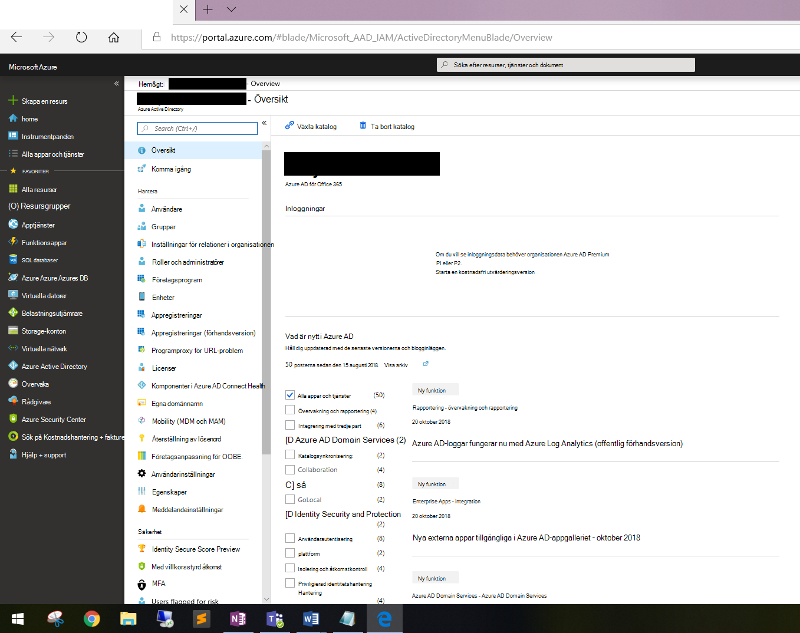

3. I det vänstra navigeringsfönstret klickar du **på Appregistreringar (förhandsversion)** och sedan på **Ny registrering.**

    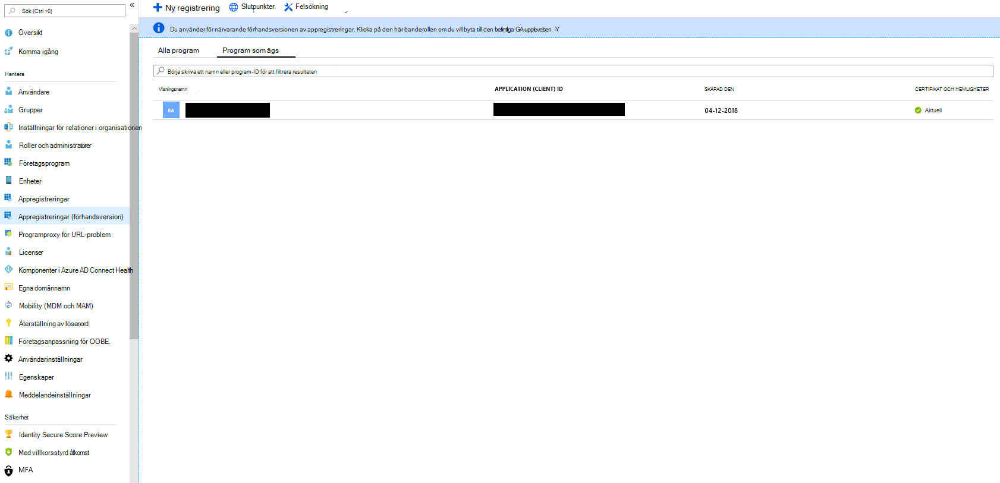

4. Registrera programmet. Under Omdirigera URI väljer du Webb i listrutan med programtyper och skriver <https://portal.azure.com> sedan i rutan för URI:en.

   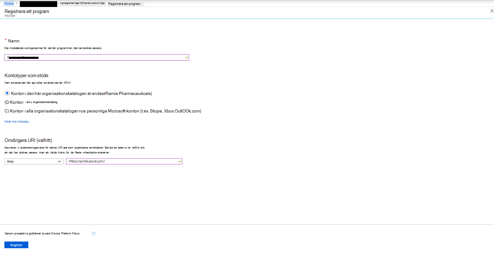

5. Kopiera **program-ID(klient)ID** **och katalog-ID (klientorganisation)** och spara dem i en textfil eller på en annan säker plats. Du använder de här ID:erna i senare steg.

   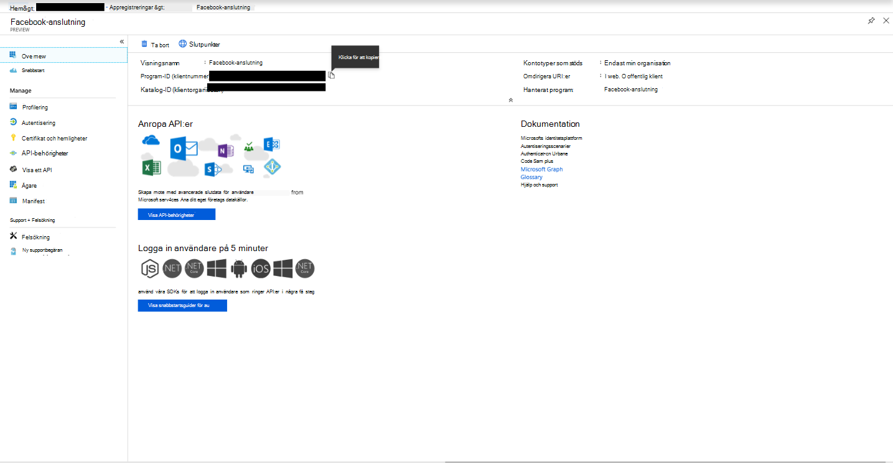

6. Gå till **Certifikat & för den nya appen.**

   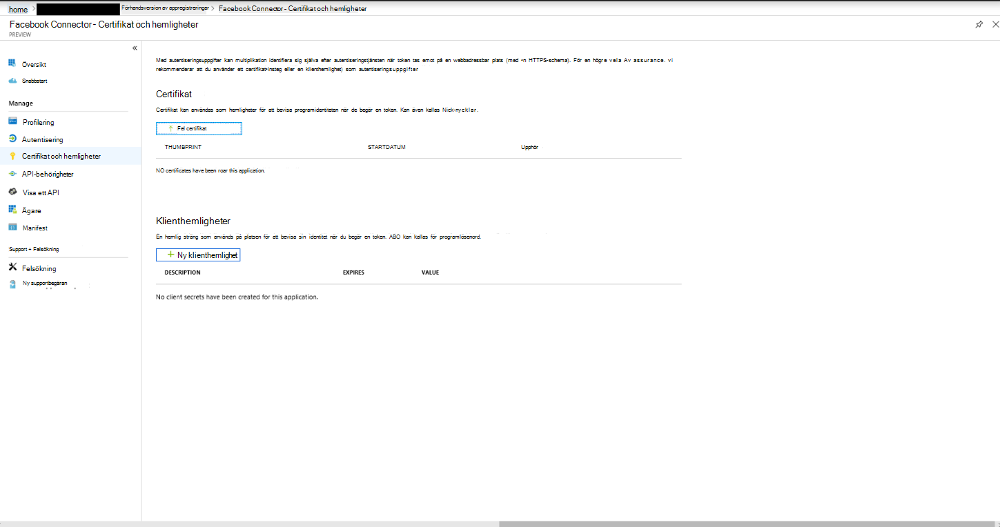

7. Klicka **på Ny klienthemlighet**

   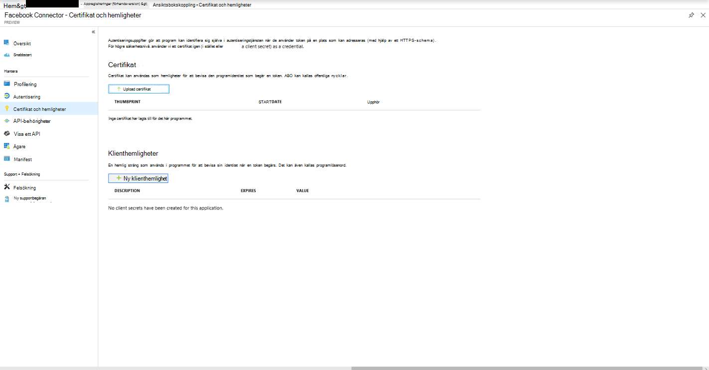

8. Skapa en ny hemlig. Skriv hemligheten i beskrivningsrutan och välj sedan en utgångsperiod.

    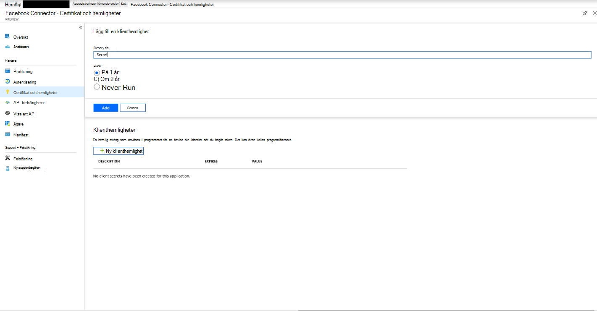

9. Kopiera värdet för hemligheten och spara den i en textfil eller annan lagringsplats. Det här är AAD-programhemligheten som du använder i senare steg.

   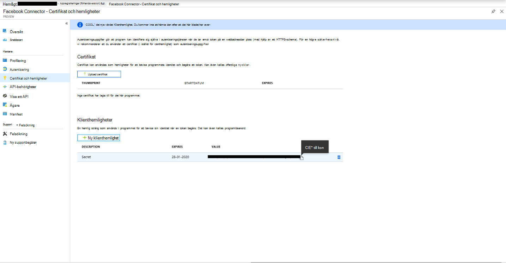

## Steg 2: Distribuera anslutarwebbtjänsten från GitHub till ditt Azure-konto

1. Gå till [den GitHub webbplatsen](https://github.com/microsoft/m365-sample-connector-csharp-aspnet) och klicka på Distribuera till **Azure.**

    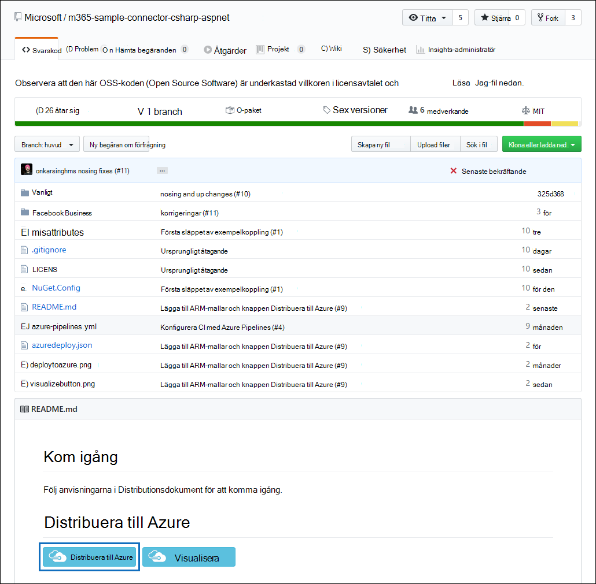

2. När du har **klickat på Distribuera** till Azure omdirigeras du till en Azure-portal med en anpassad mallsida. Fyll i Grunderna **och Inställningar** **och** klicka sedan på **Köp**.

   - **Prenumeration:** Välj den Azure-prenumeration som du vill distribuera webbtjänsten Facebook Business pages connector.

   - **Resursgrupp:** Välj eller skapa en ny resursgrupp. En resursgrupp är en behållare som innehåller relaterade resurser för en Azure-lösning.

   - **Plats:** Välj en plats.

   - **Web App-namn:** Ange ett unikt namn för webbappen för anslutning. Namnet måste vara mellan 3 och 18 tecken långt. Det här namnet används för att skapa URL-adressen för Azure-apptjänsten. Om du till exempel anger webbappens namn **för fbconnector** så visas Azures apptjänst-URL **fbconnector.azurewebsites.net.**

   - **tenantId:** Klientorganisations-ID:t för Microsoft 365 organisation som du kopierade när du skapade Facebook-anslutningsappen i Azure Active Directory steg 1.

   - **APISecretKey:** Du kan ange vilket värde som helst som hemlig. Det här används för att komma åt webbappen för anslutning i steg 5.

     

3. När distributionen är lyckad ser sidan ut ungefär som på följande skärmbild:

   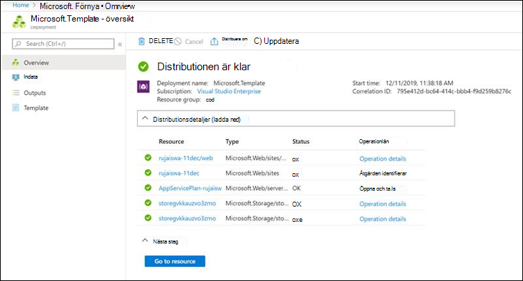

## Steg 3: Registrera Facebook-appen

1. Gå till , logga in med inloggningsuppgifterna för kontot för din <https://developers.facebook.com> organisations Facebook Business-sidor och klicka sedan på Lägg till nytt **program.**

   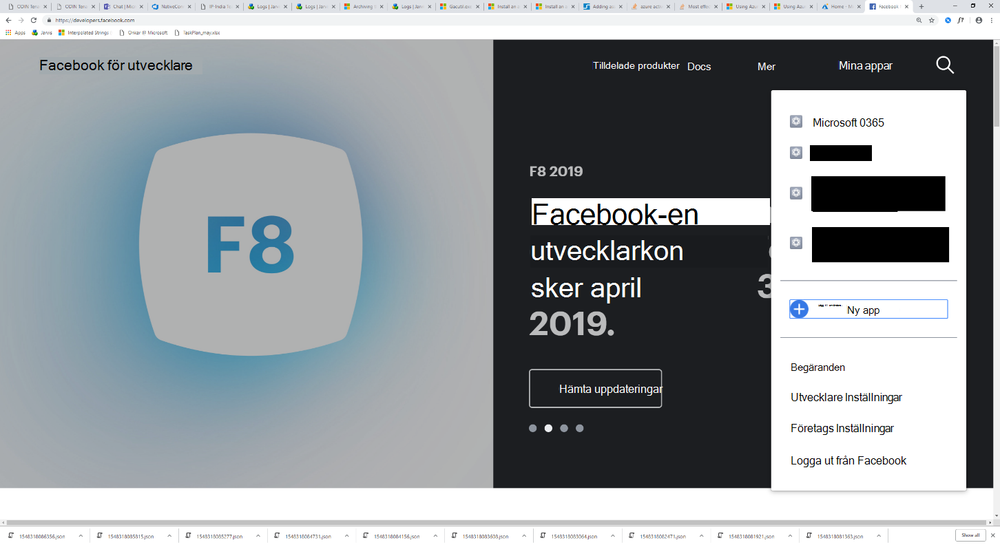

2. Skapa ett nytt program-ID.

   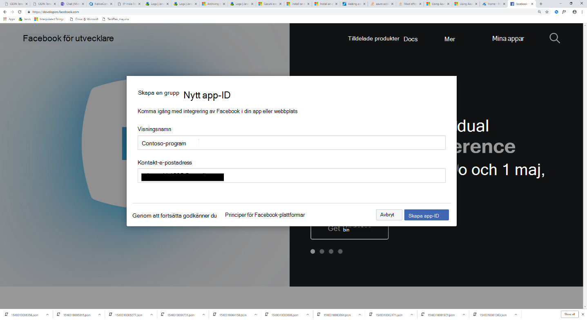

3. I det vänstra navigeringsfönstret klickar du på **Lägg till produkter** och sedan på **Konfigurera** i **panelen Facebook-inloggning.**

   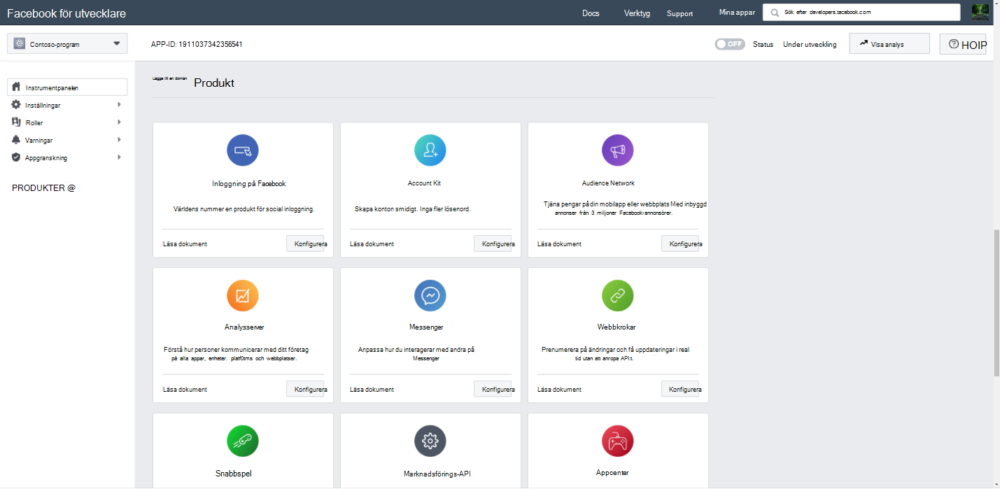

4. På sidan Integrera Facebook-inloggning klickar du på **Webb.**

   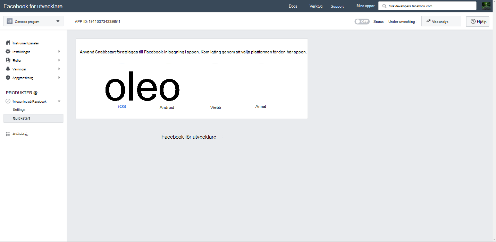

5. Lägg till URL:en för Azure-apptjänsten. till exempel `https://fbconnector.azurewebsites.net` .

   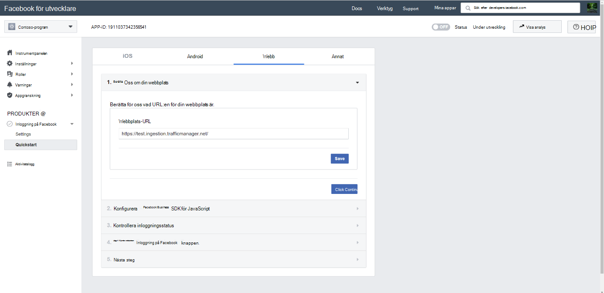

6. Slutför avsnittet Snabbstart i konfigurationen av Facebook-inloggningen.

   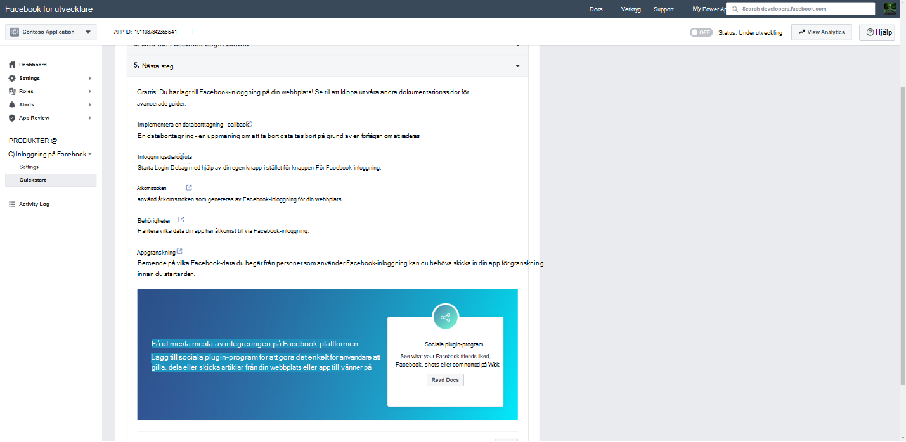

7. I det vänstra navigeringsfönstret under **Facebook-inloggning** klickar **Inställningar** och lägger till OAuth-omdirigerings-URI i rutan Giltiga **OAuth-omdirigerings-URI:er.** Använd formatet **\<connectorserviceuri> /Vyer/FacebookOAuth**, där värdet för connectorserviceuri är Azure-apptjänstens URL för din organisation, till exempel `https://fbconnector.azurewebsites.net` .

   

8. I det vänstra navigeringsfönstret klickar du **på Lägg till** produkter och sedan på **Webhooks.** Klicka **på Sida** i den nedermenyn **Sida.**

   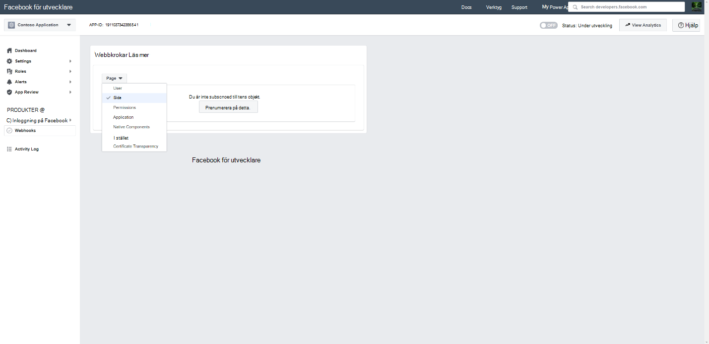

9. Lägg till Webhooks Callback-URL och lägg till en verifieringstoken. Formatet för URL:en för anrop använder du formatet **<connectorserviceuri> /api/FbPageWebhook,** där värdet för connectorserviceuri är Azure-apptjänst-URL:en för din organisation, till exempel `https://fbconnector.azurewebsites.net` .

   Verifieringstoken bör likna ett starkt lösenord. Kopiera verifieringstoken till en textfil eller annan lagringsplats.

   

10. Testa och prenumerera på slutpunkten för feed.

    

11. Lägg till en sekretess-URL, appikon och företagsanvändning. Kopiera även program-ID och programhemlighet till en textfil eller annan lagringsplats.

    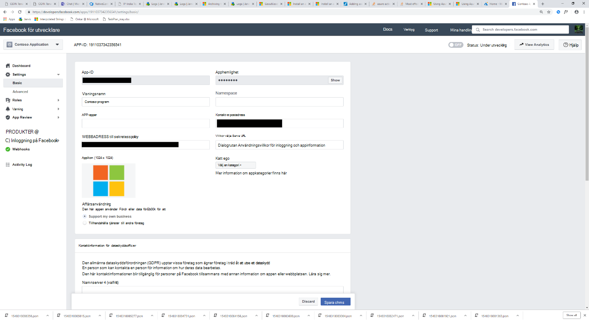

12. Gör appen offentlig.

    

13. Lägga till användare i rollen administratör eller testare.

    

14. Lägg till **behörigheten Sida med offentlig** innehållsåtkomst.

    

15. Lägg till behörigheten Hantera sidor.

    

16. Få programmet granskat av Facebook.

    

## Steg 4: Konfigurera webbprogrammet för anslutning

1. Gå till `https://<AzureAppResourceName>.azurewebsites.net` (där AzureAppResourceName är namnet på azure-appresursen som du döpte i steg 4). Om namnet till exempel är **fbconnector går** du till `https://fbconnector.azurewebsites.net` . Startsidan för appen ser ut som på följande skärmbild:

   

2. Klicka **på Konfigurera** för att visa en inloggningssida.

   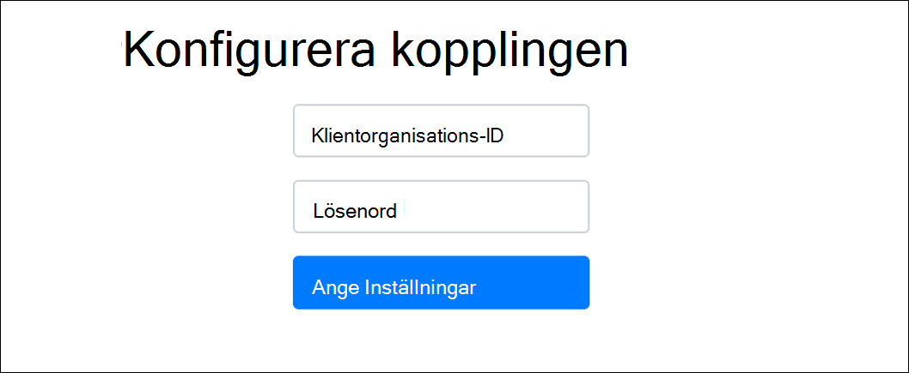

3. I rutan Klientorganisations-ID skriver eller klistrar du in ditt klientorganisations-ID (som du fick i steg 2). I lösenordsrutan skriver eller klistrar du in APISecretKey (som du fick i steg 2) och klickar sedan på Ange konfigurationsinställningar **Inställningar** att visa sidan med konfigurationsinformation.

    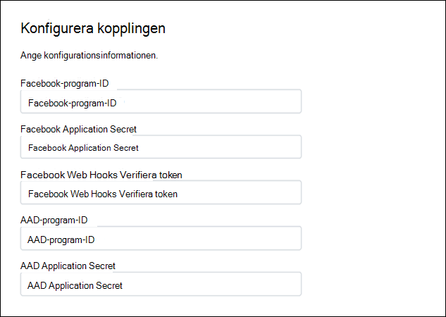

4. Ange följande konfigurationsinställningar

   - **Facebook-program-ID:** Program-ID för Facebook-programmet som du fick i steg 3.

   - **Programhemlighet i Facebook:** Apphemligheten för Facebook-programmet som du skaffade i steg 3.

   - **Facebook Webhooks verifiera token:** Den verifieringstoken som du skapade i steg 3.

   - **AAD-program-ID:** Program-ID:t för Azure Active Directory program som du skapade i steg 1.

   - **AAD-programhemlighet:** Värdet för APISecretKey-hemligheten som du skapade i steg 1.

5. Spara **kopplingsinställningarna** genom att klicka på Spara.

## Steg 5: Konfigurera en Facebook-anslutning i Microsoft 365 kompatibilitetscenter

1. Gå till [https://compliance.microsoft.com](https://compliance.microsoft.com) och klicka sedan på Datakopplingar i den vänstra **navigeringsfältet.**

2. På sidan **Datakopplingar** under **Facebook Business-sidor klickar** du på **Visa**.

3. På sidan **för Facebook-företagssidor** klickar du på **Lägg till koppling**.

4. Klicka på **Acceptera på** sidan **Användningsvillkor.**

5. På sidan **Lägg till autentiseringsuppgifter för kopplingsappen** anger du följande information och klickar sedan på **Validera anslutning.**

   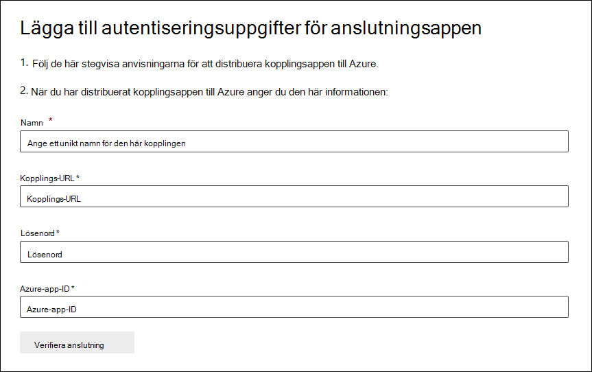

   - Ange ett **namn** på kopplingen i rutan Namn, till exempel Facebook **Nyheter-sidan.**

   - I rutan **Anslutnings-URL** skriver eller klistrar du in Azure-apptjänstens URL. till exempel `https://fbconnector.azurewebsites.net` .

   - I rutan **Lösenord** skriver eller klistrar du in värdet för APISecretKey som du lade till i steg 2.

   - I rutan **Azure-program-ID** skriver eller klistrar du in värdet för det Program (klient)-ID som även kallas AAD-program-ID som du skapade i steg 1.

6. När anslutningen har verifierats klickar du på **Nästa.**

7. På sidan **Auktorisera Microsoft 365 importera data** skriver eller klistrar du in APISecretKey igen och klickar sedan på **Logga in webbapp.**

8. På sidan **Konfigurera facebook-kopplingsappen** klickar du på Logga in med **Facebook** och loggar in med inloggningsuppgifterna för kontot för din organisations Facebook Business-sidor. Kontrollera att det Facebook-konto som du loggade in på har tilldelats administratörsrollen för din organisations Facebook Business-sidor.

   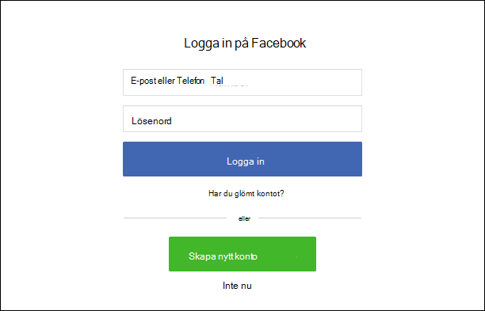

9. En lista med företagssidor som hanteras av det Facebook-konto som du loggade in på visas. Markera den sida som du vill arkivera och klicka sedan på **Nästa.**

   

10. Klicka **på** Fortsätt för att avsluta installationen av anslutningstjänstappen.

11. På sidan **Ange filter** kan du använda ett filter för att först importera objekt som är av en viss ålder. Välj en ålder och klicka sedan på **Nästa.**

12. På sidan **Välj lagringsplats** skriver du e-postadressen till den Microsoft 365 som Facebook-objekten ska importeras till och klickar sedan på **Nästa.**

13. Klicka **på Nästa** för att granska kopplingsinställningarna och klicka sedan på **Slutför** för att slutföra kopplingens konfiguration.

14. I **efterlevnadscentret** går du till sidan Datakopplingar och klickar på fliken Kopplingar för att se **importprocessens** förlopp.
