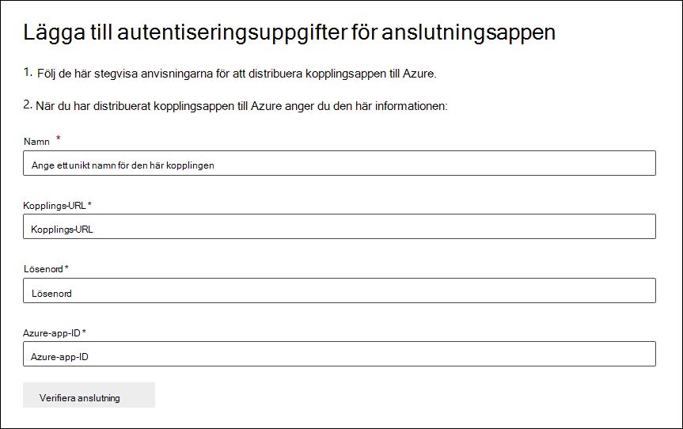

# Distribuera en anslutare för att arkivera Twitter-dataDeploy a connector to archive Twitter data

Den här artikeln innehåller stegvisa instruktioner för att distribuera en anslutare som använder tjänsten Office 365 för att importera data från organisationens Twitter-konto till Microsoft 365.This article contains the step-by-step process to deploy a connector that uses the Office 365 Import service to import data from your organization's Twitter account to Microsoft 365. En översikt över den här processen och en lista över förutsättningar för att distribuera en Twitter-anslutning finns i Konfigurera en anslutning för att arkivera [Twitter-data. ](archive-twitter-data-with-sample-connector.md)For a high-level overview of this process and a list of prerequisites required to deploy a Twitter connector, see [Set up a connector to archive Twitter data ](archive-twitter-data-with-sample-connector.md). 

## Steg 1: Skapa en app i Azure Active DirectoryStep 1: Create an app in Azure Active Directory

1. Gå till <https://portal.azure.com> och logga in med autentiseringsuppgifterna för ett globalt administratörskonto.Go to <https://portal.azure.com> and sign in using the credentials of a global admin account.

   

2. I det vänstra navigeringsfönstret klickar du på **Azure Active Directory**.In the left navigation pane, click **Azure Active Directory**.

   

3. I det vänstra navigeringsfönstret klickar du **på Appregistreringar (förhandsversion)** och sedan på **Ny registrering.**In the left navigation pane, click **App registrations (Preview)** and then click **New registration**.

   

4. Registrera programmet.Register the application. Under **Omdirigera URI (valfritt)** väljer du **Webb** i listrutan programtyp och skriver sedan i rutan `https://portal.azure.com` för URI:n.Under **Redirect URI (optional)**, select **Web** in the application type dropdown list and then type `https://portal.azure.com` in the box for the URI.

   

5. Kopiera **program-ID(klient)ID** **och katalog-ID (klientorganisation)** och spara dem i en textfil eller på en annan säker plats.Copy the **Application (client) ID** and **Directory (tenant) ID** and save them to a text file or other safe location. Du använder de här ID:erna i senare steg.You use these IDs in later steps.

    

6. Gå till **Certifikat & för den nya appen och** under Klienthemligheter **klickar** du på **Ny klienthemlighet.**Go to **Certificates & secrets for the new app** and under **Client secrets** click **New client secret**.

   

7. Skapa en ny hemlig.Create a new secret. Skriv hemligheten i beskrivningsrutan och välj sedan en utgångsperiod.In the description box, type the secret and then choose an expiration period. 

   

8. Kopiera värdet för hemligheten och spara den i en textfil eller annan lagringsplats.Copy the value of the secret and save it to a text file or other storage location. Det här är AAD-programhemligheten som du använder i senare steg.This is the AAD application secret that you use in later steps.

   

## Steg 2: Distribuera anslutarwebbtjänsten från GitHub till ditt Azure-kontoStep 2: Deploy the connector web service from GitHub to your Azure account

1. Gå till [den GitHub webbplatsen](https://github.com/microsoft/m365-sample-twitter-connector-csharp-aspnet) och klicka på Distribuera till **Azure.**Go to [this GitHub site](https://github.com/microsoft/m365-sample-twitter-connector-csharp-aspnet) and click **Deploy to Azure**.

    

2. När du har **klickat på Distribuera** till Azure omdirigeras du till en Azure-portal med en anpassad mallsida.After you click **Deploy to Azure**, you will be redirected to an Azure portal with a custom template page. Fyll i Grunderna **och Inställningar** **och** klicka sedan på **Köp**.Fill in the **Basics** and **Settings** details and then click **Purchase**.

   

    - **Prenumeration:** Välj den Azure-prenumeration du vill distribuera webbtjänsten för Twitter-anslutning till.**Subscription:** Select your Azure subscription that you want to deploy the Twitter connector web service to.
    
    - **Resursgrupp:** Välj eller skapa en ny resursgrupp.**Resource group:** Choose or create a new resource group. En resursgrupp är en behållare som innehåller relaterade resurser för en Azure-lösning.A resource group is a container that holds related resources for an Azure solution.

    - **Plats:** Välj en plats.**Location:** Choose a location.

    - **Web App-namn:** Ange ett unikt namn för webbappen för anslutning.**Web App Name:** Provide a unique name for the connector web app. Namnet måste vara mellan 3 och 18 tecken långt.Th name must be between 3 and 18 characters in length. Det här namnet används för att skapa URL-adressen för Azure-apptjänsten. Om du till exempel anger webbappens namn **för twitterconnector** kommer Azure-apptjänstens URL att **twitterconnector.azurewebsites.net.**This name is used to create the Azure app service URL; for example, if you provide the Web app name of **twitterconnector** then the Azure app service URL  will be **twitterconnector.azurewebsites.net**.
    
    - **tenantId:** Klientorganisations-ID:t för Microsoft 365 organisationen som du kopierade när du skapade Facebook-anslutningsappen i Azure Active Directory i steg 1.**tenantId:** The tenant ID of your Microsoft 365 organization that you copied after creating the Facebook connector app in Azure       Active Directory in Step 1.
    
   - **APISecretKey:** Du kan ange vilket värde som helst som hemlig.**APISecretKey:** You can type any value as the secret. Det här används för att komma åt webbappen för anslutning i steg 5.This is used to access the connector web app in Step 5.

3. När distributionen är lyckad ser sidan ut ungefär som på följande skärmbild:After the deployment is successful, the page will look similar to the following screenshot:

    

## Steg 3: Skapa Twitter-appenStep 3: Create the Twitter app

1. Gå till https://developer.twitter.com , logga in med inloggningsuppgifterna för utvecklarkontot för din organisation och klicka sedan på **Appar.**Go to https://developer.twitter.com, log in using the credentials for the developer account for your organization, and then click **Apps**.

   
2. Klicka **på Skapa ett program.**Click **Create an app**.
   
   

3. Lägg **till information** om programmet under Programinformation.Under **App details**, add information about the application.

   

4. På instrumentpanelen för Twitter-utvecklare väljer du appen du just skapade och klickar sedan på **Information**.On the Twitter developer dashboard, select the app that you just created and then click **Details**.
   
   

5. Under **Konsument-API-nycklar** på  fliken Nycklar och token kopierar du både API-nyckeln och API-hemliga nyckeln och sparar dem till en textfil eller annan lagringsplats.On the **Keys and tokens** tab, under **Consumer API keys** copy both the API Key and the API secret key and save them to a text file or other storage location. Klicka sedan på **Skapa** för att generera en åtkomsttoken och åtkomsttokenhemlighet och kopiera dessa till en textfil eller annan lagringsplats.Then click **Create** to generate an access token and access token secret and copy these to a text file or other storage location.
   
   

   Klicka sedan **på Skapa** för att generera en åtkomsttoken och en åtkomsttokenhemlighet, och kopiera dessa till en textfil eller annan lagringsplats.Then click **Create** to generate an access token and an access token secret, and copy these to a text file or other storage location.

6. Klicka på **fliken** Behörigheter och konfigurera behörigheterna enligt följande skärmbild:Click the **Permissions** tab and configure the permissions as shown in the following screenshot:

   

7. När du har sparat behörighetsinställningarna klickar du **på fliken Appinformation** och sedan på **Redigera > Redigera information**.After you save the permission settings, click the **App details** tab, and then click **Edit > Edit details**.

   

8. Gör följande:Do the following tasks:

   - Markera kryssrutan om du vill tillåta att anslutningsappen loggar in på Twitter.Select the checkbox to allow the connector app to sign in to Twitter.
   
   - Lägg till OAuth-omdirigerings-Uri med följande format: **\<connectorserviceuri> /Views/TwitterOAuth**, där värdet för *connectorserviceuri* är Azure-apptjänst-URL:en för organisationen, till exempel https://twitterconnector.azurewebsites.net/Views/TwitterOAuth .Add the OAuth redirect Uri using the following format: **\<connectorserviceuri>/Views/TwitterOAuth**, where the value of *connectorserviceuri* is the Azure app service URL for your organization; for example, https://twitterconnector.azurewebsites.net/Views/TwitterOAuth.

    

Utvecklarappen för Twitter är nu redo att använda.The Twitter developer app is now ready to use.

## Steg 4: Konfigurera webbprogrammet för anslutningStep 4: Configure the connector web app 

1. Gå till https:// \<AzureAppResourceName> .azurewebsites.net (där **AzureAppResourceName** är namnet på din Azure-appresurs som du döpte i steg 4).Go to https://\<AzureAppResourceName>.azurewebsites.net (where **AzureAppResourceName** is the name of your Azure app resource that you named in Step 4). Om namnet till exempel är **twitterconnector går** du till https://twitterconnector.azurewebsites.net .For example, if the name is **twitterconnector**, go to https://twitterconnector.azurewebsites.net. Startsidan för appen ser ut som på följande skärmbild:The home page of the app looks like the following screenshot:

   

2. Klicka **på Konfigurera** för att visa en inloggningssida.Click **Configure** to display a sign in page.

   

3. I rutan Klientorganisations-ID skriver eller klistrar du in ditt klientorganisations-ID (som du fick i steg 2).In the Tenant Id box, type or paste your tenant Id (that you obtained in Step 2). I lösenordsrutan skriver eller klistrar du in APISecretKey (som du fick i steg 2) och klickar sedan på Ange konfigurationsinställningar **Inställningar** att visa sidan med konfigurationsinformation.In the password box, type or paste the APISecretKey (that you obtained in Step 2), and then click **Set Configuration Settings** to display the configuration details page.

   

4. Ange följande konfigurationsinställningarEnter the following configuration settings 

   - **Api-nyckel för Twitter:** API-nyckeln för Twitter-programmet som du skapade i steg 3.**Twitter Api Key:** The API key for the Twitter application that you created in Step 3.
   
   - **Twitter Api-hemlig nyckel:** API-hemlig nyckel för Twitter-programmet som du skapade i steg 3.**Twitter Api Secret Key:** The API secret key for the Twitter application that you created in Step 3.
   
   - **Twitter-åtkomsttoken:** Åtkomsttoken som du skapade i steg 3.**Twitter Access Token:** The access token that you created in Step 3.
   
   - **Twitter Access Token Secret:** Den åtkomsttokens hemligt som du skapade i steg 3.**Twitter Access Token Secret:** The access token secret that you created in Step 3.
   
   - **AAD-program-ID:** Program-ID för Azure Active Directory som du skapade i steg 1**AAD Application ID:** The application ID for the Azure Active Directory app that you created in Step 1
   
   - **AAD-programhemlighet:** Värdet för APISecretKey-hemligheten som du skapade i steg 1.**AAD Application Secret:** The value for the APISecretKey secret that you created in Step 1.

5. Spara **kopplingsinställningarna** genom att klicka på Spara.Click **Save** to save the connector settings.

## Steg 5: Konfigurera en Twitter-anslutning i Microsoft 365 för efterlevnadscenterStep 5: Set up a Twitter connector in the Microsoft 365 compliance center

1. Gå till [https://compliance.microsoft.com](https://compliance.microsoft.com) och klicka sedan på Datakopplingar i den vänstra **navigeringsfältet.**Go to [https://compliance.microsoft.com](https://compliance.microsoft.com) and then click **Data connectors** in the left nav.

2. På sidan **Datakopplingar** under **Twitter klickar** du på **Visa**.On the **Data connectors** page under **Twitter**, click **View**.

3. Klicka på **Lägg** till koppling på **Twitter-sidan.**On the **Twitter** page, click **Add connector**.

4. Klicka på **Acceptera på** sidan **Användningsvillkor.**On the **Terms of service** page, click **Accept**.

5. På sidan **Lägg till autentiseringsuppgifter för kopplingsappen** anger du följande information och klickar sedan på **Validera anslutning.**On the **Add credentials for your connector app** page, enter the following information and then click **Validate connection**.

   

    - Ange ett **namn** på kopplingen i rutan Namn, till exempel **Twitter-hjälphandtaget**.In the **Name** box, type a name for the connector, such as **Twitter help handle**.
    
    - I rutan **Kopplings-URL** skriver eller klistrar du in Azure-apptjänst-URL:en. till exempel `https://twitterconnector.azurewebsites.net` .In the **Connector URL** box, type or paste the Azure app service URL; for example `https://twitterconnector.azurewebsites.net`.
    
    - I rutan **Lösenord** skriver eller klistrar du in värdet för APISecretKey som du skapade i steg 2.In the **Password** box, type or paste the value of the APISecretKey that you created in Step 2.
    
    - I rutan **Azure-app-ID** skriver eller klistrar du in värdet för Azure Application App-ID (kallas även *klient-ID)* som du fick i steg 1.In the **Azure App ID** box, type or paste the value of the Azure Application App Id (also called the *client ID*) that you obtained in Step 1.

6. När anslutningen har verifierats klickar du på **Nästa.**After the connection is successfully validated, click **Next**.

7. På sidan **Auktorisera Microsoft 365 importera data** skriver eller klistrar du in APISecretKey igen och klickar sedan på **Logga in webbapp.**On the **Authorize Microsoft 365 to import data** page, type or paste the APISecretKey again and then click  **Login web app**.

8. Klicka **på Logga in med Twitter.**Click **Login with Twitter**.

9. På inloggningssidan för Twitter loggar du in med inloggningsuppgifterna för din organisations Twitter-konto.On the Twitter sign in page, sign in using the credentials for your organization's Twitter account.

   

   När du har loggat in visas följande meddelande på Twitter-sidan: "Twitter Connector Job Successfully set up".After you sign in, the Twitter page will display the following message, "Twitter Connector Job Successfully set up."

10. Klicka **på Fortsätt** för att slutföra kon settingen av Twitter-anslutningen.Click **Continue** to complete setting up the Twitter connector.

11. På sidan **Ange filter** kan du använda ett filter för att först importera objekt som är av en viss ålder.On the **Set filters** page, you can apply a filter to initially import items that are a certain age. Välj en ålder och klicka sedan på **Nästa.**Select an age, and then click **Next**.

12. På sidan **Välj lagringsplats** skriver du e-postadressen till den Microsoft 365 postlådan som Twitter-objekten ska importeras till och klickar sedan på **Nästa.**On the **Choose storage location** page, type the email address of Microsoft 365 mailbox that the Twitter items will be imported to, and then click **Next**.

13. Klicka **på Nästa** för att granska kopplingsinställningarna och klicka sedan på **Slutför** för att slutföra kopplingens konfiguration.Click **Next** to review the connector settings and then click **Finish** to complete the connector setup.

14. I **efterlevnadscentret** går du till sidan Datakopplingar och klickar på fliken Kopplingar för att se **importprocessens** förlopp.In the compliance center, go to the **Data connectors** page, and click the **Connectors** tab to see the progress of the import process.
