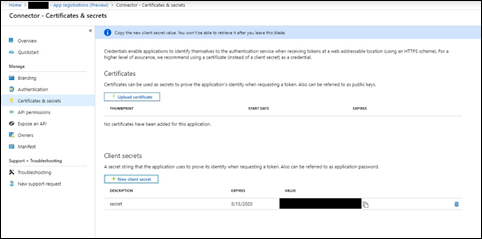
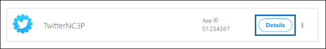
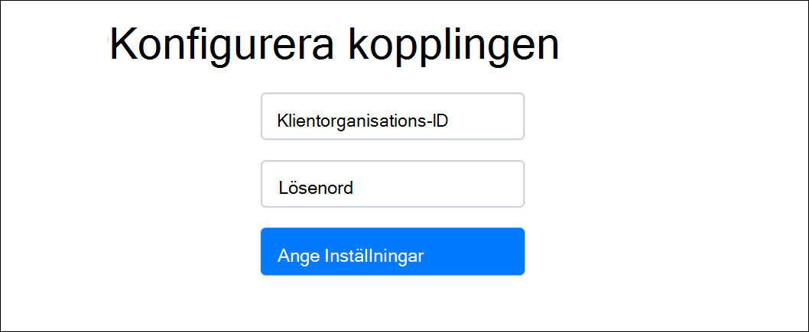

# Distribuera en anslutare för att arkivera Twitter-data

Den här artikeln innehåller stegvisa instruktioner för att distribuera en anslutare som använder tjänsten Office 365 för att importera data från organisationens Twitter-konto till Microsoft 365. En översikt över den här processen och en lista över förutsättningar för att distribuera en Twitter-anslutning finns i Konfigurera en anslutning för att arkivera [Twitter-data. ](archive-twitter-data-with-sample-connector.md)

## Steg 1: Skapa en app i Azure Active Directory

1. Gå till <https://portal.azure.com> och logga in med autentiseringsuppgifterna för ett globalt administratörskonto.

   

2. I det vänstra navigeringsfönstret klickar du på **Azure Active Directory**.

   

3. I det vänstra navigeringsfönstret klickar du **på Appregistreringar (förhandsversion)** och sedan på **Ny registrering.**

   

4. Registrera programmet. Under **Omdirigera URI (valfritt)** väljer du **Webb** i listrutan programtyp och skriver sedan i rutan `https://portal.azure.com` för URI:n.

   

5. Kopiera **program-ID(klient)ID** **och katalog-ID (klientorganisation)** och spara dem i en textfil eller på en annan säker plats. Du använder de här ID:erna i senare steg.

    

6. Gå till **Certifikat & för den nya appen och** under Klienthemligheter **klickar** du på **Ny klienthemlighet.**

   

7. Skapa en ny hemlig. Skriv hemligheten i beskrivningsrutan och välj sedan en utgångsperiod.

   

8. Kopiera värdet för hemligheten och spara den i en textfil eller annan lagringsplats. Det här är AAD-programhemligheten som du använder i senare steg.

   

## Steg 2: Distribuera anslutarwebbtjänsten från GitHub till ditt Azure-konto

1. Gå till [den GitHub webbplatsen](https://github.com/microsoft/m365-sample-twitter-connector-csharp-aspnet) och klicka på Distribuera till **Azure.**

    

2. När du har **klickat på Distribuera** till Azure omdirigeras du till en Azure-portal med en anpassad mallsida. Fyll i Grunderna **och Inställningar** **och** klicka sedan på **Köp**.

   

    - **Prenumeration:** Välj den Azure-prenumeration du vill distribuera webbtjänsten för Twitter-anslutning till.

    - **Resursgrupp:** Välj eller skapa en ny resursgrupp. En resursgrupp är en behållare som innehåller relaterade resurser för en Azure-lösning.

    - **Plats:** Välj en plats.

    - **Web App-namn:** Ange ett unikt namn för webbappen för anslutning. Namnet måste vara mellan 3 och 18 tecken långt. Det här namnet används för att skapa URL-adressen för Azure-apptjänsten. Om du till exempel anger webbappens namn **för twitterconnector** kommer Azure-apptjänstens URL att **twitterconnector.azurewebsites.net.**

    - **tenantId:** Klientorganisations-ID:t för Microsoft 365 organisationen som du kopierade när du skapade Facebook-anslutningsappen i Azure Active Directory i steg 1.

   - **APISecretKey:** Du kan ange vilket värde som helst som hemlig. Det här används för att komma åt webbappen för anslutning i steg 5.

3. När distributionen är lyckad ser sidan ut ungefär som på följande skärmbild:

    

## Steg 3: Skapa Twitter-appen

1. Gå till https://developer.twitter.com , logga in med inloggningsuppgifterna för utvecklarkontot för din organisation och klicka sedan på **Appar.**

   
2. Klicka **på Skapa ett program.**

   

3. Lägg **till information** om programmet under Programinformation.

   

4. På instrumentpanelen för Twitter-utvecklare väljer du appen du just skapade och klickar sedan på **Information**.

   

5. Under **Konsument-API-nycklar** på  fliken Nycklar och token kopierar du både API-nyckeln och API-hemliga nyckeln och sparar dem till en textfil eller annan lagringsplats. Klicka sedan på **Skapa** för att generera en åtkomsttoken och åtkomsttokenhemlighet och kopiera dessa till en textfil eller annan lagringsplats.

   

   Klicka sedan **på Skapa** för att generera en åtkomsttoken och en åtkomsttokenhemlighet, och kopiera dessa till en textfil eller annan lagringsplats.

6. Klicka på **fliken** Behörigheter och konfigurera behörigheterna enligt följande skärmbild:

   

7. När du har sparat behörighetsinställningarna klickar du **på fliken Appinformation** och sedan på **Redigera > Redigera information**.

   

8. Gör följande:

   - Markera kryssrutan om du vill tillåta att anslutningsappen loggar in på Twitter.

   - Lägg till OAuth-omdirigerings-Uri med följande format: **\<connectorserviceuri> /Views/TwitterOAuth**, där värdet för *connectorserviceuri* är Azure-apptjänst-URL:en för organisationen, till exempel https://twitterconnector.azurewebsites.net/Views/TwitterOAuth .

    

Utvecklarappen för Twitter är nu redo att använda.

## Steg 4: Konfigurera webbprogrammet för anslutning

1. Gå till https:// \<AzureAppResourceName> .azurewebsites.net (där **AzureAppResourceName** är namnet på din Azure-appresurs som du döpte i steg 4). Om namnet till exempel är **twitterconnector går** du till https://twitterconnector.azurewebsites.net . Startsidan för appen ser ut som på följande skärmbild:

   

2. Klicka **på Konfigurera** för att visa en inloggningssida.

   

3. I rutan Klientorganisations-ID skriver eller klistrar du in ditt klientorganisations-ID (som du fick i steg 2). I lösenordsrutan skriver eller klistrar du in APISecretKey (som du fick i steg 2) och klickar sedan på Ange konfigurationsinställningar **Inställningar** att visa sidan med konfigurationsinformation.

   

4. Ange följande konfigurationsinställningar

   - **Api-nyckel för Twitter:** API-nyckeln för Twitter-programmet som du skapade i steg 3.

   - **Twitter Api-hemlig nyckel:** API-hemlig nyckel för Twitter-programmet som du skapade i steg 3.

   - **Twitter-åtkomsttoken:** Åtkomsttoken som du skapade i steg 3.

   - **Twitter Access Token Secret:** Den åtkomsttokens hemligt som du skapade i steg 3.

   - **AAD-program-ID:** Program-ID för Azure Active Directory som du skapade i steg 1

   - **AAD-programhemlighet:** Värdet för APISecretKey-hemligheten som du skapade i steg 1.

5. Spara **kopplingsinställningarna** genom att klicka på Spara.

## Steg 5: Konfigurera en Twitter-anslutning i Microsoft 365 Efterlevnadscenter

1. Gå till [https://compliance.microsoft.com](https://compliance.microsoft.com) och klicka sedan på Datakopplingar i den vänstra **navigeringsfältet.**

2. På sidan **Datakopplingar** under **Twitter klickar** du på **Visa**.

3. Klicka på **Lägg** till koppling på **Twitter-sidan.**

4. Klicka på **Acceptera på** sidan **Användningsvillkor.**

5. På sidan **Lägg till autentiseringsuppgifter för kopplingsappen** anger du följande information och klickar sedan på **Validera anslutning.**

   

    - Ange ett **namn** på kopplingen i rutan Namn, till exempel **Twitter-hjälphandtaget**.

    - I rutan **Kopplings-URL** skriver eller klistrar du in Azure-apptjänst-URL:en. till exempel `https://twitterconnector.azurewebsites.net` .

    - I rutan **Lösenord** skriver eller klistrar du in värdet för APISecretKey som du skapade i steg 2.

    - I rutan **Azure-app-ID** skriver eller klistrar du in värdet för Azure Application App-ID (kallas även *klient-ID)* som du fick i steg 1.

6. När anslutningen har verifierats klickar du på **Nästa.**

7. På sidan **Auktorisera Microsoft 365 importera data** skriver eller klistrar du in APISecretKey igen och klickar sedan på **Logga in webbapp.**

8. Klicka **på Logga in med Twitter.**

9. På inloggningssidan för Twitter loggar du in med inloggningsuppgifterna för din organisations Twitter-konto.

   

   När du har loggat in visas följande meddelande på Twitter-sidan: "Twitter Connector Job Successfully set up".

10. Klicka **på Fortsätt** för att slutföra kon settingen av Twitter-anslutningen.

11. På sidan **Ange filter** kan du använda ett filter för att först importera objekt som är av en viss ålder. Välj en ålder och klicka sedan på **Nästa.**

12. På sidan **Välj lagringsplats** skriver du e-postadressen till den Microsoft 365 postlådan som Twitter-objekten ska importeras till och klickar sedan på **Nästa.**

13. Klicka **på Nästa** för att granska kopplingsinställningarna och klicka sedan på **Slutför** för att slutföra kopplingens konfiguration.

14. I **efterlevnadscentret** går du till sidan Datakopplingar och klickar på fliken Kopplingar för att se **importprocessens** förlopp.
