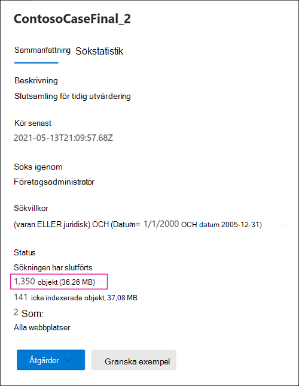
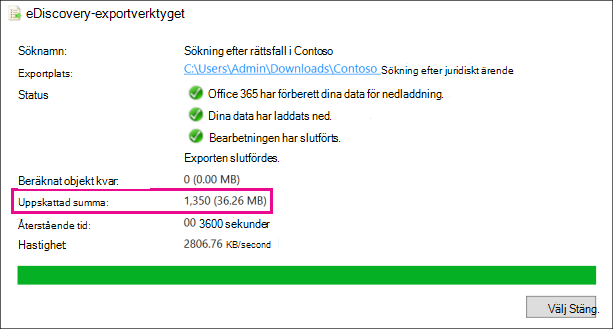
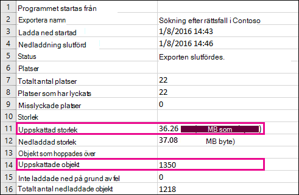
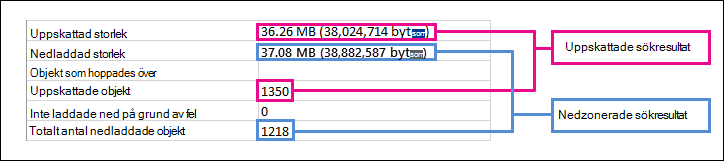

# Skillnader mellan uppskattade och faktiska eDiscovery-sökresultatDifferences between estimated and actual eDiscovery search results

Det här avsnittet gäller sökningar som du kan köra med något av följande Microsoft 365 eDiscovery-verktyg:This topic applies to searches that you can run using one of the following Microsoft 365 eDiscovery tools: 

- InnehållssökningContent search
- Core eDiscoveryCore eDiscovery

När du kör en eDiscovery-sökning returnerar verktyget du använder en uppskattning av antalet objekt (och deras totala storlek) som matchar sökvillkoren.When you run an eDiscovery search, the tool you're using will return an estimate of the number of items (and their total size) that match the search criteria. När du till exempel kör en sökning i kompatibilitetscentret för Microsoft 365, visas det uppskattade sökresultatet på den utfällade sidan för den markerade sökningen.For example, when you run a search in the Microsoft 365 compliance center, the estimated search results are displayed on the flyout page for the selected search.
  

  
Det här är samma uppskattning av den totala storleken och antalet objekt som visas i verktyget för eDiscovery-export när du exporterar resultaten till en lokal dator och i rapporten Om sammanfattning av export som hämtas med sökresultaten.This is the same estimate of total size and number of items that is displayed in the eDiscovery Export Tool when you export results to a local computer and in the Export Summary report that's downloaded with the search results.
  
**Uppskattade resultat i eDiscovery-exportverktyget****Estimated results in the eDiscovery Export tool**

  
**Uppskattat resultat i rapporten Exportsammanfattning****Estimated results in Export Summary report**

  
Som du ser i föregående skärmbild av rapporten Exportsammanfattning skiljer sig storleken och antalet verkliga sökresultat som hämtas från från storleken och antalet uppskattade sökresultat.However, as you'll notice in the previous screenshot of the Export Summary report, the size and number of actual search results that are downloaded are different than the size and number of estimated search results.
  

  
Här är några anledningar till dessa skillnader:Here are some reasons for these differences:
  
- **Sättet som resultaten beräknas på.****The way results are estimated**. En uppskattning av sökresultatet är just det, en uppskattning (och inte ett faktiskt antal) av de objekt som uppfyller sökfrågans villkor.An estimate of the search results is just that, an estimate (and not an actual count) of the items that meet the search query criteria. För att sammanställa uppskattningen av Exchange objekt begärs en lista med meddelande-ID:er som uppfyller sökvillkoren från Exchange-databasen av det eDiscovery-verktyg som du använder.To compile the estimate of Exchange items, a list of the message IDs that meet the search criteria is requested from the Exchange database by the eDiscovery tool you're using. Men när du exporterar sökresultaten kör sökningen igen och de faktiska meddelandena hämtas från Exchange databas.But when you export the search results, the search is rerun and the actual messages are retrieved from the Exchange database. Skillnaderna kan därför vara ett resultat av hur det uppskattade antalet objekt och det faktiska antalet objekt bestäms.So these differences might result because of how the estimated number of items and the actual number of items are determined.

- **Ändringar som inträffar mellan tidpunkter när du uppskattar och exporterar sökresultat**.**Changes that happen between the time when estimating and exporting search results**. När du exporterar sökresultat startas sökningen om för att samla in de senaste objekten i sökindexet som uppfyller sökvillkoren.When you export search results, the search is restarted to collect that most recent items in the search index that meet the search criteria. Det är möjligt att det finns ytterligare objekt som skapats, skickats eller tagits emot och som uppfyller sökvillkoren under tiden från det att det uppskattade sökresultatet samlades in och när sökresultatet exporterades.It's possible there are additional items were created, sent, or received that meet the search criteria in the time between when the estimated search results were collected and when the search results were exported. Det är också möjligt att objekt som fanns i sökindexet när sökresultaten uppskattades inte längre finns där eftersom de togs bort från innehållsplatsen innan sökresultaten exporterades.It's also possible that items that were in the search index when the search results were estimated are no longer there because they were purged from the content location before the search results are exported. Ett sätt att minimera det här problemet är att ange ett datumintervall för en e-dataidentifieringssökning.One way to mitigate this issue is to specify a date range for an eDiscovery search. Ett annat sätt är att placera ett lager på innehållsplatser så att objekt bevaras och inte kan rensas.Another way is to place a hold on content locations so that items are preserved and can't be purged. 

   Även om det är ovanligt, även om ett undantag används, kan underhåll av inbyggda kalenderobjekt (som inte kan redigeras av användaren men ingår i många sökresultat) tas bort då och då.Although rare, even in the case when a hold is applied, maintenance of built-in calendar items (which aren't editable by the user, but are included in many search results) may be removed from time to time. Den här periodiska borttagningen av kalenderobjekt resulterar i färre objekt som exporteras.This periodic removal of calendar items will result in fewer items that are exported.

- **Icke indexerade objekt.****Unindexed items**. Objekt som inte är indexerade för sökning kan orsaka skillnader mellan uppskattade och faktiska sökresultat.Items that are unindexed for search can cause differences between estimated and actual search results. Du kan ta med icke indexerade objekt när du exporterar sökresultatet.You can include unindexed items when you export the search results. Om du tar med icke indexerade objekt när du exporterar sökresultat kan det finnas fler objekt som exporteras.If you include unindexed items when exporting search results, there might be more items that are exported. Det här orsakar en skillnad mellan det uppskattade och exporterade sökresultatet.This will cause a difference between the estimated and exported search results.

    När du använder verktyget Innehållssökning kan du välja att inkludera icke indexerade objekt när du exporterar sökresultat.When using the Content search tool, you have the option to include unindexed items when you export search results. Antalet icke indexerade objekt som returneras av sökningen visas på den utfällda sidan tillsammans med andra uppskattade sökresultat.The number of unindexed items returned by the search is listed on the flyout page together with the other estimated search results. Icke indexerade objekt inkluderas också i den totala storleken på det uppskattade sökresultatet.Any unindexed items would also be included in the total size of the estimated search results. När du exporterar sökresultat kan du välja att ta med eller inte inkludera icke indexerade objekt.When you export search results, you have the option to include or not include unindexed items. Hur du konfigurerar alternativen kan resultera i skillnader mellan uppskattat och de faktiska sökresultat som hämtas.How you configure these options might result in differences between estimated and the actual search results that are downloaded.

- **Exportera resultatet av en innehållssökning som omfattar alla innehållsplatser**.**Exporting the results of a Content search that includes all content locations**. Om sökningen du exporterar resultat från var en sökning på alla innehållsplatser i organisationen exporteras bara icke indexerade objekt från innehållsplatser som innehåller objekt som matchar sökvillkoren.If the search that you're exporting results from was a search of all content locations in your organization, then only the unindexed items from content locations that contain items that match the search criteria will be exported. Med andra ord exporteras inte icke indexerade objekt i postlådan eller webbplatsen om inga sökresultat hittas i en postlåda eller på en webbplats.In other words, if no search results are found in a mailbox or site, then any unindexed items in that mailbox or site won't be exported. Icke indexerade objekt från alla innehållsplatser (även de som inte innehåller objekt som matchar sökfrågan) inkluderas emellertid i det uppskattade sökresultatet.However, unindexed items from all content locations (even those that don't contain items that match the search query) will be included in the estimated search results.

    Alternativt, om sökningen du exporterar resultat från inkluderade specifika innehållsplatser, exporteras icke indexerade objekt (som inte utesluts av sökvillkoren) från alla innehållsplatser som anges i sökningen.Alternatively, if the search that you're exporting results from included specific content locations, then unindexed items (that aren't excluded by the search criteria) from all the content locations specified in the search will be exported. I det här fallet ska det uppskattade antalet icke indexerade objekt och antalet icke indexerade objekt som exporteras vara detsamma.In this case, the estimated number of unindexed items and the number of unindexed items that are exported should be the same.

    Anledningen till att du inte exporterar icke indexerade objekt från varje plats i organisationen beror på att det kan öka sannolikheten för exportfel och öka tiden det tar att exportera och ladda ned sökresultaten.The reason for not exporting unindexed items from every location in the organization is because it might increase the likelihood of export errors and increase the time it takes to export and download the search results.

- **Icke indexerade objekt i SharePoint och OneDrive inte ingår i sökberäkningarna.****Unindexed items in SharePoint and OneDrive not included in the search estimates**. Icke indexerade objekt SharePoint webbplatser och OneDrive för företag-konton tas inte med i det uppskattade sökresultatet.Unindexed items from SharePoint sites and OneDrive for Business accounts aren't included in the estimated search results. Det beror på SharePoint-indexet inte innehåller data för icke indexerade objekt.This is because the SharePoint index doesn't contain data for unindexed items. Endast icke indexerade objekt från postlådor ingår i sökberäkningarna.Only unindexed items from mailboxes are included in the search estimates. Men om du tar med icke indexerade objekt när du exporterar sökresultat ingår icke indexerade objekt i SharePoint och OneDrive, vilket ökar antalet objekt som faktiskt exporteras.However, if you include unindexed items when exporting search results, unindexed items in SharePoint and OneDrive are included, which will increase the number of items that are actually exported. Det leder till skillnader mellan det uppskattade resultatet (som inte inkluderar icke indexerade objekt på SharePoint- OneDrive-webbplatserna) och de faktiska objekt som laddas ned.This will result in differences between the estimated results (which don't include unindexed items in SharePoint and OneDrive sites) and the actual items that are downloaded. Regeln om att exportera icke indexerade objekt endast från innehållsplatser som innehåller objekt som matchar sökvillkoren gäller fortfarande i det här fallet.The rule about exporting unindexed items only from content locations that contain items that match the search criteria still applies in this situation.

- **Dokumentversioner i SharePoint och OneDrive**.**Document versions in SharePoint and OneDrive**. När du SharePoint från OneDrive-konton tas inte flera versioner av ett dokument med i det uppskattade sökresultatet.When searching SharePoint sites and OneDrive accounts, multiple versions of a document aren't included in the count of estimated search results. Men du kan välja att inkludera alla dokumentversioner när du exporterar sökresultatet.But you have the option to include all document versions when you export the search results. Om du inkluderar dokumentversioner när du exporterar sökresultat, ökas det faktiska antalet (och den totala storleken) för de exporterade objekten.If you include document versions when exporting search results, the actual number (and total size) of the exported items will be increased.

- **SharePoint mappar**.**SharePoint folders**. Om mappnamnet i SharePoint matchar en sökfråga inkluderas ett antal sådana mappar i sökberäkningen (men inte objekten i de mapparna).If the name of folders in SharePoint matches a search query, the search estimate will include a count of those folders (but not the items in those folders). När du exporterar sökresultatet exporteras objekten i mappen, men den faktiska mappen exporteras inte.When you export the search results, the items in folder are exported but the actual folder in not exported. Resultatet är att antalet exporterade objekt är mer än det uppskattade sökresultatet.The result is that the number of exported items export will more than the number of estimated search results. Om en mapp är tom minskas antalet faktiska sökresultat med ett objekt, eftersom den faktiska mappen inte exporteras.If a folder is empty, then the number of actual search results exported will be reduced by one item, because the actual folder isn't exported.

- **SharePoint listor**.**SharePoint lists**. Om namnet på en söklista SharePoint en sökfråga inkluderas ett antal av alla objekt i listan i sökberäkningen.If the name of a SharePoint list matches a search query, the search estimate will include a count of all the items in the list. När du exporterar sökresultaten exporteras listan (och listobjekten) som en enda CSV-fil.When you export the search results, the list (and the list items) is exported as a single CSV file. Det här minskar det faktiska antalet objekt som faktiskt exporteras.This will reduce the actual number of items actually exported. Om listan innehåller bifogade filer exporteras de bifogade filerna som separata dokument, vilket också ökar antalet exporterade objekt.If the list contains attachments, the attachments will be exported as separate documents, which will also increase the number of items exported.

- **Rådatafilformat och exporterade filformat.****Raw file formats versus exported file formats**. För Exchange objekt beräknas den uppskattade storleken på sökresultatet med hjälp av storlekarna för Exchange meddelanden.For Exchange items, the estimated size of the search results is calculated by using the raw Exchange message sizes. Men e-postmeddelanden exporteras i en PST-fil eller som enskilda meddelanden (som är formaterade som EML-filer).However, email messages are exported in a PST file or as individual messages (which are formatted as EML files). Båda dessa exportalternativ använder ett annat filformat än obearbetade meddelanden Exchange, vilket resulterar i att den totala exporterade filstorleken skiljer sig från den uppskattade filstorleken.Both of these export options use a different file format than raw Exchange messages, which results in the total exported file size being different than the estimated file size.

- **Avduplicering av Exchange objekt under exporten.****De-duplication of Exchange items during export**. För Exchange objekt minskar avdupliceringen antalet objekt som exporteras.For Exchange items, de-duplication reduces the number of items that are exported. Du kan välja att duplicera sökresultaten när du exporterar dem.You have the option to de-duplicate the search results when you export them. För Exchange innebär det att bara en instans av ett meddelande exporteras, även om meddelandet kan hittas i flera postlådor.For Exchange messages, this means that only a single instance of a message is exported, even though that message might be found in multiple mailboxes. Det uppskattade sökresultatet inkluderar alla förekomster av ett meddelande.The estimated search results include every instance of a message. Om du väljer alternativet för avduplicering när du exporterar sökresultat kan det faktiska antalet exporterade objekt bli betydligt mindre än det uppskattade antalet objekt.So if you choose the de-duplication option when exporting search results, the actual number of items that are exported might be considerably less than the estimated number of items.

Sökresultatrapporten (Results.csv) innehåller en post för varje dubblettmeddelande och identifierar källpostlådan där det finns ett dubblettmeddelande.The search results report (Results.csv file) contains an entry for each duplicate message and identifies the source mailbox where a duplicate message is located. På så sätt kan du identifiera alla postlådor som innehåller ett duplicerat meddelande.This helps you identify all mailboxes that contain a duplicate message.

> [!NOTE]
> Om du inte markerar alternativet Inkludera objekt som är krypterade eller har ett okänt **format** när du exporterar sökresultaten eller laddar ned rapporter, laddas rapporterna om indexfel ned men de innehåller inga poster.If you don't select the **Include items that are encrypted or have an unrecognized format** option when you export search results or just download the reports, the index error reports are downloaded but they don't have any entries. Det betyder inte att det inte finns indexfel.This doesn't mean there aren't any indexing errors. Det innebär bara att icke indexerade objekt inte inkluderades i exporten.It just means that unindexed items weren't included in the export.
