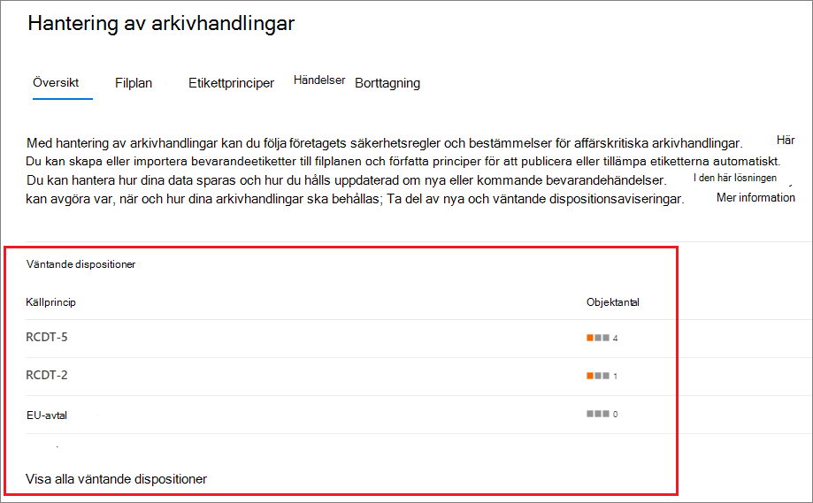
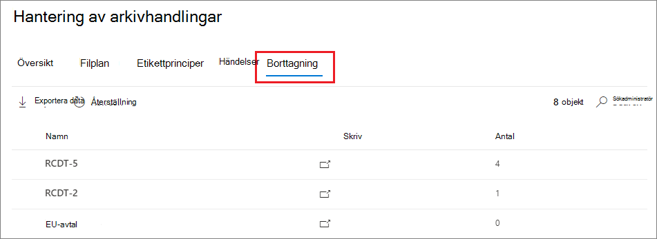
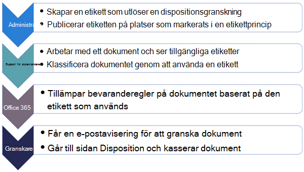
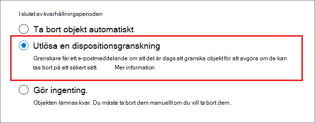
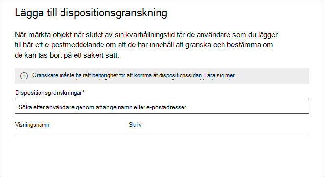
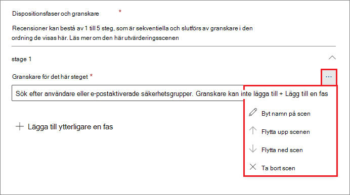
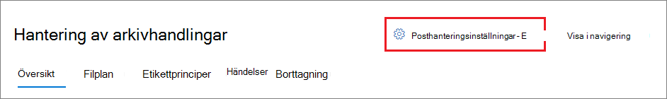
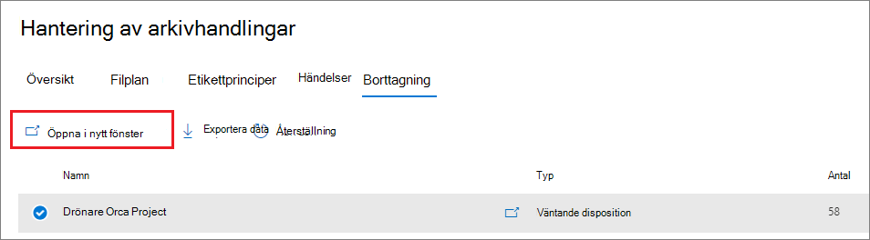
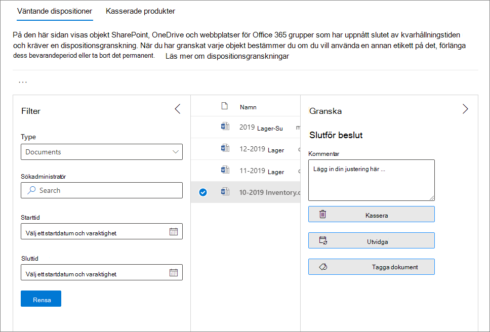
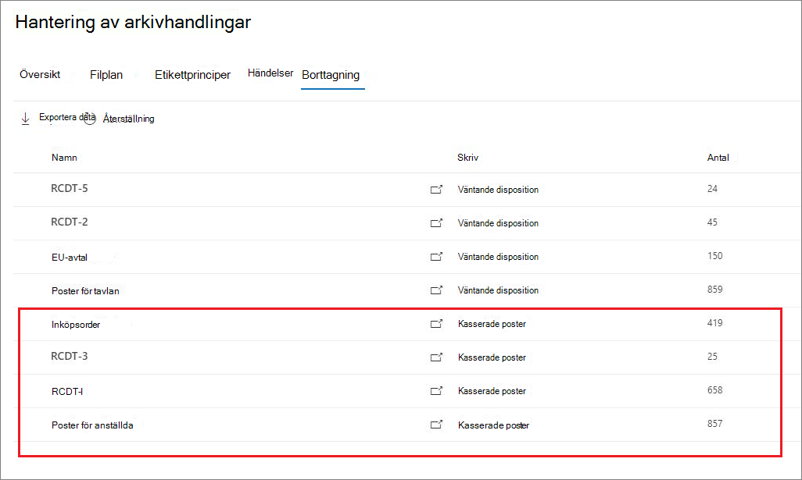

# <a name="disposition-of-content"></a>Borttagning av innehåll

>*[Vägledning för säkerhet och efterlevnad med licensiering i Microsoft 365](/office365/servicedescriptions/microsoft-365-service-descriptions/microsoft-365-tenantlevel-services-licensing-guidance/microsoft-365-security-compliance-licensing-guidance).*

Använd fliken **Borttagning** från **Hantering av arkivhandlingar** i Microsoft 365 Efterlevnadscenter för att hantera borttagningsgranskningar och visa [arkivhandlingar](records-management.md#records) som automatiskt har tagits bort i slutet av kvarhållningsperioden.

> [!NOTE]
> Lanseras i förhandsgranskning: **borttagningsgranskning i flera steg**
> 
> En administratör kan nu lägga till upp till fem borttagningsgranskningar i följd till en kvarhållningsetikett, granskare kan lägga till andra användare till fasen för borttagningsgranskningen. Du kan även anpassa e-postmeddelanden och påminnelser. I följande avsnitt finns mer information om ändringarna i den här förhandsversionen.

## <a name="prerequisites-for-viewing-content-dispositions"></a>Krav för att visa innehållsborttagningar

Du måste ha tillräcklig behörighet för att hantera borttagningsgranskningar och bekräfta att arkivhandlingar har tagits bort. Granskning måste också vara aktiverat.

### <a name="permissions-for-disposition"></a>Behörigheter för borttagning

För att få åtkomst till fliken **Borttagning** i Microsoft 365 Efterlevnadscenter måste användarna ha rollen **Borttagningshantering**. Från december 2020 ingår den här rollen i standardrollgruppen **Hantering av arkivhandlingar**.

> [!NOTE]
> Som standard tilldelas inte en global administratör rollen **Borttagningshantering**. 

För att ge användarna endast de behörigheter som behövs för borttagningsgranskningar, utan att ge behörighet att visa och konfigurera andra funktioner för kvarhållning och hantering av arkivhandlingar, skapar du en anpassad rollgrupp (till exempel "Borttagningsgranskare") och ger den gruppen rollen **Borttagningshantering**.

Anvisningar för hur du konfigurerar behörigheterna finns i [Ge användare åtkomst till Säkerhets- och efterlevnadscenter för Office 365](../security/office-365-security/grant-access-to-the-security-and-compliance-center.md).

Dessutom:

- För att visa innehållet i objekt under borttagningsprocessen lägger du till användare i rollgruppen **Innehållsläsare för innehållsutforskaren**. Om användarna inte har behörighet från den här rollgruppen kan de ändå välja en åtgärd för borttagningsgranskning för att slutföra borttagningsgranskningen, men måste göra det utan att kunna visa objektets innehåll i det lilla förhandsgranskningsfönstret i Efterlevnadscentret.

- I förhandsgranskning: Som standard ser varje person som öppnar sidan **Borttagning** objekt som de har tilldelats att granska. För att en administratör för hantering av arkivhandlingar ska kunna se alla objekt som är tilldelade till alla användare samt alla kvarhållningsetiketter som är konfigurerade för borttagningsgranskning: Gå till **Inställningar för hantering av arkivhandlingar** > **Allmänt** > **Säkerhetsgrupp för arkivhandlingshanterare** för att markera och sedan aktivera en e-postaktiverad säkerhetsgrupp som innehåller administratörskonton.
    
    Microsoft 365-grupper och säkerhetsgrupper som inte är e-postaktiverade stöder inte den här funktionen och kan varken visas eller markeras i listan. Om du behöver skapa en ny e-postaktiverad säkerhetsgrupp använder du länken till Administrationscentret för Microsoft 365 för att skapa den nya gruppen. 
    
    > [!IMPORTANT]
    > När du har aktiverat gruppen kan du inte ändra den i efterlevnadscenter. Se nästa avsnitt för hur du aktiverar en annan grupp med PowerShell.

- I förhandsversion: Alternativet **Inställningar för hantering av arkivhandlingar** visas endast för administratörer för hantering av arkivhandlingar. 

#### <a name="enabling-another-security-group-for-disposition"></a>Aktivera en annan säkerhetsgrupp för borttagning

När en säkerhetsgrupp för disposition har aktiverats från **Inställningar för posthantering** i Microsoft 365 Efterlevnadscenter, går det inte att inaktivera denna behörighet för gruppen eller ersätta den valda gruppen i efterlevnadscentret. Du kan aktivera en annan e-postaktiverad säkerhetsgrupp med hjälp av cmdleten [Enable-ComplianceTagStorage](/powershell/module/exchange/enable-compliancetagstorage).

Till exempel: 

```PowerShell
Enable-ComplianceTagStorage -RecordsManagementSecurityGroupEmail dispositionreviewers@contosoi.com
````

### <a name="enable-auditing"></a>Aktivera granskning

Kontrollera att granskning är aktiverat minst en dag före den första borttagningsåtgärden. Mer information finns i [Söka i granskningsloggen i Säkerhets- &amp; efterlevnadscenter för Office 365](search-the-audit-log-in-security-and-compliance.md). 

## <a name="disposition-reviews"></a>Borttagningsgranskningar

När innehållet når slutet av sin kvarhållningsperiod finns det flera skäl till att du kan vilja granska innehållet och bekräfta att det kan tas bort permanent. I stället för att ta bort innehållet kan du till exempel behöva:
  
- Avbryta borttagningen av relevant innehåll av juridiska skäl eller p.g.a. en granskning.

- Tilldela en annan kvarhållningsperiod till innehållet, till exempel om de ursprungliga kvarhållningsinställningarna var en tillfällig lösning.

- Flytta innehållet från dess befintliga plats till en arkivplats, till exempel om innehållet har efterforskningsvärde eller historiskt värde.

När en borttagningsgranskning utlöses i slutet av kvarhållningsperioden:
  
- De granskare du väljer får ett e-postmeddelande om att de har innehåll att granska. De här granskarna kan vara enskilda användare eller e-postaktiverade säkerhetsgrupper. Nytt i förhandsversion:
   - Du kan anpassa e-postmeddelandet de får, inklusive instruktioner på olika språk. För stöd på flera språk måste du själv ange översättningarna för att visa den här anpassade texten för alla granskare oberoende av språk.
   - Användare får ett första e-postmeddelande per etikett i slutet av objektets kvarhållningsperiod tillsammans med en påminnelse per etikett en gång i veckan med alla borttagningsgranskningar som de tilldelats. För att granska innehållet och vidta en åtgärd kan de klicka på länken i meddelandet och skicka e-postmeddelanden med påminnelser till sidan **Borttagning** i Microsoft 365 Efterlevnadscenter. Alternativt kan granskare gå direkt till sidan **Borttagning** i Efterlevnadscentret.
   - Granskare ser endast de borttagningsgranskningar som har tilldelats dem, medan administratörer som läggs till i den valda säkerhetsgruppen för arkivhandlingshanterare ser alla borttagningsgranskningar.
   - Granskare kan lägga till nya användare i samma borttagningsgranskning. För närvarande ger den här åtgärden inte automatiskt de tillagda användarna den [behörighet som krävs](#permissions-for-disposition).
   - För borttagningsgranskningsprocessen visas en förhandsgranskningsruta för varje objekt om de har behörighet att se det. Om de saknar behörighet kan de markera innehållslänken och begära behörigheter. Det lilla granskningsfönstret har även flikar med ytterligare information om innehållet:
       - **Information** för att visa indexerade egenskaper, var de finns, vem som skapat dem och när samt vem som senast ändrade dem och när.
       - **Historik** som visar historik över alla åtgärder för borttagningsgranskning hittills, med kommentarer från granskare om sådana finns tillgängliga.

En borttagningsgranskning kan omfatta innehåll i Exchange-postlådor, SharePoint-webbplatser och OneDrive-konton. Innehåll som väntar på en borttagningsgranskning på dessa platser tas bara bort permanent när en granskare för den sista fasen i borttagningen väljer att ta bort innehållet permanent.

> [!NOTE]
> En postlåda måste ha minst 10 MB data för att stödja borttagningsgranskningar.

Administratörer kan se en översikt över alla väntande borttagningar på fliken **Översikt**. Granskare ser endast sina egna objekt som väntar på borttagning. Till exempel:



När du markerar **Visa alla väntande borttagningar** kommer du till sidan **Borttagning**. Till exempel:




### <a name="workflow-for-a-disposition-review"></a>Arbetsflöde för en borttagningsgranskning

I följande diagram visas det grundläggande arbetsflödet för en borttagningsgranskning när en kvarhållningsetikett publiceras och sedan används manuellt av en användare. Alternativt kan en kvarhållningsetikett som konfigurerats för en borttagningsgranskning användas automatiskt på innehåll.
  


### <a name="how-to-configure-a-retention-label-for-disposition-review"></a>Konfigurera en kvarhållningsetikett för borttagningsgranskning

Utlösa en borttagningsgranskning i slutet av kvarhållningsperioden är ett konfigurationsalternativ som bara är tillgängligt med en kvarhållningsetikett. Borttagningsgranskning är inte tillgängligt för en kvarhållningsprincip. Mer information om dessa två kvarhållningslösningar finns i [Mer information om kvarhållningsprinciper och kvarhållningsetiketter](retention.md).

På sidan **Definiera kvarhållningsinställningar** för en kvarhållningsetikett:


 
När du har markerat alternativet för **Utlösa en borttagningsgranskning** på nästa sida i guiden ska du ange hur många borttagningar i följd du vill utföra samt borttagningsgranskare för varje fas:

 

Välj **Lägg till en fas** och namnge fasen för identifiering. Ange sedan granskarna för den fasen.

Som granskare anger du en användare eller e-postaktiverad säkerhetsgrupp. Microsoft 365-grupper ([tidigare Office 365-grupper](https://techcommunity.microsoft.com/t5/microsoft-365-blog/office-365-groups-will-become-microsoft-365-groups/ba-p/1303601)) stöds för närvarande inte för det här alternativet.

Om du behöver fler än en person för att granska ett objekt i slutet av kvarhållningsperioden väljer du **Lägg till en fas** igen och upprepar konfigurationsprocessen för det antal faser du behöver, med maximalt fem faser. 

I varje enskild fas av borttagningen har alla användare, som du anger för den fasen, behörighet att vidta nästa åtgärd för objektet i slutet av kvarhållningsperioden. Dessa användare kan också lägga till andra användare i deras steg för borttagningsgranskning.

> [!NOTE]
> Befintliga kvarhållningsetiketter som har konfigurerats för borttagningsgranskning kan uppgraderas för att använda borttagningsgranskning i flera steg genom att konfigurera etiketten. I etikettguiden väljer du **Lägg till en fas**, redigerar befintliga granskare eller lägger till nya granskare.

Under konfigurationsfasen kan du byta namn på varje fas, byta ordning på dem eller ta bort dem genom att välja alternativet Fasåtgärder (**...**): 



Du kan inte ändra ordning på eller ta bort en fas när du har skapat kvarhållningsetiketten.

När du angett granskare bör du komma ihåg att ge dem behörighet för rollen **Borttagningshantering**. Mer information finns i avsnittet [Behörigheter för borttagning](#permissions-for-disposition) på den här sidan.

### <a name="how-to-customize-email-messages-for-disposition-review"></a>Så här anpassar du e-postmeddelanden för borttagningsgranskning

Exempel på standard e-postmeddelande skickat till en granskare:


I en förhandsgranskning kan du även anpassa vilka e-postmeddelanden som skickas till borttagningsgranskare som det första meddelandet, samt påminnelser.

På någon av borttagningssidorna i Efterlevnadscentret väljer du **Inställningar för hantering av arkivhandlingar**:  



Välj sedan fliken **Dispositionsmeddelanden** och ange om du endast vill använda standardmallar för e-post eller lägga till egen text i standardmallen. Den anpassade texten läggs till i e-postanvisningarna efter informationen om kvarhållningsetiketten, innan nästa steg.

Text för alla språk kan läggas till, men formatering och bilder stöds inte för närvarande. URL:er och e-postadresser kan anges som text. Beroende på e-postklienten kan de visas som hyperlänkar eller oformaterad text i det anpassade e-postmeddelandet.

Exempeltext som ska läggas till:

```console
If you need additional information, visit the helpdesk website (https://support.contoso.com) or send them an email (helpdesk@contoso.com).
```

Välj **Spara** för att spara ändringarna.

### <a name="viewing-and-disposing-of-content"></a>Visa och ta bort innehåll

När en granskare meddelas via e-post om att innehållet är klart att granskas kan de klicka på en länk i e-postmeddelandet som tar dem direkt till sidan **Borttagning** från **Hantering av arkivhandlingar** i Microsoft 365 Efterlevnadscenter. Där kan granskarna se hur många objekt för varje kvarhållningsetikett som väntar på borttagning med **Typ** som visar **Väntande borttagning**. De väljer sedan en kvarhållningsetikett och väljer **Öppna i ett nytt fönster** för att visa allt innehåll med den etiketten:



Från sidan **Väntande borttagningar** kan de se alla väntande borttagningar för etiketten. När ett eller flera objekt är markerade kan de använda det lilla förhandsgranskningsfönstret och fliken **Källa**, **Information** och **Historik** för att kontrollera innehållet innan de vidtar åtgärder:



Om du använder den vågräta rullningslisten eller stänger det lilla förhandsgranskningsfönstret visas fler kolumner som innehåller förfallodatum samt namn på fasen för borttagningsgranskningen.

Som du ser i exemplet som visas är de åtgärder som stöds: 
  
- **Godkänn borttagning**:
    - När den här åtgärden är markerad för en interimfas för borttagningsgranskningen (du har konfigurerat flera steg): objektet flyttas till nästa borttagningsfas.
    - När den här åtgärden är markerad för den sista fasen av borttagningsgranskningen, eller om det endast finns en borttagningsfas: objektet markeras som kvalificerat för permanent borttagning. Den exakta tiden för borttagningen beror på arbetsbelastningen. Mer information finns i [Hur kvarhållningsinställningar fungerar med innehåll på plats](retention.md#how-retention-settings-work-with-content-in-place).
- **Ändra etikett**:
    - När den här åtgärden är markerad avslutas processen för borttagningsgranskningen för den ursprungliga etiketten. Kvarhållningsinställningarna för den nya kvarhållningsetiketten gäller för objektet.
- **Utöka**:
    - När den här åtgärden är markerad inaktiveras borttagningsgranskningen till slutet av den utökade perioden, borttagningsgranskningen utlöses sedan igen från den första fasen.
- **Lägga till granskare**:
    - När den här åtgärden är markerad uppmanas användaren att ange och lägga till andra användare för granskning.
    
    > [!NOTE]
    > Den här åtgärden ger inte automatiskt [obligatoriska behörigheter](#permissions-for-disposition) till de användare som läggs till. Om de inte har dessa behörigheter kan de inte ta del av borttagningsgranskningen.

Varje åtgärd som vidtas sparas och lagras även om du ännu inte kan söka efter dem i granskningsloggen.

Under en borttagningsgranskning flyttas innehållet aldrig från dess ursprungliga plats och det markeras inte för permanent borttagning förrän den här åtgärden har valts av en granskare för den slutgiltiga eller enda borttagningen.

## <a name="disposition-of-records"></a>Borttagning av arkivhandlingar

Använd fliken **Borttagning** på sidan **Hantering av arkivhandlingar** för att identifiera:

- Objekt som tagits bort på grund av en borttagningsgranskning.
- Objekt som markerats som en arkivhandling eller en regelbaserad arkivhandling som automatiskt togs bort i slutet av kvarhållningsperioden.

För dessa objekt visas **Borttagna arkivhandlingar** i kolumnen **Typ**. Till exempel:



Objekt som visas på fliken **Borttagna objekt** behålls i upp till sju år efter att objektet tagits bort, med en begränsning på en miljon objekt per arkivhandling under perioden. Om du ser att talet **Antal** närmar sig den här gränsen på en miljon och du behöver bevis på borttagning för dina arkivhandlingar kontaktar du [Microsoft Support](../business-video/get-help-support.md).

> [!NOTE]
> Den här funktionen använder information från den [enhetliga granskningsloggen](search-the-audit-log-in-security-and-compliance.md) och kräver därför att granskning är [aktiverad och sökbar](turn-audit-log-search-on-or-off.md) så att motsvarande händelser registreras.

För att granska borttagna objekt som har markerats som arkivhandlingar eller regelbaserade arkivhandlingar söker du efter **Borttagen fil som markerats som en arkivhandling** i kategorin **Fil- och sidaktiviteter**. Den här granskningshändelsen gäller för dokument och e-postmeddelanden.

## <a name="filter-and-export-the-views"></a>Filtrera och exportera vyerna

När du väljer en kvarhållningsetikett på sidan **Borttagning** kan du filtrera vyerna med hjälp av fliken **Väntande borttagning** (om tillämpligt) och fliken **Borttagna objekt** så att du enkelt hittar objekten.

För väntande borttagningar baseras tidsintervallet på utgångsdatumet. För borttagna objekt baseras tidsintervallet på borttagningsdatumet.
  
Du kan exportera information om objekten i endera vy som en .csv-fil som du sedan kan sortera och hantera med hjälp av Excel.
