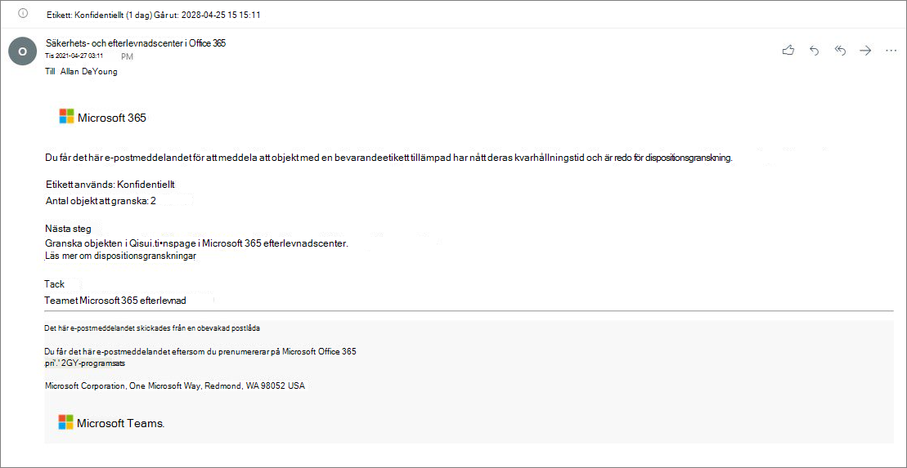

# <a name="disposition-of-content"></a><span data-ttu-id="35e58-103">Borttagning av innehåll</span><span class="sxs-lookup"><span data-stu-id="35e58-103">Disposition of content</span></span>

><span data-ttu-id="35e58-104">*[Vägledning för säkerhet och efterlevnad med licensiering i Microsoft 365](/office365/servicedescriptions/microsoft-365-service-descriptions/microsoft-365-tenantlevel-services-licensing-guidance/microsoft-365-security-compliance-licensing-guidance).*</span><span class="sxs-lookup"><span data-stu-id="35e58-104">*[Microsoft 365 licensing guidance for security & compliance](/office365/servicedescriptions/microsoft-365-service-descriptions/microsoft-365-tenantlevel-services-licensing-guidance/microsoft-365-security-compliance-licensing-guidance).*</span></span>

<span data-ttu-id="35e58-105">Använd fliken **Borttagning** från **Hantering av arkivhandlingar** i Microsoft 365 Efterlevnadscenter för att hantera borttagningsgranskningar och visa [arkivhandlingar](records-management.md#records) som automatiskt har tagits bort i slutet av kvarhållningsperioden.</span><span class="sxs-lookup"><span data-stu-id="35e58-105">Use the **Disposition** page from **Records Management** in the Microsoft 365 compliance center to manage disposition reviews and view the metadata of [records](records-management.md#records) that have been automatically deleted at the end of their retention period.</span></span>

> [!NOTE]
> <span data-ttu-id="35e58-106">Lanseras i förhandsgranskning: **borttagningsgranskning i flera steg**</span><span class="sxs-lookup"><span data-stu-id="35e58-106">Rolling out in preview: **multi-stage disposition review**</span></span>
> 
> <span data-ttu-id="35e58-107">En administratör kan nu lägga till upp till fem borttagningsgranskningar i följd till en kvarhållningsetikett, granskare kan lägga till andra användare till fasen för borttagningsgranskningen.</span><span class="sxs-lookup"><span data-stu-id="35e58-107">An administrator can now add up to five consecutive stages of disposition review in a retention label, and reviewers can add others users to their disposition review stage.</span></span> <span data-ttu-id="35e58-108">Du kan även anpassa e-postmeddelanden och påminnelser.</span><span class="sxs-lookup"><span data-stu-id="35e58-108">You can also customize the email notifications and reminders.</span></span> <span data-ttu-id="35e58-109">I följande avsnitt finns mer information om ändringarna i den här förhandsversionen.</span><span class="sxs-lookup"><span data-stu-id="35e58-109">The following sections have more information about the changes in this preview.</span></span>

## <a name="prerequisites-for-viewing-content-dispositions"></a><span data-ttu-id="35e58-110">Krav för att visa innehållsborttagningar</span><span class="sxs-lookup"><span data-stu-id="35e58-110">Prerequisites for viewing content dispositions</span></span>

<span data-ttu-id="35e58-111">Du måste ha tillräcklig behörighet för att hantera borttagningsgranskningar och bekräfta att arkivhandlingar har tagits bort. Granskning måste också vara aktiverat.</span><span class="sxs-lookup"><span data-stu-id="35e58-111">To manage disposition reviews and confirm that records have been deleted, you must have sufficient permissions and auditing must be enabled.</span></span>

### <a name="permissions-for-disposition"></a><span data-ttu-id="35e58-112">Behörigheter för borttagning</span><span class="sxs-lookup"><span data-stu-id="35e58-112">Permissions for disposition</span></span>

<span data-ttu-id="35e58-113">För att få åtkomst till fliken **Borttagning** i Microsoft 365 Efterlevnadscenter måste användarna ha rollen **Borttagningshantering**.</span><span class="sxs-lookup"><span data-stu-id="35e58-113">To successfully access the **Disposition** tab in the Microsoft 365 compliance center, users must have the **Disposition Management** role.</span></span> <span data-ttu-id="35e58-114">Från december 2020 ingår den här rollen i standardrollgruppen **Hantering av arkivhandlingar**.</span><span class="sxs-lookup"><span data-stu-id="35e58-114">From December 2020, this role is now included in the **Records Management** default role group.</span></span>

> [!NOTE]
> <span data-ttu-id="35e58-115">Som standard tilldelas inte en global administratör rollen **Borttagningshantering**.</span><span class="sxs-lookup"><span data-stu-id="35e58-115">By default, a global admin isn't granted the **Disposition Management** role.</span></span> 

<span data-ttu-id="35e58-116">För att ge användarna endast de behörigheter som behövs för borttagningsgranskningar, utan att ge behörighet att visa och konfigurera andra funktioner för kvarhållning och hantering av arkivhandlingar, skapar du en anpassad rollgrupp (till exempel "Borttagningsgranskare") och ger den gruppen rollen **Borttagningshantering**.</span><span class="sxs-lookup"><span data-stu-id="35e58-116">To grant users just the permissions they need for disposition reviews without granting them permissions to view and configure other features for retention and records management, create a custom role group (for example, named "Disposition Reviewers") and grant this group the **Disposition Management** role.</span></span>

<span data-ttu-id="35e58-117">Anvisningar för hur du konfigurerar behörigheterna finns i [Ge användare åtkomst till Säkerhets- och efterlevnadscenter för Office 365](../security/office-365-security/grant-access-to-the-security-and-compliance-center.md).</span><span class="sxs-lookup"><span data-stu-id="35e58-117">For instructions to configure these permissions, see [Give users access to the Office 365 Security & Compliance Center](../security/office-365-security/grant-access-to-the-security-and-compliance-center.md).</span></span>

<span data-ttu-id="35e58-118">Dessutom:</span><span class="sxs-lookup"><span data-stu-id="35e58-118">Additionally:</span></span>

- <span data-ttu-id="35e58-119">För att visa innehållet i objekt under borttagningsprocessen lägger du till användare i rollgruppen **Innehållsläsare för innehållsutforskaren**.</span><span class="sxs-lookup"><span data-stu-id="35e58-119">To view the contents of items during the disposition process, add users to the **Content Explorer Content Viewer** role group.</span></span> <span data-ttu-id="35e58-120">Om användarna inte har behörighet från den här rollgruppen kan de ändå välja en åtgärd för borttagningsgranskning för att slutföra borttagningsgranskningen, men måste göra det utan att kunna visa objektets innehåll i det lilla förhandsgranskningsfönstret i Efterlevnadscentret.</span><span class="sxs-lookup"><span data-stu-id="35e58-120">If users don't have the permissions from this role group, they can still select a disposition review action to complete the disposition review, but must do so without being able to view the item's contents from the mini-preview pane in the compliance center.</span></span>

- <span data-ttu-id="35e58-121">I förhandsgranskning: Som standard ser varje person som öppnar sidan **Borttagning** objekt som de har tilldelats att granska.</span><span class="sxs-lookup"><span data-stu-id="35e58-121">In preview: By default, each person that accesses the **Disposition** page sees only items that they are assigned to review.</span></span> <span data-ttu-id="35e58-122">För att en administratör för hantering av arkivhandlingar ska kunna se alla objekt som är tilldelade till alla användare samt alla kvarhållningsetiketter som är konfigurerade för borttagningsgranskning: Gå till **Inställningar för hantering av arkivhandlingar** > **Allmänt** > **Säkerhetsgrupp för arkivhandlingshanterare** för att markera och sedan aktivera en e-postaktiverad säkerhetsgrupp som innehåller administratörskonton.</span><span class="sxs-lookup"><span data-stu-id="35e58-122">For a records management administrator to see all items assigned to all users, and all retention labels that are configured for disposition review: Navigate to **Records management settings** > **General** > **Security group for records manager** to select and then enable a mail-enabled security group that contains the administrator accounts.</span></span>
    
    <span data-ttu-id="35e58-123">Microsoft 365-grupper och säkerhetsgrupper som inte är e-postaktiverade stöder inte den här funktionen och kan varken visas eller markeras i listan.</span><span class="sxs-lookup"><span data-stu-id="35e58-123">Microsoft 365 groups and security groups that aren't mail-enabled doesn't support this feature and wouldn't be displayed in the list to select.</span></span> <span data-ttu-id="35e58-124">Om du behöver skapa en ny e-postaktiverad säkerhetsgrupp använder du länken till Administrationscentret för Microsoft 365 för att skapa den nya gruppen.</span><span class="sxs-lookup"><span data-stu-id="35e58-124">If you need to create a new mail-enabled security group, use the link to the Microsoft 365 admin center to create the new group.</span></span> 
    
    > [!IMPORTANT]
    > <span data-ttu-id="35e58-125">När du har aktiverat gruppen kan du inte ändra den i efterlevnadscenter.</span><span class="sxs-lookup"><span data-stu-id="35e58-125">After you have enabled the group, you can't change it in the compliance center.</span></span> <span data-ttu-id="35e58-126">Se nästa avsnitt för hur du aktiverar en annan grupp med PowerShell.</span><span class="sxs-lookup"><span data-stu-id="35e58-126">See the next section for how to enable a different group by using PowerShell.</span></span>

- <span data-ttu-id="35e58-127">I förhandsversion: Alternativet **Inställningar för hantering av arkivhandlingar** visas endast för administratörer för hantering av arkivhandlingar.</span><span class="sxs-lookup"><span data-stu-id="35e58-127">In preview: The **Records management settings** option is visible only to record management administrators.</span></span> 

#### <a name="enabling-another-security-group-for-disposition"></a><span data-ttu-id="35e58-128">Aktivera en annan säkerhetsgrupp för borttagning</span><span class="sxs-lookup"><span data-stu-id="35e58-128">Enabling another security group for disposition</span></span>

<span data-ttu-id="35e58-129">När en säkerhetsgrupp för disposition har aktiverats från **Inställningar för posthantering** i Microsoft 365 Efterlevnadscenter, går det inte att inaktivera denna behörighet för gruppen eller ersätta den valda gruppen i efterlevnadscentret.</span><span class="sxs-lookup"><span data-stu-id="35e58-129">After you have enabled a security group for disposition from the **Records management settings** in the Microsoft 365 compliance center, you can't disable this permission for the group or replace the selected group in the compliance center.</span></span> <span data-ttu-id="35e58-130">Du kan aktivera en annan e-postaktiverad säkerhetsgrupp med hjälp av cmdleten [Enable-ComplianceTagStorage](/powershell/module/exchange/enable-compliancetagstorage).</span><span class="sxs-lookup"><span data-stu-id="35e58-130">However, you can enable another mail-enabled security group by using the [Enable-ComplianceTagStorage](/powershell/module/exchange/enable-compliancetagstorage) cmdlet.</span></span>

<span data-ttu-id="35e58-131">Till exempel:</span><span class="sxs-lookup"><span data-stu-id="35e58-131">For example:</span></span> 

```PowerShell
Enable-ComplianceTagStorage -RecordsManagementSecurityGroupEmail dispositionreviewers@contosoi.com
````

### <a name="enable-auditing"></a><span data-ttu-id="35e58-132">Aktivera granskning</span><span class="sxs-lookup"><span data-stu-id="35e58-132">Enable auditing</span></span>

<span data-ttu-id="35e58-133">Kontrollera att granskning är aktiverat minst en dag före den första borttagningsåtgärden.</span><span class="sxs-lookup"><span data-stu-id="35e58-133">Make sure that auditing is enabled at least one day before the first disposition action.</span></span> <span data-ttu-id="35e58-134">Mer information finns i [Söka i granskningsloggen i Säkerhets- &amp; efterlevnadscenter för Office 365](search-the-audit-log-in-security-and-compliance.md).</span><span class="sxs-lookup"><span data-stu-id="35e58-134">For more information, see [Search the audit log in the Office 365 Security &amp; Compliance Center](search-the-audit-log-in-security-and-compliance.md).</span></span> 

## <a name="disposition-reviews"></a><span data-ttu-id="35e58-135">Borttagningsgranskningar</span><span class="sxs-lookup"><span data-stu-id="35e58-135">Disposition reviews</span></span>

<span data-ttu-id="35e58-p109">När innehållet når slutet av sin kvarhållningsperiod finns det flera skäl till att du kan vilja granska innehållet och bekräfta att det kan tas bort permanent. I stället för att ta bort innehållet kan du till exempel behöva:</span><span class="sxs-lookup"><span data-stu-id="35e58-p109">When content reaches the end of its retention period, there are several reasons why you might want to review that content and confirm whether it can be permanently deleted ("disposed"). For example, instead of deleting the content, you might need to:</span></span>
  
- <span data-ttu-id="35e58-138">Avbryta borttagningen av relevant innehåll av juridiska skäl eller p.g.a. en granskning.</span><span class="sxs-lookup"><span data-stu-id="35e58-138">Suspend the deletion of relevant content for litigation or an audit.</span></span>

- <span data-ttu-id="35e58-139">Tilldela en annan kvarhållningsperiod till innehållet, till exempel om de ursprungliga kvarhållningsinställningarna var en tillfällig lösning.</span><span class="sxs-lookup"><span data-stu-id="35e58-139">Assign a different retention period to the content, perhaps because the original retention settings were a temporary or provisional solution.</span></span>

- <span data-ttu-id="35e58-140">Flytta innehållet från dess befintliga plats till en arkivplats, till exempel om innehållet har efterforskningsvärde eller historiskt värde.</span><span class="sxs-lookup"><span data-stu-id="35e58-140">Move the content from its existing location to an archive location, for example, if that content has research or historical value.</span></span>

<span data-ttu-id="35e58-141">När en borttagningsgranskning utlöses i slutet av kvarhållningsperioden:</span><span class="sxs-lookup"><span data-stu-id="35e58-141">When a disposition review is triggered at the end of the retention period:</span></span>
  
- <span data-ttu-id="35e58-142">De granskare du väljer får ett e-postmeddelande om att de har innehåll att granska.</span><span class="sxs-lookup"><span data-stu-id="35e58-142">The reviewers you choose receive an email notification that they have content to review.</span></span> <span data-ttu-id="35e58-143">De här granskarna kan vara enskilda användare eller e-postaktiverade säkerhetsgrupper.</span><span class="sxs-lookup"><span data-stu-id="35e58-143">These reviewers can be individual users or mail-enabled security groups.</span></span> <span data-ttu-id="35e58-144">Nytt i förhandsversion:</span><span class="sxs-lookup"><span data-stu-id="35e58-144">New in preview:</span></span>
   - <span data-ttu-id="35e58-145">Du kan anpassa e-postmeddelandet de får, inklusive instruktioner på olika språk.</span><span class="sxs-lookup"><span data-stu-id="35e58-145">You can customize the email that they receive, including instructions in different languages.</span></span> <span data-ttu-id="35e58-146">För stöd på flera språk måste du själv ange översättningarna för att visa den här anpassade texten för alla granskare oberoende av språk.</span><span class="sxs-lookup"><span data-stu-id="35e58-146">For multi-language support, you must specify the translations yourself and this custom text is displayed to all reviewers irrespective of their locale.</span></span>
   - <span data-ttu-id="35e58-147">Användare får ett första e-postmeddelande per etikett i slutet av objektets kvarhållningsperiod tillsammans med en påminnelse per etikett en gång i veckan med alla borttagningsgranskningar som de tilldelats.</span><span class="sxs-lookup"><span data-stu-id="35e58-147">Users receive an initial email notification per label at the end of the item's retention period, with a reminder per label once a week of all disposition reviews that they are assigned.</span></span> <span data-ttu-id="35e58-148">För att granska innehållet och vidta en åtgärd kan de klicka på länken i meddelandet och skicka e-postmeddelanden med påminnelser till sidan **Borttagning** i Microsoft 365 Efterlevnadscenter.</span><span class="sxs-lookup"><span data-stu-id="35e58-148">They can click the link in the notification and reminder emails to go to the **Disposition** page in the Microsoft 365 compliance center to review the content and take an action.</span></span> <span data-ttu-id="35e58-149">Alternativt kan granskare gå direkt till sidan **Borttagning** i Efterlevnadscentret.</span><span class="sxs-lookup"><span data-stu-id="35e58-149">Alternately, the reviewers can go directly to the **Disposition** page in the compliance center.</span></span>
   - <span data-ttu-id="35e58-150">Granskare ser endast de borttagningsgranskningar som har tilldelats dem, medan administratörer som läggs till i den valda säkerhetsgruppen för arkivhandlingshanterare ser alla borttagningsgranskningar.</span><span class="sxs-lookup"><span data-stu-id="35e58-150">Reviewers see only the disposition reviews that are assigned to them, whereas administrators who are added to the selected security group for records manager see all disposition reviews.</span></span>
   - <span data-ttu-id="35e58-151">Granskare kan lägga till nya användare i samma borttagningsgranskning.</span><span class="sxs-lookup"><span data-stu-id="35e58-151">Reviewers can add new users to the same disposition review.</span></span> <span data-ttu-id="35e58-152">För närvarande ger den här åtgärden inte automatiskt de tillagda användarna den [behörighet som krävs](#permissions-for-disposition).</span><span class="sxs-lookup"><span data-stu-id="35e58-152">Currently, this action doesn't automatically grant these added users the [required permissions](#permissions-for-disposition).</span></span>
   - <span data-ttu-id="35e58-153">För borttagningsgranskningsprocessen visas en förhandsgranskningsruta för varje objekt om de har behörighet att se det.</span><span class="sxs-lookup"><span data-stu-id="35e58-153">For the disposition review process, a mini-review pane for each item shows a preview of the content if they have permissions to see it.</span></span> <span data-ttu-id="35e58-154">Om de saknar behörighet kan de markera innehållslänken och begära behörigheter.</span><span class="sxs-lookup"><span data-stu-id="35e58-154">If they don't have permissions, they can select the content link and request permissions.</span></span> <span data-ttu-id="35e58-155">Det lilla granskningsfönstret har även flikar med ytterligare information om innehållet:</span><span class="sxs-lookup"><span data-stu-id="35e58-155">This mini-review pane also has tabs for additional information about the content:</span></span>
       - <span data-ttu-id="35e58-156">**Information** för att visa indexerade egenskaper, var de finns, vem som skapat dem och när samt vem som senast ändrade dem och när.</span><span class="sxs-lookup"><span data-stu-id="35e58-156">**Details** to display indexed properties, where it's located, who created it and when, and who last modified it and when.</span></span>
       - <span data-ttu-id="35e58-157">**Historik** som visar historik över alla åtgärder för borttagningsgranskning hittills, med kommentarer från granskare om sådana finns tillgängliga.</span><span class="sxs-lookup"><span data-stu-id="35e58-157">**History** that shows the history of any disposition review actions to date, with reviewer comments if available.</span></span>

<span data-ttu-id="35e58-158">En borttagningsgranskning kan omfatta innehåll i Exchange-postlådor, SharePoint-webbplatser och OneDrive-konton.</span><span class="sxs-lookup"><span data-stu-id="35e58-158">A disposition review can include content in Exchange mailboxes, SharePoint sites, and OneDrive accounts.</span></span> <span data-ttu-id="35e58-159">Innehåll som väntar på en borttagningsgranskning på dessa platser tas bara bort permanent när en granskare för den sista fasen i borttagningen väljer att ta bort innehållet permanent.</span><span class="sxs-lookup"><span data-stu-id="35e58-159">Content pending a disposition review in those locations is permanently deleted only after a reviewer for the final stage of disposition chooses to permanently delete the content.</span></span>

> [!NOTE]
> <span data-ttu-id="35e58-160">En postlåda måste ha minst 10 MB data för att stödja borttagningsgranskningar.</span><span class="sxs-lookup"><span data-stu-id="35e58-160">A mailbox must have at least 10 MB data to support disposition reviews.</span></span>

<span data-ttu-id="35e58-161">Administratörer kan se en översikt över alla väntande borttagningar på fliken **Översikt**. Granskare ser endast sina egna objekt som väntar på borttagning.</span><span class="sxs-lookup"><span data-stu-id="35e58-161">Administrators can see an overview of all pending dispositions in the **Overview** tab. Reviewers see only their items pending disposition.</span></span> <span data-ttu-id="35e58-162">Till exempel:</span><span class="sxs-lookup"><span data-stu-id="35e58-162">For example:</span></span>


<span data-ttu-id="35e58-164">När du markerar **Visa alla väntande borttagningar** kommer du till sidan **Borttagning**.</span><span class="sxs-lookup"><span data-stu-id="35e58-164">When you select the **View all pending dispositions**, you're taken to the **Disposition** page.</span></span> <span data-ttu-id="35e58-165">Till exempel:</span><span class="sxs-lookup"><span data-stu-id="35e58-165">For example:</span></span>


### <a name="workflow-for-a-disposition-review"></a><span data-ttu-id="35e58-167">Arbetsflöde för en borttagningsgranskning</span><span class="sxs-lookup"><span data-stu-id="35e58-167">Workflow for a disposition review</span></span>

<span data-ttu-id="35e58-168">I följande diagram visas det grundläggande arbetsflödet för en borttagningsgranskning när en kvarhållningsetikett publiceras och sedan används manuellt av en användare.</span><span class="sxs-lookup"><span data-stu-id="35e58-168">The following diagram shows the basic workflow for a disposition review when a retention label is published and then manually applied by a user.</span></span> <span data-ttu-id="35e58-169">Alternativt kan en kvarhållningsetikett som konfigurerats för en borttagningsgranskning användas automatiskt på innehåll.</span><span class="sxs-lookup"><span data-stu-id="35e58-169">Alternatively, a retention label configured for a disposition review can be automatically applied to content.</span></span>
  


### <a name="how-to-configure-a-retention-label-for-disposition-review"></a><span data-ttu-id="35e58-171">Konfigurera en kvarhållningsetikett för borttagningsgranskning</span><span class="sxs-lookup"><span data-stu-id="35e58-171">How to configure a retention label for disposition review</span></span>

<span data-ttu-id="35e58-172">Utlösa en borttagningsgranskning i slutet av kvarhållningsperioden är ett konfigurationsalternativ som bara är tillgängligt med en kvarhållningsetikett.</span><span class="sxs-lookup"><span data-stu-id="35e58-172">Triggering a disposition review at the end of the retention period is a configuration option that's available only with a retention label.</span></span> <span data-ttu-id="35e58-173">Borttagningsgranskning är inte tillgängligt för en kvarhållningsprincip.</span><span class="sxs-lookup"><span data-stu-id="35e58-173">Disposition review is not available for a retention policy.</span></span> <span data-ttu-id="35e58-174">Mer information om dessa två kvarhållningslösningar finns i [Mer information om kvarhållningsprinciper och kvarhållningsetiketter](retention.md).</span><span class="sxs-lookup"><span data-stu-id="35e58-174">For more information about these two retention solutions, see [Learn about retention policies and retention labels](retention.md).</span></span>

<span data-ttu-id="35e58-175">På sidan **Definiera kvarhållningsinställningar** för en kvarhållningsetikett:</span><span class="sxs-lookup"><span data-stu-id="35e58-175">From the **Define retention settings** page for a retention label:</span></span>


 
<span data-ttu-id="35e58-177">När du har markerat alternativet för **Utlösa en borttagningsgranskning** på nästa sida i guiden ska du ange hur många borttagningar i följd du vill utföra samt borttagningsgranskare för varje fas:</span><span class="sxs-lookup"><span data-stu-id="35e58-177">After you select this **Trigger a disposition review** option, on the next page of the wizard, you specify how many consecutive stages of disposition you want and the disposition reviewers for each stage:</span></span>

 

<span data-ttu-id="35e58-179">Välj **Lägg till en fas** och namnge fasen för identifiering.</span><span class="sxs-lookup"><span data-stu-id="35e58-179">Select **Add a stage**, and name your stage for identification purposes.</span></span> <span data-ttu-id="35e58-180">Ange sedan granskarna för den fasen.</span><span class="sxs-lookup"><span data-stu-id="35e58-180">Then specify the reviewers for that stage.</span></span>

<span data-ttu-id="35e58-181">Som granskare anger du en användare eller e-postaktiverad säkerhetsgrupp.</span><span class="sxs-lookup"><span data-stu-id="35e58-181">For the reviewers, specify a user or a mail-enabled security group.</span></span> <span data-ttu-id="35e58-182">Microsoft 365-grupper ([tidigare Office 365-grupper](https://techcommunity.microsoft.com/t5/microsoft-365-blog/office-365-groups-will-become-microsoft-365-groups/ba-p/1303601)) stöds för närvarande inte för det här alternativet.</span><span class="sxs-lookup"><span data-stu-id="35e58-182">Microsoft 365 groups ([formerly Office 365 groups](https://techcommunity.microsoft.com/t5/microsoft-365-blog/office-365-groups-will-become-microsoft-365-groups/ba-p/1303601)) are currently not supported for this option.</span></span>

<span data-ttu-id="35e58-183">Om du behöver fler än en person för att granska ett objekt i slutet av kvarhållningsperioden väljer du **Lägg till en fas** igen och upprepar konfigurationsprocessen för det antal faser du behöver, med maximalt fem faser.</span><span class="sxs-lookup"><span data-stu-id="35e58-183">If you need more than one person to review an item at the end of its retention period, select **Add a stage** again and repeat the configuration process for the number of stages that you need, with a maximum of five stages.</span></span> 

<span data-ttu-id="35e58-p122">I varje enskild fas av borttagningen har alla användare, som du anger för den fasen, behörighet att vidta nästa åtgärd för objektet i slutet av kvarhållningsperioden. Dessa användare kan också lägga till andra användare i deras steg för borttagningsgranskning.</span><span class="sxs-lookup"><span data-stu-id="35e58-p122">Within each individual stage of disposition, any of the users you specify for that stage are authorized to take the next action for the item at the end of its retention period. These users can also add other users to their disposition review stage.</span></span>

> [!NOTE]
> <span data-ttu-id="35e58-186">Befintliga kvarhållningsetiketter som har konfigurerats för borttagningsgranskning kan uppgraderas för att använda borttagningsgranskning i flera steg genom att konfigurera etiketten.</span><span class="sxs-lookup"><span data-stu-id="35e58-186">Existing retention labels that are configured for disposition review can be upgraded to use multi-staged disposition review by configuring the label.</span></span> <span data-ttu-id="35e58-187">I etikettguiden väljer du **Lägg till en fas**, redigerar befintliga granskare eller lägger till nya granskare.</span><span class="sxs-lookup"><span data-stu-id="35e58-187">In the label wizard, select **Add a stage**, or edit the existing reviewers or add new reviewers.</span></span>

<span data-ttu-id="35e58-188">Under konfigurationsfasen kan du byta namn på varje fas, byta ordning på dem eller ta bort dem genom att välja alternativet Fasåtgärder (**...**):</span><span class="sxs-lookup"><span data-stu-id="35e58-188">During the configuration phase, for each stage specified, you can rename it, reorder it, or remove it by selecting the Stage actions option (**...**):</span></span> 


<span data-ttu-id="35e58-190">Du kan inte ändra ordning på eller ta bort en fas när du har skapat kvarhållningsetiketten.</span><span class="sxs-lookup"><span data-stu-id="35e58-190">However, you can't reorder or remove a stage after you have created the retention label.</span></span>

<span data-ttu-id="35e58-191">När du angett granskare bör du komma ihåg att ge dem behörighet för rollen **Borttagningshantering**.</span><span class="sxs-lookup"><span data-stu-id="35e58-191">After you have specified your reviewers, remember to grant them the **Disposition Management** role permission.</span></span> <span data-ttu-id="35e58-192">Mer information finns i avsnittet [Behörigheter för borttagning](#permissions-for-disposition) på den här sidan.</span><span class="sxs-lookup"><span data-stu-id="35e58-192">For more information, see the [Permissions for disposition](#permissions-for-disposition) section on this page.</span></span>

### <a name="how-to-customize-email-messages-for-disposition-review"></a><span data-ttu-id="35e58-193">Så här anpassar du e-postmeddelanden för borttagningsgranskning</span><span class="sxs-lookup"><span data-stu-id="35e58-193">How to customize email messages for disposition review</span></span>

<span data-ttu-id="35e58-194">Exempel på standard e-postmeddelande skickat till en granskare:</span><span class="sxs-lookup"><span data-stu-id="35e58-194">Example default email notification sent to a reviewer:</span></span>



<span data-ttu-id="35e58-196">I en förhandsgranskning kan du även anpassa vilka e-postmeddelanden som skickas till borttagningsgranskare som det första meddelandet, samt påminnelser.</span><span class="sxs-lookup"><span data-stu-id="35e58-196">Also in preview, you can customize the email messages that are sent to disposition reviewers for the initial notification and then reminders.</span></span>

<span data-ttu-id="35e58-197">På någon av borttagningssidorna i Efterlevnadscentret väljer du **Inställningar för hantering av arkivhandlingar**:</span><span class="sxs-lookup"><span data-stu-id="35e58-197">From any of the Disposition pages in the compliance center, select **Records management settings**:</span></span>  


<span data-ttu-id="35e58-199">Välj sedan fliken **Dispositionsmeddelanden** och ange om du endast vill använda standardmallar för e-post eller lägga till egen text i standardmallen.</span><span class="sxs-lookup"><span data-stu-id="35e58-199">Then select the **Disposition notifications** tab, and specify whether you want to use just the default email message, or add your own text to the default message.</span></span> <span data-ttu-id="35e58-200">Den anpassade texten läggs till i e-postanvisningarna efter informationen om kvarhållningsetiketten, innan nästa steg.</span><span class="sxs-lookup"><span data-stu-id="35e58-200">Your custom text is added to the email instructions after the information about the retention label and before the next steps instructions.</span></span>

<span data-ttu-id="35e58-201">Text för alla språk kan läggas till, men formatering och bilder stöds inte för närvarande.</span><span class="sxs-lookup"><span data-stu-id="35e58-201">Text for all languages can be added, but formatting and images are currently unsupported.</span></span> <span data-ttu-id="35e58-202">URL:er och e-postadresser kan anges som text. Beroende på e-postklienten kan de visas som hyperlänkar eller oformaterad text i det anpassade e-postmeddelandet.</span><span class="sxs-lookup"><span data-stu-id="35e58-202">URLs and email addresses can be entered as text and depending on the email client, display as hyperlinks or unformatted text in the customized email.</span></span>

<span data-ttu-id="35e58-203">Exempeltext som ska läggas till:</span><span class="sxs-lookup"><span data-stu-id="35e58-203">Example text to add:</span></span>

```console
If you need additional information, visit the helpdesk website (https://support.contoso.com) or send them an email (helpdesk@contoso.com).
```

<span data-ttu-id="35e58-204">Välj **Spara** för att spara ändringarna.</span><span class="sxs-lookup"><span data-stu-id="35e58-204">Select **Save** to save any changes.</span></span>

### <a name="viewing-and-disposing-of-content"></a><span data-ttu-id="35e58-205">Visa och ta bort innehåll</span><span class="sxs-lookup"><span data-stu-id="35e58-205">Viewing and disposing of content</span></span>

<span data-ttu-id="35e58-206">När en granskare meddelas via e-post om att innehållet är klart att granskas kan de klicka på en länk i e-postmeddelandet som tar dem direkt till sidan **Borttagning** från **Hantering av arkivhandlingar** i Microsoft 365 Efterlevnadscenter.</span><span class="sxs-lookup"><span data-stu-id="35e58-206">When a reviewer is notified by email that content is ready to review, they can click a link in the email that takes them directly to the **Disposition** page from **Records management** in the Microsoft 365 compliance center.</span></span> <span data-ttu-id="35e58-207">Där kan granskarna se hur många objekt för varje kvarhållningsetikett som väntar på borttagning med **Typ** som visar **Väntande borttagning**.</span><span class="sxs-lookup"><span data-stu-id="35e58-207">There, the reviewers can see how many items for each retention label are waiting disposition with the **Type** displaying **Pending disposition**.</span></span> <span data-ttu-id="35e58-208">De väljer sedan en kvarhållningsetikett och väljer **Öppna i ett nytt fönster** för att visa allt innehåll med den etiketten:</span><span class="sxs-lookup"><span data-stu-id="35e58-208">They then select a retention label, and **Open in new window** to see all content with that label:</span></span>


<span data-ttu-id="35e58-210">Från sidan **Väntande borttagningar** kan de se alla väntande borttagningar för etiketten.</span><span class="sxs-lookup"><span data-stu-id="35e58-210">From the **Pending dispositions** page, they see all pending dispositions for that label.</span></span> <span data-ttu-id="35e58-211">När ett eller flera objekt är markerade kan de använda det lilla förhandsgranskningsfönstret och fliken **Källa**, **Information** och **Historik** för att kontrollera innehållet innan de vidtar åtgärder:</span><span class="sxs-lookup"><span data-stu-id="35e58-211">When one or more items are selected, they can use the mini-preview pane and the **Source**, **Details**, and **History** tab to inspect the content before taking action on it:</span></span>


<span data-ttu-id="35e58-213">Om du använder den vågräta rullningslisten eller stänger det lilla förhandsgranskningsfönstret visas fler kolumner som innehåller förfallodatum samt namn på fasen för borttagningsgranskningen.</span><span class="sxs-lookup"><span data-stu-id="35e58-213">If you use the horizontal scroll bar, or close the min-review pane, you see more columns that include the expiry date and the name of the disposition review stage.</span></span>

<span data-ttu-id="35e58-214">Som du ser i exemplet som visas är de åtgärder som stöds:</span><span class="sxs-lookup"><span data-stu-id="35e58-214">As you can see from the example shown, the actions supported are:</span></span> 
  
- <span data-ttu-id="35e58-215">**Godkänn borttagning**:</span><span class="sxs-lookup"><span data-stu-id="35e58-215">**Approve disposal**:</span></span>
    - <span data-ttu-id="35e58-216">När den här åtgärden är markerad för en interimfas för borttagningsgranskningen (du har konfigurerat flera steg): objektet flyttas till nästa borttagningsfas.</span><span class="sxs-lookup"><span data-stu-id="35e58-216">When this action is selected for an interim stage of disposition review (you have configured multiple stages): The item moves to the next disposition stage.</span></span>
    - <span data-ttu-id="35e58-217">När den här åtgärden är markerad för den sista fasen av borttagningsgranskningen, eller om det endast finns en borttagningsfas: objektet markeras som kvalificerat för permanent borttagning.</span><span class="sxs-lookup"><span data-stu-id="35e58-217">When this action is selected for the final stage of disposition review, or there is only one stage of disposition: The item is marked as eligible for permanent deletion.</span></span> <span data-ttu-id="35e58-218">Den exakta tiden för borttagningen beror på arbetsbelastningen.</span><span class="sxs-lookup"><span data-stu-id="35e58-218">The exact timing for that deletion depends on the workload.</span></span> <span data-ttu-id="35e58-219">Mer information finns i [Hur kvarhållningsinställningar fungerar med innehåll på plats](retention.md#how-retention-settings-work-with-content-in-place).</span><span class="sxs-lookup"><span data-stu-id="35e58-219">For more information, see [How retention settings work with content in place](retention.md#how-retention-settings-work-with-content-in-place).</span></span>
- <span data-ttu-id="35e58-220">**Ändra etikett**:</span><span class="sxs-lookup"><span data-stu-id="35e58-220">**Relabel**:</span></span>
    - <span data-ttu-id="35e58-221">När den här åtgärden är markerad avslutas processen för borttagningsgranskningen för den ursprungliga etiketten.</span><span class="sxs-lookup"><span data-stu-id="35e58-221">When this action is selected, the item exits the disposition review process for the original label.</span></span> <span data-ttu-id="35e58-222">Kvarhållningsinställningarna för den nya kvarhållningsetiketten gäller för objektet.</span><span class="sxs-lookup"><span data-stu-id="35e58-222">The item is then subject to the retention settings of the newly selected retention label.</span></span>
- <span data-ttu-id="35e58-223">**Utöka**:</span><span class="sxs-lookup"><span data-stu-id="35e58-223">**Extend**:</span></span>
    - <span data-ttu-id="35e58-224">När den här åtgärden är markerad inaktiveras borttagningsgranskningen till slutet av den utökade perioden, borttagningsgranskningen utlöses sedan igen från den första fasen.</span><span class="sxs-lookup"><span data-stu-id="35e58-224">When this action is selected, disposition review is effectively suspended until the end of the extended period and then disposition review is triggered again from the first stage.</span></span>
- <span data-ttu-id="35e58-225">**Lägga till granskare**:</span><span class="sxs-lookup"><span data-stu-id="35e58-225">**Add reviewers**:</span></span>
    - <span data-ttu-id="35e58-226">När den här åtgärden är markerad uppmanas användaren att ange och lägga till andra användare för granskning.</span><span class="sxs-lookup"><span data-stu-id="35e58-226">When this action is selected, the user is prompted to specify and add other users for review.</span></span>
    
    > [!NOTE]
    > <span data-ttu-id="35e58-227">Den här åtgärden ger inte automatiskt [obligatoriska behörigheter](#permissions-for-disposition) till de användare som läggs till.</span><span class="sxs-lookup"><span data-stu-id="35e58-227">This action doesn't automatically grant the [required permissions](#permissions-for-disposition) to the users who are added.</span></span> <span data-ttu-id="35e58-228">Om de inte har dessa behörigheter kan de inte ta del av borttagningsgranskningen.</span><span class="sxs-lookup"><span data-stu-id="35e58-228">If they don't have these permissions, they won't be able to participate in the disposition review.</span></span>

<span data-ttu-id="35e58-229">Varje åtgärd som vidtas sparas och lagras även om du ännu inte kan söka efter dem i granskningsloggen.</span><span class="sxs-lookup"><span data-stu-id="35e58-229">Each action taken is saved and stored although you can't yet search for them in the audit log.</span></span>

<span data-ttu-id="35e58-230">Under en borttagningsgranskning flyttas innehållet aldrig från dess ursprungliga plats och det markeras inte för permanent borttagning förrän den här åtgärden har valts av en granskare för den slutgiltiga eller enda borttagningen.</span><span class="sxs-lookup"><span data-stu-id="35e58-230">During a disposition review, the content never moves from its original location, and it's not marked for permanent deletion until this action is selected by a reviewer for the final or only disposition stage.</span></span>

## <a name="disposition-of-records"></a><span data-ttu-id="35e58-231">Borttagning av arkivhandlingar</span><span class="sxs-lookup"><span data-stu-id="35e58-231">Disposition of records</span></span>

<span data-ttu-id="35e58-232">Använd fliken **Borttagning** på sidan **Hantering av arkivhandlingar** för att identifiera:</span><span class="sxs-lookup"><span data-stu-id="35e58-232">Use the **Disposition** tab from the **Records management** page to identify:</span></span>

- <span data-ttu-id="35e58-233">Objekt som tagits bort på grund av en borttagningsgranskning.</span><span class="sxs-lookup"><span data-stu-id="35e58-233">Items deleted as a result of a disposition review.</span></span>
- <span data-ttu-id="35e58-234">Objekt som markerats som en arkivhandling eller en regelbaserad arkivhandling som automatiskt togs bort i slutet av kvarhållningsperioden.</span><span class="sxs-lookup"><span data-stu-id="35e58-234">Items marked as a record or regulatory record that were automatically deleted at the end of their retention period.</span></span>

<span data-ttu-id="35e58-235">För dessa objekt visas **Borttagna arkivhandlingar** i kolumnen **Typ**.</span><span class="sxs-lookup"><span data-stu-id="35e58-235">These items display **Records Disposed** in the **Type** column.</span></span> <span data-ttu-id="35e58-236">Till exempel:</span><span class="sxs-lookup"><span data-stu-id="35e58-236">For example:</span></span>


<span data-ttu-id="35e58-238">Objekt som visas på fliken **Borttagna objekt** behålls i upp till sju år efter att objektet tagits bort, med en begränsning på en miljon objekt per arkivhandling under perioden.</span><span class="sxs-lookup"><span data-stu-id="35e58-238">Items that are shown in the **Disposed Items** tab are kept for up to seven years after the item was disposed, with a limit of one million items per record for that period.</span></span> <span data-ttu-id="35e58-239">Om du ser att talet **Antal** närmar sig den här gränsen på en miljon och du behöver bevis på borttagning för dina arkivhandlingar kontaktar du [Microsoft Support](../business-video/get-help-support.md).</span><span class="sxs-lookup"><span data-stu-id="35e58-239">If you see the **Count** number nearing this limit of one million, and you need proof of disposition for your records, contact [Microsoft Support](../business-video/get-help-support.md).</span></span>

> [!NOTE]
> <span data-ttu-id="35e58-240">Den här funktionen använder information från den [enhetliga granskningsloggen](search-the-audit-log-in-security-and-compliance.md) och kräver därför att granskning är [aktiverad och sökbar](turn-audit-log-search-on-or-off.md) så att motsvarande händelser registreras.</span><span class="sxs-lookup"><span data-stu-id="35e58-240">This functionality uses information from the [unified audit log](search-the-audit-log-in-security-and-compliance.md) and therefore requires auditing to be [enabled and searchable](turn-audit-log-search-on-or-off.md) so the corresponding events are captured.</span></span>

<span data-ttu-id="35e58-241">För att granska borttagna objekt som har markerats som arkivhandlingar eller regelbaserade arkivhandlingar söker du efter **Borttagen fil som markerats som en arkivhandling** i kategorin **Fil- och sidaktiviteter**.</span><span class="sxs-lookup"><span data-stu-id="35e58-241">For auditing of deleted items that were marked as records or regulatory records, search for **Deleted file marked as a record** in the **File and page activities** category.</span></span> <span data-ttu-id="35e58-242">Den här granskningshändelsen gäller för dokument och e-postmeddelanden.</span><span class="sxs-lookup"><span data-stu-id="35e58-242">This audit event is applicable to documents and emails.</span></span>

## <a name="filter-and-export-the-views"></a><span data-ttu-id="35e58-243">Filtrera och exportera vyerna</span><span class="sxs-lookup"><span data-stu-id="35e58-243">Filter and export the views</span></span>

<span data-ttu-id="35e58-244">När du väljer en kvarhållningsetikett på sidan **Borttagning** kan du filtrera vyerna med hjälp av fliken **Väntande borttagning** (om tillämpligt) och fliken **Borttagna objekt** så att du enkelt hittar objekten.</span><span class="sxs-lookup"><span data-stu-id="35e58-244">When you select a retention label from the **Disposition** page, the **Pending disposition** tab (if applicable) and the **Disposed items** tab let you filter the views to help you more easily find items.</span></span>

<span data-ttu-id="35e58-245">För väntande borttagningar baseras tidsintervallet på utgångsdatumet.</span><span class="sxs-lookup"><span data-stu-id="35e58-245">For pending dispositions, the time range is based on the expiration date.</span></span> <span data-ttu-id="35e58-246">För borttagna objekt baseras tidsintervallet på borttagningsdatumet.</span><span class="sxs-lookup"><span data-stu-id="35e58-246">For disposed items, the time range is based on the deletion date.</span></span>
  
<span data-ttu-id="35e58-247">Du kan exportera information om objekten i endera vy som en .csv-fil som du sedan kan sortera och hantera med hjälp av Excel.</span><span class="sxs-lookup"><span data-stu-id="35e58-247">You can export information about the items in either view as a .csv file that you can then sort and manage using Excel.</span></span>
