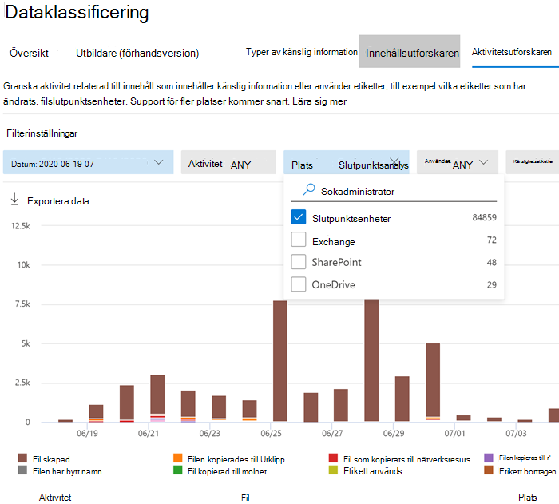

# <a name="get-started-with-microsoft-compliance-extension"></a>Kom igång med Microsofts efterlevnadstillägg

Använd de här metoderna för att distribuera Microsofts efterlevnadstillägg.

## <a name="before-you-begin"></a>Innan du börjar

Om du vill använda Microsofts efterlevnadstillägg måste enheten vara registrerad i slutpunkts-DLP:n. Läs de här artiklarna om du är nybörjare på DLP eller slutpunkts-DLP

- [Mer information om Microsofts efterlevnadstillägg](dlp-chrome-learn-about.md)
- [Mer information om dataförlustskydd](dlp-learn-about-dlp.md)
- [Skapa, testa och justera en DLP-princip](create-test-tune-dlp-policy.md)
- [Skapa en DLP-princip från en mall](create-a-dlp-policy-from-a-template.md)
- [Mer information om dataförlustskydd för slutpunkter](endpoint-dlp-learn-about.md)
- [Komma igång med dataförlustskydd för slutpunkter](endpoint-dlp-getting-started.md)
- [Registreringsverktyg och metoder för Windows 10-enheter](dlp-configure-endpoints.md)
- [Konfigurera enhetsproxy och Internetanslutningsinställningar för slutpunkts-DLP](endpoint-dlp-configure-proxy.md)
- [Använda dataförlustskydd för slutpunkter](endpoint-dlp-using.md)

### <a name="skusubscriptions-licensing"></a>Licensiering av SKU/prenumerationer

Innan du börjar måste du bekräfta din [Microsoft 365-prenumeration](https://www.microsoft.com/microsoft-365/compare-microsoft-365-enterprise-plans?rtc=1) och eventuella tillägg. Om du vill komma åt och använda slutpunkts-DLP, måste du ha någon av dessa prenumerationer eller tillägg.

- Microsoft 365 E5
- Microsoft 365 A5 (EDU)
- Microsoft 365 E5 Compliance
- Microsoft 365 A5 Compliance
- Microsoft 365 E5 – Informationsskydd och styrning
- Microsoft 365 A5 – Informationsskydd och styrning

Detaljerad licensvägledning finns i [Vägledning för säkerhet och efterlevnad med licensiering i Microsoft 365](https://docs.microsoft.com/office365/servicedescriptions/microsoft-365-service-descriptions/microsoft-365-tenantlevel-services-licensing-guidance/microsoft-365-security-compliance-licensing-guidance#information-protection).

- Organisationen måste vara licensierad för slutpunkts-DLP
- Dina enheter måste köra Windows 10 x64 version 1809 eller senare.
- Enheten måste ha klientversion 4.18.2101.9 för program mot skadlig kod eller senare. Kontrollera din aktuella version genom att öppna **Windows-säkerhet**, välj ikonen **Inställningar** och välj sedan **Om**.


### <a name="permissions"></a>Behörigheter

Data från slutpunkts-DLP kan visas i [Aktivitetsutforskaren](data-classification-activity-explorer.md). Det finns sju roller som ger behörighet till aktivitetsutforskaren och det konto som du använder för att komma åt datan måste vara medlem i någon av dem.

- Global administratör
- Efterlevnadsadministratör
- Säkerhetsadministratör
- Administratör för efterlevnadsdata
- Global läsare
- Säkerhetsläsare
- Rapportläsare

### <a name="overall-installation-workflow"></a>Övergripande installationsarbetsflöde

Distributionen av Microsofts efterlevnadstillägg är en process med flera faser. Du kan välja att installera på en dator i taget, använda Microsoft Endpoint Manager eller en grupprincip för organisationsomfattande distributioner.

1. [Förbered dina enheter](#prepare-your-devices).
2. [Grundläggande konfiguration av en dator med selfhost](#basic-setup-single-machine-selfhost)
3. [Distribuera med Microsoft Endpoint Manager](#deploy-using-microsoft-endpoint-manager)
4. [Distribuera med grupprincip](#deploy-using-group-policy)
5. [Testa tillägget](#test-the-extension)
6. [Använda instrumentpanelen för hantering av aviseringar till att visa Chrome DLP-aviseringar](#use-the-alerts-management-dashboard-to-viewing-chrome-dlp-alerts)
7. [Visa Chrome DLP-data i aktivitetsutforskaren](#viewing-chrome-dlp-data-in-activity-explorer) 

### <a name="prepare-infrastructure"></a>Förbereda infrastrukturen

Om du distribuerar Microsofts efterlevnadstillägg till alla övervakade Windows 10-enheter, bör du ta bort Google Chrome från listan med otillåtna appar och listan med otillåtna webbläsare. Mer information finns i [Otillåtna webbläsare](endpoint-dlp-using.md#unallowed-browsers). Om du bara distribuerar det till några få enheter kan du låta Chrome finnas kvar i listorna med otillåtna webbläsare eller appar. Microsofts efterlevnadstillägg kringgår begränsningarna i båda listorna för de datorer där det är installerat.  

### <a name="prepare-your-devices"></a>Förbereda dina enheter

1. Använd metoderna i följande avsnitt för att registrera dina enheter:
    1. [Komma igång med dataförlustskydd för slutpunkter](endpoint-dlp-getting-started.md)
    1. [Registreringsverktyg och metoder för Windows 10-enheter](dlp-configure-endpoints.md)
    1. [Konfigurera enhetsproxy och Internetanslutningsinställningar för slutpunkts-DLP](endpoint-dlp-configure-proxy.md)

### <a name="basic-setup-single-machine-selfhost"></a>Grundläggande konfiguration av en dator med selfhost

Detta är den rekommenderade metoden. 

1. Logga in på den Windows 10-dator där du vill installera Microsofts efterlevnadstillägg och kör PowerShell-skriptet som administratör. 

   ```powershell
   Get-Item -path "HKLM:\SOFTWARE\Microsoft\Windows Defender\Miscellaneous Configuration" | New-ItemProperty -Name DlpDisableBrowserCache -Value 0 -Force
   ``` 

2.  Gå till [Microsofts efterlevnadstillägg – Chrome Web Store (google.com)](https://chrome.google.com/webstore/detail/microsoft-compliance-exte/echcggldkblhodogklpincgchnpgcdco).

3.  Installera tillägget med hjälp av anvisningarna på Chrome Web Store-sidan.

### <a name="deploy-using-microsoft-endpoint-manager"></a>Distribuera med Microsoft Endpoint Manager

Använd konfigurationsmetoden vid distributioner till hela organisationen.


##### <a name="enabling-required-registry-key-via-microsoft-endpoint-manager"></a>Aktivera den obligatoriska registernyckeln via Microsoft Endpoint Manager

1.  Skapa ett PowerShell-skript med följande innehåll:

    ```powershell
    Get-Item -path "HKLM:\SOFTWARE\Microsoft\Windows Defender\Miscellaneous Configuration" | New-ItemProperty -Name DlpDisableBrowserCache -Value 0 -Force
    ```

2.  Logga in på [Administrationscenter för Microsoft Endpoint Manager](https://endpoint.microsoft.com).

3.  Gå till **Enheter** > **Skript** och välj **Lägg till**.

4.  Bläddra till platsen för skriptet som skapades när du uppmanas till det.

5.  Välj följande inställningar:
    1. Kör skriptet med de inloggade autentiseringsuppgifterna: JA
    1. Framtvinga signaturkontroll av skript: NEJ
    1. Kör skript i 64-bitars PowerShell-värd: JA

6.  Välj enhetsgrupper och tillämpa principen.

#### <a name="microsoft-endpoint-manager-force-install-steps"></a>Installera alltid med Microsoft Endpoint Manager

Innan du lägger till Microsofts efterlevnadstillägg i listan med tillägg som alltid installeras, är det viktigt att mata in Chrome ADMX. Stegen för den här processen i Microsoft Endpoint Manager har dokumenterats av Google: [Hantera Chrome-webbläsaren med Microsoft Intune – Hjälp för Google Chrome Enterprise](https://support.google.com/chrome/a/answer/9102677?hl=en#zippy=%2Cstep-ingest-the-chrome-admx-file-into-intune).

 När du har matat in ADMX kan du följa stegen nedan för att skapa en konfigurationsprofil för tillägget.

1.  Logga in på Administrationscenter för Microsoft Endpoint Manager (https://endpoint.microsoft.com).

2.  Gå till konfigurationsprofilerna.

3.  Välj **Skapa profil**.

4.  Välj **Windows 10** som plattform.

5.  Välj **Anpassad** som profiltyp.

6.  Välj fliken **Inställningar**.

7.  Välj **Lägg till**.

8.  Ange nedanstående principinformation.
    
    OMA-URI: `./Device/Vendor/MSFT/Policy/Config/Chrome~Policy~googlechrome~Extensions/ExtensionInstallForcelist`<br/>
    Datatyp: `String`<br/>
    Värde: `<enabled/><data id="ExtensionInstallForcelistDesc" value="1&#xF000; echcggldkblhodogklpincgchnpgcdco;https://clients2.google.com/service/update2/crx"/>`

9.  Klicka på Skapa.

### <a name="deploy-using-group-policy"></a>Distribuera med grupprincip

Om du inte vill använda Microsoft Endpoint Manager kan du använda grupprinciper till att distribuera Microsofts efterlevnadstillägg i hela organisationen

1. Enheterna måste vara hanterbara via grupprincipen och du måste importera alla Chrome ADMX till den centrala lagringsplatsen för grupprincipen. Mer information finns i [Skapa och hantera den centrala lagringsplatsen för grupprincipens administrativa mallar i Windows](https://docs.microsoft.com/troubleshoot/windows-client/group-policy/create-and-manage-central-store).

2.  Skapa ett PowerShell-skript med PowerShell-kommandot:

    ```powershell
    Get-Item -path "HKLM:\SOFTWARE\Microsoft\Windows Defender\Miscellaneous Configuration" | New-ItemProperty -Name DlpDisableBrowserCache -Value 0 -Force
    ```

3.  Öppna **konsolen Grupprinciphantering** och gå till din organisationsenhet.

4.  Högerklicka och välj **Skapa ett GPO på den här domänen och länka den här**. När du uppmanas till det tilldelar du ett beskrivande namn till grupprincipobjektet (GPO) och slutför.

5.  Högerklicka på GPO:et och välj **Redigera**.

6.  Gå till **Datorkonfiguration** > **Inställningar** > **Inställningar för Kontrollpanel** > **Schemalagda aktiviteter**.

7.  Skapa en ny omedelbar aktivitet genom att högerklicka och välja **Nytt** > **Omedelbar aktivitet (minst Windows 7)**.

8.  Ge uppgiften ett namn och en beskrivning.

9.  Välj motsvarande konto för att köra den omedelbara aktiviteten, t.ex. NT Authority

10. Välj **Kör med högsta behörighet**.

11. Konfigurera principen för Windows 10.

12. På fliken **Åtgärder** väljer du åtgärden **Starta ett program**.

13. Ange sökvägen till det program/skript som skapades i steg 1.

14. Välj **Använd**.

#### <a name="adding-the-chrome-extension-to-the-forceinstall-list"></a>Lägga till Chrome-tillägget i ForceInstall-listan

1.  Gå till organisationsenheten i redigeringsprogrammet för grupprinciphantering.

2.  Expandera följande sökväg **Konfiguration av dator/användare** > **Principer** > **Administrativa mallar** > **Klassiska administrativa mallar** > **Google** > **Google Chrome** > **Tillägg**. Sökvägen kan variera beroende på din konfiguration.

3.  Välj **Konfigurera listan med tillägg som alltid installeras**.

4.  Högerklicka och välj **Redigera**.

5.  Välj **Aktiverad**.

6.  Välj **Visa**.

7.  Under **Värde** lägger du till följande post: `echcggldkblhodogklpincgchnpgcdco;https://clients2.google.com/service/update2/crx`

8.  Välj **OK** och sedan **Använd**.

### <a name="test-the-extension"></a>Testa tillägget

#### <a name="upload-to-cloud-service-or-access-by-unallowed-browsers-cloud-egress"></a>Ladda upp till molntjänst eller åtkomst av otillåtna webbläsare med utgående moln  

1. Skapa eller hämta ett känsligt objekt och försök att ladda upp en fil till någon av organisationens begränsade tjänstdomäner. Den känsliga datan måste matcha någon av våra inbyggda [typer av känslig information](sensitive-information-type-entity-definitions.md), eller någon av organisationens typer av känslig information. Du bör få ett popup-meddelande från DLP:n på den enhet du testar från, som visar att åtgärden inte är tillåten när filen är öppen.

#### <a name="testing-other-dlp-scenarios-in-chrome"></a>Testa andra DLP-scenarier i Chrome 

Nu när du har tagit bort Chrome från listan med otillåtna webbläsare/appar kan du testa scenarierna nedan för att kontrollera att beteendet uppfyller organisationens krav:

- Kopiera data från ett känsligt objekt till ett annat dokument med hjälp av Urklipp
    - Testa genom att öppna en fil som är skyddad från att kopiera till Urklipp i webbläsaren Chrome och försök kopiera data från filen.
    - Förväntat resultat: Ett popup-meddelande från DLP om att åtgärden inte är tillåten när filen är öppen.
- Skriva ut ett dokument
    - Testa genom att öppna en fil som är skyddad mot utskriftsåtgärder i webbläsaren Chrome och försök att skriva ut filen.
    - Förväntat resultat: Ett popup-meddelande från DLP om att åtgärden inte är tillåten när filen är öppen.
- Kopiera till USB-flyttbart medium
    - Prova att spara filen i en flyttbar medielagring.
    - Förväntat resultat: Ett popup-meddelande från DLP om att åtgärden inte är tillåten när filen är öppen.
- Kopiera till en nätverksresurs
    - Prova att spara filen på en nätverksresurs.
    - Förväntat resultat: Ett popup-meddelande från DLP om att åtgärden inte är tillåten när filen är öppen.


### <a name="use-the-alerts-management-dashboard-to-viewing-chrome-dlp-alerts"></a>Använda instrumentpanelen för hantering av aviseringar till att visa DLP-aviseringar för Chrome

1. Öppna sidan **Dataförlustskydd** i [Microsoft 365 Efterlevnadscenter](https://compliance.microsoft.com) och välj **Aviseringar**.

2. Se metoderna i [Konfigurera och visa aviseringar för DLP-principer](dlp-configure-view-alerts-policies.md) om du vill se aviseringarna för slutpunkts-DLP:ns principer.


### <a name="viewing-chrome-dlp-data-in-activity-explorer"></a>Visa Chrome DLP-data i aktivitetsutforskaren

1. Öppna [sidan Dataklassificering](https://compliance.microsoft.com/dataclassification?viewid=overview) för din domän i Microsoft 365 Efterlevnadscenter och välj **Aktivitetsutforskare**.

2. Se metoderna i [Kom igång med aktivitetsutforskaren](data-classification-activity-explorer.md) för att komma åt och filtrera alla data för slutpunktsenheterna.

   > [!div class="mx-imgBorder"]
   > 

### <a name="known-issues-and-limitations"></a>Kända problem och begränsningar

1. Användning av åsidosättning av blockering för utgående moln stöds inte.
2. Inkognitoläge stöds inte och måste vara inaktiverat.

## <a name="next-steps"></a>Nästa steg
Nu när du har registrerat enheter och kan se aktivitetsdata i aktivitetsutforskaren, kan du gå vidare till nästa steg där du skapar DLP-principer som skyddar dina känsliga objekt.

- [Använda dataförlustskydd för slutpunkter](endpoint-dlp-using.md)

## <a name="see-also"></a>Se även

- [Mer information om dataförlustskydd för slutpunkter](endpoint-dlp-learn-about.md)
- [Använda dataförlustskydd för slutpunkter](endpoint-dlp-using.md)
- [Mer information om dataförlustskydd](dlp-learn-about-dlp.md)
- [Skapa, testa och justera en DLP-princip](create-test-tune-dlp-policy.md)
- [Kom igång med aktivitetsutforskaren](data-classification-activity-explorer.md)
- [Microsoft Defender för Endpoint](https://docs.microsoft.com/windows/security/threat-protection/)
- [Registreringsverktyg och metoder för Windows 10-enheter](https://docs.microsoft.com/windows/security/threat-protection/microsoft-defender-atp/configure-endpoints)
- [Microsoft 365-prenumeration](https://www.microsoft.com/microsoft-365/compare-microsoft-365-enterprise-plans?rtc=1)
- [Azure AD-anslutna enheter](https://docs.microsoft.com/azure/active-directory/devices/concept-azure-ad-join)
- [Ladda ned nya Microsoft Edge som baseras på Chromium](https://support.microsoft.com/help/4501095/download-the-new-microsoft-edge-based-on-chromium)
