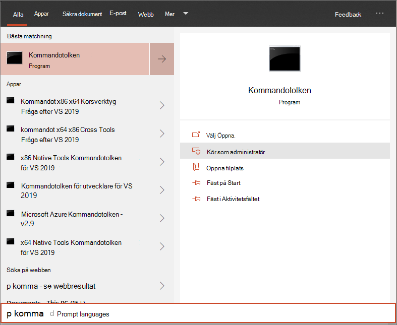

# Registrera Windows 10-enheter med ett lokalt skript

**Gäller för:**

- [Microsoft 365 Dataförlustskydd i slutpunkt (DLP)](./endpoint-dlp-learn-about.md)

Du kan även registrera enskilda enheter manuellt Microsoft 365 skydd mot dataförlust i Endpoint. Du kanske vill göra det här först när du testar tjänsten innan du åtar dig att registrera alla enheter i nätverket.

> [!IMPORTANT]
> Det här skriptet har optimerats för användning på upp till 10 enheter.
>
> Använd andra distributionsalternativ om du [vill distribuera i skala.](dlp-configure-endpoints.md) Du kan till exempel distribuera ett onboarding-skript till fler än 10 enheter i produktionen med skriptet som är tillgängligt i [Onboard Windows 10-enheter med grupprincip.](dlp-configure-endpoints-gp.md)

## Onboard-enheter
 
1.  Öppna filen för GP.zip konfigurationspaket *(DeviceComplianceOnboardingPackage.zip)* som du laddade ned från guiden för registrering av tjänster. Du kan också hämta paketet från [Microsofts efterlevnadscenter](https://compliance.microsoft.com)

2. I navigeringsfönstret väljer du **Inställningar**  >  **Enhets onboarding**.

3. Välj **Lokalt skript** i fältet **Distributionsmetod.**

4. Klicka **på Ladda ned** paket och spara .zip filen.
  
5. Extrahera innehållet i konfigurationspaketet till en plats på den enhet som du vill registrera (till exempel skrivbordet). Du bör ha en fil med namnet *DeviceOnboardingScript.cmd*.

6.  Öppna en upphöjd kommandoradsfråga på enheten och kör skriptet:

7.  Gå till **Start** och skriv **cmd**.

8.  Högerklicka på **Kommandotolk** och välj **Kör som administratör.**

    

9.  Skriv skriptfilens plats. Om du kopierade filen till skrivbordet skriver du: *%userprofile%\Desktop\WindowsDefenderATPOnboardingScript.cmd*

10.  Tryck på **Retur** eller klicka på **OK.**

Mer information om hur du manuellt kan verifiera att enheten är kompatibel och korrekt rapporterar sensordata finns i [Felsöka problem Microsoft Defender Avancerat skydd onboarding.](/windows/security/threat-protection/microsoft-defender-atp/troubleshoot-onboarding)

## Offboard-enheter med ett lokalt skript
Av säkerhetsskäl upphör paketet som används till Offboard-enheter 30 dagar efter det datum då det laddades ned. Utgångna offboarding-paket som skickats till en enhet kommer att avvisas. När du laddar ned ett offboarding-paket meddelas du om paketens utgångsdatum och det inkluderas också i paketnamnet.

> [!NOTE]
> Principer för onboarding och offboarding får inte distribueras på samma enhet samtidigt, annars kan det orsaka oförutsägbara tavlor.

1. Skaffa offboardingpaketet från [Microsofts efterlevnadscenter](https://compliance.microsoft.com)

2. I navigeringsfönstret väljer du **Inställningar**  >  **Offboarding för enheter.**

3. Välj **Lokalt skript** i fältet **Distributionsmetod.**

4. Klicka **på Ladda ned** paket och spara .zip filen.

5. Extrahera innehållet i filen .zip till en delad, skrivskyddad plats som kan nås av enheterna. Du bör ha en fil med *namnet DeviceComplianceOffboardingScript_valid_until_YYYY-MM-DD.cmd*.

6.  Öppna en upphöjd kommandoradsfråga på enheten och kör skriptet:

7.  Gå till **Start** och skriv **cmd**.

8.  Högerklicka på **Kommandotolk** och välj **Kör som administratör.**

    

9.  Skriv skriptfilens plats. Om du kopierade filen till skrivbordet skriver du: *%userprofile%\Desktop\WindowsDefenderATPOffboardingScript_valid_until_YYYY-MM-DD.cmd*

10.  Tryck på **Retur** eller klicka på **OK.**

> [!IMPORTANT]
> Offboarding gör att enheten slutar skicka sensordata till portalen.

## Övervaka enhetskonfiguration
Du kan följa de olika verifieringsstegen i [Troubleshoot onboarding issues](( för att verifiera att skriptet har slutförts https://docs.microsoft.com/windows/security/threat-protection/microsoft-defender-atp/troubleshoot-onboarding) och att agenten körs.

Övervakning kan också utföras direkt i portalen eller med hjälp av de olika distributionsverktygen.

### Övervaka enheter med hjälp av portalen
1. Gå till [Microsoft 365 Efterlevnadscenter](https://compliance.microsoft.com).

2. Välj **Inställningar**  >  **enheter för registrering av**  >  **enheter**.

3. Kontrollera att enheter visas.

## Relaterade ämnen
- [Introducera Windows 10 enheter med grupprincip](dlp-configure-endpoints-gp.md)
- [Introducera Windows 10 enheter med Microsoft Endpoint Configuration Manager](dlp-configure-endpoints-sccm.md)
- [Registrera Windows 10-enheter med hanteringsverktyg för mobila enheter](dlp-configure-endpoints-mdm.md)
- [Registrera enheter för icke beständiga VDI-enheter (Virtual Desktop Infrastructure)](dlp-configure-endpoints-vdi.md)
- [Köra ett identifieringstest på en nyligen onboarded Microsoft Defender för Endpoint-enhet](/windows/security/threat-protection/microsoft-defender-atp/run-detection-test)
- [Felsöka Microsoft Defender Avancerat skydd onboarding-problem](/windows/security/threat-protection/microsoft-defender-atp/troubleshoot-onboarding)