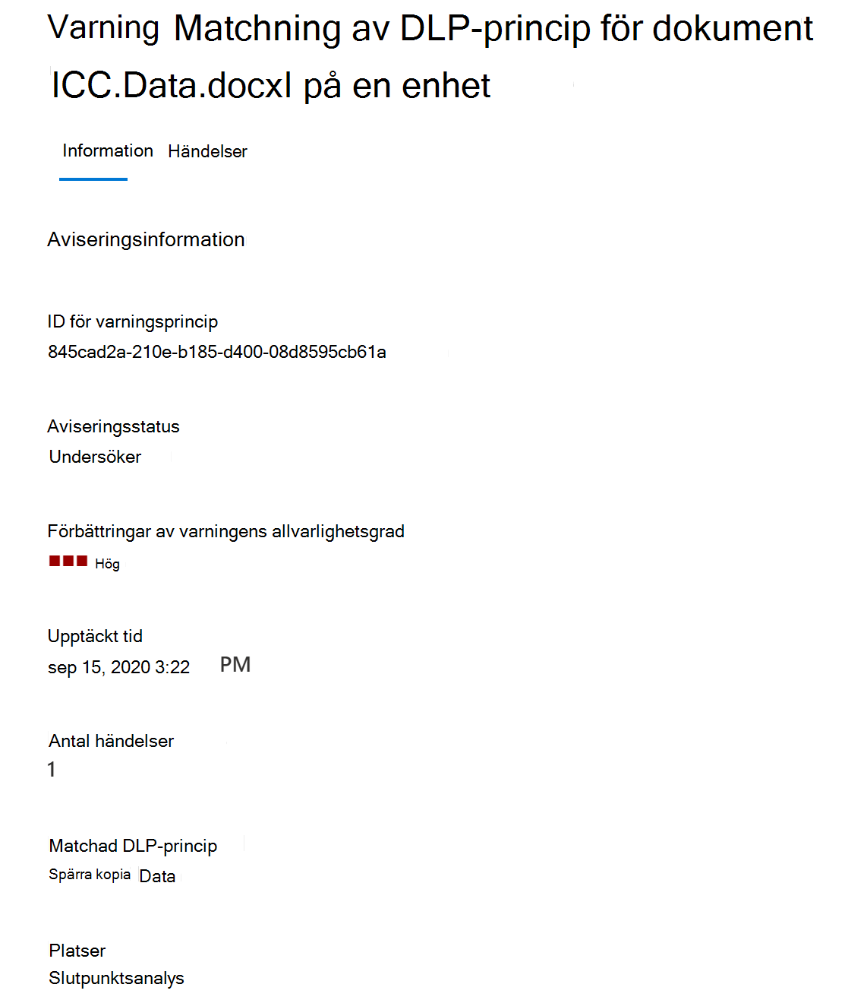
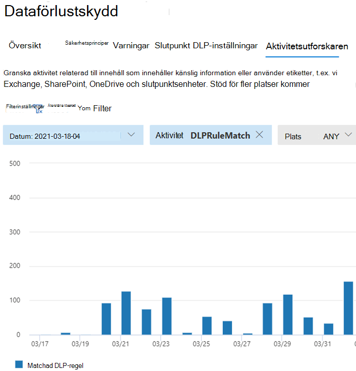

# Mer information om skydd mot dataförlustLearn about data loss prevention

Organisationer har känslig information i sin kontroll, till exempel ekonomiska data, företagsdata, kreditkortsnummer, hälsojournaler eller personnummer.Organizations have sensitive information under their control such as financial data, proprietary data, credit card numbers, health records, or social security numbers. För att skydda känsliga data och minska risken behöver de ett sätt att förhindra att användarna felaktigt delar dem med personer som inte ska ha dem.To help protect this sensitive data and reduce risk, they need a way to prevent their users from inappropriately sharing it with people who shouldn't have it. Den här övningen kallas dataförlustskydd (DLP).This practice is called data loss prevention (DLP).

I Microsoft 365 implementerar du skydd mot dataförlust genom att definiera och använda DLP-principer.In Microsoft 365, you implement data loss prevention by defining and applying DLP policies. Med en DLP-princip kan du identifiera, övervaka och automatiskt skydda känsliga objekt i:With a DLP policy, you can identify, monitor, and automatically protect sensitive items across:

- Microsoft 365 tjänster som Teams, Exchange, SharePoint och OneDriveMicrosoft 365 services such as Teams, Exchange, SharePoint, and OneDrive
- Office program som Word, Excel och PowerPointOffice applications such as Word, Excel, and PowerPoint
- Windows 10 slutpunkterWindows 10 endpoints
- icke-Microsoft-molnapparnon-Microsoft cloud apps
- lokala filresurser och lokala SharePoint.on-premises file shares and on-premises SharePoint.

Microsoft 365 identifierar känsliga objekt med hjälp av djup innehållsanalys, inte bara genom en enkel genomsökning av text.Microsoft 365 detects sensitive items by using deep content analysis, not by just a simple text scan. Innehållet analyseras för primärdatamatchningar till nyckelord, genom utvärdering av reguljära uttryck, efter intern funktionsverifiering och av sekundära datamatchningar som är i närheten av matchningen för primära data.Content is analyzed for primary data matches to keywords, by the evaluation of regular expressions, by internal function validation, and by secondary data matches that are in proximity to the primary data match. Utöver det använder DLP även maskininlärningsalgoritmer och andra metoder för att identifiera innehåll som matchar dina DLP-principer.Beyond that DLP also uses machine learning algorithms and other methods to detect content that matches your DLP policies.
  
## DLP är en del av det större erbjudandet Microsoft 365 efterlevnadDLP is part of the larger Microsoft 365 Compliance offering

Microsoft 365 DLP är bara ett av de Microsoft 365 efterlevnadsverktyg som du använder för att skydda känsliga objekt oavsett var de bor eller färdas.Microsoft 365 DLP is just one of the Microsoft 365 Compliance tools that you will use to help protect your sensitive items wherever they live or travel. Du bör förstå de andra verktygen i Microsoft 365 och efterlevnadsverktyg, hur de förs samman och fungerar bättre tillsammans.You should understand the other tools in the Microsoft 365 Compliance tools set, how they interrelate, and work better together.  Mer [Microsoft 365 information om](protect-information.md) informationsskyddsprocessen finns i Informationsskyddsverktyg.See, [Microsoft 365 compliance tools](protect-information.md) to learn more about the information protection process.

## Skyddsåtgärder för DLP-principerProtective actions of DLP policies

Microsoft 365 Med DLP-principer övervakar du de aktiviteter som användare gör i vila, känsliga objekt som överförs eller känsliga objekt som används och som skyddar.Microsoft 365 DLP policies are how you monitor the activities that users take on sensitive items at rest, sensitive items in transit, or sensitive items in use and take protective actions. När en användare till exempel försöker vidta en förbjuden åtgärd, t.ex. kopiera ett känsligt objekt till en ej godkänd plats eller dela medicinsk information i ett e-postmeddelande eller andra villkor som anges i en princip, kan DLP:For example, when a user attempts to take a prohibited action, like copying a sensitive item to an unapproved location or sharing medical information in an email or other conditions laid out in a policy, DLP can:

- visa ett popup-principtips för användaren som varnar dem om att de kanske försöker dela ett känsligt objekt olämpligtshow a pop-up policy tip to the user that warns them that they may be trying to share a sensitive item inappropriately
- blockera delning och, via ett principtips, låta användaren åsidosätta blocket och registrera användarnas justeringblock the sharing and, via a policy tip, allow the user to override the block and capture the users' justification
- blockera delning utan att åsidosätta alternativetblock the sharing without the override option
- för data i vila kan känsliga objekt låsas och flyttas till en säker karantänplatsfor data at rest, sensitive items can be locked and moved to a secure quarantine location
- för Teams chatt visas inte känslig informationfor Teams chat, the sensitive information will not be displayed

Alla DLP-övervakade aktiviteter registreras som [standard Microsoft 365](search-the-audit-log-in-security-and-compliance.md) i granskningsloggen och dirigeras till [Aktivitetsutforskaren.](data-classification-activity-explorer.md)All DLP monitored activities are recorded to the [Microsoft 365 Audit log](search-the-audit-log-in-security-and-compliance.md) by default and routed to [Activity explorer](data-classification-activity-explorer.md). När en användare utför en åtgärd som uppfyller villkoren i en DLP-princip och du har konfigurerat aviseringar, tillhandahåller DLP aviseringar i Instrumentpanelen för hantering av [DLP-aviseringar.](dlp-configure-view-alerts-policies.md)When a user performs an action that meets the criteria of a DLP policy, and you have alerts configured, DLP provides alerts in the [DLP alert management dashboard](dlp-configure-view-alerts-policies.md).

## DLP-livscykelDLP lifecycle

En DLP-implementering följer vanligtvis dessa större faser.A DLP implementation typically follows these major phases.

- [Abonnemang för DLPPlan for DLP](#plan-for-dlp)
- [Förbereda för DLPPrepare for DLP](#prepare-for-dlp)
- [Distribuera principer i produktionenDeploy your policies in production](#deploy-your-policies-in-production)

<!--ADD DIAGRAM OF THE DLP LIFECYCLE WORK ON WITH MAS-->

### Abonnemang för DLPPlan for DLP

Microsoft 365 DLP-övervakning och -skydd ingår i de program som användarna använder varje dag.Microsoft 365 DLP monitoring and protection are native to the applications that users use every day. Det här hjälper till att skydda organisationens känsliga objekt från riskfyllda aktiviteter även om användarna inte är till för skydd mot dataförlust.This helps to protect your organizations' sensitive items from risky activities even if your users are unaccustomed to data loss prevention thinking and practices. Om din organisation och dina användare inte har använda metoder för dataförlustskydd kan införandet av DLP kräva en ändring i affärsprocesserna och det kommer att ske ett kulturskifte för användarna.If your organization and your users are new to data loss prevention practices, the adoption of DLP may require a change to your business processes and there will be a culture shift for your users. Men med ordentlig planering, testning och justering kommer DLP-principerna att skydda känsliga objekt samtidigt som potentiella driftstörningar i affärsprocessen minimeras.But, with proper planning, testing and tuning, your DLP policies will protect your sensitive items while minimizing any potential business process disruptions.

**Teknikplanering för DLP****Technology planning for DLP**

Kom ihåg att med DLP som teknik kan du övervaka och skydda dina data i vila, data som används och data som används inom olika Microsoft 365-tjänster, Windows 10-enheter, lokala filresurser och lokala SharePoint.Keep in mind that DLP as a technology can monitor and protect your data at rest, data in use and data in motion across Microsoft 365 services, Windows 10 devices, on-premises file shares, and on-premises SharePoint. Det finns planeringskonsekvenser för de olika platserna, vilken typ av data du vill övervaka och skydda och vilka åtgärder som ska vidtas när en principmatchning inträffar.There are planning implications for the different locations, the type of data you want to monitor and protect, and the actions to be taken when a policy match occurs.  

**Planering av affärsprocesser för DLP****Business processes planning for DLP**

DLP-principer kan blockera förbjudna aktiviteter, t.ex. olämplig delning av känslig information via e-post.DLP policies can block prohibited activities, like inappropriate sharing of sensitive information via email. När du planerar dina DLP-principer måste du identifiera de affärsprocesser som rör känsliga objekt.As you plan your DLP policies, you must identify the business processes that touch your sensitive items. Företagsägarna kan hjälpa dig att identifiera lämpliga användarbeteenden som bör tillåtas och olämpliga användarbeteenden som bör skyddas mot.The business process owners can help you identify appropriate user behaviors that should be allowed and inappropriate user behaviors that should be protected against. Du bör planera principerna och distribuera dem i testläge och utvärdera deras påverkan [via](data-classification-activity-explorer.md) aktivitetsutforskaren innan du tillämpar dem i mer restriktiva lägen.You should plan your policies and deploy them in test mode, and evaluate their impact via [activity explorer](data-classification-activity-explorer.md) first, before applying them in more restrictive modes.

**Planering av organisationskultur för DLP****Organizational culture planning for DLP**

En lyckad DLP-implementering är lika mycket beroende av att få användarna utbildning och tillgång till metoder för skydd mot dataförlust som på väl planerade och finjusterade principer.A successful DLP implementation is as much dependent on getting your users trained and acclimated to data loss prevention practices as it is on well planned and tuned policies. Se till att planera för utbildning för användarna eftersom de är mer engagerade.Since your users are heavily involved, be sure to plan for training for them too. Du kan använda principtipsen på ett strategiska sätt för att informera användarna innan du ändrar tillämpning av principen från testläge till mer restriktiva lägen.You can strategically use policy tips to raise awareness with your users before changing the policy enforcement from test mode to more restrictive modes.

<!--For more information on planning for DLP, including suggestions for deployment based on your needs and resources, see [Planning for Microsoft 365 data loss prevention](dlp-plan-for-dlp.md).-->

### Förbereda för DLPPrepare for DLP

Du kan tillämpa DLP-principer på data i vila, data som används och data i rörelse på platser, till exempel:You can apply DLP policies to data at rest, data in use, and data in motion in locations, such as:

- Exchange Online e-postExchange Online email
- SharePoint OnlinewebbplatserSharePoint Online sites
- OneDrive-kontonOneDrive accounts
- Teams chatt- och kanalmeddelandenTeams chat and channel messages
- Microsoft Cloud App SecurityMicrosoft Cloud App Security
- Windows 10-enheterWindows 10 devices
- Lokala lagringsningarOn-premises repositories

Förutsättningarna för var och en har olika förutsättningar.Each one has different pre-requisites. Känsliga objekt på vissa platser, till exempel Exchange online, kan omfattas av DLP-paraplyet genom att bara konfigurera en princip som gäller för dem.Sensitive items in some locations, like Exchange online, can be brought under the DLP umbrella by just configuring a policy that applies to them. För andra, till exempel lagringsplatsen för lokala filer, krävs en distribution av AIP-skannern (Azure Information Protection).Others, such as on-premises file repositories require a deployment of Azure Information Protection (AIP) scanner. Du måste förbereda miljön, koda utkastprinciper och testa dem noggrant innan du aktiverar blockeringsåtgärder.You'll need to prepare your environment, code draft policies, and test them thoroughly before activating any blocking actions.

### Distribuera principer i produktionenDeploy your policies in production

#### Utforma principerDesign your policies

Börja med att definiera dina kontrollmål och hur de gäller för varje arbetslast.Start by defining your control objectives, and how they apply across each respective workload. Utkast till en princip som underser en del av dina mål.Draft a policy that embodies your objectives. Börja med en arbetsbelastning i taget eller i alla arbetsbelastningar – det finns ingen påverkan än.Feel free to start with one workload at a time, or across all workloads - there's no impact yet.

#### Implementera princip i testlägeImplement policy in test mode

Utvärdera effekterna av kontrollerna genom att implementera dem med en DLP-princip i testläge.Evaluate the impact of the controls by implementing them with a DLP policy in test mode. Det är ok att tillämpa principen på alla arbetsbelastningar i testläge, så att du får hela resultatet, men du kan börja med en arbetsbelastning om du behöver det.It's ok to apply the policy to all workloads in test mode, so that you can get the full breadth of results, but you can start with one workload if you need to.

#### Övervaka resultaten och finjustera policynMonitor outcomes and fine-tune the policy

I testläge kan du övervaka policyresultaten och finjustera den så att den uppfyller dina kontrollmål samtidigt som du inte negativt eller oavsiktligt påverkar giltiga användararbetsflöden och produktivitet.While in test mode, monitor the outcomes of the policy and fine-tune it so that it meets your control objectives while ensuring you aren't adversely or inadvertently impacting valid user workflows and productivity. Här är några exempel på saker du kan finjustera:Here are some examples of things to fine-tune:

- justera platser och personer/platser som finns inom eller utanför omfattningenadjusting the locations and people/places that are in or out of scope
- justera villkoren och undantagen som används för att avgöra om ett objekt och vad som görs med det matchar principentune the conditions and exceptions that are used to determine if an item and what is being done with it matches the policy
- definition/s för känslig informationthe sensitive information definition/s
- åtgärdernathe actions
- begränsningarthe level of restrictions
- lägga till nya kontrolleradd new controls
- lägga till nya personeradd new people
- lägga till nya begränsade apparadd new restricted apps
- lägga till nya begränsade webbplatseradd new restricted sites

#### Aktivera kontrollen och justera principernaEnable the control and tune your policies

När principen uppfyller alla dina mål kan du aktivera den.Once the policy meets all your objectives, turn it on. Fortsätt att övervaka policyprogrammets resultat och justera efter behov.Continue to monitor the outcomes of the policy application and tune as needed. I allmänhet gäller principer ungefär en timme efter att de aktiverats.In general, policies take effect about an hour after being turned on. <!--Se, LÄNK TILL ämne för SLA:er för platsspecifik information – ><!--See, LINK TO topic for SLAs for location specific  details-- >

## Översikt över DLP-principkonfigurationDLP policy configuration overview

Du har flexibiliteten i hur du skapar och konfigurerar DLP-principer.You have flexibility in how you create and configure your DLP policies. Du kan utgå från en fördefinierad mall och skapa en princip med bara några få klick eller så kan du utforma en egen från grunden.You can start from a predefined template and create a policy in just a few clicks or you can design your own from the ground up. Oavsett vilket du väljer behöver alla DLP-principer samma information från dig.No matter which you choose, all DLP policies require the same information from you.

1. **Välj vad du vill övervaka –** Microsoft 365 innehåller många fördefinierade principmallar som hjälper dig att komma igång eller så kan du skapa en anpassad princip.**Choose what you want to monitor** - Microsoft 365 comes with many predefined policy templates to help you get started or you can create a custom policy.
    - En fördefinierad principmall: Ekonomiska data, medicinska och hälsodata, sekretessdata för olika länder och regioner.A predefined policy template: Financial data, Medical and health data, Privacy data all for various countries and regions.
    - En anpassad princip som använder tillgängliga typer av känslig information, bevarandeetiketter och känslighetsetiketter.A custom policy that uses the available sensitive information types, retention labels, and sensitivity labels.
2. **Välj var du vill övervaka –** Du väljer en eller flera platser där du vill att DLP ska övervaka känslig information.**Choose where you want to monitor** - You pick one or more locations that you want DLP to monitor for sensitive information. Du kan övervaka:You can monitor:
    
platslocation | inkludera/exkludera efterinclude/exclude by|
|---------|---------|
|Exchange-e-postExchange email| distributionsgrupperdistribution groups|
|SharePoint webbplatserSharePoint sites |webbplatsersites |
|OneDrive-kontonOneDrive accounts |konton eller distributionsgrupperaccounts or distribution groups |
|Teams chatt- och kanalmeddelandenTeams chat and channel messages |kontonaccounts |
|Windows 10-enheterWindows 10 devices |användare eller gruppuser or group |
|Microsoft Cloud App SecurityMicrosoft Cloud App Security |instansinstance |
|Lokala lagringsningarOn-premises repositories| sökväg till lagringsplatsenrepository file path|

3. **Välj de villkor som måste matchas för att** en princip ska tillämpas på ett objekt – du kan acceptera förkonfigurerade villkor eller definiera anpassade villkor.**Choose the conditions that must be matched for a policy to be applied to an item** - you can accept pre-configured conditions or define custom conditions. Några exempel är:Some examples are:

- Objektet innehåller en viss typ av känslig information som används i ett visst sammanhang.item contains a specified kind of sensitive information that is being used in a certain context. Till exempel 95 personnummer som skickas via e-post till mottagare utanför din organisation.For example, 95 social security numbers being emailed to recipient outside your org.
- objekt har en angiven känslighetsetikettitem has a specified sensitivity label
- Objekt med känslig information delas antingen internt eller externtitem with sensitive information is shared either internally or externally

4. **Välj den åtgärd som ska vidtas när principvillkoren** uppfylls – Åtgärderna beror på den plats där aktiviteten pågår.**Choose the action to take when the policy conditions are met** - The actions depend on the location where the activity is happening.  Några exempel är:Some examples are:

- SharePoint/Exchange/OneDrive: Blockera personer utanför organisationens formulär som kommer åt innehållet.SharePoint/Exchange/OneDrive: Block people who are outside your organization form accessing the content. Visa ett tips för användaren och skicka ett e-postmeddelande om att de vidtar en åtgärd som är förbjuden av DLP-principen.Show the user a tip and send them an email notification that they are taking an action that is prohibited by the DLP policy.
- Teams Chatt och kanal: Blockera känslig information från att delas i chatten eller kanalenTeams Chat and Channel: Block sensitive information from being shared in the chat or channel
- Windows 10 Enheter: Granska eller begränsa kopiering av känsliga objekt till en borttagningsbar USB-enhetWindows 10 Devices: Audit or restrict copying a sensitive item to a removeable USB device 
- Office Appar: Visa en popup-popup som meddelar användaren att han eller hon engagerar sig i ett riskabelt beteende och blockerar eller blockerar men tillåter åsidosättning.Office Apps: Show a popup notifying the user that they are engaging in a risky behavior and block or block but allow override.
- Lokala filresurser: flytta filen från den plats där den lagras till en karantänmappOn-premises file shares: move the file from where it is stored to a quarantine folder

> [!NOTE]
> Villkoren och åtgärderna som ska vidtas definieras i ett objekt som kallas en regel.The conditions and the actions to take are defined in an object called a Rule.

<!--## Create a DLP policy

All DLP policies are created and maintained in the Microsoft 365 Compliance center. See, INSERT LINK TO ARTICLE THAT WILL START WALKING THEM THROUGH THE POLICY CREATION PROCEDURES for more information.-->

När du har skapat en DLP-princip i efterlevnadscentret lagras den i en central principkälla och synkroniseras sedan med de olika innehållskällorna, till exempel:After you create a DLP policy in the Compliance Center, it's stored in a central policy store, and then synced to the various content sources, including:
  
- Exchange Online och vidare till Outlook på webben och Outlook.Exchange Online, and from there to Outlook on the web and Outlook.
- OneDrive för företag webbplatser.OneDrive for Business sites.
- SharePoint Onlinewebbplatser.SharePoint Online sites.
- Office -skrivbordsprogram (Excel, PowerPoint och Word).Office desktop programs (Excel, PowerPoint, and Word).
- Microsoft Teams kanaler och chattmeddelanden.Microsoft Teams channels and chat messages.
    
När principen har synkroniserats till rätt platser börjar den utvärdera innehåll och tillämpa åtgärder.After the policy's synced to the right locations, it starts to evaluate content and enforce actions.

## Visa principprogramsresultatViewing policy application results

DLP rapporterar en stor mängd information till användare Microsoft 365 övervakning, principmatchningar, åtgärder och användaraktiviteter.DLP reports a vast amount of information into Microsoft 365 from monitoring, policy matches and actions, and user activities. Du måste använda och agera på den informationen för att justera principer och åtgärder för känsliga objekt.You'll need to consume and act on that information to tune your policies and triage actions taken on sensitive items. Telemetrin går in i [Microsoft 365 granskningsloggar](search-the-audit-log-in-security-and-compliance.md#search-the-audit-log-in-the-compliance-center) för efterlevnadscenter först, bearbetas och tar sig till olika rapporteringsverktyg.The telemetry goes into the [Microsoft 365 Compliance center Audit Logs](search-the-audit-log-in-security-and-compliance.md#search-the-audit-log-in-the-compliance-center) first, is processed, and makes its way to different reporting tools. Varje rapporteringsverktyg har ett annat syfte.Each reporting tool has a different purpose.  

### Instrumentpanelen för DLP-aviseringarDLP Alerts Dashboard

När DLP vidtar en åtgärd för ett känsligt objekt kan du få ett meddelande om den åtgärden via en konfigurerbar avisering.When DLP takes an action on a sensitive item, you can be notified of that action via a configurable alert. I stället för att dessa aviseringar ska staplas i en postlåda så att du kan bläddra igenom dem, blir de tillgängliga i Instrumentpanelen för hantering av [DLP-aviseringar.](dlp-configure-view-alerts-policies.md)Rather than having these alerts pile up in a mailbox for you to sift through, the Compliance center makes them available in the [DLP Alerts Management Dashboard](dlp-configure-view-alerts-policies.md). Använd instrumentpanelen för DLP-aviseringar för att konfigurera aviseringar, granska dem, kontrollera dem och spåra upplösningen för DLP-aviseringar.Use the DLP Alerts dashboard to configure alerts, review them, triage them and track resolution of DLP Alerts. Här är ett exempel på aviseringar som genereras av principmatchningar och aktiviteter från Windows 10 enheter.Here's an example of alerts generated by policy matches and activities from Windows 10 devices.

> [!div class="mx-imgBorder"]
> 

Du kan också se information om den associerade händelsen med omfattande metadata i samma instrumentpanelYou can also view details of the associated event with rich metadata in the same dashboard

> [!div class="mx-imgBorder"]
> 

### RapporterReports

[DLP-rapporterna](view-the-dlp-reports.md#view-the-reports-for-data-loss-prevention) visar på breda trender över tid och ger specifika insikter om:The [DLP reports](view-the-dlp-reports.md#view-the-reports-for-data-loss-prevention) show broad trends over time and give specific insights into:

- **DLP-principmatchning** över tid och filtrera efter datumintervall, plats, princip eller åtgärd**DLP Policy Matches** over time and filter by date range, location, policy, or action
- **Matchningar mot DLP-incidenter** visar också matchningar över tid, men pivoterar på objekten i stället för principreglerna.**DLP incident matches** also shows matches over time, but pivots on the items rather than the policy rules.
- **DLP falska positiva resultat och åsidosättningar** visar antalet falska positiva resultat och, om det konfigurerats, användar åsidosättningar tillsammans med användarens justering.**DLP false positives and overrides** shows the count of false positives and, if configured, user-overrides along with the user justification.

### DLP-aktivitetsutforskarenDLP Activity Explorer

Fliken Aktivitetsutforskaren på sidan DLP har *filtret* Aktivitet förinställt *på DLPRuleMatchning.*The Activity explorer tab on the DLP page has the *Activity* filter preset to *DLPRuleMatch*. Använd det här verktyget för att granska aktiviteter som är relaterade till innehåll som innehåller känslig information eller har etiketter använts, t.ex. vilka etiketter som har ändrats, filer ändrades och matchade en regel.Use this tool to review activity related to content that contains sensitive info or has labels applied, such as what labels were changed, files were modified, and matched a rule.

Mer information finns i Komma [igång med aktivitetsutforskaren](data-classification-activity-explorer.md)For more information, see [Get started with activity explorer](data-classification-activity-explorer.md)

Mer information om DLP Microsoft 365 finns i:To learn more about Microsoft 365 DLP, see:

- [Läs mer om dataförlustskydd för slutpunkt i Microsoft 365Learn about Microsoft 365 Endpoint data loss prevention](endpoint-dlp-learn-about.md)
- [Läs mer om standardprincipen för dataförlustskydd i Microsoft Teams (förhandsversion)Learn about the default data loss prevention policy in Microsoft Teams (preview)](dlp-teams-default-policy.md)
- [Mer information om Microsoft 365 lokal skanner för dataförlustskydd (förhandsversion)Learn about the Microsoft 365 data loss prevention on-premises scanner (preview)](dlp-on-premises-scanner-learn.md)
- [Läs mer om Microsofts Efterlevnadstillägg (förhandsversion)Learn about the Microsoft Compliance Extension (preview)](dlp-chrome-learn-about.md)
- [Lär dig om instrumentpanelen för dataförlustskyddsvarningarLearn about the data loss prevention Alerts dashboard](dlp-alerts-dashboard-learn.md)

Mer information om hur du använder skydd mot dataförlust i enlighet med sekretessregler för data finns i [Distribuera informationsskydd](../solutions/information-protection-deploy.md) för bestämmelser om datasekretess med Microsoft 365 (aka.ms/m365dataprivacy).To learn how to use data loss prevention to comply with data privacy regulations, see [Deploy information protection for data privacy regulations with Microsoft 365](../solutions/information-protection-deploy.md)  (aka.ms/m365dataprivacy).