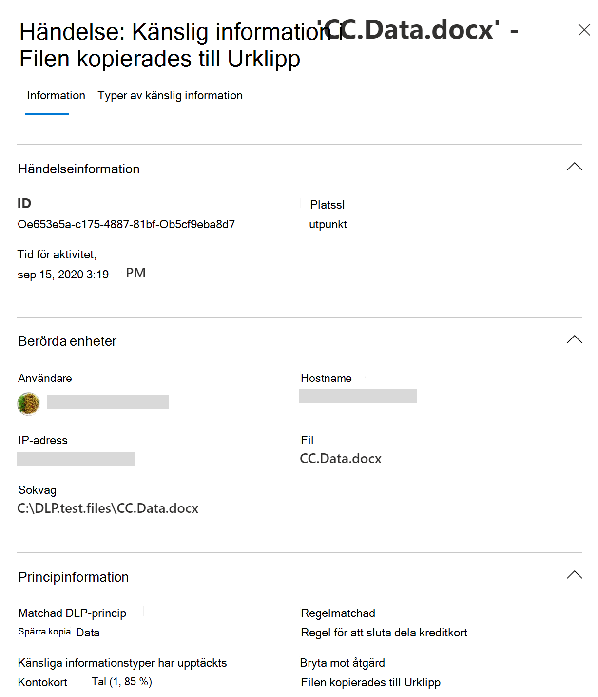

# Mer information om skydd mot dataförlust

Organisationer har känslig information i sin kontroll, till exempel ekonomiska data, företagsdata, kreditkortsnummer, hälsojournaler eller personnummer. För att skydda känsliga data och minska risken behöver de ett sätt att förhindra att användarna felaktigt delar dem med personer som inte ska ha dem. Den här övningen kallas dataförlustskydd (DLP).

I Microsoft 365 implementerar du skydd mot dataförlust genom att definiera och använda DLP-principer. Med en DLP-princip kan du identifiera, övervaka och automatiskt skydda känsliga objekt i:

- Microsoft 365 tjänster som Teams, Exchange, SharePoint och OneDrive
- Office program som Word, Excel och PowerPoint
- Windows 10 slutpunkter
- icke-Microsoft-molnappar
- lokala filresurser och lokala SharePoint.

Microsoft 365 identifierar känsliga objekt med hjälp av djup innehållsanalys, inte bara genom en enkel genomsökning av text. Innehållet analyseras för primärdatamatchningar till nyckelord, genom utvärdering av reguljära uttryck, efter intern funktionsverifiering och av sekundära datamatchningar som är i närheten av matchningen för primära data. Utöver det använder DLP även maskininlärningsalgoritmer och andra metoder för att identifiera innehåll som matchar dina DLP-principer.
  
## DLP är en del av det större erbjudandet Microsoft 365 efterlevnad

Microsoft 365 DLP är bara ett av de Microsoft 365 efterlevnadsverktyg som du använder för att skydda känsliga objekt oavsett var de bor eller färdas. Du bör förstå de andra verktygen i Microsoft 365 och efterlevnadsverktyg, hur de förs samman och fungerar bättre tillsammans.  Mer [Microsoft 365 information om](protect-information.md) informationsskyddsprocessen finns i Informationsskyddsverktyg.

## Skyddsåtgärder för DLP-principer

Microsoft 365 Med DLP-principer övervakar du de aktiviteter som användare gör i vila, känsliga objekt som överförs eller känsliga objekt som används och som skyddar. När en användare till exempel försöker vidta en förbjuden åtgärd, t.ex. kopiera ett känsligt objekt till en ej godkänd plats eller dela medicinsk information i ett e-postmeddelande eller andra villkor som anges i en princip, kan DLP:

- visa ett popup-principtips för användaren som varnar dem om att de kanske försöker dela ett känsligt objekt olämpligt
- blockera delning och, via ett principtips, låta användaren åsidosätta blocket och registrera användarnas justering
- blockera delning utan att åsidosätta alternativet
- för data i vila kan känsliga objekt låsas och flyttas till en säker karantänplats
- för Teams chatt visas inte känslig information

Alla DLP-övervakade aktiviteter registreras som [standard Microsoft 365](search-the-audit-log-in-security-and-compliance.md) i granskningsloggen och dirigeras till [Aktivitetsutforskaren.](data-classification-activity-explorer.md) När en användare utför en åtgärd som uppfyller villkoren i en DLP-princip och du har konfigurerat aviseringar, tillhandahåller DLP aviseringar i Instrumentpanelen för hantering av [DLP-aviseringar.](dlp-configure-view-alerts-policies.md)

## DLP-livscykel

En DLP-implementering följer vanligtvis dessa större faser.

- [Planera för DLP](#plan-for-dlp)
- [Förbereda för DLP](#prepare-for-dlp)
- [Distribuera principer i produktionen](#deploy-your-policies-in-production)

<!--ADD DIAGRAM OF THE DLP LIFECYCLE WORK ON WITH MAS-->

### Planera för DLP

Microsoft 365 DLP-övervakning och -skydd ingår i de program som användarna använder varje dag. Det här hjälper till att skydda organisationens känsliga objekt från riskfyllda aktiviteter även om användarna inte är till för skydd mot dataförlust. Om din organisation och dina användare inte har använda metoder för dataförlustskydd kan införandet av DLP kräva en ändring i affärsprocesserna och det kommer att ske ett kulturskifte för användarna. Men med ordentlig planering, testning och justering kommer DLP-principerna att skydda känsliga objekt samtidigt som potentiella driftstörningar i affärsprocessen minimeras.

**Teknikplanering för DLP**

Kom ihåg att med DLP som teknik kan du övervaka och skydda dina data i vila, data som används och data som används inom olika Microsoft 365-tjänster, Windows 10-enheter, lokala filresurser och lokala SharePoint. Det finns planeringskonsekvenser för de olika platserna, vilken typ av data du vill övervaka och skydda och vilka åtgärder som ska vidtas när en principmatchning inträffar.  

**Planering av affärsprocesser för DLP**

DLP-principer kan blockera förbjudna aktiviteter, t.ex. olämplig delning av känslig information via e-post. När du planerar dina DLP-principer måste du identifiera de affärsprocesser som rör känsliga objekt. Företagsägarna kan hjälpa dig att identifiera lämpliga användarbeteenden som bör tillåtas och olämpliga användarbeteenden som bör skyddas mot. Du bör planera principerna och distribuera dem i testläge och utvärdera deras påverkan [via](data-classification-activity-explorer.md) aktivitetsutforskaren innan du tillämpar dem i mer restriktiva lägen.

**Planering av organisationskultur för DLP**

En lyckad DLP-implementering är lika mycket beroende av att få användarna utbildning och tillgång till metoder för skydd mot dataförlust som på väl planerade och finjusterade principer. Se till att planera för utbildning för användarna eftersom de är mer engagerade. Du kan använda principtipsen på ett strategiska sätt för att informera användarna innan du ändrar tillämpning av principen från testläge till mer restriktiva lägen.

<!--For more information on planning for DLP, including suggestions for deployment based on your needs and resources, see [Planning for Microsoft 365 data loss prevention](dlp-plan-for-dlp.md).-->

### Förbereda för DLP

Du kan tillämpa DLP-principer på data i vila, data som används och data i rörelse på platser, till exempel:

- Exchange Online e-post
- SharePoint Onlinewebbplatser
- OneDrive konton
- Teams chatt- och kanalmeddelanden
- Microsoft Cloud App Security
- Windows 10-enheter
- Lokala lagringsningar

Förutsättningarna för var och en har olika förutsättningar. Känsliga objekt på vissa platser, till exempel Exchange online, kan omfattas av DLP-paraplyet genom att bara konfigurera en princip som gäller för dem. För andra, till exempel lagringsplatsen för lokala filer, krävs en distribution av AIP-skannern (Azure Information Protection). Du måste förbereda miljön, koda utkastprinciper och testa dem noggrant innan du aktiverar blockeringsåtgärder.

### Distribuera principer i produktionen

#### Utforma principer

Börja med att definiera dina kontrollmål och hur de gäller för varje arbetslast. Utkast till en princip som underser en del av dina mål. Börja med en arbetsbelastning i taget eller i alla arbetsbelastningar – det finns ingen påverkan än.

#### Implementera princip i testläge

Utvärdera effekterna av kontrollerna genom att implementera dem med en DLP-princip i testläge. Det är ok att tillämpa principen på alla arbetsbelastningar i testläge, så att du får hela resultatet, men du kan börja med en arbetsbelastning om du behöver det.

#### Övervaka resultaten och finjustera policyn

I testläge kan du övervaka policyresultaten och finjustera den så att den uppfyller dina kontrollmål samtidigt som du inte negativt eller oavsiktligt påverkar giltiga användararbetsflöden och produktivitet. Här är några exempel på saker du kan finjustera:

- justera platser och personer/platser som finns inom eller utanför omfattningen
- justera villkoren och undantagen som används för att avgöra om ett objekt och vad som görs med det matchar principen
- definition/s för känslig information
- åtgärderna
- begränsningar
- lägga till nya kontroller
- lägga till nya personer
- lägga till nya begränsade appar
- lägga till nya begränsade webbplatser

#### Aktivera kontrollen och justera principerna

När principen uppfyller alla dina mål kan du aktivera den. Fortsätt att övervaka policyprogrammets resultat och justera efter behov. I allmänhet gäller principer ungefär en timme efter att de aktiverats. <!--Se, LÄNK TILL ämne för SLA:er för platsspecifik information – >

## Översikt över DLP-principkonfiguration

Du har flexibiliteten i hur du skapar och konfigurerar DLP-principer. Du kan utgå från en fördefinierad mall och skapa en princip med bara några få klick eller så kan du utforma en egen från grunden. Oavsett vilket du väljer behöver alla DLP-principer samma information från dig.

1. **Välj vad du vill övervaka –** Microsoft 365 innehåller många fördefinierade principmallar som hjälper dig att komma igång eller så kan du skapa en anpassad princip.
    - En fördefinierad principmall: Ekonomiska data, medicinska och hälsodata, sekretessdata för olika länder och regioner.
    - En anpassad princip som använder tillgängliga typer av känslig information, bevarandeetiketter och känslighetsetiketter.
2. **Välj var du vill övervaka –** Du väljer en eller flera platser där du vill att DLP ska övervaka känslig information. Du kan övervaka:
    
plats | inkludera/exkludera efter|
|---------|---------|
|Exchange e-post| distributionsgrupper|
|SharePoint webbplatser |webbplatser |
|OneDrive konton |konton eller distributionsgrupper |
|Teams chatt- och kanalmeddelanden |konton |
|Windows 10-enheter |användare eller grupp |
|Microsoft Cloud App Security |instans |
|Lokala lagringsningar| sökväg till lagringsplatsen|

3. **Välj de villkor som måste matchas för att** en princip ska tillämpas på ett objekt – du kan acceptera förkonfigurerade villkor eller definiera anpassade villkor. Några exempel är:

- Objektet innehåller en viss typ av känslig information som används i ett visst sammanhang. Till exempel 95 personnummer som skickas via e-post till mottagare utanför din organisation.
- objekt har en angiven känslighetsetikett
- Objekt med känslig information delas antingen internt eller externt

4. **Välj den åtgärd som ska vidtas när principvillkoren** uppfylls – Åtgärderna beror på den plats där aktiviteten pågår.  Några exempel är:

- SharePoint/Exchange/OneDrive: Blockera personer utanför organisationens formulär som kommer åt innehållet. Visa ett tips för användaren och skicka ett e-postmeddelande om att de vidtar en åtgärd som är förbjuden av DLP-principen.
- Teams Chatt och kanal: Blockera känslig information från att delas i chatten eller kanalen
- Windows 10 Enheter: Granska eller begränsa kopiering av känsliga objekt till en borttagningsbar USB-enhet 
- Office Appar: Visa en popup-popup som meddelar användaren att han eller hon engagerar sig i ett riskabelt beteende och blockerar eller blockerar men tillåter åsidosättning.
- Lokala filresurser: flytta filen från den plats där den lagras till en karantänmapp

> [!NOTE]
> Villkoren och åtgärderna som ska vidtas definieras i ett objekt som kallas en regel.

<!--## Create a DLP policy

All DLP policies are created and maintained in the Microsoft 365 Compliance center. See, INSERT LINK TO ARTICLE THAT WILL START WALKING THEM THROUGH THE POLICY CREATION PROCEDURES for more information.-->

När du har skapat en DLP-princip i efterlevnadscentret lagras den i en central principkälla och synkroniseras sedan med de olika innehållskällorna, till exempel:
  
- Exchange Online och vidare till Outlook på webben och Outlook.
- OneDrive för företag webbplatser.
- SharePoint Onlinewebbplatser.
- Office -skrivbordsprogram (Excel, PowerPoint och Word).
- Microsoft Teams kanaler och chattmeddelanden.
    
När principen har synkroniserats till rätt platser börjar den utvärdera innehåll och tillämpa åtgärder.

## Visa principprogramsresultat

DLP rapporterar en stor mängd information till användare Microsoft 365 övervakning, principmatchningar, åtgärder och användaraktiviteter. Du måste använda och agera på den informationen för att justera principer och åtgärder för känsliga objekt. Telemetrin går in i [Microsoft 365 granskningsloggar](search-the-audit-log-in-security-and-compliance.md#search-the-audit-log-in-the-compliance-center) för efterlevnadscenter först, bearbetas och tar sig till olika rapporteringsverktyg. Varje rapporteringsverktyg har ett annat syfte.  

### Instrumentpanelen för DLP-aviseringar

När DLP vidtar en åtgärd för ett känsligt objekt kan du få ett meddelande om den åtgärden via en konfigurerbar avisering. I stället för att dessa aviseringar ska staplas i en postlåda så att du kan bläddra igenom dem, blir de tillgängliga i Instrumentpanelen för hantering av [DLP-aviseringar.](dlp-configure-view-alerts-policies.md) Använd instrumentpanelen för DLP-aviseringar för att konfigurera aviseringar, granska dem, kontrollera dem och spåra upplösningen för DLP-aviseringar. Här är ett exempel på aviseringar som genereras av principmatchningar och aktiviteter från Windows 10 enheter.

> [!div class="mx-imgBorder"]
> 

Du kan också visa information om den associerade händelsen med omfattande metadata på samma instrumentpanel

> [!div class="mx-imgBorder"]
> 

### Rapporter

[DLP-rapporterna](view-the-dlp-reports.md#view-the-reports-for-data-loss-prevention) visar på breda trender över tid och ger specifika insikter om:

- **DLP-principmatchning** över tid och filtrera efter datumintervall, plats, princip eller åtgärd
- **Matchningar mot DLP-incidenter** visar också matchningar över tid, men pivoterar på objekten i stället för principreglerna.
- **DLP falska positiva resultat och åsidosättningar** visar antalet falska positiva resultat och, om det konfigurerats, användar åsidosättningar tillsammans med användarens justering.

### DLP-aktivitetsutforskaren

Fliken Aktivitetsutforskaren på sidan DLP har *filtret* Aktivitet förinställt *på DLPRuleMatchning.* Använd det här verktyget för att granska aktiviteter som är relaterade till innehåll som innehåller känslig information eller har etiketter använts, t.ex. vilka etiketter som har ändrats, filer ändrades och matchade en regel.

Mer information finns i Komma [igång med aktivitetsutforskaren](data-classification-activity-explorer.md)

Mer information om DLP Microsoft 365 finns i:

- [Läs mer om dataförlustskydd för slutpunkt i Microsoft 365](endpoint-dlp-learn-about.md)
- [Läs mer om standardprincipen för dataförlustskydd i Microsoft Teams (förhandsversion)](dlp-teams-default-policy.md)
- [Mer information om Microsoft 365 lokal skanner för dataförlustskydd (förhandsversion)](dlp-on-premises-scanner-learn.md)
- [Läs mer om Microsofts Efterlevnadstillägg (förhandsversion)](dlp-chrome-learn-about.md)
- [Lär dig om instrumentpanelen för dataförlustskyddsvarningar](dlp-alerts-dashboard-learn.md)

Mer information om hur du använder skydd mot dataförlust i enlighet med sekretessregler för data finns i [Distribuera informationsskydd](../solutions/information-protection-deploy.md) för bestämmelser om datasekretess med Microsoft 365 (aka.ms/m365dataprivacy).