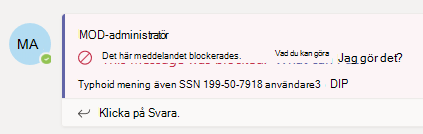
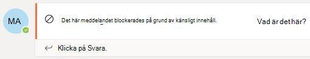
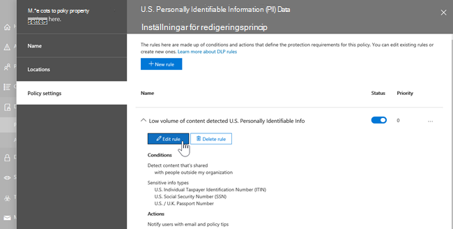
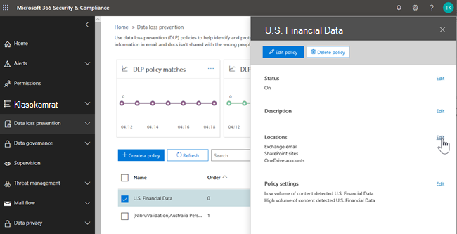
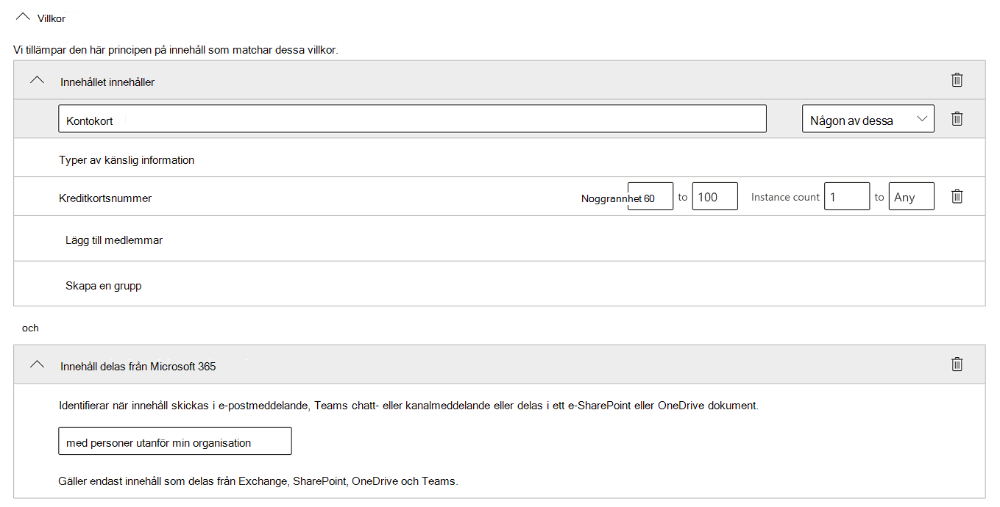
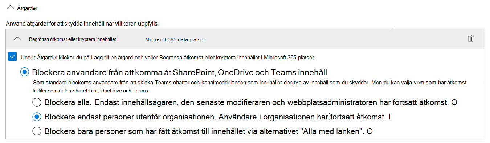
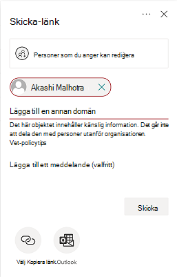
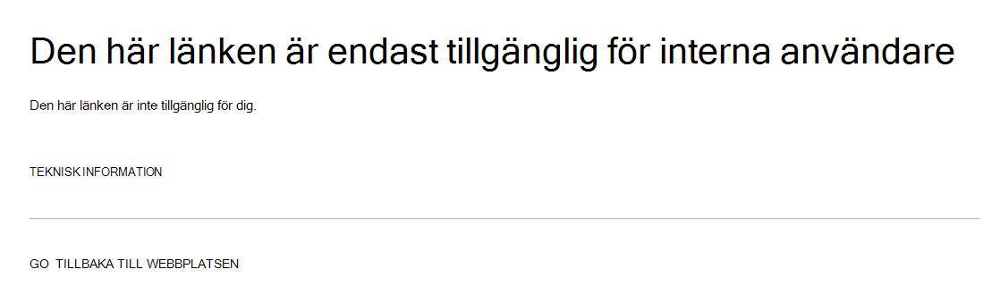

# Skydd mot dataförlust och Microsoft Teams

Om din organisation har skydd mot dataförlust (DLP) kan du definiera principer som hindrar personer från att dela känslig information i en Microsoft Teams kanal eller chattsession. Här är några exempel på hur skyddet fungerar:

- **Exempel 1: Skydda känslig information i meddelanden**. Anta att någon försöker dela känslig information i en Teams eller kanal med gäster (externa användare). Om en DLP-princip har definierats för att förhindra detta, tas meddelanden med känslig information som skickas till externa användare bort. Det sker automatiskt, och inom några sekunder, beroende på hur DLP-principen har konfigurerats.

    > [!NOTE]
    > DLP för Microsoft Teams blockerar känsligt innehåll när det delas Microsoft Teams användare som har: - [gäståtkomst](/MicrosoftTeams/guest-access) i team och kanaler; eller - [extern åtkomst](/MicrosoftTeams/manage-external-access) i möten och chattsessioner. 
DLP för externa chattsessioner fungerar bara om både avsändaren och mottagaren är i Teams och använder [Microsoft Teams intern federation.](/microsoftteams/manage-external-access) DLP för Teams inte blockera meddelanden i [interop](/microsoftteams/teams-and-skypeforbusiness-coexistence-and-interoperability#interoperability-of-teams-and-skype-for-business) med Skype för företag eller icke-ursprungliga federerade chattsessioner.

- **Exempel 2: Skydda känslig information i dokument**. Anta att någon försöker dela ett dokument med gäster i en Microsoft Teams kanal eller chatt, och att dokumentet innehåller känslig information. Om en DLP-princip har definierats för att förhindra det öppnas inte dokumentet för dessa användare. Din DLP-princip måste SharePoint och OneDrive för att skyddet ska vara på plats. Det här är ett exempel på DLP för SharePoint som visas i Microsoft Teams och kräver därför att användarna är licensierade för Office 365 DLP (ingår i Office 365 E3), men inte att användarna måste vara licensierade för Office 365 Advanced Compliance.)

## DLP-licensiering för Microsoft Teams

[Funktionerna för skydd mot](dlp-learn-about-dlp.md) dataförlust har utökats så att de omfattar Microsoft Teams och kanalmeddelanden, **inklusive meddelanden i privata kanaler** för:

- Office 365 E5/A5
- Microsoft 365 E5/A5
- Microsoft 365 Informationsskydd och styrning
- Office 365 Advanced Compliance

Office 365 och Microsoft 365 E3 DLP-skydd för SharePoint Online, OneDrive och Exchange Online. Det omfattar även filer som delas via Teams eftersom Teams använder SharePoint Online och OneDrive för att dela filer.

Stöd för DLP-skydd i Teams chatt kräver E5.

Mer information om licenskrav finns i [licensvägledning Microsoft 365 Tenant-Level Services Licensing Guidance](/office365/servicedescriptions/microsoft-365-service-descriptions/microsoft-365-tenantlevel-services-licensing-guidance/microsoft-365-security-compliance-licensing-guidance).

> [!IMPORTANT]
> DLP gäller endast för de faktiska meddelandena i chatten eller kanaltråden. Aktivitetsmeddelanden – som innehåller en kort förhandsgranskning och visas utifrån en  användares meddelandeinställningar – tas inte med i Teams DLP. Känslig information som finns i den del av meddelandet som visas i förhandsgranskningen fortsätter att visas i meddelandet även efter att DLP-principen har tillämpats och tagit bort känslig information i själva meddelandet.

## DLP-skyddets omfattning

DLP-skydd tillämpas olika på Teams enheter.

|Användarkonton/grupper/lista  |Teams Entitet |DLP-skydd tillgängligt|
|---------|---------|---------|
|enskilda användarkonton     |1:1/n chattar         |ja         |
|     |allmänna chattar         |nej         |
|     |privata kanaler         |ja         |
|säkerhetsgrupper/distributionslistor  | 1:1/n chattar         |ja         |
|     |allmänna chattar         |nej         |
|     |privata kanaler         |ja        |
|Microsoft 365 grupp    |1:1/n chattar          |nej         |
|     |allmänna chattar          |ja        |
|     |privata kanaler|nej| 

## Principtips hjälper till att utbilda användare

På liknande sätt som DLP fungerar i [Exchange, Outlook, Outlook](data-loss-prevention-policies.md#policy-evaluation-in-exchange-online-outlook-and-outlook-on-the-web)på webben [, SharePoint Online, OneDrive för företag-webbplatser](data-loss-prevention-policies.md#policy-evaluation-in-onedrive-for-business-and-sharepoint-online-sites)och Office-skrivbordsklienter visas principtips när en åtgärd utlöses med en DLP-princip.  Här är ett exempel på ett principtips:

Här försökte avsändaren dela ett personnummer i en Microsoft Teams kanal. Länken **Vad kan jag göra?** öppnar en dialogruta med alternativ för att avsändaren ska kunna lösa problemet. Observera att avsändaren kan välja att åsidosätta principen eller meddela en administratör att granska och lösa den.

I din organisation kan du välja att tillåta användare att åsidosätta en DLP-princip. När du konfigurerar DLP-principerna kan du använda standardprinciptipsen eller [anpassa principtipsen](#to-customize-policy-tips) för organisationen.

Gå tillbaka till vårt exempel, där en avsändare delade ett personnummer i en Teams-kanal, så här såg mottagaren:

> [!div class="mx-imgBorder"]
> 

### Så här anpassar du principtips

Du måste ha tilldelats en roll som har behörighet att redigera DLP-principer för att kunna utföra den här uppgiften. Mer information finns i [Behörigheter.](data-loss-prevention-policies.md#permissions)

1. Gå till efterlevnadscentret [https://compliance.microsoft.com](https://compliance.microsoft.com) () och logga in.

2. Välj **Policy för skydd mot**  >  **dataförlust**.

3. Välj en princip och välj **Redigera bredvid** **Principinställningar.**

4. Skapa antingen en ny regel eller redigera en befintlig regel för principen.

    > [!div class="mx-imgBorder"]
    > 

5. På fliken **Användarmeddelanden** väljer du Anpassa **e-posttexten** och/eller **Anpassa textalternativen för principtips.**

    > [!div class="mx-imgBorder"]
    >    

6. Ange den text som du vill använda för e-postaviseringar och/eller principtips och välj sedan **Spara**.

7. På fliken **Principinställningar** väljer du **Spara**.

Det kan ta ungefär en timme innan ändringarna fungerar via datacentret och synkroniseras med användarkonton.
 <!-- why are these syncing to user accounts? -->

## Lägga Microsoft Teams som plats i befintliga DLP-principer

Du måste ha tilldelats en roll som har behörighet att redigera DLP-principer för att kunna utföra den här uppgiften. Mer information finns i [Behörigheter.](data-loss-prevention-policies.md#permissions)

1. Gå till efterlevnadscentret [https://compliance.microsoft.com](https://compliance.microsoft.com) () och logga in.

2. Välj **Policy för skydd mot**  >  **dataförlust**.

3. Välj en princip och titta på värdena under **Platser.** Om du **ser Teams chatt- och kanalmeddelanden** är allt klart. Om du inte har det klickar du på **Redigera.**

    > [!div class="mx-imgBorder"]
    > 

4. I kolumnen **Status** aktiverar du principen för Teams **och kanalmeddelanden**.

    > [!div class="mx-imgBorder"]
    > 

5. Behåll **standardinställningen för** alla konton på fliken Välj **platser** eller välj Låt mig välja specifika platser . Du kan ange:

    1. upp till 1 000 enskilda konton att inkludera eller exkludera
    1. distributionslistor och säkerhetsgrupper som ska inkluderas eller exkluderas. 
    <!-- 1. the shared mailbox of a shared channel. **This is a public preview feature.**--> 
    
6. Välj sedan **Nästa**.

7. Klicka på **Spara**.

Det kan ta ungefär en timme innan ändringarna fungerar via datacentret och synkroniseras med användarkonton.
<!-- again, why user accounts? -->

## Definiera en ny DLP-princip för Microsoft Teams

Du måste ha tilldelats en roll som har behörighet att redigera DLP-principer för att kunna utföra den här uppgiften. Mer information finns i [Behörigheter.](data-loss-prevention-policies.md#permissions)

1. Gå till efterlevnadscentret [https://compliance.microsoft.com](https://compliance.microsoft.com) () och logga in.

2. Välj **Policy för skydd mot**  >    >  **dataförlust + Skapa en princip.**

3. Välj en [mall](data-loss-prevention-policies.md#dlp-policy-templates)och välj sedan **Nästa**.

    I vårt exempel har vi valt mallen U.S. Personally Identifiable Information Data.

    > [!div class="mx-imgBorder"]
    >  

4. På fliken **Namnge principen** anger du ett namn och en beskrivning för principen och väljer sedan **Nästa.**

5. Behåll **standardinställningen för** alla konton på fliken Välj **platser** eller välj Låt mig välja specifika platser . Du kan ange:

    1. upp till 1 000 enskilda konton att inkludera eller exkludera
    1. distributionslistor och säkerhetsgrupper som ska inkluderas eller exkluderas. **Det här är en offentlig förhandsversionsfunktion.**
    <!-- 1. the shared mailbox of a shared channel. **This is a public preview feature.**-->  

    

    > [!NOTE]
    > Om du vill kontrollera att dokument som innehåller känslig information inte delas olämpligt i Teams kontrollerar du att **SharePoint-webbplatser** och **OneDrive-konton** är aktiverat tillsammans med Teams-chatt- och **kanalmeddelanden.**

6. På fliken **Principinställningar,** under **Anpassa** den typ av innehåll som du vill skydda, behåll de enkla standardinställningarna eller välj Använd avancerade inställningar och välj sedan **Nästa.** Om du väljer avancerade inställningar kan du skapa eller redigera regler för principen. Om du behöver hjälp med detta kan du [gå till Enkla inställningar jämfört med avancerade inställningar.](data-loss-prevention-policies.md#simple-settings-vs-advanced-settings)

7.  Granska **inställningarna under** Vad vill du göra om vi hittar känslig **information?** på fliken Principinställningar. Här kan du välja att behålla standardprinciptips [och e-postaviseringar](use-notifications-and-policy-tips.md)eller anpassa dem.

    > [!div class="mx-imgBorder"]
    > 

    När du är klar med granskningen eller redigeringsinställningarna väljer du **Nästa.**

8. På fliken **Principinställningar,** under Vill du aktivera principen eller testa saker **först?** väljer du om du vill aktivera [principen,](dlp-overview-plan-for-dlp.md#policy-deployment)testar den först eller behåller den inaktiverad för tillfället och väljer sedan **Nästa.**

    > [!div class="mx-imgBorder"]
    > 

9. Granska **inställningarna för den nya** principen på fliken Granska dina inställningar. Välj **Redigera för** att göra ändringar. När du är klar väljer du **Skapa**.

Det kan ta ungefär en timme innan den nya principen fungerar via datacentret och synkroniseras med användarkonton.

## Förhindra extern åtkomst till känsliga dokument

För att säkerställa SharePoint dokument som innehåller känslig information inte kan nås av externa gäster, antingen från SharePoint eller Teams, markerar du följande:

- Du kan säkerställa att dokument skyddas tills DLP genomsöker och markerar dem som säkra att dela genom att markera [nya filer som känsliga som standard.](/sharepoint/sensitive-by-default)

- Rekommenderad DLP-principstruktur

    - **Villkor**
        - Innehållet innehåller någon av följande typer av känslig information: [Markera alla som gäller]
        
        - Innehåll delas från Microsoft 365 med personer utanför organisationen
        
          > [!div class="mx-imgBorder"]
          > 

    - **Åtgärder**
        - Begränsa åtkomst till innehållet för externa användare
        
        - Meddela användarna via e-post- och principtips
        
        - Skicka incidentrapporter till administratören
        
        > [!div class="mx-imgBorder"]
        > 

DLP-princip används när du försöker dela ett dokument i ett SharePoint som innehåller känslig information med en extern gäst:

> [!div class="mx-imgBorder"]
> 

DLP-princip i praktiken när gäst försöker öppna ett dokument i Teams med extern blockering:

> [!div class="mx-imgBorder"]
> 

## Relaterade artiklar

- [Skapa, testa och justera en DLP-princip](create-test-tune-dlp-policy.md)
- [Skicka e-postaviseringar och visa principtips för DLP-principer](use-notifications-and-policy-tips.md)
