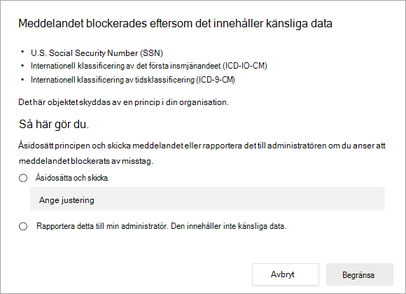
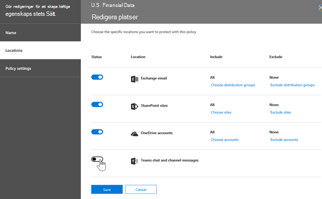

# Skydd mot dataförlust och Microsoft TeamsData loss prevention and Microsoft Teams

> [!NOTE]
> Funktioner för dataförlustskydd har nyligen lagts till i Microsoft Teams chatt- och kanalmeddelanden för användare som är licensierade för Office 365 E5/A5, Microsoft 365 E5/A5, Microsoft 365 Information Protection and Governance eller Office 365 Advanced Compliance.Data loss prevention capabilities were recently added to Microsoft Teams chat and channel messages for users licensed for Office 365 E5/A5, Microsoft 365 E5/A5, Microsoft 365 Information Protection and Governance or Office 365 Advanced Compliance. Office 365 och Microsoft 365 E3 DLP-skydd för SharePoint Online, OneDrive och Exchange Online.Office 365 and Microsoft 365 E3 include DLP protection for SharePoint Online, OneDrive, and Exchange Online. Det omfattar även filer som delas via Teams eftersom Teams använder SharePoint Online och OneDrive för att dela filer.This also includes files that are shared through Teams because Teams uses SharePoint Online and OneDrive to share files.
Stöd för DLP-skydd i Teams chatt kräver E5.Support for DLP protection in Teams Chat requires E5.
Mer information om licenskrav finns i [licensvägledning Microsoft 365 Tenant-Level Services Licensing Guidance](/office365/servicedescriptions/microsoft-365-service-descriptions/microsoft-365-tenantlevel-services-licensing-guidance).To learn more about licensing requirements, see [Microsoft 365 Tenant-Level Services Licensing Guidance](/office365/servicedescriptions/microsoft-365-service-descriptions/microsoft-365-tenantlevel-services-licensing-guidance).

## Översikt över DLP för Microsoft TeamsOverview of DLP for Microsoft Teams

Nyligen [utökades funktioner för skydd](dlp-learn-about-dlp.md) mot dataförlust med funktioner för Microsoft Teams och kanalmeddelanden, **inklusive meddelanden i privata kanaler.**Recently, [data loss prevention](dlp-learn-about-dlp.md) capabilities were extended to include Microsoft Teams chat and channel messages, **including private channel messages**. 

> [!IMPORTANT]
> DLP gäller för närvarande endast för de faktiska meddelandena i chatten eller kanaltråden.DLP currently applies only to the actual messages in the chat or channel thread. Aktivitetsmeddelanden – som innehåller en kort förhandsgranskning av meddelanden och visas  baserat på en användares meddelandeinställningar – ingår inte i Teams DLP för stunden.Activity notifications -- which include a short message preview and appear based on a user's notification settings -- are **not** included in Teams DLP at this time. Känslig information som finns i den del av meddelandet som visas i förhandsgranskningen fortsätter att visas i meddelandet även efter att DLP-principen har tillämpats och tagit bort känslig information i själva meddelandet.Any sensitive information present in the part of the message that appears in the preview will remain visible in the notification even after the DLP policy has been applied and removed sensitive information the message itself.

Om din organisation har DLP kan du nu definiera principer som hindrar personer från att dela känslig information i en Microsoft Teams-kanal eller chattsession.If your organization has DLP, you can now define policies that prevent people from sharing sensitive information in a Microsoft Teams channel or chat session. Här är några exempel på hur skyddet fungerar:Here are some examples of how this protection works:

- **Exempel 1: Skydda känslig information i meddelanden**.**Example 1: Protecting sensitive information in messages**. Anta att någon försöker dela känslig information i en Teams eller kanal med gäster (externa användare).Suppose that someone attempts to share sensitive information in a Teams chat or channel with guests (external users). Om en DLP-princip har definierats för att förhindra detta, tas meddelanden med känslig information som skickas till externa användare bort.If you have a DLP policy defined to prevent this, messages with sensitive information that are sent to external users are deleted. Det sker automatiskt, och inom några sekunder, beroende på hur DLP-principen har konfigurerats.This happens automatically, and within seconds, according to how your DLP policy is configured.

    > [!NOTE]
    > DLP för Microsoft Teams blockerar känsligt innehåll när det delas Microsoft Teams användare som har:DLP for Microsoft Teams blocks sensitive content when shared with Microsoft Teams users who have: - [gäståtkomst](/MicrosoftTeams/guest-access) i team och kanaler; eller- [guest access](/MicrosoftTeams/guest-access) in teams and channels; or - [extern åtkomst](/MicrosoftTeams/manage-external-access) i möten och chattsessioner.- [external access](/MicrosoftTeams/manage-external-access) in meetings and chat sessions. 
DLP för externa chattsessioner fungerar bara om både avsändaren och mottagaren är i Teams och använder [Microsoft Teams intern federation.](/microsoftteams/manage-external-access)DLP for external chat sessions will only work if both the sender and the receiver are in Teams Only mode and using [Microsoft Teams native federation](/microsoftteams/manage-external-access). DLP för Teams inte blockera meddelanden i [interop](/microsoftteams/teams-and-skypeforbusiness-coexistence-and-interoperability#interoperability-of-teams-and-skype-for-business) med Skype för företag eller icke-ursprungliga federerade chattsessioner.DLP for Teams does not block messages in [interop](/microsoftteams/teams-and-skypeforbusiness-coexistence-and-interoperability#interoperability-of-teams-and-skype-for-business) with Skype for Business or non-native federated chat sessions.

- **Exempel 2: Skydda känslig information i dokument**.**Example 2: Protecting sensitive information in documents**. Anta att någon försöker dela ett dokument med gäster i en Microsoft Teams kanal eller chatt, och att dokumentet innehåller känslig information.Suppose that someone attempts to share a document with guests in a Microsoft Teams channel or chat, and the document contains sensitive information. Om en DLP-princip har definierats för att förhindra det öppnas inte dokumentet för dessa användare.If you have a DLP policy defined to prevent this, the document won't open for those users. Observera att i det här fallet måste DLP-principen innehålla SharePoint och OneDrive för att skyddet ska vara på plats.Note that in this case, your DLP policy must include SharePoint and OneDrive in order for protection to be in place. (Det här är ett exempel på DLP för SharePoint som visas i Microsoft Teams och kräver därför att användarna är licensierade för Office 365 DLP (ingår i Office 365 E3), men inte kräver att användarna är licensierade för Office 365 Advanced Compliance.)(This is an example of DLP for SharePoint that shows up in Microsoft Teams, and therefore requires that users are licensed for Office 365 DLP (included in Office 365 E3), but does not require users to be licensed for Office 365 Advanced Compliance.)

## Principtips hjälper till att utbilda användarePolicy tips help educate users

På liknande sätt som DLP fungerar i [Exchange, Outlook, Outlook](data-loss-prevention-policies.md#policy-evaluation-in-exchange-online-outlook-and-outlook-on-the-web)på webben [, SharePoint Online, OneDrive för företag-webbplatser](data-loss-prevention-policies.md#policy-evaluation-in-onedrive-for-business-and-sharepoint-online-sites)och Office-skrivbordsklienter visas principtips när en åtgärd står i konflikt med en DLP-princip. Similar to how DLP works in [Exchange, Outlook, Outlook on the web](data-loss-prevention-policies.md#policy-evaluation-in-exchange-online-outlook-and-outlook-on-the-web), [SharePoint Online, OneDrive for Business sites](data-loss-prevention-policies.md#policy-evaluation-in-onedrive-for-business-and-sharepoint-online-sites), and [Office desktop clients](data-loss-prevention-policies.md#policy-evaluation-in-the-office-desktop-programs), policy tips appear when an action conflicts with a DLP policy. Här är ett exempel på ett principtips:Here's an example of a policy tip:

I det här fallet försökte avsändaren dela ett personnummer i en Microsoft Teams kanal.In this case, the sender attempted to share a social security number in a Microsoft Teams channel. Länken **Vad kan jag göra?** öppnar en dialogruta med alternativ för att avsändaren ska kunna lösa problemet.The **What can I do?** link opens a dialog box that provides options for the sender to resolve the issue. Observera att i det här fallet kan avsändaren välja att åsidosätta principen eller meddela en administratör att granska och lösa den.Notice that in this case, the sender can opt to override the policy, or notify an admin to review and resolve it.

I din organisation kan du välja att tillåta användare att åsidosätta en DLP-princip.In your organization, you can choose to allow users to override a DLP policy. När du konfigurerar DLP-principerna kan du använda standardprinciptipsen eller [anpassa principtipsen](#to-customize-policy-tips) för organisationen.And, when you configure your DLP policies, you can use the default policy tips, or [customize policy tips](#to-customize-policy-tips) for your organization.

Gå tillbaka till vårt exempel, där en avsändare delade ett personnummer i en Teams-kanal, så här såg mottagaren:Returning to our example, where a sender shared a social security number in a Teams channel, here's what the recipient saw:

> [!div class="mx-imgBorder"]
> 

### Så här anpassar du principtipsTo customize policy tips

Du måste ha tilldelats en roll som har behörighet att redigera DLP-principer för att kunna utföra den här uppgiften.To perform this task, you must be assigned a role that has permissions to edit DLP policies. Mer information finns i [Behörigheter.](data-loss-prevention-policies.md#permissions)To learn more, see [Permissions](data-loss-prevention-policies.md#permissions).

1. Gå till Säkerhets- & [https://protection.office.com](https://protection.office.com) () och logga in.Go to the Security & Compliance Center ([https://protection.office.com](https://protection.office.com)) and sign in.

2. Välj **Policy för skydd mot**  >  **dataförlust**.Choose **Data loss prevention** > **Policy**.

3. Välj en princip och välj **Redigera bredvid** **Principinställningar.**Select a policy, and next to **Policy settings**, choose **Edit**.

4. Skapa antingen en ny regel eller redigera en befintlig regel för principen.Either create a new rule, or edit an existing rule for the policy.

    > [!div class="mx-imgBorder"]
    > 

5. På fliken **Användarmeddelanden** väljer du Anpassa **e-posttexten** och/eller **Anpassa textalternativen för principtips.**On the **User notifications** tab, select **Customize the email text** and/or **Customize the policy tip text** options.

    > [!div class="mx-imgBorder"]
    >    

6. Ange den text som du vill använda för e-postaviseringar och/eller principtips och välj sedan **Spara**.Specify the text you want to use for email notifications and/or policy tips, and then choose **Save**.

7. På fliken **Principinställningar** väljer du **Spara**.On the **Policy settings** tab, choose **Save**.

Det kan ta ungefär en timme innan ändringarna fungerar via datacentret och synkroniseras med användarkonton.Allow approximately one hour for your changes to work their way through your data center and sync to user accounts.
 <!-- why are these syncing to user accounts? -->

## Lägga Microsoft Teams som plats i befintliga DLP-principerAdd Microsoft Teams as a location to existing DLP policies

Du måste ha tilldelats en roll som har behörighet att redigera DLP-principer för att kunna utföra den här uppgiften.To perform this task, you must be assigned a role that has permissions to edit DLP policies. Mer information finns i [Behörigheter.](data-loss-prevention-policies.md#permissions)To learn more, see [Permissions](data-loss-prevention-policies.md#permissions).

1. Gå till Säkerhets- & [https://protection.office.com](https://protection.office.com) () och logga in.Go to the Security & Compliance Center ([https://protection.office.com](https://protection.office.com)) and sign in.

2. Välj **Policy för skydd mot**  >  **dataförlust**.Choose **Data loss prevention** > **Policy**.

3. Välj en princip och titta på värdena under **Platser.**Select a policy, and look at the values under **Locations**. Om du **ser Teams chatt- och kanalmeddelanden** är allt klart.If you see **Teams chat and channel messages**, you're all set. Om du inte har det klickar du på **Redigera.**If you don't, click **Edit**.

    > [!div class="mx-imgBorder"]
    > 

4. I kolumnen **Status** aktiverar du principen för Teams **och kanalmeddelanden**.In the **Status** column, turn the policy on for **Teams chat and channel messages**.

    > [!div class="mx-imgBorder"]
    > 

5. Behåll **standardinställningen för** alla konton på fliken Välj **platser** eller välj Låt mig välja specifika platser .On the **Choose locations** tab, keep the default setting of all accounts, or select **Let me choose specific locations**. Du kan ange:You can specify:

    1. upp till 1 000 enskilda konton att inkludera eller exkluderaup to 1000 individual accounts to include or exclude
    1. distributionslistor och säkerhetsgrupper som ska inkluderas eller exkluderas.distribution lists and security groups to include or exclude. 
    <!-- 1. the shared mailbox of a shared channel. **This is a public preview feature.**--> 
    
6. Välj sedan **Nästa**.Then choose **Next**.

7. Klicka på **Spara**.Click **Save**.

Det kan ta ungefär en timme innan ändringarna fungerar via datacentret och synkroniseras med användarkonton.Allow approximately one hour for your changes to work their way through your data center and sync to user accounts.
<!-- again, why user accounts? -->

## Definiera en ny DLP-princip för Microsoft TeamsDefine a new DLP policy for Microsoft Teams

Du måste ha tilldelats en roll som har behörighet att redigera DLP-principer för att kunna utföra den här uppgiften.To perform this task, you must be assigned a role that has permissions to edit DLP policies. Mer information finns i [Behörigheter.](data-loss-prevention-policies.md#permissions)To learn more, see [Permissions](data-loss-prevention-policies.md#permissions).

1. Gå till Säkerhets- & [https://protection.office.com](https://protection.office.com) () och logga in.Go to the Security & Compliance Center ([https://protection.office.com](https://protection.office.com)) and sign in.

2. Välj **Policy för skydd mot**  >    >  **dataförlust + Skapa en princip.**Choose **Data loss prevention** > **Policy** > **+ Create a policy**.

3. Välj en [mall](data-loss-prevention-policies.md#dlp-policy-templates)och välj sedan **Nästa**.Choose a [template](data-loss-prevention-policies.md#dlp-policy-templates), and then choose **Next**.

    I vårt exempel har vi valt mallen U.S. Personally Identifiable Information Data.In our example, we chose the U.S. Personally Identifiable Information Data template.

    > [!div class="mx-imgBorder"]
    >  

4. På fliken **Namnge principen** anger du ett namn och en beskrivning för principen och väljer sedan **Nästa.**On the **Name your policy** tab, specify a name and description for the policy, and then choose **Next**.

5. Behåll **standardinställningen för** alla konton på fliken Välj **platser** eller välj Låt mig välja specifika platser .On the **Choose locations** tab, keep the default setting of all accounts, or select **Let me choose specific locations**. Du kan ange:You can specify:

    1. upp till 1 000 enskilda konton att inkludera eller exkluderaup to 1000 individual accounts to include or exclude
    1. distributionslistor och säkerhetsgrupper som ska inkluderas eller exkluderas.distribution lists and security groups to include or exclude. **Det här är en offentlig förhandsversionsfunktion.****This is a public preview feature.**
    <!-- 1. the shared mailbox of a shared channel. **This is a public preview feature.**-->  

    

    > [!NOTE]
    > Om du vill kontrollera att dokument som innehåller känslig information inte delas olämpligt i Teams kontrollerar du att **SharePoint-webbplatser** och **OneDrive-konton** är aktiverat tillsammans med Teams-chatt- och **kanalmeddelanden.**If you want to make sure documents that contain sensitive information are not shared inappropriately in Teams, make sure **SharePoint sites** and **OneDrive accounts** are turned on, along with **Teams chat and channel messages**.

6. På fliken **Principinställningar,** under **Anpassa** den typ av innehåll som du vill skydda, behåll de enkla standardinställningarna eller välj Använd avancerade inställningar och välj sedan **Nästa.**On the **Policy settings** tab, under **Customize the type of content you want to protect**, keep the default simple settings, or choose **Use advanced settings**, and then choose **Next**. Om du väljer avancerade inställningar kan du skapa eller redigera regler för principen.If you choose advanced settings, you can create or edit rules for your policy. (Om du behöver hjälp med detta kan du [gå till Enkla inställningar och avancerade inställningar](data-loss-prevention-policies.md#simple-settings-vs-advanced-settings).)(To get help with this, see [Simple settings vs. advanced settings](data-loss-prevention-policies.md#simple-settings-vs-advanced-settings).)

7.  Granska **inställningarna under** Vad vill du göra om vi hittar känslig **information?** på fliken Principinställningar.On the **Policy settings** tab, under **What do you want to do if we detect sensitive info?**, review the settings. (Här kan du välja att behålla standardprinciptips [och e-postaviseringar](use-notifications-and-policy-tips.md)eller anpassa dem.)(Here's where you can choose to keep default [policy tips and email notifications](use-notifications-and-policy-tips.md), or customize them.)

    > [!div class="mx-imgBorder"]
    > 

    När du är klar med granskningen eller redigeringsinställningarna väljer du **Nästa.**When you're finished reviewing or editing settings, choose **Next**.

8. På fliken **Principinställningar,** under Vill du aktivera principen eller testa saker **först?** väljer du om du vill aktivera [principen,](data-loss-prevention-policies.md#roll-out-dlp-policies-gradually-with-test-mode)testar den först eller behåller den inaktiverad för tillfället och väljer sedan **Nästa.**On the **Policy settings** tab, under **Do you want to turn on the policy or test things out first?**, choose whether to turn the policy on, [test it first](data-loss-prevention-policies.md#roll-out-dlp-policies-gradually-with-test-mode), or keep it turned off for now, and then choose **Next**.

    > [!div class="mx-imgBorder"]
    > 

9. Granska **inställningarna för den nya** principen på fliken Granska dina inställningar.On the **Review your settings** tab, review the settings for your new policy. Välj **Redigera för** att göra ändringar.Choose **Edit** to make changes. När du är klar väljer du **Skapa**.When you're finished, choose **Create**.

Det kan ta ungefär en timme innan den nya principen fungerar via datacentret och synkroniseras med användarkonton.Allow approximately one hour for your new policy to work its way through your data center and sync to user accounts.

## Förhindra extern åtkomst till känsliga dokumentPrevent external access to sensitive documents

För att säkerställa SharePoint dokument som innehåller känslig information inte kan nås av externa gäster, antingen från SharePoint eller Teams, markerar du följande:To ensure that SharePoint documents that contain sensitive information cannot be accessed by external guests either from SharePoint or Teams by default, select the following:

- Du kan säkerställa att dokument skyddas tills DLP genomsöker och markerar dem som säkra att dela genom att markera [nya filer som känsliga som standard.](/sharepoint/sensitive-by-default)You can ensure that documents are protected until DLP scans and marks them as safe to share by [marking new files as sensitive by default](/sharepoint/sensitive-by-default).

- Rekommenderad DLP-principstrukturRecommended DLP policy structure

    - **Villkor****Conditions**
        - Innehållet innehåller någon av följande typer av känslig information: [Markera alla som gäller]Content contains any of these sensitive information types: [Select all that applies]
        
        - Innehåll delas från Microsoft 365 med personer utanför organisationenContent is shared from Microsoft 365 with people outside my organization
        
          > [!div class="mx-imgBorder"]
          > 

    - **Åtgärder****Actions**
        - Begränsa åtkomst till innehållet för externa användareRestrict access to the content for external users
        
        - Meddela användarna via e-post- och principtipsNotify users with email and policy tips
        
        - Skicka incidentrapporter till administratörenSend incident reports to the Administrator
        
        > [!div class="mx-imgBorder"]
        > 

DLP-princip används när du försöker dela ett dokument i ett SharePoint som innehåller känslig information med en extern gäst:DLP policy in action when attempting to share a document in SharePoint that contains sensitive information with an external guest:

> [!div class="mx-imgBorder"]
> 

DLP-princip i praktiken när gäst försöker öppna ett dokument i Teams med extern blockering:DLP policy in action when guest attempts to open a document in Teams with block external:

> [!div class="mx-imgBorder"]
> 

## Relaterade artiklarRelated articles

[Skapa, testa och justera en DLP-principCreate, test, and tune a DLP policy](create-test-tune-dlp-policy.md)

[Skicka e-postaviseringar och visa principtips för DLP-principerSend email notifications and show policy tips for DLP policies](use-notifications-and-policy-tips.md)
