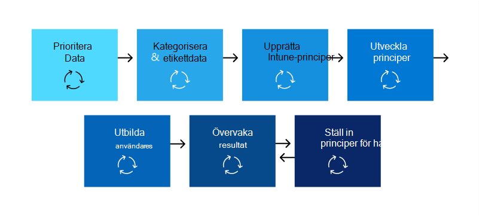
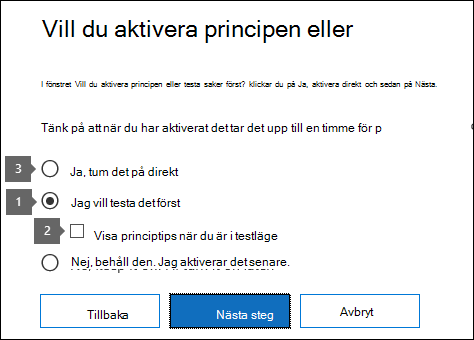

# Planera för dataförlustskydd (DLP)

Alla organisationer planerar för och implementerar dataförlustskydd på olika sätt, eftersom varje organisations affärsbehov, mål, resurser och situation är unika för dem. Det finns dock element som är gemensamma för alla lyckade DLP-implementeringar. I den här artikeln visas de bästa metoderna som används av organisationer i deras DLP-planering.

## Flera startpunkter

Många organisationer väljer att implementera DLP för att följa olika myndighets- eller branschföreskrifter. Till exempel EU:s allmänna dataskyddsförordning (GDPR), eller HEALTH Insurance Portability and Accountability Act (HIPAA), eller California Consumer Privacy Act (CCPA). De implementerar också skydd mot dataförlust för att skydda deras immateriella egendom. Men utgångspunkten och målet på DLP-resan varierar. 

Organisationer kan starta sin DLP-resa:

- från plattformsfokus, t.Teams vill skydda information i chatt- och kanalmeddelanden eller på Windows 10 enheter
- att veta vilken känslig information de vill prioritera för att skydda, som hälsojournaler, och går direkt till att definiera principer för att skydda det
- utan att veta vad den känsliga informationen är, var den finns och vem som gör vad med den, så att de börjar med identifiering och kategorisering och använder en mer metodisk metod
- utan att veta vad deras känsliga information är eller var den är, eller vem som gör vad med den, men de kommer att gå direkt till att definiera principer och använda dessa resultat som en utgångspunkt och sedan förfina sina principer därifrån
- i vetskapen att de behöver implementera hela Microsoft 365 informationsskyddsstacken och har för avsikt att ha en mer långsiktiga, metodisk metod

Det här är bara några exempel på hur kunder kan hantera DLP, och det spelar ingen roll var du börjar. Microsoft 365 DLP är flexibelt nog att tillgodose olika typer av informationsskyddsresor från början till en fullständigt fungerande strategi för skydd mot dataförlust. 

## Översikt över planeringsprocessen

I [Lär dig mer om skydd mot dataförlust](dlp-learn-about-dlp.md#learn-about-data-loss-prevention) introduceras tre olika aspekter av [DLP-planeringsprocessen.](dlp-learn-about-dlp.md#plan-for-dlp) Här får du mer information om de element som är gemensamma för alla DLP-planer.

### Identifiera intressenter

När de implementeras kan DLP-principer tillämpas i stora delar av organisationen. IT-utvecklar inte en bred plan på egen hand utan negativa konsekvenser. Du måste identifiera de intressenter som kan:

- beskriver de bestämmelser, lagar och branschstandarder din organisation omfattas av
- kategorier av känsliga objekt som ska skyddas
- de affärsprocesser som de används i
- riskbeteendet som bör begränsas
- prioritera vilka data som ska skyddas först utifrån objektens känslighet och den risk som ingår
- skapa en disposition för granskning och åtgärd av DLP-principen 
 
I allmänhet brukar dessa behov vara 85 % regel- och efterlevnadsskydd och 15 % immateriellt egendomsskydd. Här är några förslag på roller som ska ingå i planeringsprocessen:

- Efterlevnadsansvariga
- Chefsriskansvarig
- Juridiska sansvariga
- Säkerhets- och efterlevnadsansvariga
- Företagsägare för dataobjekten
- Företagsanvändare
- IT

### Beskriva kategorier av känslig information som ska skyddas

Intressenterna beskriver sedan vilka kategorier av känslig information som ska skyddas och vilken affärsprocess de används i. DLP definierar Microsoft 365 till exempel följande kategorier:

- Ekonomi 
- Information om hälsa och hälsa
- Sekretess
- Anpassad

Intressenterna kan identifiera den känsliga informationen som "Vi är databehandlare, så vi måste implementera sekretesskydd för data ämne och ekonomisk information".

 
  <!-- The business process is important as it informs the ‘data at rest’, ‘data in transit’, ‘data in use’ aspect of DLP planning and who should be sharing the items and who should not.-->

### Ange mål och strategi

När du har identifierat dina intressenter och vet vilken känslig information som behöver skyddas och var den används kan intressenterna ange sina skyddsmål och IT-utvecklar en implementeringsplan. 

 <!--
### Discovery
 for the locations (DLP workloads) of these types of items.  (mapping DLP locations and data at rest, data in transit, data in use)

### IT can start coding test policies
start small and always in test mode. Note that DLP policies can feed into insider risk.

### Business process owners help with tuning
 false positive/false negative results and fitting DLP into their business processes.

-->

### Ange implementeringsplan

Din implementeringsplan bör omfatta:

- Mappa ut din starttillstånd och önskade sluttillstånd och stegen för att komma från en till en annan
- hur du kommer att hantera identifiering av känsliga objekt
- policyplanering och i vilken ordning de ska implementeras
- hur du ska hantera eventuella krav
- planera för hur principer först testas innan de flyttas till tillämpning
- hur du utbildar slutanvändarna
- hur du ska testa och finjustera principerna
- hur du kommer att granska och uppdatera din strategi för skydd mot dataförlust baserat på ändring av regelverk, lagstiftning, branschstandard eller immateriell egendomsskydd och affärsbehov

#### Mappa ut sökväg från början till önskat slutläge

Det är viktigt att dokumentera hur organisationen ska komma från starttillståndet till önskat slutläge för att kommunicera med dina intressenter och ange projektets omfattning. Här är en uppsättning steg som ofta används för att distribuera DLP. Du vill ha mer information än så, men du kan använda den för att skapa en ram för DLP-införandet.

#### Identifiering av känsliga objekt

Det finns flera sätt att upptäcka enskilda känsliga objekt och var de finns. Du kanske redan har känslighetsetiketter distribuerade eller så har du kanske bestämt dig för att använda en bred DLP-princip för alla platser som bara identifierar och granskar objekt. Mer information finns i [Känna till dina data.](information-protection.md#know-your-data)

#### Principplanering

När du börjar använda DLP kan du använda de här frågorna för att fokusera arbetet med policydesign och -implementering.

##### Vilka lagar, bestämmelser och branschstandarder måste din organisation följa?

Eftersom många organisationer använder DLP för att uppfylla regelverken är det en naturlig utgångspunkt att planera din DLP-implementering för att besvara den här frågan. Men som IT-implementerare är du förmodligen inte positionerad att besvara den. Besvaras av din juridiska grupp och företagsledare. 
 
**Exempel** Din organisation omfattas av Storbritannien. finansiella bestämmelser.

##### Vilka känsliga objekt måste skyddas från läckage i din organisation?

När din organisation vet var det står när det gäller regelefterlevnadsbehov kommer du att få en uppfattning om vilka känsliga objekt som behöver skyddas mot läckage och hur du vill prioritera principimplementering för att skydda dem. Det hjälper dig att välja de lämpligaste DLP-principmallarna. Microsoft 365 levereras med förkonfigurerade DLP-mallar för ekonomi, sjukvård och hälsa, sekretess och du kan skapa egna med hjälp av mallen Anpassad. När du utformar och skapar dina faktiska DLP-principer hjälper det dig även att välja rätt typ av känslig information om du vet svaret på [den här frågan.](sensitive-information-type-learn-about.md#learn-about-sensitive-information-types)

**Exempel** För att komma igång snabbt väljer du `U.K. Financial Data` principmallen, som innehåller `Credit Card Number` typerna , och känslig `EU Debit Card Number` `SWIFT Code` information. 

##### Var finns de känsliga objekten och vilka affärsprocesser ingår de i?

Objekten som innehåller organisationens känsliga information används varje dag under hela verksamheten. Du behöver veta var förekomster av den känsliga informationen kan inträffa och vilka affärsprocesser de används i. Det hjälper dig att välja rätt platser att tillämpa DLP-principerna på. Microsoft 365 DLP-principer tillämpas på platser:

- Exchange-e-post
- SharePoint webbplatser
- OneDrive-konton
- Teams chatt- och kanalmeddelanden
- Windows 10 Enheter
- Microsoft Cloud App Security
- Lokala lagringsningar

**Exempel** Organisationens interna granskare spårar en uppsättning kreditkortsnummer. De har ett kalkylblad av dem på en säker SharePoint webbplats. Flera av de anställda gör kopior och sparar dem på sin arbetswebbplats OneDrive för företag som synkroniseras till deras Windows 10 enhet. En av dem klistrar in en lista med 14 av dem i ett e-postmeddelande och försöker skicka den till externa granskare för granskning. Det är bra att tillämpa principen på webbplatsen för SharePoint säkerhet, alla interna granskare OneDrive för företag-konton, deras Windows 10-enheter och Exchange e-post.

##### Vad är din organisation för att det ska äcka upp sig?

Olika grupper i organisationen kan ha olika vyer på vad som är acceptabel nivå för känsligt objektläckning och vad som inte gör det. Att uppnåing av nollläckning kan komma till en för hög kostnad för företaget.

**Exempel** Både din organisations säkerhetsgrupp och den juridiska gruppen anser att det inte ska finnas någon delning av kreditkortsnummer med någon utanför organisationen och att det inte ska delas några läckage. Men som en del av den vanliga granskningen av kreditkortsnummer måste de interna granskarna dela vissa kreditkortsnummer med externa granskare. Om DLP-principen förhindrar all delning av kreditkortsnummer utanför organisationen kommer det att ske en betydande störning i affärsprocessen och ytterligare kostnader för att minimera avbrottet för att de interna granskarna ska kunna slutföra uppföljningen. Den extra kostnaden är inte godtagbar för ledningsgruppen. Det måste finnas en intern konversation för att det ska gå att avgöra en godtagbar nivå för läckage. När det är bestämt kan principen tillhandahålla undantag för att vissa personer ska kunna dela informationen eller så kan den tillämpas i granskningsläge.

#### Planering för förutsättningar

Innan du kan övervaka vissa DLP-platser finns det krav som måste uppfyllas. Mer information **finns i avsnitten Innan** du börjar av:

- [Kom igång med lokal skanner för dataförlustskydd (förhandsversion)](dlp-on-premises-scanner-get-started.md#before-you-begin)
- [Komma igång med dataförlustskydd för slutpunkter](endpoint-dlp-getting-started.md#before-you-begin)
- [Komma igång med Microsofts efterlevnadstillägg (förhandsversion)](dlp-chrome-get-started.md#before-you-begin)
- [Använda principer för skydd mot dataförlust för molnappar som inte kommer från Microsoft (förhandsversion)](dlp-use-policies-non-microsoft-cloud-apps.md#before-you-begin)

#### Principdistribution

När du skapar DLP-principerna bör du överväga att lansera dem gradvis för att bedöma deras påverkan och testa deras effektivitet innan du helt tillämpar dem. Du vill t.ex. inte att en ny DLP-princip oavsiktligt ska blockera åtkomst till tusentals dokument eller bryta en befintlig affärsprocess.
  
Om du skapar DLP-principer med stor potential rekommenderar vi att du följer den här ordningen:
  
1. **Börja i testläge utan Tips** och använd sedan DLP-rapporter och eventuella incidentrapporter för att bedöma påverkan. Du kan använda DLP-rapporter för att visa antal, plats, typ och allvarlighetsgrad för principmatchningar. Du kan finjustera principerna efter behov baserat på resultaten. I testläge påverkar inte DLP-principerna produktiviteten för personer som arbetar i organisationen. Använd även det här steget för att testa arbetsflödet för granskning av DLP-händelser och åtgärda problem.
    
2. **Flytta till testläge** med meddelanden och princip Tips så att du kan börja lära användarna om dina efterlevnadsprinciper och förbereda dem för de principer som ska tillämpas. Det är praktiskt att ha en länk till sidan organisationspolicy med mer information om principen i principtipset. I det här läget kan du också be användarna att rapportera falska positiva resultat så att du kan ytterligare förfina principerna. När du har förtroende för att policyprogrammets resultat överensstämmer med de som intressenterna hade i åtanke kan du gå vidare till det här steget. 
    
3. **Börja tillämpa principerna fullt ut** så att åtgärderna i reglerna tillämpas och att innehållet skyddas. Fortsätt att övervaka DLP-rapporterna och eventuella incidentrapporter och -aviseringar för att se till att du får de resultat du vill ha. 

    

    Du kan inaktivera en DLP-princip när som helst, vilket påverkar alla regler i principen. Men varje regel kan också inaktiveras individuellt genom att växla status i regelredigeraren.

    

    Du kan också ändra prioriteten för flera regler i en princip. Det gör du genom att öppna en princip för redigering. På en rad för en regel väljer du ellipsen (**...**) och väljer sedan ett alternativ, till exempel Flytta **ned** eller **Bring to last**.

    

#### Utbildning för slutanvändare

När en DLP-princip utlöses kan du konfigurera principerna så att de skickar e-postmeddelanden och visar principtips för [DLP-principer](use-notifications-and-policy-tips.md#send-email-notifications-and-show-policy-tips-for-dlp-policies) för administratörer och slutanvändare. Även om dina principer fortfarande är i testläge och innan de är inställda på att framtvinga en blockering är principtips användbara sätt att öka medvetenheten om riskfyllda beteenden på känsliga objekt och utbilda användarna för att undvika dessa beteenden i framtiden.  

#### Granska DLP-krav och uppdateringsstrategi

De bestämmelser, lagar och branschstandarder som din organisation måste följa kommer att ändras med tiden och även affärsmålen för DLP. Se till att ta med regelbundna granskningar av alla dessa områden så att din organisation håller sig inom efterlevnad och din DLP-implementering fortsätter att uppfylla dina affärsbehov.

## Metoder för distribution

|Beskrivning av kundbehov  | metod  |
|---------|---------|
|**Contoso Bank** är i en hårt reglerad bransch och har många olika typer av känsliga objekt på många olika platser.   – vet vilka typer av känslig information som har högsta prioritet.   - måste minimera driftstörningar när principer distribueras.   – har IT-resurser och kan anlita experter som kan hjälpa till med att planera, utforma distribution   – har ett Premier-supportavtal med Microsoft| – Ta dig tid att förstå vilka bestämmelser de måste följa och hur de kommer att följa.   -Ta dig tid att förstå det bättre tillsammans värdet i Microsoft 365 informationsskyddsstacken   - Utveckla känslighetsetikettsschemat för prioriterade objekt och tillämpa   - Engagera ägare av företagsprocess  - Design-/kodprinciper, driftsättning i testläge, utbilda användare  - upprepa|
|**TailSpin Toys** vet inte vad de har eller var de finns och har liten eller inget resurs djup. De använder Teams, OneDrive för företag och Exchange omfattande.     |– Börja med enkla principer för de prioriterade platserna.  - Övervaka vad som identifieras  - Tillämpa känslighetsetiketter i enlighet med detta  - Förfina principer, utbilda användare       |
|**Fabrikam** är en liten startup och vill skydda sin immateriella egendom, och måste röra sig snabbt. De är beredd att ägna vissa resurser åt det, men de har inte råd att anlita externa experter.  - Känsliga objekt är alla i Microsoft 365 OneDrive för företag/SharePoint  - Införande av OneDrive för företag och SharePoint långsamt, anställda/skugga IT-använder DropBox och Google Drive för att dela/lagra objekt  – värdehastigheten för anställda över dataskyddsgren  - Kunden splurar och köper alla 18 anställda nya Windows 10 enheter     |– dra nytta av standardprincipen för DLP i Teams  - Använd en begränsad standardinställning för SharePoint objekt  - Distribuera principer som förhindrar extern delning  - Distribuera principer till prioriterade platser  - Distribuera principer på Windows 10 enheter  - Blockera överföringar till OneDrive för företag molnlagring      |

<!--

## Planning for workloads

### Exchange

### SharePoint

### OneDrive for Business

### Teams

### Windows 10 Devices

### Microsoft Cloud App Security (MCAS)

### On-premises Scanner
-->

## Se även
- [Mer information om dataförlustskydd](dlp-learn-about-dlp.md#learn-about-data-loss-prevention)
