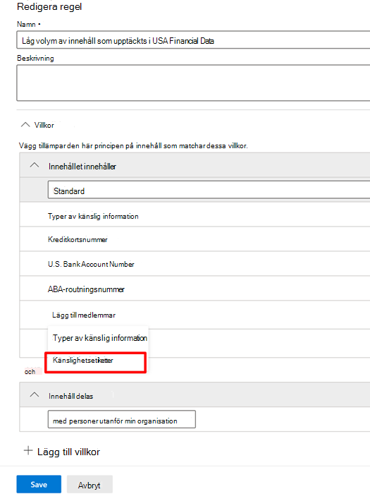

# Använda känslighetsetiketter som villkor i DLP-principerUse sensitivity labels as conditions in DLP policies

Du kan använda [känslighetsetiketter](sensitivity-labels.md) som ett villkor i DLP-principerna för dessa platser:You can use [sensitivity labels](sensitivity-labels.md) as a condition in DLP policies for these location:

- E-postmeddelanden från Exchange OnlineExchange Online email messages
- SharePoint OnlineSharePoint Online
- OneDrive för företag-webbplatserOneDrive for Business sites
- Windows 10-enheterWindows 10 devices

Känslighetsetiketter visas som ett alternativ i listan **Innehåll innehåller**.Sensitivity labels appear as an option in the **Content contains** list.

> [!div class="mx-imgBorder"]
> 

> [!IMPORTANT]
> **Känslighetsetiketter** som ett villkor är inte tillgängligt om du har markerat **Teams chatt- och kanalmeddelanden** som en plats för att tillämpa DLP-principen.**Sensitivity Labels** as a condition will not be available if you have selected **Teams chat and channel messages** as a location to apply the DLP policy.

## Objekt, scenarier och principtips som stödsSupported items, scenarios, and policy tips

Du kan använda känslighetsetiketter som villkor för de här objekten och i dessa scenarier.You can use sensitivity labels as conditions on these items and in these scenarios.

### Objekt som stöds:Supported items

|TjänstService  |ObjekttypItem type  |Tillgängligt för principtipsAvailable to policy tip  |VerkställbarEnforceable  |
|---------|---------|---------|---------|
|ExchangeExchange    |e-postmeddelandeemail message         |jayes         |jayes         |
|ExchangeExchange    |e-postbilagaemail attachment         |nejno         |ja \*yes \*         |
|SharePoint OnlineSharePoint Online     |object i SharePoint Onlineitems in SharePoint Online         |jayes         |jayes         |
|OneDrive för företagOneDrive for Business     |objektitems         |jayes         |jayes         |
|TeamsTeams     |Teams och kanalmeddelandenTeams and channel messages         |ej tillämpligtnot applicable         |ej tillämpligtnot applicable         |
|TeamsTeams     |bifogade filerattachments         |ja \*\*yes \*\*         |ja \*\*yes \*\*         |
|Windows 10-enheterWindows 10 devices     |objektitems         |jayes         |jayes         |
|MCAS (förhandsversion)MCAS (preview) |objektitems         |jayes         |jayes         |

\* DLP-identifiering av e-postbilagor med känslighetsetiketter stöds endast för Office-filtyper.\* DLP detection of sensitivity labeled email attachments are supported for Office file types only.

\*\* Bifogade filer som skickas i Teams över 1:1 chatt eller kanaler laddas automatiskt upp till OneDrive för företag och SharePoint.\*\* Attachments sent in Teams over 1:1 chat or channels are automatically uploaded to OneDrive for Business and SharePoint. Så om SharePoint Online eller OneDrive för företag ingår som platser i DLP-principen inkluderas etiketterade bifogade filer som skickas i Teams automatiskt inom ramen för detta villkor.So if SharePoint Online or OneDrive for Business are included as locations in your DLP policy, then labeled attachments sent in Teams will be automatically included in the scope of this condition. Teams som en plats behöver inte väljas i DLP-principen.Teams as a location does not need to be selected in the DLP policy.

### Scenarier som stödsSupported scenarios

- DLP-administratören kan se en lista över alla känslighetsetiketter i klientorganisationen när de väljer att inkludera en eller flera känslighetsetiketter som ett villkor.DLP Admin will be able to see a list of all sensitivity labels in the tenant when they choose to include one or more sensitivity labels as a condition.

- Användningen av känslighetsetiketter som ett villkor stöds i alla arbetsbelastningar som anges i supportmatrisen ovan.Using sensitivity labels as a condition is supported across all workloads as indicated in the support matrix above.

- DLP-principtips kommer att fortsätta att visas över arbetsbelastningar (förutom Outlook Win32) för DLP-principer som innehåller känslighetsetiketten som ett villkor.DLP policy tips will continue to be shown across workloads (except Outlook Win32) for DLP policies which contain sensitivity label as a condition.

- Känslighetsetiketter visas också som en del av e-postmeddelandet för incidentrapporten om en DLP-princip med känslighetsetiketter matchas som ett villkor.Sensitivity labels will also appear as a part of the incident report email if a DLP policy with sensitivity label as a condition is matched.

- Information om känslighetsetiketter visas också i granskningsloggen för DLP-regeln för en matchning av DLP-princip som innehåller känslighetsetiketten som ett villkor.Sensitivity label details will also be shown in the DLP rule match audit log for a DLP policy match which contains sensitivity label as a condition.

### Principtips som stödsSupport policy tips

|ArbetsbelastningWorkload  |Principtips som stöds/inte stödsPolicy tips supported/not supported  |
|---------|---------|
|OWAOWA |    stödssupported     |
|Outlook Win 32Outlook Win 32    |  stöds intenot supported       |
|SharePointSharePoint   |   stödssupported      |
|OneDrive för företagOneDrive for Business    |    stödssupported     |
|slutpunktsenheterendpoint devices   |  stöds intenot supported       |
