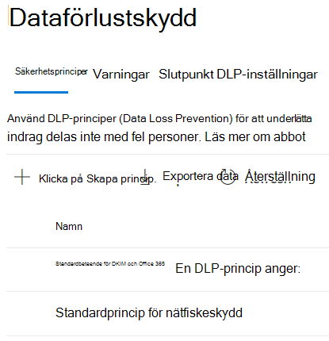

# Läs mer om standardprincipen för dataförlustskydd i Microsoft Teams (förhandsversion)Learn about the default data loss prevention policy in Microsoft Teams (preview)

[Funktioner för skydd mot](dlp-learn-about-dlp.md) dataförlust har utökats så att de omfattar Microsoft Teams och kanalmeddelanden, inklusive meddelanden i privata kanaler.[Data loss prevention](dlp-learn-about-dlp.md) capabilities have been extended to include Microsoft Teams chat and channel messages, including private channel messages. Som en del av den här versionen skapade vi en standard-DLP-princip för Microsoft Teams för första gången kunder till efterlevnadscenter.As a part of this release, we created a default DLP policy for Microsoft Teams for first-time customers to Compliance center.

## Gäller förApplies to

Alla klientorganisationar som är licensierade med en eller flera av licenserna nedan och har aktiva Teams användareAny tenant who is licensed with one or more of the below licenses and have active Teams users
 
- ME5ME5, 
- MA5,MA5, 
- Efterlevnad i E5/A5E5/A5 Compliance, 
- IP+GIP+G, 
- OE5OE5, 
- O365 Advanced ComplianceO365 Advanced Compliance 
- EMS E5EMS E5

## Vad innebär standardprincipen?What does the default policy do?

Standardprincipen för DLP för Teams spårar alla kreditkortsnummer som delas internt och externt i organisationen.The default DLP policy for Teams tracks all the credit card numbers shared internally and externally to the organization. Den här principen är som standardinställning för alla användare av klientorganisationen.This policy is on by default for all users of the tenant. Inga principtips skapas för slutanvändarna, men en aviseringshändelse skapas och ett meddelande med låg allvarlighetsgrad utlöses för administratören (som läggs till i principen).It does not generate any policy tips for end users but does generate an Alert event and also triggers a low severity email to the admin (added in the policy). Administratören kan visa aktiviteterna och redigera policyinformationen genom att logga in på efterlevnadscentret.Administrator can view the activities and edit the policies details by logging into the Compliance center.

Administratörer kan visa den här principen i [efterlevnadscentret >](https://compliance.microsoft.com/compliancesettings) sidan Principer för skydd mot dataförlust.Admins can view this policy in the [Compliance center](https://compliance.microsoft.com/compliancesettings) > Data Loss prevention policies page.

> [!div class="mx-imgBorder"]
> 

## Redigera eller ta bort standardprincipenEdit or delete the default policy

Om [du vill redigera standardprincipen för bättre prestanda eller ta bort den](create-test-tune-dlp-policy.md#tune-a-dlp-policy)använder du bara ett konto med behörigheter för **DLP-efterlevnadshantering.**To [edit the default policy for better performance or to delete it](create-test-tune-dlp-policy.md#tune-a-dlp-policy), just use an account with **DLP Compliance Management** permissions. Mer information finns i [Behörigheter](create-test-tune-dlp-policy.md#permissions).For more information, see, [Permissions](create-test-tune-dlp-policy.md#permissions).

