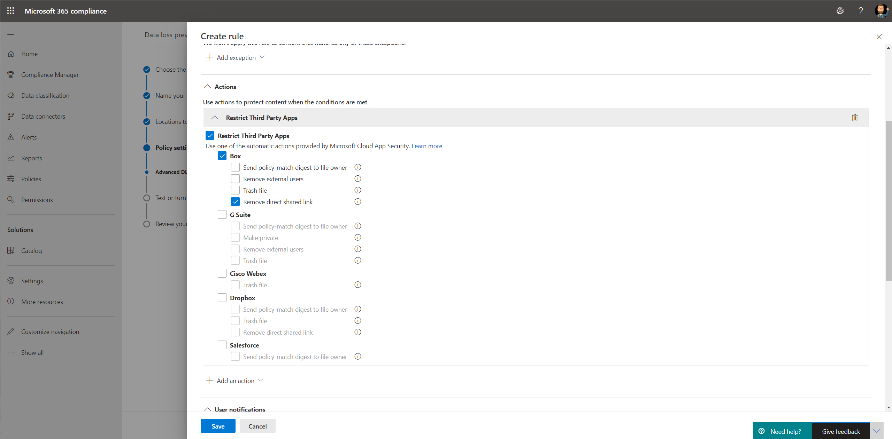

# Använda principer för skydd mot dataförlust för molnappar som inte kommer från Microsoft (förhandsversion)Use data loss prevention policies for non-Microsoft cloud apps (preview)

Principer för skydd mot dataförlust (DLP) för icke-Microsoft-molnappar är en del Microsoft 365 DLP-paketet med funktioner. med dessa funktioner kan du identifiera och skydda känsliga objekt i Microsoft 365 tjänster.Data loss prevention (DLP) policies to non-Microsoft cloud apps are part of the Microsoft 365 DLP suite of features; using these features, you can discover and protect sensitive items across Microsoft 365 services. Mer information om alla Microsoft DLP-erbjudanden finns i [Läs mer om skydd mot dataförlust.](dlp-learn-about-dlp.md)For more information about all Microsoft DLP offerings, see [Learn about data loss prevention](dlp-learn-about-dlp.md).

Du kan använda DLP-principer till andra molnappar än Microsoft för att övervaka och identifiera när känsliga objekt används och delas via andra molnappar än Microsoft.You can use DLP policies to non-Microsoft cloud apps to monitor and detect when sensitive items are used and shared via non-Microsoft cloud apps. Med de här principerna får du den synlighet och kontroll som du behöver för att säkerställa att de används och skyddas korrekt, och det hjälper till att förhindra riskabelt beteende som kan avslöja dem.Using these policies gives you the visibility and control that you need to ensure that they're correctly used and protected, and it helps prevent risky behavior that might compromise them.

## Innan du börjarBefore you begin

### Licensiering av SKU/prenumerationerSKU/subscriptions licensing

Innan du börjar använda DLP-principer för andra program än Microsoft-molnappar måste [Microsoft 365 din](https://www.microsoft.com/microsoft-365/compare-microsoft-365-enterprise-plans?rtc=1) prenumeration och eventuella tillägg.Before you start using DLP policies to non-Microsoft cloud apps, confirm your [Microsoft 365 subscription](https://www.microsoft.com/microsoft-365/compare-microsoft-365-enterprise-plans?rtc=1) and any add-ons. För att komma åt och använda den här funktionen måste du ha någon av dessa prenumerationer eller tillägg:To access and use this functionality, you must have one of these subscriptions or add-ons:

- Microsoft 365 E5Microsoft 365 E5
- Microsoft 365 E5 ComplianceMicrosoft 365 E5 Compliance
- Microsoft 365 E5 SecurityMicrosoft 365 E5 Security

### Förbereda din Cloud App Security miljöPrepare your Cloud App Security environment

DLP-principer för icke-Microsoft-molnappar Cloud App Security DLP-funktioner.DLP policies to non-Microsoft cloud apps use Cloud App Security DLP capabilities. Om du vill använda den bör du förbereda Cloud App Security miljön.To use it, you should prepare your Cloud App Security environment. Anvisningar finns i Ange [åtgärder för snabb synlighet, skydd och styrning för dina appar.](/cloud-app-security/getting-started-with-cloud-app-security#step-1-set-instant-visibility-protection-and-governance-actions-for-your-apps)For instructions, see [Set instant visibility, protection, and governance actions for your apps](/cloud-app-security/getting-started-with-cloud-app-security#step-1-set-instant-visibility-protection-and-governance-actions-for-your-apps).

### Anslut ett molnapp som inte är ett Microsoft-programConnect a non-Microsoft cloud app

Om du vill använda DLP-principen för en viss app som inte är en Microsoft-molnapp måste programmet vara anslutet till Cloud App Security.To use DLP policy to a specific non-Microsoft cloud app, the app must be connected to Cloud App Security. Mer information finns i:For information, see:

- [Anslut BoxConnect Box](/cloud-app-security/connect-box-to-microsoft-cloud-app-security)
- [Anslut DropboxConnect Dropbox](/cloud-app-security/connect-dropbox-to-microsoft-cloud-app-security)
- [Anslut G-SuiteConnect G-Suite](/cloud-app-security/connect-google-apps-to-microsoft-cloud-app-security)
- [Anslut SalesforceConnect Salesforce](/cloud-app-security/connect-salesforce-to-microsoft-cloud-app-security)
- [Anslut Cisco WebexConnect Cisco Webex](/cloud-app-security/connect-webex-to-microsoft-cloud-app-security)

När du har anslutt dina molnprogram till Cloud App Security kan du skapa Microsoft 365 DLP-principer för dem.After you connect your cloud apps to Cloud App Security, you can create Microsoft 365 DLP policies for them.

>[!NOTE]
>Det går också bra att använda Microsoft Cloud App Security för att skapa DLP-principer för Microsoft-molnappar.It's also possible to use Microsoft Cloud App Security to create DLP policies to Microsoft cloud apps. Vi rekommenderar dock att du använder Microsoft 365 att skapa och hantera DLP-principer för Microsoft-molnappar.However, it's recommended to use Microsoft 365 to create and manage DLP policies to Microsoft cloud apps.

## Skapa en DLP-princip i en molnbaserad app som inte är en Microsoft-appCreate a DLP policy to a non-Microsoft cloud app

När du väljer en plats för DLP-principen aktiverar du **Microsoft Cloud App Security** plats.When you select a location for the DLP policy, turn on the **Microsoft Cloud App Security** location.

- Om du vill välja en viss app eller instans väljer du **Välj instans**.To select a specific app or instance, select **Choose instance**.
- Om du inte väljer en instans används alla anslutna appar i din klientorganisation Microsoft Cloud App Security princip.If you don't select an instance, the policy uses all connected apps in your Microsoft Cloud App Security tenant.

   

   

Du kan välja olika åtgärder för alla program som inte stöds i Microsoft-molnprogrammet.You can choose various actions for every supported non-Microsoft cloud app. Det finns olika möjliga åtgärder för varje program (beror på molnapp-API:t).For every app, there are different possible actions (depends on the cloud app API).

När du skapar en regel i DLP-principen kan du välja en åtgärd för icke-Microsoft-molnappar.When you create a rule in the DLP policy, you can select an action for non-Microsoft cloud apps. Om du vill begränsa appar från tredje part **väljer du Begränsa appar från tredje part.**To restrict third-party apps, select **Restrict Third Party Apps**.

>[OBS] De DLP-principer som tillämpas på icke-Microsoft-appar Microsoft Cloud App Security.[NOTE] DLP policies applied to non-Microsoft apps use Microsoft Cloud App Security. När DLP-principen för en app som inte är en Microsoft-app skapas samma princip automatiskt Microsoft Cloud App Security.When the DLP policy for a non-Microsoft app is created, the same policy will be automatically created in Microsoft Cloud App Security.

Information om hur du skapar och konfigurerar DLP-principer finns [i Skapa testa och finjustera en DLP-princip.](./create-test-tune-dlp-policy.md?view=o365-worldwide)For information about creating and configuring DLP policies, see [Create test and tune a DLP policy](./create-test-tune-dlp-policy.md?view=o365-worldwide).

## Se ävenSee Also

- [Skapa testa och finjustera en DLP-principCreate test and tune a DLP policy](./create-test-tune-dlp-policy.md?view=o365-worldwide)
- [Kom igång med DLP-standardprincipenGet started with the default DLP policy](./get-started-with-the-default-dlp-policy.md?view=o365-worldwide)
- [Skapa en DLP-princip från en mallCreate a DLP policy from a template](./create-a-dlp-policy-from-a-template.md?view=o365-worldwide)
