# <a name="double-key-encryption-for-microsoft-365"></a>Dubbelnyckelkryptering för Microsoft 365

> *Gäller för: Dubbelnyckelkryptering för Microsoft 365, [Microsoft 365 efterlevnad](https://www.microsoft.com/microsoft-365/business/compliance-management), Azure [Information Protection](https://azure.microsoft.com/pricing/details/information-protection)*
>
> *Instruktioner för: [Azure Information Protection unified labeling client for Windows](/azure/information-protection/faqs#whats-the-difference-between-the-azure-information-protection-classic-and-unified-labeling-clients)*
>
> *Tjänstbeskrivning för: [Microsoft 365 regelefterlevnad](/office365/servicedescriptions/microsoft-365-service-descriptions/microsoft-365-tenantlevel-services-licensing-guidance/microsoft-365-security-compliance-licensing-guidance)*

DKE (Double Key Encryption) använder två nycklar tillsammans för att komma åt skyddat innehåll. Microsoft lagrar en nyckel Microsoft Azure och du håller den andra nyckeln. Du har full kontroll över en av dina nycklar med hjälp av tjänsten dubbelnyckelkryptering. Du tillämpar skydd med hjälp av Azure Information Protection-unified labeling-klienten för ditt känsliga innehåll.

Dubbelnyckelkryptering har stöd för både molndistribution och lokal distribution. De här distributionerna hjälper till att säkerställa att krypterade data förblir ogenomskinliga oavsett var du lagrar skyddade data.

Mer information om den molnbaserade klientorganisationens standardrotnycklar finns i Planera och [implementera Azure Information Protection-klientnyckeln.](/azure/information-protection/plan-implement-tenant-key)

## <a name="when-your-organization-should-adopt-dke"></a>När din organisation ska använda DKE

Dubbelnyckelkryptering är avsedd för de känsligaste data som omfattas av de strikta skyddskraven. DKE är inte avsett för alla data. I allmänhet använder du Dubbelnyckelkryptering för att endast skydda en liten del av dina övergripande data. Du bör vara noggrann med att identifiera rätt data som ska täckas med den här lösningen innan du distribuerar. I vissa fall kan du behöva begränsa omfattningen och använda andra lösningar för de flesta data, till exempel Microsoft Information Protection med Microsoft-hanterade nycklar eller BYOK. Dessa lösningar är tillräckliga för dokument som inte omfattas av förbättrade skydd och föreskrifter. De här lösningarna ger dig också möjlighet att använda de Office 365 tjänsterna. tjänster som du inte kan använda med DKE-krypterat innehåll. Till exempel:

- Transportregler som skydd mot skadlig programvara och skräppost som kräver insyn i den bifogade filen
- Microsoft Delve
- eDiscovery
- Innehållssökning och indexering
- Office Webbappar inklusive samtidiga funktioner

Externa program eller tjänster som inte är integrerade med DKE via MIP SDK kan inte utföra åtgärder på krypterade data.

Microsoft Information Protection SDK 1.7+ har stöd för Dubbel nyckelkryptering. program som integrerar med vårt SDK kommer att kunna använda dessa data med tillräcklig behörighet och integrering.

Vi rekommenderar att organisationer använder Microsofts informationsskyddsfunktioner (klassificering och märkning) för att skydda de flesta känsliga data och bara använda DKE för verksamhetskritiska data. Dubbel nyckelkryptering är relevant för känsliga data i branscher som är reglerade, till exempel finansiella tjänster och sjukvård.

Om din organisation har något av följande krav kan du använda DKE för att skydda ditt innehåll:

- Du vill vara säker på *att det* bara är du som kan dekryptera skyddat innehåll under alla omständigheter.
- Du vill inte att Microsoft ska ha tillgång till skyddade data på egen hand.
- Du har regler som måste innehålla nycklar inom en geografisk gräns. Alla nycklar som du håller för datakryptering och dekryptering behålls i datacentret.

## <a name="system-and-licensing-requirements-for-dke"></a>System- och licenskrav för DKE

**Dubbel nyckelkryptering för Microsoft 365** levereras med Microsoft 365 E5. Om du inte har en licens Microsoft 365 E5 kan du registrera dig för en [utvärderingsversion.](https://aka.ms/M365E5ComplianceTrial) Mer information om licenserna finns i vägledningen [Microsoft 365 om licensiering för säkerhet och & efterlevnad.](/office365/servicedescriptions/microsoft-365-service-descriptions/microsoft-365-tenantlevel-services-licensing-guidance/microsoft-365-security-compliance-licensing-guidance)

**Azure Information Protection.** DKE fungerar med känslighetsetiketter och kräver Azure Information Protection.

DKE-känslighetsetiketter görs tillgängliga för slutanvändare via det känslighets-menyfliksområdet Office skrivbordsappar. Installera de här förutsättningarna på varje klientdator där du vill skydda och använda skyddade dokument.

**Microsoft Office Program för företag** version 2009 eller senare (skrivbordsversioner av Word, PowerPoint och Excel) på Windows.

**Azure Information Protection Unified Labeling Client** version 2.7.93.0 eller senare. Ladda ned och installera unified Labeling-klienten från [Microsoft Download Center.](https://www.microsoft.com/download/details.aspx?id=53018)

## <a name="supported-environments-for-storing-and-viewing-dke-protected-content"></a>Miljöer som stöds för lagring och visning av DKE-skyddat innehåll

**Program som stöds.** [Microsoft 365-appar för företag](https://www.microsoft.com/microsoft-365/business/microsoft-365-apps-for-enterprise-product) klienter på Windows, till exempel Word, Excel och PowerPoint.

**Stöd för onlineinnehåll.** Du kan lagra dokument och filer som skyddas med Dubbel nyckelkryptering online i både Microsoft SharePoint och OneDrive för företag. Du måste märka och skydda dokument och filer med DKE av program som stöds innan du laddar upp till dessa platser. Du kan dela krypterat innehåll via e-post, men du kan inte visa krypterade dokument och filer online. I stället måste du visa skyddat innehåll med de skrivbordsprogram och klienter som stöds på den lokala datorn.

## <a name="overview-of-deploying-dke"></a>Översikt över distribution av DKE

Du följer de här allmänna anvisningarna för att konfigurera DKE. När du har utfört de här stegen kan slutanvändarna skydda känslig information med Dubbelnyckelkryptering.

1. Distribuera DKE-tjänsten enligt beskrivningen i den här artikeln.

2. Skapa en etikett med Dubbelnyckelkryptering. Gå till Informationsskydd under [kompatibilitetscentret Microsoft 365 och](https://compliance.microsoft.com) skapa en ny etikett med Dubbelnyckelkryptering. Läs [Begränsa åtkomst till innehåll genom att använda känslighetsetiketter för att tillämpa kryptering.](./encryption-sensitivity-labels.md)

3. Använd etiketter för dubbelnyckelkryptering. Skydda data genom att välja etiketten Dubbelnyckelkrypterad i menyfliksområdet Känslighet i Microsoft Office.

Det finns flera sätt att utföra några av stegen för att distribuera dubbelnyckelkryptering. Den här artikeln innehåller detaljerade anvisningar så att mindre erfarna administratörer kan distribuera tjänsten. Om du känner dig bekväm med det kan du välja att använda dina egna metoder.

## <a name="deploy-dke"></a>Distribuera DKE

I den här artikeln och videon om distribution används Azure som distributionsdestination för DKE-tjänsten. Om du distribuerar till en annan plats måste du ange egna värden.

Titta på [videon om distribution med dubbel nyckelkryptering](https://youtu.be/vDWfHN_kygg) om du vill se en steg-för-steg-översikt över begreppen i den här artikeln. Videon tar ca 18 minuter att slutföra.

Du följer de här allmänna anvisningarna för att konfigurera Dubbelnyckelkryptering för din organisation.

1. [Installera programvaruförutsättningarna för DKE-tjänsten](#install-software-prerequisites-for-the-dke-service)
1. [Klona dubbelnyckelkrypteringsplatsen GitHub krypteringsplatsen](#clone-the-dke-github-repository)
1. [Ändra programinställningar](#modify-application-settings)
1. [Generera testnycklar](#generate-test-keys)
1. [Skapa projektet](#build-the-project)
1. [Distribuera DKE-tjänsten och publicera nyckelarkivet](#deploy-the-dke-service-and-publish-the-key-store)
1. [Validera din distribution](#validate-your-deployment)
1. [Registrera din nyckelbutik](#register-your-key-store)
1. [Skapa känslighetsetiketter med DKE](#create-sensitivity-labels-using-dke)
1. [Aktivera DKE i klienten](#enable-dke-in-your-client)
1. [Migrera skyddade filer från HYOK-etiketter till DKE-etiketter](#migrate-protected-files-from-hyok-labels-to-dke-labels)

När du är klar kan du kryptera dokument och filer med DKE. Mer information finns i [Använda känslighetsetiketter för dina filer och e-post i Office](https://support.microsoft.com/office/2f96e7cd-d5a4-403b-8bd7-4cc636bae0f9).

### <a name="install-software-prerequisites-for-the-dke-service"></a>Installera programvaruförutsättningarna för DKE-tjänsten

Installera de här förutsättningarna på den dator där du vill installera DKE-tjänsten.

**.NET Core 3.1 SDK.** Ladda ned och installera SDK från [Ladda ned .NET Core 3.1.](https://dotnet.microsoft.com/download/dotnet-core/3.1)

**Visual Studio kod**. Ladda Visual Studio kod från [https://code.visualstudio.com/](https://code.visualstudio.com) . När du är installerad kör Visual Studio kod och väljer **Visa** \> **tillägg.** Installera de här tilläggen.

- C# för Visual Studio kod

- NuGet Package Manager

**Git-resurser**. Ladda ned och installera något av följande.

- [Git](https://git-scm.com/downloads)

- [GitHub Skrivbord](https://desktop.github.com/)

- [GitHub Enterprise](https://github.com/enterprise)

**OpenSSL** Du måste ha [OpenSSL installerat](https://slproweb.com/products/Win32OpenSSL.html) för att [generera testnycklar när](#generate-test-keys) du har distribuerat DKE. Kontrollera att du använder den på rätt sätt från sökvägen med miljövariabler. Mer information finns i "Lägga till installationskatalogen i [https://www.osradar.com/install-openssl-windows/](https://www.osradar.com/install-openssl-windows/) PATH".

### <a name="clone-the-dke-github-repository"></a>Klona DKE-GitHub lagringsplatsen

Microsoft tillhandahåller DKE-källfilerna på en GitHub lagringsplats. Du klonar lagringsplatsen för att skapa projektet lokalt för din organisations användning. Lagringsplatsen för GitHub finns vid [https://github.com/Azure-Samples/DoubleKeyEncryptionService](https://github.com/Azure-Samples/DoubleKeyEncryptionService) .

Följande anvisningar är avsedda för oerfarna git eller Visual Studio kodanvändare:

1. Öppna webbläsaren och gå till: [https://github.com/Azure-Samples/DoubleKeyEncryptionService](https://github.com/Azure-Samples/DoubleKeyEncryptionService) .

2. Välj Kod till höger på **skärmen.** Din version av användargränssnittet kan visa knappen **Klona eller ladda** ned. I den nedrullningsbara listrutan som visas väljer du ikonen Kopiera för att kopiera URL-adressen till Urklipp.

    Till exempel:

   > [!div class="mx-imgBorder"]
   > 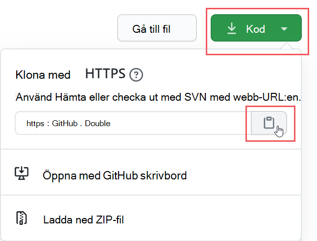

3. I Visual Studio väljer du  Visa \> **kommandopalett och** **sedan Git: Klona**. Om du vill gå till alternativet i listan börjar du skriva för att `git: clone` filtrera posterna och väljer det i listrutan. Till exempel:

   > [!div class="mx-imgBorder"]
   > 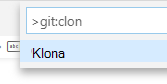

4. I textrutan klistrar du in webbadressen du kopierade från Git och väljer **Klona från GitHub**.

5. I dialogrutan **Välj mapp** som visas bläddrar du till och väljer en plats där du vill lagra lagringsplatsen. Välj Öppna när du **uppmanas att göra det.**

    Lagringsplatsen öppnas Visual Studio kod och visar den aktuella Git-grenen längst ned till vänster. Grenen ska till exempel vara **huvud.** Till exempel:

   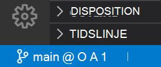

6. Om du inte är i huvudgrenen måste du välja den. I Visual Studio väljer du grenen och väljer **huvud i** listan med filialer som visas.

   > [!IMPORTANT]
   > Genom att välja huvudgren ser du till att du har rätt filer för att skapa projektet. Om du inte väljer rätt gren kommer distributionen att misslyckas.

Du har nu din DKE-källdatabas konfigurerad lokalt. Ändra sedan [programinställningarna](#modify-application-settings) för din organisation.

### <a name="modify-application-settings"></a>Ändra programinställningar

Du måste ändra följande typer av programinställningar för att distribuera DKE-tjänsten:

- [Inställningar för tangentåtkomst](#key-access-settings)
- [Inställningar för klientorganisation och nyckel](#tenant-and-key-settings)

Du ändrar programinställningarna i det appsettings.jsfilen. Den här filen finns på den DoubleKeyEncryptionService-lagringsplatsen som du klonade lokalt under DoubleKeyEncryptionService\src\customer-key-store. I Visual Studio kan du till exempel bläddra till filen som på bilden nedan.

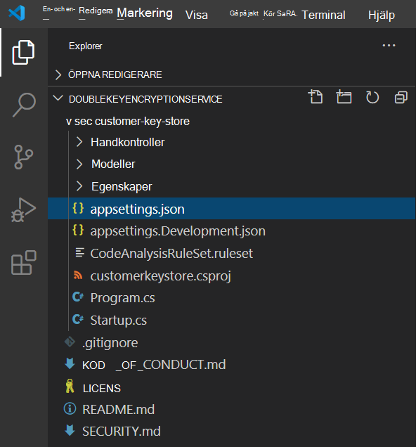

#### <a name="key-access-settings"></a>Inställningar för tangentåtkomst

Välj om du vill använda e-post eller rollauktorisering. DKE stöder endast en av dessa autentiseringsmetoder i taget.

- **E-postauktorisering**. Gör att din organisation kan auktorisera åtkomst till nycklar endast baserat på e-postadresser.

- **Rollauktorisering**. Ger organisationen behörighet att auktorisera åtkomst till nycklar baserat på Active Directory-grupper och kräver att webbtjänsten kan köra frågor för LDAP.

**Så här anger du tangentåtkomstinställningar för DKE med e-postauktorisering**

1. Öppna **filenappsettings.js** filen och leta reda på `AuthorizedEmailAddress` inställningen.

2. Lägg till den e-postadress eller de adresser som du vill auktorisera. Avgränsa flera e-postadresser med dubbla citattecken och kommatecken. Till exempel:

   ```json
   "AuthorizedEmailAddress": ["email1@company.com", "email2@company.com ", "email3@company.com"]
   ```

3. Leta reda `LDAPPath` på inställningen och ta bort texten mellan `If you use role authorization (AuthorizedRoles) then this is the LDAP path.` citattecken. Låt de dubbla citattförfrågningarna vara kvar. När du är klar bör inställningen se ut så här.

   ```json
   "LDAPPath": ""
   ```

4. Leta reda `AuthorizedRoles` på inställningen och ta bort hela raden.

Den här bilden visar filen **appsettings.jskorrekt formaterad** för e-postauktorisering.

   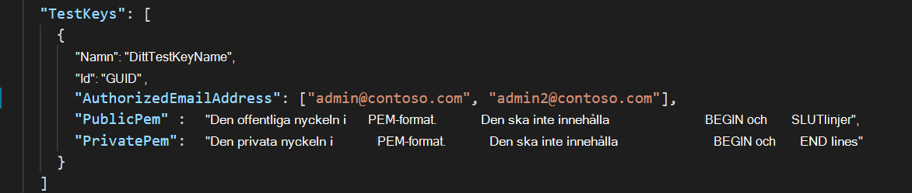

**Så här anger du nyckelåtkomstinställningar för DKE med rollauktorisering**

1. Öppna **filenappsettings.js** filen och leta reda på `AuthorizedRoles` inställningen.

2. Lägg till de Active Directory-gruppnamn som du vill auktorisera. Avgränsa flera gruppnamn med dubbla citattecken och kommatecken. Till exempel:

   ```json
   "AuthorizedRoles": ["group1", "group2", "group3"]
   ```

3. Leta reda `LDAPPath` på inställningen och lägg till Active Directory-domänen. Till exempel:

   ```json
   "LDAPPath": "contoso.com"
   ```

4. Leta reda `AuthorizedEmailAddress` på inställningen och ta bort hela raden.

I den här bilden **appsettings.jsfilen** är korrekt formaterad för rollauktorisering.

   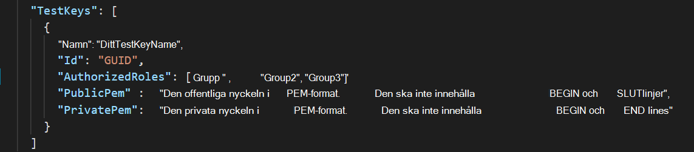

#### <a name="tenant-and-key-settings"></a>Inställningar för klientorganisation och nyckel

Klientorganisation och nyckelinställningar för DKE finns i **filenappsettings.jsfilen.**

**Så här konfigurerar du klientorganisations- och nyckelinställningar för DKE**

1. Öppna **filenappsettings.jsfilen.**

2. Leta reda på `ValidIssuers` inställningen och ersätt med ditt `<tenantid>` klientorganisations-ID. Du kan hitta ditt klient-ID genom att gå till Azure-portalen och visa [klientorganisationens egenskaper.](https://aad.portal.azure.com/#blade/Microsoft_AAD_IAM/ActiveDirectoryMenuBlade/Properties) Till exempel:

   ```json
   "ValidIssuers": [
     "https://sts.windows.net/9c99431e-b513-44be-a7d9-e7b500002d4b/"
   ]
   ```
> [!NOTE]
> Om du vill aktivera extern B2B-åtkomst till nyckelarkivet måste du också inkludera dessa externa innehavare som en del av listan över giltiga utfärdare.

Leta reda på `JwtAudience` . Ersätt `<yourhostname>` med värdnamnet för den dator där DKE-tjänsten körs. Till exempel:

  > [!IMPORTANT]
  > Värdet för måste `JwtAudience` matcha värdens namn *exakt.* Du kan använda **localhost:5001** när du felsöker. Men när du är klar med felsökningen måste du uppdatera det här värdet till serverns värdnamn.

- `TestKeys:Name`. Ange ett namn på nyckeln. Till exempel: `TestKey1`
- `TestKeys:Id`. Skapa ett GUID och ange det som `TestKeys:ID` värde. Till exempel `DCE1CC21-FF9B-4424-8FF4-9914BD19A1BE`. Du kan använda en webbplats som [Online GUID Generator för](https://guidgenerator.com/) att slumpmässigt generera en GUID.

Den här bilden visar rätt format för inställningar för klientorganisation och nycklar **appsettings.jspå**. `LDAPPath` har konfigurerats för rollauktorisering.

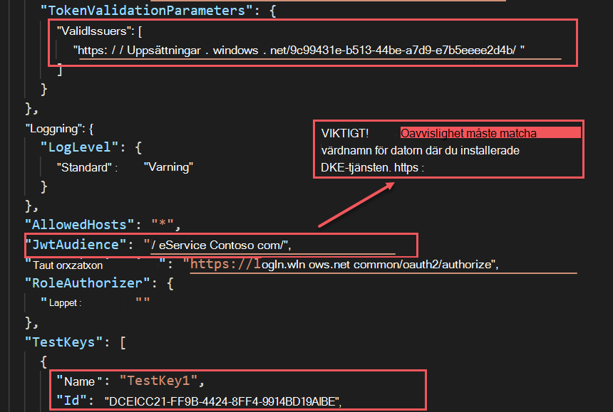

### <a name="generate-test-keys"></a>Generera testnycklar

När du har definierat dina programinställningar är du redo att skapa offentliga och privata testnycklar.

Så här skapar du nycklar:

1. I Windows På Start-menyn kör du Kommandotolken i OpenSSL.

2. Byt till den mapp där du vill spara testnycklarna. Filer som du skapar genom att utföra stegen i uppgiften lagras i samma mapp.

3. Generera den nya testnyckeln.

   ```console
   openssl req -x509 -newkey rsa:2048 -keyout key.pem -out cert.pem -days 365
   ```

4. Generera den privata nyckeln.

   ```console
   openssl rsa -in key.pem -out privkeynopass.pem
   ```

5. Generera den offentliga nyckeln.

   ```console
   openssl rsa -in key.pem -pubout > pubkeyonly.pem
   ```

6. I en textredigerare öppnar **du pubkeyonly.pem**. Kopiera allt innehåll i filen **pubkeyonly.pem,** förutom den första och den sista raderna, till avsnittet i `PublicPem` filenappsettings.js **på.**

7. Öppna **privkeynopass.pem** i en textredigerare. Kopiera allt innehåll i **filen privkeynopass.pem,** förutom den första och sista raderna, till den delen av `PrivatePem` filenappsettings.js **filen.**

8. Ta bort alla tomma utrymmen och nya rader i både `PublicPem` avsnitt `PrivatePem` och.

    > [!IMPORTANT]
    > När du kopierar det här innehållet ska du inte ta bort några PEM-data.

9. Bläddra Visual Studio.cs-filen i **Kod.** Den här filen finns på den DoubleKeyEncryptionService-lagringsplatsen som du klonade lokalt under DoubleKeyEncryptionService\src\customer-key-store\.

10. Leta upp följande rader:

    ```csharp
        #if USE_TEST_KEYS
        #error !!!!!!!!!!!!!!!!!!!!!! Use of test keys is only supported for testing,
        DO NOT USE FOR PRODUCTION !!!!!!!!!!!!!!!!!!!!!!!!!!!!!
        services.AddSingleton<ippw.IKeyStore, ippw.TestKeyStore>();
        #endif
    ```

11. Ersätt dessa rader med följande text:

    ```csharp
    services.AddSingleton<ippw.IKeyStore, ippw.TestKeyStore>();
    ```

    Resultatet bör se ut ungefär så här.

    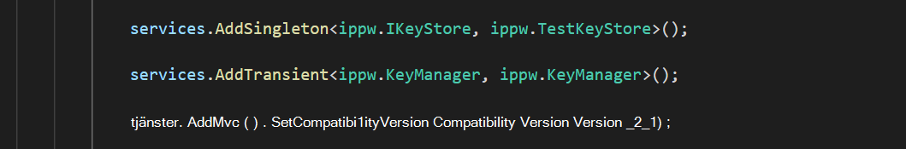

Nu är du redo att [skapa ditt DKE-projekt](#build-the-project).

### <a name="build-the-project"></a>Skapa projektet

Använd följande anvisningar för att skapa DKE-projektet lokalt:

1. I Visual Studio kod i DKE-tjänstens lagringsplats väljer du **Visa kommandopalett** och skriver sedan version när du \>  uppmanas att göra  det.

2. I listan väljer du **Uppgifter: Kör build-uppgift**.

   Om inga build-uppgifter hittas väljer du **Konfigurera build-uppgift** och skapar en för .NET-kärnuppgifterna på följande sätt.

   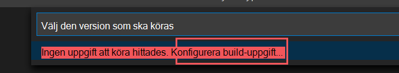

   1. Välj **Skapa tasks.jsfrån mall**.

      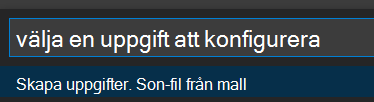

   2. Välj .NET Core i listan **över malltyper.**

      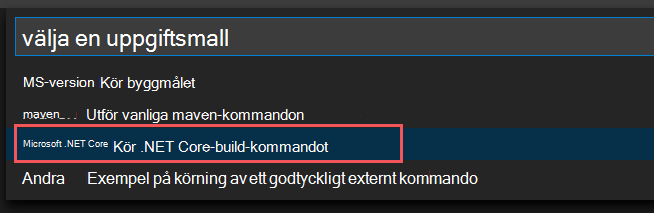

   3. Leta reda på sökvägen till filen **customerkeystore.csproj** i build-avsnittet. Om den inte visas lägger du till följande rad:

      ```json
      "${workspaceFolder}/src/customer-key-store/customerkeystore.csproj",
      ```

   4. Kör versionen igen.

3. Kontrollera att det inte finns några röda fel i utdatafönstret.

   Om det finns röda fel kontrollerar du konsolens utdata. Kontrollera att du har slutfört alla tidigare steg korrekt och att rätt versionsversioner finns.

4. Välj **Kör** \> **Starta felsökning för** att felsöka processen. Om du uppmanas att välja en miljö väljer du **.NET core**.

   .NET core debugger startar vanligtvis på `https://localhost:5001` . Du visar testtangenten genom att gå till `https://localhost:5001` och lägga till ett snedstreck (/) och namnet på tangenten. Till exempel:

   ```https
   https://localhost:5001/TestKey1
   ```

   Nyckeln ska visas i JSON-format.

Konfigurationen är nu klar. Innan du publicerar nyckelstore ska du, i appsettings.jspå, se till att värdet för värdnamn matchar programtjänstens värdnamn exakt. Du kan ha ändrat det till localhost för att felsöka versionen.

### <a name="deploy-the-dke-service-and-publish-the-key-store"></a>Distribuera DKE-tjänsten och publicera nyckelarkivet

För produktionsdistributioner distribuerar du tjänsten i ett tredjepartsmoln [eller publicerar på ett lokalt system.](/aspnet/core/tutorials/publish-to-iis?preserve-view=true&tabs=netcore-cli&view=aspnetcore-3.1)

Du kanske föredrar andra metoder för att distribuera dina nycklar. Välj den metod som passar din organisation bäst.

För pilotdistributioner kan du distribuera i Azure och komma igång direkt.

**Så här skapar du en Azure Web App-instans som värd för DKE-distributionen**

När du ska publicera nyckellagringsnyckeln skapar du en Azure App Service-instans som värd för DKE-distributionen. Därefter ska du publicera de nycklar du skapat i Azure.

1. Logga in på e-postportalen [i Microsoft Azure](https://ms.portal.azure.com)och gå till **Lägg till**  >  **Apptjänster.**

2. Välj prenumerations- och resursgrupp och definiera instansinformation.

   - Ange värdnamnet för den dator där du vill installera DKE-tjänsten. Kontrollera att det är samma namn som det som definierats för inställningen JwtAudience [**i detappsettings.jsfilen.**](#tenant-and-key-settings) Värdet du anger för namnet är också WebAppInstanceName.

   - För **Publicera** väljer du **kod** och för **Runtime-stack** väljer du **.NET Core 3.1.**

   Till exempel:

   > [!div class="mx-imgBorder"]
   > 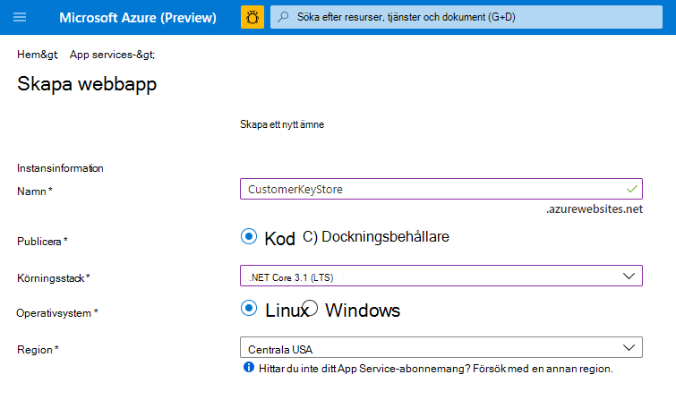

3. Längst ned på sidan väljer du Granska **+ skapa och** sedan Lägg **till**.

4. Gör något av följande för att publicera de nycklar du skapat:

   - [Publicera via ZipDeployUI](#publish-via-zipdeployui)
   - [Publicera via FTP](#publish-via-ftp)
   - [Publicera via Visual Studio 2019 eller senare](/aspnet/core/tutorials/)

#### <a name="publish-via-zipdeployui"></a>Publicera via ZipDeployUI

1. Gå till `https://<WebAppInstanceName>.scm.azurewebsites.net/ZipDeployUI`.

   Till exempel: https://dkeservice.scm.azurewebsites.net/ZipDeployUI

2. Gå till mappen **customer-key-store\src\customer-key-store** i codebase för nyckellagret och kontrollera att mappen innehåller filen **customerkeystore.csproj.**

3. Kör: **dotnet publicera**

   I utdatafönstret visas katalogen där publiceringen distribuerades.

   Till exempel: `customer-key-store\src\customer-key-store\bin\Debug\netcoreapp3.1\publish\`

4. Skicka alla filer i publiceringskatalogen till en .zip filen. När du .zip filen ser du till att alla filer i katalogen är på rotnivån i .zip filen.

5. Dra och släpp .zip filen du skapade på ZipDeployUI-webbplatsen som du öppnade ovan. Till exempel: https://dkeservice.scm.azurewebsites.net/ZipDeployUI

DKE distribueras och du kan bläddra till testnycklarna som du har skapat. Fortsätt att [validera distributionen](#validate-your-deployment) nedan.

#### <a name="publish-via-ftp"></a>Publicera via FTP

1. Anslut till apptjänsten som du skapade [ovan.](#deploy-the-dke-service-and-publish-the-key-store)

   I webbläsaren går du till: **Azure Portal App Service**  >  **Deployment** Center ,  >  **FTP-instrumentpanel** för  >  **manuell**  >    >  **distribution.**

2. Kopiera anslutningssträngarna som visas till en lokal fil. Du använder strängarna för att ansluta till Webbtjänsten och ladda upp filer via FTP.

   Till exempel:

   

3. Gå till katalogen **customer-key-store\src\customer-key-store** i codebase för nyckellagring.

4. Kontrollera att den här katalogen innehåller **filen customerkeystore.csproj.**

5. Kör: **dotnet publicera**

   Utdata innehåller katalogen där publiceringen distribuerades.

   Till exempel: `customer-key-store\src\customer-key-store\bin\Debug\netcoreapp3.1\publish\`

6. Skicka alla filer i publiceringskatalogen till en ZIP-fil. När du .zip filen ser du till att alla filer i katalogen är på rotnivån i .zip filen.

7. Från FTP-klienten använder du anslutningsinformationen som du kopierade för att ansluta till apptjänsten. Upload till .zip skapade i föregående steg i rotkatalogen för webbprogrammet.

DKE distribueras och du kan bläddra till de testnycklar som du har skapat. Validera [sedan distributionen.](#validate-your-deployment)

### <a name="validate-your-deployment"></a>Validera din distribution

När du har distribuerat DKE med någon av metoderna som beskrivs ovan verifierar du inställningarna för distributionen och nyckelarkivet.

Kör:

```powershell
src\customer-key-store\scripts\key_store_tester.ps1 dkeserviceurl/mykey
```

Till exempel:

```powershell
key_store_tester.ps1 https://mydkeservice.com/mykey
```

Se till att inga fel visas i utdata. Registrera nyckelbutiken [när du är klar.](#register-your-key-store)

Nyckelnamnet är det ärendekänsliga. Ange nyckelns namn som det visas i det appsettings.jsfilen.

## <a name="register-your-key-store"></a>Registrera din nyckelbutik

Med följande steg kan du registrera din DKE-tjänst. Att registrera din DKE-tjänst är det sista steget i distributionen av DKE innan du kan börja skapa etiketter.

Så här registrerar du DKE-tjänsten:

1. I webbläsaren öppnar du [webbportalen Microsoft Azure](https://ms.portal.azure.com/)och går till **Registreringar för Alla** \> **tjänster-identitetsapp.** \> 

2. Välj **Ny registrering** och ange ett beskrivande namn.

3. Välj en kontotyp bland alternativen som visas.

   Om du använder Microsoft Azure domän som inte är en egen domän, till exempel **onmicrosoft.com,** väljer du Konton endast i den här organisationskatalogen **(Endast Microsoft – enskild klient).**

   Till exempel:

   > [!div class="mx-imgBorder"]
   > 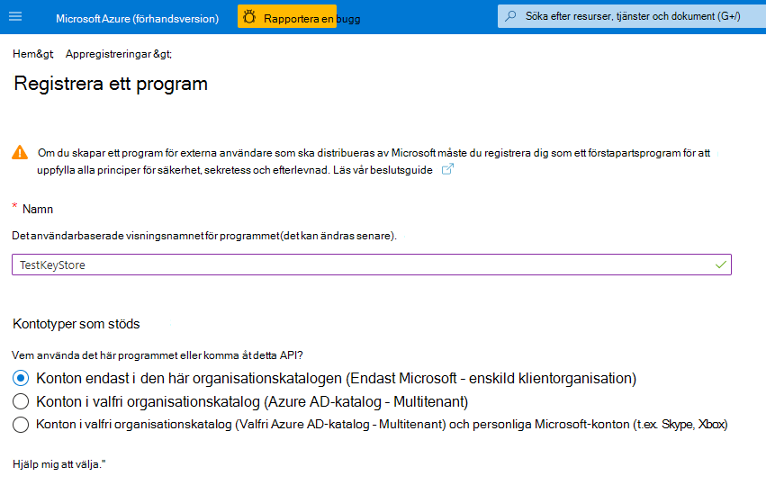

4. Längst ned på sidan väljer du Registrera **för att** skapa den nya appregistreringen.

5. I den nya appregistreringen, i den vänstra rutan, under **Hantera** väljer du **Autentisering**.

6. Välj **Lägg till en plattform.**

7. Välj **Webb på** popup-menyn Konfigurera **plattformar.**

8. Under **Omdirigera URI:er** anger du URI:en för krypteringstjänsten med dubbelnyckeln. Ange apptjänst-URL:en, inklusive både värdnamn och domän.

   Till exempel: https://mydkeservicetest.com

   - URL-adressen du anger måste matcha värdnamnet där DKE-tjänsten är distribuerad.
   - Om du testar lokalt med Visual Studio du **https://localhost:5001** .
   - I samtliga fall måste schemat vara **https.**

   Se till att värdnamnet exakt matchar din App Service-värdnamn. Du kanske har ändrat den till `localhost` att felsöka versionen. I **appsettings.jspå** är det här värdet det värdnamn som du anger för `JwtAudience` .

9. Markera **kryssrutan** **ID-token under** Implicit grant.

10. Välj **Spara** för att spara ändringarna.

11. Välj Visa ett **API** i det vänstra fönstret och välj sedan Ange bredvid Program-ID-URI. 

12. Välj Lägg till en omfattning i området Omfattningar **som definieras** av detta API på sidan Visa **ett** **API.** I den nya omfattningen:

    1. Definiera omfattningsnamnet som **user_impersonation**.

    2. Välj de administratörer och användare som kan ge sitt medgivande.

    3. Definiera eventuella återstående värden som krävs.

    4. Välj **Lägg till omfattning**.

    5. Spara **ändringarna** genom att välja Spara högst upp.

13. Fortfarande på sidan **Visa ett API** går du till området Auktoriserade **klientprogram** och väljer Lägg **till ett klientprogram.**

    I det nya klientprogrammet:

    1. Definiera klient-ID som `d3590ed6-52b3-4102-aeff-aad2292ab01c` . Det här värdet är Microsoft Office klient-ID och gör att Office hämta en åtkomsttoken för nyckelarkivet.

    2. Under **Auktoriserade omfattningar** väljer du **user_impersonation** omfattning.

    3. Välj **Lägg till program**.

    4. Spara **ändringarna** genom att välja Spara högst upp.

    5. Upprepa dessa steg, men nu definierar du klient-ID som `c00e9d32-3c8d-4a7d-832b-029040e7db99` . Det här värdet är det enhetliga klient-ID:t för Azure Information Protection. 

Din DKE-tjänst är nu registrerad. Fortsätt genom [att skapa etiketter med DKE](#create-sensitivity-labels-using-dke).

## <a name="create-sensitivity-labels-using-dke"></a>Skapa känslighetsetiketter med DKE

I Microsoft 365 säkerhets- och efterlevnadscenter skapar du en ny känslighetsetikett och tillämpar kryptering som du annars skulle göra. Välj **Använd dubbelnyckelkryptering** och ange slutpunkts-URL:en för din nyckel.

Till exempel:

> [!div class="mx-imgBorder"]
> 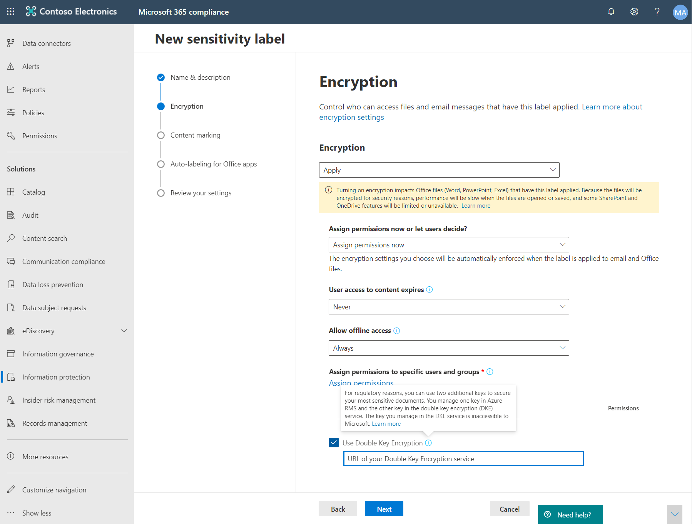

De DKE-etiketter du lägger till visas i de senaste versionerna av Microsoft 365-appar för företag.

> [!NOTE]
> Det kan ta upp till 24 timmar för klienterna att uppdatera med de nya etiketterna.

### <a name="enable-dke-in-your-client"></a>Aktivera DKE i klienten

Om du är en Office Insider är DKE aktiverat för dig. Annars aktiverar du DKE för klienten genom att lägga till följande registernycklar:

```console
   [HKEY_LOCAL_MACHINE\SOFTWARE\WOW6432Node\Microsoft\MSIPC\flighting]
   "DoubleKeyProtection"=dword:00000001

   [HKEY_LOCAL_MACHINE\SOFTWARE\Microsoft\MSIPC\flighting]
   "DoubleKeyProtection"=dword:00000001
```

## <a name="migrate-protected-files-from-hyok-labels-to-dke-labels"></a>Migrera skyddade filer från HYOK-etiketter till DKE-etiketter

När du är klar med att konfigurera DKE kan du migrera innehåll som du har skyddat med hjälp av HYOK-etiketter till DKE-etiketter. Om du vill migrera använder du AIP-skannern. Om du vill komma igång med att använda [skannern går du till Vad är Azure Information Protection unified labeling scanner?](/azure/information-protection/deploy-aip-scanner).

Om du inte migrerar innehåll påverkas inte ditt HYOK-skyddade innehåll.
