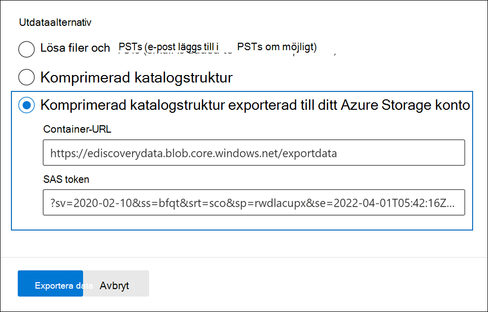
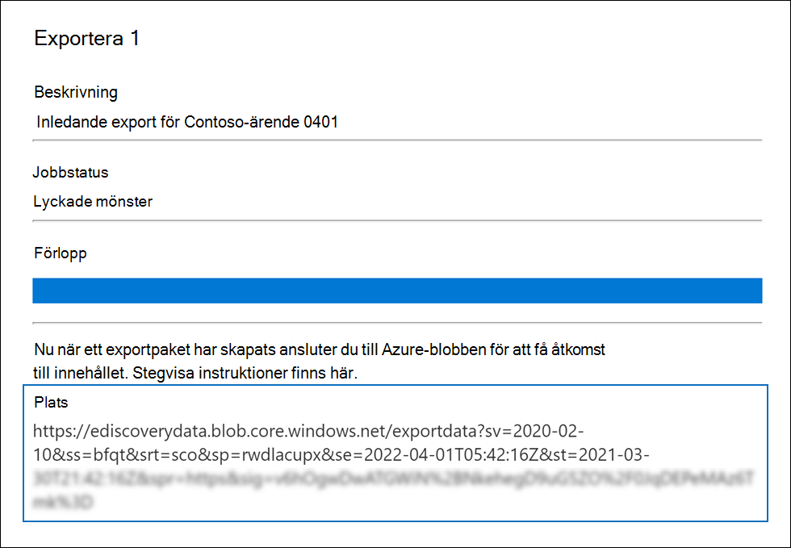
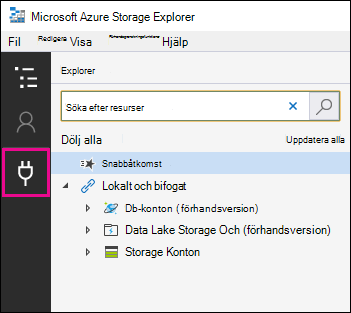
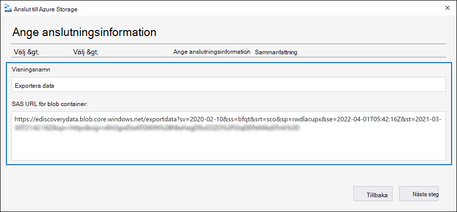
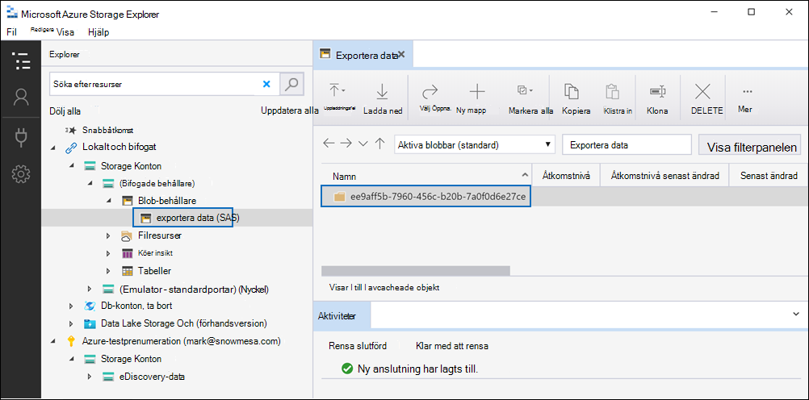
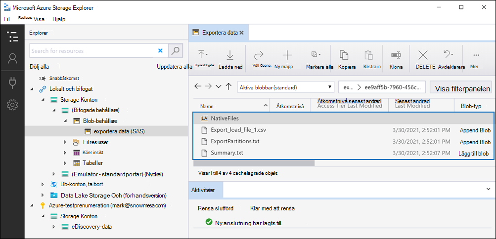

# Exportera dokument i en granskning som är inställd på ett Azure Storage konto

När du exporterar dokument från en granskning i ett Advanced eDiscovery fall kan du exportera dem till ett Azure Storage konto som hanteras av din organisation. Om du använder det här alternativet laddas dokumenten upp till din Azure Storage plats. När de har exporterats kan du komma åt dokumenten (och ladda ned dem till en lokal dator eller annan plats) med hjälp av Azure Storage Explorer. Den här artikeln innehåller instruktioner för hur du exporterar dokument till ditt Azure Storage-konto och hur du använder Azure Storage Explorer för att ansluta till en Azure Storage-plats för att ladda ned exporterade dokument. Mer information om Azure Storage Explorer finns i [Använda Azure Storage Explorer](/azure/storage/blobs/storage-quickstart-blobs-storage-explorer).

## Innan du exporterar dokument från en granskningsuppsättning

- Du måste ange en SAS-token (delad åtkomstsignatur) för ditt Azure Storage-konto och URL-adressen för en viss behållare i lagringskontot för att exportera dokument från en granskningsuppsättning. Se till att ha dessa nära till hands (t.ex. kopierad till en textfil) när du utför steg 2

  - **SAS token:** Se till att få SAS token är för ditt Azure Storage konto (och inte för behållaren). Du kan generera en SAS-token för ditt konto i Azure Storage. Det gör du genom att gå Azure Storage kontot och välja Dela åtkomstsignatur **under** Inställningar **inställningarna** i bladet för lagringskontot. Använd standardinställningarna och tillåt alla resurstyper när du genererar SAS-token.

  - **Behållar-URL:** Du måste skapa en behållare för att ladda upp granskningsuppsättningsdokumenten till och sedan få en kopia av URL-adressen för behållaren. till exempel `https://ediscoverydata.blob.core.windows.net/exportdata` . Om du vill hämta URL:en går du till behållaren i Azure Storage och väljer **Egenskaper** under **Inställningar** i behållarbladet.

- Ladda ned och installera Azure Storage Explorer. Instruktioner finns i [Azure Storage Explorer verktyg](https://go.microsoft.com/fwlink/p/?LinkId=544842). Du använder det här verktyget för att ansluta till behållaren i Azure Storage-konto och ladda ned de dokument som du exporterade i steg 1.

## Steg 1: Exportera dokument från en granskningsuppsättning

Det första steget är att skapa ett exportjobb för att exportera dokument från en granskningsuppsättning. Mer detaljerade anvisningar om alla exportalternativ finns i [Exportera dokument från en granskningsuppsättning](export-documents-from-review-set.md). I följande procedur markeras inställningarna för att exportera dokument till organisationens Azure Storage konto.

1. I Microsoft 365 Efterlevnadscenter fliken öppnar Advanced eDiscovery, väljer fliken Granska **uppsättningar** och väljer sedan den granskningsuppsättning som du vill exportera.

2. Klicka på Åtgärdsexport i   >  **granskningsuppsättningen.**

3. På den **utfällbara** sidan Exportalternativ skriver du ett namn (obligatoriskt) och en beskrivning (valfritt) för exporten.

4. Konfigurera inställningarna i avsnitten dokument, metadata, innehåll och alternativ. Mer information om de här inställningarna finns i [Exportera dokument från en granskningsuppsättning](export-documents-from-review-set.md).

5. I avsnittet **Utdataalternativ** väljer du **alternativet Komprimerad katalogstruktur som exporterats till Azure Storage konto.**

6. Klistra in behållar-URL:en och SAS-token för ditt lagringskonto i motsvarande fält.

   

7. Klicka **på Exportera** för att skapa exportjobbet.

## Steg 2: Hämta SAS URL från exportjobbet

Nästa steg är att hämta SAS URL som genereras när du har skapat exportjobbet i steg 1. Du använder SAS URL för att ansluta till behållaren i ditt Azure Storage konto som du exporterade granskningsuppsättningsdokumenten till.

1. På **Advanced eDiscovery** sidan går du till ärendet och klickar sedan på **fliken Exporter.**

2. Klicka på **det** exportjobb som du vill ladda ned på fliken Exporter. Det här är exportjobbet som du skapade i steg 1.

3. På den utfällade **sidan, under Platser,** kopierar du SAS URL som visas. Om det behövs kan du spara den i en textfil så att du kan komma åt den i steg 3.

   

   > [!TIP]
   > SAS URL som visas i exportjobbet är en sammanfogning av behållar-URL:en och SAS-token för ditt Azure Storage konto. Du kan kopiera det från exportjobbet eller skapa det själv genom att kombinera URL- och SAS-token.

## Steg 3: Anslut till Azure Storage behållare

Det sista steget är att använda Azure Storage Explorer och SAS URL för att ansluta till behållaren i ditt Azure Storage-konto och ladda ned exporterade dokument till en lokal dator.

1. Starta den Azure Storage Explorer du har laddat ned och installerat.

2. Klicka på **ikonen Anslut dialogruta.**

   

3. På sidan **Anslut att Azure Storage** klickar du på **Blob-behållare**.

4. På sidan **Välj autentiseringsmetod** väljer du alternativet **Delad åtkomstsignatur (SAS) och** klickar sedan på **Nästa.**

5. På sidan **Ange anslutningsinformation** klistrar du in SAS URL (som du fick i exportjobbet i steg 2) i **RUTAN SAS URL för Blob Container.**

    

    Observera att behållarnamnet visas i **rutan Visningsnamn.** Du kan redigera det här namnet.

6. Klicka **på Nästa** för att visa **sammanfattningssidan** och klicka sedan på **Anslut**.

    **Blob-behållare-noden** **(Storage konton**  >  **(bifogade behållare)** \> öppnas.

    

    Den innehåller en behållare med namnet från steg 5. Den här behållaren innehåller en mapp för varje exportjobb som du har laddat ned till behållaren i Azure Storage konto. De här mapparna namnges med ett ID som motsvarar ID för exportjobbet. Du hittar export-ID:n (och namnet på exporten) under **Supportinformation** på den utfällda  sidan för varje Förbereda data för **exportjobb** som finns på fliken Jobb i Advanced eDiscovery fall.

7. Dubbelklicka på mappen exportera jobb för att öppna den.

   En lista med mappar och exportrapporter visas.

    

8. Om du vill exportera allt innehåll  från exportjobbet klickar du på uppåtpilen för att gå tillbaka till exportjobbmappen och klickar sedan på **Ladda ned.**

9. Ange den plats där du vill ladda ned de exporterade filerna och klicka sedan på Välj mapp.

    Filen Azure Storage Explorer startar nedladdningen. Status för de exporterade objekten visas i **fönstret** Aktiviteter. Ett meddelande visas när nedladdningen är klar.

> [!NOTE]
> I stället för att ladda ned hela exportjobbet i Azure Storage Explorer kan du välja specifika objekt att ladda ned och visa.

## Mer information

- Mappen exportjobb innehåller följande objekt. De faktiska objekten i exportmappen bestäms av vilka exportalternativ som konfigurerades när exportjobbet skapades. Mer information om dessa alternativ finns i [Exportera dokument från en granskningsuppsättning.](export-documents-from-review-set.md)

  - Export_load_file.csv: Den här CSV-filen är en detaljexportrapport som innehåller information om varje exporterat dokument. Filen består av en kolumn för varje metadataegenskap för ett dokument. En lista med och en beskrivning av metadata som  ingår i rapporten finns i kolumnen För exporterade fältnamn i tabellen i Dokumentmetadatafält [i Advanced eDiscovery](document-metadata-fields-in-advanced-ediscovery.md).

  - Summary.txt: En textfil som innehåller en sammanfattning av exporten inklusive exportstatistik.

  - Extracted_text_files: Den här mappen innehåller en textfilversion av varje exporterat dokument.

  - NativeFiles: Den här mappen innehåller en inbyggd filversion av varje exporterat dokument.

  - Error_files: Den här mappen innehåller följande objekt när exportjobbet innehåller felfiler:

    - ExtractionError.csv: Den här CSV-filen innehåller tillgängliga metadata för filer som inte extraherades korrekt från det överordnade objektet.

    - ProcessingError: Den här mappen innehåller dokument med bearbetningsfel. Det här innehållet ligger på objektnivå, vilket innebär att om en bifogad fil hade ett bearbetningsfel inkluderas det dokument som innehåller den bifogade filen även i den här mappen.
