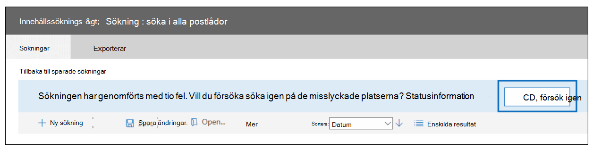
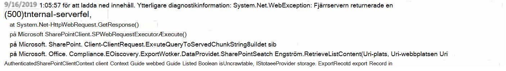

# <a name="investigate-troubleshoot-and-resolve-common-ediscovery-issues"></a><span data-ttu-id="db7b7-103">Undersöka, felsöka och lösa vanliga eDiscovery-problem</span><span class="sxs-lookup"><span data-stu-id="db7b7-103">Investigate, troubleshoot, and resolve common eDiscovery issues</span></span>

<span data-ttu-id="db7b7-104">Det här avsnittet beskriver grundläggande felsökningssteg du kan vidta för att identifiera och lösa problem som kan uppstå under en eDiscovery-sökning eller någon annanstans i eDiscovery-processen.</span><span class="sxs-lookup"><span data-stu-id="db7b7-104">This topic covers basic troubleshooting steps you can take to identify and resolve issues you may encounter during an eDiscovery search or elsewhere in the eDiscovery process.</span></span> <span data-ttu-id="db7b7-105">För att du ska kunna lösa vissa av de här scenarierna behöver du hjälp från Microsoft Support.</span><span class="sxs-lookup"><span data-stu-id="db7b7-105">Resolving some of these scenarios requires help from Microsoft Support.</span></span> <span data-ttu-id="db7b7-106">Information om när du kontaktar Microsoft Support ingår i lösningsstegen.</span><span class="sxs-lookup"><span data-stu-id="db7b7-106">Information on when to contact Microsoft Support is included in the resolution steps.</span></span>

## <a name="errorissue-ambiguous-location"></a><span data-ttu-id="db7b7-107">Fel/problem: Tvetydig plats</span><span class="sxs-lookup"><span data-stu-id="db7b7-107">Error/issue: Ambiguous location</span></span>

<span data-ttu-id="db7b7-108">Om du försöker lägga till användarens postlådas plats för sökning och det finns dubbletter eller objekt i konflikt med samma användar-ID i Exchange Online Protection-katalogen (EOP) visas följande felmeddelande: `The compliance search contains the following invalid location(s):useralias@contoso.com. The location "useralias@contoso.com" is ambiguous` .</span><span class="sxs-lookup"><span data-stu-id="db7b7-108">If you try to add user's mailbox location to search and there are duplicate or conflicting objects with the same userID in the Exchange Online Protection (EOP) directory, you receive this error: `The compliance search contains the following invalid location(s):useralias@contoso.com. The location "useralias@contoso.com" is ambiguous`.</span></span>

### <a name="resolution"></a><span data-ttu-id="db7b7-109">Lösning</span><span class="sxs-lookup"><span data-stu-id="db7b7-109">Resolution</span></span>

<span data-ttu-id="db7b7-110">Sök efter dubbletter av användare eller distributionslistor med samma användar-ID.</span><span class="sxs-lookup"><span data-stu-id="db7b7-110">Check for duplicate users or distribution list with the same user ID.</span></span>

1. <span data-ttu-id="db7b7-111">Anslut till [Säkerhets- & Efterlevnadscenter PowerShell.](/powershell/exchange/connect-to-scc-powershell)</span><span class="sxs-lookup"><span data-stu-id="db7b7-111">Connect to [Security & Compliance Center PowerShell](/powershell/exchange/connect-to-scc-powershell).</span></span>

2. <span data-ttu-id="db7b7-112">Kör följande kommando för att hämta alla förekomster av användarnamnet:</span><span class="sxs-lookup"><span data-stu-id="db7b7-112">Run the following command to retrieve all instances of the username:</span></span>

    ```powershell
    Get-Recipient <username>
    ```

   <span data-ttu-id="db7b7-113">Utdata för "useralias@contoso.com" skulle se ut ungefär så här:</span><span class="sxs-lookup"><span data-stu-id="db7b7-113">The output for 'useralias@contoso.com' would be similar to the following:</span></span>

   > 
   > |<span data-ttu-id="db7b7-114">Namn</span><span class="sxs-lookup"><span data-stu-id="db7b7-114">Name</span></span>|<span data-ttu-id="db7b7-115">RecipientType</span><span class="sxs-lookup"><span data-stu-id="db7b7-115">RecipientType</span></span>|
   > |---|---|
   > |<span data-ttu-id="db7b7-116">Alias, användare</span><span class="sxs-lookup"><span data-stu-id="db7b7-116">Alias, User</span></span>|<span data-ttu-id="db7b7-117">MailUser</span><span class="sxs-lookup"><span data-stu-id="db7b7-117">MailUser</span></span>|
   > |<span data-ttu-id="db7b7-118">Alias, användare</span><span class="sxs-lookup"><span data-stu-id="db7b7-118">Alias, User</span></span>|<span data-ttu-id="db7b7-119">Användare</span><span class="sxs-lookup"><span data-stu-id="db7b7-119">User</span></span>|

3. <span data-ttu-id="db7b7-120">Om flera användare returneras letar du reda på och åtgärdar det objekt som ligger i konflikt.</span><span class="sxs-lookup"><span data-stu-id="db7b7-120">If multiple users are returned, locate and fix the conflicting object.</span></span>

## <a name="errorissue-search-fails-on-specific-locations"></a><span data-ttu-id="db7b7-121">Fel/problem: Sökningen misslyckas på specifika platser</span><span class="sxs-lookup"><span data-stu-id="db7b7-121">Error/issue: Search fails on specific locations</span></span>

<span data-ttu-id="db7b7-122">En e-dataidentifiering eller innehållssökning kan ge följande fel: `This search completed with (#) errors.  Would you like to retry the search on the failed locations?`</span><span class="sxs-lookup"><span data-stu-id="db7b7-122">An eDiscovery or content search may yield the following error: `This search completed with (#) errors.  Would you like to retry the search on the failed locations?`</span></span>



### <a name="resolution"></a><span data-ttu-id="db7b7-124">Lösning</span><span class="sxs-lookup"><span data-stu-id="db7b7-124">Resolution</span></span>

<span data-ttu-id="db7b7-125">Om du får det här felet rekommenderar vi att du verifierar de platser som misslyckades i sökningen och sedan kör sökningen på de misslyckade platserna igen.</span><span class="sxs-lookup"><span data-stu-id="db7b7-125">If you receive this error, we recommend that you verify the locations that failed in the search  then rerun the search only on the failed locations.</span></span>

1. <span data-ttu-id="db7b7-126">Anslut [säkerhets- & Säkerhets- och efterlevnadscenter PowerShell](/powershell/exchange/connect-to-scc-powershell) och kör sedan följande kommando:</span><span class="sxs-lookup"><span data-stu-id="db7b7-126">Connect to [Security & Compliance Center PowerShell](/powershell/exchange/connect-to-scc-powershell) and then run the following command:</span></span>

   ```powershell
   Get-ComplianceSearch <searchname> | FL
   ```

2. <span data-ttu-id="db7b7-127">I PowerShell-utdata kan du visa de misslyckade platserna i felfältet eller i statusinformationen i felmeddelandet från sökresultatet.</span><span class="sxs-lookup"><span data-stu-id="db7b7-127">From the PowerShell output, view the failed locations in the errors field or from the status details in the error from the search output.</span></span>

3. <span data-ttu-id="db7b7-128">Försök bara att söka efter eDiscovery på de misslyckade platserna.</span><span class="sxs-lookup"><span data-stu-id="db7b7-128">Retry the eDiscovery search on the failed locations only.</span></span>

4. <span data-ttu-id="db7b7-129">Om du fortsätter att få de här felen kan du [läsa mer om felsökningssteg i](/Office365/SecurityCompliance/retry-failed-content-search) Försök igen med misslyckade platser.</span><span class="sxs-lookup"><span data-stu-id="db7b7-129">If you continue to receive these errors, see [Retry failed locations](/Office365/SecurityCompliance/retry-failed-content-search) for more troubleshooting steps.</span></span>

## <a name="errorissue-file-not-found"></a><span data-ttu-id="db7b7-130">Fel/problem: Filen hittades inte</span><span class="sxs-lookup"><span data-stu-id="db7b7-130">Error/issue: File not found</span></span>

<span data-ttu-id="db7b7-131">När du kör en eDiscovery-sökning som innehåller SharePoint Online och One Drive för företag-platser, kan du få felmeddelandet trots att filen finns `File Not Found` på webbplatsen.</span><span class="sxs-lookup"><span data-stu-id="db7b7-131">When running an eDiscovery search that includes SharePoint Online and One Drive For Business locations, you may receive the error `File Not Found` although the file is located on the site.</span></span> <span data-ttu-id="db7b7-132">Det här felet visas i exportvarningarna och errors.csv hoppas över items.csv.</span><span class="sxs-lookup"><span data-stu-id="db7b7-132">This error will be in the export warnings and errors.csv or skipped items.csv.</span></span> <span data-ttu-id="db7b7-133">Detta kan inträffa om filen inte kan hittas på webbplatsen eller om indexet är in datera.</span><span class="sxs-lookup"><span data-stu-id="db7b7-133">This may occur if the file can't be found on the site or if the index is out of date.</span></span> <span data-ttu-id="db7b7-134">Här är texten för ett faktiskt fel (med betoning).</span><span class="sxs-lookup"><span data-stu-id="db7b7-134">Here's the text of an actual error (with emphasis added).</span></span>

> <span data-ttu-id="db7b7-135">28.06.2019 10:02:19_FailedToExportItem_Failed för att ladda ned innehåll.</span><span class="sxs-lookup"><span data-stu-id="db7b7-135">28.06.2019 10:02:19_FailedToExportItem_Failed to download content.</span></span> <span data-ttu-id="db7b7-136">Ytterligare diagnostikinformation: Microsoft. Office. Compliance.EDiscovery.ExportWorker.Exceptions.ContentDownloadTemporaryFailure: Det gick inte att ladda ned från innehåll 6ea52149-91cd-4965-b5bb-82ca6a3ec9be av typen Dokument.</span><span class="sxs-lookup"><span data-stu-id="db7b7-136">Additional diagnostic info : Microsoft.Office.Compliance.EDiscovery.ExportWorker.Exceptions.ContentDownloadTemporaryFailure: Failed to download from content 6ea52149-91cd-4965-b5bb-82ca6a3ec9be of type Document.</span></span> <span data-ttu-id="db7b7-137">Korrelations-ID: 3bd84722-937b-4c23-b61b-08d6fba9ec32.</span><span class="sxs-lookup"><span data-stu-id="db7b7-137">Correlation Id: 3bd84722-937b-4c23-b61b-08d6fba9ec32.</span></span> <span data-ttu-id="db7b7-138">ServerErrorCode: -2147024894 ---> Microsoft. SharePoint. Client.ServerException: ***File Not Found***.</span><span class="sxs-lookup"><span data-stu-id="db7b7-138">ServerErrorCode: -2147024894 ---> Microsoft.SharePoint.Client.ServerException: ***File Not Found***.</span></span> <span data-ttu-id="db7b7-139">på Microsoft. SharePoint. Client.ClientRequest.ProcessResponseStream(Stream responseStream) på Microsoft. SharePoint. Client.ClientRequest.ProcessResponse() --- i slutet av den inre undantagsstapelspårningen ---</span><span class="sxs-lookup"><span data-stu-id="db7b7-139">at Microsoft.SharePoint.Client.ClientRequest.ProcessResponseStream(Stream responseStream) at Microsoft.SharePoint.Client.ClientRequest.ProcessResponse() --- End of inner exception stack trace ---</span></span>

### <a name="resolution"></a><span data-ttu-id="db7b7-140">Lösning</span><span class="sxs-lookup"><span data-stu-id="db7b7-140">Resolution</span></span>

1. <span data-ttu-id="db7b7-141">Kontrollera platsen som identifieras i sökningen för att säkerställa att filens plats är korrekt och läggs till på sökplatserna.</span><span class="sxs-lookup"><span data-stu-id="db7b7-141">Check location identified in the search to ensure that the location of the file is correct and added in the search locations.</span></span>

2. <span data-ttu-id="db7b7-142">Använd procedurerna i Manuellt begära crawlning och [omindexering](/sharepoint/crawl-site-content) av en webbplats, ett bibliotek eller en lista för att indexera om webbplatsen.</span><span class="sxs-lookup"><span data-stu-id="db7b7-142">Use the procedures at [Manually request crawling and re-indexing of a site, a library, or a list](/sharepoint/crawl-site-content) to reindex the site.</span></span>

## <a name="errorissue-this-file-wasnt-exported-because-it-doesnt-exist-anymore-the-file-was-included-in-the-count-of-estimated-search-results-because-its-still-listed-in-the-index-the-file-will-eventually-be-removed-from-the-index-and-wont-cause-an-error-in-the-future"></a><span data-ttu-id="db7b7-143">Fel/problem: Filen exporterades inte eftersom den inte längre finns.</span><span class="sxs-lookup"><span data-stu-id="db7b7-143">Error/issue: This file wasn't exported because it doesn't exist anymore.</span></span> <span data-ttu-id="db7b7-144">Filen inkluderades i antalet uppskattade sökresultat eftersom den fortfarande finns med i indexet.</span><span class="sxs-lookup"><span data-stu-id="db7b7-144">The file was included in the count of estimated search results because it's still listed in the index.</span></span> <span data-ttu-id="db7b7-145">Filen tas så småningom bort från indexet och orsakar inte något fel i framtiden.</span><span class="sxs-lookup"><span data-stu-id="db7b7-145">The file will eventually be removed from the index, and won't cause an error in the future.</span></span>

<span data-ttu-id="db7b7-146">Det felmeddelandet kan visas när du kör en eDiscovery-sökning som innehåller SharePoint Online- och One Drive för företag-platser.</span><span class="sxs-lookup"><span data-stu-id="db7b7-146">You may see that error when running an eDiscovery search that includes SharePoint Online and One Drive For Business locations.</span></span> <span data-ttu-id="db7b7-147">eDiscovery använder SPO-indexet för att identifiera filplatserna.</span><span class="sxs-lookup"><span data-stu-id="db7b7-147">eDiscovery relies on teh SPO index to identify the file locations.</span></span> <span data-ttu-id="db7b7-148">Om filen togs bort men SPO-indexet inte uppdaterades än kan det här felet uppstå.</span><span class="sxs-lookup"><span data-stu-id="db7b7-148">If the file was deleted but the SPO index was not yet updated this error may occur.</span></span>

### <a name="resolution"></a><span data-ttu-id="db7b7-149">Lösning</span><span class="sxs-lookup"><span data-stu-id="db7b7-149">Resolution</span></span> 
<span data-ttu-id="db7b7-150">Öppna SPO-platsen och kontrollera att filen verkligen inte finns där.</span><span class="sxs-lookup"><span data-stu-id="db7b7-150">Open the SPO location and verify that this file indeed is not there.</span></span>
<span data-ttu-id="db7b7-151">Den föreslagna lösningen är att indexera om webbplatsen manuellt eller vänta tills webbplatsen indexeras om av den automatiska bakgrundsprocessen.</span><span class="sxs-lookup"><span data-stu-id="db7b7-151">Suggested solution is to manually reindex the site, or wait till the site reindexes by the automatic background process.</span></span>


## <a name="errorissue-this-search-result-was-not-downloaded-as-it-is-a-folder-or-other-artefact-that-cant-be-downloaded-by-itself-any-items-inside-the-folder-or-library-will-be-downloaded"></a><span data-ttu-id="db7b7-152">Fel/problem: Sökresultatet har inte laddats ned eftersom det är en mapp eller andra objekt som inte kan laddas ned själv, och objekt i mappen eller biblioteket laddas ned.</span><span class="sxs-lookup"><span data-stu-id="db7b7-152">Error/issue: This search result was not downloaded as it is a folder or other artefact that can't be downloaded by itself, any items inside the folder or library will be downloaded.</span></span>

<span data-ttu-id="db7b7-153">Det felmeddelandet kan visas när du kör en eDiscovery-sökning som innehåller SharePoint Online- och One Drive för företag-platser.</span><span class="sxs-lookup"><span data-stu-id="db7b7-153">You may see that error when running an eDiscovery search that includes SharePoint Online and One Drive For Business locations.</span></span> <span data-ttu-id="db7b7-154">Det innebär att vi skulle försöka exportera objektet som rapporterats i indexet, men det visades vara en mapp så vi exporterade det inte.</span><span class="sxs-lookup"><span data-stu-id="db7b7-154">It means that we were going to try and export the item reported in the index, but it turned out to be a folder so we did not export it.</span></span> <span data-ttu-id="db7b7-155">Som nämns i felet exporterar vi inte mappobjekt men vi exporterar innehållet.</span><span class="sxs-lookup"><span data-stu-id="db7b7-155">As mentioned in the error, we don't export folder items but we do export their contents.</span></span>


## <a name="errorissue-search-fails-because-recipient-is-not-found"></a><span data-ttu-id="db7b7-156">Fel/problem: Sökningen misslyckas eftersom mottagaren inte hittas</span><span class="sxs-lookup"><span data-stu-id="db7b7-156">Error/issue: Search fails because recipient is not found</span></span>

<span data-ttu-id="db7b7-157">En eDiscovery-sökning misslyckas och felmeddelandet `recipient not found` .</span><span class="sxs-lookup"><span data-stu-id="db7b7-157">An eDiscovery search fails with error the `recipient not found`.</span></span> <span data-ttu-id="db7b7-158">Det här felet kan uppstå om användarobjektet inte kan hittas i Exchange Online Protection (EOP) eftersom objektet inte har synkroniserats.</span><span class="sxs-lookup"><span data-stu-id="db7b7-158">This error may occur if the user object cannot be found in Exchange Online Protection (EOP) because the object has not synced.</span></span>

### <a name="resolution"></a><span data-ttu-id="db7b7-159">Lösning</span><span class="sxs-lookup"><span data-stu-id="db7b7-159">Resolution</span></span>

1. <span data-ttu-id="db7b7-160">Anslut till [Exchange Online PowerShell](/powershell/exchange/connect-to-exchange-online-powershell).</span><span class="sxs-lookup"><span data-stu-id="db7b7-160">Connect to [Exchange Online PowerShell](/powershell/exchange/connect-to-exchange-online-powershell).</span></span>

2. <span data-ttu-id="db7b7-161">Kör följande kommando för att kontrollera om användaren är synkroniserad till Exchange Online Protection:</span><span class="sxs-lookup"><span data-stu-id="db7b7-161">Run the following command to check if the user is synced to Exchange Online Protection:</span></span>

   ```powershell
   Get-Recipient <userId> | FL
   ```

3. <span data-ttu-id="db7b7-162">Det bör finnas ett användarobjekt för e-post för användarfrågan.</span><span class="sxs-lookup"><span data-stu-id="db7b7-162">There should be a mail user object for the user question.</span></span> <span data-ttu-id="db7b7-163">Om ingenting returneras undersöker du användarobjektet.</span><span class="sxs-lookup"><span data-stu-id="db7b7-163">If nothing is returned, investigate the user object.</span></span> <span data-ttu-id="db7b7-164">Kontakta Microsoft Support om objektet inte kan synkroniseras.</span><span class="sxs-lookup"><span data-stu-id="db7b7-164">Contact Microsoft Support if the object can't be synced.</span></span>

## <a name="errorissue-exporting-search-results-is-slow"></a><span data-ttu-id="db7b7-165">Fel/problem: Det går långsamt att exportera sökresultat</span><span class="sxs-lookup"><span data-stu-id="db7b7-165">Error/issue: Exporting search results is slow</span></span>

<span data-ttu-id="db7b7-166">När du exporterar sökresultat från eDiscovery eller innehållssökning i säkerhets- och efterlevnadscentret tar nedladdningen längre tid än väntat.</span><span class="sxs-lookup"><span data-stu-id="db7b7-166">When exporting search results from eDiscovery or Content Search in the Security and Compliance center, the download takes longer than expected.</span></span>  <span data-ttu-id="db7b7-167">Du kan kontrollera hur mycket data som ska laddas ned och eventuellt öka exporthastigheten.</span><span class="sxs-lookup"><span data-stu-id="db7b7-167">You can check to see the amount of data to be download and possibly increase the export speed.</span></span>

### <a name="resolution"></a><span data-ttu-id="db7b7-168">Lösning</span><span class="sxs-lookup"><span data-stu-id="db7b7-168">Resolution</span></span>

1. <span data-ttu-id="db7b7-169">Anslut [säkerhets- & Säkerhets- och efterlevnadscenter PowerShell](/powershell/exchange/connect-to-scc-powershell) och kör sedan följande kommando:</span><span class="sxs-lookup"><span data-stu-id="db7b7-169">Connect to [Security & Compliance Center PowerShell](/powershell/exchange/connect-to-scc-powershell) and then run the following command:</span></span>

   ```powershell
   Get-ComplianceSearch <searchname> | FL
   ```

2. <span data-ttu-id="db7b7-170">Hitta mängden data som ska laddas ned i parametrarna SearchResults och SearchStatistics.</span><span class="sxs-lookup"><span data-stu-id="db7b7-170">Find the amount of data to be downloaded in the SearchResults and SearchStatistics parameters.</span></span>

3. <span data-ttu-id="db7b7-171">Kör följande kommando:</span><span class="sxs-lookup"><span data-stu-id="db7b7-171">Run the following command:</span></span>

   ```powershell
   Get-ComplianceSearchAction | FL
   ```

4. <span data-ttu-id="db7b7-172">I resultatfältet hittar du de data som har exporterats och visar eventuella fel som uppstått.</span><span class="sxs-lookup"><span data-stu-id="db7b7-172">In the results field, find the data that has been exported and view any errors encountered.</span></span>

5. <span data-ttu-id="db7b7-173">Leta efter eventuella fel i filen trace.log i katalogen som du exporterade innehållet till.</span><span class="sxs-lookup"><span data-stu-id="db7b7-173">Check the trace.log file located in the directory that you exported the content to for any errors.</span></span>

6. <span data-ttu-id="db7b7-174">Om du fortfarande har problem kan du dela upp sökningar som returnerar en stor uppsättning resultat i mindre sökningar.</span><span class="sxs-lookup"><span data-stu-id="db7b7-174">If you still have issues, consider dividing searches that return a large set of results into smaller searches.</span></span> <span data-ttu-id="db7b7-175">Du kan till exempel använda datumintervall i sökfrågor för att returnera ett mindre antal resultat som kan laddas ned snabbare.</span><span class="sxs-lookup"><span data-stu-id="db7b7-175">For example, you can use date ranges in search queries to return a smaller set of results that can be downloaded faster.</span></span>

## <a name="errorissue-internal-server-error-500-occurred"></a><span data-ttu-id="db7b7-176">Fel/problem: "Internt serverfel (500) uppstod"</span><span class="sxs-lookup"><span data-stu-id="db7b7-176">Error/issue: "Internal server error (500) occurred"</span></span>

<span data-ttu-id="db7b7-177">Om sökningen kontinuerligt misslyckas med fel som liknar "Internt serverfel (500) inträffade" när du kör en eDiscovery-sökning kan du behöva köra sökningen igen endast på specifika postlådeplatser.</span><span class="sxs-lookup"><span data-stu-id="db7b7-177">When running an eDiscovery search, if the search continually fails with error similar to "Internal server error (500) occurred", you may need rerun the search only on specific mailbox locations.</span></span>



### <a name="resolution"></a><span data-ttu-id="db7b7-179">Lösning</span><span class="sxs-lookup"><span data-stu-id="db7b7-179">Resolution</span></span>

1. <span data-ttu-id="db7b7-180">Dela upp sökningen i mindre sökningar och kör sökningen igen.</span><span class="sxs-lookup"><span data-stu-id="db7b7-180">Break the search into smaller searches and run the search again.</span></span>  <span data-ttu-id="db7b7-181">Prova att använda ett mindre datumintervall eller begränsa antalet platser som genomsöks.</span><span class="sxs-lookup"><span data-stu-id="db7b7-181">Try using a smaller date range or limit the number of locations being searched.</span></span>

2. <span data-ttu-id="db7b7-182">Anslut [säkerhets- & Säkerhets- och efterlevnadscenter PowerShell](/powershell/exchange/connect-to-scc-powershell) och kör sedan följande kommando:</span><span class="sxs-lookup"><span data-stu-id="db7b7-182">Connect to [Security & Compliance Center PowerShell](/powershell/exchange/connect-to-scc-powershell) and then run the following command:</span></span>

   ```powershell Set-CaseHoldPolicy <policyname> -RetryDistribution
   Get-ComplianceSearch <searchname> | FL
   ```

3. <span data-ttu-id="db7b7-183">Undersök resultatet för resultat och fel.</span><span class="sxs-lookup"><span data-stu-id="db7b7-183">Examine the output for results and errors.</span></span>

4. <span data-ttu-id="db7b7-184">Undersök filen trace.log.</span><span class="sxs-lookup"><span data-stu-id="db7b7-184">Examine the trace.log file.</span></span> <span data-ttu-id="db7b7-185">Den finns i samma mapp som du exporterade sökresultatet till.</span><span class="sxs-lookup"><span data-stu-id="db7b7-185">It's located  in the same folder that you exported the search results to.</span></span>

5. <span data-ttu-id="db7b7-186">Kontakta Microsoft Support.</span><span class="sxs-lookup"><span data-stu-id="db7b7-186">Contact Microsoft Support.</span></span>

## <a name="errorissue-holds-dont-sync"></a><span data-ttu-id="db7b7-187">Fel/problem: Det går inte att synkronisera spärrar</span><span class="sxs-lookup"><span data-stu-id="db7b7-187">Error/issue: Holds don't sync</span></span>

<span data-ttu-id="db7b7-188">EDiscovery Case Hold Policy Sync Distribution Error.</span><span class="sxs-lookup"><span data-stu-id="db7b7-188">eDiscovery Case Hold Policy Sync Distribution error.</span></span> <span data-ttu-id="db7b7-189">Följande felmeddelande visas:</span><span class="sxs-lookup"><span data-stu-id="db7b7-189">The error reads:</span></span>

> <span data-ttu-id="db7b7-190">"Resurser: Det tar längre tid än förväntat att distribuera principen.</span><span class="sxs-lookup"><span data-stu-id="db7b7-190">"Resources: It's taking longer than expected to deploy the policy.</span></span> <span data-ttu-id="db7b7-191">Det kan ta ytterligare 2 timmar att uppdatera den slutliga distributionsstatusen, så titta igen om några timmar."</span><span class="sxs-lookup"><span data-stu-id="db7b7-191">It might take an additional 2 hours to update the final deployment status, so check back in a couple hours."</span></span>

### <a name="resolution"></a><span data-ttu-id="db7b7-192">Lösning</span><span class="sxs-lookup"><span data-stu-id="db7b7-192">Resolution</span></span>

1. <span data-ttu-id="db7b7-193">Anslut [säkerhets- & Säkerhets- och](/powershell/exchange/connect-to-scc-powershell) efterlevnadscenter PowerShell och kör sedan följande kommando för att hålla ett eDiscovery-ärende:</span><span class="sxs-lookup"><span data-stu-id="db7b7-193">Connect to [Security & Compliance Center PowerShell](/powershell/exchange/connect-to-scc-powershell) and then run the following command for an eDiscovery case hold:</span></span>

   ```powershell
   Get-CaseHoldPolicy <policyname> - DistributionDetail | FL
   ```

    <span data-ttu-id="db7b7-194">Kör följande kommando för en bevarandeprincip:</span><span class="sxs-lookup"><span data-stu-id="db7b7-194">For a retention policy, run the following command:</span></span>

   ```powershell
   Get-RetentionCompliancePolicy <policyname> - DistributionDetail | FL
   ```

2. <span data-ttu-id="db7b7-195">Undersök värdet i parametern DistributionDetaljer för fel som följande:</span><span class="sxs-lookup"><span data-stu-id="db7b7-195">Examine the value in the DistributionDetail parameter for errors like the following:</span></span>

   > <span data-ttu-id="db7b7-196">Fel: Resurser: Det tar längre tid än förväntat att distribuera principen.</span><span class="sxs-lookup"><span data-stu-id="db7b7-196">Error: Resources: It's taking longer than expected to deploy the policy.</span></span> <span data-ttu-id="db7b7-197">Det kan ta ytterligare 2 timmar att uppdatera den slutliga distributionsstatusen, så titta igen om några timmar."</span><span class="sxs-lookup"><span data-stu-id="db7b7-197">It might take an additional 2 hours to update the final deployment status, so check back in a couple hours."</span></span>

3. <span data-ttu-id="db7b7-198">Prova att köra parametern RetryDistribution för principen i fråga:</span><span class="sxs-lookup"><span data-stu-id="db7b7-198">Try running the RetryDistribution parameter on the policy in question:</span></span>

   <span data-ttu-id="db7b7-199">För eDiscovery-ärende:</span><span class="sxs-lookup"><span data-stu-id="db7b7-199">For eDiscovery case holds:</span></span>

   ```powershell
   Set-CaseHoldPolicy <policyname> -RetryDistribution
   ```

   <span data-ttu-id="db7b7-200">För bevarandeprinciper:</span><span class="sxs-lookup"><span data-stu-id="db7b7-200">For retention policies:</span></span>

   ```powershell
   Set-RetentionCompliancePolicy <policyname> -RetryDistribution
   ```

4. <span data-ttu-id="db7b7-201">Kontakta Microsoft Support.</span><span class="sxs-lookup"><span data-stu-id="db7b7-201">Contact Microsoft Support.</span></span>

## <a name="error-the-condition-specified-using-http-conditional-headers-is-not-met"></a><span data-ttu-id="db7b7-202">Fel: "Villkoret som anges med HTTP-villkorsrubriker inte uppfylls"</span><span class="sxs-lookup"><span data-stu-id="db7b7-202">Error: "The condition specified using HTTP conditional header(s) is not met"</span></span>

<span data-ttu-id="db7b7-203">När du laddar ned sökresultat med eDiscovery-exportverktyget kan följande felmeddelande visas: Det här är tillfälligt fel, som vanligtvis förekommer `System.Net.WebException: The remote server returned an error: (412) The condition specified using HTTP conditional header(s) is not met.` i Azure Storage plats.</span><span class="sxs-lookup"><span data-stu-id="db7b7-203">When downloading search results using the eDiscovery Export Tool, it's possible you might receive the following error: `System.Net.WebException: The remote server returned an error: (412) The condition specified using HTTP conditional header(s) is not met.` This is transient error, which typically occurs in the Azure Storage location.</span></span>

### <a name="resolution"></a><span data-ttu-id="db7b7-204">Lösning</span><span class="sxs-lookup"><span data-stu-id="db7b7-204">Resolution</span></span>

<span data-ttu-id="db7b7-205">Du kan lösa problemet genom att försöka [ladda ned sökresultaten igen,](export-search-results.md#step-2-download-the-search-results)som startar om eDiscovery-exportverktyget.</span><span class="sxs-lookup"><span data-stu-id="db7b7-205">To resolve this issue, retry [downloading the search results](export-search-results.md#step-2-download-the-search-results), which will restart the eDiscovery Export Tool.</span></span>

## <a name="errorissue-downloaded-export-shows-no-results"></a><span data-ttu-id="db7b7-206">Fel/problem: Nedladdad export visar inga resultat</span><span class="sxs-lookup"><span data-stu-id="db7b7-206">Error/issue: Downloaded export shows no results</span></span>

<span data-ttu-id="db7b7-207">När exporten har slutförts visas noll filer i resultatet när nedladdningen slutförts via exportverktyget.</span><span class="sxs-lookup"><span data-stu-id="db7b7-207">After a successful export, the completed download via the export tool shows zero files in the results.</span></span>

### <a name="resolution"></a><span data-ttu-id="db7b7-208">Lösning</span><span class="sxs-lookup"><span data-stu-id="db7b7-208">Resolution</span></span>

<span data-ttu-id="db7b7-209">Det här är ett klientproblem och försök med följande steg för att åtgärda det:</span><span class="sxs-lookup"><span data-stu-id="db7b7-209">This is a client-side issue and in order to remediate it, please attempt the following steps:</span></span>

1. <span data-ttu-id="db7b7-210">Prova att använda en annan klient/dator för att ladda ned.</span><span class="sxs-lookup"><span data-stu-id="db7b7-210">Try using another client/machine to download.</span></span>

2. <span data-ttu-id="db7b7-211">Ta bort gamla sökningar som inte längre behövs med hjälp av cmdleten [Remove-ComplianceSearch][/powershell/module/exchange/remove-compliancesearch].</span><span class="sxs-lookup"><span data-stu-id="db7b7-211">Remove old searches that are no longer needed using [Remove-ComplianceSearch][/powershell/module/exchange/remove-compliancesearch] cmdlet.</span></span>

3. <span data-ttu-id="db7b7-212">Se till att ladda ned till en lokal enhet.</span><span class="sxs-lookup"><span data-stu-id="db7b7-212">Make sure to download to a local drive.</span></span>

4. <span data-ttu-id="db7b7-213">Kontrollera att det virusskannern inte körs.</span><span class="sxs-lookup"><span data-stu-id="db7b7-213">Make sure the virus scanner is not running.</span></span>

5. <span data-ttu-id="db7b7-214">Kontrollera att ingen annan export laddas ned till samma mapp eller någon överordnad mapp.</span><span class="sxs-lookup"><span data-stu-id="db7b7-214">Make sure that no other export is downloading to the same folder or any parent folder.</span></span>

6. <span data-ttu-id="db7b7-215">Om de föregående stegen inte fungerar inaktiverar du zipping och avduplicering.</span><span class="sxs-lookup"><span data-stu-id="db7b7-215">If the previous steps did not work, disable zipping and de-duplication.</span></span>

7. <span data-ttu-id="db7b7-216">Om det fungerar beror problemet på en lokal virusskanner eller ett diskproblem.</span><span class="sxs-lookup"><span data-stu-id="db7b7-216">If this works then the issue is due to a local virus scanner or a disk issue.</span></span>
