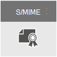

# E-postkryptering

I den här artikeln jämförs krypteringsalternativ i Microsoft 365, till exempel Meddelandekryptering i Office 365 (OME), S/MIME och Information Rights Management (IRM). Dessutom presenteras Transport Layer Security (TLS).
  
Microsoft 365 innehåller flera krypteringsalternativ så att du kan möta verksamhetens behov för e-postsäkerhet. I den här artikeln presenteras tre sätt att kryptera e-post i Office 365. Om du vill veta mer om alla säkerhetsfunktioner i Office 365 kan du gå till [Office 365 Säkerhetscenter](https://go.microsoft.com/fwlink/p/?LinkID=282470). I den här artikeln presenteras tre krypteringstyper som är tillgängliga för Microsoft 365-administratörer för att skydda e-post i Office 365:
  
- Meddelandekryptering i Office (OME).

- Secure/Multipurpose Internet Mail Extensions (S/MIME).

- Information Rights Management (IRM).

## Så här används e-postkryptering i Microsoft 365

Kryptering är en process för att koda information så att endast en auktoriserad mottagare kan avkoda och använda informationen. Microsoft 365 använder kryptering på två sätt: i tjänsten och som kundkontroll. I tjänsten används kryptering i Microsoft 365 som standard. Du behöver inte konfigurera något. Microsoft 365 använder till exempel Transport Layer Security (TLS) för att kryptera anslutningen, eller sessionen, mellan två servrar. 
  
Så här fungerar e-postkryptering i regel:
  
- Ett meddelande krypteras, eller omvandlas från klartext till oläslig chiffertext, antingen på avsändarens dator eller av en central server när meddelandet överförs.

- Meddelandet förblir i chiffertext medan det överförs för att skydda det från att läsas ifall meddelandet snappas upp.

- När mottagaren har tagit emot meddelandet omvandlas meddelandet till läsbar klartext på något av följande sätt:

  - Mottagarens dator använder en nyckel för att dekryptera meddelandet, eller

  - En central server dekrypterar meddelandet åt mottagaren efter att mottagarens identitet har validerats.

Mer information om hur Microsoft 365 skyddar kommunikationen mellan servrar, till exempel mellan organisationer inom Microsoft 365 eller mellan Microsoft 365 och en betrodd företagspartner utanför Microsoft 365, finns i [Hur Exchange Online använder TLS för att säkra e-postanslutningar i Office 365](exchange-online-uses-tls-to-secure-email-connections.md).
    
## Jämföra krypteringsalternativ för e-post i Office 365

|Teknik för e-postkryptering||||
|:-----|:-----|:-----|:-----|
|Vad handlar det här om?|Meddelandekryptering i Office 365 (OME) är en tjänst som bygger på Microsoft Azure AD Rights Management (Azure RMS) som gör att du kan skicka krypterad e-post till personer inom eller utanför din organisation, oavsett målets e-postadress (Gmail, Yahoo! Mail, Outlook.com m.m.)   Som administratör kan du konfigurera transportregler som definierar krypteringsvillkoren. När en användare skickar ett meddelande som matchar en regel tillämpas krypteringen automatiskt.   Om mottagarna vill visa krypterade meddelanden kan de antingen få ett engångslösenord, logga in med ett Microsoft-konto eller logga in med ett arbets- eller skolkonto som är kopplat till Office 365. Mottagarna kan också skicka krypterade svar. De behöver inte en prenumeration på Microsoft 365 för att kunna visa krypterade meddelanden eller skicka krypterade svar.|IRM är en krypteringslösning som även tillämpar användningsbegränsningar för e-postmeddelanden. Det bidrar till att förhindra att känslig information skrivs ut, vidarebefordras eller kopieras av obehöriga personer.   IRM-funktioner i Microsoft 365 använder Azure Rights Management (Azure RMS).|S/MIME är en certifikatbaserad krypteringslösning som gör det möjligt att både kryptera ett meddelande och signera det digitalt. Meddelandekryptering ser till att endast den avsedda mottagaren kan öppna och läsa meddelandet. Med en digital signatur kan mottagaren verifiera avsändarens identitet.   Både digitala signaturer och meddelandekryptering möjliggörs tack vare användningen av unika digitala certifikat som innehåller nycklarna för att verifiera digitala signaturer och kryptera eller dekryptera meddelanden.   För att använda S/MIME måste du ha offentliga nycklar för varje mottagare. Mottagarna måste ta hand om sina egna privata nycklar, som måste vara säkra. Om en mottagares privata nycklar har komprometterats måste mottagaren få en ny privat nyckel och distribuera offentliga nycklar till alla avsändare igen.|
|Vad gör den?|OME:   Krypterar meddelanden som skickas till interna eller externa mottagare.    Det gör att användare kan skicka krypterade meddelanden till valfri e-postadress, till exempel Outlook.com, Yahoo! Mail och Gmail.    Gör att du som administratör kan anpassa portalen för e-postvisning så att den återspeglar organisationens varumärke.   Microsoft hanterar och lagrar nycklarna på ett säkert sätt, så att du inte behöver göra det.   Ingen särskild programvara på klientsidan behövs så länge det krypterade meddelandet (skickas som en HTML-bilaga) kan öppnas i en webbläsare.|IRM:   Använder kryptering och användningsbegränsningar för att ge online- och offlineskydd för e-postmeddelanden och bilagor.   Ger dig som administratör möjlighet att konfigurera transportregler eller Outlook-skyddsregler som automatiskt tillämpar IRM på utvalda meddelanden.   Gör att användare kan använda mallar i Outlook eller Outlook på webben (kallades tidigare Outlook Web App) manuellt.|S/MIME använder digitala signaturer för avsändarautentisering och kryptering för meddelandekonfidentialitet.|
|Vad gör den inte?|Du kan inte använda användningsbegränsningar för meddelanden med OME. Du kan till exempel inte använda det för att hindra en mottagare från att vidarebefordra eller skriva ut ett krypterat meddelande.|Vissa program kanske inte har stöd för IRM för e-post på alla enheter. Mer information om dessa och andra produkter som stöder IRM för e-post finns i[funktioner för klientenhet](/azure/information-protection/requirements#BKMK_ClientCapabilities).|Det går inte att genomsöka krypterade meddelanden efter skadlig kod, skräppost eller principer med S/MIME.|
|Rekommendationer och exempelscenarier|Vi rekommenderar att du använder OME när du vill skicka känslig affärsinformation till personer utanför din organisation, oavsett om det är till konsumenter eller andra företag. Till exempel:     En bankanställd som skickar kreditkortsutdrag till kunder     En läkarmottagning som skickar patientjournaler till en patient     En jurist som skickar konfidentiell juridisk information till en annan jurist|Vi rekommenderar att du använder IRM när du vill tillämpa användningsbegränsningar och kryptering. Till exempel:     En chef som skickar konfidentiell information till sitt team om en ny produkt använder alternativet ”Vidarebefordra inte”.     En chef som måste dela ett offertförslag med ett annat företag, som innehåller en bifogad fil från en partner som använder Office 365, och som kräver att både e-postmeddelandet och bilagan skyddas.|Vi rekommenderar att du använder S/MIME när antingen din organisation eller mottagarens organisation kräver sann peer to peer-kryptering.     S/MIME används ofta i följande scenarier:     Myndigheter som kommunicerar med andra myndigheter     Ett företag som kommunicerar med en myndighet|
||

## Vilka krypteringsalternativ finns det för min Microsoft 365-prenumeration?

Mer information om krypteringsalternativ för e-post för din Microsoft 365-prenumeration finns i [beskrivningen av Exchange Online-tjänsten](/office365/servicedescriptions/exchange-online-service-description/exchange-online-service-description). Här hittar du information om följande krypteringsfunktioner:
  
- Azure RMS, inklusive både IRM-funktioner och OME

- S/MIME

- TLS

- Kryptering av vilande data (via BitLocker)

Du kan också använda krypteringsverktyg från tredje part med Microsoft 365, till exempel PGP (Pretty Good Privacy). Microsoft 365 stöder inte PGP/MIME och du kan bara använda PGP/Inline för att skicka och ta emot PGP-krypterade e-postmeddelanden.

## Vad gäller för kryptering av vilande data?

”Vilande data” avser data som inte överförs aktivt. I Microsoft 365 krypteras vilade e-postdata med BitLocker-diskkryptering. BitLocker krypterar hårddiskarna i Microsoft-datacenter för att ge förbättrat skydd mot obehörig åtkomst. Mer information finns i [Översikt över BitLocker](/previous-versions/windows/it-pro/windows-server-2012-R2-and-2012/hh831713(v=ws.11)).
  
## Mer information om krypteringsalternativ för e-post

Mer information om krypteringsalternativen för e-post i den här artikeln samt TLS finns i följande artiklar:
  
**OME**
  
[Meddelandekryptering i Office 365 (OME)](ome.md)
  
**IRM**
  
[Information Rights Management i Exchange Online](./information-rights-management-in-exchange-online.md)
  
[Vad är Azure Rights Management?](/azure/information-protection/what-is-azure-rms)
  
**S/MIME**
  
[S/MIME för signering och kryptering av meddelanden](/Exchange/policy-and-compliance/smime/smime)
  
[Förstå S/MIME](/previous-versions/tn-archive/aa995740(v=exchg.65))
  
[Förstå kryptering med offentlig nyckel](/previous-versions/tn-archive/aa998077(v=exchg.65))
  
**TLS**
  
[Konfigurera anpassade e-postflöden med hjälp av anslutningar](/exchange/mail-flow-best-practices/use-connectors-to-configure-mail-flow/use-connectors-to-configure-mail-flow)
