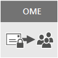

# E-postkrypteringEmail encryption

I den här artikeln jämförs krypteringsalternativ i Microsoft 365, till exempel Meddelandekryptering i Office 365 (OME), S/MIME och Information Rights Management (IRM). Dessutom presenteras Transport Layer Security (TLS).This article compares encryption options in Microsoft 365 including Office 365 Message Encryption (OME), S/MIME, Information Rights Management (IRM), and introduces Transport Layer Security (TLS).
  
Microsoft 365 innehåller flera krypteringsalternativ så att du kan möta verksamhetens behov för e-postsäkerhet.Microsoft 365 delivers multiple encryption options to help you meet your business needs for email security. I den här artikeln presenteras tre sätt att kryptera e-post i Office 365.This article presents three ways to encrypt email in Office 365. Om du vill veta mer om alla säkerhetsfunktioner i Office 365 kan du gå till [Office 365 Säkerhetscenter](https://go.microsoft.com/fwlink/p/?LinkID=282470).If you want to learn more about all security features in Office 365, visit the [Office 365 Trust Center](https://go.microsoft.com/fwlink/p/?LinkID=282470). I den här artikeln presenteras tre krypteringstyper som är tillgängliga för Microsoft 365-administratörer för att skydda e-post i Office 365:This article introduces the three types of encryption available for Microsoft 365 administrators to help secure email in Office 365:
  
- Meddelandekryptering i Office (OME).Office Message Encryption (OME).

- Secure/Multipurpose Internet Mail Extensions (S/MIME).Secure/Multipurpose Internet Mail Extensions (S/MIME).

- Information Rights Management (IRM).Information Rights Management (IRM).

## Så här används e-postkryptering i Microsoft 365How Microsoft 365 uses email encryption

Kryptering är en process för att koda information så att endast en auktoriserad mottagare kan avkoda och använda informationen.Encryption is the process by which information is encoded so that only an authorized recipient can decode and consume the information. Microsoft 365 använder kryptering på två sätt: i tjänsten och som kundkontroll.Microsoft 365 uses encryption in two ways: in the service, and as a customer control. I tjänsten används kryptering i Microsoft 365 som standard. Du behöver inte konfigurera något.In the service, encryption is used in Microsoft 365 by default; you don't have to configure anything. Microsoft 365 använder till exempel Transport Layer Security (TLS) för att kryptera anslutningen, eller sessionen, mellan två servrar.For example, Microsoft 365 uses Transport Layer Security (TLS) to encrypt the connection, or session, between two servers. 
  
Så här fungerar e-postkryptering i regel:Here's how email encryption typically works:
  
- Ett meddelande krypteras, eller omvandlas från klartext till oläslig chiffertext, antingen på avsändarens dator eller av en central server när meddelandet överförs.A message is encrypted, or transformed from plain text into unreadable ciphertext, either on the sender's machine, or by a central server while the message is in transit.

- Meddelandet förblir i chiffertext medan det överförs för att skydda det från att läsas ifall meddelandet snappas upp.The message remains in ciphertext while it's in transit in order to protect it from being read in case the message is intercepted.

- När mottagaren har tagit emot meddelandet omvandlas meddelandet till läsbar klartext på något av följande sätt:Once the message is received by the recipient, the message is transformed back into readable plain text in one of two ways:

  - Mottagarens dator använder en nyckel för att dekryptera meddelandet, ellerThe recipient's machine uses a key to decrypt the message, or

  - En central server dekrypterar meddelandet åt mottagaren efter att mottagarens identitet har validerats.A central server decrypts the message on behalf of the recipient, after validating the recipient's identity.

Mer information om hur Microsoft 365 skyddar kommunikationen mellan servrar, till exempel mellan organisationer inom Microsoft 365 eller mellan Microsoft 365 och en betrodd företagspartner utanför Microsoft 365, finns i [Hur Exchange Online använder TLS för att säkra e-postanslutningar i Office 365](exchange-online-uses-tls-to-secure-email-connections.md).For more information on how Microsoft 365 secures communication between servers, such as between organizations within Microsoft 365 or between Microsoft 365 and a trusted business partner outside of Microsoft 365, see [How Exchange Online uses TLS to secure email connections in Office 365](exchange-online-uses-tls-to-secure-email-connections.md).
    
## Jämföra krypteringsalternativ för e-post i Office 365Comparing email encryption options available in Office 365

|Teknik för e-postkrypteringEmail encryption technology||||
|:-----|:-----|:-----|:-----|
|Vad handlar det här om?What is it?|Meddelandekryptering i Office 365 (OME) är en tjänst som bygger på Microsoft Azure AD Rights Management (Azure RMS) som gör att du kan skicka krypterad e-post till personer inom eller utanför din organisation, oavsett målets e-postadress (Gmail, Yahoo! Mail, Outlook.com m.m.)Office 365 Message Encryption (OME) is a service built on Azure Rights Management (Azure RMS) that lets you send encrypted email to people inside or outside your organization, regardless of the destination email address (Gmail, Yahoo! Mail, Outlook.com, etc.).   Som administratör kan du konfigurera transportregler som definierar krypteringsvillkoren.As an admin, you can set up transport rules that define the conditions for encryption. När en användare skickar ett meddelande som matchar en regel tillämpas krypteringen automatiskt.When a user sends a message that matches a rule, encryption is applied automatically.   Om mottagarna vill visa krypterade meddelanden kan de antingen få ett engångslösenord, logga in med ett Microsoft-konto eller logga in med ett arbets- eller skolkonto som är kopplat till Office 365.To view encrypted messages, recipients can either get a one-time passcode, sign in with a Microsoft account, or sign in with a work or school account associated with Office 365. Mottagarna kan också skicka krypterade svar.Recipients can also send encrypted replies. De behöver inte en prenumeration på Microsoft 365 för att kunna visa krypterade meddelanden eller skicka krypterade svar.They don't need a Microsoft 365 subscription to view encrypted messages or send encrypted replies.|IRM är en krypteringslösning som även tillämpar användningsbegränsningar för e-postmeddelanden.IRM is an encryption solution that also applies usage restrictions to email messages. Det bidrar till att förhindra att känslig information skrivs ut, vidarebefordras eller kopieras av obehöriga personer.It helps prevent sensitive information from being printed, forwarded, or copied by unauthorized people.   IRM-funktioner i Microsoft 365 använder Azure Rights Management (Azure RMS).IRM capabilities in Microsoft 365 use Azure Rights Management (Azure RMS).|S/MIME är en certifikatbaserad krypteringslösning som gör det möjligt att både kryptera ett meddelande och signera det digitalt.S/MIME is a certificate-based encryption solution that allows you to both encrypt and digitally sign a message. Meddelandekryptering ser till att endast den avsedda mottagaren kan öppna och läsa meddelandet.The message encryption helps ensure that only the intended recipient can open and read the message. Med en digital signatur kan mottagaren verifiera avsändarens identitet.A digital signature helps the recipient validate the identity of the sender.   Både digitala signaturer och meddelandekryptering möjliggörs tack vare användningen av unika digitala certifikat som innehåller nycklarna för att verifiera digitala signaturer och kryptera eller dekryptera meddelanden.Both digital signatures and message encryption are made possible through the use of unique digital certificates that contain the keys for verifying digital signatures and encrypting or decrypting messages.   För att använda S/MIME måste du ha offentliga nycklar för varje mottagare.To use S/MIME, you must have public keys on file for each recipient. Mottagarna måste ta hand om sina egna privata nycklar, som måste vara säkra.Recipients have to maintain their own private keys, which must remain secure. Om en mottagares privata nycklar har komprometterats måste mottagaren få en ny privat nyckel och distribuera offentliga nycklar till alla avsändare igen.If a recipient's private keys are compromised, the recipient needs to get a new private key and redistribute public keys to all potential senders.|
|Vad gör den?What does it do?|OME:OME:   Krypterar meddelanden som skickas till interna eller externa mottagare.Encrypts messages sent to internal or external recipients.    Det gör att användare kan skicka krypterade meddelanden till valfri e-postadress, till exempel Outlook.com, Yahoo! Mail och Gmail.Allows users to send encrypted messages to any email address, including Outlook.com, Yahoo! Mail, and Gmail.    Gör att du som administratör kan anpassa portalen för e-postvisning så att den återspeglar organisationens varumärke.Allows you, as an admin, to customize the email viewing portal to reflect your organization's brand.   Microsoft hanterar och lagrar nycklarna på ett säkert sätt, så att du inte behöver göra det.Microsoft securely manages and stores the keys, so you don't have to.   Ingen särskild programvara på klientsidan behövs så länge det krypterade meddelandet (skickas som en HTML-bilaga) kan öppnas i en webbläsare.No special client side software is needed as long as the encrypted message (sent as an HTML attachment) can be opened in a browser.|IRM:IRM:   Använder kryptering och användningsbegränsningar för att ge online- och offlineskydd för e-postmeddelanden och bilagor.Uses encryption and usage restrictions to provide online and offline protection for email messages and attachments.   Ger dig som administratör möjlighet att konfigurera transportregler eller Outlook-skyddsregler som automatiskt tillämpar IRM på utvalda meddelanden.Gives you, as an admin, the ability to set up transport rules or Outlook protection rules to automatically apply IRM to select messages.   Gör att användare kan använda mallar i Outlook eller Outlook på webben (kallades tidigare Outlook Web App) manuellt.Lets users manually apply templates in Outlook or Outlook on the web (formerly known as Outlook Web App).|S/MIME använder digitala signaturer för avsändarautentisering och kryptering för meddelandekonfidentialitet.S/MIME addresses sender authentication with digital signatures, and message confidentiality with encryption.|
|Vad gör den inte?What does it not do?|Du kan inte använda användningsbegränsningar för meddelanden med OME.OME doesn't let you apply usage restrictions to messages. Du kan till exempel inte använda det för att hindra en mottagare från att vidarebefordra eller skriva ut ett krypterat meddelande.For example, you can't use it to stop a recipient from forwarding or printing an encrypted message.|Vissa program kanske inte har stöd för IRM för e-post på alla enheter.Some applications may not support IRM emails on all devices. Mer information om dessa och andra produkter som stöder IRM för e-post finns i[funktioner för klientenhet](/azure/information-protection/requirements#BKMK_ClientCapabilities).For more information about these and other products that support IRM email, see [Client device capabilities](/azure/information-protection/requirements#BKMK_ClientCapabilities).|Det går inte att genomsöka krypterade meddelanden efter skadlig kod, skräppost eller principer med S/MIME.S/MIME doesn't allow encrypted messages to be scanned for malware, spam, or policies.|
|Rekommendationer och exempelscenarierRecommendations and example scenarios|Vi rekommenderar att du använder OME när du vill skicka känslig affärsinformation till personer utanför din organisation, oavsett om det är till konsumenter eller andra företag. Till exempel:We recommend using OME when you want to send sensitive business information to people outside your organization, whether they're consumers or other businesses. For example:     En bankanställd som skickar kreditkortsutdrag till kunderA bank employee sending credit card statements to customers     En läkarmottagning som skickar patientjournaler till en patientA doctor's office sending medical records to a patient     En jurist som skickar konfidentiell juridisk information till en annan juristAn attorney sending confidential legal information to another attorney|Vi rekommenderar att du använder IRM när du vill tillämpa användningsbegränsningar och kryptering. Till exempel:We recommend using IRM when you want to apply usage restrictions as well as encryption. For example:     En chef som skickar konfidentiell information till sitt team om en ny produkt använder alternativet ”Vidarebefordra inte”.A manager sending confidential details to her team about a new product applies the "Do Not Forward" option.     En chef som måste dela ett offertförslag med ett annat företag, som innehåller en bifogad fil från en partner som använder Office 365, och som kräver att både e-postmeddelandet och bilagan skyddas.An executive needs to share a bid proposal with another company, which includes an attachment from a partner who is using Office 365, and require both the email and the attachment to be protected.|Vi rekommenderar att du använder S/MIME när antingen din organisation eller mottagarens organisation kräver sann peer to peer-kryptering.We recommend using S/MIME when either your organization or the recipient's organization requires true peer-to-peer encryption.     S/MIME används ofta i följande scenarier:S/MIME is most commonly used in the following scenarios:     Myndigheter som kommunicerar med andra myndigheterGovernment agencies communicating with other government agencies     Ett företag som kommunicerar med en myndighetA business communicating with a government agency|
||

## Vilka krypteringsalternativ finns det för min Microsoft 365-prenumeration?What encryption options are available for my Microsoft 365 subscription?

Mer information om krypteringsalternativ för e-post för din Microsoft 365-prenumeration finns i [beskrivningen av Exchange Online-tjänsten](/office365/servicedescriptions/exchange-online-service-description/exchange-online-service-description).For information about email encryption options for your Microsoft 365 subscription see the [Exchange Online service description](/office365/servicedescriptions/exchange-online-service-description/exchange-online-service-description). Här hittar du information om följande krypteringsfunktioner:Here, you can find information about the following encryption features:
  
- Azure RMS, inklusive både IRM-funktioner och OMEAzure RMS, including both IRM capabilities and OME

- S/MIMES/MIME

- TLSTLS

- Kryptering av vilande data (via BitLocker)Encryption of data at rest (through BitLocker)

Du kan också använda krypteringsverktyg från tredje part med Microsoft 365, till exempel PGP (Pretty Good Privacy).You can also use third-party encryption tools with Microsoft 365, for example, PGP (Pretty Good Privacy). Microsoft 365 stöder inte PGP/MIME och du kan bara använda PGP/Inline för att skicka och ta emot PGP-krypterade e-postmeddelanden.Microsoft 365 does not support PGP/MIME and you can only use PGP/Inline to send and receive PGP-encrypted emails.

## Vad gäller för kryptering av vilande data?What about encryption for data at rest?

”Vilande data” avser data som inte överförs aktivt."Data at rest" refers to data that isn't actively in transit. I Microsoft 365 krypteras vilade e-postdata med BitLocker-diskkryptering.In Microsoft 365, email data at rest is encrypted using BitLocker Drive Encryption. BitLocker krypterar hårddiskarna i Microsoft-datacenter för att ge förbättrat skydd mot obehörig åtkomst.BitLocker encrypts the hard drives in Microsoft datacenters to provide enhanced protection against unauthorized access. Mer information finns i [Översikt över BitLocker](/previous-versions/windows/it-pro/windows-server-2012-R2-and-2012/hh831713(v=ws.11)).To learn more, see [BitLocker Overview](/previous-versions/windows/it-pro/windows-server-2012-R2-and-2012/hh831713(v=ws.11)).
  
## Mer information om krypteringsalternativ för e-postMore information about email encryption options

Mer information om krypteringsalternativen för e-post i den här artikeln samt TLS finns i följande artiklar:For more information about the email encryption options in this article as well as TLS, see these articles:
  
**OME****OME**
  
[Meddelandekryptering i Office 365 (OME)Office 365 Message Encryption (OME)](ome.md)
  
**IRM****IRM**
  
[Information Rights Management i Exchange OnlineInformation Rights Management in Exchange Online](./information-rights-management-in-exchange-online.md)
  
[Vad är Azure Rights Management?What is Azure Rights Management?](/azure/information-protection/what-is-azure-rms)
  
**S/MIME****S/MIME**
  
[S/MIME för signering och kryptering av meddelandenS/MIME for message signing and encryption](/Exchange/policy-and-compliance/smime/smime)
  
[Förstå S/MIME](/previous-versions/tn-archive/aa995740(v=exchg.65))[Understanding S/MIME](/previous-versions/tn-archive/aa995740(v=exchg.65))
  
[Förstå kryptering med offentlig nyckel](/previous-versions/tn-archive/aa998077(v=exchg.65))[Understanding Public Key Cryptography](/previous-versions/tn-archive/aa998077(v=exchg.65))
  
**TLS****TLS**
  
[Konfigurera anpassade e-postflöden med hjälp av anslutningarConfigure custom mail flow by using connectors](/exchange/mail-flow-best-practices/use-connectors-to-configure-mail-flow/use-connectors-to-configure-mail-flow)
