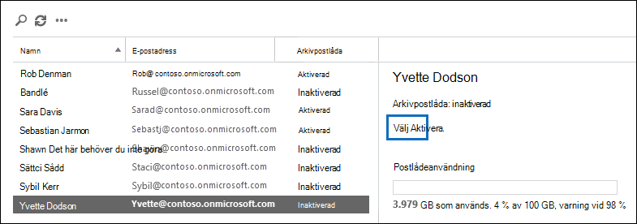

# <a name="enable-archive-mailboxes-in-the-compliance-center"></a>Aktivera arkivpostlådor i efterlevnadscentret

Med arkivering i Microsoft 365 (även kallat *Arkivering i Office 365*) får användarna ytterligare lagringsutrymme för e-post. När du har aktiverat arkivpostlådor kan användare komma åt och lagra meddelanden i sina arkivpostlådor med hjälp av Microsoft Outlook och Outlook på webben (tidigare kallat Outlook Web App). Användare kan också flytta eller kopiera meddelanden mellan sin primära postlåda och sin arkivpostlåda. De kan också återskapa borttagna objekt från mappen Återställningsbara objekt i arkivpostlådan med hjälp av verktyget Återskapa borttagna objekt.

> [!NOTE]
> Den automatiskt expanderande arkiveringsfunktionen i Microsoft 365 ger arkivpostlådorna ytterligare lagringsutrymme. När automatisk arkiveringsexpansion är aktiverad och den första lagringskvoten i en användares arkivpostlåda uppnås, lägger Microsoft 365 automatiskt till ytterligare lagringsutrymme. Det innebär att användarnas lagringsutrymme för e-post inte tar slut och att du inte behöver hantera något efter att du har aktiverat arkivpostlådan och automatisk arkiveringsexpansion för organisationen. Mer information finns i [Översikt över obegränsad arkivering](unlimited-archiving.md).

## <a name="get-the-necessary-permissions"></a>Hämta nödvändiga behörigheter

Du måste ha tilldelats rollen E-postmottagare i Exchange Online för att aktivera eller inaktivera arkivpostlådor. Som standard tilldelas de här rollerna till rollgrupperna för Mottagarhantering och Organisationshantering på sidan **Behörigheter** i administrationscentret för Exchange. Om du inte ser sidan **Arkivering** i Säkerhets- och efterlevnadscentret ber du administratören att tilldela dig de behörigheter som krävs.

## <a name="enable-an-archive-mailbox"></a>Aktivera arkivpostlåda

1. Gå till <https://protection.office.com>.

2. Logga in med ditt arbets- eller skolkonto.

3. Klicka på **Informationsstyrning** \>**Arkiv** i vänster fönsterruta i Säkerhets- och efterlevnadscentret.

   Sidan **Arkiv** visas. Kolumnen för **Arkivpostlådan** anger om en arkivpostlåda är aktiverad eller inaktiverad för varje användare.

   > [!NOTE]
   > Sidan **Arkiv** visar högst 500 användare.

4. Markera användaren som du vill aktivera arkivpostlådan för i listan över postlådor.

   

5. I informationsfönstret för den valda användaren klickar du på **Aktivera**.

   En varning förklarar att när du aktiverar arkivpostlådan så flyttas objekt i användarens postlåda som är äldre än den tilldelade arkiveringsprincipen till den nya arkivpostlådan. Den standardarkiveringsprincip som är en del av kvarhållningsprincipen som tilldelas Exchange Online-postlådor flyttar objekt till arkivpostlådan två år efter det datum då objektet levererades till postlådan eller skapades av användaren. Du hittar mer information i avsnittet **Mer information** i den här artikeln.

6. Klicka **Ja** för att aktivera arkivpostlådan.

   Det kan ta en stund att skapa arkivpostlådan. När den har skapats visas **Arkivpostlåda: aktiverad** i informationsfönstret för den valda användaren. Du kanske måste klicka på **Uppdatera**  för att uppdatera informationen i informationsfönstret.

> [!TIP]
> Du kan även massaktivera arkivpostlådor genom att välja flera användare med inaktiverade arkivpostlådor (använd Skift- eller Ctrl-tangenterna).  När du har valt flera postlådor klickar du på **Aktivera** i informationsfönstret.

## <a name="disable-an-archive-mailbox"></a>Inaktivera en arkivpostlåda

Du kan även använda sidan **Arkivera** i Säkerhets- och efterlevnadscentret för att inaktivera en användares arkivpostlåda. När du inaktiverat en arkivpostlåda kan du återansluta den till användarens primära postlåda inom 30 dagar efter att du inaktiverat den. I det här fallet återställs det ursprungliga innehållet i arkivpostlådan. Efter 30 dagar tas innehållet i den ursprungliga arkivpostlådan bort permanent och kan inte återställas. Om du återaktivera arkivet mer än 30 dagar efter att du inaktiverat det skapas en ny arkivpostlåda.

Standardarkiveringsprincipen som tilldelas användarnas postlådor flyttar objekt till arkivpostlådan två år efter objektets leveransdatum. Om du inaktiverar en användares arkivpostlåda vidtas inga åtgärder på postlådeobjekten och de finns kvar i användarens primära postlåda.

Så här inaktiverar du en arkivpostlåda:

1. Gå till <https://protection.office.com>.

2. Logga in med ditt arbets- eller skolkonto.

3. Klicka på **Informationsstyrning** \>**Arkiv** i vänster fönsterruta i Säkerhets- och efterlevnadscentret.

   Sidan **Arkiv** visas. Kolumnen för **Arkivpostlådan** anger om en arkivpostlåda är aktiverad eller inaktiverad för varje användare.

   > [!NOTE]
   > Sidan **Arkiv** visar högst 500 användare.

4. Markera användaren som du vill inaktivera arkivpostlådan för i listan över postlådor.

5. Klicka på **Inaktivera** i informationsfönstret.

   Ett varningsmeddelande informerar dig om att du har 30 dagar på dig att aktivera arkivpostlådan på nytt, och att all information i arkivet tas bort permanent efter 30 dagar.

6. Klicka **Ja** för att inaktivera arkivpostlådan.

   Det kan ta en stund att inaktivera arkivpostlådan. När den är inaktiverad visas **Arkivpostlåda: inaktiverad** i informationsfönstret för den valda användaren. Du kanske måste klicka på **Uppdatera**  för att uppdatera informationen i informationsfönstret.

> [!TIP]
> Du kan även massinaktivera arkivpostlådor genom att välja flera användare med aktiverade arkivpostlådor (använd Skift- eller Ctrl-tangenterna).  När du har valt flera postlådor klickar du på **Inaktivera** i informationsfönstret.

## <a name="use-exchange-online-powershell-to-enable-or-disable-archive-mailboxes"></a>Använd Exchange Online PowerShell för att aktivera eller inaktivera arkivpostlådor.

Du kan även använda Exchange Online PowerShell för att aktivera eller inaktivera arkivpostlådor. Den primära orsaken till att använda PowerShell är att du snabbt kan aktivera arkivpostlådan för alla användare i organisationen.

Det första steget är att ansluta till Exchange Online PowerShell. För instruktioner se: [Ansluta till Exchange Online PowerShell](/powershell/exchange/connect-to-exchange-online-powershell).

När du är ansluten till Exchange Online kan du köra kommandona i följande avsnitt för att aktivera eller inaktivera arkivpostlådor.

### <a name="enable-archive-mailboxes"></a>Aktivera arkivpostlådor

Kör följande kommando för att aktivera arkivpostlådan för en enskild användare.

```powershell
Enable-Mailbox -Identity <username> -Archive
```

Kör följande kommando för att aktivera arkivpostlådan för alla användare i organisationen (vars arkivpostlåda för närvarande inte är aktiverad).

```powershell
Get-Mailbox -Filter {ArchiveGuid -Eq "00000000-0000-0000-0000-000000000000" -AND RecipientTypeDetails -Eq "UserMailbox"} | Enable-Mailbox -Archive
```

### <a name="disable-archive-mailboxes"></a>Inaktivera arkivpostlådor

Kör följande kommando för att inaktivera arkivpostlådan för en enskild användare.

```powershell
Disable-Mailbox -Identity <username> -Archive
```

Kör följande kommando för att inaktivera arkivpostlådan för alla användare i organisationen (vars arkivpostlåda för närvarande är aktiverad).

```powershell
Get-Mailbox -Filter {ArchiveGuid -Ne "00000000-0000-0000-0000-000000000000" -AND RecipientTypeDetails -Eq "UserMailbox"} | Disable-Mailbox -Archive
```

## <a name="more-information"></a>Mer information

- När en arkivpostlåda är aktiverad kan användarna lagra meddelanden i sin arkivpostlåda. Användarna kan komma åt sina arkivpostlådor genom att använda av Microsoft Outlook och Outlook på webben. Genom att använda ett av dessa klientprogram kan användarna visa meddelanden i sin arkivpostlåda och flytta eller kopiera meddelanden mellan sin primära postlåda och arkivpostlådan. Användarna kan även återskapa borttagna objekt från mappen Återställningsbara objekt i arkivpostlådan med hjälp av verktyget Återskapa borttagna objekt.

  För att se en lista över Outlook-licenser som har stöd för lokal arkivering, gå till [Licenskrav i Outlook för Exchange-funktioner](https://support.microsoft.com/office/46b6b7c5-c3ca-43e5-8424-1e2807917c99).

- Med arkivpostlådor kan du och användarna uppfylla organisationens krav på kvarhållning, eDiscovery och bevarande. Du kan till exempel använda organisationens kvarhållningsprincip för Exchange för att flytta postlådeinnehåll till användarnas arkivpostlåda. När du använder verktyget Innehållssökning i Säkerhets- och efterlevnadscentret för att söka i en användares postlåda efter specifikt innehåll genomsöks även användarens arkivpostlåda. Och när du placerar ett Bevarande av juridiska skäl eller tillämpar en kvarhållningsprincip på en användares postlåda sparas även objekten i arkivpostlådan.

- När arkivpostlådor har aktiverats kan organisationen dra nytta av standardprincipen för Exchange-kvarhållning (även kallad Messaging Records Management eller MRM-principen) som automatiskt tilldelas till alla postlådor. När en arkivpostlåda är aktiverad gör standardprincipen för Exchange-kvarhållning automatiskt följande:

  - Flyttar objekt som är äldre än två år från en användares primära postlåda till deras arkivpostlåda.

  - Flyttar objekt som är äldre än 14 dagar från mappen Återställningsbara objekt i användarens primära postlåda till mappen Återställningsbara objekt i arkivpostlådan.

- Mer information om arkivpostlådor och kvarhållningsprinciper för Exchange finns i:

  - [Kvarhållningstaggar och kvarhållningsprinciper i Exchange Online](/exchange/security-and-compliance/messaging-records-management/retention-tags-and-policies)

  - [Standardprincip för kvarhållning i Exchange Online](/exchange/security-and-compliance/messaging-records-management/default-retention-policy)

  - [Konfigurera en princip för arkivering och borttagning för postlådor i din organisation](set-up-an-archive-and-deletion-policy-for-mailboxes.md)