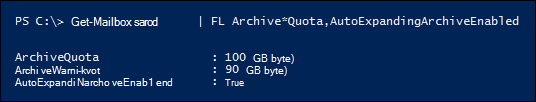

# <a name="enable-unlimited-archiving---admin-help"></a><span data-ttu-id="226d4-104">Aktivera obegränsad arkivering – hjälp för administratörer</span><span class="sxs-lookup"><span data-stu-id="226d4-104">Enable unlimited archiving - Admin Help</span></span>

<span data-ttu-id="226d4-105">Du kan använda den Exchange Online automatiskt expanderande arkiveringsfunktionen för att aktivera obegränsat lagringsutrymme för arkivpostlådor.</span><span class="sxs-lookup"><span data-stu-id="226d4-105">You can use the Exchange Online auto-expanding archiving feature to enable unlimited storage space for archive mailboxes.</span></span> <span data-ttu-id="226d4-106">När automatiskt expanderande arkivering är aktiverat läggs ytterligare lagringsutrymme automatiskt till i en användares arkivpostlåda när den närmar sig lagringsgränsen.</span><span class="sxs-lookup"><span data-stu-id="226d4-106">When auto-expanding archiving is turned on, additional storage space is automatically added to a user's archive mailbox when it approaches the storage limit.</span></span> <span data-ttu-id="226d4-107">Resultatet är en obegränsad lagringskapacitet för postlådor.</span><span class="sxs-lookup"><span data-stu-id="226d4-107">The result is unlimited mailbox storage capacity.</span></span> <span data-ttu-id="226d4-108">Du kan aktivera automatisk expandering av arkivering för alla i organisationen eller bara för vissa användare.</span><span class="sxs-lookup"><span data-stu-id="226d4-108">You can turn on auto-expanding archiving for everyone in your organization or just for specific users.</span></span> <span data-ttu-id="226d4-109">Mer information om automatiskt expanderande arkivering finns i [Översikt över obegränsat arkivering i Office 365](unlimited-archiving.md).</span><span class="sxs-lookup"><span data-stu-id="226d4-109">For more information about auto-expanding archiving, see [Overview of unlimited archiving in Office 365](unlimited-archiving.md).</span></span>

## <a name="before-you-enable-auto-expanding-archiving"></a><span data-ttu-id="226d4-110">Innan du aktiverar automatisk expandering av arkivering</span><span class="sxs-lookup"><span data-stu-id="226d4-110">Before you enable auto-expanding archiving</span></span>

- <span data-ttu-id="226d4-111">Du måste vara global administratör i organisationen eller medlem i rollgruppen Organisationshantering i Exchange Online-organisationen för att kunna aktivera automatisk expandering av arkivering för hela organisationen eller för specifika användare.</span><span class="sxs-lookup"><span data-stu-id="226d4-111">You have to be a global administrator in your organization or a member of the Organization Management role group in your Exchange Online organization to enable auto-expanding archiving for your entire organization or for specific users.</span></span> <span data-ttu-id="226d4-112">Alternativt måste du vara medlem i en rollgrupp som har tilldelats rollen E-postmottagare för att kunna aktivera automatisk arkivering för specifika användare.</span><span class="sxs-lookup"><span data-stu-id="226d4-112">Alternately, you have to be a member of a role group that's assigned the Mail Recipients role to enable auto-expanding archiving for specific users.</span></span>

- <span data-ttu-id="226d4-113">En användares arkivpostlåda måste aktiveras innan du kan aktivera automatisk expandering av arkivering.</span><span class="sxs-lookup"><span data-stu-id="226d4-113">A user's archive mailbox has to be enabled before you can enable auto-expanding archiving.</span></span> <span data-ttu-id="226d4-114">En användare måste ha tilldelats en licens Exchange Online abonnemang 2 för att aktivera arkivpostlådan.</span><span class="sxs-lookup"><span data-stu-id="226d4-114">A user must be assigned an Exchange Online Plan 2 license to enable the archive mailbox.</span></span> <span data-ttu-id="226d4-115">Om en användare har tilldelats en Exchange Online abonnemang 1-licens måste du tilldela dem en separat licens Exchange Online - arkivering aktivera arkivpostlådan.</span><span class="sxs-lookup"><span data-stu-id="226d4-115">If a user is assigned an Exchange Online Plan 1 license, you would have to assign them a separate Exchange Online Archiving license to enable their archive mailbox.</span></span> <span data-ttu-id="226d4-116">Se [Aktivera arkivpostlådor i Säkerhets- & Säkerhets- och efterlevnadscenter.](enable-archive-mailboxes.md)</span><span class="sxs-lookup"><span data-stu-id="226d4-116">See [Enable archive mailboxes in the Security & Compliance Center](enable-archive-mailboxes.md).</span></span>

- <span data-ttu-id="226d4-117">Du kan också använda PowerShell för att aktivera arkivpostlådor.</span><span class="sxs-lookup"><span data-stu-id="226d4-117">You can also use PowerShell to enable archive mailboxes.</span></span> <span data-ttu-id="226d4-118">I avsnittet [Mer information finns](#more-information) ett exempel på PowerShell-kommandot som du kan använda för att aktivera arkivpostlådor för alla användare i organisationen.</span><span class="sxs-lookup"><span data-stu-id="226d4-118">See the [More information](#more-information) section for an example of the PowerShell command that you can use to enable archive mailboxes for all users in your organization.</span></span>

- <span data-ttu-id="226d4-119">Automatiskt expanderande arkivering som också har stöd för delade postlådor.</span><span class="sxs-lookup"><span data-stu-id="226d4-119">Auto-expanding archiving also supports shared mailboxes.</span></span> <span data-ttu-id="226d4-120">För att aktivera arkivet för en delad postlåda krävs en Exchange Online abonnemang 2-licens eller en Exchange Online abonnemang 1-licens med Exchange Online - arkivering licens.</span><span class="sxs-lookup"><span data-stu-id="226d4-120">To enable the archive for a shared mailbox, an Exchange Online Plan 2 license or an Exchange Online Plan 1 license with an Exchange Online Archiving license is required.</span></span>

- <span data-ttu-id="226d4-121">Automatiskt expanderande arkivering hindrar dig från att återställa eller återställa en [inaktiv postlåda.](inactive-mailboxes-in-office-365.md#what-are-inactive-mailboxes)</span><span class="sxs-lookup"><span data-stu-id="226d4-121">Auto-expanding archiving prevents you from recovering or restoring an [inactive mailbox](inactive-mailboxes-in-office-365.md#what-are-inactive-mailboxes).</span></span> <span data-ttu-id="226d4-122">Det innebär att om du aktiverar automatisk expandering av arkivering för en postlåda och postlådan vid ett senare tillfälle görs inaktiv kan du inte återställa den [inaktiva](recover-an-inactive-mailbox.md) postlådan (genom att konvertera den till en aktiv postlåda) eller återställa den [(genom](restore-an-inactive-mailbox.md) att sammanfoga innehållet till en befintlig postlåda).</span><span class="sxs-lookup"><span data-stu-id="226d4-122">That means if you enable auto-expanding archiving for a mailbox and the mailbox is made inactive at a later date, you won't be able to [recover the inactive mailbox](recover-an-inactive-mailbox.md) (by converting it to an active mailbox) or [restore it](restore-an-inactive-mailbox.md) (by merging the contents to an existing mailbox).</span></span> <span data-ttu-id="226d4-123">Om automatiskt expanderande arkivering är aktiverat för en inaktiv postlåda kan du bara återställa data genom att använda verktyget Innehållssökning i efterlevnadscentret för Microsoft 365 för att exportera data från postlådan och importera till en annan postlåda.</span><span class="sxs-lookup"><span data-stu-id="226d4-123">If auto-expanding archiving is enabled on an inactive mailbox, the only way to recover data is by using the Content search tool in the Microsoft 365 compliance center to export the data from the mailbox and import to another mailbox.</span></span> <span data-ttu-id="226d4-124">Mer information finns i avsnittet "Inaktiva postlådor och automatiskt expanderande arkiv" i [Översikt över inaktiva postlådor.](inactive-mailboxes-in-office-365.md#inactive-mailboxes-and-auto-expanding-archives)</span><span class="sxs-lookup"><span data-stu-id="226d4-124">For more information, see the "Inactive mailboxes and auto-expanding archives" section in [Overview of inactive mailboxes](inactive-mailboxes-in-office-365.md#inactive-mailboxes-and-auto-expanding-archives).</span></span>

- <span data-ttu-id="226d4-125">Du kan inte använda Exchange eller Säkerhetscenter för säkerhet och & för att aktivera automatiskt expanderande arkivering.</span><span class="sxs-lookup"><span data-stu-id="226d4-125">You can't use the Exchange admin center or the Security & Compliance Center to enable auto-expanding archiving.</span></span> <span data-ttu-id="226d4-126">Du måste använda Exchange Online PowerShell.</span><span class="sxs-lookup"><span data-stu-id="226d4-126">You have to use Exchange Online PowerShell.</span></span> <span data-ttu-id="226d4-127">Information om hur du ansluter Exchange Online organisationen med fjärr-PowerShell finns Anslut [i Exchange Online PowerShell.](/powershell/exchange/connect-to-exchange-online-powershell)</span><span class="sxs-lookup"><span data-stu-id="226d4-127">To connect to your Exchange Online organization using remote PowerShell, see [Connect to Exchange Online PowerShell](/powershell/exchange/connect-to-exchange-online-powershell).</span></span>

## <a name="enable-auto-expanding-archiving-for-your-entire-organization"></a><span data-ttu-id="226d4-128">Aktivera automatisk expandering av arkivering för hela organisationen</span><span class="sxs-lookup"><span data-stu-id="226d4-128">Enable auto-expanding archiving for your entire organization</span></span>

<span data-ttu-id="226d4-129">Du kan aktivera automatisk expandering av arkivering för hela organisationen.</span><span class="sxs-lookup"><span data-stu-id="226d4-129">You can enable auto-expanding archiving for your entire organization.</span></span> <span data-ttu-id="226d4-130">När du aktiverar det aktiveras automatiskt expanderande arkivering för befintliga användarpostlådor och för nya användarpostlådor som skapas.</span><span class="sxs-lookup"><span data-stu-id="226d4-130">After you turn it on, auto-expanding archiving will be enabled for existing user mailboxes and for new user mailboxes that are created.</span></span> <span data-ttu-id="226d4-131">När du skapar användarpostlådor måste du aktivera användarens huvudarkivpostlåda så att den automatiskt expanderande arkiveringsfunktionen fungerar för den nya användarpostlådan.</span><span class="sxs-lookup"><span data-stu-id="226d4-131">When you create user mailboxes, be sure to enable the user's main archive mailbox so the auto-expanding archiving feature works for the new user mailbox.</span></span>
  
1. [<span data-ttu-id="226d4-132">Anslut till Exchange Online PowerShell</span><span class="sxs-lookup"><span data-stu-id="226d4-132">Connect to Exchange Online PowerShell</span></span>](/powershell/exchange/connect-to-exchange-online-powershell)

2. <span data-ttu-id="226d4-133">Kör följande kommando i Exchange Online PowerShell för att aktivera automatisk expandering av arkivering för hela organisationen.</span><span class="sxs-lookup"><span data-stu-id="226d4-133">Run the following command in Exchange Online PowerShell to enable auto-expanding archiving for your entire organization.</span></span>

    ```powershell
    Set-OrganizationConfig -AutoExpandingArchive
    ```

## <a name="enable-auto-expanding-archiving-for-specific-users"></a><span data-ttu-id="226d4-134">Aktivera automatiskt expanderande arkivering för specifika användare</span><span class="sxs-lookup"><span data-stu-id="226d4-134">Enable auto-expanding archiving for specific users</span></span>

<span data-ttu-id="226d4-135">I stället för att aktivera automatisk expandering av arkivering för varje användare i organisationen kan du bara aktivera den för specifika användare.</span><span class="sxs-lookup"><span data-stu-id="226d4-135">Instead of enabling auto-expanding archiving for every user in your organization, you can enable it only for specific users.</span></span> <span data-ttu-id="226d4-136">Det kan vara bra att göra det eftersom bara vissa användare kanske har behov av en stor lagringskapacitet.</span><span class="sxs-lookup"><span data-stu-id="226d4-136">You might do this because only some users might have a need for a large archive storage capacity.</span></span>
  
<span data-ttu-id="226d4-137">När du aktiverar automatisk expandering av arkivering för en viss användare och användarens postlåda i bevarande eller tilldelad till en bevarandeprincip görs följande två konfigurationsändringar:</span><span class="sxs-lookup"><span data-stu-id="226d4-137">When you enable auto-expanding archiving for a specific user and the user's mailbox in on hold or assigned to a retention policy, the following two configurations changes are made:</span></span>
  
- <span data-ttu-id="226d4-138">Lagringskvoten för användarens primära arkivpostlåda ökar med 10 GB (från 100 GB till 110 GB).</span><span class="sxs-lookup"><span data-stu-id="226d4-138">The storage quota for the user's primary archive mailbox is increased by 10 GB (from 100 GB to 110 GB).</span></span> <span data-ttu-id="226d4-139">Lagringsvarningskvoten ökar också med 10 GB (från 90 GB till 100 GB).</span><span class="sxs-lookup"><span data-stu-id="226d4-139">The archive warning quota is also increased by 10 GB (from 90 GB to 100 GB).</span></span>

- <span data-ttu-id="226d4-140">Lagringskvoten för mappen Återställningsbara objekt i användarens primära postlåda ökar med 10 GB (också från 100 GB till 110 GB).</span><span class="sxs-lookup"><span data-stu-id="226d4-140">The storage quota for the Recoverable Items folder in the user's primary mailbox is increased by 10 GB (also from 100 GB to 110 GB).</span></span> <span data-ttu-id="226d4-141">Varningskvoten för återställningsbara objekt ökar också med 10 GB (från 90 GB till 100 GB).</span><span class="sxs-lookup"><span data-stu-id="226d4-141">The Recoverable Items warning quota is also increased by 10 GB (from 90 GB to 100 GB).</span></span> <span data-ttu-id="226d4-142">De här ändringarna är endast tillämpliga om postlådan är bevarande eller tilldelad till en bevarandeprincip.</span><span class="sxs-lookup"><span data-stu-id="226d4-142">These changes are applicable only if the mailbox in on hold or assigned to a retention policy.</span></span>

<span data-ttu-id="226d4-143">Det extra utrymmet läggs till för att förhindra lagringsproblem som kan uppstå innan det automatiskt expanderande arkivet etableras.</span><span class="sxs-lookup"><span data-stu-id="226d4-143">This additional space is added to prevent any storage issues that may occur before the auto-expanding archive is provisioned.</span></span> <span data-ttu-id="226d4-144">Ytterligare lagringsutrymme  *läggs inte till*  när du aktiverar automatisk expandering av arkivering för hela organisationen, enligt beskrivningen i föregående avsnitt.</span><span class="sxs-lookup"><span data-stu-id="226d4-144">Additional storage space  *is not*  added when you enable auto-expanding archiving for your entire organization, as described in the previous section.</span></span>
  
1. [<span data-ttu-id="226d4-145">Anslut till Exchange Online PowerShell</span><span class="sxs-lookup"><span data-stu-id="226d4-145">Connect to Exchange Online PowerShell</span></span>](/powershell/exchange/connect-to-exchange-online-powershell)

2. <span data-ttu-id="226d4-146">Kör följande kommando i Exchange Online PowerShell för att aktivera automatiskt expanderande arkivering för en viss användare.</span><span class="sxs-lookup"><span data-stu-id="226d4-146">Run the following command in Exchange Online PowerShell to enable auto-expanding archiving for a specific user.</span></span> <span data-ttu-id="226d4-147">Som tidigare förklarats måste användarens arkivpostlåda (huvudarkiv) vara aktiverad innan du kan aktivera automatisk expansion av arkivering för den användaren.</span><span class="sxs-lookup"><span data-stu-id="226d4-147">As previously explained, the user's archive mailbox (main archive) must be enabled before you can turn on auto-expanding archiving for that user.</span></span>

    ```powershell
    Enable-Mailbox <user mailbox> -AutoExpandingArchive
    ```

> [!IMPORTANT]
> <span data-ttu-id="226d4-148">I en Exchange-hybriddistribution kan du inte använda kommandot **Enable-Mailbox -AutoExpandingArchive** för att aktivera automatiskt expanderande arkivering för en viss användare vars primära postlåda är lokal och vars arkivpostlåda är molnbaserad.</span><span class="sxs-lookup"><span data-stu-id="226d4-148">In an Exchange hybrid deployment, you can't use the **Enable-Mailbox -AutoExpandingArchive** command to enable auto-expanding archiving for a specific user whose primary mailbox is on-premises and whose archive mailbox is cloud-based.</span></span> <span data-ttu-id="226d4-149">Om du vill aktivera automatiskt expanderande arkivering för molnbaserade arkivpostlådor i en Exchange-hybriddistribution måste du köra kommandot **Set-OrganizationConfig -AutoExpandingArchive** i Exchange Online PowerShell för att aktivera automatiskt expanderande arkivering för hela organisationen.</span><span class="sxs-lookup"><span data-stu-id="226d4-149">To enable auto-expanding archiving for cloud-based archive mailboxes in an Exchange hybrid deployment, you have to run the **Set-OrganizationConfig -AutoExpandingArchive** command in Exchange Online PowerShell to enable auto-expanding archiving for the entire organization.</span></span> <span data-ttu-id="226d4-150">Om både en användares primära postlådor och arkivpostlådor är molnbaserade kan du använda kommandot **Enable-Mailbox -AutoExpandingArchive** för att aktivera automatiskt expanderande arkivering för den specifika användaren.</span><span class="sxs-lookup"><span data-stu-id="226d4-150">If a user's primary and archive mailboxes are both cloud-based, then you can use the **Enable-Mailbox -AutoExpandingArchive** command to enable auto-expanding archiving for that specific user.</span></span>
  
## <a name="verify-that-auto-expanding-archiving-is-enabled"></a><span data-ttu-id="226d4-151">Kontrollera att automatiskt expanderande arkivering är aktiverat</span><span class="sxs-lookup"><span data-stu-id="226d4-151">Verify that auto-expanding archiving is enabled</span></span>

<span data-ttu-id="226d4-152">Kontrollera att automatiskt expanderande arkivering är aktiverat för organisationen genom att köra följande kommando i Exchange Online PowerShell.</span><span class="sxs-lookup"><span data-stu-id="226d4-152">To verify that auto-expanding archiving is enabled for your organization, run the following command in Exchange Online PowerShell.</span></span>

```powershell
Get-OrganizationConfig | FL AutoExpandingArchiveEnabled
```

<span data-ttu-id="226d4-153">Värdet för  `True` anger att automatiskt expanderande arkivering har aktiverats för organisationen.</span><span class="sxs-lookup"><span data-stu-id="226d4-153">A value of  `True` indicates that auto-expanding archiving is enabled for the organization.</span></span> 
  
<span data-ttu-id="226d4-154">Kontrollera att automatiskt expanderande arkivering är aktiverat för en viss användare genom att köra följande kommando i Exchange Online PowerShell.</span><span class="sxs-lookup"><span data-stu-id="226d4-154">To verify that auto-expanding archiving is enabled for a specific user, run the following command in Exchange Online PowerShell.</span></span>
  
```powershell
Get-Mailbox <user mailbox> | FL AutoExpandingArchiveEnabled
```

<span data-ttu-id="226d4-155">Värdet för  `True` anger att automatiskt expanderande arkivering är aktiverat för användaren.</span><span class="sxs-lookup"><span data-stu-id="226d4-155">A value of  `True` indicates that auto-expanding archiving is enabled for the user.</span></span>
  
<span data-ttu-id="226d4-156">Du kan avgöra om automatiskt expanderande arkivering har aktiverats för inaktiva postlådor genom att köra följande kommando Exchange Online PowerShell.</span><span class="sxs-lookup"><span data-stu-id="226d4-156">To determine if auto-expanding archiving is enabled for inactive mailboxes, run the following command in Exchange Online PowerShell.</span></span>
  
```powershell
Get-Mailbox -InactiveMailboxOnly | FL UserPrincipalName,AutoExpandingArchiveEnabled
```

<span data-ttu-id="226d4-157">Värdet anger  `True` att automatiskt expanderande arkivering är aktiverat för den inaktiva postlådan.</span><span class="sxs-lookup"><span data-stu-id="226d4-157">A value of  `True` indicates that auto-expanding archiving is enabled for the inactive mailbox.</span></span> <span data-ttu-id="226d4-158">Värdet för `False` anger att automatiskt expanderande arkivering inte har aktiverats.</span><span class="sxs-lookup"><span data-stu-id="226d4-158">A value of `False` indicates that auto-expanding archiving isn't enabled.</span></span>

<span data-ttu-id="226d4-159">Tänk på följande när du aktiverar automatisk arkivering:</span><span class="sxs-lookup"><span data-stu-id="226d4-159">Keep the following things in mind after you enable auto-expanding archiving:</span></span>
  
- <span data-ttu-id="226d4-160">Om du kör **kommandot Set-OrganizationConfig -AutoExpandingArchive** för att aktivera automatisk expandering av arkivering för organisationen behöver du inte köra **Enable-Mailbox -AutoExpandingArchive** för enskilda postlådor.</span><span class="sxs-lookup"><span data-stu-id="226d4-160">If you run the **Set-OrganizationConfig -AutoExpandingArchive** command to enable auto-expanding archiving for your organization, you don't have to run the **Enable-Mailbox -AutoExpandingArchive** on individual mailboxes.</span></span> <span data-ttu-id="226d4-161">När du kör cmdleten **Set-OrganizationConfig** för att aktivera automatiskt expanderande arkivering för organisationen ändras inte egenskapen  *AutoExpandingArchiveEnabled*  för användarpostlådor till `True` .</span><span class="sxs-lookup"><span data-stu-id="226d4-161">Running the **Set-OrganizationConfig** cmdlet to enable auto-expanding archiving for your organization doesn't change the  *AutoExpandingArchiveEnabled*  property on user mailboxes to `True`.</span></span>

- <span data-ttu-id="226d4-162">På samma sätt ändras inte värdena för postlådeegenskaperna  *ArchiveQuota*  och  *ArchiveWarningQuota*  när du aktiverar automatisk expandering av arkivering.</span><span class="sxs-lookup"><span data-stu-id="226d4-162">Similarly, the values for the  *ArchiveQuota*  and  *ArchiveWarningQuota*  mailbox properties aren't changed when you enable auto-expanding archiving.</span></span> <span data-ttu-id="226d4-163">När du aktiverar automatiskt expanderande arkivering för en användarpostlåda och egenskapen  *AutoExpandingArchiveEnabled*  sätts egenskaperna  `True`  *ArchiveQuota*  och  *ArchiveWarningQuota*  till.</span><span class="sxs-lookup"><span data-stu-id="226d4-163">In fact, when you enable auto-expanding archiving for a user mailbox and the  *AutoExpandingArchiveEnabled*  property is set to  `True`, the  *ArchiveQuota*  and  *ArchiveWarningQuota*  properties are ignored.</span></span> <span data-ttu-id="226d4-164">Här är ett exempel på de här postlådeegenskaperna när automatisk expandering av arkivering har aktiverats för en användares postlåda.</span><span class="sxs-lookup"><span data-stu-id="226d4-164">Here's an example of these mailbox properties after auto-expanding archiving is enabled for a user's mailbox.</span></span> 

    

## <a name="more-information"></a><span data-ttu-id="226d4-166">Mer information</span><span class="sxs-lookup"><span data-stu-id="226d4-166">More information</span></span>

- <span data-ttu-id="226d4-167">Du kan också använda PowerShell för att aktivera arkivpostlådor.</span><span class="sxs-lookup"><span data-stu-id="226d4-167">You can also use PowerShell to enable archive mailboxes.</span></span> <span data-ttu-id="226d4-168">Du kan till exempel köra följande kommando i Exchange Online PowerShell för att aktivera arkivpostlådor för alla användare vars arkivpostlåda inte redan är aktiverad.</span><span class="sxs-lookup"><span data-stu-id="226d4-168">For example, you can run the following command in Exchange Online PowerShell to enable archive mailboxes for all users whose archive mailbox isn't already enabled.</span></span>

    ```powershell
    Get-Mailbox -Filter {ArchiveStatus -Eq "None" -AND RecipientTypeDetails -eq "UserMailbox"} | Enable-Mailbox -Archive
    ```

- <span data-ttu-id="226d4-169">När du aktiverar automatisk expandering av arkivering för organisationen eller för en viss användare konverteras en arkivpostlåda till ett automatiskt expanderande arkiv när arkivpostlådan (inklusive mappen Återställningsbara objekt) når 90 GB.</span><span class="sxs-lookup"><span data-stu-id="226d4-169">After you turn on auto-expanding archiving for your organization or for a specific user, an archive mailbox is converted to an auto-expanding archive when the archive mailbox (including the Recoverable Items folder) reaches 90 GB.</span></span> <span data-ttu-id="226d4-170">Det kan ta upp till 30 dagar innan det extra lagringsutrymmet etableras.</span><span class="sxs-lookup"><span data-stu-id="226d4-170">It can take up to 30 days for the additional storage space to be provisioned.</span></span>

- <span data-ttu-id="226d4-171">När du aktiverar automatisk expandering av arkivering kan det inte stängas av.</span><span class="sxs-lookup"><span data-stu-id="226d4-171">After you turn on auto-expanding archiving, it can't be turned off.</span></span> <span data-ttu-id="226d4-172">Administratörer kan dessutom inte justera lagringskvoten för automatiskt expanderande arkivering.</span><span class="sxs-lookup"><span data-stu-id="226d4-172">Additionally, administrators can't adjust the storage quota for auto-expanding archiving.</span></span>

- <span data-ttu-id="226d4-173">Automatiskt expanderande arkivering stöds för molnbaserade arkivpostlådor i en Exchange för användare som har en lokal primär postlåda.</span><span class="sxs-lookup"><span data-stu-id="226d4-173">Auto-expanding archiving is supported for cloud-based archive mailboxes in an Exchange hybrid deployment for users who have an on-premises primary mailbox.</span></span> <span data-ttu-id="226d4-174">När automatisk expandering av arkivering har aktiverats för en molnbaserad arkivpostlåda kan du dock inte ta bort den arkivpostlådan från den lokala Exchange organisationen.</span><span class="sxs-lookup"><span data-stu-id="226d4-174">However, after auto-expanding archiving is enabled for a cloud-based archive mailbox, you can't off-board that archive mailbox back to the on-premises Exchange organization.</span></span> <span data-ttu-id="226d4-175">Automatiskt expanderande arkivering stöds inte för lokala postlådor i någon version av Exchange Server.</span><span class="sxs-lookup"><span data-stu-id="226d4-175">Auto-expanding archiving isn't supported for on-premises mailboxes in any version of Exchange Server.</span></span>

- <span data-ttu-id="226d4-176">En lista över Outlook-klienter som användare kan använda för att komma åt objekt i det extra lagringsutrymmet i arkivpostlådan finns i avsnittet "Outlook-krav för åtkomst till objekt i ett automatiskt expanderat arkiv" i Översikt över obegränsat [arkivering](unlimited-archiving.md#outlook-requirements-for-accessing-items-in-an-auto-expanded-archive).</span><span class="sxs-lookup"><span data-stu-id="226d4-176">For a list of Outlook clients that users can use to access items in the additional storage area in their archive mailbox, see the "Outlook requirements for accessing items in an auto-expanded archive" section in [Overview of unlimited archiving](unlimited-archiving.md#outlook-requirements-for-accessing-items-in-an-auto-expanded-archive).</span></span>

- <span data-ttu-id="226d4-177">Som tidigare förklarats läggs 10 GB till lagringskvoten för användarens primära arkivpostlåda (och i mappen Återställningsbara objekt om postlådan är i förvaring) när du kör kommandot **Enable-Mailbox -AutoExpandingArchive.**</span><span class="sxs-lookup"><span data-stu-id="226d4-177">As previously explained, 10 GB is added to the storage quota of the user's primary archive mailbox (and to the Recoverable Items folder if the mailbox is on hold) when you run the **Enable-Mailbox -AutoExpandingArchive** command.</span></span> <span data-ttu-id="226d4-178">Det ger ytterligare lagringsutrymme tills det automatiskt utökade lagringsutrymmet har etablerats (vilket kan ta upp till 30 dagar).</span><span class="sxs-lookup"><span data-stu-id="226d4-178">This provides additional storage until the auto-expanded storage space is provisioned (which can take up to 30 days).</span></span> <span data-ttu-id="226d4-179">Det extra lagringsutrymmet läggs inte till när du kör **Set-OrganizationConfig -AutoExpandingArchive** för att aktivera automatiskt expanderande arkivering för alla postlådor i organisationen.</span><span class="sxs-lookup"><span data-stu-id="226d4-179">This additional storage space isn't added when you run the **Set-OrganizationConfig -AutoExpandingArchive** to enable auto-expanding archiving for all mailboxes in your organization.</span></span> <span data-ttu-id="226d4-180">Om du har aktiverat automatisk expandering av arkivering för hela organisationen, men behöver lägga till ytterligare 10 GB lagringsutrymme för en viss användare, kan du köra kommandot **Enable-Mailbox -AutoExpandingArchive** för den postlådan.</span><span class="sxs-lookup"><span data-stu-id="226d4-180">If you enabled auto-expanding archiving for the entire organization, but need to add the additional 10 GB of storage space for a specific user, you can run the **Enable-Mailbox -AutoExpandingArchive** command on that mailbox.</span></span> <span data-ttu-id="226d4-181">Du får ett felmeddelande om att automatiskt expanderande arkivering redan har aktiverats, men att det extra lagringsutrymmet läggs till i postlådan.</span><span class="sxs-lookup"><span data-stu-id="226d4-181">You will receive an error saying that auto-expanding archiving has already been enabled, but the additional storage space will be added to the mailbox.</span></span>

> [!IMPORTANT]
> <span data-ttu-id="226d4-182">Automatiskt expanderande arkivering stöds bara för postlådor som används för enskilda användare eller delade postlådor med en tillväxtfrekvens som inte överskrider 1 GB per dag.</span><span class="sxs-lookup"><span data-stu-id="226d4-182">Auto-expanding archiving is only supported for mailboxes used for individual users or shared mailboxes with a growth rate that doesn't exceed 1 GB per day.</span></span> <span data-ttu-id="226d4-183">Journaler, transportregler och regler för automatisk vidarebefordran kan inte användas för att kopiera meddelanden till en arkivpostlåda för arkivering.</span><span class="sxs-lookup"><span data-stu-id="226d4-183">Using journaling, transport rules, or auto-forwarding rules to copy messages to an archive mailbox for the purposes of archiving is not permitted.</span></span> <span data-ttu-id="226d4-184">En användares arkivpostlåda är endast avsedd för den användaren.</span><span class="sxs-lookup"><span data-stu-id="226d4-184">A user's archive mailbox is intended for just that user.</span></span> <span data-ttu-id="226d4-185">Microsoft förbehåller sig rätten att neka obegränsad arkivering i fall där en användares arkivpostlåda används för att lagra arkivdata för andra användare eller i andra fall av olämplig användning.</span><span class="sxs-lookup"><span data-stu-id="226d4-185">Microsoft reserves the right to deny unlimited archiving in instances where a user's archive mailbox is used to store archive data for other users or in other cases of inappropriate use.</span></span>