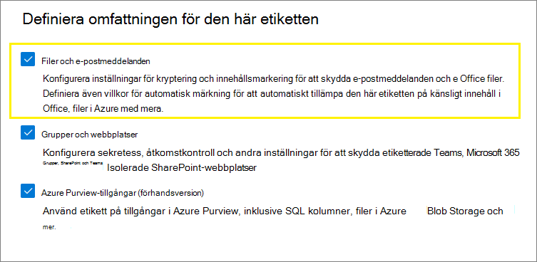
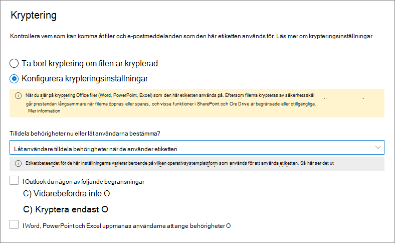

# Begränsa åtkomst till innehåll med hjälp av känslighetsetiketter för att tillämpa krypteringRestrict access to content by using sensitivity labels to apply encryption

>*[Licensieringsvägledning för Microsoft 365 för säkerhet och efterlevnad](/office365/servicedescriptions/microsoft-365-service-descriptions/microsoft-365-tenantlevel-services-licensing-guidance/microsoft-365-security-compliance-licensing-guidance).**[Microsoft 365 licensing guidance for security & compliance](/office365/servicedescriptions/microsoft-365-service-descriptions/microsoft-365-tenantlevel-services-licensing-guidance/microsoft-365-security-compliance-licensing-guidance).*

När du skapar en känslighetsetikett kan du begränsa åtkomsten till innehåll som etiketten ska tillämpas på.When you create a sensitivity label, you can restrict access to content that the label will be applied to. Med krypteringsinställningarna för en känslighetsetikett kan du till exempel skydda innehåll så att:For example, with the encryption settings for a sensitivity label, you can protect content so that:

- Endast användare inom organisationen kan öppna ett konfidentiellt dokument eller e-postmeddelande.Only users within your organization can open a confidential document or email.
- Endast användare på marknadsföringsavdelningen kan redigera och skriva ut dokumentet eller e-postmeddelandet för marknadsföringsmeddelanden, medan alla andra användare i organisationen bara kan läsa det.Only users in the marketing department can edit and print the promotion announcement document or email, while all other users in your organization can only read it.
- Användare kan inte vidarebefordra ett e-postmeddelande eller kopiera information från meddelandet som innehåller nyheter om en intern omorganisation.Users cannot forward an email or copy information from it that contains news about an internal reorganization.
- Den aktuella prislistan som skickas till affärspartner kan inte öppnas efter ett angivet datum.The current price list that is sent to business partners cannot be opened after a specified date.

När ett dokument eller e-postmeddelande krypteras begränsas åtkomsten till innehållet, så att det:When a document or email is encrypted, access to the content is restricted, so that it:

- Endast kan dekrypteras av användare som är godkända enligt etikettens krypteringsinställningar.Can be decrypted only by users authorized by the label's encryption settings.
- Förblir krypterat oavsett var det finns, inom eller utanför organisationen, även om filen får ett nytt namn.Remains encrypted no matter where it resides, inside or outside your organization, even if the file's renamed.
- Är krypterat både i vila (t.ex. i ett OneDrive-konto) och under överföring (t.ex. när e-post överförs via Internet).Is encrypted both at rest (for example, in a OneDrive account) and in transit (for example, email as it traverses the internet).

När du konfigurerar en känslighetsetikett för användning av kryptering kan du som administratör även välja att antingen:Finally, as an admin, when you configure a sensitivity label to apply encryption, you can choose either to:

- **Tilldela behörigheter nu**, så att du bestämmer exakt vilka behörigheter olika användare får till innehåll med den etiketten.**Assign permissions now**, so that you determine exactly which users get which permissions to content with that label.
- **Låta användare tilldela behörigheter** när de använder etiketten för innehåll.**Let users assign permissions** when they apply the label to content. På så sätt kan du ge personer i organisationen en viss flexibilitet som de kan behöva för att samarbeta och få arbetet gjort.This way, you can allow people in your organization some flexibility that they might need to collaborate and get their work done.

Krypteringsinställningarna är tillgängliga när du [skapar en känslighetsetikett](create-sensitivity-labels.md) i Microsoft 365 Efterlevnadscenter.The encryption settings are available when you [create a sensitivity label](create-sensitivity-labels.md) in the Microsoft 365 compliance center. Du kan också använda den äldre portalen, Säkerhets- och efterlevnadscenter.You can also use the older portal, the Security & Compliance Center.

## Förstå hur kryptering fungerarUnderstand how the encryption works

Kryptering använder Azure Rights Management-tjänsten (Azure RMS) från Azure Information Protection.Encryption uses the Azure Rights Management service (Azure RMS) from Azure Information Protection. Den här säkerhetslösningen använder krypterings-, identitets- och auktoriseringsprinciper.This protection solution uses encryption, identity, and authorization policies. Mer information finns i [Vad är Azure Rights Management?](/azure/information-protection/what-is-azure-rms) i dokumentationen för Azure Information Protection.To learn more, see [What is Azure Rights Management?](/azure/information-protection/what-is-azure-rms) from the Azure Information Protection documentation. 

När du använder den här krypteringslösningen är det funktionen **superanvändare** som gör att behöriga personer och tjänster alltid kan läsa och kontrollera de data som har krypterats för din organisation.When you use this encryption solution, the **super user** feature ensures that authorized people and services can always read and inspect the data that has been encrypted for your organization. Om det behövs kan krypteringen sedan tas bort eller ändras.If necessary, the encryption can then be removed or changed. Mer information finns i [Konfigurera superanvändare för Azure Information Protection och identifieringstjänster eller dataåterställning](/azure/information-protection/configure-super-users).For more information, see [Configuring super users for Azure Information Protection and discovery services or data recovery](/azure/information-protection/configure-super-users).

## Konfigurera en etikett för krypteringHow to configure a label for encryption

1. Följ de allmänna anvisningarna för att [skapa eller redigera en känslighetsetikett](create-sensitivity-labels.md#create-and-configure-sensitivity-labels) och se till att **Filer och e-postmeddelanden** är valt som etikettens omfång:Follow the general instructions to [create or edit a sensitivity label](create-sensitivity-labels.md#create-and-configure-sensitivity-labels) and make sure **Files & emails** is selected for the label's scope: 
    
    

2. På sidan **Välj skyddsinställningar för filer och e-postmeddelanden** väljer du **Kryptera filer och e-postmeddelanden**.Then, on the **Choose protection settings for files and emails** page, make sure you select **Encrypt files and emails**
    
    

4.  Välj något av följande alternativ på sidan **Kryptering**.:On the **Encryption** page of the wizard, select one of the following options:
    
    - **Ta bort kryptering om filen är krypterad**: Det här alternativet stöds endast av klienten för enhetlig etikettering i Azure Information Protection.**Remove encryption if the file is encrypted**: This option is supported by the Azure Information Protection unified labeling client only. När du väljer det här alternativet och använder inbyggd etikettering kan det hända att etiketten inte visas i appar, eller visas och inte gör några krypteringsändringar.When you select this option and use built-in labeling, the label might not display in apps, or display and not make any encryption changes.
        
        Mer information om det här scenariot finns i [Vad händer med befintlig kryptering när en etikett används](#what-happens-to-existing-encryption-when-a-labels-applied) avsnittet.For more information about this scenario, see the [What happens to existing encryption when a label's applied](#what-happens-to-existing-encryption-when-a-labels-applied) section. Det är viktigt att förstå att den här inställningen kan resultera i en känslighetsetikett som användarna kanske inte kan använda om de inte har tillräckliga behörigheter.It's important to understand that this setting can result in a sensitivity label that users might not be able to apply when they don't have sufficient permissions.
    
    - **Konfigurera krypteringsinställningar**: Aktiverar kryptering och gör krypteringsinställningarna synliga:**Configure encryption settings**: Turns on encryption and makes the encryption settings visible:
        
        
        
        Anvisningarna för de här inställningarna finns i avsnittet [Konfigurera krypteringsinställningar](#configure-encryption-settings).Instructions for these settings are in the following [Configure encryption settings](#configure-encryption-settings) section.

### Vad händer med befintlig kryptering när en etikett användsWhat happens to existing encryption when a label's applied

Om en känslighetsetikett används för okrypterat innehåll framgår resultatet genom de krypteringsalternativ du kan välja.If a sensitivity label is applied to unencrypted content, the outcome of the encryption options you can select is self-explanatory. Om du till exempel inte markerar **Kryptera filer och e-postmeddelanden** förblir innehållet okrypterat.For example, if you didn't select **Encrypt files and emails**, the content remains unencrypted.

Innehållet kan dock redan vara krypterat.However, the content might be already encrypted. En annan användare kan till exempel ha använt:For example, another user might have applied:

- Sina egna behörigheter, som omfattar användardefinierade behörigheter vid uppmaning via en etikett, anpassade behörigheter från Azure Information Protection-klienten och dokumentskyddet **Begränsad åtkomst** från ett Office-program.Their own permissions, which include user-defined permissions when prompted by a label, custom permissions by the Azure Information Protection client, and the **Restricted Access** document protection from within an Office app.
- En Azure Rights Management-skyddsmall som krypterar innehållet oberoende av en etikett.An Azure Rights Management protection template that encrypts the content independently from a label. Den här kategorin innehåller e-postflödesregler som tillämpar kryptering med hjälp av rättighetsskydd.This category includes mail flow rules that apply encryption by using rights protection.
- En etikett som tillämpar kryptering med behörigheter som tilldelats av administratören.A label that applies encryption with permissions assigned by the administrator.

I följande tabell ser du vad som händer med befintlig kryptering när en känslighetsetikett tillämpas på det innehållet:The following table identifies what happens to existing encryption when a sensitivity label is applied to that content:

| | Kryptering: Inte valdEncryption: Not selected | Kryptering: KonfigureradEncryption: Configured | Kryptering: Ta bort \*Encryption: Remove \* |
|:-----|:-----|:-----|:-----|
|**Behörigheter som anges av en användare****Permissions specified by a user**|Ursprunglig kryptering bevarasOriginal encryption is preserved|Ny etikettkryptering användsNew label encryption is applied|Ursprunglig kryptering tas bortOriginal encryption is removed|
|**Skyddsmall****Protection template**|Ursprunglig kryptering bevarasOriginal encryption is preserved|Ny etikettkryptering användsNew label encryption is applied|Ursprunglig kryptering tas bortOriginal encryption is removed|
|**Etikett med administratörsdefinierade behörigheter****Label with administator-defined permissions**|Ursprunglig kryptering tas bortOriginal encryption is removed|Ny etikettkryptering användsNew label encryption is applied|Ursprunglig kryptering tas bortOriginal encryption is removed|

**Fotnot:****Footnote:**

\* Stöds endast av klienten för enhetlig etikettering i Azure Information Protection.\* Supported by the Azure Information Protection unified labeling client only

I de fall då den nya etikettkrypteringen tillämpas eller den ursprungliga krypteringen tas bort, händer detta bara om användaren som tillämpar etiketten har en användningsrättighet eller roll som stöder den här åtgärden:In the cases where the new label encryption is applied or the original encryption is removed, this happens only if the user applying the label has a usage right or role that supports this action:

- [Användningsrättigheten](/azure/information-protection/configure-usage-rights#usage-rights-and-descriptions) Exportera eller Fullständig behörighet.The [usage right](/azure/information-protection/configure-usage-rights#usage-rights-and-descriptions) Export or Full Control.
- Rollen [Rights Management-utfärdare eller Rights Management-ägare](/azure/information-protection/configure-usage-rights#rights-management-issuer-and-rights-management-owner), eller [superanvändare](/azure/information-protection/configure-super-users).The role of [Rights Management issuer or Rights Management owner](/azure/information-protection/configure-usage-rights#rights-management-issuer-and-rights-management-owner), or [super user](/azure/information-protection/configure-super-users).

Om användaren inte har någon av dessa rättigheter eller roller kan etiketten inte tillämpas och den ursprungliga krypteringen bevaras.If the user doesn't have one of these rights or roles, the label can't be applied and so the original encryption is preserved. Användaren får följande meddelande: **Du har inte behörighet att göra den här ändringen av känslighetsetiketten. Kontakta innehållsägaren.**The user sees the following message: **You don't have permission to make this change to the sensitivity label. Please contact the content owner.**

Den person som tillämpar Vidarebefordra inte för ett e-postmeddelande kan till exempel etikettera om tråden för att ersätta krypteringen eller ta bort den, eftersom denne är Rights Management-ägare för e-postmeddelandet.For example, the person who applies Do Not Forward to an email message can relabel the thread to replace the encryption or remove it, because they are the Rights Management owner for the email. Men med undantag för superanvändare kan mottagarna av det här e-postmeddelandet inte etikettera om det eftersom de inte har de rättigheter som krävs.But with the exception of super users, recipients of this email can't relabel it because they don't have the required usage rights.

#### Bifogade filer i krypterade e-postmeddelandenEmail attachments for encrypted email messages

När ett e-postmeddelande krypteras med valfri metod ärver alla okrypterade Office-dokument som bifogas i e-postmeddelandet automatiskt samma krypteringsinställningar.When an email message is encrypted by any method, any unencrypted Office documents that are attached to the email automatically inherit the same encryption settings.

Dokument som redan är krypterade och sedan läggs till som bifogade filer bevarar alltid sin ursprungliga kryptering.Documents that are already encrypted and then added as attachments always preserve their original encryption.

## Konfigurera krypteringsinställningarConfigure encryption settings

När du väljer **Konfigurera krypteringsinställningar** på sidan **Kryptering** i guiden för att skapa eller redigera en känslighetsetikett, väljer du något av följande alternativ:When you select **Configure encryption settings** on the **Encryption** page of the wizard to create or edit a sensitivity label, choose one of the following options:

- **Tilldela behörigheter nu**, så att du kan bestämma exakt vilka behörigheter olika användare får till innehåll som har den här etiketten.**Assign permissions now**, so that you can determine exactly which users get which permissions to content that has the label applied. Mer information finns i nästföljande avsnitt [Tilldela behörigheter nu](#assign-permissions-now).For more information, see the next section [Assign permissions now](#assign-permissions-now).
- **Låt användare tilldela behörigheter** när de använder etiketten för innehåll.**Let users assign permissions** when your users apply the label to content. Med det här alternativet kan du ge personer i organisationen en viss flexibilitet som de kan behöva för att samarbeta och få arbetet gjort.With this option, you can allow people in your organization some flexibility that they might need to collaborate and get their work done. Mer information finns i avsnittet [Låt användare tilldela behörigheter ](#let-users-assign-permissions) på den här sidan.For more information, see the [Let users assign permissions](#let-users-assign-permissions) section on this page.

Om du till exempel har en känslighetsetikett med namnet **Strikt konfidentiellt** som ska tillämpas på ditt mest känsliga innehåll kan det vara bra att bestämma nu vem som får behörighet för innehållet och vilken typ.For example, if you have a sensitivity label named **Highly Confidential** that will be applied to your most sensitive content, you might want to decide now who gets what type of permissions to that content.

Om du har en känslighetsetikett med namnet **Affärsavtal** och organisationens arbetsflöde kräver att användarna tillfälligt samarbetar med olika personer om innehållet, kan det även vara bra att låta användarna bestämma vilka som får behörigheter när de tilldelar etiketten.Alternatively, if you have a sensitivity label named **Business Contracts**, and your organization's workflow requires that your people collaborate on this content with different people on an ad hoc basis, you might want to allow your users to decide who gets permissions when they assign the label. Den här flexibiliteten bidrar både till användarnas produktivitet och minskar begäranden om att administratörerna ska uppdatera eller skapa nya känslighetsetiketter för att hantera specifika scenarier.This flexibility both helps your users' productivity and reduces the requests for your admins to update or create new sensitivity labels to address specific scenarios.

Välja om du vill tilldela behörigheter nu eller låta användare tilldela behörigheter:Choosing whether to assign permissions now or let users assign permissions:

## Tilldela behörigheter nuAssign permissions now

Använd följande alternativ för att styra vem som kan komma åt e-post eller dokument för vilka den här etiketten används:Use the following options to control who can access email or documents to which this label is applied. You can:

- **Tillåt att åtkomst till etiketterat innehåll upphör**, antingen på ett visst datum eller efter ett visst antal dagar efter det att etiketten tillämpats.**Allow access to labeled content to expire**, either on a specific date or after a specific number of days after the label is applied. Efter den här tiden kan användare inte öppna det etiketterade objektet.After this time, users won't be able to open the labeled item. Om du anger ett datum gäller det från och med midnatt i din aktuella tidszon.If you specify a date, it is effective midnight on that date in your current time zone. (Observera att vissa e-postklienter kanske inte tillämpar förfallodatum och visar e-postmeddelanden efter det datumet på grund av en cachelagringsmetod.)(Note that some email clients might not enforce expiration and show emails past their expiration date, due to their caching mechanisms.)

- **Tillåt offlineåtkomst**: aldrig, alltid eller under ett visst antal dagar efter att etiketten tillämpats.**Allow offline access** never, always, or for a specific number of days after the label is applied. Om offlineåtkomst begränsas till aldrig eller ett antal dagar måste användarna, när tröskelvärdet nås, omautentiseras och deras åtkomst loggas.If you restrict offline access to never or a number of days, when that threshold is reached, users must be reauthenticated and their access is logged. Mer information finns i nästa avsnitt om Rights Management-användningslicensen.For more information, see the next section on the Rights Management use license.

Inställningar för åtkomstkontroll för krypterat innehåll:Settings for access control for encrypted content:

### Rights Management-användningslicens för offlineåtkomstRights Management use license for offline access

När en användare öppnar ett dokument eller e-postmeddelande som skyddas av kryptering från Azure Rights Management-tjänsten, tilldelas användaren en Azure Rights Management-användningslicens för det innehållet.When a user opens a document or email that's been protected by encryption from the Azure Rights Management service, an Azure Rights Management use license for that content is granted to the user. Användningslicensen är ett certifikat som innehåller användarens användningsrättigheter för dokumentet eller e-postmeddelandet, och krypteringsnyckeln som användes för att kryptera innehållet.This use license is a certificate that contains the user's usage rights for the document or email, and the encryption key that was used to encrypt the content. Användningslicensen innehåller också ett utgångsdatum om detta har angetts, och hur länge licensen är giltig.The use license also contains an expiration date if this has been set, and how long the use license is valid.

Om inget utgångsdatum har angetts är standardgiltighetsperioden för användningslicensen för en klientorganisation 30 dagar.If no expiration date has been set, the default use license validity period for a tenant is 30 days. Under hela användningslicensens varaktighet behöver inte användaren autentiseras eller auktoriseras på nytt för innehållet.For the duration of the use license, the user is not reauthenticated or reauthorized for the content. Med den här processen kan användaren fortsätta öppna det skyddade dokumentet eller e-postmeddelandet utan Internetanslutning.This process lets the user continue to open the protected document or email without an internet connection. När licensens giltighetsperiod upphör måste användaren autentiseras eller auktoriseras på nytt nästa gång denne vill få åtkomst till det skyddade dokumentet eller e-postmeddelandet.When the use license validity period expires, the next time the user accesses the protected document or email, the user must be reauthenticated and reauthorized.

Förutom att det ska vara en omautentisering, omvärderas krypteringsinställningarna och användargruppsmedlemskap. Det innebär att användare kan få olika åtkomstresultat för samma dokument eller e-post om det finns ändringar i krypteringsinställningarna eller gruppmedlemskap från när de senast kom åt innehållet.In addition to reauthentication, the encryption settings and user group membership is reevaluated. This means that users could experience different access results for the same document or email if there are changes in the encryption settings or group membership from when they last accessed the content.

Information om hur du ändrar standardinställningen på 30 dagar finns i avsnittet om [Rights Management-användningslicens](/azure/information-protection/configure-usage-rights#rights-management-use-license).To learn how to change the default 30-day setting, see [Rights Management use license](/azure/information-protection/configure-usage-rights#rights-management-use-license).

### Tilldela behörigheter för vissa användare eller grupperAssign permissions to specific users or groups

Du kan tilldela behörigheter till specifika personer så att bara de kan interagera med det etiketterade innehållet:You can grant permissions to specific people so that only they can interact with the labeled content:

1. Lägg först till användare eller grupper som ska tilldelas behörigheter till det etiketterade innehållet.First, add users or groups that will be assigned permissions to the labeled content.

2. Välj sedan vilka behörigheter användarna ska ha för det etiketterade innehållet.Then, choose which permissions those users should have for the labeled content.

Tilldela behörigheter:Assigning permissions:

#### Lägga till användare eller grupperAdd users or groups

När du tilldelar behörigheter kan du välja:When you assign permissions, you can choose:

- Alla i organisationen (medlemmar i klientorganisationen).Everyone in your organization (all tenant members). Den här inställningen exkluderar gästkonton.This setting excludes guest accounts.

- Alla autentiserade användare.Any authenticated users. Kontrollera att du förstår [krav och begränsningar](#requirements-and-limitations-for-add-any-authenticated-users) för den här inställningen innan du väljer den.Make sure you understand the [requirements and limitations](#requirements-and-limitations-for-add-any-authenticated-users) of this setting before selecting it.

- En specifik användare eller e-postaktiverad säkerhetsgrupp, distributionsgrupp eller Microsoft 365-grupp ([tidigare Office 365-grupp](https://techcommunity.microsoft.com/t5/microsoft-365-blog/office-365-groups-will-become-microsoft-365-groups/ba-p/1303601)) i Azure AD.Any specific user or email-enabled security group, distribution group, or Microsoft 365 group ([formerly Office 365 group](https://techcommunity.microsoft.com/t5/microsoft-365-blog/office-365-groups-will-become-microsoft-365-groups/ba-p/1303601)) in Azure AD. Microsoft 365-gruppen kan ha statiskt eller [dynamiskt medlemskap](/azure/active-directory/users-groups-roles/groups-create-rule).The Microsoft 365 group can have static or [dynamic membership](/azure/active-directory/users-groups-roles/groups-create-rule). Observera att du inte kan använda en [dynamisk distributionsgrupp från Exchange](/Exchange/recipients/dynamic-distribution-groups/dynamic-distribution-groups) eftersom den grupptypen inte synkroniseras till Azure AD, och du kan inte använda en säkerhetsgrupp som inte är e-postaktiverad.Note that you can't use a [dynamic distribution group from Exchange](/Exchange/recipients/dynamic-distribution-groups/dynamic-distribution-groups) because this group type isn't synchronized to Azure AD, and you can't use a security group that isn't email-enabled.

- Valfri e-postadress eller domän.Any email address or domain. Använd det här alternativet om du vill ange alla användare i en annan organisation som använder Azure AD, genom att ange ett domännamn från den organisationen.Use this option to specify all users in another organization who uses Azure AD, by entering any domain name from that organization. Du kan också använda det här alternativet för kommunikationsplattformar genom att ange deras domännamn, till exempel **gmail.com**, **hotmail.com** eller **outlook.com**.You can also use this option for social providers, by entering their domain name such as **gmail.com**, **hotmail.com**, or **outlook.com**.

    > [!NOTE]
    > Om du anger en domän från en organisation som använder Azure AD kan du inte begränsa åtkomsten till den specifika domänen.If you specify a domain from an organization that uses Azure AD, you can't restrict access to that specific domain. I stället ingår alla verifierade domäner i Azure AD automatiskt för den klientorganisation som äger det domännamn du anger.Instead, all verified domains in Azure AD are automatically included for the tenant that owns the domain name you specify.

När du väljer alla användare och grupper i organisationen, eller bläddrar i katalogen, måste användarna eller grupperna ha en e-postadress.When you choose all users and groups in your organization or browse the directory, the users or groups must have an email address.

Det är bäst att använda grupper i stället för användare.As a best practice, use groups rather than users. Den här strategin gör konfigurationen enklare.This strategy keeps your configuration simpler.

##### Krav och begränsningar för ”Lägg till autentiserade användare”Requirements and limitations for "Add any authenticated users"

Den här inställningen begränsar inte vem som kan komma åt det innehåll som etiketten krypterar, samtidigt som innehållet ändå krypteras och alternativ ges för att begränsa hur innehållet kan användas (behörigheter) och om det går att komma åt (förfallodatum och offlineåtkomst).This setting doesn't restrict who can access the content that the label encrypts, while still encrypting the content and providing you with options to restrict how the content can be used (permissions), and accessed (expiry and offline access). Men programmet som öppnar det krypterade innehållet måste ha stöd för den autentisering som används.However, the application opening the encrypted content must be able to support the authentication being used. Därför fungerar federerade sociala plattformar som Google, och autentisering med engångslösenord, endast för e-post och endast när du använder Exchange Online.For this reason, federated social providers such as Google, and onetime passcode authentication work for email only, and only when you use Exchange Online. Microsoft-konton kan användas med Office 365-appar och [visningsprogrammet för Azure Information Protection](https://portal.azurerms.com/#/download).Microsoft accounts can be used with Office 365 apps and the [Azure Information Protection viewer](https://portal.azurerms.com/#/download).

> [!NOTE]
> Överväg att använda den här inställningen med [SharePoint- och OneDrive-integrering med Azure AD B2B](/sharepoint/sharepoint-azureb2b-integration-preview) när känslighetsetiketter [aktiverats för Office-filer i SharePoint och OneDrive](sensitivity-labels-sharepoint-onedrive-files.md).Consider using this setting with [SharePoint and OneDrive integration with Azure AD B2B](/sharepoint/sharepoint-azureb2b-integration-preview) when sensitivity labels are [enabled for Office files in SharePoint and OneDrive](sensitivity-labels-sharepoint-onedrive-files.md).

Några vanliga scenarier för inställningen alla autentiserade användare:Some typical scenarios for any authenticated users setting:

- Du bryr dig inte om vem som visar innehållet, men du vill begränsa hur det används.You don't mind who views the content, but you want to restrict how it is used. Du vill till exempel inte att innehållet ska redigeras, kopieras eller skrivas ut.For example, you don't want the content to be edited, copied, or printed.
- Du behöver inte begränsa vem som har åtkomst till innehållet, men du vill kunna bekräfta vem som öppnar det.You don't need to restrict who accesses the content, but you want to be able to confirm who opens it.
- Du har ett krav på att innehållet måste vara krypterat i vila och under överföring, men det kräver inte åtkomstkontroller.You have a requirement that the content must be encrypted at rest and in transit, but it doesn't require access controls.

#### Välj behörigheterChoose permissions

När du väljer vilka behörigheter som ska tillåtas för dessa användare eller grupper kan du välja antingen:When you choose which permissions to allow for those users or groups, you can select either:

- En [fördefinierad behörighetsnivå](/azure/information-protection/configure-usage-rights#rights-included-in-permissions-levels) med en förinställd grupp rättigheter, till exempel Medförfattare eller Granskare.A [predefined permissions level](/azure/information-protection/configure-usage-rights#rights-included-in-permissions-levels) with a preset group of rights, such as Co-Author or Reviewer.
- Anpassade behörigheter, där du väljer en eller flera användningsbehörigheter.Custom permissions, where you choose one or more usage rights.

Mer information som hjälper dig att välja rätt behörigheter finns i [Användningsrättigheter och beskrivningar](/azure/information-protection/configure-usage-rights#usage-rights-and-descriptions).For more information to help you select the appropriate permissions, see [Usage rights and descriptions](/azure/information-protection/configure-usage-rights#usage-rights-and-descriptions).  

Observera att samma etikett kan ge olika behörigheter till olika användare.Note that the same label can grant different permissions to different users. En enstaka etikett kan till exempel tilldela vissa användare som Granskare och en annan användare som Medförfattare, enligt följande skärmbild.For example, a single label can assign some users as Reviewer and a different user as Co-author, as shown in the following screenshot.

Det gör du genom att lägga till användare eller grupper, tilldela dem behörigheter och spara inställningarna.To do this, add users or groups, assign them permissions, and save those settings. Upprepa sedan stegen med att lägga till användare och tilldela dem behörigheter och spara inställningarna varje gång.Then repeat these steps, adding users and assigning them permissions, saving the settings each time. Du kan upprepa den här konfigurationen så många gånger det behövs för att definiera olika behörigheter för olika användare.You can repeat this configuration as often as necessary, to define different permissions for different users.

#### Rights Management-utfärdare (användare som tillämpar känslighetsetiketten) har alltid Fullständig behörighetRights Management issuer (user applying the sensitivity label) always has Full Control

Kryptering för en känslighetsetikett använder Azure Rights Management-tjänsten från Azure Information Protection.Encryption for a sensitivity label uses the Azure Rights Management service from Azure Information Protection. När en användare tillämpar en känslighetsetikett för att skydda ett dokument eller e-postmeddelande med hjälp av kryptering, blir den användaren Rights Management-utfärdare för det innehållet.When a user applies a sensitivity label to protect a document or email by using encryption, that user becomes the Rights Management issuer for that content.

Rights Management-utfärdare tilldelas alltid Fullständig behörighet för dokumentet eller e-postmeddelandet, och dessutom:The Rights Management issuer is always granted Full Control permissions for the document or email, and in addition:

- Om krypteringsinställningarna innehåller ett utgångsdatum kan Rights Management-utfärdaren fortfarande öppna och redigera dokumentet eller e-postmeddelandet efter det datumet.If the encryption settings include an expiration date, the Rights Management issuer can still open and edit the document or email after that date.
- Rights Management-utfärdare kan alltid komma åt dokumentet eller e-post offline.The Rights Management issuer can always access the document or email offline.
- Rights Management-utfärdare kan fortfarande öppna ett dokument efter att det återkallats.The Rights Management issuer can still open a document after it is revoked.

Mer information finns i [Rights Management-utfärdare och Rights Management-ägare](/azure/information-protection/configure-usage-rights#rights-management-issuer-and-rights-management-owner).For more information, see [Rights Management issuer and Rights Management owner](/azure/information-protection/configure-usage-rights#rights-management-issuer-and-rights-management-owner).

### Kryptering med dubbla nycklarDouble Key Encryption

> [!NOTE]
> Den här funktionen stöds för närvarande endast av klienten för enhetlig etikettering i Azure Information Protection.This feature is currently supported only by the Azure Information Protection unified labeling client.

Välj det här alternativet först när du har konfigurerat tjänsten för kryptering med dubbla nycklar och du behöver använda krypteringen med dubbla nycklar för filer som ska tilldelas den här etiketten.Select this option only after you have configured the Double Key Encryption service and you need to use this double key encryption for files that will have this label applied.

Mer information, förutsättningar och konfigurationsanvisningar finns i [Kryptering med dubbla nycklar (DKE)](double-key-encryption.md).For more information, prerequisites, and configuration instructions, see [Double Key Encryption (DKE)](double-key-encryption.md).

## Låt användare tilldela behörigheterLet users assign permissions

> [!IMPORTANT]
> Alla etiketteringsklienter stöder inte alla alternativ som tillåter att användare tilldelar sina egna behörigheter. Mer information finns i det här avsnittet.Not all labeling clients support all the options that let users assign their own permissions. Use this section to learn more.

Du kan använda följande alternativ för att låta användare tilldela behörigheter när de manuellt tillämpar en känslighetsetikett på innehåll:You can use the following options to let users assign permissions when they manually apply a sensitivity label to content:

- I Outlook kan en användare välja begränsningar som motsvarar alternativet [Vidarebefordra inte](/azure/information-protection/configure-usage-rights#do-not-forward-option-for-emails) eller [Endast kryptering](/azure/information-protection/configure-usage-rights#encrypt-only-option-for-emails) för de valda mottagarna.In Outlook, a user can select restrictions equivalent to the [Do Not Forward](/azure/information-protection/configure-usage-rights#do-not-forward-option-for-emails) option or [Encrypt-only](/azure/information-protection/configure-usage-rights#encrypt-only-option-for-emails) for their chosen recipients.
    
    Alternativet Vidarebefordra inte stöds av alla e-postklienter som har stöd för känslighetsetiketter.The Do Not Forward option is supported by all email clients that support sensitivity labels. Användning av alternativet **Endast kryptering** med en känslighetsetikett är dock en nyligen släppt version som endast stöds av inbyggd etikettering och inte klienten för enhetlig etikettering i Azure Information Protection.However, applying the **Encrypt-Only** option with a sensitivity label is a recent release that's supported only by built-in labeling and not the Azure Information Protection unified labeling client. För e-postklienter som inte stöder den här funktionen visas inte etiketten.For email clients that don't support this capability, the label won't be visible.
    
    Använd [funktionstabellen för Outlook](sensitivity-labels-office-apps.md#sensitivity-label-capabilities-in-outlook) och raden **Låt användare tilldela behörigheter: – Endast kryptering** om du vill kontrollera de lägsta versionerna av Outlook-appar som använder inbyggd etikettering för stöd för användning av alternativet Endast kryptering med en känslighetsetikett.To check the minimum versions of Outlook apps that use built-in labeling to support applying the Encrypt-Only option with a sensitivity label, use the [capabilities table for Outlook](sensitivity-labels-office-apps.md#sensitivity-label-capabilities-in-outlook) and the row **Let users assign permissions: - Encrypt-Only**.

- I Word, PowerPoint och Excel uppmanas en användare att välja egna behörigheter för specifika användare, grupper eller organisationer.In Word, PowerPoint, and Excel, a user is prompted to select their own permissions for specific users, groups, or organizations.

    Det här alternativet stöds av klienten för enhetlig etikettering i Azure Information Protection och av vissa appar som använder inbyggd etikettering.This option is supported by the Azure Information Protection unified labeling client and by some apps that use built-in labeling. För program som inte stöder den här funktionen visas etiketten antingen inte för användarna, eller så visas etiketten för konsekvens, men den kan inte användas med ett förklaringsmeddelande till användarna.For apps that don't support this capability, the label either won't be visible for users, or the label is visible for consistency but it can't be applied with an explanation message to users.
    
    Om du vill kontrollera vilka appar som använder inbyggd etikettering som har stöd för det här alternativet, använder du [funktionstabellen för Word, Excel och PowerPoint](sensitivity-labels-office-apps.md#sensitivity-label-capabilities-in-word-excel-and-powerpoint) och raden **Låt användare tilldela behörigheter: – Uppmana användarna**.To check which apps that use built-in labeling support this option, use the [capabilities table for Word, Excel, and PowerPoint](sensitivity-labels-office-apps.md#sensitivity-label-capabilities-in-word-excel-and-powerpoint) and the row **Let users assign permissions: - Prompt users**.

När alternativen stöds använder du följande tabell för att identifiera när användarna ser känslighetsetiketten:When the options are supported, use the following table to identify when users see the sensitivity label:

|InställningSetting |Etikett som visas i OutlookLabel visible in Outlook|Etikett som visas i Word, Excel, PowerPointLabel visible in Word, Excel, PowerPoint|
|:-----|:-----|:-----|:-----|
|**Tillämpa begränsningar i Outlook med alternativet Vidarebefordra inte eller Endast kryptering****In Outlook, enforce restrictions with the Do Not Forward or Encrypt-Only option**|JaYes |NejNo |
|**Uppmana användare att ange behörigheter i Word, PowerPoint och Excel****In Word, PowerPoint, and Excel, prompt users to specify permissions**|NejNo |JaYes|

När båda inställningarna är markerade visas etiketten därför i både Outlook och i Word, Excel och PowerPoint.When both settings are selected, the label is therefore visible in both Outlook and in Word, Excel, and PowerPoint.

En känslighetsetikett som gör att användare kan tilldela behörigheter måste tillämpas på innehåll manuellt av användarna. Den kan inte tillämpas automatiskt eller användas som en rekommenderad etikett.A sensitivity label that lets users assign permissions must be applied to content manually by users; it can't be auto-applied or used as a recommended label.

Konfigurera användartilldelade behörigheter:Configuring the user-assigned permissions:

### Begränsningar i OutlookOutlook restrictions

När en användare använder en känslighetsetikett i Outlook som tillåter att användaren tilldelar behörigheter till ett meddelande, kan du välja alternativet **Vidarebefordra inte** eller **Endast kryptering**.In Outlook, when a user applies a sensitivity label that lets them assign permissions to a message, you can choose the **Do Not Forward option** or **Encrypt-Only**. Användaren ser etikettnamnet och beskrivningen längst upp i meddelandet, vilket anger att innehållet skyddas.The user will see the label name and description at the top of the message, which indicates the content's being protected. Till skillnad från Word, PowerPoint och Excel (se [nästa avsnitt](#word-powerpoint-and-excel-permissions)) uppmanas inte användarna att välja specifika behörigheter.Unlike Word, PowerPoint, and Excel (see the [next section](#word-powerpoint-and-excel-permissions)), users aren't prompted to select specific permissions.

När något av de här alternativen används för ett e-postmeddelande krypteras e-postmeddelandet och mottagarna måste autentiseras. Sedan har mottagarna automatiskt begränsade användningsrättigheter:When either of these options are applied to an email, the email is encrypted and recipients must be authenticated. Then, the recipients automatically have restricted usage rights:

- **Vidarebefordra inte**: Mottagarna kan inte vidarebefordra e-postmeddelandet, skriva ut det eller kopiera från det.**Do Not Forward**: Recipients cannot forward the email, print it, or copy from it. I Outlook-klienten är till exempel knappen Vidarebefordra inte otillgänglig, menyalternativen Spara som och Skriv ut är inte tillgängliga och du kan inte lägga till eller ändra mottagare i rutorna Till, Kopia eller Hemlig kopia.For example, in the Outlook client, the Forward button is not available, the Save As and Print menu options are not available, and you cannot add or change recipients in the To, Cc, or Bcc boxes.
    
    Mer information om hur det här alternativet fungerar finns i [Alternativet Vidarebefordra inte för e-postmeddelanden](/azure/information-protection/configure-usage-rights#do-not-forward-option-for-emails).For more information about how this option works, see [Do Not Forward option for emails](/azure/information-protection/configure-usage-rights#do-not-forward-option-for-emails).

- **Endast kryptering**: Mottagarna har alla användningsrättigheter utom Spara som, Exportera och Fullständig behörighet.**Encrypt-Only**: Recipients have all usage rights except Save As, Export and Full Control. Den här kombinationen av användningsrättigheter innebär att mottagarna inte har några begränsningar förutom att de inte kan ta bort skyddet.This combination of usage rights means that the recipients have no restrictions except that they cannot remove the protection. En mottagare kan till exempel kopiera från e-postmeddelandet, skriva ut det och vidarebefordra det.For example, a recipient can copy from the email, print it, and forward it.
    
    Mer information om hur det här alternativet fungerar finns i [Alternativet Endast kryptering för e-postmeddelanden](/azure/information-protection/configure-usage-rights#encrypt-only-option-for-emails).For more information about how this option works, see [Encrypt-only option for emails](/azure/information-protection/configure-usage-rights#encrypt-only-option-for-emails).

Okrypterade Office-dokument som bifogas i e-postmeddelandet ärver automatiskt samma begränsningar.Unencrypted Office documents that are attached to the email automatically inherit the same restrictions. För Vidarebefordra inte är de användningsrättigheter som används för dessa dokument Redigera innehåll, Redigera, Spara, Visa, Öppna, Läsa och Tillåt makron.For Do Not Forward, the usage rights applied to these documents are Edit Content, Edit; Save; View, Open, Read; and Allow Macros. Om användaren önskar andra användningsrättigheter för en bifogad fil, eller om den bifogade filen inte är ett Office-dokument som har stöd för det ärvda skyddet, måste användaren kryptera filen innan den bifogas i e-postmeddelandet.If the user wants different usage rights for an attachment, or the attachment is not an Office document that supports this inherited protection, the user needs to encrypt the file before attaching it to the email.

### Behörigheter för Word, PowerPoint och ExcelWord, PowerPoint, and Excel permissions

När en användare använder en känslighetsetikett i Word, PowerPoint och Excel som tillåter att de tilldelar behörigheter till ett dokument, uppmanas de att ange val av användare och behörigheter när krypteringen tillämpas.In Word, PowerPoint, and Excel, when a user applies a sensitivity label that lets them assign permissions to a document, they are prompted to specify their choice of users and permissions when the encryption is applied.

Med klienten för enhetlig etikettering för Azure Information Protection kan användarna till exempel:For example, with the Azure Information Protection unified labeling client, users can:

- Välja en behörighetsnivå, till exempel Läsare (som tilldelar behörigheten Endast visa) eller Medförfattare (som tilldelar behörigheterna Visa, Redigera, Kopiera och Skriv ut).Select a permission level, such as Viewer (which assigns View Only permission) or Co-Author (which assigns View, Edit, Copy, and Print permissions).
- Välja användare, grupper eller organisationer.Select users, groups, or organizations. Det kan omfatta personer både inom och utanför organisationen.This can include people both inside or outside your organizations.
- Ange ett utgångsdatum efter vilket de valda användarna inte kan komma åt innehållet.Set an expiration date, after which the selected users cannot access the content. Mer information finns i avsnittet ovan om hur [Rights Management använder licens för offlineåtkomst](#rights-management-use-license-for-offline-access).For more information, see the above section [Rights Management use license for offline access](#rights-management-use-license-for-offline-access).

För inbyggd etikettering ser användarna samma dialogruta om de väljer följande:For built-in labeling, users see the same dialog box if they select the following:

- Windows: Fliken **Arkiv** > **Information** > **Skydda dokument** > **Begränsa åtkomst** > **Begränsad åtkomst**Windows: **File** tab > **Info** > **Protect Document** > **Restrict Access** > **Restricted Access**

- macOS: Fliken **Granska** > **Skydd** > **Behörigheter** > **Begränsad åtkomst**macOS: **Review** tab > **Protection** > **Permissions** > **Restricted Access**

## Exempelkonfigurationer för krypteringsinställningarExample configurations for the encryption settings

För varje exempel som följer utför du konfigurationen från sidan **Kryptering** i guiden när **Konfigurera krypteringsinställningar** har valts:For each example that follows, do the configuration from the **Encryption** page of the wizard when **Configure encryption settings** is selected:

### Exempel 1: Etikett som tillämpar Vidarebefordra inte för att skicka ett krypterat e-postmeddelande till ett Gmail-kontoExample 1: Label that applies Do Not Forward to send an encrypted email to a Gmail account

Den här etiketten visas endast i Outlook och Outlook på webben, och du måste använda Exchange Online.This label displays only in Outlook and Outlook on the web, and you must use Exchange Online. Instruera användarna att välja den här etiketten när de behöver skicka ett krypterat e-postmeddelande till personer som använder ett Gmail-konto (eller något annat e-postkonto utanför organisationen).Instruct users to select this label when they need to send an encrypted email to people using a Gmail account (or any other email account outside your organization).

Användarna anger Gmail-e-postadressen i rutan **Till**.Your users type the Gmail email address in the **To** box.  Därefter väljer de etiketten så att alternativet Vidarebefordra inte läggs till automatiskt i e-postmeddelandet.Then, they select the label and the Do Not Forward option is automatically added to the email. Resultatet är att mottagarna inte kan vidarebefordra e-postmeddelandet eller skriva ut det, kopiera från det eller spara e-postmeddelandet utanför postlådan med hjälp av alternativet **Spara som**.The result is that recipients cannot forward the email, or print it, copy from it, or save the email outside their mailbox by using the **Save As** option.

1. På sidan **Kryptering**: För **Tilldela behörigheter nu eller låt användarna bestämma?** väljer du **Låt användare tilldela behörigheter när de använder etiketten**.On the **Encryption** page: For **Assign permissions now or let users decide?** select **Let users assign permissions when they apply the label**.

2. Markera kryssrutan: **Tillämpa begränsningar i Outlook som motsvarar alternativet Vidarebefordra inte**.Select the checkbox: **In Outlook, enforce restrictions equivalent to the Do Not Forward option**.

3. Avmarkera kryssrutan om den är vald: **Uppmana användare att ange behörigheter i Word, PowerPoint och Excel**.If selected, clear the checkbox: **In Word, PowerPoint, and Excel, prompt users to specify permissions**.

4. Välj **Nästa** och slutför guiden.Select **Next** and complete the wizard.

### Exempel 2: Etikett som begränsar skrivskyddsbehörighet till alla användare i en annan organisationExample 2: Label that restricts read-only permission to all users in another organization

Den här etiketten är lämplig för delning av mycket känsliga dokument som skrivskyddade, och dokumenten kräver alltid en Internetanslutning för att visas.This label is suitable for sharing very sensitive documents as read-only, and the documents always require an internet connection to view them.

Den här etiketten är inte lämplig för e-postmeddelanden.This label is not suitable for emails.

1. På sidan **Kryptering**: För **Tilldela behörigheter nu eller låt användarna bestämma?** väljer du **Tilldela behörigheter nu**.On the **Encryption** page: For **Assign permissions now or let users decide?** select **Assign permissions now**.

2. För **Tillåt offlineåtkomst** väljer du **Aldrig**.For **Allow offline access**, select **Never**.

3. Välj **Tilldela behörigheter**.Select **Assign permissions**.

4. I fönstret **Tilldela behörigheter** väljer du **Lägg till specifika e-postadresser eller domäner**.On the **Assign permissions** pane, select **Add specific email addresses or domains**.

5. I textrutan anger du namnet på en domän från den andra organisationen, till exempel **fabrikam.com**.In the text box, enter the name of a domain from the other organization, for example, **fabrikam.com**. Välj sedan **Lägg till**.Then select **Add**.

6. Välj **Välj behörigheter**.Select **Choose permissions**.

7. I fönstret **Välj behörigheter** väljer du listrutan, väljer **Läsare** och sedan **Spara**.On the **Choose permissions** pane, select the dropdown box, select **Viewer**, and then select **Save**.

8. I fönstret **Tilldela behörigheter** väljer du **Spara**.Back on the **Assign Permissions** pane, select **Save**.

9. På sidan **Kryptering** väljer du **Nästa** och slutför guiden.On the **Encryption** page, select **Next** and complete the wizard.

### Exempel 3: Lägga till externa användare för en befintlig etikett som krypterar innehållExample 3: Add external users to an existing label that encrypts content

Nya användare som du lägger till kan öppna dokument och e-postmeddelanden som redan har skyddats med den här etiketten.The new users that you add will be able open documents and emails that have already been protected with this label. Behörigheterna du tilldelar de här användarna kan skilja sig från de behörigheter som de befintliga användarna har.The permissions that you grant these users can be different from the permissions that the existing users have.

1. På sidan **Kryptering**: För **Tilldela behörigheter nu eller låt användarna bestämma?** kontrollerar du att **Tilldela behörigheter nu** är valt.On the **Encryption** page: For **Assign permissions now or let users decide?** make sure **Assign permissions now** is selected.

2. Välj **Tilldela behörigheter**.Select **Assign permissions**.

3. I fönstret **Tilldela behörigheter** väljer du **Lägg till specifika e-postadresser eller domäner**.On the **Assign permissions** pane, select **Add specific email addresses or domains**.

4. I textrutan anger du e-postadressen till den första användaren (eller gruppen) som ska läggas till och väljer sedan **Lägg till**.In the text box, enter the email address of the first user (or group) to add, and then select **Add**.

5. Välj **Välj behörigheter**.Select **Choose permissions**.

6. I fönstret **Välj behörigheter** väljer du behörigheter för användaren (eller gruppen) och sedan **Spara**.On the **Choose permissions** pane, select the permissions for this user (or group), and then select **Save**.

7. Tillbaka i fönstret **Tilldela behörigheter** upprepar du steg 3 till 6 för varje användare (eller grupp) som du vill lägga till i den här etiketten.Back on the **Assign Permissions** pane, repeat steps 3 through 6 for each user (or group) that you want to add to this label. Klicka sedan på **Spara**.Then click **Save**.

8. På sidan **Kryptering** väljer du **Nästa** och slutför guiden.On the **Encryption** page, select **Next** and complete the wizard.

### Exempel 4: Etikett som krypterar innehåll men inte begränsar vem som kan komma åt detExample 4: Label that encrypts content but doesn't restrict who can access it

Den här konfigurationen har fördelen att du inte behöver ange användare, grupper eller domäner för att kryptera ett e-postmeddelande eller dokument.This configuration has the advantage that you don't need to specify users, groups, or domains to encrypt an email or document. Innehållet krypteras fortfarande och du kan fortfarande ange användningsrättigheter, ett utgångsdatum och offlineåtkomst.The content will still be encrypted and you can still specify usage rights, an expiry date, and offline access.

Använd bara den här konfigurationen när du inte behöver begränsa vem som kan öppna det skyddade dokumentet eller e-postmeddelandet.Use this configuration only when you do not need to restrict who can open the protected document or email. [Mer information om den här inställningenMore information about this setting](#requirements-and-limitations-for-add-any-authenticated-users)

1. På sidan **Kryptering**: För **Tilldela behörigheter nu eller låt användarna bestämma?** kontrollerar du att **Tilldela behörigheter nu** är valt.On the **Encryption** page: For **Assign permissions now or let users decide?** make sure **Assign permissions now** is selected.

2. Konfigurera inställningar för **Användaråtkomst till innehåll upphör** och **Tillåt offlineåtkomst** efter behov.Configure settings for **User access to content expires** and **Allow offline access** as required.

3. Välj **Tilldela behörigheter**.Select **Assign permissions**.

4. I fönstret **Tilldela behörigheter** väljer du **Lägg till autentiserade användare**.On the **Assign permissions** pane, select **Add any authenticated users**.

    För **Användare och grupper** ser du **Autentiserade användare** som lagts till automatiskt.For **Users and groups**, you see **Authenticated users** automatically added. Du kan inte ändra det här värdet, bara ta bort det, vilket avbryter valet **Lägg till autentiserade användare**.You can't change this value, only delete it, which cancels the **Add any authenticated users** selection.

5. Välj **Välj behörigheter**.Select **Choose permissions**.

6. I fönstret **Välj behörigheter** väljer du listrutan, väljer de behörigheter du önskar och sedan **Spara**.On the **Choose permissions** pane, select the dropdown box, select the permissions you want, and then select **Save**.

7. I fönstret **Tilldela behörigheter** väljer du **Spara**.Back on the **Assign Permissions** pane, select **Save**.

8. På sidan **Kryptering** väljer du **Nästa** och slutför guiden.On the **Encryption** page, select **Next** and complete the wizard.

## Att tänka på för krypterat innehållConsiderations for encrypted content

Genom att kryptera dina känsliga dokument och e-postmeddelanden kan endast behöriga personer komma åt dessa data.Encrypting your most sensitive documents and emails helps to ensure that only authorized people can access this data. Det finns dock några överväganden att ta hänsyn till:However, there are some considerations to take into account:

- Om din organisation inte har [aktiverat känslighetsetiketter för Office-filer i SharePoint och OneDrive](sensitivity-labels-sharepoint-onedrive-files.md):If your organization hasn't [enabled sensitivity labels for Office files in SharePoint and OneDrive](sensitivity-labels-sharepoint-onedrive-files.md):

  - Sökning, eDiscovery och Delve fungerar inte för krypterade filer.Search, eDiscovery, and Delve will not work for encrypted files.
  - DLP-principer fungerar för metadata för dessa krypterade filer (inklusive information om kvarhållningsetiketter), men inte innehållet i de filerna (t.ex. kreditkortsnummer i filer).DLP policies work for the metadata of these encrypted files (including retention label information) but not the content of these files (such as credit card numbers within files).
  - Användare kan inte öppna krypterade filer med Office på webben.Users can't open encrypted files using Office on the web. När känslighetsetiketter för Office-filer i SharePoint och OneDrive är aktiverade kan användare använda Office på webben för att öppna krypterade filer, med vissa [-begränsningar](sensitivity-labels-sharepoint-onedrive-files.md#limitations) som omfattar kryptering som har tillämpats med en lokal nyckel (kallas även HYOK eller egen nyckel), [kryptering med dubbla nycklar](#double-key-encryption) och kryptering som har tillämpats oberoende av en känslighetsetikett.When sensitivity labels for Office files in SharePoint and OneDrive are enabled, users can use Office on the web to open encrypted files, with some [limitations](sensitivity-labels-sharepoint-onedrive-files.md#limitations) that include encryption that has been applied with an on-premises key (known as "hold your own key", or HYOK), [double key encryption](#double-key-encryption), and encryption that has been applied independently from a sensitivity label.

- Om du delar krypterade dokument med personer utanför organisationen kan du behöva skapa gästkonton och ändra principer för villkorsstyrd åtkomst.If you share encrypted documents with people outside your organization, you might need to create guest accounts and modify Conditional Access policies. Mer information finns i [Dela krypterade dokument med externa användare](sensitivity-labels-office-apps.md#support-for-external-users-and-labeled-content).For more information, see [Sharing encrypted documents with external users](sensitivity-labels-office-apps.md#support-for-external-users-and-labeled-content).

- För att flera användare ska kunna redigera en krypterad fil samtidigt måste alla använda Office för webben.For multiple users to edit an encrypted file at the same time, they must all be using Office for the web. Om så inte är fallet och filen redan är öppen:If this isn't the case, and the file is already open:

  - I Office-appar (Windows, Mac, Android och iOS) visas meddelandet **Filen används** med namnet på den person som har checkat ut filen.In Office apps (Windows, Mac, Android, and iOS), users see a **File In Use** message with the name of the person who has checked out the file. De kan sedan visa en skrivskyddad kopia eller spara och redigera en kopia av filen, och få ett meddelande när filen är tillgänglig.They can then view a read-only copy or save and edit a copy of the file, and receive notification when the file is available.
  - I Office på webben får användarna ett felmeddelande om att de inte kan redigera dokumentet tillsammans med andra.In Office for the web, users see an error message that they can't edit the document with other people. De kan sedan välja **Öppna i läsvyn**.They can then select **Open in Reading View**.

- Funktionen [Spara automatiskt](https://support.office.com/article/what-is-autosave-6d6bd723-ebfd-4e40-b5f6-ae6e8088f7a5) i Office-appar (Windows, Mac, Android och iOS) är inaktiverad för krypterade filer.The [AutoSave](https://support.office.com/article/what-is-autosave-6d6bd723-ebfd-4e40-b5f6-ae6e8088f7a5) functionality in Office apps (Windows, Mac, Android, and iOS) is disabled for encrypted files. Användarna får ett meddelande om att filen har begränsade behörigheter som måste tas bort innan Spara automatiskt kan aktiveras.Users see a message that the file has restricted permissions that must be removed before AutoSave can be turned on.

- Det kan ta längre tid att öppna krypterade filer i Office-program (Windows, Mac, Android och iOS).Encrypted files might take longer to open in Office apps (Windows, Mac, Android, and iOS).

- Om en etikett som tillämpar kryptering läggs till med hjälp av en Office-app när dokumentet är [utcheckat i SharePoint](https://support.microsoft.com/office/check-out-check-in-or-discard-changes-to-files-in-a-library-7e2c12a9-a874-4393-9511-1378a700f6de), och användaren sedan ignorerar utcheckningen, förblir dokumentet etiketterat och krypterat.If a label that applies encryption is added by using an Office app when the document is [checked out in SharePoint](https://support.microsoft.com/office/check-out-check-in-or-discard-changes-to-files-in-a-library-7e2c12a9-a874-4393-9511-1378a700f6de), and the user then discards the checkout, the document remains labeled and encrypted.

- Följande åtgärder för krypterade filer stöds inte från Office-appar (Windows, Mac, Android och iOS) och användarna ser ett felmeddelande om att något gick fel. SharePoint-funktioner kan dock användas som ett alternativ:The following actions for encrypted files aren't supported from Office apps (Windows, Mac, Android, and iOS), and users see an error message that something went wrong. However, SharePoint functionality can be used as an alternative:

  - Visa, återställa och spara kopior av tidigare versioner.View, restore, and save copies of previous versions. Alternativt kan användare utföra de här åtgärderna med Office på webben om du [aktiverar och konfigurerar versionshantering för en lista eller ett bibliotek](https://support.office.com/article/enable-and-configure-versioning-for-a-list-or-library-1555d642-23ee-446a-990a-bcab618c7a37).As an alternative, users can do these actions using Office on the web when you [enable and configure versioning for a list or library](https://support.office.com/article/enable-and-configure-versioning-for-a-list-or-library-1555d642-23ee-446a-990a-bcab618c7a37).
  - Ändra namn eller plats för filer.Change the name or location of files. Alternativt kan användare [byta namn på en fil, mapp eller länk i ett dokumentbibliotek](https://support.microsoft.com/office/rename-a-file-folder-or-link-in-a-document-library-bc493c1a-921f-4bc1-a7f6-985ce11bb185) i SharePoint.As an alternative, users can [rename a file, folder, or link in a document library](https://support.microsoft.com/office/rename-a-file-folder-or-link-in-a-document-library-bc493c1a-921f-4bc1-a7f6-985ce11bb185) in SharePoint.

För bästa funktion vid samarbete med filer som är krypterade med en känslighetsetikett, rekommenderar vi att du använder [känslighetsetiketter för Office-filer i SharePoint och OneDrive](sensitivity-labels-sharepoint-onedrive-files.md) samt Office för webben.For the best collaboration experience for files that are encrypted by a sensitivity label, we recommend you use [sensitivity labels for Office files in SharePoint and OneDrive](sensitivity-labels-sharepoint-onedrive-files.md) and Office for the web.

## Viktiga förutsättningarImportant prerequisites

Innan du kan använda kryptering kan du behöva utföra vissa konfigurationsuppgifter.Before you can use encryption, you might need to do some configuration tasks.

- Aktivera skydd från Azure Information ProtectionActivate protection from Azure Information Protection
    
    För att känslighetsetiketter ska tillämpa kryptering måste skyddstjänsten (Azure Rights Management) från Azure Information Protection vara aktiverad för klientorganisationen.For sensitivity labels to apply encryption, the protection service (Azure Rights Management) from Azure Information Protection must be activated for your tenant. I nyare klientorganisationer är det här standardinställningen, men du kan behöva aktivera tjänsten manuellt.In newer tenants, this is the default setting, but you might need to manually activate the service. Mer information finns i [Aktivera skyddstjänsten från Azure Information Protection](/azure/information-protection/activate-service).For more information, see [Activating the protection service from Azure Information Protection](/azure/information-protection/activate-service).

- Kontrollera nätverkskravCheck for network requirements
    
    Du kan behöva göra några ändringar på dina nätverksenheter, till exempel brandväggar.You might need to make some changes on your network devices such as firewalls. Mer information finns i [Brandväggar och nätverksinfrastruktur](/azure/information-protection/requirements#firewalls-and-network-infrastructure) från Azure Information Protection-dokumentationen.For details, see [Firewalls and network infrastructure](/azure/information-protection/requirements#firewalls-and-network-infrastructure) from the Azure Information Protection documentation.

- Konfigurera Exchange för Azure Information ProtectionConfigure Exchange for Azure Information Protection
    
    Exchange behöver inte konfigureras för Azure Information Protection innan användarna kan använda etiketter i Outlook för att kryptera sina e-postmeddelanden.Exchange does not have to be configured for Azure Information Protection before users can apply labels in Outlook to encrypt their emails. Tills Exchange har konfigurerats för Azure Information Protection får du dock inte tillgång till alla funktioner för användning av Azure Rights Management Protection med Exchange.However, until Exchange is configured for Azure Information Protection, you do not get the full functionality of using Azure Rights Management protection with Exchange.
    
    Användarna kan till exempel inte visa krypterade e-postmeddelanden på mobiltelefoner eller med Outlook på webben. Krypterade e-postmeddelanden kan inte indexeras för sökning och du kan inte konfigurera Exchange Online DLP för Rights Management Protection.For example, users cannot view encrypted emails on mobile phones or with Outlook on the web, encrypted emails cannot be indexed for search, and you cannot configure Exchange Online DLP for Rights Management protection. 
    
    Se till att Exchange har stöd för dessa ytterligare scenarier genom att göra följande:To ensure that Exchange can support these additional scenarios, see the following:
    
    - Läs anvisningarna för Exchange Online i [Exchange Online: IRM-konfiguration](/azure/information-protection/configure-office365#exchangeonline-irm-configuration).For Exchange Online, see the instructions for [Exchange Online: IRM Configuration](/azure/information-protection/configure-office365#exchangeonline-irm-configuration).
    - För Exchange lokalt måste du distribuera [RMS-anslutningsprogrammet och konfigurera Exchange-servrarna](/azure/information-protection/deploy-rms-connector).For Exchange on-premises, you must deploy the [RMS connector and configure your Exchange servers](/azure/information-protection/deploy-rms-connector). 

## Nästa stegNext steps

Behöver du dela dina etiketterade och krypterade dokument med personer utanför organisationen?Need to share your labeled and encrypted documents with people outside your organization?  Se [Dela krypterade dokument med externa användare](sensitivity-labels-office-apps.md#sharing-encrypted-documents-with-external-users).See [Sharing encrypted documents with external users](sensitivity-labels-office-apps.md#sharing-encrypted-documents-with-external-users).