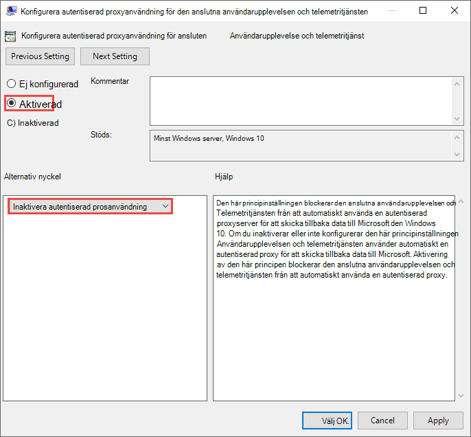
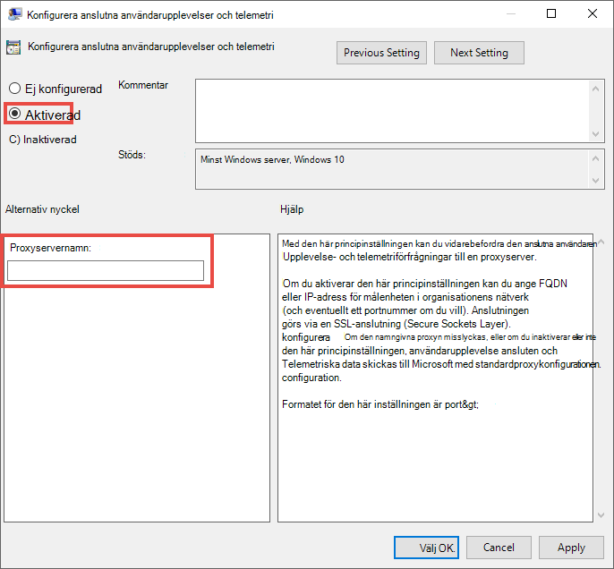

# Konfigurera enhetsproxy- och Internetanslutningsinställningar för slutpunkts-DLP

Microsofts slutpunkts-DLP använder Microsoft Windows HTTP (WinHTTP) till att rapportera data och kommunicera med Microsofts slutpunktsmolntjänst. Den inbäddade slutpunkts-DLP:n körs i systemkontext med hjälp av LocalSystem-kontot.

> [!TIP]
> Organisationer som använder proxyservrar för vidarebefordran som en gateway till Internet, kan använda nätverksskydd till undersökningar bakom en proxy. Mer information finns i [Undersöka anslutningshändelser som inträffar bakom proxyservrar för vidarebefordran](/windows/security/threat-protection/microsoft-defender-atp/investigate-behind-proxy).

WinHTTP-konfigurationsinställningen är fristående från proxyinställningarna för WinINet-surfning (Windows Internet) och kan bara identifiera en proxyserver med följande metoder för automatisk identifiering:

- Transparent proxy
- WPAD (Web Proxy Auto-discovery Protocol)

> [!NOTE]
> Om du använder transparent proxy eller WPAD i nätverkstopologin, behöver du inte några särskilda konfigurationsinställningar. Mer information om URL-undantag för Defender för Endpoint i proxyn finns i [Aktivera åtkomst till URL:er för slutpunkts-DLP:ns molntjänster på proxyservern](#enable-access-to-endpoint-dlp-cloud-service-urls-in-the-proxy-server).

- Manuell konfiguration av statisk proxy:
    - Registerbaserad konfiguration
    - WinHTTP som är konfigurerat med ett netsh-kommando – Endast lämpligt för stationära datorer i en stabil topologi (t.ex. en stationär dator i ett företagsnätverk bakom samma proxy)

## Konfigurera proxyservern manuellt med hjälp av en registerbaserad statisk proxy

För slutpunktsenheter som inte har tillåtelse att ansluta till Internet måste du konfigurera en registerbaserad statisk proxy. Du måste konfigurera detta för att endast Microsofts slutpunkts-DLP ska kunna rapportera diagnostiska data och kommunicera med Microsoft-slutpunktens molntjänst.

Den statiska proxyn kan konfigureras via en grupprincip. Grupprincipen finns under:

1. Öppna **Administrativa mallar > Windows-komponenter > Datainsamling och förhandsversioner > Konfigurera användning av autentiserad proxy för tjänsten Enhetlig användarupplevelse och telemetri**

2. Ställ in den som **Aktiverad** och välj **Inaktivera användning av autentiserad proxy**: 

 
3. Öppna **Administrativa mallar > Windows-komponenter > Datainsamling och förhandsversioner > Konfigurera Enhetlig användarupplevelse och telemetri**:

 Konfigurera proxyn

Principen anger två registervärden `TelemetryProxyServer` som REG_SZ och `DisableEnterpriseAuthProxy` som REG_DWORD under registernyckeln `HKLM\Software\Policies\Microsoft\Windows\DataCollection`.

Registervärdet TelemetryProxyServer är i det här formatet \<server name or ip\>:\<port\>. Till exempel: **10.0.0.6:8080**

Registervärdet `DisableEnterpriseAuthProxy` anges till 1.

## Konfigurera proxyservern manuellt med hjälp av ”netsh”-kommandot

Använd netsh för att konfigurera en systemomfattande statisk proxy.

> [!NOTE]
> Detta påverkar alla program, inklusive Windows-tjänster som använder WinHTTP med standardproxyn. – Bärbara datorer som byter topologi (t.ex. från kontoret till hemmet) fungerar inte med netsh. Använd den registerbaserade statiska proxykonfigurationen.

1. Öppna en upphöjd kommandorad:
    1. Gå till **Start** och skriv **cmd**
    1. Högerklicka på **Kommandotolken** och välj **Kör som administratör**.
2.  Skriv följande kommando och tryck på **Retur**:

    `netsh winhttp set proxy <proxy>:<port>`

    Till exempel: **netsh winhttp set proxy 10.0.0.6:8080**

3. Återställ winhttp-proxyn genom att ange följande kommando och trycka på **Retur**:

     `netsh winhttp reset proxy`

Se [Netsh-kommandosyntax, kontexter och formatering](/windows-server/networking/technologies/netsh/netsh-contexts) för mer information.

## Aktivera åtkomst till URL:er för slutpunkts-DLP:ns molntjänst på proxyservern

Om en proxy eller brandvägg blockerar all trafik som standard och endast tillåter vissa domäner, lägger du till domänerna som visas på det nedladdningsbara bladet i listan med tillåtna domäner.

Det [nedladdningsbara kalkylbladet](https://download.microsoft.com/download/8/a/5/8a51eee5-cd02-431c-9d78-a58b7f77c070/mde-urls.xlsx) visar de tjänster och deras associerade URL:er som nätverket måste kunna ansluta till. Du bör se till att det inte finns några brandväggs- eller nätverksfiltreringsregler som nekar åtkomst till webbadresserna, eller så kan du behöva skapa en särskild regel som tillåter dem.

Om en proxy eller brandvägg har HTTPS-skanning (SSL-inspektion) aktiverad, utesluter du domänerna som visas i tabellen ovan från HTTPS-skanningen.
Om en proxy eller brandvägg blockerar anonym trafik när slutpunkts-DLP:n ansluter från systemets kontext, kontrollerar du att anonym trafik har tillåtits i tidigare listade URL:er.

## Verifiera klientanslutningen till URL:erna för Microsofts molntjänst

Verifiera att proxykonfigurationen har slutförts, att WinHTTP kan identifiera och kommunicera via proxyservern i din miljö och att proxyservern tillåter trafik till URL:erna för Defender för Endpoint-tjänsten.

1. Ladda ned [verktyget för MDATP-klientanalys](https://aka.ms/mdatpanalyzer) till den dator som slutpunkts-DLP:n körs på.
2. Extrahera innehållet i MDATPClientAnalyzer.zip på enheten.
3. Öppna en upphöjd kommandorad:
    1. Gå till **Start** och skriv **cmd**.
    1. Högerklicka på **Kommandotolken** och välj **Kör som administratör**.
4.  Skriv följande kommando och tryck på **Retur**:
    
`HardDrivePath\MDATPClientAnalyzer.cmd`

Ersätt *HardDrivePath* med sökvägen där verktyget MDATPClientAnalyzer laddades ned, till exempel
    
**C:\Work\tools\MDATPClientAnalyzer\MDATPClientAnalyzer.cmd**

5.  Extrahera filen **MDATPClientAnalyzerResult.zip** _ som skapades av verktyget i mappen som används i _HardDrivePath*.

6.  Öppna **MDATPClientAnalyzerResult.txt** och kontrollera att du har utfört proxykonfigurationsstegen som aktiverar serveridentifiering och åtkomst till tjänstens URL:er.  Verktyget kontrollerar anslutningen av URL:erna för Defender för Endpoint-tjänsten som Defender för Endpoint-klienten har konfigurerats att interagera med. Resultatet skrivs sedan i filen **MDATPClientAnalyzerResult.txt** för varje URL som kan användas till att kommunicera med Defender för Endpoint-tjänsterna. Till exempel:

    **Test-URL: https://xxx.microsoft.com/xxx   1 – Standardproxy: Lyckades (200)   2 – Automatisk identifiering av proxy (WPAD): Lyckades (200)  3 – Inaktiverad proxy: Lyckades (200)  4 – Namngiven proxy: Finns inte  5 – Kommandoradsproxy: Finns inte** 

Om minst ett av anslutningsalternativen returnerar en status (200) kan Defender för Endpoint-klienten kommunicera med den testade URL:en med anslutningsmetoden. 

Men om anslutningskontrollens resultat anger att ett fel uppstod, visas ett HTTP-fel (se HTTP-statuskoder). Du kan därefter använda URL:erna i tabellen som visas i [Aktivera åtkomst till URL:er för slutpunkts-DLP:ns molntjänst på proxyservern](#enable-access-to-endpoint-dlp-cloud-service-urls-in-the-proxy-server). Vilka URL:er som kommer att användas beror på den region som valdes under registreringsprocessen.
[!NOTE] Verktyget Connectivity Analyzer är inte kompatibelt med ASR-regeln [Blockera processer som skapas från PSExec- och WMI-kommandon](/windows/security/threat-protection/windows-defender-exploit-guard/attack-surface-reduction#attack-surface-reduction-rules). Du måste inaktivera regeln tillfälligt om du vill köra anslutningsverktyget.

[!NOTE] När TelemetryProxyServer har angetts i registret eller via en grupprincip kommer Defender för Endpoint att dirigeras om den inte har åtkomst till den definierade proxyn.
Närliggande information •   Registrera Windows 10-enheter •   Felsöka problem med Microsoft-registrering av slutpunkts-DLP

## Se även

- [Mer information om dataförlustskydd för slutpunkter](endpoint-dlp-learn-about.md)
- [Använda dataförlustskydd för slutpunkter](endpoint-dlp-using.md)
- [Mer information om dataförlustskydd](dlp-learn-about-dlp.md)
- [Skapa, testa och justera en DLP-princip](create-test-tune-dlp-policy.md)
- [Kom igång med Aktivitetsutforskaren](data-classification-activity-explorer.md)
- [Microsoft Defender för Endpoint](/windows/security/threat-protection/)
- [Registreringsverktyg och metoder för Windows 10-enheter](/windows/security/threat-protection/microsoft-defender-atp/configure-endpoints)
- [Microsoft 365-prenumeration](https://www.microsoft.com/microsoft-365/compare-microsoft-365-enterprise-plans?rtc=1)
- [Azure AD-anslutna enheter](/azure/active-directory/devices/concept-azure-ad-join)
- [Ladda ned nya Microsoft Edge som baseras på Chromium](https://support.microsoft.com/help/4501095/download-the-new-microsoft-edge-based-on-chromium)