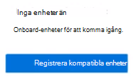
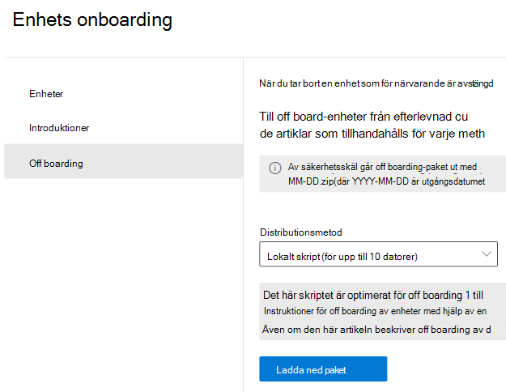

# Komma igång med dataförlustskydd för slutpunkter

Microsofts dataförlustskydd för slutpunkter (Endpoint DLP) är en del av DLP-funktionerna (Data Loss Prevention) i Microsoft 365 som du kan använda för att identifiera och skydda känsliga objekt i Microsoft 365-tjänster. Mer information om alla Microsofts DLP-erbjudanden finns i [Läs mer om skydd mot dataförlust](dlp-learn-about-dlp.md). Mer information om slutpunkts-DLP finns i [Läs mer om dataförlustskydd för slutpunkter](endpoint-dlp-learn-about.md)

Med Microsofts dataförlustskydd för slutpunkter kan du övervaka Windows 10-enheter och identifiera när känsliga objekt används och delas. På så sätt får du den synlighet och kontroll som du behöver för att säkerställa att de används och skyddas på rätt sätt och för att förhindra riskfaktorer som kan avslöja dem.

## Innan du börjar

### Licensiering av SKU/prenumerationer

Innan du börjar med slutpunkts-DLP måste du bekräfta din [Microsoft 365-prenumeration](https://www.microsoft.com/microsoft-365/compare-microsoft-365-enterprise-plans?rtc=1) och eventuella tillägg. Om du vill komma åt och använda slutpunkts-DLP, måste du ha någon av dessa prenumerationer eller tillägg.

- Microsoft 365 E5
- Microsoft 365 A5 (EDU)
- Microsoft 365 E5 Compliance
- Microsoft 365 A5 Compliance
- Microsoft 365 E5 – Informationsskydd och styrning
- Microsoft 365 A5 – Informationsskydd och styrning

### Behörigheter

För att aktivera enhetshantering måste det konto du använder vara medlem i någon av följande roller:

- Global administratör
- Säkerhetsadministratör
- Efterlevnadsadministratör

Om du vill använda ett anpassat konto för att visa inställningar för enhetshantering måste det ingå i någon av följande roller:

- Global administratör
- Efterlevnadsadministratör
- Administratör för efterlevnadsdata
- Global läsare

Om du vill använda ett anpassat konto för att få åtkomst till sidan för registrering/avregistrering måste det ingå i någon av följande roller:

- Global administratör
- Efterlevnadsadministratör

Om du vill använda ett anpassat konto för att aktivera/inaktivera enhetsövervakning måste det ingå i någon av följande roller:

- Global administratör
- Efterlevnadsadministratör

Data från slutpunkts-DLP kan visas i [Aktivitetsutforskaren](data-classification-activity-explorer.md). Det finns fyra roller som ger behörighet till aktivitetsutforskaren och det konto som du använder för att komma åt data måste vara medlem i någon av dem.

- Global administratör
- Efterlevnadsadministratör
- Säkerhetsadministratör
- Administratör för efterlevnadsdata
- Global läsare
- Säkerhetsläsare
- Rapportläsare

### Förbered dina slutpunkter

Kontrollera att de Windows 10-enheter som du planerar att distribuera slutpunkts-DLP till uppfyller de här kraven.

1. Måste köra Windows 10 x64 version 1809 eller senare.

2. Klientversion för program mot skadlig kod version 4.18.2009.7 eller senare. Kontrollera din aktuella version genom att öppna Windows-säkerhet, välja ikonen Inställningar och sedan Om. Versionsnumret visas under Klientversion för program mot skadlig kod. Uppdatera till den senaste klientversionen för program mot skadlig kod genom att installera Windows Update KB4052623. 

   > [!NOTE]
   > Ingen av Windows-säkerhetskomponenterna behöver vara aktiv. Du kan köra slutpunkts-DLP oberoende av Windows-säkerhetsstatus, men [Realtidsskydd och beteendeövervakning](/windows/security/threat-protection/microsoft-defender-antivirus/configure-real-time-protection-microsoft-defender-antivirus) måste vara aktiverat.
 
3. Följande Windows-uppdateringar installeras. 
 
   > [!NOTE]
   > Dessa uppdateringar är inte en förutsättning för att en enhet ska kunna installeras i slutpunkt-DLP, men innehåller korrigeringar för viktiga problem som gör att de måste installeras innan produkten används.

    - För Windows 10 1809 – KB4559003, KB4577069, KB4580390
    - För Windows 10 1903 eller 1909 – KB4559004, KB4577062, KB4580386
    - För Windows 10 2004 – KB4568831, KB4577063
    - För enheter med Office 2016 (och inte någon annan Office-version) – KB4577063 

4. Alla enheter måste vara [Azure Active Directory-anslutna (Azure AD)](/azure/active-directory/devices/concept-azure-ad-join) AD-anslutna, Hybrid Azure AD-anslutna eller AAD-registrerade.

5. Installera webbläsaren Microsoft Chromium Edge på slutpunktsenheten för att framtvinga principåtgärder för aktiviteten uppladdning till moln. Se [Ladda ned nya Microsoft Edge som baseras på Chromium](https://support.microsoft.com/help/4501095/download-the-new-microsoft-edge-based-on-chromium).

6. Om du använder Månadskanal för företag för versionerna 2004–2008 av Microsoft 365-appar finns det ett känt problem med klassificering av Office-innehåll med slutpunkts-DLP och du behöver uppdatera till version 2009 eller senare. Se [Uppdateringshistorik för Microsoft 365-appar (visas efter datum)](/officeupdates/update-history-microsoft365-apps-by-date) för aktuella versioner. Mer information om det här problemet finns i avsnittet Office-programsviten i [Viktig information om aktuella kanalutgivningar under 2020](/officeupdates/current-channel#version-2010-october-27).

7. Om du har slutpunkter som använder en enhetsproxy för att ansluta till Internet följer du procedurerna i [Konfigurera enhetsproxy och Internetanslutningsinställningar för slutpunkts-DLP](endpoint-dlp-configure-proxy.md).

## Registrering av enheter i Enhetshantering

Du måste aktivera enhetsövervakning och registrera dina slutpunkter innan du kan övervaka och skydda känsliga objekt på en enhet. Båda dessa åtgärder utförs i portalen Microsoft 365 Efterlevnad.

Om du vill registrera enheter som ännu inte har registrerats, laddar du ned rätt skript och distribuerar det till de enheterna. Följ [proceduren för att registrera enheter](endpoint-dlp-getting-started.md#onboarding-devices).

Om du redan har enheter registrerade i [Microsoft Defender för Endpoint](/windows/security/threat-protection/) visas de redan i listan över hanterade enheter. Följ proceduren [Med enheter registrerade i Microsoft Defender för Endpoint](?source=docs&view=o365-worldwide#with-devices-onboarded-into-microsoft-defender-for-endpoint).

### Registrera enheter

I det här distributionsscenariot kan du registrera enheter som ännu inte har registrerats, och du bara vill övervaka och skydda känsliga objekt från oavsiktlig delning på Windows 10-enheter.

1. Öppna [Microsoft Efterlevnadscenter](https://compliance.microsoft.com).

2. Öppna inställningssidan för Efterlevnadscenter och välj **Registrera enheter**. 

   > [!div class="mx-imgBorder"]
   > 

   > [!NOTE]
   > Det tar normalt ca 60 sekunder innan enhetsregistreringen är aktiverad, men du kan vänta upp till 30 minuter innan du kontaktar Microsoft Support.

3. Välj **Enhetshantering** för att öppna listan **Enheter**. Listan är tom tills du har registrerat enheter.

4. Välj **Registrering** för att starta registreringsprocessen.

5. Välj hur du vill distribuera till dessa ytterligare enheter i listan **Distributionsmetod** och **ladda sedan ned paketet**.

   > [!div class="mx-imgBorder"]
   > 
   
6. Följ lämpliga instruktioner i [Registrera verktyg och metoder för Windows 10-datorer](/windows/security/threat-protection/microsoft-defender-atp/configure-endpoints). Den här länken tar dig till en landningssida där du kan komma åt procedurer för Microsoft Defender för Endpoint som matchar distributionspaketet du valde i steg 5:

    - Registrera Windows 10-datorer med hjälp av grupprincip
    - Registrera Windows-datorer med Microsoft Endpoint Configuration Manager
    - Registrera Windows 10-datorer med hanteringsverktyg för mobila enheter
    - Registrera Windows 10-datorer med ett lokalt skript
    - Registrera icke beständiga VDI-datorer (Virtual Desktop Infrastructure) i enkelsessionsscenarion.

När du är klar och slutpunkten har registrerats ska den visas i listan över enheter och även börja rapportera granskningsaktivitetsloggar i Aktivitetsutforskaren.

> [!NOTE]
> För den här funktionen tillämpas licensiering. Utan rätt licens kommer data inte att visas och inte vara tillgängliga.

### Med enheter registrerade i Microsoft Defender för Endpoint

I det här scenariot är Microsoft Defender för Endpoint redan distribuerat och det finns slutpunkter som rapporterar. Alla dessa slutpunkter visas i listan över hanterade enheter. Du kan fortsätta registrera nya enheter i slutpunkts-DLP för att få ökad täckning med hjälp av [proceduren för att registrera enheter](endpoint-dlp-getting-started.md#onboarding-devices).

1. Öppna [Microsoft Efterlevnadscenter](https://compliance.microsoft.com).

2. Öppna inställningssidan för Efterlevnadscenter och välj **Aktivera enhetsövervakning**.

3. Välj **Enhetshantering** för att öppna listan **Enheter**. Listan över enheter som redan rapporterar till Microsoft Defender för Endpoint visas.

   > [!div class="mx-imgBorder"]
   > 
   
4. Välj **Registrering** om du behöver registrera ytterligare enheter.

5. Välj hur du vill distribuera till dessa ytterligare enheter i listan **Distributionsmetod** och **ladda sedan ned paketet**.

6. Följ lämpliga instruktioner i [Registrera verktyg och metoder för Windows 10-datorer](/windows/security/threat-protection/microsoft-defender-atp/configure-endpoints). Den här länken tar dig till en landningssida där du kan komma åt procedurer för Microsoft Defender för Endpoint som matchar distributionspaketet du valde i steg 5:

    - Registrera Windows 10-datorer med hjälp av grupprincip
    - Registrera Windows-datorer med Microsoft Endpoint Configuration Manager
    - Registrera Windows 10-datorer med hanteringsverktyg för mobila enheter
    - Registrera Windows 10-datorer med ett lokalt skript
    - Registrera icke beständiga VDI-datorer (Virtual Desktop Infrastructure).

När du är klar och slutpunkten har registrerats ska den visas under tabellen **Enheter** och även börja rapportera granskningsloggar till **Aktivitetsutforskaren**.

> [!NOTE]
>För den här funktionen tillämpas licensiering. Utan rätt licens kommer data inte att visas och inte vara tillgängliga.

### Visa aviseringar för slutpunkts-DLP i instrumentpanelen för hantering av DLP-aviseringar

1. Öppna sidan Dataförlustskydd i Microsoft 365 Efterlevnadscenter och välj Varningar.

2. Se metoderna i [Konfigurera och visa aviseringar för DLP-principer](dlp-configure-view-alerts-policies.md) om du vill se aviseringarna för slutpunkts-DLP-principer.

### Visa data för slutpunkts-DLP i aktivitetsutforskaren

1. Öppna [sidan Dataklassificering](https://compliance.microsoft.com/dataclassification?viewid=overview) för din domän i Microsoft 365 Efterlevnadscenter och välj Aktivitetsutforskaren.

2. Se metoderna i [Kom igång med aktivitetsutforskaren](data-classification-activity-explorer.md) för att komma åt och filtrera alla data för slutpunktsenheterna.

   > [!div class="mx-imgBorder"]
   > 

## Nästa steg
Nu när du har registrerat enheter och kan se aktivitetsdata i aktivitetsutforskaren, kan du gå vidare till nästa steg där du skapar DLP-principer som skyddar dina känsliga objekt.

- [Använda dataförlustskydd för slutpunkter](endpoint-dlp-using.md)

## Se även

- [Mer information om dataförlustskydd för slutpunkter](endpoint-dlp-learn-about.md)
- [Använda dataförlustskydd för slutpunkter](endpoint-dlp-using.md)
- [Mer information om dataförlustskydd](dlp-learn-about-dlp.md)
- [Skapa, testa och justera en DLP-princip](create-test-tune-dlp-policy.md)
- [Kom igång med Aktivitetsutforskaren](data-classification-activity-explorer.md)
- [Microsoft Defender för Endpoint](/windows/security/threat-protection/)
- [Registreringsverktyg och metoder för Windows 10-enheter](/windows/security/threat-protection/microsoft-defender-atp/configure-endpoints)
- [Microsoft 365-prenumeration](https://www.microsoft.com/microsoft-365/compare-microsoft-365-enterprise-plans?rtc=1)
- [Azure AD-anslutna enheter](/azure/active-directory/devices/concept-azure-ad-join)
- [Ladda ned nya Microsoft Edge som baseras på Chromium](https://support.microsoft.com/help/4501095/download-the-new-microsoft-edge-based-on-chromium)
