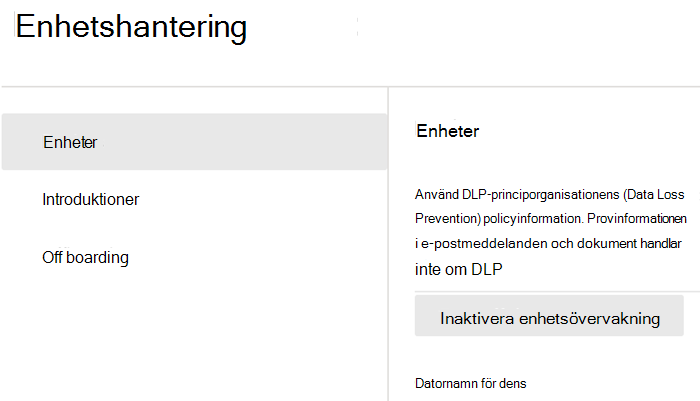

# Komma igång med dataförlustskydd för slutpunkterGet started with Endpoint data loss prevention

Microsofts dataförlustskydd för slutpunkter (Endpoint DLP) är en del av DLP-funktionerna (Data Loss Prevention) i Microsoft 365 som du kan använda för att identifiera och skydda känsliga objekt i Microsoft 365-tjänster.Microsoft Endpoint data loss prevention (Endpoint DLP) is part of the Microsoft 365 data loss prevention (DLP) suite of features you can use to discover and protect sensitive items across Microsoft 365 services. Mer information om alla Microsofts DLP-erbjudanden finns i [Läs mer om skydd mot dataförlust](dlp-learn-about-dlp.md).For more information about all of Microsoft’s DLP offerings, see [Learn about data loss prevention](dlp-learn-about-dlp.md). Mer information om slutpunkts-DLP finns i [Läs mer om dataförlustskydd för slutpunkter](endpoint-dlp-learn-about.md)To learn more about Endpoint DLP, see [Learn about Endpoint data loss prevention](endpoint-dlp-learn-about.md)

Med Microsofts dataförlustskydd för slutpunkter kan du övervaka Windows 10-enheter och identifiera när känsliga objekt används och delas.Microsoft Endpoint DLP allows you to monitor Windows 10 devices and detect when sensitive items are used and shared. På så sätt får du den synlighet och kontroll som du behöver för att säkerställa att de används och skyddas på rätt sätt och för att förhindra riskfaktorer som kan avslöja dem.This gives you the visibility and control you need to ensure that they are used and protected properly, and to help prevent risky behavior that might compromise them.

## Innan du börjarBefore you begin

### Licensiering av SKU/prenumerationerSKU/subscriptions licensing

Innan du börjar med slutpunkts-DLP måste du bekräfta din [Microsoft 365-prenumeration](https://www.microsoft.com/microsoft-365/compare-microsoft-365-enterprise-plans?rtc=1) och eventuella tillägg.Before you get started with Endpoint DLP, you should confirm your [Microsoft 365 subscription](https://www.microsoft.com/microsoft-365/compare-microsoft-365-enterprise-plans?rtc=1) and any add-ons. Om du vill komma åt och använda slutpunkts-DLP, måste du ha någon av dessa prenumerationer eller tillägg.To access and use Endpoint DLP functionality, you must have one of these subscriptions or add-ons.

- Microsoft 365 E5Microsoft 365 E5
- Microsoft 365 A5 (EDU)Microsoft 365 A5 (EDU)
- Microsoft 365 E5 ComplianceMicrosoft 365 E5 compliance
- Microsoft 365 A5 ComplianceMicrosoft 365 A5 compliance
- Microsoft 365 E5 – Informationsskydd och styrningMicrosoft 365 E5 information protection and governance
- Microsoft 365 A5 – Informationsskydd och styrningMicrosoft 365 A5 information protection and governance

### BehörigheterPermissions

För att aktivera enhetshantering måste det konto du använder vara medlem i någon av följande roller:To enable device management, the account you use must be a member of any one of these roles:

- Global administratörGlobal admin
- SäkerhetsadministratörSecurity admin
- EfterlevnadsadministratörCompliance admin

Om du vill använda ett anpassat konto för att visa inställningar för enhetshantering måste det ingå i någon av följande roller:If you want to use a custom account to view the device management settings, it must be in one of these roles:

- Global administratörGlobal admin
- EfterlevnadsadministratörCompliance admin
- Administratör för efterlevnadsdataCompliance data admin
- Global läsareGlobal reader

Om du vill använda ett anpassat konto för att få åtkomst till sidan för registrering/avregistrering måste det ingå i någon av följande roller:If you want to use a custom account to access the onboarding/offboarding page, it must be in one of these roles:

- Global administratörGlobal admin
- EfterlevnadsadministratörCompliance admin

Om du vill använda ett anpassat konto för att aktivera/inaktivera enhetsövervakning måste det ingå i någon av följande roller:If you want to use a custom account to turn on/off device monitoring, it must be in one of these roles:

- Global administratörGlobal admin
- EfterlevnadsadministratörCompliance admin

Data från slutpunkts-DLP kan visas i [Aktivitetsutforskaren](data-classification-activity-explorer.md).Data from Endpoint DLP can be viewed in [Activity explorer](data-classification-activity-explorer.md). Det finns fyra roller som ger behörighet till aktivitetsutforskaren och det konto som du använder för att komma åt data måste vara medlem i någon av dem.There are four roles that grant permission to activity explorer, the account you use for accessing the data must be a member of any one of them.

- Global administratörGlobal admin
- EfterlevnadsadministratörCompliance admin
- SäkerhetsadministratörSecurity admin
- Administratör för efterlevnadsdataCompliance data admin

### Förbered dina slutpunkterPrepare your endpoints

Kontrollera att de Windows 10-enheter som du planerar att distribuera slutpunkts-DLP till uppfyller de här kraven.Make sure that the Windows 10 devices that you plan on deploying Endpoint DLP to meet these requirements.

1. Måste köra Windows 10 x64 version 1809 eller senare.Must be running Windows 10 x64 build 1809 or later.

2. Klientversion för program mot skadlig kod version 4.18.2009.7 eller senare.Antimalware Client Version is 4.18.2009.7 or newer. Kontrollera din aktuella version genom att öppna Windows-säkerhet, välja ikonen Inställningar och sedan Om.Check your current version by opening Windows Security app, select the Settings icon, and then select About. Versionsnumret visas under Klientversion för program mot skadlig kod.The version number is listed under Antimalware Client Version. Uppdatera till den senaste klientversionen för program mot skadlig kod genom att installera Windows Update KB4052623.Update to the latest Antimalware Client Version by installing Windows Update KB4052623.

   > [!NOTE]
   > Ingen av Windows-säkerhetskomponenterna behöver vara aktiv. Du kan köra slutpunkts-DLP oberoende av Windows-säkerhetsstatus, men [Realtidsskydd och beteendeövervakning](/windows/security/threat-protection/microsoft-defender-antivirus/configure-real-time-protection-microsoft-defender-antivirus) måste vara aktiverat.None of Windows Security components need to be active, you can run Endpoint DLP independent of Windows Security status, but the [Real-time protection and Behavior monitor](/windows/security/threat-protection/microsoft-defender-antivirus/configure-real-time-protection-microsoft-defender-antivirus)) must be enabled.

3. Följande Windows-uppdateringar installeras.The following Windows Updates are installed.

   > [!NOTE]
   > Dessa uppdateringar är inte en förutsättning för att en enhet ska kunna installeras i slutpunkt-DLP, men innehåller korrigeringar för viktiga problem som gör att de måste installeras innan produkten används.These updates are not a pre-requisite to onboard a device to Endpoint DLP, but contain fixes for important issues thus must be installed before using the product.

   - För Windows 10 1809 – KB4559003, KB4577069, KB4580390For Windows 10 1809 - KB4559003, KB4577069, KB4580390
   - För Windows 10 1903 eller 1909 – KB4559004, KB4577062, KB4580386For Windows 10 1903 or 1909 - KB4559004, KB4577062, KB4580386
   - För Windows 10 2004 – KB4568831, KB4577063For Windows 10 2004 - KB4568831, KB4577063
   - För enheter med Office 2016 (och inte någon annan Office-version) – KB4577063For devices running Office 2016 (and not any other Office version) - KB4577063

4. Alla enheter måste vara någon av följande:All devices must be one of these:

   - [Azure Active Directory (AAD)-anslutenAzure Active Directory (Azure AD) joined](/azure/active-directory/devices/concept-azure-ad-join)
   - [Hybrid Azure AD-anslutenHybrid Azure AD joined](/azure/active-directory/devices/concept-azure-ad-join-hybrid)
   - [AAD-registreradAAD registered](/azure/active-directory/user-help/user-help-register-device-on-network)

5. Installera webbläsaren Microsoft Chromium Edge på slutpunktsenheten för att framtvinga principåtgärder för aktiviteten uppladdning till moln.Install Microsoft Chromium Edge browser on the endpoint device to enforce policy actions for the upload to cloud activity. Se [Ladda ned nya Microsoft Edge som baseras på Chromium](https://support.microsoft.com/help/4501095/download-the-new-microsoft-edge-based-on-chromium).See, [Download the new Microsoft Edge based on Chromium](https://support.microsoft.com/help/4501095/download-the-new-microsoft-edge-based-on-chromium).

6. Om du använder Månadskanal för företag för versionerna 2004–2008 av Microsoft 365-appar finns det ett känt problem med klassificering av Office-innehåll med slutpunkts-DLP och du behöver uppdatera till version 2009 eller senare.If you are on Monthly Enterprise Channel of Microsoft 365 Apps versions 2004-2008, there is a known issue with Endpoint DLP classifying Office content and you need to update to version 2009 or later. Se [Uppdateringshistorik för Microsoft 365-appar (visas efter datum)](/officeupdates/update-history-microsoft365-apps-by-date) för aktuella versioner.See [Update history for Microsoft 365 Apps (listed by date)](/officeupdates/update-history-microsoft365-apps-by-date) for current versions. Mer information om det här problemet finns i avsnittet Office-programsviten i [Viktig information om aktuella kanalutgivningar under 2020](/officeupdates/current-channel#version-2010-october-27).To learn more about this issue, see the Office Suite section of [Release notes for Current Channel releases in 2020](/officeupdates/current-channel#version-2010-october-27).

7. Om du har slutpunkter som använder en enhetsproxy för att ansluta till Internet följer du procedurerna i [Konfigurera enhetsproxy och Internetanslutningsinställningar för slutpunkts-DLP](endpoint-dlp-configure-proxy.md).If you have endpoints that use a device proxy to connect to the internet, follow the procedures in [Configure device proxy and internet connection settings for Endpoint DLP](endpoint-dlp-configure-proxy.md).

## Registrering av enheter i EnhetshanteringOnboarding devices into device management

Du måste aktivera enhetsövervakning och registrera dina slutpunkter innan du kan övervaka och skydda känsliga objekt på en enhet.You must enable device monitoring and onboard your endpoints before you can monitor and protect sensitive items on a device. Båda dessa åtgärder utförs i portalen Microsoft 365 Efterlevnad.Both of these actions are done in the Microsoft 365 Compliance portal.

Om du vill registrera enheter som ännu inte har registrerats, laddar du ned rätt skript och distribuerar det till de enheterna.When you want to onboard devices that haven't been onboarded yet, you'll download the appropriate script and deploy it to those devices. Följ [proceduren för att registrera enheter](endpoint-dlp-getting-started.md#onboarding-devices).Follow the [Onboarding devices procedure](endpoint-dlp-getting-started.md#onboarding-devices).

Om du redan har enheter registrerade i [Microsoft Defender för Endpoint](/windows/security/threat-protection/) visas de redan i listan över hanterade enheter.If you already have devices onboarded into [Microsoft Defender for Endpoint](/windows/security/threat-protection/), they will already appear in the managed devices list. Följ proceduren [Med enheter registrerade i Microsoft Defender för Endpoint](?source=docs&view=o365-worldwide#with-devices-onboarded-into-microsoft-defender-for-endpoint).Follow the [With devices onboarded into Microsoft Defender for Endpoint procedure](?source=docs&view=o365-worldwide#with-devices-onboarded-into-microsoft-defender-for-endpoint).

### Registrera enheterOnboarding devices

I det här distributionsscenariot kan du registrera enheter som ännu inte har registrerats, och du bara vill övervaka och skydda känsliga objekt från oavsiktlig delning på Windows 10-enheter.In this deployment scenario, you'll onboard devices that have not been onboarded yet, and you just want to monitor and protect sensitive items from unintentional sharing on Windows 10 devices.

1. Öppna [Microsoft Efterlevnadscenter](https://compliance.microsoft.com).Open the [Microsoft compliance center](https://compliance.microsoft.com).

2. Öppna inställningssidan för Efterlevnadscenter och välj **Registrera enheter**.Open the Compliance Center settings page and choose **Onboard devices**.

   > [!div class="mx-imgBorder"]
   > 

   > [!NOTE]
   > Det tar normalt ca 60 sekunder innan enhetsregistreringen är aktiverad, men du kan vänta upp till 30 minuter innan du kontaktar Microsoft Support.While it usually takes about 60 seconds for device onboarding to be enabled, please allow up to 30 minutes before engaging with Microsoft support.

3. Välj **Enhetshantering** för att öppna listan **Enheter**.Choose **Device management** to open the **Devices** list. Listan är tom tills du har registrerat enheter.The list will be empty until you onboard devices.

4. Välj **Registrering** för att starta registreringsprocessen.Choose **Onboarding** to begin the onboarding process.

5. Välj hur du vill distribuera till dessa ytterligare enheter i listan **Distributionsmetod** och **ladda sedan ned paketet**.Choose the way you want to deploy to these additional devices from the **Deployment method** list and then **download package**.

   > [!div class="mx-imgBorder"]
   > 

6. Följ lämpliga instruktioner i [Registrera verktyg och metoder för Windows 10-datorer](/windows/security/threat-protection/microsoft-defender-atp/configure-endpoints).Follow the appropriate procedures in [Onboarding tools and methods for Windows 10 machines](/windows/security/threat-protection/microsoft-defender-atp/configure-endpoints). Den här länken tar dig till en landningssida där du kan komma åt procedurer för Microsoft Defender för Endpoint som matchar distributionspaketet du valde i steg 5:This link takes you to a landing page where you can access Microsoft Defender for Endpoint procedures that match the deployment package you selected in step 5:

    - Registrera Windows 10-datorer med hjälp av grupprincipOnboard Windows 10 machines using Group Policy
    - Registrera Windows-datorer med Microsoft Endpoint Configuration ManagerOnboard Windows machines using Microsoft Endpoint Configuration Manager
    - Registrera Windows 10-datorer med hanteringsverktyg för mobila enheterOnboard Windows 10 machines using Mobile Device Management tools
    - Registrera Windows 10-datorer med ett lokalt skriptOnboard Windows 10 machines using a local script
    - Registrera icke beständiga VDI-datorer (Virtual Desktop Infrastructure) i enkelsessionsscenarion.Onboard non-persistent virtual desktop infrastructure (VDI) machines in single-session scenarios

När du är klar och slutpunkten har registrerats ska den visas i listan över enheter och även börja rapportera granskningsaktivitetsloggar i Aktivitetsutforskaren.Once done and endpoint is onboarded, it should be visible in the devices list and also start reporting audit activity logs to Activity explorer.

> [!NOTE]
> För den här funktionen tillämpas licensiering.This experience is under license enforcement. Utan rätt licens kommer data inte att visas och inte vara tillgängliga.Without the required license, data will not be visible or accessible.

### Med enheter registrerade i Microsoft Defender för EndpointWith devices onboarded into Microsoft Defender for Endpoint

I det här scenariot är Microsoft Defender för Endpoint redan distribuerat och det finns slutpunkter som rapporterar.In this scenario, Microsoft Defender for Endpoint is already deployed and there are endpoints reporting in. Alla dessa slutpunkter visas i listan över hanterade enheter.All these endpoints will appear in the managed devices list. Du kan fortsätta registrera nya enheter i slutpunkts-DLP för att få ökad täckning med hjälp av [proceduren för att registrera enheter](endpoint-dlp-getting-started.md#onboarding-devices).You can continue to onboard new devices into Endpoint DLP to expand coverage by using the [Onboarding devices procedure](endpoint-dlp-getting-started.md#onboarding-devices).

1. Öppna [Microsoft Efterlevnadscenter](https://compliance.microsoft.com).Open the [Microsoft compliance center](https://compliance.microsoft.com).

2. Öppna inställningssidan för Efterlevnadscenter och välj **Aktivera enhetsövervakning**.Open the Compliance Center settings page and choose **Enable device monitoring**.

3. Välj **Enhetshantering** för att öppna listan **Enheter**.Choose **Device management** to open the **Devices** list. Listan över enheter som redan rapporterar till Microsoft Defender för Endpoint visas.You should see the list of devices that are already reporting in to Microsoft Defender for Endpoint.

   > [!div class="mx-imgBorder"]
   > 

4. Välj **Registrering** om du behöver registrera ytterligare enheter.Choose **Onboarding** if you need to onboard additional devices.

5. Välj hur du vill distribuera till dessa ytterligare enheter i listan **Distributionsmetod** och **ladda sedan ned paketet**.Choose the way you want to deploy to these additional devices from the **Deployment method** list and then **Download package**.

6. Följ lämpliga instruktioner i [Registrera verktyg och metoder för Windows 10-datorer](/windows/security/threat-protection/microsoft-defender-atp/configure-endpoints).Follow the appropriate procedures in [Onboarding tools and methods for Windows 10 machines](/windows/security/threat-protection/microsoft-defender-atp/configure-endpoints). Den här länken tar dig till en landningssida där du kan komma åt procedurer för Microsoft Defender för Endpoint som matchar distributionspaketet du valde i steg 5:This link takes you to a landing page where you can access Microsoft Defender for Endpoint procedures that match the deployment package you selected in step 5:
    - Registrera Windows 10-datorer med hjälp av grupprincipOnboard Windows 10 machines using Group Policy
    - Registrera Windows-datorer med Microsoft Endpoint Configuration ManagerOnboard Windows machines using Microsoft Endpoint Configuration Manager
    - Registrera Windows 10-datorer med hanteringsverktyg för mobila enheterOnboard Windows 10 machines using Mobile Device Management tools
    - Registrera Windows 10-datorer med ett lokalt skriptOnboard Windows 10 machines using a local script
    - Registrera icke beständiga VDI-datorer (Virtual Desktop Infrastructure).Onboard non-persistent virtual desktop infrastructure (VDI) machines.

När du är klar och slutpunkten har registrerats ska den visas under tabellen **Enheter** och även börja rapportera granskningsloggar till **Aktivitetsutforskaren**.Once done and endpoint is onboarded, it should be visible under the **Devices** table and also start reporting audit logs to the **Activity Explorer**.

> [!NOTE]
>För den här funktionen tillämpas licensiering.This experience is under license enforcement. Utan rätt licens kommer data inte att visas och inte vara tillgängliga.Without the required license, data will not be visible or accessible.

### Visa aviseringar för slutpunkts-DLP i instrumentpanelen för hantering av DLP-aviseringarViewing Endpoint DLP alerts in DLP Alerts Management dashboard

1. Öppna sidan Dataförlustskydd i Microsoft 365 Efterlevnadscenter och välj Varningar.Open the Data loss prevention page in the Microsoft 365 Compliance center and choose Alerts.

2. Se metoderna i [Konfigurera och visa aviseringar för DLP-principer](dlp-configure-view-alerts-policies.md) om du vill se aviseringarna för slutpunkts-DLP-principer.Refer to the procedures in [How to configure and view alerts for your DLP policies](dlp-configure-view-alerts-policies.md) to view alerts for your Endpoint DLP policies.

### Visa data för slutpunkts-DLP i aktivitetsutforskarenViewing Endpoint DLP data in activity explorer

1. Öppna [sidan Dataklassificering](https://compliance.microsoft.com/dataclassification?viewid=overview) för din domän i Microsoft 365 Efterlevnadscenter och välj Aktivitetsutforskaren.Open the [Data classification page](https://compliance.microsoft.com/dataclassification?viewid=overview) for your domain in the Microsoft 365 Compliance center and choose Activity explorer.

2. Se metoderna i [Kom igång med aktivitetsutforskaren](data-classification-activity-explorer.md) för att komma åt och filtrera alla data för slutpunktsenheterna.Refer to the procedures in [Get started with Activity explorer](data-classification-activity-explorer.md) to access and filter all the data for your Endpoint devices.

   > [!div class="mx-imgBorder"]
   > 

## Nästa stegNext steps

Nu när du har registrerat enheter och kan se aktivitetsdata i aktivitetsutforskaren, kan du gå vidare till nästa steg där du skapar DLP-principer som skyddar dina känsliga objekt.Now that you have onboarded devices and can view the activity data in Activity explorer, you are ready to move on to your next step where you create DLP policies that protect your sensitive items.

- [Använda dataförlustskydd för slutpunkterUsing Endpoint data loss prevention](endpoint-dlp-using.md)

## Se ävenSee also

- [Mer information om dataförlustskydd för slutpunktLearn about Endpoint data loss prevention](endpoint-dlp-learn-about.md)
- [Använda dataförlustskydd för slutpunkterUsing Endpoint data loss prevention](endpoint-dlp-using.md)
- [Mer information om dataförlustskyddLearn about data loss prevention](dlp-learn-about-dlp.md)
- [Skapa, testa och justera en DLP-principCreate, test, and tune a DLP policy](create-test-tune-dlp-policy.md)
- [Kom igång med aktivitetsutforskarenGet started with Activity explorer](data-classification-activity-explorer.md)
- [Microsoft Defender för EndpointMicrosoft Defender for Endpoint](/windows/security/threat-protection/)
- [Registreringsverktyg och metoder för Windows 10-enheterOnboarding tools and methods for Windows 10 machines](/windows/security/threat-protection/microsoft-defender-atp/configure-endpoints)
- [Microsoft 365-prenumerationMicrosoft 365 subscription](https://www.microsoft.com/microsoft-365/compare-microsoft-365-enterprise-plans?rtc=1)
- [Azure AD-anslutna enheterAzure AD joined devices](/azure/active-directory/devices/concept-azure-ad-join)
- [Ladda ned nya Microsoft Edge som baseras på ChromiumDownload the new Microsoft Edge based on Chromium](https://support.microsoft.com/help/4501095/download-the-new-microsoft-edge-based-on-chromium)
