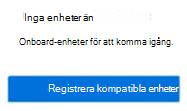
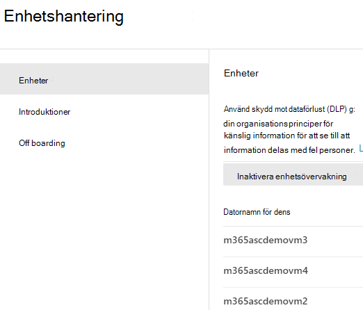
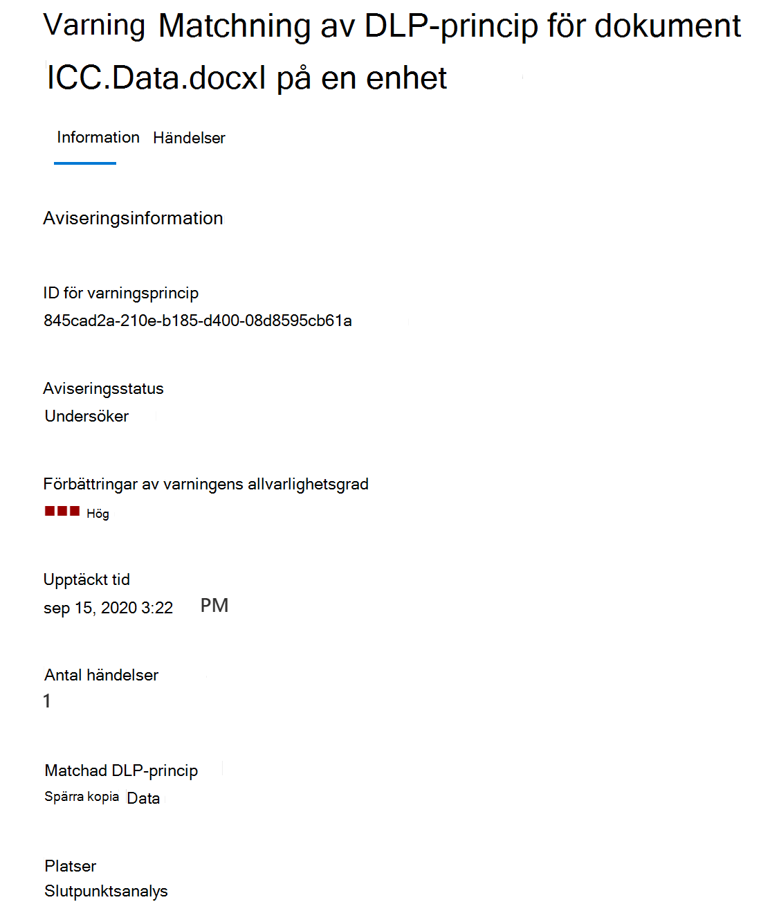

# Mer information om dataförlustskydd för slutpunkter i Microsoft 365Learn about Microsoft 365 Endpoint data loss prevention

Du kan använda dataförlustskyddet (DLP) i Microsoft 365 till att övervaka åtgärder som vidtas för objekt som du har fastställt vara känsliga och för att förhindra oavsiktlig delning av dessa objekt.You can use Microsoft 365 data loss prevention (DLP) to monitor the actions that are being taken on items you've determined to be sensitive and to help prevent the unintentional sharing of those items. Mer information om DLP finns i [Mer information om dataförlustskydd](dlp-learn-about-dlp.md).For more information on DLP, see [Learn about data loss prevention](dlp-learn-about-dlp.md).

**Dataförlustskyddet för slutpunkter** (slutpunkts-DLP) utökar funktionerna för aktivitetsövervakning och säkerhet i DLP till känsliga objekt som finns på Windows 10-enheter.**Endpoint data loss prevention** (Endpoint DLP) extends the activity monitoring and protection capabilities of DLP to sensitive items that are on Windows 10 devices. När enheter har registrerats i efterlevnadslösningarna för Microsoft 365 blir informationen om vad användare gör med känsliga objekt synlig i [aktivitetsutforskaren](data-classification-activity-explorer.md) och du kan vidta skyddsåtgärder för dessa objekt via [DLP-principer](create-test-tune-dlp-policy.md).Once devices are onboarded into the Microsoft 365 compliance solutions, the information about what users are doing with sensitive items is made visible in [activity explorer](data-classification-activity-explorer.md) and you can enforce protective actions on those items via [DLP policies](create-test-tune-dlp-policy.md).

## Slutpunktsaktiviteter som du kan övervaka och vidta åtgärder förEndpoint activities you can monitor and take action on

Med Microsofts slutpunkts-DLP kan du granska och hantera följande typer av aktiviteter som användare utför på känsliga objekt som finns på Windows 10-enheter.Microsoft Endpoint DLP enables you to audit and manage the following types of activities users take on sensitive items on devices running Windows 10. 

|AktivitetActivity |BeskrivningDescription  | Granskningsbar/begränsningsbarAuditable/restictable|
|---------|---------|---------|
|ladda upp till molntjänst, eller ge åtkomst till otillåtna webbläsareupload to cloud service, or access by unallowed browsers    | Upptäcker när en användare försöker ladda upp ett objekt till en begränsad tjänstdomän eller öppna ett objekt via en webbläsare.Detects when a user attempts to upload an item to a restricted service domain or access an item through a browser.  Om en webbläsare används som anges i DLP som en otillåten webbläsare, blockeras uppladdningen och användaren omdirigeras till Edge Chromium.If they are using a browser that is listed in DLP as an being an unallowed browser, the upload activity will be blocked and the user is redirected to use Edge Chromium. Edge Chromium tillåter eller blockerar sedan uppladdningen eller åtkomsten baserat på DLP-principkonfigurationenEdge Chromium will then either allow or block the upload or access based on the DLP policy configuration         |granskningsbart och begränsningsbartauditable and restrictable|
|kopiera till en annan appcopy to other app    |Upptäcker när en användare försöker kopiera information från ett skyddat objekt och sedan klistra in den i en annan app, en annan process eller ett annat objekt.Detects when a user attempts to copy information from a protected item and then paste it into another app, process or item. Att kopiera och klistra in information i samma app, process eller objekt identifieras inte av den här aktiviteten.Copying and pasting information within the same app, process, or item is not detected by this activity.         | granskningsbart och begränsningsbartauditable and restrictable|
|kopiera till USB-flyttbart mediumcopy to USB removable media |Upptäcker när en användare försöker kopiera ett objekt eller information till ett flyttbart medium eller en USB-enhet.Detects when a user attempts to copy an item or information to removable media or USB device.         | granskningsbart och begränsningsbartauditable and restrictable|
|kopiera till en nätverksresurscopy to a network share    |Upptäcker när en användare försöker kopiera ett objekt till en nätverksresurs eller en mappad nätverksenhetDetects when a user attempts to copy an item to a network share or mapped network drive         |granskningsbart och begränsningsbartauditable and restrictable|
|skriva ut ett dokumentprint a document    |Upptäcker när en användare försöker skriva ut ett skyddat objekt till en lokal skrivare eller en nätverksskrivare.Detects when a user attempts to print a protected item to a local or network printer.| granskningsbart och begränsningsbartauditable and restrictable         |
|kopiera till en fjärrsessioncopy to a remote session|Upptäcker när en användare försöker kopiera ett objekt till en session för fjärrdatorerDetects when a user attempts to copy an item to a remote desktop session |  granskningsbart och begränsningsbartauditable and restrictable|
|kopiera till en Bluetooth-enhetcopy to a Bluetooth device|Upptäcker när en användare försöker kopiera ett objekt till en otillåten Bluetooth-app (enligt definitionen i listan med otillåtna Bluetooth-appar i inställningarna för slutpunkts-DLP:n).Detects when a user attempts to copy an item to an unallowed Bluetooth app (as defined in the list of unallowed Bluetooth aps in Endpoint DLP settings).| granskningsbart och begränsningsbartauditable and restrictable|
|skapa ett objekt.create an item|Upptäcker när en användare skapar ett objektDetects when a user creates an item| granskningsbartauditable|
|byta namn på ett objektrename an item|Upptäcker när en användare byter namn på ett objektDetects when a user renames an item| granskningsbartauditable|

 ## Övervakade filerMonitored files

Slutpunkts-DLP:n stöder övervakning av följande filtyper:Endpoint DLP supports monitoring of these file types:

- Word-filerWord files
- PowerPoint-filerPowerPoint files
- Excel-filerExcel files
- PDF-filerPDF files
- .csv-filer.csv files
- .tsv-filer.tsv files
- .txt-filer.txt files
- .rtf-filer.rtf files
- .c-filer.c files
- .class-filer.class files
- .cpp-filer.cpp files
- .cs-filer.cs files
- .h-filer.h files
- .java-filer.java files
 
Som standard granskar slutpunkts-DLP:n aktiviteterna för dessa filtyper, även om det inte finns någon principmatchning.By default, endpoint DLP audits the activities for these file types, even if there isn't a policy match. Om du bara vill övervaka data från principmatchningar kan du stänga av **Granska alltid filaktivitet för enheter** i de globala inställningarna för slutpunkts-DLP:n.If you only want monitoring data from policy matches, you can turn off the **Always audit file activity for devices** in the endpoint DLP global settings. Om inställningen är på granskas alltid aktiviteter i Word-, PowerPoint-, Excel-, PDF- och .csv-filer, även om enheten inte omfattas av någon princip.If this setting is on, activities on any Word, PowerPoint, Excel, PDF, and .csv file are always audited even if the device is not targeted by any policy.

Slutpunkts-DLP:n övervakar aktivitet baserat på MIME-typ, så aktiviteterna samlas in även om filtillägget ändras.Endpoint DLP monitors activity-based on MIME type, so activities will be captured even if the file extension is changed. 

## Vad är annorlunda i slutpunkts-DLP?What's different in Endpoint DLP

Det finns några fler begrepp som du behöver känna till innan du fördjupar dig i slutpunkts-DLP:n.There are a few extra concepts that you need to be aware of before you dig into Endpoint DLP.

### Aktivera enhetshanteringEnabling Device management

Enhetshantering är den funktion som samlar in telemetri från enheter och matar in den i Microsoft 365-efterlevnadslösningar som slutpunkts-DLP och [hantering av interna risker](insider-risk-management.md).Device management is the functionality that enables the collection of telemetry from devices and brings it into Microsoft 365 compliance solutions like Endpoint DLP and [Insider Risk management](insider-risk-management.md). Du måste registrera alla enheter som ska användas som platser i DLP-principerna.You'll need to onboard all devices you want to use as locations in DLP policies.

> [!div class="mx-imgBorder"]
> 

Registrering och avregistrering hanteras via skript som du hämtar från Enhetshanteringscenter.Onboarding and offboarding are handled via scripts you download from the Device management center. Centret har anpassade skript för var och en av dessa distributionsmetoder:The center has custom scripts for each of these deployment methods:

- lokalt skript (upp till 10 datorer)local script (up to 10 machines)
- GrupprincipGroup policy
- System Center Configuration Manager (version 1610 eller senare)System Center Configuration Manager (version 1610 or later)
- Hantering av mobila enheter/Microsoft IntuneMobile Device Management/Microsoft Intune
- VDI-registreringsskript för icke-beständiga datorerVDI onboarding scripts for non-persistent machines

> [!div class="mx-imgBorder"]
> 

 Använd procedurerna i [Komma igång med slutpunkts-DLP i Microsoft 365](endpoint-dlp-getting-started.md) för att registrera enheter.Use the procedures in [Getting started with Microsoft 365 Endpoint DLP](endpoint-dlp-getting-started.md) to onboard devices.

Om du har registrerat enheter via [Microsoft Defender för Endpoint](/windows/security/threat-protection/) visas de enheterna automatiskt i listan med enheter.If you have onboarded devices through [Microsoft Defender for Endpoint](/windows/security/threat-protection/), those devices will automatically show up in the list of devices.

> [!div class="mx-imgBorder"]
> 

### Visa data för slutpunkts-DLPViewing Endpoint DLP data

Du kan se aviseringar om DLP-principer som tillämpas på slutpunktsenheter genom att gå till [instrumentpanelen för hantering av DLP-aviseringar](dlp-configure-view-alerts-policies.md).You can view alerts related to DLP policies enforced on endpoint devices by going to the [DLP Alerts Management Dashboard](dlp-configure-view-alerts-policies.md).

> [!div class="mx-imgBorder"]
> 

Du kan också se information om den associerade händelsen med omfattande metadata i samma instrumentpanelYou can also view details of the associated event with rich metadata in the same dashboard

> [!div class="mx-imgBorder"]
> 

När en enhet har registrerats flödar information om granskade aktiviteter till aktivitetsutforskaren redan innan du har konfigurerat och distribuerat DLP-principer som har enheter som en plats.Once a device is onboarded, information about audited activities flows into Activity explorer even before you configure and deploy any DLP policies that have devices as a location.

> [!div class="mx-imgBorder"]
> 

Slutpunkts-DLP:n samlar in omfattande information om den granskade aktiviteten.Endpoint DLP collects extensive information on audited activity.

Om en fil till exempel kopieras till ett flyttbart USB-medium visas följande attribut i aktivitetsinformationen:For example, if a file is copied to removable USB media, you'd see these attributes in the activity details:

- aktivitetstypactivity type
- klient-IPclient IP
- sökväg till målfiltarget file path
- tidsstämpelhappened timestamp
- filnamnfile name
- användareuser
- filtilläggfile extension
- filstorlekfile size
- typ av känslig information (om tillämpligt)sensitive information type (if applicable)
- sha1-värdesha1 value
- sha256-värdesha256 value
- tidigare filnamnprevious file name
- platslocation
- överordnadparent
- filsökvägfilepath
- källplatstypsource location type
- plattformplatform
- enhetsnamndevice name
- målplatstypdestination location type
- program som utförde kopianapplication that performed the copy
- Enhets-ID till Microsoft Defender för Endpoint (om tillämpligt)Microsoft Defender for Endpoint device ID (if applicable)
- tillverkare av flyttbar medieenhetremovable media device manufacturer
- modell för flyttbar medieenhetremovable media device model
- serienummer för flyttbar medieenhetremovable media device serial number

> [!div class="mx-imgBorder"]
> 

## Nästa stegNext steps

Nu när du har lärt dig mer om slutpunkts-DLP är nästa steg:Now that you've learned about Endpoint DLP, your next steps are:

1) [Komma igång med Microsofts dataförlustskydd för slutpunkterGetting started with Microsoft Endpoint data loss prevention ](endpoint-dlp-getting-started.md)
2) [Använda Microsofts dataförlustskydd för slutpunkterUsing Microsoft Endpoint data loss prevention](endpoint-dlp-using.md)

## Se ävenSee also

- [Komma igång med Microsofts dataförlustskydd för slutpunkterGetting started with Microsoft Endpoint data loss prevention](endpoint-dlp-getting-started.md)
- [Använda Microsofts dataförlustskydd för slutpunkterUsing Microsoft Endpoint data loss prevention](endpoint-dlp-using.md)
- [Mer information om dataförlustskyddLearn about data loss prevention](dlp-learn-about-dlp.md)
- [Skapa, testa och justera en DLP-principCreate, test, and tune a DLP policy](create-test-tune-dlp-policy.md)
- [Kom igång med aktivitetsutforskarenGet started with Activity explorer](data-classification-activity-explorer.md)
- [Microsoft Defender för EndpointMicrosoft Defender for Endpoint](/windows/security/threat-protection/)
- [Hantering av interna riskerInsider Risk management](insider-risk-management.md)