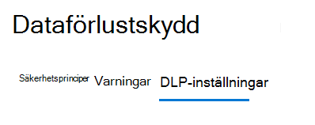
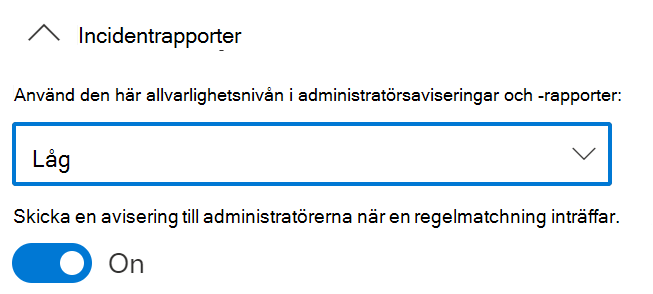
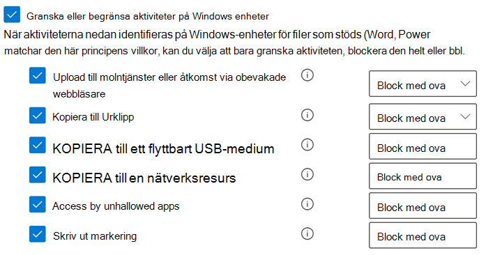
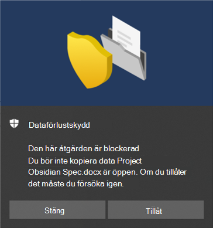

# Använda Dataförlustskydd för slutpunkt

Den här artikeln beskriver tre scenarier där du skapar och ändrar en DLP-princip som använder enheter som plats.

## DLP-inställningar

Innan du börjar bör du konfigurera DLP-inställningarna som tillämpas för alla DLP-principer för enheter. Du måste konfigurera dessa om du tänker skapa principer som tillämpar:

- begränsningar för utgående moln
- begränsningar för otillåtna appar

Eller

- Om du vill utesluta störande filsökvägar från övervakning

  > [!div class="mx-imgBorder"]
  > 

### Sökvägsundantag

Du kanske vill utesluta vissa sökvägar från DLP-övervakning, DLP-aviseringar och tillämpning av DLP-principen på dina enheter eftersom de är för störande eller inte innehåller filer som du är intresserad av. Filer på dessa platser granskas inte och filer som skapas eller ändras på dessa platser omfattas inte av tillämpningen av DLP-principen. Du kan konfigurera sökvägsundantag i DLP-inställningarna.

Du kan använda den här logiken för att skapa undantagssökvägarna:

- Giltig sökväg som slutar med ”\”, vilket innebär endast filer direkt under mappen.  Till exempel: C:\Temp\

- Giltig sökväg som slutar med ”\*”, vilket innebär endast filer under undermappar, förutom filerna direkt under mappen.  Till exempel: C:\Temp\*

- Giltig sökväg som slutar utan ”\” eller ”\*”, vilket innebär alla filer direkt under mappen och alla undermappar.  Till exempel: C:\Temp

- En sökväg med jokertecken mellan ”\” på varje sida.  Till exempel: C:\Users\*\Desktop\

- En sökväg med jokertecken mellan ”\” på varje sida och med ”(siffra)” för att ge exakt antal undermappar.  Till exempel: C:\Users\*(1)\Downloads\

- En sökväg med SYSTEM-miljövariabler.  Till exempel: %SystemDrive%\Test\*

- En blandning av ovanstående alternativ.  Till exempel: %SystemDrive%\Users\*\Documents\*(2)\Sub\

### Otillåtna appar

När en princips inställning för **åtkomst via appar och webbläsare som inte tillåts** är aktiverad och användare försöker använda apparna för att få åtkomst till en skyddad fil kommer aktiviteten att tillåtas, blockeras eller blockeras med möjlighet för användare att åsidosätta begränsningen. Alla aktiviteter granskas och är tillgängliga för granskning i aktivitetsutforskaren.

> [!IMPORTANT]
> Ta inte med sökvägen för den körbara filen utan bara den körbara filens namn (till exempel browser.exe).

### Bluetooth-appar som inte tillåts

Hindra andra från att överföra filer som skyddas av dina principer via specifika Bluetooth-appar.

### Begränsningar för webbläsare och domäner
Begränsa känsliga filer som matchar dina principer från att delas med obegränsade molntjänstdomäner.

#### Tjänstdomäner

Du kan styra om känsliga filer som skyddas av dina principer kan laddas upp till specifika tjänstdomäner från Microsoft Edge.

Om listläget är inställt på **Blockera** kan användaren inte ladda upp känsliga objekt till dessa domäner. När en uppladdningsåtgärd blockeras på grund av att ett objekt matchar en DLP-princip genererar DLP antingen en varning eller blockerar uppladdningen av det känsliga objektet.

Om listläget är inställt på **Tillåt** kan användarna **_bara_** ladda upp känsliga objekt till de domänerna, och uppladdningsåtkomst till alla andra domäner tillåts inte.

> [!IMPORTANT]
> När tjänstens begränsningsläge är inställd på ”Tillåt” måste du ha minst en tjänstdomän konfigurerad innan begränsningarna tillämpas.

#### Otillåtna webbläsare

Du lägger till webbläsare, som identifieras av sina körbara filnamn, som blockeras från att komma åt filer som matchar villkoren för en tillämpad DLP-princip där begränsningen för uppladdning till molntjänster är inställd på blockering eller blockering och åsidosättning. När dessa webbläsare blockeras från att komma åt en fil får slutanvändarna ett popup-meddelande om att de ska öppna filen via Microsoft Edge Chromium.

### Affärsmotivering i principtips

Du kan styra hur användare interagerar med alternativet för affärsmotivering i DLP-principtipsmeddelanden. Det här alternativet visas när användare utför en aktivitet som skyddas av inställningen **Blockera med åsidosättning** i en DLP-princip. Du kan välja bland följande alternativ:

- Som standard kan användare välja antingen en inbyggd motivering eller ange egen text.
- Användare kan bara välja en inbyggd motivering.
- Användare kan bara ange en egen motivering.

### Granska alltid filaktivitet för enheter

När enheter är integrerade granskas som standard aktivitet för Office-, PDF- och CSV-filer automatiskt och blir tillgängliga för granskning i Aktivitetsutforskaren. Inaktivera den här funktionen om du vill att aktiviteten bara ska granskas när integrerade enheter ingår i en aktiv princip.

Filaktivitet granskas alltid för integrerade enheter, oavsett om de ingår i en aktiv princip eller inte.

## Binda samman DLP-inställningar

Med DLP för slutpunkt och Microsoft Edge Chromium-webbläsaren kan du begränsa oavsiktlig delning av känsliga objekt till otillåtna molnappar och tjänster. Microsoft Edge Chromium vet när ett objekt begränsas av en DLP-princip för slutpunkt och tillämpar åtkomstbegränsningar.

Om du använder DLP för slutpunkt som en plats i en korrekt konfigurerad DLP-princip och Microsoft Edge Chromium-webbläsaren förhindras de otillåtna webbläsare som du har definierat i de här inställningarna från att komma åt känsliga objekt som matchar dina DLP-principkontroller. Istället omdirigeras användarna till att använda Microsoft Edge Chromium och Microsoft Edge Chromium, som med sin förståelse av DLP-införda begränsningar kan blockera eller begränsa aktiviteter när villkoren i DLP-principen uppfylls.

För att använda den här begränsningen måste du konfigurera tre viktiga delar:

1. Ange platser – tjänster, domäner, IP-adresser – som du vill förhindra att känsliga objekt delas till.

2. Lägg till de webbläsare som inte tillåts komma åt vissa känsliga objekt när en DLP-principmatchning inträffar.

3. Konfigurera DLP-principer för att definiera typerna av känsliga objekt vars uppladdning ska begränsas till endast dessa platser genom att aktivera alternativet för att **ladda upp till molntjänster** och **åtkomst av otillåten webbläsare**.

Du kan fortsätta att lägga till nya tjänster, program och principer för att utöka begränsningarna så att de uppfyller verksamhetens behov och skyddar känsliga data. 

Den här konfigurationen säkerställer att dina data förblir säkra samtidigt som du undviker onödiga begränsningar som förhindrar eller begränsar användare från att komma åt och dela icke-känsliga objekt.

## Scenarier för DLP-principer för slutpunkt

För att bekanta dig med DLP-funktioner för slutpunkt, och hur de visar sig i DLP-principer, har vi skapat scenarier som du kan följa.

> [!IMPORTANT]
> De här DLP-scenarierna för slutpunkt är inte officiella procedurer för att skapa och justera DLP-principer. Läs följande avsnitt om du behöver arbeta med DLP-principer i allmänna situationer:

>- [Mer information om dataförlustskydd](dlp-learn-about-dlp.md)
>- [Kom igång med DLP-standardprincipen](get-started-with-the-default-dlp-policy.md)
>- [Skapa en DLP-princip från en mall](create-a-dlp-policy-from-a-template.md)
>- [Skapa, testa och justera en DLP-princip](create-test-tune-dlp-policy.md)

### Scenario 1: Skapa en princip från en mall, endast granskning

De här scenarierna kräver att du redan har enheter som har registrerats och rapporterar till aktivitetsutforskaren. Om du inte har registrerat enheter än kan du läsa mer i [Komma igång med dataförlustskydd för slutpunkter](endpoint-dlp-getting-started.md).

1. Öppna [sidan Dataförlustskydd](https://compliance.microsoft.com/datalossprevention?viewid=policies).

2. Välj **Skapa princip**.

3. I det här scenariot väljer du **Sekretess** och **Amerikanska PII-data (personligt identifierbar information)**, och väljer sedan **Nästa**.

4. Inaktivera fältet **Status** för alla platser utom **Enheter**. Välj **Nästa**.

5. Acceptera standardalternativet för att **granska och anpassa inställningarna från mallen** och välj **Nästa**.

6. Acceptera standardvärdena för **Skyddsåtgärder** och välj **Nästa**.

7. Välj **Granska eller begränsa aktiviteter på Windows-enheter** och låt åtgärderna vara inställda på **Granska endast**. Välj **Nästa**.

8. Acceptera standardvärdet **Jag vill testa först** och välj **Visa principtips när testläge används**. Välj **Nästa**.

9. Granska inställningarna och välj **Skicka**.

10. Den nya DLP-principen visas i principlistan.

11. Sök efter data från de övervakade slutpunkterna i aktivitetsutforskaren. Ange platsfiltret för enheter och lägg till principen. Filtrera sedan efter principnamn om du vill se den här principens påverkan. Du kan läsa mer i [Kom igång med aktivitetsutforskaren](data-classification-activity-explorer.md) om det behövs.

12. Försök dela ett test som innehåller innehåll som utlöser villkoret för amerikanska PII-data (personligt identifierbar information) med någon utanför organisationen. Det bör utlösa principen.

13. Sök efter händelsen i aktivitetsutforskaren.

### Scenario 2: Ändra den befintliga principen, ange en avisering

1. Öppna [sidan Dataförlustskydd](https://compliance.microsoft.com/datalossprevention?viewid=policies).

2. Välj principen **Amerikanska PII-data (personligt identifierbar information)** som du skapade i det första scenariot.

3. Välj **Redigera princip**.

4. Gå till sidan **Avancerade DLP-regler** och redigera alternativet för **En liten mängd innehåll upptäcktes. USA:s PII**.

5. Bläddra ned till avsnittet **Incidentrapporter** och ställ in **Skicka en varning till administratörer när en regelmatchning inträffar** på **På**. E-postaviseringar skickas automatiskt till administratören och alla andra du lägger till i listan över mottagare. 

   > [!div class="mx-imgBorder"]
   > 
   
6. Välj **Skicka en avisering varje gång en aktivitet matchar regeln** för det här scenariot.

7. Välj **Spara**.

8. Behåll alla tidigare inställningar genom att välja **Nästa** och **Skicka** sedan principändringarna.

9. Försök dela ett test som innehåller innehåll som utlöser villkoret för amerikanska PII-data (personligt identifierbar information) med någon utanför organisationen. Det bör utlösa principen.

10. Sök efter händelsen i aktivitetsutforskaren.

### Scenario 3: Ändra den befintliga principen, blockera åtgärden med tillåten åsidosättning

1. Öppna [sidan Dataförlustskydd](https://compliance.microsoft.com/datalossprevention?viewid=policies).

2. Välj principen **Amerikanska PII-data (personligt identifierbar information)** som du skapade i det första scenariot.

3. Välj **Redigera princip**.

4. Gå till sidan **Avancerade DLP-regler** och redigera alternativet för **En liten mängd innehåll upptäcktes. USA:s PII**.

5. Bläddra ned till avsnittet **Granska eller begränsa aktiviteter på Windows-enheter**. För varje aktivitet anger du motsvarande åtgärd till  **Blockera med åsidosättning**.

   > [!div class="mx-imgBorder"]
   > 
   
6. Välj **Spara**.

7. Upprepa steg 4–7 för **En stor mängd innehåll upptäcktes. USA:s PII**.

8. Behåll alla tidigare inställningar genom att välja **Nästa** och **Skicka** sedan principändringarna.

9. Försök dela ett test som innehåller innehåll som utlöser villkoret för amerikanska PII-data (personligt identifierbar information) med någon utanför organisationen. Det bör utlösa principen.

   Ett popup-fönster som det här visas på klientenheten:

   > [!div class="mx-imgBorder"]
   > 

10. Sök efter händelsen i aktivitetsutforskaren.

## Se även

- [Mer information om dataförlustskydd för slutpunkt](endpoint-dlp-learn-about.md)
- [Komma igång med dataförlustskydd för slutpunkt](endpoint-dlp-getting-started.md)
- [Mer information om dataförlustskydd](dlp-learn-about-dlp.md)
- [Skapa, testa och justera en DLP-princip](create-test-tune-dlp-policy.md)
- [Kom igång med aktivitetsutforskaren](data-classification-activity-explorer.md)
- [Microsoft Defender för Endpoint](/windows/security/threat-protection/)
- [Registreringsverktyg och metoder för Windows 10-enheter](/microsoft-365/compliance/dlp-configure-endpoints)
- [Microsoft 365-prenumeration](https://www.microsoft.com/microsoft-365/compare-microsoft-365-enterprise-plans?rtc=1)
- [Azure Active Directory (AAD)-ansluten](/azure/active-directory/devices/concept-azure-ad-join)
- [Ladda ned nya Microsoft Edge som baseras på Chromium](https://support.microsoft.com/help/4501095/download-the-new-microsoft-edge-based-on-chromium)
- [Kom igång med DLP-standardprincipen](get-started-with-the-default-dlp-policy.md)
- [Skapa en DLP-princip från en mall](create-a-dlp-policy-from-a-template.md)
