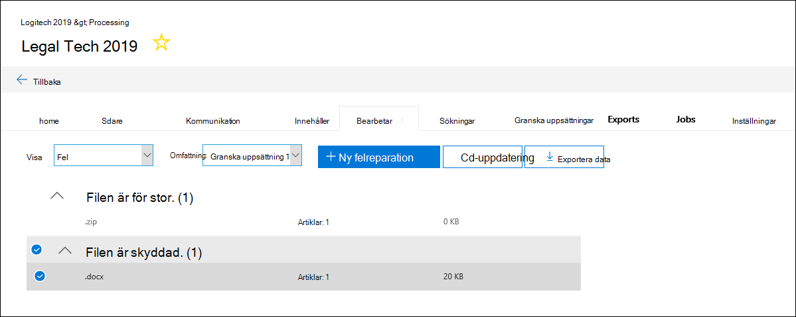
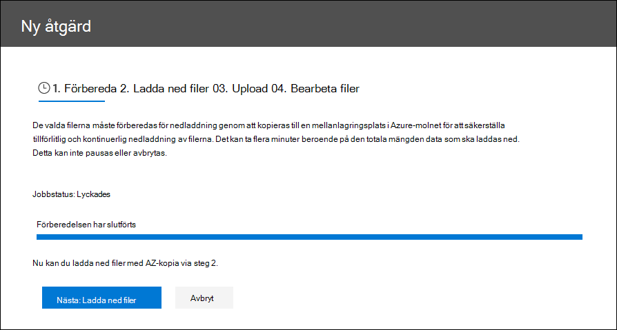
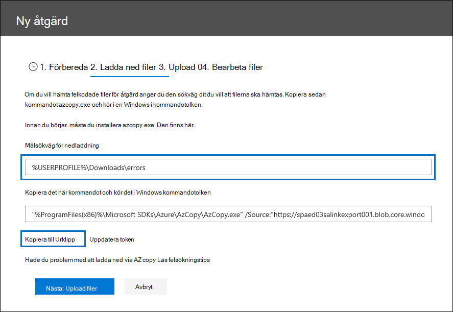
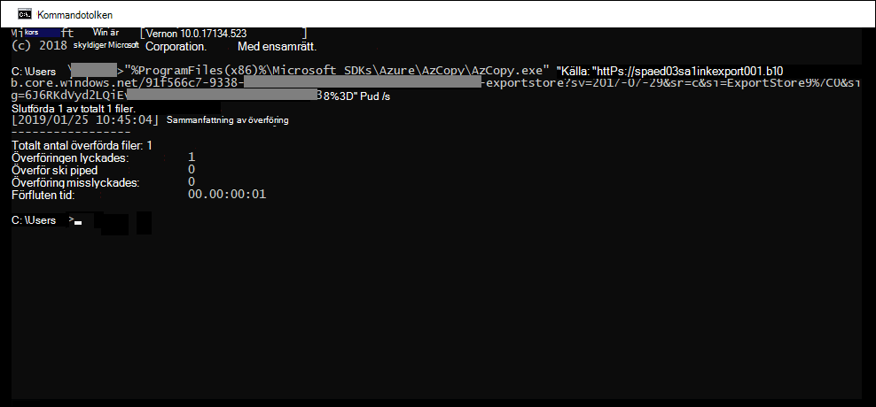
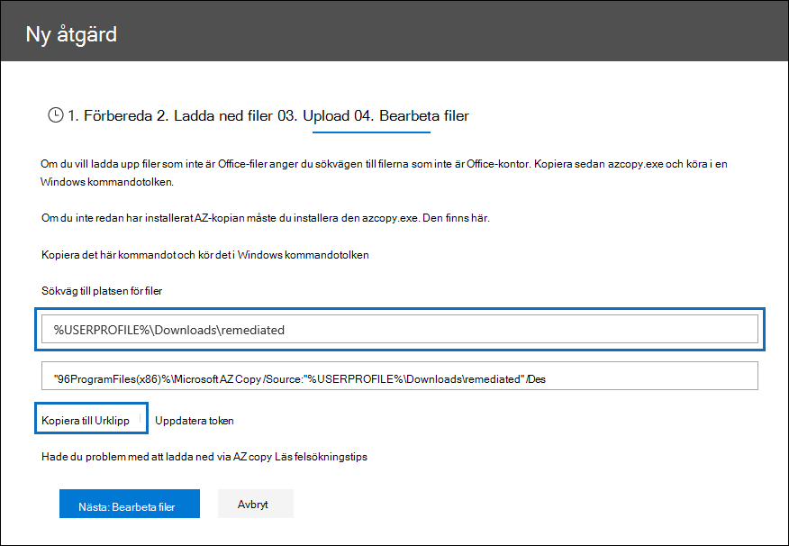
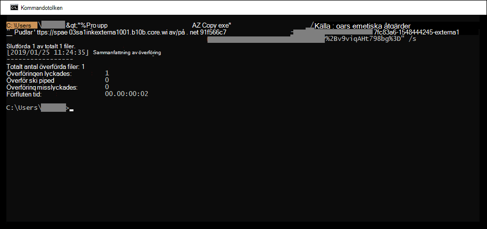

# Åtgärda fel vid bearbetning av data

Felreparation gör att eDiscovery-administratörer kan hantera dataproblem som Advanced eDiscovery att bearbeta innehållet på rätt sätt. Till exempel kan inte lösenordsskyddade filer bearbetas eftersom filerna är låsta eller krypterade. Med hjälp av felreparation kan eDiscovery-administratörer ladda ned filer med sådana fel, ta bort lösenordsskyddet och sedan ladda upp de åtgärdade filerna.

Använd följande arbetsflöde för att åtgärda filer med fel i Advanced eDiscovery fall.

## Skapa en session för felreparation för att åtgärda filer med bearbetningsfel

>[!NOTE]
>Om åtgärdsguiden är stängd när som helst under följande procedur kan du återgå till  felreparationssessionen på  fliken Bearbetning genom att välja Åtgärder i den nedrullningsmenyn Visa. 

1. På fliken **Bearbetning** i Advanced eDiscovery fallet väljer du Fel  i den nedrullningsmenyn Visa och väljer sedan  en **granskningsuppsättning** eller hela ärendet i listrutan Omfattning. I det här avsnittet visas alla fel från ärendet eller felet från en viss granskningsuppsättning.

   

2. Markera de fel du vill åtgärda genom att klicka på alternativknappen bredvid feltypen eller filtypen.  I följande exempel åtgärdar vi en lösenordsskyddad fil.

3. Klicka **på Ny felreparation**.

    Arbetsflödet för felreparation börjar med en förberedelsefas där filerna med fel kopieras till en Plats som tillhandahålls av Microsoft Azure Storage så att du kan ladda ned dem till din lokala dator för att åtgärda det.

    

4. När förberedelsen är klar klickar du på **Nästa: Ladda ned filer för** att fortsätta med nedladdningen.

    

5. Om du vill ladda ned filer anger **du målsökvägen för nedladdning**. Det här är en sökväg till den överordnade mappen på den lokala datorn dit filen ska laddas ned.  Standardsökvägen, %USERPROFILE%\Downloads\errors, pekar på den inloggade användarens hämtade mapp. Du kan ändra den här sökvägen om du vill. Om du ändrar den rekommenderar vi att du använder en lokal filsökväg för bästa prestanda. Använd inte en fjärrnätverkssökväg. Du kan till exempel använda sökvägen **C:\Remediation.** 

   Sökvägen till den överordnade mappen läggs automatiskt till i AzCopy-kommandot (som värdet för **parametern /Dest).**

6. Kopiera det fördefinierade kommandot genom att klicka **på Kopiera till Urklipp.** Öppna ett Windows Kommandotolk, klistra in kommandot AzCopy och tryck sedan på **Retur.**  

        

    > [!NOTE]
    > Du måste använda AzCopy v8.1 om du vill använda kommandot som finns på **sidan Ladda ned** filer. Du måste också använda AzCopy v8.1 för att ladda upp filerna i steg 10. Information om hur du installerar den här versionen av AzCopy finns i Överföra data med [AzCopy v8.1 på Windows](/previous-versions/azure/storage/storage-use-azcopy). Om det angivna AzCopy-kommandot misslyckas kan du [gå till Felsöka AzCopy i Advanced eDiscovery.](troubleshooting-azcopy.md)

    De valda filerna laddas ned till den plats som du angav i steg 5. I den överordnade mappen (till exempel **C:\Remediation)** skapas automatiskt följande undermappsstruktur:

    `<Parent folder>\Subfolder 1\Subfolder 2\<file>`

    - *Undermapp 1* namnges med ID för ärendet eller granskningsuppsättningen, beroende på omfattningen som du valde i steg 1.

    - *Undermapp 2 namnges* med fil-ID för den nedladdade filen

    - Den nedladdade filen finns i *undermapp 2 och* har även namnet fil-ID.

    Här är ett exempel på mappsökvägen och det felfilnamn som skapas när objekt hämtas till den överordnade **mappen C:\Remediation:**

    `C:\Remediation\232f8b7e-089c-4781-88c6-210da0615d32\d1459499146268a096ea20202cd029857d64087706e6d6ca2a224970ae3b8938\d1459499146268a096ea20202cd029857d64087706e6d6ca2a224970ae3b8938.docx`

    Om flera filer laddas ned laddas var och en ned till en undermapp som namnges med fil-ID.

    > [!IMPORTANT]
    > När du laddar upp filer i steg 9 och steg 10 måste de åtgärdade filerna ha samma filnamn och finnas i samma undermappsstruktur. Undermappen och filnamnen används för att associera den åtgärdade filen med den ursprungliga felfilen. Om mappstrukturen eller filnamnen ändras får du följande felmeddelande: `Cannot apply Error Remediation to the current Workingset` . För att förhindra problem rekommenderar vi att du sparar de åtgärdade filerna i samma överordnade mapp och undermappsstruktur.

7. När du har laddat ned filerna kan du åtgärda dem med ett lämpligt verktyg. För lösenordsskyddade filer finns det flera verktyg för återställning av lösenord som du kan använda. Om du har lösenorden till filerna kan du öppna dem och ta bort lösenordsskyddet.

8. Återgå till Advanced eDiscovery och felreparationsguiden och klicka sedan på **Nästa: Upload filer**.  Nu flyttas du till nästa sida där du kan ladda upp filerna.

    

9. Ange den överordnade mapp där de åtgärdade filerna finns i **textrutan Sökväg till** plats för filer. Den överordnade mappen måste ha samma undermappsstruktur som skapades när du laddade ned filerna.

    Sökvägen till den överordnade mappen läggs automatiskt till i AzCopy-kommandot (som värdet på **parametern /Source).**

10. Kopiera det fördefinierade kommandot genom att klicka **på Kopiera till Urklipp.** Öppna ett Windows Kommandotolk, klistra in kommandot AzCopy och tryck sedan på **Retur.** ladda upp filerna.

    

11. När du har kört kommandot AzCopy klickar du på **Nästa: Bearbeta filer**.

    När bearbetningen är klar kan du gå till granskningsuppsättningen och visa de åtgärdade filerna. 

## Åtgärdar fel i behållarfiler

I situationer när innehållet i en behållarfil (till exempel en .zip-fil) inte kan extraheras av Advanced eDiscovery kan behållarna laddas ned och innehållet expanderas till samma mapp där den ursprungliga behållaren finns. De utökade filerna tilldelas den överordnade behållaren som om den ursprungligen expanderades av Advanced eDiscovery. Processen fungerar enligt beskrivningen ovan, med undantag för att ladda upp en enda fil som ersättningsfil.  Inkludera inte den ursprungliga behållarfilen när du laddar upp åtgärdade filer.

## Åtgärda fel genom att ladda upp den extraherade texten

Ibland går det inte att åtgärda så att filen får det ursprungliga format som Advanced eDiscovery kan tolka. Men du kan ersätta den ursprungliga filen med en textfil som innehåller originaltexten i den ursprungliga filen (i en process som kallas *textöverlägg*). Det gör du genom att följa stegen som beskrivs i den här artikeln men i stället för att åtgärda den ursprungliga filen i det ursprungliga formatet skapar du en textfil som innehåller den extraherade texten från den ursprungliga filen och laddar sedan upp textfilen med det ursprungliga filnamnet som lagts till med ett .txt-suffix. Du kan till exempel ladda ned en fil vid felreparation med filnamnet 335850cc-6602-4af0-acfa-1d14d9128ca2.abc. Du öppnar filen i det ursprungliga programmet, kopierar texten och klistrar sedan in den i en ny fil med namnet 335850cc-6602-4af0-acfa-1d14d9128ca2.abc.txt. När du gör det måste du ta bort den ursprungliga filen i det ursprungliga formatet från platsen för den åtgärdade filen på den lokala datorn innan du laddar upp den åtgärdade textfilen till Advanced eDiscovery.

## Vad händer när filer åtgärdas?

När åtgärdade filer överförs bevaras de ursprungliga metadata, förutom följande fält: 

- ExtractedTextSize
- HasText
- IsErrorRemediate
- LoadId
- ProcessingErrorMessage
- ProcessingStatus
- Text
- WordCount
- WorkingsetId

En definition av alla metadatafält i Advanced eDiscovery finns i [Dokumentmetadatafält](document-metadata-fields-in-advanced-ediscovery.md).