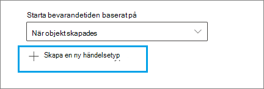

# <a name="start-retention-when-an-event-occurs"></a><span data-ttu-id="18467-103">Starta kvarhållning när en händelse inträffar</span><span class="sxs-lookup"><span data-stu-id="18467-103">Start retention when an event occurs</span></span>

><span data-ttu-id="18467-104">*[Vägledning för säkerhet och efterlevnad med licensiering i Microsoft 365](/office365/servicedescriptions/microsoft-365-service-descriptions/microsoft-365-tenantlevel-services-licensing-guidance/microsoft-365-security-compliance-licensing-guidance).*</span><span class="sxs-lookup"><span data-stu-id="18467-104">*[Microsoft 365 licensing guidance for security & compliance](/office365/servicedescriptions/microsoft-365-service-descriptions/microsoft-365-tenantlevel-services-licensing-guidance/microsoft-365-security-compliance-licensing-guidance).*</span></span>

<span data-ttu-id="18467-105">När du behåller innehåll baseras kvarhållningsperioden ofta på innehållets ålder.</span><span class="sxs-lookup"><span data-stu-id="18467-105">When you retain content, the retention period is often based on the age of the content.</span></span> <span data-ttu-id="18467-106">Du kan till exempel hålla kvar dokument i sju år efter att de har skapats och sedan ta bort dem.</span><span class="sxs-lookup"><span data-stu-id="18467-106">For example, you might retain documents for seven years after they're created and then delete them.</span></span> <span data-ttu-id="18467-107">Men när du konfigurerar [kvarhållningsetiketter](retention.md#retention-labels) kan du också basera en kvarhållningsperiod på när en specifik typ av händelse inträffar.</span><span class="sxs-lookup"><span data-stu-id="18467-107">But when you configure [retention labels](retention.md#retention-labels), you can also base a retention period on when a specific type of event occurs.</span></span> <span data-ttu-id="18467-108">Händelsen utlöser start av kvarhållningsperioden, och allt innehåll med en kvarhållningsetikett för den typen av händelse tillämpad behandlas enligt etikettens kvarhållningsåtgärder.</span><span class="sxs-lookup"><span data-stu-id="18467-108">The event triggers the start of the retention period, and all content with a retention label applied for that type of event get the label's retention actions enforced on them.</span></span>
  
<span data-ttu-id="18467-109">Exempel på användning av händelsebaserad kvarhållning:</span><span class="sxs-lookup"><span data-stu-id="18467-109">Examples for using event-based retention:</span></span>
  
- <span data-ttu-id="18467-110">**Anställda som lämnar organisationen** Anta att handlingar för anställda måste behållas i tio år från det att en anställd lämnar organisationen.</span><span class="sxs-lookup"><span data-stu-id="18467-110">**Employees leaving the organization** Suppose that employee records must be retained for 10 years from the time an employee leaves the organization.</span></span> <span data-ttu-id="18467-111">Efter tio år måste alla dokument som är relaterade till anställning, prestanda och uppsägning av den medarbetaren förstöras.</span><span class="sxs-lookup"><span data-stu-id="18467-111">After 10 years elapse, all documents related to the hiring, performance, and termination of that employee must be disposed.</span></span> <span data-ttu-id="18467-112">Händelsen som utlöser kvarhållningsperioden på tio år är att den anställde lämnar organisationen.</span><span class="sxs-lookup"><span data-stu-id="18467-112">The event that triggers the 10-year retention period is the employee leaving the organization.</span></span> 
    
- <span data-ttu-id="18467-113">**Avtal som upphör att gälla** Anta att alla arkivhandlingar som är relaterade till avtal måste behållas i fem år från det att avtalet upphör att gälla.</span><span class="sxs-lookup"><span data-stu-id="18467-113">**Contract expiration** Suppose that all records related to contracts must be retained for five years from the time the contract expires.</span></span> <span data-ttu-id="18467-114">Den händelse som utlöser kvarhållningsperioden på fem år är avtalets upphörande.</span><span class="sxs-lookup"><span data-stu-id="18467-114">The event that triggers the five-year retention period is the expiration of the contract.</span></span> 
    
- <span data-ttu-id="18467-115">**Produktlivslängd** Organisationen kan ha kvarhållningskrav relaterade till senaste tillverkningsdatum för produkter för innehåll som exempelvis tekniska specifikationer.</span><span class="sxs-lookup"><span data-stu-id="18467-115">**Product lifetime** Your organization might have retention requirements related to the last manufacturing date of products for content such as technical specifications.</span></span> <span data-ttu-id="18467-116">I så fall är sista tillverkningsdatum den händelse som utlöser kvarhållningsperioden.</span><span class="sxs-lookup"><span data-stu-id="18467-116">In this case, the last manufacturing date is the event that triggers the retention period.</span></span> 
    
<span data-ttu-id="18467-p105">Händelsebaserad kvarhållning används vanligtvis som en del av en process för hantering av arkivhandlingar. Det innebär att:</span><span class="sxs-lookup"><span data-stu-id="18467-p105">Event-based retention is typically used as part of a records-management process. This means that:</span></span>
  
- <span data-ttu-id="18467-119">Kvarhållningsetiketter baserade på händelser markerar vanligtvis också objekt som en post, som en del av en lösning för hantering av arkivhandlingar.</span><span class="sxs-lookup"><span data-stu-id="18467-119">Retention labels based on events also usually mark items as a record, as a part of a records management solution.</span></span> <span data-ttu-id="18467-120">Mer information finns i [Läs mer om hantering av arkivhandlingar](records-management.md).</span><span class="sxs-lookup"><span data-stu-id="18467-120">For more information, see [Learn about records management](records-management.md).</span></span>

- <span data-ttu-id="18467-121">Ett dokument som har deklarerats som en post men vars händelseutlösare ännu inte har inträffat, behålls på obestämd tid (arkivhandlingar kan inte tas bort permanent) förrän en händelse utlöser dokumentets kvarhållningsperiod.</span><span class="sxs-lookup"><span data-stu-id="18467-121">A document that's been declared a record but whose event trigger has not yet happened is retained indefinitely (records can't be permanently deleted), until an event triggers that document's retention period.</span></span>
    
- <span data-ttu-id="18467-122">Kvarhållningsetiketter baserade på händelser utlöser vanligtvis en borttagningsgranskning i slutet av kvarhållningsperioden så att den ansvariga för arkivhandlingar kan granska och förstöra innehållet manuellt.</span><span class="sxs-lookup"><span data-stu-id="18467-122">Retention labels based on events usually trigger a disposition review at the end of the retention period, so that a records manager can manually review and dispose of the content.</span></span> <span data-ttu-id="18467-123">Mer information finns i [Borttagning av innehåll](disposition.md).</span><span class="sxs-lookup"><span data-stu-id="18467-123">For more information, see [Disposition of content](disposition.md).</span></span>
    

<span data-ttu-id="18467-124">En kvarhållningsetikett som är baserad på en händelse har samma funktioner som kvarhållningsetiketter i Microsoft 365.</span><span class="sxs-lookup"><span data-stu-id="18467-124">A retention label based on an event has the same capabilities as any retention label in Microsoft 365.</span></span> <span data-ttu-id="18467-125">Mer information finns i [Mer information om kvarhållningsprinciper och kvarhållningsetiketter](retention.md).</span><span class="sxs-lookup"><span data-stu-id="18467-125">For more information, see [Learn about retention policies and retention labels](retention.md).</span></span>

## <a name="understanding-the-relationship-between-event-types-labels-events-and-asset-ids"></a><span data-ttu-id="18467-126">Förstå förhållandet mellan händelsetyper, etiketter, händelser och tillgångs-ID</span><span class="sxs-lookup"><span data-stu-id="18467-126">Understanding the relationship between event types, labels, events, and asset IDs</span></span>

<span data-ttu-id="18467-127">Om du vill använda händelsebaserad kvarhållning är det viktigt att förstå förhållandet mellan händelsetyper, kvarhållningsetiketter, händelser och tillgångs-ID, som illustreras i diagrammen och den förklaring som följer:</span><span class="sxs-lookup"><span data-stu-id="18467-127">To successfully use event-based retention, it's important to understand the relationship between event types, retention labels, events, and asset IDs as illustrated in the diagrams and the explanation that follows:</span></span> 
  

  

  
1. <span data-ttu-id="18467-p109">Du skapar kvarhållningsetiketter för olika typer av innehåll och kopplar dem sedan till en typ av händelse. Kvarhållningsetiketter för olika typer av produktfiler och -poster är till exempel kopplade till en händelsetyp som heter Produktlivslängd eftersom de posterna måste behållas i tio år från det att produkten når slutet av produktens livscykel.</span><span class="sxs-lookup"><span data-stu-id="18467-p109">You create retention labels for different types of content and then associate them with a type of event. For example, retention labels for different types of product files and records are associated with an event type named Product Lifetime because those records must be retained for 10 years from the time the product reaches its end of life.</span></span>
    
2. <span data-ttu-id="18467-132">Användare (vanligtvis personer som hanterar arkivhandlingar) tillämpar dessa kvarhållningsetiketter på innehåll och (för dokument i SharePoint och OneDrive) anger ett tillgångs-ID för varje objekt.</span><span class="sxs-lookup"><span data-stu-id="18467-132">Users (typically records managers) apply those retention labels to content and (for documents in SharePoint and OneDrive) enter an asset ID for each item.</span></span> <span data-ttu-id="18467-133">I det här exemplet är tillgångs-ID ett produktnamn eller en kod som används av organisationen.</span><span class="sxs-lookup"><span data-stu-id="18467-133">In this example, the asset ID is a product name or code used by the organization.</span></span> <span data-ttu-id="18467-134">Varje produkts poster tilldelas sedan en kvarhållningsetikett och varje post har en egenskap som innehåller ett tillgångs-ID.</span><span class="sxs-lookup"><span data-stu-id="18467-134">Then, each product's records are assigned a retention label, and each record has a property that contains an asset ID.</span></span> <span data-ttu-id="18467-135">Diagrammet representerar **allt innehåll** för alla produktposter i en organisation och varje objekt innehar tillgångs-ID:t för produkten som posten hör till.</span><span class="sxs-lookup"><span data-stu-id="18467-135">The diagram represents **all the content** for all product records in an organization, and each item bears the asset ID of the product whose record it is.</span></span> 
    
3. <span data-ttu-id="18467-136">Produktlivslängd är händelsetypen. När en specifik produkt når slutet av livscykeln är det en händelse.</span><span class="sxs-lookup"><span data-stu-id="18467-136">Product Lifetime is the event type; a specific product reaching end of life is an event.</span></span> <span data-ttu-id="18467-137">När en händelse av den händelsetypen inträffar – i det här fallet när en produkt når slutet av sin livslängd – skapar du en händelse som anger:</span><span class="sxs-lookup"><span data-stu-id="18467-137">When an event of that event type occurs—in this case, when a product reaches its end of life—you create an event that specifies:</span></span>
    
   - <span data-ttu-id="18467-138">Ett tillgångs-ID (för SharePoint- och OneDrive-dokument)</span><span class="sxs-lookup"><span data-stu-id="18467-138">An asset ID (for SharePoint and OneDrive documents)</span></span>
    
   - <span data-ttu-id="18467-p112">Nyckelord (för Exchange-objekt). I det här exemplet använder organisationen en produktkod i meddelanden som innehåller produktposter, så nyckelordet för Exchange-objekt fungerar på samma sätt som tillgångs-ID:t för SharePoint- och OneDrive-dokument.</span><span class="sxs-lookup"><span data-stu-id="18467-p112">Keywords (for Exchange items). In this example, the organization uses a product code in messages containing product records, so the keyword for Exchange items is functionally the same as the asset ID for SharePoint and OneDrive documents.</span></span>
    
   - <span data-ttu-id="18467-141">Datumet när händelsen inträffade.</span><span class="sxs-lookup"><span data-stu-id="18467-141">The date when the event occurred.</span></span> <span data-ttu-id="18467-142">Det här datumet används som start för kvarhållningsperioden.</span><span class="sxs-lookup"><span data-stu-id="18467-142">This date is used as the start of the retention period.</span></span> <span data-ttu-id="18467-143">Datumet kan vara det aktuella, ett tidigare eller ett framtida datum.</span><span class="sxs-lookup"><span data-stu-id="18467-143">This date can be the current, a past, or a future date.</span></span>

4. <span data-ttu-id="18467-144">När du har skapat en händelse synkroniseras händelsedatumet med allt innehåll som har en kvarhållningsetikett för den händelsetypen och som innehåller det angivna tillgångs-ID:t eller nyckelordet.</span><span class="sxs-lookup"><span data-stu-id="18467-144">After you create an event, that event date is synchronized to all the content that has a retention label of that event type and that contains the specified asset ID or keyword.</span></span> <span data-ttu-id="18467-145">Precis som alla kvarhållningsetiketter kan den här synkroniseringen ta upp till sju dagar.</span><span class="sxs-lookup"><span data-stu-id="18467-145">Like any retention label, this synchronization can take up to seven days.</span></span> <span data-ttu-id="18467-146">I det föregående diagrammet utlöses kvarhållningsperioden av den här händelsen för alla objekt som ringats in i rött.</span><span class="sxs-lookup"><span data-stu-id="18467-146">In the previous diagram, all the items circled in red have their retention period triggered by this event.</span></span> <span data-ttu-id="18467-147">När produkten når slutet av sin livslängd utlöser händelsen med andra ord kvarhållningsperioden för den produktens poster.</span><span class="sxs-lookup"><span data-stu-id="18467-147">In other words, when this product reaches its end of life, that event triggers the retention period for that product's records.</span></span>

<span data-ttu-id="18467-148">Det är viktigt att förstå att om du inte anger ett tillgångs-ID eller nyckelord för en händelse, utlöser händelsen kvarhållningsperioden för **allt innehåll** med en etikett av den händelsetypen.</span><span class="sxs-lookup"><span data-stu-id="18467-148">It's important to understand that if you don't specify an asset ID or keywords for an event, **all content** with a retention label of that event type will have its retention period triggered by the event.</span></span> <span data-ttu-id="18467-149">Det innebär att kvarhållningen för allt innehåll i det föregående diagrammet skulle startas..</span><span class="sxs-lookup"><span data-stu-id="18467-149">This means that in the previous diagram, all content would start being retained.</span></span> <span data-ttu-id="18467-150">Det kanske inte är vad du avsåg.</span><span class="sxs-lookup"><span data-stu-id="18467-150">This might not be what you intend.</span></span>

<span data-ttu-id="18467-p116">Slutligen måste du komma ihåg att varje kvarhållningsetikett har egna kvarhållningsinställningar. I det här exemplet anges alla som tio år, men en händelse kan utlösa kvarhållningsetiketter där varje etikett har olika kvarhållningsperioder.</span><span class="sxs-lookup"><span data-stu-id="18467-p116">Finally, remember that each retention label has its own retention settings. In this example, they all specify 10 years, but it's possible for an event to trigger retention labels where each label has a different retention period.</span></span>
  
## <a name="how-to-set-up-event-driven-retention"></a><span data-ttu-id="18467-153">Konfigurera händelseutlöst kvarhållning</span><span class="sxs-lookup"><span data-stu-id="18467-153">How to set up event-driven retention</span></span>

<span data-ttu-id="18467-154">Arbetsflöde på hög nivå för händelseberoende kvarhållning:</span><span class="sxs-lookup"><span data-stu-id="18467-154">High-level workflow for event-driven retention:</span></span>
  

  
> [!TIP]
> <span data-ttu-id="18467-156">I [Hantera livscykeln för dokument som lagras i SharePoint med hjälp av kvarhållningsetiketter](auto-apply-retention-labels-scenario.md) finns ett exempelscenario om hur du använder hanterade egenskaper i SharePoint för att automatiskt tillämpa kvarhållningsetiketter och implementera händelseutlöst kvarhållning.</span><span class="sxs-lookup"><span data-stu-id="18467-156">See [Use retention labels to manage the lifecycle of documents stored in SharePoint](auto-apply-retention-labels-scenario.md) for a detailed scenario about using managed properties in SharePoint to auto-apply retention labels and implement event-driven retention.</span></span>

### <a name="step-1-create-a-label-whose-retention-period-is-based-on-an-event"></a><span data-ttu-id="18467-157">Steg 1: Skapa en etikett vars kvarhållningstid baseras på en händelse.</span><span class="sxs-lookup"><span data-stu-id="18467-157">Step 1: Create a label whose retention period is based on an event</span></span>

<span data-ttu-id="18467-158">Anvisningar för hur du skapar och konfigurerar kvarhållningsetiketter finns i [Skapa kvarhållningsetiketter](./create-apply-retention-labels.md#step-1-create-retention-labels).</span><span class="sxs-lookup"><span data-stu-id="18467-158">To create and configure your retention label, see the instructions for [Create retention labels](./create-apply-retention-labels.md#step-1-create-retention-labels).</span></span> <span data-ttu-id="18467-159">När det gäller händelsebaserad kvarhållning går du till sidan **Definiera kvarhållningsinställningar** i guiden Skapa kvarhållningsetikett. Efter **Starta kvarhållningsperioden baserat på** väljer du någon av standardhändelsetyperna i listrutan eller skapar en egen genom att välja **Skapa ny händelsetyp**:</span><span class="sxs-lookup"><span data-stu-id="18467-159">But specific to event-based retention, on the **Define retention settings** page of the Create retention label wizard, after **Start the retention period based on**, select one of the default event types from the dropdown list, or create your own by selecting **Create new event type**:</span></span>



<span data-ttu-id="18467-161">En händelsetyp är bara en allmän beskrivning av en händelse som du vill associera med en kvarhållningsetikett.</span><span class="sxs-lookup"><span data-stu-id="18467-161">An event type is simply a general description of an event that you want to associate with a retention label.</span></span>

<span data-ttu-id="18467-162">Standardhändelsetyperna har **(händelsetyp)** efter namnet i listrutan för enklare identifiering, och du kan även visa och skapa händelsetyp från fliken **Hantering av arkivhandlingar** > **Händelser** > **Hantera händelsetyper**.</span><span class="sxs-lookup"><span data-stu-id="18467-162">The default event types have **(event type)** after their name in the dropdown list for easier identification, and you can also see and create event type from the **Records management** > **Events** tab > **Manage event types**.</span></span>

<span data-ttu-id="18467-163">För händelsebaserad kvarhållning krävs inställningar för kvarhållning som:</span><span class="sxs-lookup"><span data-stu-id="18467-163">Event-based retention requires retention settings that:</span></span>
  
- <span data-ttu-id="18467-164">Behåller innehållet.</span><span class="sxs-lookup"><span data-stu-id="18467-164">Retain the content.</span></span>
    
- <span data-ttu-id="18467-165">Tar bort innehållet automatiskt eller utlöser en borttagningsgranskning i slutet av kvarhållningsperioden.</span><span class="sxs-lookup"><span data-stu-id="18467-165">Delete the content automatically or trigger a disposition review at the end of the retention period.</span></span>
  
<span data-ttu-id="18467-166">Händelsebaserad kvarhållning används vanligtvis för innehåll som deklarerar en arkivpost. Det är därför ett bra tillfälle att kontrollera om du även behöver välja det alternativ som markerar innehåll som en [post](records-management.md#records).</span><span class="sxs-lookup"><span data-stu-id="18467-166">Event-based retention is typically used for content that's declared a record, so this is a good time to check whether you also need to select the option that marks content as a [record](records-management.md#records).</span></span>

<span data-ttu-id="18467-167">Om du använder en befintlig händelsetyp i stället för att skapa en ny händelsetyp går du vidare till steg 3.</span><span class="sxs-lookup"><span data-stu-id="18467-167">If you're using an existing event type rather than creating a new event type, skip to step 3.</span></span>

> [!NOTE]
> <span data-ttu-id="18467-168">När du väljer en händelsetyp och sparar kvarhållningsetiketten kan händelsetypen inte ändras.</span><span class="sxs-lookup"><span data-stu-id="18467-168">After you choose an event type and save the retention label, the event type cannot be changed.</span></span>

### <a name="step-2-create-a-new-event-type-for-your-label"></a><span data-ttu-id="18467-169">Steg 2: Skapa en ny händelsetyp för en kvarhållningsetikett</span><span class="sxs-lookup"><span data-stu-id="18467-169">Step 2: Create a new event type for your label</span></span>

<span data-ttu-id="18467-170">Om du har valt **Skapa ny händelsetyp** anger du ett namn och en beskrivning för kvarhållningsinställningarna.</span><span class="sxs-lookup"><span data-stu-id="18467-170">For the retention settings, if you selected **Create new event type**, enter a name and description for your event type.</span></span> <span data-ttu-id="18467-171">Välj sedan **Nästa**, **Skicka** och **Klart**.</span><span class="sxs-lookup"><span data-stu-id="18467-171">Then select **Next**, **Submit**, and **Done**.</span></span>

<span data-ttu-id="18467-172">Tillbaka på sidan **Definiera kvarhållningsinställningar** väljer du händelsetypen som du skapade i listrutan i **Starta kvarhållningsperioden baserat på**.</span><span class="sxs-lookup"><span data-stu-id="18467-172">Back on the **Define retention settings** page, for **Start the retention period based on**, use the dropdown list to select the event type that you created.</span></span>

  
### <a name="step-3-publish-or-auto-apply-the-event-based-retention-labels"></a><span data-ttu-id="18467-173">Steg 3: Publicera eller tillämpa de händelsebaserade kvarhållningsetiketterna automatiskt</span><span class="sxs-lookup"><span data-stu-id="18467-173">Step 3: Publish or auto-apply the event-based retention labels</span></span>

<span data-ttu-id="18467-174">Precis som för alla kvarhållningsetiketter måste du publicera eller tillämpa en händelsebaserad etikett automatiskt för att den ska kunna användas manuellt eller automatiskt på innehåll:</span><span class="sxs-lookup"><span data-stu-id="18467-174">Just like any retention label, you need to publish or auto-apply an event-based label, for it to be manually or automatically applied to content:</span></span>
- [<span data-ttu-id="18467-175">Skapa kvarhållningsetiketter och använda dem i appar</span><span class="sxs-lookup"><span data-stu-id="18467-175">Create retention labels and apply them in apps</span></span>](create-apply-retention-labels.md)
- [<span data-ttu-id="18467-176">Använda en kvarhållningsetikett på innehåll automatiskt</span><span class="sxs-lookup"><span data-stu-id="18467-176">Apply a retention label to content automatically</span></span>](apply-retention-labels-automatically.md)

### <a name="step-4-enter-an-asset-id"></a><span data-ttu-id="18467-177">Steg 4: Ange ett tillgångs-ID</span><span class="sxs-lookup"><span data-stu-id="18467-177">Step 4: Enter an asset ID</span></span>

<span data-ttu-id="18467-p119">När en händelsebaserad etikett används på innehåll kan du ange ett tillgångs-ID för varje objekt. Din organisation kan till exempel använda:</span><span class="sxs-lookup"><span data-stu-id="18467-p119">After an event-based label is applied to content, you can enter an asset ID for each item. For example, your organization might use:</span></span>
  
- <span data-ttu-id="18467-180">Produktkoder som du kan använda för att hålla kvar innehåll för endast en specifik produkt.</span><span class="sxs-lookup"><span data-stu-id="18467-180">Product codes that you can use to retain content for only a specific product.</span></span>
    
- <span data-ttu-id="18467-181">Projektkoder som du kan använda för att hålla kvar innehåll för endast ett specifikt projekt.</span><span class="sxs-lookup"><span data-stu-id="18467-181">Project codes that you can use to retain content for only a specific project.</span></span>
    
- <span data-ttu-id="18467-182">Anställnings-ID:n som du kan använda för att hålla kvar innehåll för endast en specifik person.</span><span class="sxs-lookup"><span data-stu-id="18467-182">Employee IDs that you can use to retain content for only a specific person.</span></span>
    
<span data-ttu-id="18467-183">Tillgångs-ID är bara ytterligare en dokumentegenskap som är tillgänglig i SharePoint och OneDrive.</span><span class="sxs-lookup"><span data-stu-id="18467-183">Asset ID is simply another document property that's available in SharePoint and OneDrive.</span></span> <span data-ttu-id="18467-184">Organisationen kanske redan använder andra dokumentegenskaper och ID:n för att klassificera innehåll.</span><span class="sxs-lookup"><span data-stu-id="18467-184">Your organization might already use other document properties and IDs to classify content.</span></span> <span data-ttu-id="18467-185">I så fall kan du även använda de egenskaperna och värdena när du skapar en händelse – se steg 6 som följer.</span><span class="sxs-lookup"><span data-stu-id="18467-185">If so, you can also use those properties and values when you create an event—see step 6 that follows.</span></span> <span data-ttu-id="18467-186">Det viktiga är att du måste använda en *egenskap:värde*-kombination i dokumentegenskaperna för att associera objektet med en händelsetyp.</span><span class="sxs-lookup"><span data-stu-id="18467-186">The important point is that you must use some *property:value* combination in the document properties to associate that item with an event type.</span></span>
  

  
### <a name="step-5-create-an-event"></a><span data-ttu-id="18467-188">Steg 5: Skapa en händelse</span><span class="sxs-lookup"><span data-stu-id="18467-188">Step 5: Create an event</span></span>

<span data-ttu-id="18467-189">När en viss instans av den händelsetypen inträffar, till exempel när en produkt når slutet av sin livslängd, går du till sidan **Hantering av arkivhandlingar** > **Händelser** i efterlevnadscentret för Microsoft 365 och väljer **+ Skapa** för att skapa en händelse.</span><span class="sxs-lookup"><span data-stu-id="18467-189">When a particular instance of that event type occurs, such as a product reaches its end of life, go to the **Records management** > **Events** page in the Microsoft 365 compliance center, and select **+ Create** to create an event.</span></span> <span data-ttu-id="18467-190">Du utlöser händelsen genom att skapa den här.</span><span class="sxs-lookup"><span data-stu-id="18467-190">You trigger the event by creating it, here.</span></span>


<span data-ttu-id="18467-192">Upp till en miljon händelser stöds per klientorganisation.</span><span class="sxs-lookup"><span data-stu-id="18467-192">Up to one million events are supported per tenant.</span></span>

### <a name="step-6-choose-the-same-event-type-used-by-the-label-in-step-2"></a><span data-ttu-id="18467-193">Steg 6: Välj samma händelsetyp som används av etiketten i steg 2</span><span class="sxs-lookup"><span data-stu-id="18467-193">Step 6: Choose the same event type used by the label in step 2</span></span>

<span data-ttu-id="18467-194">När du skapar händelsen väljer du samma händelsetyp som anges i inställningarna för kvarhållningsetiketten i steg 2.</span><span class="sxs-lookup"><span data-stu-id="18467-194">When you create the event, choose the same event type specified in the retention label settings in step 2.</span></span> <span data-ttu-id="18467-195">Om du till exempel valde **Produktlivslängd** som händelsetyp för etikettinställningarna väljer du **Produktlivslängd** när du skapar händelsen.</span><span class="sxs-lookup"><span data-stu-id="18467-195">For example, if you selected **Product Lifetime** as your event type for the label settings, select **Product Lifetime** when you create the event.</span></span> <span data-ttu-id="18467-196">Kvarhållningsperioden utlöses bara för innehåll med kvarhållningsetiketter av den händelsetypen.</span><span class="sxs-lookup"><span data-stu-id="18467-196">Only content with retention labels applied to it of that event type will have its retention period triggered.</span></span>


<span data-ttu-id="18467-198">Om du behöver skapa en händelse för flera kvarhållningsetiketter som har olika händelsetyper väljer du alternativet **Välj befintliga etiketter**.</span><span class="sxs-lookup"><span data-stu-id="18467-198">Alternatively, if you need to create an event for multiple retention labels that have different event types, select the **Choose Existing Labels** option.</span></span> <span data-ttu-id="18467-199">Välj sedan de etiketter som är konfigurerade för de händelsetyper som du vill associera med händelsen.</span><span class="sxs-lookup"><span data-stu-id="18467-199">Then, select the labels that are configured for the event types you want to associate with this event.</span></span>

### <a name="step-7-enter-keywords-or-query-for-exchange-asset-id-for-sharepoint-and-onedrive"></a><span data-ttu-id="18467-200">Steg 7: ange nyckelord eller fråga för Exchange, tillgångs-ID för SharePoint och OneDrive</span><span class="sxs-lookup"><span data-stu-id="18467-200">Step 7: Enter keywords or query for Exchange, asset ID for SharePoint and OneDrive</span></span>

<span data-ttu-id="18467-201">Nu begränsar du innehålletsomfattning.</span><span class="sxs-lookup"><span data-stu-id="18467-201">Now you narrow the scope of the content.</span></span> <span data-ttu-id="18467-202">För Exchange-innehåll gör du detta genom att ange nyckelord eller en fråga.</span><span class="sxs-lookup"><span data-stu-id="18467-202">For Exchange content, you do this by specifying keywords or a query.</span></span> <span data-ttu-id="18467-203">För SharePoint- och OneDrive-innehåll gör du detta genom att ange tillgångs-ID:n.</span><span class="sxs-lookup"><span data-stu-id="18467-203">For SharePoint and OneDrive content, you do this by specifying asset IDs.</span></span>

<span data-ttu-id="18467-204">För Exchange-objekt använder du nyckelord eller en fråga som använder KQL (Keyword Query Language).</span><span class="sxs-lookup"><span data-stu-id="18467-204">For Exchange items, use keywords or a query that uses Keyword Query Language (KQL).</span></span> <span data-ttu-id="18467-205">Mer information om frågesyntax finns i [Syntaxreferensen för KQL (Keyword Query Language)](/sharepoint/dev/general-development/keyword-query-language-kql-syntax-reference).</span><span class="sxs-lookup"><span data-stu-id="18467-205">For more information about the query syntax, see [Keyword Query Language (KQL) syntax reference](/sharepoint/dev/general-development/keyword-query-language-kql-syntax-reference).</span></span> <span data-ttu-id="18467-206">Mer information om de sökbara egenskaper du kan använda för Exchange finns i [Nyckelordsfrågor och sökvillkor för innehållssökning](keyword-queries-and-search-conditions.md).</span><span class="sxs-lookup"><span data-stu-id="18467-206">For more information about the searchable properties that you can use for Exchange, see [Keyword queries and search conditions for Content Search](keyword-queries-and-search-conditions.md).</span></span>

<span data-ttu-id="18467-207">För tillgångs-ID:n kommer kvarhållning endast att tillämpas på innehåll med angiven kombination av *egenskap:värde*.</span><span class="sxs-lookup"><span data-stu-id="18467-207">For asset IDs, retention will be enforced only on content with the specified *property:value* pair.</span></span> <span data-ttu-id="18467-208">Om du till exempel använder egenskapen tillgångs-ID anger du `ComplianceAssetID:<value>` i rutan för tillgångs-ID:n som visas  i följande bild.</span><span class="sxs-lookup"><span data-stu-id="18467-208">For example, if you're using the Asset ID property, enter `ComplianceAssetID:<value>` in the box for asset IDs shown in the following picture.</span></span>

<span data-ttu-id="18467-209">Om ett tillgångs-ID inte anges får allt innehåll med etiketter av den händelsetypen samma kvarhållningsdatum.</span><span class="sxs-lookup"><span data-stu-id="18467-209">If an asset ID is not entered, all content with labels of that event type get the same retention date applied to them.</span></span>

<span data-ttu-id="18467-210">Din organisation kan ha använt andra egenskaper och ID:n för dokument relaterade till den här händelsetypen.</span><span class="sxs-lookup"><span data-stu-id="18467-210">Your organization might have applied other properties and IDs to the documents related to this event type.</span></span> <span data-ttu-id="18467-211">Om du till exempel behöver identifiera en specifik produkts poster kan ID:t vara en kombination av ditt anpassade produkt-ID och värdet ”XYZ”.</span><span class="sxs-lookup"><span data-stu-id="18467-211">For example, if you need to detect a specific product's records, the ID might be a combination of your custom property ProductID and the value "XYZ".</span></span> <span data-ttu-id="18467-212">I det här fallet anger du `ProductID:XYZ` i rutan för tillgångs-ID:n som visas i följande bild.</span><span class="sxs-lookup"><span data-stu-id="18467-212">In this case, you'd enter `ProductID:XYZ` in the box for asset IDs shown in the following picture.</span></span>

<span data-ttu-id="18467-213">Välj slutligen datumet då händelsen inträffade. Det här datumet används som start för kvarhållningsperioden.</span><span class="sxs-lookup"><span data-stu-id="18467-213">Finally, choose the date when the event occurred; this date is used as the start of the retention period.</span></span> <span data-ttu-id="18467-214">När du har skapat en händelse synkroniseras händelsedatumet med allt innehåll med en kvarhållningsetikett för den händelsetypen, tillgångs-ID:t och nyckelorden eller frågor.</span><span class="sxs-lookup"><span data-stu-id="18467-214">After you create an event, that event date is synchronized to all the content with a retention label of that event type, asset ID, and keywords or queries.</span></span> <span data-ttu-id="18467-215">Precis som för alla kvarhållningsetiketter kan den här synkroniseringen ta upp till sju dagar.</span><span class="sxs-lookup"><span data-stu-id="18467-215">As with any retention label, this synchronization can take up to seven days.</span></span>
  


<span data-ttu-id="18467-217">När en händelse har skapats används kvarhållningsinställningarna för innehåll som redan har etiketter och indexerats.</span><span class="sxs-lookup"><span data-stu-id="18467-217">After creating an event, the retention settings take effect for the content that's already labeled and indexed.</span></span> <span data-ttu-id="18467-218">Om kvarhållningsetiketten läggs till i nytt innehåll efter det att händelsen har skapats måste du skapa en ny händelse med samma information.</span><span class="sxs-lookup"><span data-stu-id="18467-218">If the retention label is added to new content after the event is created, you must create a new event with the same details.</span></span>

<span data-ttu-id="18467-219">När en händelse tas bort avbryts inte kvarhållningsinställningarna som nu tillämpas för innehåll som redan har etiketter.</span><span class="sxs-lookup"><span data-stu-id="18467-219">Deleting an event doesn't cancel the retention settings that are now in effect for the content that's already labeled.</span></span> <span data-ttu-id="18467-220">Det gör du genom att skapa en ny händelse med samma information, men lämna datumet tomt.</span><span class="sxs-lookup"><span data-stu-id="18467-220">To do that, create a new event with the same details, but leave the date blank.</span></span> 

## <a name="use-content-search-to-find-all-content-with-a-specific-label-or-asset-id"></a><span data-ttu-id="18467-221">Använda innehållssökning för att hitta allt innehåll med en viss etikett eller ett visst tillgångs-ID</span><span class="sxs-lookup"><span data-stu-id="18467-221">Use Content Search to find all content with a specific label or asset ID</span></span>

<span data-ttu-id="18467-222">När kvarhållningsetiketter har tilldelats till innehåll kan du använda innehållssökning för att hitta allt innehåll som klassificeras med en specifik kvarhållningsetikett eller som innehåller ett specifikt tillgångs-ID:</span><span class="sxs-lookup"><span data-stu-id="18467-222">After retention labels are assigned to content, you can use content search to find all content that's classified with a specific retention label or that contains a specific asset ID:</span></span>
  
- <span data-ttu-id="18467-223">Om du vill söka efter allt innehåll med en specifik kvarhållningsetikett väljer du villkoret **Kvarhållningsetikett** och anger sedan hela etikettnamnet eller en del av det och använder ett jokertecken.</span><span class="sxs-lookup"><span data-stu-id="18467-223">To find all content with a specific retention label, choose the **Retention label** condition, and then enter the complete label name or part of the label name and use a wildcard.</span></span> 
    
- <span data-ttu-id="18467-224">Om du vill hitta allt innehåll med ett specifikt tillgångs-ID anger du egenskapen **ComplianceAssetID** och ett värde med hjälp av formatet `ComplianceAssetID:<value>`.</span><span class="sxs-lookup"><span data-stu-id="18467-224">To find all content with a specific asset ID, enter the **ComplianceAssetID** property and a value, using the format `ComplianceAssetID:<value>`.</span></span> 
    
<span data-ttu-id="18467-225">Mer information finns i [Nyckelordsfrågor och sökvillkor för innehållssökning](keyword-queries-and-search-conditions.md).</span><span class="sxs-lookup"><span data-stu-id="18467-225">For more information, see [Keyword queries and search conditions for Content Search](keyword-queries-and-search-conditions.md).</span></span>

## <a name="automate-events-by-using-powershell"></a><span data-ttu-id="18467-226">Automatisera händelser med hjälp av PowerShell</span><span class="sxs-lookup"><span data-stu-id="18467-226">Automate events by using PowerShell</span></span>

<span data-ttu-id="18467-227">Du kan använda ett PowerShell-skript för att automatisera händelsebaserad kvarhållning från dina affärsprogram.</span><span class="sxs-lookup"><span data-stu-id="18467-227">You can use a PowerShell script to automate event-based retention from your business applications.</span></span> <span data-ttu-id="18467-228">PowerShell-cmdletarna som är tillgängliga för händelsebaserad kvarhållning:</span><span class="sxs-lookup"><span data-stu-id="18467-228">The PowerShell cmdlets available for event-based retention:</span></span>
  
- [<span data-ttu-id="18467-229">Get-ComplianceRetentionEventType</span><span class="sxs-lookup"><span data-stu-id="18467-229">Get-ComplianceRetentionEventType</span></span>](/powershell/module/exchange/get-complianceretentioneventtype)
    
- [<span data-ttu-id="18467-230">New-ComplianceRetentionEventType</span><span class="sxs-lookup"><span data-stu-id="18467-230">New-ComplianceRetentionEventType</span></span>](/powershell/module/exchange/new-complianceretentioneventtype)
    
- [<span data-ttu-id="18467-231">Remove-ComplianceRetentionEventType</span><span class="sxs-lookup"><span data-stu-id="18467-231">Remove-ComplianceRetentionEventType</span></span>](/powershell/module/exchange/remove-complianceretentioneventtype)
    
- [<span data-ttu-id="18467-232">Set-ComplianceRetentionEventType</span><span class="sxs-lookup"><span data-stu-id="18467-232">Set-ComplianceRetentionEventType</span></span>](/powershell/module/exchange/set-complianceretentioneventtype)
    
- [<span data-ttu-id="18467-233">Get-ComplianceRetentionEvent</span><span class="sxs-lookup"><span data-stu-id="18467-233">Get-ComplianceRetentionEvent</span></span>](/powershell/module/exchange/get-complianceretentionevent)
    
- [<span data-ttu-id="18467-234">New-ComplianceRetentionEvent</span><span class="sxs-lookup"><span data-stu-id="18467-234">New-ComplianceRetentionEvent</span></span>](/powershell/module/exchange/new-complianceretentionevent)
    

## <a name="automate-events-by-using-a-rest-api"></a><span data-ttu-id="18467-235">Automatisera händelser med hjälp av ett REST-API</span><span class="sxs-lookup"><span data-stu-id="18467-235">Automate events by using a REST API</span></span>

<span data-ttu-id="18467-236">Du kan använda ett REST-API för att automatiskt skapa händelser som utlöser starten av kvarhållningsperioden.</span><span class="sxs-lookup"><span data-stu-id="18467-236">You can use a REST API to automatically create the events that trigger the start of the retention time.</span></span>

<span data-ttu-id="18467-237">Ett REST-API är en tjänsteslutpunkt som stöder uppsättningar av HTTP-åtgärder (metoder), som ger åtkomst till tjänstens resurser för att skapa/hämta/uppdatera/ta bort.</span><span class="sxs-lookup"><span data-stu-id="18467-237">A REST API is a service endpoint that supports sets of HTTP operations (methods), which provide create/retrieve/update/delete access to the service's resources.</span></span> <span data-ttu-id="18467-238">Mer information finns i [Komponenter i en REST-API-begäran/ett REST-API-svar](/rest/api/gettingstarted/#components-of-a-rest-api-requestresponse).</span><span class="sxs-lookup"><span data-stu-id="18467-238">For more information, see [Components of a REST API request/response](/rest/api/gettingstarted/#components-of-a-rest-api-requestresponse).</span></span> <span data-ttu-id="18467-239">Med hjälp av REST-API för Microsoft 365 kan händelser skapas och hämtas med hjälp av metoderna POST och GET.</span><span class="sxs-lookup"><span data-stu-id="18467-239">By using the Microsoft 365 REST API, events can be created and retrieved using the POST and GET methods.</span></span>

<span data-ttu-id="18467-240">Det finns två alternativ för att använda REST-API:</span><span class="sxs-lookup"><span data-stu-id="18467-240">There are two options for using the REST API:</span></span>

- <span data-ttu-id="18467-241">**Microsoft Power Automate eller ett liknande program** för att utlösa förekomsten av en händelse automatiskt.</span><span class="sxs-lookup"><span data-stu-id="18467-241">**Microsoft Power Automate or a similar application** to trigger the occurrence of an event automatically.</span></span> <span data-ttu-id="18467-242">Microsoft Power Automate är en orkestrator för anslutning till andra system, så du behöver inte skriva en anpassad lösning.</span><span class="sxs-lookup"><span data-stu-id="18467-242">Microsoft Power Automate is an orchestrator for connecting to other systems, so you don't need to write a custom solution.</span></span> <span data-ttu-id="18467-243">Mer information finns på [webbplatsen Power Automate](https://flow.microsoft.com/sv-SE/).</span><span class="sxs-lookup"><span data-stu-id="18467-243">For more information, see the [Power Automate website](https://flow.microsoft.com/sv-SE/).</span></span>

- <span data-ttu-id="18467-244">**PowerShell eller en HTTP-klient för att anropa REST-API** för att skapa händelser med hjälp av PowerShell (version 6 eller senare), som är en del av en anpassad lösning.</span><span class="sxs-lookup"><span data-stu-id="18467-244">**PowerShell or an HTTP client to call the REST API** to create events by using PowerShell (version 6 or later), which is part of a custom solution.</span></span>

<span data-ttu-id="18467-245">Innan du använder REST-API, som global administratör, bekräftar du URL-adressen som ska användas för kvarhållningshändelseanrop.</span><span class="sxs-lookup"><span data-stu-id="18467-245">Before you use the REST API, as a global administrator, confirm the URL to use for the retention event call.</span></span> <span data-ttu-id="18467-246">Det gör du genom att köra ett GET-anrop för kvarhållningshändelse med hjälp av REST-API-URL:en:</span><span class="sxs-lookup"><span data-stu-id="18467-246">To do this, run a GET retention event call by using the REST API URL:</span></span>

```http
https://ps.compliance.protection.outlook.com/psws/service.svc/ComplianceRetentionEvent
```

<span data-ttu-id="18467-247">Kontrollera svarskoden.</span><span class="sxs-lookup"><span data-stu-id="18467-247">Check the response code.</span></span> <span data-ttu-id="18467-248">Om den är 302 hämtar du den omdirigerade URL-adressen från egenskapen Plats för svarshuvudet och använder den URL-adressen i stället för `https://ps.compliance.protection.outlook.com/psws/service.svc/ComplianceRetentionEvent` i anvisningarna nedan.</span><span class="sxs-lookup"><span data-stu-id="18467-248">If it's 302, get the redirected URL from the Location property of the response header and use that URL instead of `https://ps.compliance.protection.outlook.com/psws/service.svc/ComplianceRetentionEvent` in the instructions that follow.</span></span>

<span data-ttu-id="18467-249">Händelser som skapas automatiskt kan bekräftas genom att de visas i Efterlevnadscenter för Microsoft 365 > **Hantering av arkivhandlingar** >  **Händelser**.</span><span class="sxs-lookup"><span data-stu-id="18467-249">The events that get automatically created can be confirmed by viewing them in the Microsoft 365 compliance center > **Records management** >  **Events**.</span></span>

### <a name="use-microsoft-power-automate-to-create-the-event"></a><span data-ttu-id="18467-250">Använda Microsoft Power Automate för att skapa händelsen</span><span class="sxs-lookup"><span data-stu-id="18467-250">Use Microsoft Power Automate to create the event</span></span>

<span data-ttu-id="18467-251">Skapa ett flöde som skapar en händelse med hjälp av REST-API för Microsoft 365:</span><span class="sxs-lookup"><span data-stu-id="18467-251">Create a flow that creates an event using the Microsoft 365 REST API:</span></span>


#### <a name="create-an-event"></a><span data-ttu-id="18467-254">Skapa en händelse</span><span class="sxs-lookup"><span data-stu-id="18467-254">Create an event</span></span>

<span data-ttu-id="18467-255">Exempelkod som anropar REST API:et:</span><span class="sxs-lookup"><span data-stu-id="18467-255">Sample code to call the REST API:</span></span>

- <span data-ttu-id="18467-256">**Method**: POST</span><span class="sxs-lookup"><span data-stu-id="18467-256">**Method**: POST</span></span>
- <span data-ttu-id="18467-257">**URL**: `https://ps.compliance.protection.outlook.com/psws/service.svc/ComplianceRetentionEvent`</span><span class="sxs-lookup"><span data-stu-id="18467-257">**URL**: `https://ps.compliance.protection.outlook.com/psws/service.svc/ComplianceRetentionEvent`</span></span>
- <span data-ttu-id="18467-258">**Headers**: Key = Content-Type, Value = application/atom+xml</span><span class="sxs-lookup"><span data-stu-id="18467-258">**Headers**: Key = Content-Type, Value = application/atom+xml</span></span>
- <span data-ttu-id="18467-259">**Body**:</span><span class="sxs-lookup"><span data-stu-id="18467-259">**Body**:</span></span>
    
    ```xml
    <?xml version='1.0' encoding='utf-8' standalone='yes'?>
    
    <entry xmlns:d='http://schemas.microsoft.com/ado/2007/08/dataservices'
    
    xmlns:m='http://schemas.microsoft.com/ado/2007/08/dataservices/metadata'
    
    xmlns='http://www.w3.org/2005/Atom'>
    
    <category scheme='http://schemas.microsoft.com/ado/2007/08/dataservices/scheme' term='Exchange.ComplianceRetentionEvent' />
    
    <updated>9/9/2017 10:50:00 PM</updated>
    
    <content type='application/xml'>
    
    <m:properties>
    
    <d:Name>Employee Termination </d:Name>
    
    <d:EventType>99e0ae64-a4b8-40bb-82ed-645895610f56</d:EventType>
    
    <d:SharePointAssetIdQuery>1234</d:SharePointAssetIdQuery>
    
    <d:EventDateTime>2018-12-01T00:00:00Z </d:EventDateTime>
    
    </m:properties>
    
    </content>
    
    </entry>
    ```
    
- <span data-ttu-id="18467-260">**Authentication**: Basic</span><span class="sxs-lookup"><span data-stu-id="18467-260">**Authentication**: Basic</span></span>
- <span data-ttu-id="18467-261">**Username**: "Complianceuser"</span><span class="sxs-lookup"><span data-stu-id="18467-261">**Username**: "Complianceuser"</span></span>
- <span data-ttu-id="18467-262">**Password**: "Compliancepassword"</span><span class="sxs-lookup"><span data-stu-id="18467-262">**Password**: "Compliancepassword"</span></span>


##### <a name="available-parameters"></a><span data-ttu-id="18467-263">Tillgängliga parametrar</span><span class="sxs-lookup"><span data-stu-id="18467-263">Available parameters</span></span>


|<span data-ttu-id="18467-264">Parametrar</span><span class="sxs-lookup"><span data-stu-id="18467-264">Parameters</span></span>|<span data-ttu-id="18467-265">Beskrivning</span><span class="sxs-lookup"><span data-stu-id="18467-265">Description</span></span>|<span data-ttu-id="18467-266">Kommentar</span><span class="sxs-lookup"><span data-stu-id="18467-266">Notes</span></span>|
|--- |--- |--- |
|<span data-ttu-id="18467-267"><d:Name></d:Name></span><span class="sxs-lookup"><span data-stu-id="18467-267"><d:Name></d:Name></span></span>|<span data-ttu-id="18467-268">Ange ett unikt namn för händelsen</span><span class="sxs-lookup"><span data-stu-id="18467-268">Provide a unique name for the event,</span></span>|<span data-ttu-id="18467-269">Får inte innehålla avslutande blanksteg eller följande tecken: % \* \ & < \> \| # ?</span><span class="sxs-lookup"><span data-stu-id="18467-269">Cannot contain trailing spaces or the following characters: % \* \ & < \> \| # ?</span></span> <span data-ttu-id="18467-270">, : ;</span><span class="sxs-lookup"><span data-stu-id="18467-270">, : ;</span></span>|
|<span data-ttu-id="18467-271"><d:EventType></d:EventType></span><span class="sxs-lookup"><span data-stu-id="18467-271"><d:EventType></d:EventType></span></span>|<span data-ttu-id="18467-272">Ange namn på händelsetyp (eller GUID),</span><span class="sxs-lookup"><span data-stu-id="18467-272">Enter event type name (or Guid),</span></span>|<span data-ttu-id="18467-p137">Exempel: "Uppsägning av anställd". Händelsetypen måste associeras med en kvarhållningsetikett.</span><span class="sxs-lookup"><span data-stu-id="18467-p137">Example: "Employee termination". Event type has to be associated with a retention label.</span></span>|
|<span data-ttu-id="18467-275"><d:SharePointAssetIdQuery></d:SharePointAssetIdQuery></span><span class="sxs-lookup"><span data-stu-id="18467-275"><d:SharePointAssetIdQuery></d:SharePointAssetIdQuery></span></span>|<span data-ttu-id="18467-276">Ange "ComplianceAssetId:" + anställnings-ID</span><span class="sxs-lookup"><span data-stu-id="18467-276">Enter "ComplianceAssetId:" + employee ID</span></span>|<span data-ttu-id="18467-277">Exempel: "ComplianceAssetId:12345"</span><span class="sxs-lookup"><span data-stu-id="18467-277">Example: "ComplianceAssetId:12345"</span></span>|
|<span data-ttu-id="18467-278"><d:EventDateTime></d:EventDateTime></span><span class="sxs-lookup"><span data-stu-id="18467-278"><d:EventDateTime></d:EventDateTime></span></span>|<span data-ttu-id="18467-279">Datum och tid för händelse</span><span class="sxs-lookup"><span data-stu-id="18467-279">Event Date and Time</span></span>|<span data-ttu-id="18467-280">Format: åååå-MM-ddTHH:mm:ssZ, Exempel: 2018-12-01T00:00:00Z</span><span class="sxs-lookup"><span data-stu-id="18467-280">Format: yyyy-MM-ddTHH:mm:ssZ, Example: 2018-12-01T00:00:00Z</span></span>
|

###### <a name="response-codes"></a><span data-ttu-id="18467-281">Svarskoder</span><span class="sxs-lookup"><span data-stu-id="18467-281">Response codes</span></span>

| <span data-ttu-id="18467-282">Svarskod</span><span class="sxs-lookup"><span data-stu-id="18467-282">Response Code</span></span> | <span data-ttu-id="18467-283">Beskrivning</span><span class="sxs-lookup"><span data-stu-id="18467-283">Description</span></span>       |
| ----------------- | --------------------- |
| <span data-ttu-id="18467-284">302</span><span class="sxs-lookup"><span data-stu-id="18467-284">302</span></span>               | <span data-ttu-id="18467-285">Omdirigera</span><span class="sxs-lookup"><span data-stu-id="18467-285">Redirect</span></span>              |
| <span data-ttu-id="18467-286">201</span><span class="sxs-lookup"><span data-stu-id="18467-286">201</span></span>               | <span data-ttu-id="18467-287">Skapades</span><span class="sxs-lookup"><span data-stu-id="18467-287">Created</span></span>               |
| <span data-ttu-id="18467-288">403</span><span class="sxs-lookup"><span data-stu-id="18467-288">403</span></span>               | <span data-ttu-id="18467-289">Auktorisering misslyckades</span><span class="sxs-lookup"><span data-stu-id="18467-289">Authorization Failed</span></span>  |
| <span data-ttu-id="18467-290">401</span><span class="sxs-lookup"><span data-stu-id="18467-290">401</span></span>               | <span data-ttu-id="18467-291">Autentisering misslyckades</span><span class="sxs-lookup"><span data-stu-id="18467-291">Authentication Failed</span></span> |

##### <a name="get-events-based-on-a-time-range"></a><span data-ttu-id="18467-292">Hämta händelser baserat på ett tidsintervall</span><span class="sxs-lookup"><span data-stu-id="18467-292">Get events based on a time range</span></span>

- <span data-ttu-id="18467-293">**Method**: GET</span><span class="sxs-lookup"><span data-stu-id="18467-293">**Method**: GET</span></span>

- <span data-ttu-id="18467-294">**URL**: `https://ps.compliance.protection.outlook.com/psws/service.svc/ComplianceRetentionEvent?BeginDateTime=2019-01-11&EndDateTime=2019-01-16`</span><span class="sxs-lookup"><span data-stu-id="18467-294">**URL**: `https://ps.compliance.protection.outlook.com/psws/service.svc/ComplianceRetentionEvent?BeginDateTime=2019-01-11&EndDateTime=2019-01-16`</span></span>

- <span data-ttu-id="18467-295">**Headers**: Key = Content-Type, Value = application/atom+xml</span><span class="sxs-lookup"><span data-stu-id="18467-295">**Headers**: Key = Content-Type, Value = application/atom+xml</span></span>

- <span data-ttu-id="18467-296">**Authentication**: Basic</span><span class="sxs-lookup"><span data-stu-id="18467-296">**Authentication**: Basic</span></span>

- <span data-ttu-id="18467-297">**Username**: "Complianceuser"</span><span class="sxs-lookup"><span data-stu-id="18467-297">**Username**: "Complianceuser"</span></span>

- <span data-ttu-id="18467-298">**Password**: "Compliancepassword"</span><span class="sxs-lookup"><span data-stu-id="18467-298">**Password**: "Compliancepassword"</span></span>


###### <a name="response-codes"></a><span data-ttu-id="18467-299">Svarskoder</span><span class="sxs-lookup"><span data-stu-id="18467-299">Response codes</span></span>

| <span data-ttu-id="18467-300">Svarskod</span><span class="sxs-lookup"><span data-stu-id="18467-300">Response Code</span></span> | <span data-ttu-id="18467-301">Beskrivning</span><span class="sxs-lookup"><span data-stu-id="18467-301">Description</span></span>                   |
| ----------------- | --------------------------------- |
| <span data-ttu-id="18467-302">200</span><span class="sxs-lookup"><span data-stu-id="18467-302">200</span></span>               | <span data-ttu-id="18467-303">OK, en lista över händelser i atom+ xml</span><span class="sxs-lookup"><span data-stu-id="18467-303">OK, A list of events in atom+ xml</span></span> |
| <span data-ttu-id="18467-304">404</span><span class="sxs-lookup"><span data-stu-id="18467-304">404</span></span>               | <span data-ttu-id="18467-305">Hittades inte</span><span class="sxs-lookup"><span data-stu-id="18467-305">Not found</span></span>                         |
| <span data-ttu-id="18467-306">302</span><span class="sxs-lookup"><span data-stu-id="18467-306">302</span></span>               | <span data-ttu-id="18467-307">Omdirigera</span><span class="sxs-lookup"><span data-stu-id="18467-307">Redirect</span></span>                          |
| <span data-ttu-id="18467-308">401</span><span class="sxs-lookup"><span data-stu-id="18467-308">401</span></span>               | <span data-ttu-id="18467-309">Auktorisering misslyckades</span><span class="sxs-lookup"><span data-stu-id="18467-309">Authorization Failed</span></span>              |
| <span data-ttu-id="18467-310">403</span><span class="sxs-lookup"><span data-stu-id="18467-310">403</span></span>               | <span data-ttu-id="18467-311">Autentisering misslyckades</span><span class="sxs-lookup"><span data-stu-id="18467-311">Authentication Failed</span></span>             |

##### <a name="get-an-event-by-id"></a><span data-ttu-id="18467-312">Hämta en händelse med hjälp av ID</span><span class="sxs-lookup"><span data-stu-id="18467-312">Get an event by ID</span></span>

- <span data-ttu-id="18467-313">**Method**: GET</span><span class="sxs-lookup"><span data-stu-id="18467-313">**Method**: GET</span></span>

- <span data-ttu-id="18467-314">**URL**: `https://ps.compliance.protection.outlook.com/psws/service.svc/ComplianceRetentionEvent('174e9a86-74ff-4450-8666-7c11f7730f66')`</span><span class="sxs-lookup"><span data-stu-id="18467-314">**URL**: `https://ps.compliance.protection.outlook.com/psws/service.svc/ComplianceRetentionEvent('174e9a86-74ff-4450-8666-7c11f7730f66')`</span></span>

- <span data-ttu-id="18467-315">**Headers**: Key = Content-Type, Value = application/atom+xml</span><span class="sxs-lookup"><span data-stu-id="18467-315">**Headers**: Key = Content-Type, Value = application/atom+xml</span></span>

- <span data-ttu-id="18467-316">**Authentication**: Basic</span><span class="sxs-lookup"><span data-stu-id="18467-316">**Authentication**: Basic</span></span>

- <span data-ttu-id="18467-317">**Username**: "Complianceuser"</span><span class="sxs-lookup"><span data-stu-id="18467-317">**Username**: "Complianceuser"</span></span>

- <span data-ttu-id="18467-318">**Password**: "Compliancepassword"</span><span class="sxs-lookup"><span data-stu-id="18467-318">**Password**: "Compliancepassword"</span></span>

###### <a name="response-codes"></a><span data-ttu-id="18467-319">Svarskoder</span><span class="sxs-lookup"><span data-stu-id="18467-319">Response codes</span></span>

| <span data-ttu-id="18467-320">Svarskod</span><span class="sxs-lookup"><span data-stu-id="18467-320">Response Code</span></span> | <span data-ttu-id="18467-321">Beskrivning</span><span class="sxs-lookup"><span data-stu-id="18467-321">Description</span></span>                                      |
| ----------------- | ---------------------------------------------------- |
| <span data-ttu-id="18467-322">200</span><span class="sxs-lookup"><span data-stu-id="18467-322">200</span></span>               | <span data-ttu-id="18467-323">OK, svarets brödtext innehåller händelsen i atom+xml</span><span class="sxs-lookup"><span data-stu-id="18467-323">OK, The response body contains the event in atom+xml</span></span> |
| <span data-ttu-id="18467-324">404</span><span class="sxs-lookup"><span data-stu-id="18467-324">404</span></span>               | <span data-ttu-id="18467-325">Hittades inte</span><span class="sxs-lookup"><span data-stu-id="18467-325">Not found</span></span>                                            |
| <span data-ttu-id="18467-326">302</span><span class="sxs-lookup"><span data-stu-id="18467-326">302</span></span>               | <span data-ttu-id="18467-327">Omdirigera</span><span class="sxs-lookup"><span data-stu-id="18467-327">Redirect</span></span>                                             |
| <span data-ttu-id="18467-328">401</span><span class="sxs-lookup"><span data-stu-id="18467-328">401</span></span>               | <span data-ttu-id="18467-329">Auktorisering misslyckades</span><span class="sxs-lookup"><span data-stu-id="18467-329">Authorization Failed</span></span>                                 |
| <span data-ttu-id="18467-330">403</span><span class="sxs-lookup"><span data-stu-id="18467-330">403</span></span>               | <span data-ttu-id="18467-331">Autentisering misslyckades</span><span class="sxs-lookup"><span data-stu-id="18467-331">Authentication Failed</span></span>                                |

##### <a name="get-an-event-by-name"></a><span data-ttu-id="18467-332">Hämta en händelse med hjälp av namnet</span><span class="sxs-lookup"><span data-stu-id="18467-332">Get an event by name</span></span>

- <span data-ttu-id="18467-333">**Method**: GET</span><span class="sxs-lookup"><span data-stu-id="18467-333">**Method**: GET</span></span>

- <span data-ttu-id="18467-334">**URL**: `https://ps.compliance.protection.outlook.com/psws/service.svc/ComplianceRetentionEvent`</span><span class="sxs-lookup"><span data-stu-id="18467-334">**URL**: `https://ps.compliance.protection.outlook.com/psws/service.svc/ComplianceRetentionEvent`</span></span>

- <span data-ttu-id="18467-335">**Headers**: Key = Content-Type, Value = application/atom+xml</span><span class="sxs-lookup"><span data-stu-id="18467-335">**Headers**: Key = Content-Type, Value = application/atom+xml</span></span>

- <span data-ttu-id="18467-336">**Authentication**: Basic</span><span class="sxs-lookup"><span data-stu-id="18467-336">**Authentication**: Basic</span></span>

- <span data-ttu-id="18467-337">**Username**: "Complianceuser"</span><span class="sxs-lookup"><span data-stu-id="18467-337">**Username**: "Complianceuser"</span></span>

- <span data-ttu-id="18467-338">**Password**: "Compliancepassword"</span><span class="sxs-lookup"><span data-stu-id="18467-338">**Password**: "Compliancepassword"</span></span>


###### <a name="response-codes"></a><span data-ttu-id="18467-339">Svarskoder</span><span class="sxs-lookup"><span data-stu-id="18467-339">Response codes</span></span>

| <span data-ttu-id="18467-340">Svarskod</span><span class="sxs-lookup"><span data-stu-id="18467-340">Response Code</span></span> | <span data-ttu-id="18467-341">Beskrivning</span><span class="sxs-lookup"><span data-stu-id="18467-341">Description</span></span>                                      |
| ----------------- | ---------------------------------------------------- |
| <span data-ttu-id="18467-342">200</span><span class="sxs-lookup"><span data-stu-id="18467-342">200</span></span>               | <span data-ttu-id="18467-343">OK, svarets brödtext innehåller händelsen i atom+xml</span><span class="sxs-lookup"><span data-stu-id="18467-343">OK, The response body contains the event in atom+xml</span></span> |
| <span data-ttu-id="18467-344">404</span><span class="sxs-lookup"><span data-stu-id="18467-344">404</span></span>               | <span data-ttu-id="18467-345">Hittades inte</span><span class="sxs-lookup"><span data-stu-id="18467-345">Not found</span></span>                                            |
| <span data-ttu-id="18467-346">302</span><span class="sxs-lookup"><span data-stu-id="18467-346">302</span></span>               | <span data-ttu-id="18467-347">Omdirigera</span><span class="sxs-lookup"><span data-stu-id="18467-347">Redirect</span></span>                                             |
| <span data-ttu-id="18467-348">401</span><span class="sxs-lookup"><span data-stu-id="18467-348">401</span></span>               | <span data-ttu-id="18467-349">Auktorisering misslyckades</span><span class="sxs-lookup"><span data-stu-id="18467-349">Authorization Failed</span></span>                                 |
| <span data-ttu-id="18467-350">403</span><span class="sxs-lookup"><span data-stu-id="18467-350">403</span></span>               | <span data-ttu-id="18467-351">Autentisering misslyckades</span><span class="sxs-lookup"><span data-stu-id="18467-351">Authentication Failed</span></span>                                |

### <a name="use-powershell-or-any-http-client-to-create-the-event"></a><span data-ttu-id="18467-352">Använda PowerShell eller någon HTTP-klient för att skapa händelsen</span><span class="sxs-lookup"><span data-stu-id="18467-352">Use PowerShell or any HTTP client to create the event</span></span>

<span data-ttu-id="18467-353">PowerShell måste vara version 6 eller senare.</span><span class="sxs-lookup"><span data-stu-id="18467-353">PowerShell must be version 6 or later.</span></span>

<span data-ttu-id="18467-354">Kör följande skript i en PowerShell-session:</span><span class="sxs-lookup"><span data-stu-id="18467-354">In a PowerShell session, run the following script:</span></span>

```powershell
param([string]$baseUri)

$userName = "UserName"

$password = "Password"

$securePassword = ConvertTo-SecureString $password -AsPlainText -Force

$credentials = New-Object System.Management.Automation.PSCredential($userName, $securePassword)

$EventName="EventByRESTPost-$(([Guid]::NewGuid()).ToString('N'))"

Write-Host "Start to create an event with name: $EventName"

$body = "<?xml version='1.0' encoding='utf-8' standalone='yes'?>

<entry xmlns:d='http://schemas.microsoft.com/ado/2007/08/dataservices'

xmlns:m='http://schemas.microsoft.com/ado/2007/08/dataservices/metadata'

xmlns='http://www.w3.org/2005/Atom'>

<category scheme='http://schemas.microsoft.com/ado/2007/08/dataservices/scheme' term='Exchange.ComplianceRetentionEvent' />

<updated>7/14/2017 2:03:36 PM</updated>

<content type='application/xml'>

<m:properties>

<d:Name>$EventName</d:Name>

<d:EventType>e823b782-9a07-4e30-8091-034fc01f9347</d:EventType>

<d:SharePointAssetIdQuery>'ComplianceAssetId:123'</d:SharePointAssetIdQuery>

</m:properties>

</content>

</entry>"

$event = $null

try

{

$event = Invoke-RestMethod -Body $body -Method 'POST' -Uri "$baseUri/ComplianceRetentionEvent" -ContentType "application/atom+xml" -Authentication Basic -Credential $credentials -MaximumRedirection 0

}

catch

{

$response = $_.Exception.Response

if($response.StatusCode -eq "Redirect")

{

$url = $response.Headers.Location

Write-Host "redirected to $url"

$event = Invoke-RestMethod -Body $body -Method 'POST' -Uri $url -ContentType "application/atom+xml" -Authentication Basic -Credential $credentials -MaximumRedirection 0

}

}

$event | fl *

```
