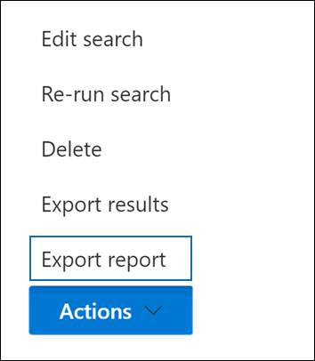

# Exportera en innehållssökningsrapport

I stället för att exportera hela uppsättningen sökresultat från en innehållssökning i efterlevnadscentret för Microsoft 365 (eller från en sökning som är kopplad till ett Bas-eDiscovery-ärende) kan du exportera samma rapporter som skapas när du exporterar de faktiska sökresultaten.
  
När du exporterar en rapport laddas rapportfilerna ned till en mapp på den lokala datorn som har samma namn som Innehållssökning, men som läggs till i *_ReportsOnly*. Om innehållssökningen till exempel heter  *ContosoCase0815* laddas rapporten ned till en mapp med namnet *ContosoCase0815_ReportsOnly*. En lista över dokument som ingår i rapporten finns i [Vad ingår i rapporten.](#whats-included-in-the-report)

## Innan du exporterar en sökrapport

- Om du vill exportera en sökrapport måste du ha rollen Efterlevnadssökning i Säkerhets- & Efterlevnadscenter. Den här rollen tilldelas som standard till de inbyggda rollgrupperna eDiscovery Manager och Organisationshantering. Mer information finns i [Tilldela eDiscovery-behörigheter](assign-ediscovery-permissions.md).

- När du exporterar en rapport lagras data tillfälligt på en Azure Storage plats i Microsoft Cloud innan de laddas ned till din lokala dator. Se till att din organisation kan ansluta till slutpunkten i Azure, som är **\* .blob.core.windows.net** (jokertecknet representerar en unik identifierare för exporten). Sökresultatdata tas bort från e-Azure Storage två veckor efter att den har skapats.

- Datorn du använder för att exportera sökresultaten måste uppfylla följande systemkrav:

  - Senaste versionen av Windows (32-bitars eller 64-bitars)

  - Microsoft .NET Framework 4.7

- Du måste använda någon av följande webbläsare som stöds för att köra eDiscovery Export Tool1:

  - Microsoft Edge 2

    ELLER

  - Microsoft Internet Explorer 10 och senare versioner

  > [!NOTE]
  > 1 Microsoft tillverkar inte tillägg eller tillägg från tredje part för ClickOnce tilläggsprogram. Export av sökresultat med en webbläsare som inte stöds med tillägg eller tillägg från tredje part stöds inte. 
  > 2 På grund av de senaste ändringarna Microsoft Edge är ClickOnce inte längre aktiverat som standard. Anvisningar om hur du aktiverar ClickOnce i Edge finns i [Använda verktyget för eDiscovery-export i Microsoft Edge.](configure-edge-to-export-search-results.md)

- Om den uppskattade totala storleken på resultatet som returneras av sökningen överskrider 2 TB misslyckas exporten av rapporterna. Om du vill exportera rapporterna försöker du begränsa omfattningen och köra sökningen igen så att den uppskattade storleken på resultatet är mindre än 2 TB.

- Om resultatet av en sökning är äldre än 7 dagar och du skickar ett exportrapportjobb visas ett felmeddelande som uppmanar dig att köra sökningen igen för att uppdatera sökresultatet. I så fall avbryter du exporten, kör sökningen igen och startar exporten igen.

- Vid export av sökrapporter räknas antalet exporter som körs samtidigt och det maximala antalet exporter som en enskild användare kan köra. Mer information om exportgränser finns i [Exportera sökresultat för innehåll.](export-search-results.md#export-limits)
  
## Steg 1: Generera rapporten för export

Det första steget är att förbereda rapporten för nedladdning till datorn som exporteras. När du exporterar rapporten laddas rapportdokumenten upp till ett Azure Storage område i Microsoft-molnet.
  
1. Välj Microsoft 365 innehållssökning som du vill exportera rapporten från i kompatibilitetscentret.
  
2. På menyn **Åtgärder** längst ned på sökmenyn klickar du på **Exportera rapport.**

   

   Den **utfällna** sidan Exportera rapport visas. Vilka alternativ som finns för att exportera information om sökningen beror på om sökresultaten finns i postlådor eller på webbplatserna eller en kombination av båda.
  
3. Välj **något av** följande alternativ under Utdataalternativ:
  
   

    - Alla objekt, förutom sådana som har **okänt format,** krypteras eller inte indexeras av andra orsaker. Det här alternativet exporterar bara information om indexerade objekt.
  
    - **Alla objekt, även sådana som har okänt format,** krypteras eller indexeras inte av andra orsaker. Med det här alternativet exporteras information om indexerade och icke indexerade objekt.
  
    - **Endast objekt som har ett okänt format, är krypterade eller inte indexeras av andra orsaker.** Med det här alternativet exporteras bara information om icke indexerade element.

4. Konfigurera **alternativet Aktivera avduplicering för Exchange innehåll.**
  
   - Om du väljer det här alternativet inkluderas antalet dubblettmeddelanden (före avduplicering och efter avduplicering) i sammanfattningsrapporten för export. Dessutom inkluderas bara en kopia av ett meddelande i manifest.xml filen. Men rapporten med exportresultat innehåller en rad för varje kopia av ett duplicerat meddelande så att du kan identifiera postlådorna som innehåller en kopia av det duplicerade meddelandet. Mer information om de exporterade rapporterna finns i [Vad ingår i rapporten](#whats-included-in-the-report).

   - Om du inte markerar det här alternativet innehåller exporten rapporter information om alla meddelanden som returneras av sökningen, inklusive dubbletter.

     Mer information om avduplicering och hur dubbletter identifieras finns i [Avduplicering i eDiscovery-sökresultat.](de-duplication-in-ediscovery-search-results.md)

5. Klicka **på Generera rapport**.

   Sökrapporterna förbereds för nedladdning, vilket innebär att rapportdokumenten laddas upp till en Azure Storage plats i Microsoft-molnet. Det kan ta flera minuter.

Instruktioner för hur du laddar ned de exporterade sökrapporterna finns i nästa avsnitt.
  
## Steg 2: Ladda ned rapporten

Nästa steg är att ladda ned rapporten från Azure Storage området till din lokala dator.

1. På sidan **Innehållssökning** i kompatibilitetscentret för Microsoft 365 väljer du **fliken Exporter**
  
   Du kanske måste klicka på **Uppdatera** för att uppdatera listan med exportjobb så att den visar det exportjobb du har skapat. Exportera rapportjobb har samma namn som motsvarande sökning **_ReportsOnly** lagts till i söknamnet.
  
2. Välj det exportjobb som du skapade i steg 1.

3. Klicka på **Kopiera till** Urklipp under **Exportera-tangenten** på den **utfällade sidan Exportera rapport.** Du använder den här nyckeln i steg 6 för att ladda ned sökresultaten.
  
   > [!IMPORTANT]
   > Eftersom vem som helst kan installera och starta verktyget för eDiscovery-export och sedan använda den här nyckeln för att ladda ned sökrapporten, bör du vidta vissa försiktighetsåtgärder för att skydda den här nyckeln på samma sätt som du skyddar lösenord eller annan säkerhetsrelaterad information.

4. Klicka på Ladda ned resultat längst upp på den **utfällsbara sidan.**

5. Om du uppmanas att installera **eDiscovery-exportverktyget klickar** du på **Installera**.

6. I **eDiscovery-exportverktyget** gör du följande:

   

   1. Klistra in exportnyckeln som du kopierade i steg 3 i lämplig ruta.
  
   2. Klicka **på** Bläddra för att ange den plats där du vill ladda ned sökrapportfilerna.

7. Klicka **på Start** för att ladda ned sökresultatet till datorn.
  
    I **verktyget eDiscovery Export** visas statusinformation om exporten, inklusive en uppskattning av antalet (och storleken) av de återstående objekten som ska laddas ned. När exporten är klar kan du komma åt filerna på den plats där de laddades ned.
  
## Vad som ingår i rapporten

När du skapar och exporterar en rapport om resultatet av en innehållssökning laddas följande dokument ned:
  
- **Exportsammanfattning:** Ett Excel som innehåller en sammanfattning av exporten. Det omfattar information som antal innehållskällor som har sökts, antalet sökresultat från varje innehållsplats, det uppskattade antalet objekt, det faktiska antalet objekt som skulle exporteras och den uppskattade och faktiska storleken på de objekt som skulle exporteras.

   Om du tar med icke indexerade objekt när du exporterar rapporten inkluderas antalet icke indexerade objekt i det totala antalet uppskattade sökresultat och det totala antalet nedladdade sökresultat (om du skulle exportera sökresultaten) som visas i sammanfattningsrapporten för export. Med andra ord är det totala antalet objekt som hämtas lika med det totala antalet uppskattade resultat och det totala antalet icke indexerade objekt.
  
- **Manifest:** En manifestfil (i XML-format) som innehåller information om varje objekt som ingår i sökresultatet. Om du har aktiverat alternativet för avduplicering inkluderas inte dubblettmeddelanden i manifestfilen.

- **Resultat:** Ett Excel som innehåller en rad med information om varje indexerat objekt som skulle exporteras med sökresultatet. För e-post innehåller resultatloggen information om varje meddelande, inklusive: 

  - Platsen för meddelandet i källpostlådan (inklusive om meddelandet finns i den primära postlådan eller arkivpostlådan).

  - Datumet då meddelandet skickades eller togs emot.

  - Ämnesraden från meddelandet.

  - Meddelandets avsändare och mottagare.

  För dokument från SharePoint och OneDrive för företag innehåller resultatloggen information om varje dokument, inklusive:

  - URL-adressen för dokumentet.

  - URL-adressen för webbplatssamlingen där dokumentet finns.

  - Datumet då dokumentet senast ändrades.

  - Namnet på dokumentet (som finns i kolumnen Ämne i resultatloggen).

  > [!NOTE]
  > Antalet rader i  resultatrapporten ska vara lika med det totala antalet sökresultat minus det totala antalet objekt som visas i rapporten Icke **indexerade** objekt.
  
- **Trace.log:** En spårningslogg som innehåller detaljerad loggningsinformation om exporten och som kan hjälpa dig att upptäcka problem under exporten. Om du öppnar ett ärende hos Microsoft Support om ett problem som rör export av sökrapporter kan du bli ombedd att ange den här spårningsloggen.

- **Icke indexerade objekt:** Ett Excel dokument som innehåller information om icke indexerade objekt som ingår i sökresultatet. Om du inte tar med icke indexerade objekt när du skapar sökresultatrapporten kommer den här rapporten fortfarande att laddas ned, men den är tom.
