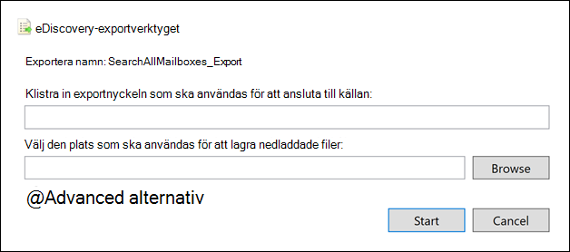

# Exportera en innehållssökningsrapportExport a Content search report

I stället för att exportera hela uppsättningen sökresultat från en innehållssökning i efterlevnadscentret för Microsoft 365 (eller från en sökning som är kopplad till ett Bas-eDiscovery-ärende) kan du exportera samma rapporter som skapas när du exporterar de faktiska sökresultaten.Instead of exporting the full set of search results from a Content search in the Microsoft 365 compliance Center (or from a search that's associated with a Core eDiscovery case), you can export the same reports that are generated when you export the actual search results.
  
När du exporterar en rapport laddas rapportfilerna ned till en mapp på den lokala datorn som har samma namn som Innehållssökning, men som läggs till i *_ReportsOnly*.When you export a report, the report files are downloaded to a folder on your local computer that has the same name as the Content Search, but that's appended with *_ReportsOnly*. Om innehållssökningen till exempel heter  *ContosoCase0815* laddas rapporten ned till en mapp med namnet *ContosoCase0815_ReportsOnly*.For example, if the Content Search is named  *ContosoCase0815*, then the report is downloaded to a folder named *ContosoCase0815_ReportsOnly*. En lista över dokument som ingår i rapporten finns i [Vad ingår i rapporten.](#whats-included-in-the-report)For a list of documents that are included in the report, see [What's included in the report](#whats-included-in-the-report).

## Innan du exporterar en sökrapportBefore you export a search report

- Om du vill exportera en sökrapport måste du ha rollen Efterlevnadssökning i Säkerhets- & Efterlevnadscenter.To export a search report, you have to be assigned the Compliance Search management role in Security & Compliance Center. Den här rollen tilldelas som standard till de inbyggda rollgrupperna eDiscovery Manager och Organisationshantering.This role is assigned by default to the built-in eDiscovery Manager and Organization Management role groups. Mer information finns i [Tilldela eDiscovery-behörigheter](assign-ediscovery-permissions.md).For more information, see [Assign eDiscovery permissions](assign-ediscovery-permissions.md).

- När du exporterar en rapport lagras data tillfälligt på en Azure Storage plats i Microsoft Cloud innan de laddas ned till din lokala dator.When you export a report, the data is temporarily stored in an Azure Storage location in the Microsoft cloud before it's downloaded to your local computer. Se till att din organisation kan ansluta till slutpunkten i Azure, som är **\* .blob.core.windows.net** (jokertecknet representerar en unik identifierare för exporten).Be sure that your organization can connect to the endpoint in Azure, which is **\*.blob.core.windows.net** (the wildcard represents a unique identifier for your export). Sökresultatdata tas bort från e-Azure Storage två veckor efter att den har skapats.The search results data is deleted from the Azure Storage location two weeks after it's created.

- Datorn du använder för att exportera sökresultaten måste uppfylla följande systemkrav:The computer you use to export the search results has to meet the following system requirements:

  - Senaste versionen av Windows (32-bitars eller 64-bitars)Latest version of Windows (32-bit or 64-bit)

  - Microsoft .NET Framework 4.7Microsoft .NET Framework 4.7

- Du måste använda någon av följande webbläsare som stöds för att köra eDiscovery Export Tool1:You have to use one of the following supported browsers to run the eDiscovery Export Tool1:

  - Microsoft Edge 2Microsoft Edge 2

    ELLEROR

  - Microsoft Internet Explorer 10 och senare versionerMicrosoft Internet Explorer 10 and later versions

  > [!NOTE]
  > 1 Microsoft tillverkar inte tillägg eller tillägg från tredje part för ClickOnce tilläggsprogram.1 Microsoft doesn't manufacture third-party extensions or add-ons for ClickOnce applications. Export av sökresultat med en webbläsare som inte stöds med tillägg eller tillägg från tredje part stöds inte.Exporting search results using an unsupported browser with third-party extensions or add-ons isn't supported. 
  > 2 På grund av de senaste ändringarna Microsoft Edge är ClickOnce inte längre aktiverat som standard.2 As a result of recent changes to Microsoft Edge, ClickOnce support is no longer enabled by default. Anvisningar om hur du aktiverar ClickOnce i Edge finns i [Använda verktyget för eDiscovery-export i Microsoft Edge.](configure-edge-to-export-search-results.md)For instructions on enabling ClickOnce support in Edge, see [Use the eDiscovery Export Tool in Microsoft Edge](configure-edge-to-export-search-results.md).

- Om den uppskattade totala storleken på resultatet som returneras av sökningen överskrider 2 TB misslyckas exporten av rapporterna.If the estimated total size of the results returned by search exceeds 2 TB, exporting the reports fails. Om du vill exportera rapporterna försöker du begränsa omfattningen och köra sökningen igen så att den uppskattade storleken på resultatet är mindre än 2 TB.To successfully export the reports, try to narrow the scope and rerun the search so the estimated size of the results is less than 2 TB.

- Om resultatet av en sökning är äldre än 7 dagar och du skickar ett exportrapportjobb visas ett felmeddelande som uppmanar dig att köra sökningen igen för att uppdatera sökresultatet.If the results of a search are older than 7 days and you submit an export report job, an error message is displayed prompting you to rerun the search to update the search results. I så fall avbryter du exporten, kör sökningen igen och startar exporten igen.If this happens, cancel the export, rerun the search, and then start the export again.

- Vid export av sökrapporter räknas antalet exporter som körs samtidigt och det maximala antalet exporter som en enskild användare kan köra.Exporting search reports counts against the maximum number of exports running at the same time and the maximum number of exports that a single user can run. Mer information om exportgränser finns i [Exportera sökresultat för innehåll.](export-search-results.md#export-limits)For more information about export limits, see [Export Content search results](export-search-results.md#export-limits).
  
## Steg 1: Generera rapporten för exportStep 1: Generate the report for export

Det första steget är att förbereda rapporten för nedladdning till datorn som exporteras.The first step is to prepare the report for downloading to your computer exporting. När du exporterar rapporten laddas rapportdokumenten upp till ett Azure Storage område i Microsoft-molnet.When you export the report, the report documents are uploaded to an Azure Storage area in the Microsoft cloud.
  
1. Välj Microsoft 365 innehållssökning som du vill exportera rapporten från i kompatibilitetscentret.In the Microsoft 365 compliance center, select the Content search that you want to export the report from.
  
2. På menyn **Åtgärder** längst ned på sökmenyn klickar du på **Exportera rapport.**On the **Actions** menu at the bottom of the search flyout page, click **Export report**.

   

   Den **utfällna** sidan Exportera rapport visas.The **Export report** flyout page is displayed. Vilka alternativ som finns för att exportera information om sökningen beror på om sökresultaten finns i postlådor eller på webbplatserna eller en kombination av båda.The export report options available to export information about the search depend on whether search results are located in mailboxes or sites or a combination of both.
  
3. Välj **något av** följande alternativ under Utdataalternativ:Under **Output options**, choose one of the following options:
  
   

    - Alla objekt, förutom sådana som har **okänt format,** krypteras eller inte indexeras av andra orsaker.**All items, excluding ones that have unrecognized format, are encrypted, or weren't indexed for other reasons**. Det här alternativet exporterar bara information om indexerade objekt.This option only exports information about indexed items.
  
    - **Alla objekt, även sådana som har okänt format,** krypteras eller indexeras inte av andra orsaker.**All items, including ones that have unrecognized format, are encrypted, or weren't indexed for other reasons**. Med det här alternativet exporteras information om indexerade och icke indexerade objekt.This option exports information about indexed and unindexed items.
  
    - **Endast objekt som har ett okänt format, är krypterade eller inte indexeras av andra orsaker.****Only items that have an unrecognized format, are encrypted, or weren't indexed for other reasons**. Med det här alternativet exporteras bara information om icke indexerade element.This option only exports information about unindexed items.

4. Konfigurera **alternativet Aktivera avduplicering för Exchange innehåll.**Configure the **Enable de-duplication for Exchange content** option.
  
   - Om du väljer det här alternativet inkluderas antalet dubblettmeddelanden (före avduplicering och efter avduplicering) i sammanfattningsrapporten för export.If you select this option, the count of duplicate messages (before de-duplication and after de-duplication) is included in the export summary report. Dessutom inkluderas bara en kopia av ett meddelande i manifest.xml filen.Also, only one copy of a message will be included in the manifest.xml file. Men rapporten med exportresultat innehåller en rad för varje kopia av ett duplicerat meddelande så att du kan identifiera postlådorna som innehåller en kopia av det duplicerade meddelandet.But the export results report will contain a row for every copy of a duplicate message so that you can identify the mailboxes that contain a copy of the duplicate message. Mer information om de exporterade rapporterna finns i [Vad ingår i rapporten](#whats-included-in-the-report).For more information about the exported reports, see [What's included in the report](#whats-included-in-the-report).

   - Om du inte markerar det här alternativet innehåller exporten rapporter information om alla meddelanden som returneras av sökningen, inklusive dubbletter.If you don't select this option, the export reports will contain information about all messages returned by the search, including duplicates.

     Mer information om avduplicering och hur dubbletter identifieras finns i [Avduplicering i eDiscovery-sökresultat.](de-duplication-in-ediscovery-search-results.md)For more information about de-duplication and how duplicate items are identified, see [De-duplication in eDiscovery search results](de-duplication-in-ediscovery-search-results.md).

5. Klicka **på Generera rapport**.Click **Generate report**.

   Sökrapporterna förbereds för nedladdning, vilket innebär att rapportdokumenten laddas upp till en Azure Storage plats i Microsoft-molnet.The search reports are prepared for downloading, which means the report documents are uploaded to an Azure Storage location in the Microsoft cloud. Det kan ta flera minuter.This may take several minutes.

Instruktioner för hur du laddar ned de exporterade sökrapporterna finns i nästa avsnitt.See the next section for instructions to download the exported search reports.
  
## Steg 2: Ladda ned rapportenStep 2: Download the report

Nästa steg är att ladda ned rapporten från Azure Storage området till din lokala dator.The next step is to download the report from the Azure Storage area to your local computer.

1. På sidan **Innehållssökning** i kompatibilitetscentret för Microsoft 365 väljer du **fliken Exporter**On the **Content search** page in the Microsoft 365 compliance center, select the **Exports** tab
  
   Du kanske måste klicka på **Uppdatera** för att uppdatera listan med exportjobb så att den visar det exportjobb du har skapat.You may have to click **Refresh** to update the list of export jobs so that it shows the export job you created. Exportera rapportjobb har samma namn som motsvarande sökning **_ReportsOnly** lagts till i söknamnet.Export report jobs have the same name as the corresponding search with **_ReportsOnly** appended to the search name.
  
2. Välj det exportjobb som du skapade i steg 1.Select the export job that you created in Step 1.

3. Klicka på **Kopiera till** Urklipp under **Exportera-tangenten** på den **utfällade sidan Exportera rapport.**On the **Export report** flyout page under **Export key**, click **Copy to clipboard**. Du använder den här nyckeln i steg 6 för att ladda ned sökresultaten.You use this key in step 6 to download the search results.
  
   > [!IMPORTANT]
   > Eftersom vem som helst kan installera och starta verktyget för eDiscovery-export och sedan använda den här nyckeln för att ladda ned sökrapporten, bör du vidta vissa försiktighetsåtgärder för att skydda den här nyckeln på samma sätt som du skyddar lösenord eller annan säkerhetsrelaterad information.Because anyone can install and start the eDiscovery Export tool, and then use this key to download the search report, be sure to take precautions to protect this key just like you would protect passwords or other security-related information.

4. Klicka på Ladda ned resultat längst upp på den **utfällsbara sidan.**At the top of the flyout page, click **Download results**.

5. Om du uppmanas att installera **eDiscovery-exportverktyget klickar** du på **Installera**.If you're prompted to install the **eDiscovery Export Tool**, click **Install**.

6. I **eDiscovery-exportverktyget** gör du följande:In the **eDiscovery Export Tool**, do the following:

   

   1. Klistra in exportnyckeln som du kopierade i steg 3 i lämplig ruta.Paste the export key that you copied in step 3 in the appropriate box.
  
   2. Klicka **på** Bläddra för att ange den plats där du vill ladda ned sökrapportfilerna.Click **Browse** to specify the location where you want to download the search report files.

7. Klicka **på Start** för att ladda ned sökresultatet till datorn.Click **Start** to download the search results to your computer.
  
    I **verktyget eDiscovery Export** visas statusinformation om exporten, inklusive en uppskattning av antalet (och storleken) av de återstående objekten som ska laddas ned.The **eDiscovery Export Tool** displays status information about the export process, including an estimate of the number (and size) of the remaining items to be downloaded. När exporten är klar kan du komma åt filerna på den plats där de laddades ned.When the export process is complete, you can access the files in the location where they were downloaded.
  
## Vad som ingår i rapportenWhat's included in the report

När du skapar och exporterar en rapport om resultatet av en innehållssökning laddas följande dokument ned:When you generate and export a report about the results of a Content search, the following documents are downloaded:
  
- **Exportsammanfattning:** Ett Excel som innehåller en sammanfattning av exporten.**Export summary:** An Excel document that contains a summary of the export. Det omfattar information som antal innehållskällor som har sökts, antalet sökresultat från varje innehållsplats, det uppskattade antalet objekt, det faktiska antalet objekt som skulle exporteras och den uppskattade och faktiska storleken på de objekt som skulle exporteras.This includes information such as the number of content sources that were searched, the number of search results from each content location, the estimated number of items, the actual number of items that would be exported, and the estimated and actual size of items that would be exported.

   Om du tar med icke indexerade objekt när du exporterar rapporten inkluderas antalet icke indexerade objekt i det totala antalet uppskattade sökresultat och det totala antalet nedladdade sökresultat (om du skulle exportera sökresultaten) som visas i sammanfattningsrapporten för export.If you include unindexed items when exporting the report, the number of unindexed items are included in the total number of estimated search results and in the total number of downloaded search results (if you were to export the search results) that are listed in the export summary report. Med andra ord är det totala antalet objekt som hämtas lika med det totala antalet uppskattade resultat och det totala antalet icke indexerade objekt.In other words, the total number of items that would be downloaded is equal to the total number of estimated results and the total number of unindexed items.
  
- **Manifest:** En manifestfil (i XML-format) som innehåller information om varje objekt som ingår i sökresultatet.**Manifest:** A manifest file (in XML format) that contains information about each item included in the search results. Om du har aktiverat alternativet för avduplicering inkluderas inte dubblettmeddelanden i manifestfilen.If you enabled the de-duplication option, duplicate message are not included in the manifest file.

- **Resultat:** Ett Excel som innehåller en rad med information om varje indexerat objekt som skulle exporteras med sökresultatet.**Results:** An Excel document that contains a row with information about each indexed item that would be exported with the search results. För e-post innehåller resultatloggen information om varje meddelande, inklusive:For email, the result log contains information about each message, including: 

  - Platsen för meddelandet i källpostlådan (inklusive om meddelandet finns i den primära postlådan eller arkivpostlådan).The location of the message in the source mailbox (including whether the message is in the primary or archive mailbox).

  - Datumet då meddelandet skickades eller togs emot.The date the message was sent or received.

  - Ämnesraden från meddelandet.The Subject line from the message.

  - Meddelandets avsändare och mottagare.The sender and recipients of the message.

  För dokument från SharePoint och OneDrive för företag innehåller resultatloggen information om varje dokument, inklusive:For documents from SharePoint and OneDrive for Business sites, the results log contains information about each document, including:

  - URL-adressen för dokumentet.The URL for the document.

  - URL-adressen för webbplatssamlingen där dokumentet finns.The URL for the site collection where the document is located.

  - Datumet då dokumentet senast ändrades.The date that the document was last modified.

  - Namnet på dokumentet (som finns i kolumnen Ämne i resultatloggen).The name of the document (which is located in the Subject column in the result log).

  > [!NOTE]
  > Antalet rader i  resultatrapporten ska vara lika med det totala antalet sökresultat minus det totala antalet objekt som visas i rapporten Icke **indexerade** objekt.The number of rows in the **Results** report should be equal to the total number of search results minus the total number of items listed in the **Unindexed Items** report.
  
- **Trace.log:** En spårningslogg som innehåller detaljerad loggningsinformation om exporten och som kan hjälpa dig att upptäcka problem under exporten.**Trace.log**: A trace log that contains detailed logging information about the export process and can help uncover issues during export. Om du öppnar ett ärende hos Microsoft Support om ett problem som rör export av sökrapporter kan du bli ombedd att ange den här spårningsloggen.If you open a ticket with Microsoft Support about an issue related to exporting search reports, you may be asked to provide this trace log.

- **Icke indexerade objekt:** Ett Excel dokument som innehåller information om icke indexerade objekt som ingår i sökresultatet.**Unindexed items:** An Excel document that contains information about any unindexed items included in the search results. Om du inte tar med icke indexerade objekt när du skapar sökresultatrapporten kommer den här rapporten fortfarande att laddas ned, men den är tom.If you don't include unindexed items when you generate the search results report, this report will still be downloaded, but will be empty.
