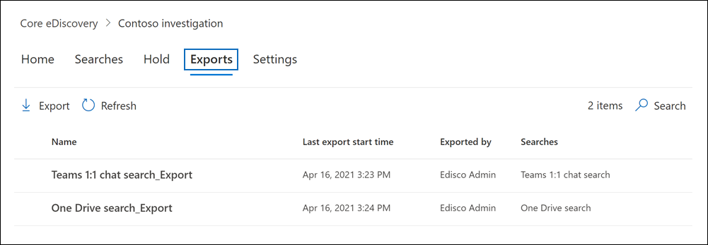

# Exportera innehåll från en bas-e-dataidentifieringsfallExport content from a Core eDiscovery case

När en sökning som är kopplad till ett Bas-eDiscovery-ärende har körts kan du exportera sökresultatet.After a search associated with a Core eDiscovery case is successfully run, you can export the search results. När du exporterar sökresultat hämtas postlådeobjekt i PST-filer eller som enskilda meddelanden.When you export search results, mailbox items are downloaded in PST files or as individual messages. När du exporterar innehåll SharePoint och OneDrive för företag exporteras kopior av ursprungliga Office och andra dokument.When you export content from SharePoint and OneDrive for Business sites, copies of native Office documents and other documents are exported. En Results.csv fil som innehåller information om alla objekt som exporteras och en manifestfil (i XML-format) som innehåller information om varje sökresultat exporteras också.A Results.csv file that contains information about every item that's exported and a manifest file (in XML format) that contains information about every search result is also exported.
  
## Exportera sökresultatExport search results

1. Gå till [https://compliance.microsoft.com](https://compliance.microsoft.com) och logga in med inloggningsuppgifterna för användarkontot som har tilldelats lämpliga eDiscovery-behörigheter.Go to [https://compliance.microsoft.com](https://compliance.microsoft.com) and sign in using the credentials for user account that has been assigned the appropriate eDiscovery permissions.

2. I det vänstra navigeringsfönstret i Microsoft 365 kompatibilitetscenter klickar du på Visa alla **och** sedan på **eDiscovery > Core**.In the left navigation pane of the Microsoft 365 compliance center, click **Show all**, and then click **eDiscovery > Core**.

3. På sidan **Bas-eDiscovery** klickar du på namnet på det ärende som du vill skapa ett sådant ärende i.On the **Core eDiscovery** page, click the name of the case that you want to create the hold in.

4. På **startsidan för** ärendet klickar du på **fliken** Sökningar.On the **Home** page for the case, click the **Searches** tab.

5. På menyn **Åtgärder** längst ned på den utfällade sidan klickar du på **Exportera resultat.**On the **Actions** menu at the bottom of the flyout page, click **Export results**.

   

   Arbetsflödet för att exportera resultatet av en sökning som är kopplad till ett basfall för eDiscovery är detsamma som att exportera sökresultatet för en sökning på sidan **Innehållssökning.**The workflow to export the results of a search associated with a Core eDiscovery case is that same as exporting the search results for a search on the **Content search** page. Stegvisa instruktioner finns i Exportera [sökresultat för innehåll.](export-search-results.md)For step-by-step instructions, see [Export content search results](export-search-results.md).

   > [!NOTE]
   > När du exporterar sökresultat kan du välja att aktivera avduplicering så att bara en kopia av ett e-postmeddelande exporteras, även om flera förekomster av samma meddelande kan ha hittats i postlådorna som har sökts.When you export search results, you have the option to enable de-duplication so that only one copy of an email message is exported even though multiple instances of the same message might have been found in the mailboxes that were searched. Mer information om avduplicering och hur dubbletter identifieras finns i [Avduplicering i eDiscovery-sökresultat.](de-duplication-in-ediscovery-search-results.md)For more information about de-duplication and how duplicate items are identified, see [De-duplication in eDiscovery search results](de-duplication-in-ediscovery-search-results.md).

   När du startar exporten förbereds sökresultaten för nedladdning, vilket innebär att de överförs till en Microsoft-tillhandahållen Azure Storage plats i Microsoft-molnet.After you start the export, the search results are prepared for downloading, which means they are transferred to a Microsoft-provided Azure Storage location in the Microsoft cloud.
  
6. Klicka på **fliken** Exporter för att visa listan med exportjobb.Click the **Exports** tab in the case to display the list of export jobs.
  
   

   Du kanske måste klicka på **Uppdatera** för att uppdatera listan med exportjobb så att den visar det exportjobb du har skapat.You may have to click **Refresh** to update the list of export jobs so that it shows the export job you created. Exportjobb har samma namn som motsvarande sökning **_Export** lagts till i söknamnet.Export jobs have the same name as the corresponding search with **_Export** appended to the search name.

7. Klicka på exportjobbet du skapade för att visa statusinformation på den utfällade sidan.Click the export job you created to display status information on the flyout page. Den här informationen omfattar den procentandel av artiklar som har överförts till Azure Storage plats.This information includes the percentage of items that have been transferred to the Azure Storage location.

8. När alla objekt har överförts klickar du på **Ladda ned resultat** för att ladda ned sökresultatet till den lokala datorn.After all items have been transferred, click **Download results** to download the search results to your local computer. Mer information om hur du laddar ned sökresultat finns i Steg 2 i [Exportera sökresultat för innehåll](export-search-results.md#step-2-download-the-search-results)For more information downloading search results, see Step 2 in [Export content search results](export-search-results.md#step-2-download-the-search-results)

### Mer information om hur du exporterar sökningar från ett ärendeMore information about exporting searches from a case

- Mer information om exportfiler som ingår när du exporterar sökresultat finns i [Exportera en rapport för innehållssökning.](export-a-content-search-report.md#whats-included-in-the-report)For more information about the export files that are included when you export search results, see [Export a Content search report](export-a-content-search-report.md#whats-included-in-the-report).

- Om du startar om exporten påverkas inte sökresultaten som hämtas om du ändrar frågorna för de sökningar som utgör exportjobbet.If you restart the export, any changes to the queries of the searches that make up the export job won't affect the search results that are retrieved. När du startar om en export körs samma kombinerade sökjobb som startades när exportjobbet skapades igen.When you restart an export, the same combined search query job that was run when the export job was created will be run again.

- Om du startar om en export kommer sökresultaten som kopieras till den Azure Storage plats att skriva över de tidigare resultaten.Also, if you restart an export, the search results that are copied to the Azure Storage location overwrites the previous results. Tidigare resultat som kopierades går inte att hämta.The previous results that were copied won't be available to be downloaded.
