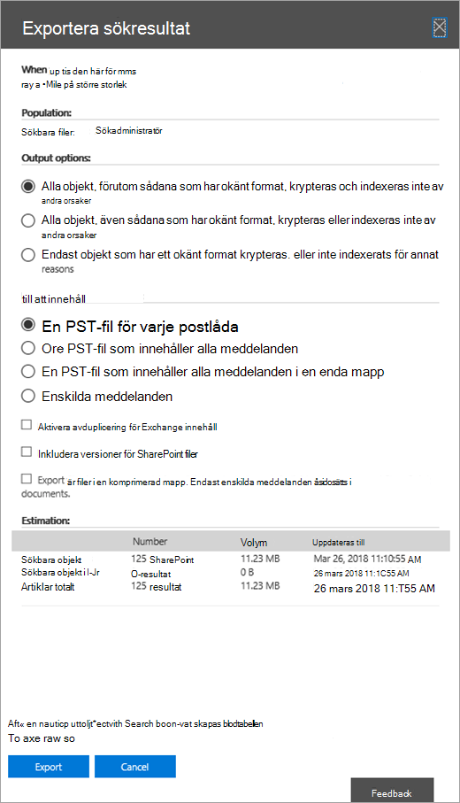
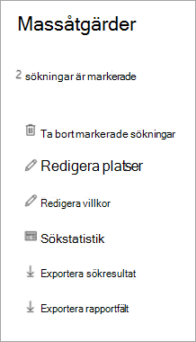

# Exportera innehåll från en bas-e-dataidentifieringsfall

När en sökning har körts kan du exportera sökresultatet. När du exporterar sökresultat hämtas postlådeobjekt i PST-filer eller som enskilda meddelanden. När du exporterar innehåll SharePoint och OneDrive för företag exporteras kopior av ursprungliga Office och andra dokument. En Results.csv fil som innehåller information om alla objekt som exporteras och en manifestfil (i XML-format) som innehåller information om varje sökresultat exporteras också.
  
Du kan exportera resultatet av en enda [sökning kopplad](#export-the-results-of-a-single-search) till ett ärende eller så kan du exportera resultatet av flera sökningar kopplade till [ett ärende.](#export-the-results-of-multiple-searches)
  
## Exportera resultatet av en enskild sökning

1. Gå till [https://compliance.microsoft.com](https://compliance.microsoft.com) och logga in med inloggningsuppgifterna för användarkontot som har tilldelats lämpliga eDiscovery-behörigheter.

2. I det vänstra navigeringsfönstret i Microsoft 365 kompatibilitetscenter klickar du på Visa alla **och** sedan på **eDiscovery > Core**.

3. På sidan **Bas-e-dataidentifiering** väljer du det ärende du vill exportera sökresultat från och klickar sedan på **Öppna ärende.**

4. På **startsidan för** ärendet klickar du på **fliken** Sökningar.

5. I listan med sökningar efter ärendet klickar du på den sökning som du vill exportera sökresultat från och klickar sedan på **Exportera resultat** i den utfällade menyn.

    Sidan **Exportera** resultat visas. 

    
  
    Arbetsflödet för att exportera resultatet av en sökning som är kopplad till ett basfall för eDiscovery är detsamma som att exportera sökresultatet för en sökning på sidan **Innehållssökning.** Stegvisa instruktioner finns i Exportera [sökresultat för innehåll.](export-search-results.md)

    > [!NOTE]
    > När du exporterar sökresultat kan du välja att aktivera avduplicering så att bara en kopia av ett e-postmeddelande exporteras, även om flera förekomster av samma meddelande kan ha hittats i postlådorna som har sökts. Mer information om avduplicering och hur dubbletter identifieras finns i [Avduplicering i eDiscovery-sökresultat.](de-duplication-in-ediscovery-search-results.md)

    När du startar exporten förbereds sökresultaten för nedladdning, vilket innebär att de laddas upp till en Microsoft-Azure Storage-plats i Microsoft-molnet.
  
6. Klicka på **fliken** Exportera för att visa en lista med exportjobb för ärendet.
  
    Du kanske måste klicka på **Uppdatera** för att uppdatera listan med exportjobb så att den visar det exportjobb du har skapat. Exportjobb har samma namn som motsvarande sökning **_Export** lagts till i söknamnet.

7. Klicka på exportjobbet du skapade för att visa statusinformation på den utfällade sidan. Den här informationen omfattar den procentandel av artiklar som har överförts till Azure Storage plats.

8. När alla objekt har överförts klickar du på **Ladda ned resultat** för att ladda ned sökresultatet till den lokala datorn. Mer information om hur du laddar ned sökresultat finns i Steg 2 i [Exportera sökresultat för innehåll](export-search-results.md#step-2-download-the-search-results)

## Exportera resultatet av flera sökningar

Som ett alternativ till att exportera resultatet av en enda sökning som är kopplad till ett ärende kan du exportera resultatet av flera sökningar från samma ärende i ett enda exportjobb. Att exportera resultatet av flera sökningar går snabbare och är enklare än att exportera resultatet en sökning i taget.
  
> [!NOTE]
> Du kan inte exportera resultatet av flera sökningar om en av dessa sökningar var konfigurerad till att söka på platser som är sparade.

1. Gå till [https://compliance.microsoft.com](https://compliance.microsoft.com) och logga in med inloggningsuppgifterna för användarkontot som har tilldelats lämpliga eDiscovery-behörigheter.

2. I det vänstra navigeringsfönstret i Microsoft 365 kompatibilitetscenter klickar du på Visa alla **och** sedan på **eDiscovery > Core**.

3. På sidan **Bas-e-dataidentifiering** väljer du det ärende du vill exportera sökresultat från och klickar sedan på **Öppna ärende.**

4. På **startsidan för** ärendet klickar du på **fliken** Sökningar.
    
5. I listan med sökningar efter ärendet markerar du kryssrutan bredvid två eller fler sökningar som du vill exportera sökresultat från. 

   Den **utfällande** sidan Massåtgärder visas. 

    
  
6. Klicka **på Exportera resultat.**

   Sidan **Exportera** resultat visas. 

    
  
    I det här läget är arbetsflödet för att exportera resultatet av flera sökningar kopplade till ett Grundläggande eDiscovery-ärende samma som att exportera sökresultatet för en enda sökning. Se steg 5 i föregående avsnitt.

### Mer information om hur du exporterar resultatet av flera sökningar

- När du exporterar resultatet av flera sökningar kombineras sökfrågorna från  alla sökningar med hjälp av ELLER-operatorer, och sedan startas den kombinerade sökningen. Det uppskattade resultatet av den kombinerade sökningen visas på den utfällade sidan i det valda exportjobbet. Sökresultaten kopieras sedan till platsen Azure Storage i Microsoft-molnet. Status för kopieringsjobbet visas också på den utfällade sidan. Efter att alla sökresultat har kopierats kan du, som tidigare nämnt, ladda ned dem till en lokal dator.

- Det maximala antalet nyckelord från frågor för alla sökningar som du vill exportera är 500. Det här är samma gräns för en enskild sökning. Det beror på att exportjobbet kombinerar alla sökfrågor med hjälp av **operatorn** ELLER. Om du överskrider den här gränsen returneras ett fel. I det här fallet måste du exportera resultatet från färre sökningar eller förenkla sökfrågorna i de ursprungliga sökningarna som du vill exportera.

- Sökresultaten som exporteras ordnas efter den innehållsplats där objektet hittades. Det innebär att en innehållsplats i exporten kan innehålla objekt som returneras av olika sökningar. Om du till exempel väljer att exportera e-postmeddelanden i en PST-fil för varje postlåda kan PST-filen ha resultat av flera sökningar.

- Om samma e-postobjekt eller dokument från samma innehållsplats returneras av flera sökningar som du exporterar exporteras bara en kopia av objektet.

- Du kan inte redigera en export för flera sökningar efter att du har skapat den. Du kan till exempel inte lägga till eller ta bort sökningar från exportjobbet. Du måste skapa ett exportjobb för att ändra vilka sökresultat som exporteras. När ett exportjobb har skapats kan du bara ladda ned resultatet till en dator, starta om exporten eller ta bort exportjobbet.

- Om du startar om exporten påverkas inte sökresultaten som hämtas om du ändrar frågorna för de sökningar som utgör exportjobbet. När du startar om en export körs samma kombinerade sökjobb som startades när exportjobbet skapades igen.

- Om du startar om en export kommer sökresultaten som kopieras till den Azure Storage plats att skriva över de tidigare resultaten. Tidigare resultat som kopierades går inte att hämta.
