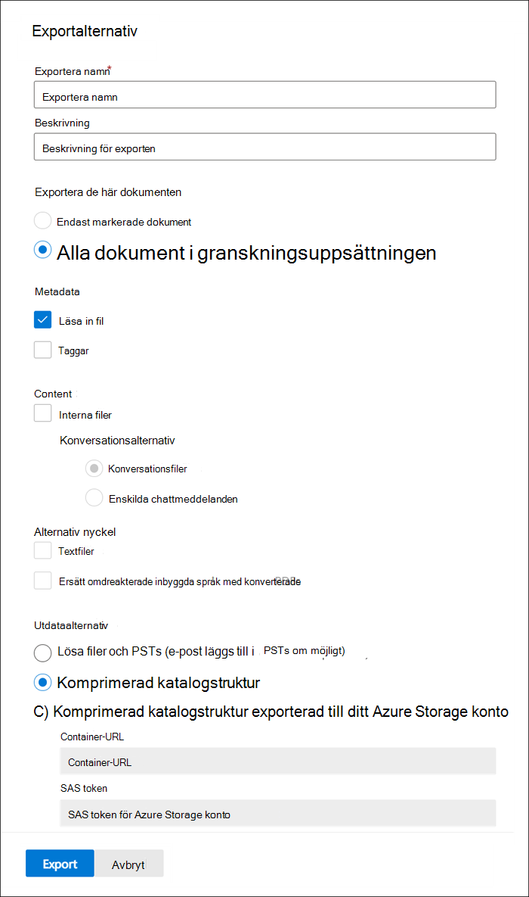

# Exportera dokument från en granskningsuppsättning i Advanced eDiscoveryExport documents from a review set in Advanced eDiscovery

Med export kan användarna anpassa innehållet som ingår i nedladdningspaketet när du exporterar dokument från en granskningsuppsättning i Advanced eDiscovery.Export allows users to customize the content that is included in the download package when you export document from a review set in Advanced eDiscovery.

Så här exporterar du dokument från en granskningsuppsättning:To export documents from a review set:

1. I Microsoft 365 kompatibilitetscenter öppnar du Advanced eDiscovery, väljer fliken Granska **uppsättningar** och väljer sedan den granskningsuppsättning som du vill exportera.In the Microsoft 365 compliance center, open the Advanced eDiscovery case, select the **Review sets** tab, and then select the review set that you want to export.

2. Klicka på Åtgärdsexport i   >  **granskningsuppsättningen.**In the review set, click **Action** > **Export**.

   Med exportverktyget visas den utfällällade sidan med inställningar för att konfigurera exporten.The Export tool displays the flyout page with the settings to configure the export. Vissa alternativ är markerade som standard, men du kan ändra dessa.Some options are selected by default, but you can change these. I följande avsnitt finns beskrivningar av de exportalternativ som du kan konfigurera.See the following section for descriptions of the export options that you can configure.

   

3. När du har konfigurerat exporten klickar du **på Exportera** för att starta exporten.After you configure the export, click **Export** to start the export process. Beroende på det alternativ  du valde i avsnittet Utdataalternativ kan du komma åt exportfilerna genom direkt nedladdning eller i organisationens Azure Storage konto.Depending on the option that you selected in **Output options** section, you can access the export files by direct download or in your organization's Azure Storage account.

> [!NOTE]
> Exportjobben behålls under hela ärendets livscykel.Export jobs are retained for the life of the case. Men du måste hämta innehållet från ett exportjobb inom 30 dagar efter att exportjobbet är klart.However, you must download the content from an export job within 30 days after the export job is complete.

## ExportalternativExport options

Använd följande alternativ för att konfigurera exporten.Use the following options to configure the export. Vissa utdataalternativ är inte tillåtna, de viktigaste är att exportera textfiler och PDF-filer som har omformaterats, inte tillåts vid export till PST-format.Not all options are allowed for some output options, most notably, export of text files and redacted PDFs are not allowed when exporting to the PST format.

- **Exportera namn:** Namnet på exportjobbet.**Export name**: Name of the export job. Används för att namnge ZIP-filerna som ska laddas ned.This will be used to name the ZIP files that will be downloaded.

- **Beskrivning**: Fritt textfält där du kan lägga till en beskrivning.**Description**: Free-text field for you to add a description.

- **Exportera de här dokumenten****Export these documents**

  - Endast markerade dokument: Med det här alternativet exporteras endast de dokument som är markerade för närvarande.Selected documents only: This option exports only the documents that are currently selected. Det här alternativet är bara tillgängligt när objekt markeras i en granskningsuppsättning.This option is only available when items are selected in a review set.
  - Alla filtrerade dokument: Med det här alternativet exporteras dokumenten i ett aktivt filter.All filtered documents: This option exports the documents in an active filter. Det här alternativet är bara tillgängligt när ett filter tillämpas på granskningsuppsättningen.This option is only available when a filter is applied to the review set.
  - Alla dokument i granskningsuppsättningen: Med det här alternativet exporteras alla dokument i granskningsuppsättningen.All documents in the review set: This option exports all documents in the review set.

- **Utdataalternativ:** Exporterat innehåll är antingen tillgängligt för nedladdning direkt via en webbläsare eller kan skickas till ett Azure Storage konto.**Output options**: Exported content is either available for download directly through a web browser or can be sent to an Azure Storage account. De två första alternativen ger möjlighet till direkt nedladdning.The first two options enable direct download.
  
  - Endast rapporter: Endast sammanfattnings- och inläsningsfilen skapas.Reports only: Only the summary and load file are created.
  - Lösa filer och PSTs (e-post läggs till i PSTs om möjligt): Filer exporteras i ett format som liknar den ursprungliga katalogstrukturen som användare ser i sina ursprungliga program.Loose files and PSTs (email is added to PSTs when possible): Files are exported in a format that resembles the original directory structure seen by users in their native applications.  Mer information finns i avsnittet [Lösa filer och PST-exportstruktur.](#loose-files-and-pst-export-structure)For more information, see the [Loose files and PST export structure](#loose-files-and-pst-export-structure) section.
  - Komprimerad katalogstruktur: Filerna exporteras och inkluderas i nedladdningen.Condensed directory structure: Files are exported and included in the download.
  - Komprimerad katalogstruktur som exporterats till Azure Storage-konto: Filer exporteras till organisationens Azure Storage konto.Condensed directory structure exported to your Azure Storage account: Files are exported to your organization's Azure Storage account. För det här alternativet måste du ange URL-adressen för behållaren i ditt Azure Storage att exportera filerna till.For this option, you have to provide the URL for the container in your Azure Storage account to export the files to. Du måste också ange SAS-token (delad åtkomstsignatur) för ditt Azure Storage konto.You also have to provide the shared access signature (SAS) token for your Azure Storage account. Mer information finns i Exportera [dokument i en granskning som är inställd på ett Azure Storage konto](download-export-jobs.md).For more information, see [Export documents in a review set to an Azure Storage account](download-export-jobs.md).

- **Inkludera****Include**
  - Taggar: När det här alternativet valts inkluderas taggningsinformationen i inläsningsfilen.Tags: When selected, tagging information is included in the load file.
  - Textfiler: Det här alternativet innehåller extraherade textversioner av ursprungliga filer i exporten.Text files: This option includes the extracted text versions of native files in the export.
  - Ersätt inbyggda filer med konverterade PDF-filer: Om pdf-filer som har omaktiverats genereras under granskning är dessa filer tillgängliga för export.Replace redacted natives with converted PDFs: If redacted PDF files are generated during review, these files are available for export. Du kan välja att exportera endast de ursprungliga filer som redigerades (genom att inte välja det här alternativet) eller så kan du välja det här alternativet om du vill exportera PDF-filer som innehåller de faktiska redigeringarna.You can choose to export only the native files that were redacted (by not selecting this option) or you can select this option to export the PDF files that contain the actual redactions.

## I följande avsnitt beskrivs mappstrukturen för lösa filer och alternativ för komprimerad katalogstrukturThe following sections describe the folder structure for loose files and condensed directory structure options

Exporter partitioneras till ZIP-filer med en maximal storlek på okomprimerat innehåll på 75 GB.Exports are partitioned into ZIP files with a maximum size of uncompressed content of 75 GB. Om exporten är mindre än 75 GB består exporten av en sammanfattningsfil och en enda ZIP-fil.If the export size is less than 75 GB, the export will consist of a summary file and a single ZIP file. För exporter som överskrider 75 GB okomprimerade data skapas flera ZIP-filer.For exports exceeding 75 GB of uncompressed data, multiple ZIP files will be created. När ZIP-filerna har laddats ned kan de komprimeras till en enda plats för att återskapa den fullständiga exporten.Once downloaded, the ZIP files can be uncompressed into a single location to recreate the full export.

### Lösa filer och PST-exportstrukturLoose files and PST export structure

Om du väljer det här exportalternativet ordnas det exporterade innehållet i följande struktur:If you select this export option, the exported content is organized in the following structure:

- Summary.csv: Innehåller en sammanfattning av innehållet som exporterats från granskningsuppsättningenSummary.csv: Includes a summary of the content exported from the review set
- Rotmapp: Den här mappen med namnet [Exportnamn] x z.zip och upprepas för varje ZIP-filpartition.Root folder: This folder in named [Export Name] x of z.zip and will be repeated for each ZIP file partition.
  - Export_load_file_x av z.csv: metadatafilen.Export_load_file_x of z.csv: The metadata file.
  - Varningar och fel x z.csv: Den här filen innehåller information om fel som påträffades när du försökte exportera från granskningsuppsättningen.Warnings and errors x of z.csv: This file includes information about errors encountered when trying to export from the review set.
  - Exchange: Den här mappen innehåller allt innehåll från Exchange som lagras i PST-filer.Exchange: This folder contains all content from Exchange stored in PST files. Omaktiverade PDF-filer kan inte inkluderas med det här alternativet.Redacted PDF files cannot be included with this option. Om en bifogad fil markeras i granskningsuppsättningen exporteras det överordnade e-postmeddelandet med den bifogade filen.If an attachment is selected in the review set, the parent email will be exported with the attachment attached.
  - SharePoint: Den här mappen innehåller allt inbyggt innehåll SharePoint i ett ursprungligt filformat.SharePoint: This folder contains all native content from SharePoint in a native file format. Omaktiverade PDF-filer kan inte inkluderas med det här alternativet.Redacted PDF files cannot be included with this option.

### Komprimerad katalogstrukturCondensed directory structure

- Summary.csv: Innehåller en sammanfattning av innehållet som exporterats från granskningsuppsättningenSummary.csv: Includes a summary of the content exported from the review set
- Rotmapp: Den här mappen med namnet [Exportnamn] x z.zip och upprepas för varje ZIP-filpartition.Root folder: This folder in named [Export Name] x of z.zip and will be repeated for each ZIP file partition.
  - Export_load_file_x av z.csv: Metadatafilen och innehåller även platsen för varje fil som lagras i ZIP-filen.Export_load_file_x of z.csv: The metadata file and also includes the location of each file that is stored in the ZIP file.
  - Varningar och fel x z.csv: Den här filen innehåller information om fel som påträffades när du försökte exportera från granskningsuppsättningen.Warnings and errors x of z.csv: This file includes information about errors encountered when trying to export from the review set.
  - NativeFiles: Den här mappen innehåller alla ursprungliga filer som exporterades.NativeFiles: This folder contains all the native files that were exported. Ursprungliga filer ersätts med omaktiverade PDF-filer om du väljer alternativet Ersätt *omaktiverade inbyggda filer med konverterade PDF-filer.*Natives files are replaced with redacted PDFs if you selected the *Replace redacted natives with converted PDFs* option.
  - Error_files: Den här mappen innehåller filer som hade antingen extrahering eller annat bearbetningsfel.Error_files: This folder contains files that had either extraction or other processing error. Filerna placeras i olika mappar, antingen ExtraheringFel eller ProcessingError.The files will be placed into separate folders, either ExtractionError or ProcessingError. Dessa filer visas i inläsningsfilen.These files are listed in the load file.
  - Extracted_text_files: Den här mappen innehåller alla extraherade textfiler som skapades vid bearbetningen.Extracted_text_files: This folder contains all of the extracted text files that were generated at processing.

### Komprimerad katalogstruktur exporterad till ditt Azure Storage kontoCondensed directory structure exported to your Azure Storage Account

Det här alternativet har samma allmänna struktur som *komprimerad* katalogstruktur, men innehållet zippas inte och data sparas i ditt Azure Storage konto.This option uses the same general structure as the *Condensed directory structure*, however the contents is not zipped and the data is saved to your Azure Storage account. Det här alternativet används i allmänhet när du arbetar med en eDiscovery-leverantör från tredje part.This option is generally used when working with a third-party eDiscovery provider. Mer information om hur du använder det här alternativet finns i [Exportera dokument i en granskning inställd på ett Azure Storage konto](download-export-jobs.md).For details about how to use this option, see [Export documents in a review set to an Azure Storage account](download-export-jobs.md).
