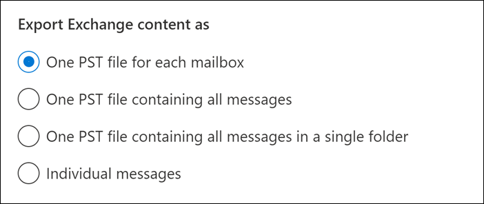
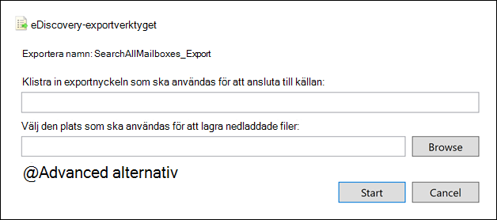
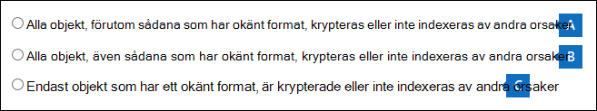

# <a name="export-content-search-results"></a><span data-ttu-id="36549-105">Exportera resultat av innehållssökning</span><span class="sxs-lookup"><span data-stu-id="36549-105">Export Content search results</span></span>

<span data-ttu-id="36549-106">När en innehållssökning har körts kan du exportera sökresultatet till en lokal dator.</span><span class="sxs-lookup"><span data-stu-id="36549-106">After a Content search is successfully run, you can export the search results to a local computer.</span></span> <span data-ttu-id="36549-107">När du exporterar e-postresultat laddas de ned till datorn som PST-filer.</span><span class="sxs-lookup"><span data-stu-id="36549-107">When you export email results, they're downloaded to your computer as PST files.</span></span> <span data-ttu-id="36549-108">När du exporterar innehåll SharePoint och OneDrive för företag webbplatser exporteras kopior av Office dokument.</span><span class="sxs-lookup"><span data-stu-id="36549-108">When you export content from SharePoint and OneDrive for Business sites, copies of native Office documents are exported.</span></span> <span data-ttu-id="36549-109">Det finns andra dokument och rapporter som ingår i de exporterade sökresultaten.</span><span class="sxs-lookup"><span data-stu-id="36549-109">There are other documents and reports included with the exported search results.</span></span>
  
<span data-ttu-id="36549-110">Om du exporterar resultaten av en innehållssökning förbereds resultaten och hämtas sedan till en lokal dator.</span><span class="sxs-lookup"><span data-stu-id="36549-110">Exporting the results of a Content search involves preparing the results, and then downloading them to a local computer.</span></span> <span data-ttu-id="36549-111">De här stegen för att exportera sökresultat gäller även för export av resultat av en sökning som är kopplad till Core eDiscovery-fall.</span><span class="sxs-lookup"><span data-stu-id="36549-111">These steps for exporting search results also apply to exporting the results of a search that's associated with Core eDiscovery cases.</span></span>
  
## <a name="before-you-export-search-results"></a><span data-ttu-id="36549-112">Innan du exporterar sökresultat</span><span class="sxs-lookup"><span data-stu-id="36549-112">Before you export search results</span></span>

- <span data-ttu-id="36549-113">Om du vill exportera sökresultat måste du ha rollen Exporthantering i Säkerhets- & Efterlevnadscenter.</span><span class="sxs-lookup"><span data-stu-id="36549-113">To export search results, you have to be assigned the Export management role in Security & Compliance Center.</span></span> <span data-ttu-id="36549-114">Den här rollen tilldelas till den inbyggda rollgruppen för eDiscovery-hanteraren.</span><span class="sxs-lookup"><span data-stu-id="36549-114">This role is assigned to the built-in eDiscovery Manager role group.</span></span> <span data-ttu-id="36549-115">Den är som standard inte tilldelad rollgruppen Organisationshantering.</span><span class="sxs-lookup"><span data-stu-id="36549-115">It isn't assigned by default to the Organization Management role group.</span></span> <span data-ttu-id="36549-116">Mer information finns i [Tilldela eDiscovery-behörigheter](assign-ediscovery-permissions.md).</span><span class="sxs-lookup"><span data-stu-id="36549-116">For more information, see [Assign eDiscovery permissions](assign-ediscovery-permissions.md).</span></span>

- <span data-ttu-id="36549-117">Datorn du använder för att exportera sökresultaten måste uppfylla följande systemkrav:</span><span class="sxs-lookup"><span data-stu-id="36549-117">The computer you use to export the search results has to meet the following system requirements:</span></span>
  
  - <span data-ttu-id="36549-118">Senaste versionen av Windows (32-bitars eller 64-bitars)</span><span class="sxs-lookup"><span data-stu-id="36549-118">Latest version of Windows (32-bit or 64-bit)</span></span>
  
  - <span data-ttu-id="36549-119">Microsoft .NET Framework 4.7</span><span class="sxs-lookup"><span data-stu-id="36549-119">Microsoft .NET Framework 4.7</span></span>
  
- <span data-ttu-id="36549-120">Du måste använda någon av följande webbläsare som stöds för att köra eDiscovery Export Tool<sup>1:</sup></span><span class="sxs-lookup"><span data-stu-id="36549-120">You have to use one of the following supported browsers to run the eDiscovery Export Tool<sup>1</sup>:</span></span>

  - <span data-ttu-id="36549-121">Microsoft Edge <sup>2</sup></span><span class="sxs-lookup"><span data-stu-id="36549-121">Microsoft Edge <sup>2</sup></span></span>
  
    <span data-ttu-id="36549-122">ELLER</span><span class="sxs-lookup"><span data-stu-id="36549-122">OR</span></span>

  - <span data-ttu-id="36549-123">Microsoft Internet Explorer 10 och senare versioner</span><span class="sxs-lookup"><span data-stu-id="36549-123">Microsoft Internet Explorer 10 and later versions</span></span>
  
  > [!NOTE]
  > <span data-ttu-id="36549-124"><sup>1</sup> Microsoft tillverkar inte tillägg eller tillägg från tredje part för ClickOnce tilläggsprogram.</span><span class="sxs-lookup"><span data-stu-id="36549-124"><sup>1</sup> Microsoft doesn't manufacture third-party extensions or add-ons for ClickOnce applications.</span></span> <span data-ttu-id="36549-125">Export av sökresultat med en webbläsare som inte stöds med tillägg eller tillägg från tredje part stöds inte.</span><span class="sxs-lookup"><span data-stu-id="36549-125">Exporting search results using an unsupported browser with third-party extensions or add-ons isn't supported.</span></span><br/>
  > <span data-ttu-id="36549-126"><sup>2</sup> På grund av de senaste ändringarna Microsoft Edge är ClickOnce inte längre aktiverat som standard.</span><span class="sxs-lookup"><span data-stu-id="36549-126"><sup>2</sup> As a result of recent changes to Microsoft Edge, ClickOnce support is no longer enabled by default.</span></span> <span data-ttu-id="36549-127">Anvisningar om hur du aktiverar ClickOnce i Edge finns i [Använda verktyget för eDiscovery-export i Microsoft Edge.](configure-edge-to-export-search-results.md)</span><span class="sxs-lookup"><span data-stu-id="36549-127">For instructions on enabling ClickOnce support in Edge, see [Use the eDiscovery Export Tool in Microsoft Edge](configure-edge-to-export-search-results.md).</span></span>
  
- <span data-ttu-id="36549-128">Verktyget för eDiscovery-export som du använder i steg 2 för att ladda ned sökresultat stöder inte automation (genom att använda skript eller cmdlets).</span><span class="sxs-lookup"><span data-stu-id="36549-128">The eDiscovery Export Tool that you use in Step 2 to download search results doesn't support automation (by using a script or running cmdlets).</span></span> <span data-ttu-id="36549-129">Vi rekommenderar starkt att du inte automatiserar förberedelseprocessen i steg 1 eller nedladdningsprocessen i steg 2.</span><span class="sxs-lookup"><span data-stu-id="36549-129">We highly recommended that you don't automate the preparation process in Step 1 or the download process in Step 2.</span></span> <span data-ttu-id="36549-130">Om du automatiserar någon av dessa processer får du ingen hjälp av Microsoft Support om du får problem.</span><span class="sxs-lookup"><span data-stu-id="36549-130">If you automate either of these processes, Microsoft Support will not provide assistance if you run into issues.</span></span>

- <span data-ttu-id="36549-131">Vi rekommenderar att du laddar ned sökresultat till en lokal dator.</span><span class="sxs-lookup"><span data-stu-id="36549-131">We recommend downloading search results to a local computer.</span></span> <span data-ttu-id="36549-132">Om du vill eliminera företagets brandvägg eller proxyinfrastruktur från att orsaka problem när du laddar ned sökresultat kan du överväga att ladda ned sökresultat till ett virtuellt skrivbord utanför nätverket.</span><span class="sxs-lookup"><span data-stu-id="36549-132">To eliminate your company's firewall or proxy infrastructure from causing issues when downloading search results, you might consider downloading search results to a virtual desktop outside of your network.</span></span> <span data-ttu-id="36549-133">Det kan minska tidsgränserna för export av Azure-dataanslutningar vid export av ett stort antal filer.</span><span class="sxs-lookup"><span data-stu-id="36549-133">This may decrease timeouts that occur in Azure data connections when exporting a large number of files.</span></span> <span data-ttu-id="36549-134">Mer information om virtuella skrivbord finns i Windows [Virtual Desktop](https://azure.microsoft.com/services/virtual-desktop).</span><span class="sxs-lookup"><span data-stu-id="36549-134">For more information about virtual desktops, see [Windows Virtual Desktop](https://azure.microsoft.com/services/virtual-desktop).</span></span>

- <span data-ttu-id="36549-135">För att förbättra prestandan när du laddar ned sökresultat kan du dela upp sökningar som returnerar en stor uppsättning resultat i mindre sökningar.</span><span class="sxs-lookup"><span data-stu-id="36549-135">To improve performance when downloading search results, consider dividing searches that return a large set of results into smaller searches.</span></span> <span data-ttu-id="36549-136">Du kan till exempel använda datumintervall i sökfrågor för att returnera ett mindre antal resultat som kan laddas ned snabbare.</span><span class="sxs-lookup"><span data-stu-id="36549-136">For example, you can use date ranges in search queries to return a smaller set of results that can be downloaded faster.</span></span>
  
- <span data-ttu-id="36549-137">När du exporterar sökresultat lagras data tillfälligt på en microsoft-tillhandahålls Azure Storage plats i Microsoft Cloud innan de laddas ned till din lokala dator.</span><span class="sxs-lookup"><span data-stu-id="36549-137">When you export search results, the data is temporarily stored in a Microsoft-provided Azure Storage location in the Microsoft cloud before it's downloaded to your local computer.</span></span> <span data-ttu-id="36549-138">Se till att din organisation kan ansluta till slutpunkten i Azure, som är **\* .blob.core.windows.net** (jokertecknet representerar en unik identifierare för exporten).</span><span class="sxs-lookup"><span data-stu-id="36549-138">Be sure that your organization can connect to the endpoint in Azure, which is **\*.blob.core.windows.net** (the wildcard represents a unique identifier for your export).</span></span> <span data-ttu-id="36549-139">Sökresultatdata tas bort från e-Azure Storage två veckor efter att den har skapats.</span><span class="sxs-lookup"><span data-stu-id="36549-139">The search results data is deleted from the Azure Storage location two weeks after it's created.</span></span> 
  
- <span data-ttu-id="36549-140">Om organisationen använder en proxyserver för att kommunicera med Internet måste du definiera proxyserverinställningarna på datorn som du använder för att exportera sökresultaten (så att exportverktyget kan autentiseras av din proxyserver).</span><span class="sxs-lookup"><span data-stu-id="36549-140">If your organization uses a proxy server to communicate with the Internet, you need to define the proxy server settings on the computer that you use to export the search results (so the export tool can be authenticated by your proxy server).</span></span> <span data-ttu-id="36549-141">Det gör du genom att *machine.config* filen på den plats som överensstämmer med din version Windows.</span><span class="sxs-lookup"><span data-stu-id="36549-141">To do this, open the  *machine.config*  file in the location that matches your version of Windows.</span></span> 
  
  - <span data-ttu-id="36549-142">**32-bitars:**`%windir%\Microsoft.NET\Framework\[version]\Config\machine.config`</span><span class="sxs-lookup"><span data-stu-id="36549-142">**32-bit:** `%windir%\Microsoft.NET\Framework\[version]\Config\machine.config`</span></span>
  
  - <span data-ttu-id="36549-143">**64-bitars:**`%windir%\Microsoft.NET\Framework64\[version]\Config\machine.config`</span><span class="sxs-lookup"><span data-stu-id="36549-143">**64-bit:** `%windir%\Microsoft.NET\Framework64\[version]\Config\machine.config`</span></span>
  
    <span data-ttu-id="36549-144">Lägg till följande rader i  *machine.config*  filen någonstans mellan  `<configuration>`  `</configuration>` taggarna och.</span><span class="sxs-lookup"><span data-stu-id="36549-144">Add the following lines to the  *machine.config*  file somewhere between the  `<configuration>` and  `</configuration>` tags.</span></span> <span data-ttu-id="36549-145">Se till att  `ProxyServer` ersätta och med rätt värden för din  `Port` organisation, till exempel `proxy01.contoso.com:80` .</span><span class="sxs-lookup"><span data-stu-id="36549-145">Be sure to replace  `ProxyServer` and  `Port` with the correct values for your organization; for example, `proxy01.contoso.com:80`.</span></span> 
  
    ```xml
    <system.net>
       <defaultProxy enabled="true" useDefaultCredentials="true">
         <proxy proxyaddress="https://ProxyServer :Port " 
                usesystemdefault="False" 
                bypassonlocal="True" 
                autoDetect="False" />
       </defaultProxy>
    </system.net>
    ```

- <span data-ttu-id="36549-146">Om resultatet av en sökning är äldre än 7 dagar och du skickar ett exportjobb visas ett felmeddelande som uppmanar dig att köra sökningen igen för att uppdatera sökresultatet.</span><span class="sxs-lookup"><span data-stu-id="36549-146">If the results of a search are older than 7 days and you submit an export job, an error message is displayed prompting you to rerun the search to update the search results.</span></span> <span data-ttu-id="36549-147">I så fall avbryter du exporten, kör sökningen igen och startar exporten igen.</span><span class="sxs-lookup"><span data-stu-id="36549-147">If this happens, cancel the export, rerun the search, and then start the export again.</span></span>

## <a name="step-1-prepare-search-results-for-export"></a><span data-ttu-id="36549-148">Steg 1: Förbereda sökresultat för export</span><span class="sxs-lookup"><span data-stu-id="36549-148">Step 1: Prepare search results for export</span></span>

<span data-ttu-id="36549-149">Det första steget är att förbereda sökresultatet för export.</span><span class="sxs-lookup"><span data-stu-id="36549-149">The first step is to prepare the search results for exporting.</span></span> <span data-ttu-id="36549-150">När du förbereder resultat överförs de till en plats i Microsoft som Azure Storage i Microsoft-molnet.</span><span class="sxs-lookup"><span data-stu-id="36549-150">When you prepare results, they are uploaded to a Microsoft-provided Azure Storage location in the Microsoft cloud.</span></span> <span data-ttu-id="36549-151">Innehåll från postlådor och webbplatser laddas upp med en maxhastighet på 2 GB per timme.</span><span class="sxs-lookup"><span data-stu-id="36549-151">Content from mailboxes and sites is uploaded at a maximum rate of 2 GB per hour.</span></span>
  
1. <span data-ttu-id="36549-152">I Microsoft 365 kompatibilitetscenter väljer du den innehållssökning som du vill exportera resultat från.</span><span class="sxs-lookup"><span data-stu-id="36549-152">In the Microsoft 365 compliance center, select the content search that you want to export results from.</span></span>
  
2. <span data-ttu-id="36549-153">På menyn **Åtgärder** längst ned på den utfällade sidan klickar du på **Exportera resultat.**</span><span class="sxs-lookup"><span data-stu-id="36549-153">On the **Actions** menu at the bottom of the flyout page, click **Export results**.</span></span>

   

   <span data-ttu-id="36549-155">Den **utfällsida** som visar Exportera resultat visas.</span><span class="sxs-lookup"><span data-stu-id="36549-155">The **Export results** flyout page is displayed.</span></span> <span data-ttu-id="36549-156">Vilka exportalternativ som finns att exportera innehåll beror på om sökresultaten finns i postlådor eller på webbplatserna, eller en kombination av båda.</span><span class="sxs-lookup"><span data-stu-id="36549-156">The export options available to export content depend on whether search results are located in mailboxes or sites or a combination of both.</span></span>

3. <span data-ttu-id="36549-157">Välj **något av** följande alternativ under Utdataalternativ:</span><span class="sxs-lookup"><span data-stu-id="36549-157">Under **Output options**, choose one of the following options:</span></span>
  
   

    - <span data-ttu-id="36549-159">Alla objekt, förutom sådana som har **okänt format,** krypteras eller inte indexeras av andra orsaker.</span><span class="sxs-lookup"><span data-stu-id="36549-159">**All items, excluding ones that have unrecognized format, are encrypted, or weren't indexed for other reasons**.</span></span> <span data-ttu-id="36549-160">Med det här alternativet exporteras endast indexerade element.</span><span class="sxs-lookup"><span data-stu-id="36549-160">This option exports only indexed items.</span></span>
  
    - <span data-ttu-id="36549-161">**Alla objekt, även sådana som har okänt format,** krypteras eller indexeras inte av andra orsaker.</span><span class="sxs-lookup"><span data-stu-id="36549-161">**All items, including ones that have unrecognized format, are encrypted, or weren't indexed for other reasons**.</span></span> <span data-ttu-id="36549-162">Med det här alternativet exporteras indexerade och icke indexerade element.</span><span class="sxs-lookup"><span data-stu-id="36549-162">This option exports indexed and unindexed items.</span></span>
  
    - <span data-ttu-id="36549-163">**Endast objekt som har ett okänt format, är krypterade eller inte indexeras av andra orsaker.**</span><span class="sxs-lookup"><span data-stu-id="36549-163">**Only items that have an unrecognized format, are encrypted, or weren't indexed for other reasons**.</span></span> <span data-ttu-id="36549-164">Med det här alternativet exporteras endast icke indexerade element.</span><span class="sxs-lookup"><span data-stu-id="36549-164">This option exports only unindexed items.</span></span>

      <span data-ttu-id="36549-165">I avsnittet [Mer information](#more-information) finns en beskrivning av hur delvis indexerade objekt exporteras.</span><span class="sxs-lookup"><span data-stu-id="36549-165">See the [More information](#more-information) section for a description about how partially indexed items are exported.</span></span> <span data-ttu-id="36549-166">Mer information om delvis indexerade objekt finns i [Delvis indexerade objekt i Innehållssökning.](partially-indexed-items-in-content-search.md)</span><span class="sxs-lookup"><span data-stu-id="36549-166">For more information about partially indexed items, see [Partially indexed items in Content search](partially-indexed-items-in-content-search.md).</span></span>

4. <span data-ttu-id="36549-167">Under **Exportera Exchange innehåll som** väljer du något av följande alternativ:</span><span class="sxs-lookup"><span data-stu-id="36549-167">Under **Export Exchange content as**, choose one of the following options:</span></span>
  
   

    - <span data-ttu-id="36549-169">**En PST-fil för varje postlåda**: Exporterar en PST-fil för varje användarpostlåda som innehåller sökresultat.</span><span class="sxs-lookup"><span data-stu-id="36549-169">**One PST file for each mailbox**: Exports one PST file for each user mailbox that contains search results.</span></span> <span data-ttu-id="36549-170">Resultat från användarens arkivpostlåda inkluderas i samma PST-fil.</span><span class="sxs-lookup"><span data-stu-id="36549-170">Any results from the user's archive mailbox are included in the same PST file.</span></span> <span data-ttu-id="36549-171">Det här alternativet återskapar postlådemappstrukturen från källpostlådan.</span><span class="sxs-lookup"><span data-stu-id="36549-171">This option reproduces the mailbox folder structure from the source mailbox.</span></span>
  
    - <span data-ttu-id="36549-172">**En PST-fil som** innehåller alla meddelanden : Exporterar en enskild PST-fil (som heter *Exchange.pst)* som innehåller sökresultatet från alla källpostlådor som ingår i sökningen.</span><span class="sxs-lookup"><span data-stu-id="36549-172">**One PST file containing all messages**: Exports a single PST file (named *Exchange.pst*) that contains the search results from all source mailboxes included in the search.</span></span> <span data-ttu-id="36549-173">Det här alternativet återskapar postlådemappstrukturen för varje meddelande.</span><span class="sxs-lookup"><span data-stu-id="36549-173">This option reproduces the mailbox folder structure for each message.</span></span>
  
    - <span data-ttu-id="36549-174">**En PST-fil som innehåller** alla meddelanden i en enda mapp : Exporterar sökresultat till en enda PST-fil där alla meddelanden finns i en enskild mapp på översta nivån.</span><span class="sxs-lookup"><span data-stu-id="36549-174">**One PST file containing all messages in a single folder**: Exports search results to a single PST file where all messages are located in a single, top-level folder.</span></span> <span data-ttu-id="36549-175">Med det här alternativet kan granskare granska objekt i kronologisk ordning (objekt sorteras efter skickat datum) utan att behöva navigera i den ursprungliga postlådemappstrukturen för varje objekt.</span><span class="sxs-lookup"><span data-stu-id="36549-175">This option lets reviewers review items in chronological order (items are sorted by sent date) without having to navigate the original mailbox folder structure for each item.</span></span>
  
    - <span data-ttu-id="36549-176">**Enskilda meddelanden:** Exporterar sökresultat som enskilda e-postmeddelanden, i MSG-format.</span><span class="sxs-lookup"><span data-stu-id="36549-176">**Individual messages**: Exports search results as individual email messages, using the .msg format.</span></span> <span data-ttu-id="36549-177">Om du väljer det här alternativet exporteras sökresultat för e-post till en mapp i filsystemet.</span><span class="sxs-lookup"><span data-stu-id="36549-177">If you select this option, email search results are exported to a folder in the file system.</span></span> <span data-ttu-id="36549-178">Mappsökvägen för enskilda meddelanden är densamma som den som användes när du exporterade resultatet till en PST-fil.</span><span class="sxs-lookup"><span data-stu-id="36549-178">The folder path for individual messages is the same as the one used if you exported the results to a PST file.</span></span>
  
5. <span data-ttu-id="36549-179">Konfigurera följande ytterligare alternativ:</span><span class="sxs-lookup"><span data-stu-id="36549-179">Configure the following additional options:</span></span>

   

   1. <span data-ttu-id="36549-181">Markera kryssrutan **Aktivera avduplicering för Exchange om** du vill utelämna dubbletter av meddelanden.</span><span class="sxs-lookup"><span data-stu-id="36549-181">Select the **Enable de-duplication for Exchange content** checkbox to exclude duplicate messages.</span></span>
  
      <span data-ttu-id="36549-182">Om du väljer det här alternativet exporteras bara en kopia av ett meddelande även om flera kopior av samma meddelande hittas i postlådorna som genomsöktes.</span><span class="sxs-lookup"><span data-stu-id="36549-182">If you select this option, only one copy of a message will be exported even if multiple copies of the same message are found in the mailboxes that were searched.</span></span> <span data-ttu-id="36549-183">Exportresultatrapporten (som är en fil med namnet Results.csv) innehåller en rad för varje kopia av ett dubblettmeddelande så att du kan identifiera postlådorna (eller de gemensamma mapparna) som innehåller en kopia av dubblettmeddelandet.</span><span class="sxs-lookup"><span data-stu-id="36549-183">The export results report (which is a file named Results.csv) will contain a row for every copy of a duplicate message so that you can identify the mailboxes (or public folders) that contain a copy of the duplicate message.</span></span> <span data-ttu-id="36549-184">Mer information om avduplicering och hur dubbletter identifieras finns i [Avduplicering i eDiscovery-sökresultat.](de-duplication-in-ediscovery-search-results.md)</span><span class="sxs-lookup"><span data-stu-id="36549-184">For more information about de-duplication and how duplicate items are identified, see [De-duplication in eDiscovery search results](de-duplication-in-ediscovery-search-results.md).</span></span>
  
   2. <span data-ttu-id="36549-185">Markera kryssrutan **Inkludera versioner SharePoint filer om** du vill exportera alla versioner SharePoint dokument.</span><span class="sxs-lookup"><span data-stu-id="36549-185">Select the **Include versions for SharePoint files** checkbox to export all versions of SharePoint documents.</span></span> <span data-ttu-id="36549-186">Det här alternativet visas bara om innehållskällorna för sökningen omfattar SharePoint eller OneDrive för företag webbplatser.</span><span class="sxs-lookup"><span data-stu-id="36549-186">This option appears only if the content sources of the search include SharePoint or OneDrive for Business sites.</span></span>
  
   3. <span data-ttu-id="36549-187">Välj **Exportera filer i en komprimerad mapp. Innehåller bara enskilda meddelanden och SharePoint dokument,** kryssruta för att exportera sökresultatet till komprimerade mappar.</span><span class="sxs-lookup"><span data-stu-id="36549-187">Select the **Export files in a compressed (zipped) folder. Includes only individual messages and SharePoint documents** checkbox to export search results to compressed folders.</span></span> <span data-ttu-id="36549-188">Det här alternativet visas bara när du väljer att exportera Exchange objekt som enskilda meddelanden och när sökresultatet innehåller SharePoint eller OneDrive dokument.</span><span class="sxs-lookup"><span data-stu-id="36549-188">This option appears only when you choose to export Exchange items as individual messages and when the search results include SharePoint or OneDrive documents.</span></span> <span data-ttu-id="36549-189">Det här alternativet används främst för att komma runt gränsen på 260 Windows i sökvägsnamnen när objekt exporteras.</span><span class="sxs-lookup"><span data-stu-id="36549-189">This option is primarily used to work around the 260 character limit in Windows file path names when items are exported.</span></span> <span data-ttu-id="36549-190">Se "Filnamn på exporterade objekt" i avsnittet [Mer information.](#more-information)</span><span class="sxs-lookup"><span data-stu-id="36549-190">See the "Filenames of exported items" in the [More information](#more-information) section.</span></span>
  
6. <span data-ttu-id="36549-191">Klicka **på Exportera** för att starta exporten.</span><span class="sxs-lookup"><span data-stu-id="36549-191">Click **Export** to start the export process.</span></span> <span data-ttu-id="36549-192">Sökresultaten förbereds för nedladdning, vilket innebär att de samlas in från de ursprungliga innehållsplatserna och sedan laddas upp till en Azure Storage plats i Microsoft-molnet.</span><span class="sxs-lookup"><span data-stu-id="36549-192">The search results are prepared for downloading, which means they're collected from the original content locations and then uploaded to an Azure Storage location in the Microsoft cloud.</span></span> <span data-ttu-id="36549-193">Det kan ta flera minuter.</span><span class="sxs-lookup"><span data-stu-id="36549-193">This may take several minutes.</span></span>

<span data-ttu-id="36549-194">Instruktioner för hur du laddar ned exporterade sökresultat finns i nästa avsnitt.</span><span class="sxs-lookup"><span data-stu-id="36549-194">See the next section for instructions to download the exported search results.</span></span>
  
## <a name="step-2-download-the-search-results"></a><span data-ttu-id="36549-195">Steg 2: Ladda ned sökresultatet</span><span class="sxs-lookup"><span data-stu-id="36549-195">Step 2: Download the search results</span></span>

<span data-ttu-id="36549-196">Nästa steg är att ladda ned sökresultatet från den Azure Storage platsen till din lokala dator.</span><span class="sxs-lookup"><span data-stu-id="36549-196">The next step is to download the search results from the Azure Storage location to your local computer.</span></span>
  
1. <span data-ttu-id="36549-197">På sidan **Innehållssökning** i kompatibilitetscentret för Microsoft 365 väljer du **fliken Exporter**</span><span class="sxs-lookup"><span data-stu-id="36549-197">On the **Content search** page in the Microsoft 365 compliance center, select the **Exports** tab</span></span>
  
   <span data-ttu-id="36549-198">Du kanske måste klicka på **Uppdatera** för att uppdatera listan med exportjobb så att den visar det exportjobb du har skapat.</span><span class="sxs-lookup"><span data-stu-id="36549-198">You may have to click **Refresh** to update the list of export jobs so that it shows the export job you created.</span></span> <span data-ttu-id="36549-199">Exportjobb har samma namn som motsvarande sökning **_Export** lagts till i söknamnet.</span><span class="sxs-lookup"><span data-stu-id="36549-199">Export jobs have the same name as the corresponding search with **_Export** appended to the search name.</span></span>
  
2. <span data-ttu-id="36549-200">Välj det exportjobb som du skapade i steg 1.</span><span class="sxs-lookup"><span data-stu-id="36549-200">Select the export job that you created in Step 1.</span></span>

3. <span data-ttu-id="36549-201">På den utfällna sidan under **Exportera-tangenten** klickar **du på Kopiera till Urklipp.**</span><span class="sxs-lookup"><span data-stu-id="36549-201">On the flyout page under **Export key**, click **Copy to clipboard**.</span></span> <span data-ttu-id="36549-202">Du använder den här nyckeln i steg 6 för att ladda ned sökresultaten.</span><span class="sxs-lookup"><span data-stu-id="36549-202">You use this key in step 6 to download the search results.</span></span>
  
   > [!IMPORTANT]
   > <span data-ttu-id="36549-203">Eftersom vem som helst kan installera och starta verktyget för eDiscovery-export och sedan använda den här nyckeln för att ladda ned sökresultaten, bör du vidta vissa försiktighetsåtgärder för att skydda den här nyckeln på samma sätt som du skyddar lösenord eller annan säkerhetsrelaterad information.</span><span class="sxs-lookup"><span data-stu-id="36549-203">Because anyone can install and start the eDiscovery Export tool, and then use this key to download the search results, be sure to take precautions to protect this key just like you would protect passwords or other security-related information.</span></span>

4. <span data-ttu-id="36549-204">Klicka på Ladda ned resultat längst upp på den **utfällsbara sidan.**</span><span class="sxs-lookup"><span data-stu-id="36549-204">At the top of the flyout page, click **Download results**.</span></span>

5. <span data-ttu-id="36549-205">Om du uppmanas att installera **eDiscovery-exportverktyget klickar** du på **Installera**.</span><span class="sxs-lookup"><span data-stu-id="36549-205">If you're prompted to install the **eDiscovery Export Tool**, click **Install**.</span></span>

6. <span data-ttu-id="36549-206">I **eDiscovery-exportverktyget** gör du följande:</span><span class="sxs-lookup"><span data-stu-id="36549-206">In the **eDiscovery Export Tool**, do the following:</span></span>

   

   1. <span data-ttu-id="36549-208">Klistra in exportnyckeln som du kopierade i steg 3 i lämplig ruta.</span><span class="sxs-lookup"><span data-stu-id="36549-208">Paste the export key that you copied in step 3 in the appropriate box.</span></span>
  
   2. <span data-ttu-id="36549-209">Klicka **på** Bläddra för att ange den plats där du vill ladda ned sökresultatfilerna.</span><span class="sxs-lookup"><span data-stu-id="36549-209">Click **Browse** to specify the location where you want to download the search result files.</span></span>
  
      > [!IMPORTANT]
      >  <span data-ttu-id="36549-210">På grund av hög nätverksaktivitet vid nedladdning bör du bara ladda ned sökresultatet till en plats på en intern enhet på den lokala datorn.</span><span class="sxs-lookup"><span data-stu-id="36549-210">Due to high network activity during download, you should download search results only to a location on an internal drive on your local computer.</span></span> <span data-ttu-id="36549-211">Följ de här riktlinjerna för att få den bästa nedladdningsupplevelsen:</span><span class="sxs-lookup"><span data-stu-id="36549-211">For the best download experience, follow these guidelines:</span></span> <br/>
      >- <span data-ttu-id="36549-212">Ladda inte ned sökresultat till en UNC-sökväg, en mappad nätverksenhet, en extern USB-enhet eller ett synkroniserat OneDrive för företag konto.</span><span class="sxs-lookup"><span data-stu-id="36549-212">Don't download search results to a UNC path, a mapped network drive, an external USB drive, or a synched OneDrive for Business account.</span></span><br/>
      >- <span data-ttu-id="36549-213">Inaktivera antivirusskanning för mappen som du laddar ned sökresultatet till.</span><span class="sxs-lookup"><span data-stu-id="36549-213">Disable anti-virus scanning for the folder that you download the search result to.</span></span><br/>
      >- <span data-ttu-id="36549-214">Ladda ned sökresultat till olika mappar för samtidiga nedladdningsjobb.</span><span class="sxs-lookup"><span data-stu-id="36549-214">Download search results to different folders for concurrent download jobs.</span></span>

7. <span data-ttu-id="36549-215">Klicka **på Start** för att ladda ned sökresultatet till datorn.</span><span class="sxs-lookup"><span data-stu-id="36549-215">Click **Start** to download the search results to your computer.</span></span>
  
    <span data-ttu-id="36549-216">I **verktyget eDiscovery Export** visas statusinformation om exporten, inklusive en uppskattning av antalet (och storleken) av de återstående objekten som ska laddas ned.</span><span class="sxs-lookup"><span data-stu-id="36549-216">The **eDiscovery Export Tool** displays status information about the export process, including an estimate of the number (and size) of the remaining items to be downloaded.</span></span> <span data-ttu-id="36549-217">När exporten är klar kan du komma åt filerna på den plats där de laddades ned.</span><span class="sxs-lookup"><span data-stu-id="36549-217">When the export process is complete, you can access the files in the location where they were downloaded.</span></span>

## <a name="more-information"></a><span data-ttu-id="36549-218">Mer information</span><span class="sxs-lookup"><span data-stu-id="36549-218">More information</span></span>

<span data-ttu-id="36549-219">Här finns mer information om hur du exporterar sökresultat.</span><span class="sxs-lookup"><span data-stu-id="36549-219">Here's more information about exporting search results.</span></span>
  
[<span data-ttu-id="36549-220">Exportgränser</span><span class="sxs-lookup"><span data-stu-id="36549-220">Export limits</span></span>](#export-limits)
  
[<span data-ttu-id="36549-221">Exportera rapporter</span><span class="sxs-lookup"><span data-stu-id="36549-221">Export reports</span></span>](#export-reports)
  
[<span data-ttu-id="36549-222">Exportera delvis indexerade objekt</span><span class="sxs-lookup"><span data-stu-id="36549-222">Exporting partially indexed items</span></span>](#exporting-partially-indexed-items)

[<span data-ttu-id="36549-223">Exportera enskilda meddelanden eller PST-filer</span><span class="sxs-lookup"><span data-stu-id="36549-223">Exporting individual messages or PST files</span></span>](#exporting-individual-messages-or-pst-files)

[<span data-ttu-id="36549-224">Dekryptera RMS-skyddade e-postmeddelanden och krypterade bifogade filer</span><span class="sxs-lookup"><span data-stu-id="36549-224">Decrypting RMS-protected email messages and encrypted file attachments</span></span>](#decrypting-rms-protected-email-messages-and-encrypted-file-attachments)

[<span data-ttu-id="36549-225">Filnamn på exporterade objekt</span><span class="sxs-lookup"><span data-stu-id="36549-225">Filenames of exported items</span></span>](#filenames-of-exported-items)  
  
[<span data-ttu-id="36549-226">Diverse</span><span class="sxs-lookup"><span data-stu-id="36549-226">Miscellaneous</span></span>](#miscellaneous)
  
### <a name="export-limits"></a><span data-ttu-id="36549-227">Exportgränser</span><span class="sxs-lookup"><span data-stu-id="36549-227">Export limits</span></span>

<span data-ttu-id="36549-228">Information om begränsningar när du exporterar innehållssökningsresultat finns i avsnittet "Exportera begränsningar" i [Begränsningar för innehållssökning](limits-for-content-search.md#export-limits).</span><span class="sxs-lookup"><span data-stu-id="36549-228">For information about limits when exporting content search results, see the "Export limits" section in [Limits for content search](limits-for-content-search.md#export-limits).</span></span>

### <a name="export-reports"></a><span data-ttu-id="36549-229">Exportera rapporter</span><span class="sxs-lookup"><span data-stu-id="36549-229">Export reports</span></span>
  
- <span data-ttu-id="36549-230">När du exporterar sökresultaten ingår följande rapporter utöver sökresultaten.</span><span class="sxs-lookup"><span data-stu-id="36549-230">When you export search results, the following reports are included in addition to the search results.</span></span>
  
  - <span data-ttu-id="36549-231">**Sammanfattning av export** Ett Excel som innehåller en sammanfattning av exporten.</span><span class="sxs-lookup"><span data-stu-id="36549-231">**Export Summary** An Excel document that contains a summary of the export.</span></span> <span data-ttu-id="36549-232">Det omfattar information som antal innehållskällor som har sökts, den uppskattade och hämtade storleken på sökresultatet och det uppskattade och nedladdade antalet objekt som exporterades.</span><span class="sxs-lookup"><span data-stu-id="36549-232">This includes information such as the number of content sources that were searched, the estimated and downloaded sizes of the search results, and the estimated and downloaded number of items that were exported.</span></span>
  
  - <span data-ttu-id="36549-233">**Manifest** En manifestfil (i XML-format) som innehåller information om varje objekt som ingår i sökresultatet.</span><span class="sxs-lookup"><span data-stu-id="36549-233">**Manifest** A manifest file (in XML format) that contains information about each item included in the search results.</span></span>
  
  - <span data-ttu-id="36549-234">**Resultat** Ett Excel som innehåller information om varje objekt som hämtas som sökresultat.</span><span class="sxs-lookup"><span data-stu-id="36549-234">**Results** An Excel document that contains information about each item that is download as a search result.</span></span> <span data-ttu-id="36549-235">För e-post innehåller resultatloggen information om varje meddelande, inklusive:</span><span class="sxs-lookup"><span data-stu-id="36549-235">For email, the result log contains information about each message, including:</span></span>
  
    - <span data-ttu-id="36549-236">Platsen för meddelandet i källpostlådan (inklusive om meddelandet finns i den primära postlådan eller arkivpostlådan).</span><span class="sxs-lookup"><span data-stu-id="36549-236">The location of the message in the source mailbox (including whether the message is in the primary or archive mailbox).</span></span>
  
    - <span data-ttu-id="36549-237">Datumet då meddelandet skickades eller togs emot.</span><span class="sxs-lookup"><span data-stu-id="36549-237">The date the message was sent or received.</span></span>

    - <span data-ttu-id="36549-238">Ämnesraden från meddelandet.</span><span class="sxs-lookup"><span data-stu-id="36549-238">The Subject line from the message.</span></span>

    - <span data-ttu-id="36549-239">Meddelandets avsändare och mottagare.</span><span class="sxs-lookup"><span data-stu-id="36549-239">The sender and recipients of the message.</span></span>

    - <span data-ttu-id="36549-240">Om meddelandet är ett duplicerat meddelande om du har aktiverat avdupliceringsalternativet när du exporterar sökresultatet.</span><span class="sxs-lookup"><span data-stu-id="36549-240">Whether the message is a duplicate message if you enabled the de-duplication option when exporting the search results.</span></span> <span data-ttu-id="36549-241">Dubblettmeddelanden har ett värde i **kolumnen Duplicera till** objekt som identifierar meddelandet som en dubblett.</span><span class="sxs-lookup"><span data-stu-id="36549-241">Duplicate messages have a value in the **Duplicate to Item** column that identifies the message as a duplicate.</span></span> <span data-ttu-id="36549-242">Värdet i kolumnen **Duplicera till** objekt innehåller objektidentiteten för meddelandet som exporterades.</span><span class="sxs-lookup"><span data-stu-id="36549-242">The value in the **Duplicate to Item** column contains the item identity of the message that was exported.</span></span> <span data-ttu-id="36549-243">Mer information finns i [Avduplicering i eDiscovery-sökresultat.](de-duplication-in-ediscovery-search-results.md)</span><span class="sxs-lookup"><span data-stu-id="36549-243">For more information, see [De-duplication in eDiscovery search results](de-duplication-in-ediscovery-search-results.md).</span></span>

      <span data-ttu-id="36549-244">För dokument SharePoint och OneDrive för företag innehåller resultatloggen information om varje dokument, inklusive:</span><span class="sxs-lookup"><span data-stu-id="36549-244">For documents from SharePoint and OneDrive for Business sites, the result log contains information about each document, including:</span></span>

      - <span data-ttu-id="36549-245">URL-adressen för dokumentet.</span><span class="sxs-lookup"><span data-stu-id="36549-245">The URL for the document.</span></span>

      - <span data-ttu-id="36549-246">URL-adressen för webbplatssamlingen där dokumentet finns.</span><span class="sxs-lookup"><span data-stu-id="36549-246">The URL for the site collection where the document is located.</span></span>

      - <span data-ttu-id="36549-247">Datumet då dokumentet senast ändrades.</span><span class="sxs-lookup"><span data-stu-id="36549-247">The date that the document was last modified.</span></span>

      - <span data-ttu-id="36549-248">Namnet på dokumentet (som finns i kolumnen Ämne i resultatloggen).</span><span class="sxs-lookup"><span data-stu-id="36549-248">The name of the document (which is located in the Subject column in the result log).</span></span>

  - <span data-ttu-id="36549-249">**Icke indexerade objekt** Ett Excel som innehåller information om delvis indexerade objekt som skulle ingå i sökresultatet.</span><span class="sxs-lookup"><span data-stu-id="36549-249">**Unindexed Items** An Excel document that contains information about any partially indexed items that would be included in the search results.</span></span> <span data-ttu-id="36549-250">Om du inte tar med delvis indexerade objekt när du skapar sökresultatrapporten kommer den här rapporten fortfarande att laddas ned, men den är tom.</span><span class="sxs-lookup"><span data-stu-id="36549-250">If you don't include partially indexed items when you generate the search results report, this report will still be downloaded, but will be empty.</span></span>

  - <span data-ttu-id="36549-251">**Fel och varningar** Innehåller fel och varningar för filer som påträffades under exporten.</span><span class="sxs-lookup"><span data-stu-id="36549-251">**Errors and Warnings** Contains errors and warnings for files encountered during export.</span></span> <span data-ttu-id="36549-252">I kolumnen Felinformation finns information som är specifik för varje enskilt fel eller varning.</span><span class="sxs-lookup"><span data-stu-id="36549-252">See the Error Details column for information specific to each individual error or warning.</span></span>

  - <span data-ttu-id="36549-253">**Objekt som hoppats över** När du exporterar sökresultat från SharePoint och OneDrive för företag-webbplatser innehåller exporten vanligtvis en rapport över överhoppade objekt (SkippedItems.csv).</span><span class="sxs-lookup"><span data-stu-id="36549-253">**Skipped Items** When you export search results from SharePoint and OneDrive for Business sites, the export will usually include a skipped items report (SkippedItems.csv).</span></span> <span data-ttu-id="36549-254">Citerade objekt i den här rapporten är vanligtvis objekt som inte laddas ned, till exempel en mapp eller en dokumentuppsättning.</span><span class="sxs-lookup"><span data-stu-id="36549-254">The items cited in this report are typically items that won't be downloaded, such as a folder or a document set.</span></span> <span data-ttu-id="36549-255">Att inte exportera den här typen av objekt är enligt design.</span><span class="sxs-lookup"><span data-stu-id="36549-255">Not exporting these types of items is by design.</span></span> <span data-ttu-id="36549-256">För andra objekt som hoppades över visar fältet "Feltyp" och "Felinformation" i rapporten överhoppade objekt orsaken till att objektet hoppades över och inte laddades ned med de andra sökresultaten.</span><span class="sxs-lookup"><span data-stu-id="36549-256">For other items that were skipped, the 'Error Type' and 'Error Details' field in the skipped items report show the reason the item was skipped and wasn't downloaded with the other search results.</span></span>

  - <span data-ttu-id="36549-257">**Trace.log** Innehåller detaljerad loggningsinformation om exporten och kan hjälpa dig att upptäcka problem under exporten.</span><span class="sxs-lookup"><span data-stu-id="36549-257">**Trace.log** Contains detailed logging information about the export process and can help uncover issues during export.</span></span> <span data-ttu-id="36549-258">Om du öppnar ett ärende hos Microsoft Support om ett problem som är relaterat till export av sökresultat kan du bli ombedd att ange den här spårningsloggen.</span><span class="sxs-lookup"><span data-stu-id="36549-258">If you open a ticket with Microsoft Support about an issue related to exporting search results, you may be asked to provide this trace log.</span></span>
  
    > [!NOTE]
    > <span data-ttu-id="36549-259">Du kan bara exportera dessa dokument utan att behöva exportera de faktiska sökresultaten.</span><span class="sxs-lookup"><span data-stu-id="36549-259">You can just export these documents without having to export the actual search results.</span></span> <span data-ttu-id="36549-260">Se [Exportera en rapport för innehållssökning](export-a-content-search-report.md).</span><span class="sxs-lookup"><span data-stu-id="36549-260">See [Export a Content search report](export-a-content-search-report.md).</span></span>
  
### <a name="exporting-partially-indexed-items"></a><span data-ttu-id="36549-261">Exportera delvis indexerade objekt</span><span class="sxs-lookup"><span data-stu-id="36549-261">Exporting partially indexed items</span></span>
  
- <span data-ttu-id="36549-262">Om du exporterar postlådeobjekt från en innehållssökning som returnerar alla postlådeobjekt i sökresultatet (eftersom inga nyckelord anges i sökfrågan) kopieras inte delvis indexerade objekt till PST-filen som innehåller icke indexerade objekt.</span><span class="sxs-lookup"><span data-stu-id="36549-262">If you're exporting mailbox items from a content search that returns all mailbox items in the search results (because no keywords where included in the search query), partially indexed items won't be copied to the PST file that contains the unindexed items.</span></span> <span data-ttu-id="36549-263">Det beror på att alla objekt, inklusive delvis indexerade objekt, automatiskt inkluderas i de vanliga sökresultaten.</span><span class="sxs-lookup"><span data-stu-id="36549-263">This is because all items, including any partially indexed items, are automatically included in the regular search results.</span></span> <span data-ttu-id="36549-264">Det innebär att delvis indexerade objekt inkluderas i en PST-fil (eller som enskilda meddelanden) som innehåller andra indexerade objekt.</span><span class="sxs-lookup"><span data-stu-id="36549-264">This means that partially indexed items will be included in a PST file (or as individual messages) that contains the other, indexed items.</span></span>

    <span data-ttu-id="36549-265">Om du exporterar både indexerade och delvis indexerade objekt eller om du bara exporterar indexerade objekt från en innehållssökning som returnerar alla objekt laddas samma antal objekt ned.</span><span class="sxs-lookup"><span data-stu-id="36549-265">If you export both the indexed and partially indexed items or if you export only the indexed items from a content search that returns all items, the same number of items will be downloaded.</span></span> <span data-ttu-id="36549-266">Detta inträffar även om det uppskattade sökresultatet för innehållssökningen (visas i sökstatistiken i säkerhets- och efterlevnadscentret för &) fortfarande innehåller en separat uppskattning av antalet delvis indexerade objekt.</span><span class="sxs-lookup"><span data-stu-id="36549-266">This happens even though the estimated search results for the content search (displayed in the search statistics in the Security & Compliance Center) will still include a separate estimate for the number of partially indexed items.</span></span> <span data-ttu-id="36549-267">Anta till exempel att uppskattningen av en sökning som innehåller alla objekt (inga nyckelord i sökfrågan) visar att 1 000 objekt hittades och att 200 delvis indexerade objekt också hittades.</span><span class="sxs-lookup"><span data-stu-id="36549-267">For example, let's say that the estimate for a search that includes all items (no keywords in the search query) shows that 1,000 items were found and that 200 partially indexed items were also found.</span></span> <span data-ttu-id="36549-268">I det här fallet innehåller 1 000 objekt delvis indexerade objekt eftersom sökningen returnerar alla objekt.</span><span class="sxs-lookup"><span data-stu-id="36549-268">In this case, the 1,000 items include the partially indexed items because the search returns all items.</span></span> <span data-ttu-id="36549-269">Med andra ord, det finns totalt 1 000 objekt som returneras av sökningen och inte 1 200 objekt (som du kan förvänta dig).</span><span class="sxs-lookup"><span data-stu-id="36549-269">In other words, there are 1,000 total items returned by the search, and not 1,200 items (as you might expect).</span></span> <span data-ttu-id="36549-270">Om du exporterar sökresultatet av den här sökningen och väljer att exportera indexerade och delvis indexerade objekt (eller bara delvis indexerat objekt) laddas 1 000 objekt ned.</span><span class="sxs-lookup"><span data-stu-id="36549-270">If you export the results of this search and choose to export indexed and partially indexed items (or export only partially indexed items), then 1,000 items will be downloaded.</span></span> <span data-ttu-id="36549-271">Det beror även på att delvis indexerade objekt inkluderas i de vanliga (indexerade) resultaten när du använder en tom sökfråga för att returnera alla objekt.</span><span class="sxs-lookup"><span data-stu-id="36549-271">Again, that's because partially indexed items are included with the regular (indexed) results when you use a blank search query to return all items.</span></span> <span data-ttu-id="36549-272">I samma exempel, om du väljer att exportera endast delvis indexerade objekt, hämtas endast de 200 icke indexerade objekten.</span><span class="sxs-lookup"><span data-stu-id="36549-272">In this same example, if you choose to export only partially indexed items, then only the 200 unindexed items would be downloaded.</span></span>

    <span data-ttu-id="36549-273">Observera även att i föregående exempel (när du exporterar indexerade och delvis  indexerade objekt eller bara exporterar indexerade objekt) visades en lista med 1 000 uppskattade objekt och 1 000 nedladdade objekt av samma orsaker som beskrivits tidigare.</span><span class="sxs-lookup"><span data-stu-id="36549-273">Also note that in the previous example (when you export indexed and partially indexed items or you export only indexed items), the **Export Summary** report included with the exported search results would list 1,000 items estimated items and 1,000 downloaded items for the same reasons as previously described.</span></span> 

- <span data-ttu-id="36549-274">Om sökningen du exporterar resultat från var en sökning på specifika innehållsplatser eller alla innehållsplatser i organisationen exporteras bara delar av objekt från innehållsplatser som innehåller objekt som matchar sökvillkoren.</span><span class="sxs-lookup"><span data-stu-id="36549-274">If the search that you're exporting results from was a search of specific content locations or all content locations in your organization, only the partial items from content locations that contain items that match the search criteria will be exported.</span></span> <span data-ttu-id="36549-275">Med andra ord, om inga sökresultat hittas i en postlåda eller på en webbplats, exporteras inte delvis indexerade objekt i den postlådan eller webbplatsen.</span><span class="sxs-lookup"><span data-stu-id="36549-275">In other words, if no search results are found in a mailbox or site, then any partially indexed items in that mailbox or site won't be exported.</span></span> <span data-ttu-id="36549-276">Anledningen är att export av delvis indexerade objekt från många platser i organisationen kan öka sannolikheten för exportfel och öka tiden det tar att exportera och ladda ned sökresultaten.</span><span class="sxs-lookup"><span data-stu-id="36549-276">The reason for this is that exporting partially indexed items from lots of locations in the organization might increase the likelihood of export errors and increase the time it takes to export and download the search results.</span></span>

    <span data-ttu-id="36549-277">Om du vill exportera delvis indexerade objekt från alla innehållsplatser för en sökning konfigurerar du sökningen så att alla objekt returneras (genom att nyckelord tas bort från sökfrågan) och sedan exporteras endast delvis indexerade objekt när du exporterar sökresultatet.</span><span class="sxs-lookup"><span data-stu-id="36549-277">To export partially indexed items from all content locations for a search, configure the search to return all items (by removing any keywords from the search query) and then export only partially indexed items when you export the search results.</span></span>

    
  
- <span data-ttu-id="36549-279">När du exporterar sökresultat från SharePoint eller OneDrive för företag-webbplatser beror möjligheten att exportera icke indexerade objekt också på vilket exportalternativ du väljer och om en webbplats som genomsökts innehåller ett indexerat objekt som matchar sökvillkoren.</span><span class="sxs-lookup"><span data-stu-id="36549-279">When exporting search results from SharePoint or OneDrive for Business sites, the ability to export unindexed items also depends on the export option that you select and whether a site that was searched contains an indexed item that matches the search criteria.</span></span> <span data-ttu-id="36549-280">Om du till exempel söker på specifika SharePoint- eller OneDrive för företag-webbplatser och inga sökresultat hittas exporteras inga icke indexerade objekt från de webbplatserna om du väljer det andra exportalternativet för att exportera både indexerade och icke indexerade objekt.</span><span class="sxs-lookup"><span data-stu-id="36549-280">For example, if you search specific SharePoint or OneDrive for Business sites and no search results are found, then no unindexed items from those sites will be exported if you choose the second export option to export both indexed and unindexed items.</span></span> <span data-ttu-id="36549-281">Om ett indexerat objekt från en webbplats matchar sökvillkoren exporteras alla icke indexerade objekt från webbplatsen vid export av både indexerade och icke indexerade objekt.</span><span class="sxs-lookup"><span data-stu-id="36549-281">If an indexed item from a site does match the search criteria, then all unindexed items from that site will be exported when exporting both indexed and unindexed items.</span></span> <span data-ttu-id="36549-282">Följande bild beskriver exportalternativen baserat på om en webbplats innehåller ett indexerat objekt som matchar sökvillkoren.</span><span class="sxs-lookup"><span data-stu-id="36549-282">The following illustration describes the export options based on whether a site contains an indexed item that matches the search criteria.</span></span>

    

    <span data-ttu-id="36549-284">a.</span><span class="sxs-lookup"><span data-stu-id="36549-284">a.</span></span> <span data-ttu-id="36549-285">Endast indexerade objekt som matchar sökvillkoren exporteras.</span><span class="sxs-lookup"><span data-stu-id="36549-285">Only indexed items that match the search criteria are exported.</span></span> <span data-ttu-id="36549-286">Inga delvis indexerade objekt exporteras.</span><span class="sxs-lookup"><span data-stu-id="36549-286">No partially indexed items are exported.</span></span>

    <span data-ttu-id="36549-287">b.</span><span class="sxs-lookup"><span data-stu-id="36549-287">b.</span></span> <span data-ttu-id="36549-288">Om inga indexerade objekt från en webbplats matchar sökvillkoren exporteras inte delvis indexerade objekt från samma webbplats.</span><span class="sxs-lookup"><span data-stu-id="36549-288">If no indexed items from a site match the search criteria, then partially indexed items from that same site aren't exported.</span></span> <span data-ttu-id="36549-289">Om indexerade objekt från en webbplats returneras i sökresultaten exporteras delvis indexerade objekt från den webbplatsen.</span><span class="sxs-lookup"><span data-stu-id="36549-289">If indexed items from a site are returned in the search results, then the partially indexed items from that site are exported.</span></span> <span data-ttu-id="36549-290">Med andra ord exporteras bara delvis indexerade objekt från webbplatser som innehåller objekt som matchar sökvillkoren.</span><span class="sxs-lookup"><span data-stu-id="36549-290">In other words, only the partially indexed items from sites that contain items that match the search criteria are exported.</span></span>

    <span data-ttu-id="36549-291">c.</span><span class="sxs-lookup"><span data-stu-id="36549-291">c.</span></span> <span data-ttu-id="36549-292">Alla delvis indexerade objekt från alla webbplatser i sökningen exporteras, oavsett om en webbplats innehåller objekt som matchar sökvillkoren.</span><span class="sxs-lookup"><span data-stu-id="36549-292">All partially indexed items from all sites in the search are exported, regardless of whether a site contains items that match the search criteria.</span></span>

    <span data-ttu-id="36549-293">Om du väljer att exportera delvis indexerade objekt exporteras delvis indexerade postlådeobjekt i en separat PST-fil oavsett vilket alternativ du väljer under **Exportera Exchange innehåll som**.</span><span class="sxs-lookup"><span data-stu-id="36549-293">If you choose to export partially indexed items, partially indexed mailbox items are exported in a separate PST file regardless of the option that you choose under **Export Exchange content as**.</span></span>

- <span data-ttu-id="36549-294">Om delvis indexerade objekt returneras i sökresultatet (eftersom andra egenskaper för delvis indexerade objekt matchade sökvillkoren), exporteras de delvis indexerade med de vanliga sökresultaten.</span><span class="sxs-lookup"><span data-stu-id="36549-294">If partially indexed items are returned in the search results (because other properties of partially indexed items matched the search criteria), then those partially indexed are exported with the regular search results.</span></span> <span data-ttu-id="36549-295">Om du väljer att exportera både indexerade och delvis indexerade objekt (genom att markera alternativet Alla objekt, även sådana som har okänt **format,** krypteras eller inte indexeras av andra orsaker), visas därför delvis indexerade objekt som exporterats med de vanliga resultaten i Results.csv-rapporten.</span><span class="sxs-lookup"><span data-stu-id="36549-295">So, if you choose to export both indexed items and partially indexed items (by selecting the **All items, including ones that have unrecognized format, are encrypted, or weren't indexed for other reasons** export option), the partially indexed items exported with the regular results will be listed in the Results.csv report.</span></span> <span data-ttu-id="36549-296">De visas inte i rapporten icke indexerade items.csv indexerade.</span><span class="sxs-lookup"><span data-stu-id="36549-296">They will not be listed in the Unindexed items.csv report.</span></span>
  
### <a name="exporting-individual-messages-or-pst-files"></a><span data-ttu-id="36549-297">Exportera enskilda meddelanden eller PST-filer</span><span class="sxs-lookup"><span data-stu-id="36549-297">Exporting individual messages or PST files</span></span>
  
- <span data-ttu-id="36549-298">Om filnamnet i ett meddelande överskrider gränsen för maximalt Windows trunkeras filnamnet.</span><span class="sxs-lookup"><span data-stu-id="36549-298">If the file path name of a message exceeds the maximum character limit for Windows, the file path name is truncated.</span></span> <span data-ttu-id="36549-299">Men det ursprungliga filnamnet visas i manifestet och resultatloggen.</span><span class="sxs-lookup"><span data-stu-id="36549-299">But the original file path name will be listed in the Manifest and ResultsLog.</span></span>
  
- <span data-ttu-id="36549-300">Som tidigare förklarats exporteras sökresultat för e-post till en mapp i filsystemet.</span><span class="sxs-lookup"><span data-stu-id="36549-300">As previously explained, email search results are exported to a folder in the file system.</span></span> <span data-ttu-id="36549-301">Mappsökvägen för enskilda meddelanden replikerar mappsökvägen i användarens postlåda.</span><span class="sxs-lookup"><span data-stu-id="36549-301">The folder path for individual messages would replicate the folder path in the user's mailbox.</span></span> <span data-ttu-id="36549-302">Till exempel finns en sökning med namnet "ContosoCase101" i en användares inkorg i mappsökvägen  `~ContosoCase101\\<date of export\Exchange\user@contoso.com (Primary)\Top of Information Store\Inbox` .</span><span class="sxs-lookup"><span data-stu-id="36549-302">For example, for a search named "ContosoCase101" messages in a user's inbox would be located in the folder path  `~ContosoCase101\\<date of export\Exchange\user@contoso.com (Primary)\Top of Information Store\Inbox`.</span></span>

- <span data-ttu-id="36549-303">Om du väljer att exportera e-postmeddelanden i en PST-fil som innehåller  alla meddelanden i en enda mapp, inkluderas mappen Borttaget och mappen Sökmappar i den översta nivån i PST-mappen. </span><span class="sxs-lookup"><span data-stu-id="36549-303">If you choose to export email messages in one PST file containing all messages in a single folder, a **Deleted Items** folder and a **Search Folders** folder are included in the top level of the PST folder.</span></span> <span data-ttu-id="36549-304">Mapparna är tomma.</span><span class="sxs-lookup"><span data-stu-id="36549-304">These folders are empty.</span></span>

- <span data-ttu-id="36549-305">Som tidigare nämnts måste du exportera sökresultaten som enskilda meddelanden för att dekryptera RMS-skyddade meddelanden när de exporteras.</span><span class="sxs-lookup"><span data-stu-id="36549-305">As previously stated, you must export email search results as individual messages to decrypt RMS-protected messages when they're exported.</span></span> <span data-ttu-id="36549-306">Krypterade meddelanden förblir krypterade om du exporterar e-postsökresultat som en PST-fil.</span><span class="sxs-lookup"><span data-stu-id="36549-306">Encrypted messages will remain encrypted if you export email search results as a PST file.</span></span>
  
### <a name="decrypting-rms-protected-email-messages-and-encrypted-file-attachments"></a><span data-ttu-id="36549-307">Dekryptera RMS-skyddade e-postmeddelanden och krypterade bifogade filer</span><span class="sxs-lookup"><span data-stu-id="36549-307">Decrypting RMS-protected email messages and encrypted file attachments</span></span>

<span data-ttu-id="36549-308">Rättighetsskyddade (RMS-skyddade) e-postmeddelanden som ingår i resultatet av en innehållssökning dekrypteras när du exporterar dem.</span><span class="sxs-lookup"><span data-stu-id="36549-308">Any rights-protected (RMS-protected) email messages included in the results of a Content search will be decrypted when you export them.</span></span> <span data-ttu-id="36549-309">Alla filer som är krypterade med [](encryption.md) Microsoft-krypteringsteknik och bifogas i ett e-postmeddelande som ingår i sökresultaten dekrypteras också när de exporteras.</span><span class="sxs-lookup"><span data-stu-id="36549-309">Additionally, any file that's encrypted with a [Microsoft encryption technology](encryption.md) and is attached to an email message that's included in the search results will also be decrypted when it's exported.</span></span> <span data-ttu-id="36549-310">Den här dekrypteringsfunktionerna är aktiverade som standard för medlemmar i rollgruppen för eDiscovery Manager.</span><span class="sxs-lookup"><span data-stu-id="36549-310">This decryption capability is enabled by default for members of the eDiscovery Manager role group.</span></span> <span data-ttu-id="36549-311">Det beror på att rollgruppen tilldelas rollen RMS-dekrypthantering.</span><span class="sxs-lookup"><span data-stu-id="36549-311">This is because the RMS Decrypt management role is assigned to this role group by default.</span></span> <span data-ttu-id="36549-312">Tänk på följande när du exporterar krypterade e-postmeddelanden och bifogade filer:</span><span class="sxs-lookup"><span data-stu-id="36549-312">Keep the following things in mind when exporting encrypted email messages and attachments:</span></span>
  
- <span data-ttu-id="36549-313">Om du vill dekryptera RMS-skyddade meddelanden när du exporterar dem måste du, som tidigare förklarats, exportera sökresultatet som enskilda meddelanden.</span><span class="sxs-lookup"><span data-stu-id="36549-313">As previously explained, to decrypt RMS-protected messages when you export them, you have to export the search results as individual messages.</span></span> <span data-ttu-id="36549-314">Om du exporterar sökresultat till en PST-fil förblir RMS-skyddade meddelanden krypterade.</span><span class="sxs-lookup"><span data-stu-id="36549-314">If you export search results to a PST file, RMS-protected messages remain encrypted.</span></span>

- <span data-ttu-id="36549-315">Meddelanden som dekrypteras identifieras i **ResultsLog-rapporten.**</span><span class="sxs-lookup"><span data-stu-id="36549-315">Messages that are decrypted are identified in the **ResultsLog** report.</span></span> <span data-ttu-id="36549-316">Den här rapporten innehåller en kolumn med namnet Avkoda **status** och värdet **Avkoda** i den här kolumnen identifierar de meddelanden som har dekrypterats.</span><span class="sxs-lookup"><span data-stu-id="36549-316">This report contains a column named **Decode Status**, and a value of **Decoded** in this column identifies the messages that were decrypted.</span></span>

- <span data-ttu-id="36549-317">Förutom att dekryptera bifogade filer när du exporterar sökresultat kan du också förhandsgranska den dekrypterade filen när du förhandsgranskar sökresultat.</span><span class="sxs-lookup"><span data-stu-id="36549-317">In addition to decrypting file attachments when exporting search results, you can also preview the decrypted file when previewing search results.</span></span> <span data-ttu-id="36549-318">Du kan bara visa det rättighetsskyddade e-postmeddelandet när du exporterat det.</span><span class="sxs-lookup"><span data-stu-id="36549-318">You can only view the rights-protected email message after you export it.</span></span>

- <span data-ttu-id="36549-319">För stunden innehåller dekrypteringsfunktionerna inte krypterat innehåll från SharePoint och OneDrive för företag webbplatser.</span><span class="sxs-lookup"><span data-stu-id="36549-319">At this time, the decryption capability when exporting search results doesn't include encrypted content from SharePoint and OneDrive for Business sites.</span></span> <span data-ttu-id="36549-320">Support kommer dock snart för dokument som krypteras med microsoft-krypteringstekniker och som lagras i SharePoint Online och OneDrive för företag.</span><span class="sxs-lookup"><span data-stu-id="36549-320">However, support is coming soon for documents encrypted with Microsoft encryption technologies and stored in SharePoint Online and OneDrive for Business.</span></span>

- <span data-ttu-id="36549-321">Om du behöver förhindra att någon dekrypterar RMS-skydda meddelanden och krypterade bifogade filer måste du skapa en anpassad rollgrupp (genom att kopiera den inbyggda rollgruppen för eDiscovery-hanteraren) och sedan ta bort RMS-rollen Dekryptera hantering från den anpassade rollgruppen.</span><span class="sxs-lookup"><span data-stu-id="36549-321">If you need to prevent someone from decrypting RMS-protect messages and encrypted file attachments, you have to create a custom role group (by copying the built-in eDiscovery Manager role group) and then remove the RMS Decrypt management role from the custom role group.</span></span> <span data-ttu-id="36549-322">Lägg sedan till den person som du inte vill dekryptera meddelanden till som medlem i den anpassade rollgruppen.</span><span class="sxs-lookup"><span data-stu-id="36549-322">Then add the person who you don't want to decrypt messages as a member of the custom role group.</span></span>
  
### <a name="filenames-of-exported-items"></a><span data-ttu-id="36549-323">Filnamn på exporterade objekt</span><span class="sxs-lookup"><span data-stu-id="36549-323">Filenames of exported items</span></span>
  
- <span data-ttu-id="36549-324">Det finns en begränsning på 260 tecken (som införs i operativsystemet) för det fullständiga sökvägsnamnet för e-postmeddelanden och webbplatsdokument som exporteras till den lokala datorn.</span><span class="sxs-lookup"><span data-stu-id="36549-324">There is a 260-character limit (imposed by the operating system) for the full path name for email messages and site documents exported to your local computer.</span></span> <span data-ttu-id="36549-325">Den fullständiga sökvägen för exporterade objekt innehåller objektets ursprungliga plats och mappplatsen på den lokala datorn dit sökresultaten hämtas.</span><span class="sxs-lookup"><span data-stu-id="36549-325">The full path name for exported items includes the item's original location and the folder location on the local computer where the search results are downloaded to.</span></span> <span data-ttu-id="36549-326">Om du till exempel anger att sökresultatet ska hämtas till verktyget eDiscovery Export blir den fullständiga sökvägen för ett  `C:\Users\Admin\Desktop\SearchResults` nedladdat e-postobjekt  `C:\Users\Admin\Desktop\SearchResults\ContentSearch1\03.15.2017-1242PM\Exchange\sarad@contoso.com (Primary)\Top of Information Store\Inbox\Insider trading investigation.msg` .</span><span class="sxs-lookup"><span data-stu-id="36549-326">For example, if you specify to download the search results to  `C:\Users\Admin\Desktop\SearchResults` in the eDiscovery Export tool, then the full pathname for a downloaded email item would be  `C:\Users\Admin\Desktop\SearchResults\ContentSearch1\03.15.2017-1242PM\Exchange\sarad@contoso.com (Primary)\Top of Information Store\Inbox\Insider trading investigation.msg`.</span></span>

- <span data-ttu-id="36549-327">Om gränsen på 260 tecken överskrids trunkeras det fullständiga sökvägsnamnet för ett objekt, baserat på följande:</span><span class="sxs-lookup"><span data-stu-id="36549-327">If the 260-character limit is exceeded, the full path name for an item will be truncated, based on the following:</span></span>

  - <span data-ttu-id="36549-328">Om det fullständiga sökvägsnamnet är längre än 260 tecken förkortas filnamnet så att det ligger under gränsen. Observera att det trunkerade filnamnet (exklusive filnamnstillägget) inte är färre än åtta tecken.</span><span class="sxs-lookup"><span data-stu-id="36549-328">If the full path name is longer than 260 characters, the file name will be shortened to get under the limit; note that the truncated filename (excluding the file extension) won't be fewer than eight characters.</span></span>

  - <span data-ttu-id="36549-329">Om den fullständiga sökvägen är för lång efter att filnamnet förkortats flyttas objektet från dess aktuella plats till den överordnade mappen.</span><span class="sxs-lookup"><span data-stu-id="36549-329">If the full path name is still too long after shortening the file name, the item is moved from its current location to the parent folder.</span></span> <span data-ttu-id="36549-330">Om sökvägen fortfarande är för lång upprepas processen: förkorta filnamnet och om det behövs flytta igen till den överordnade mappen.</span><span class="sxs-lookup"><span data-stu-id="36549-330">If the pathname is still too long, then the process is repeated: shorten the filename, and if necessary move again to the parent folder.</span></span> <span data-ttu-id="36549-331">Den här processen upprepas tills den fullständiga sökvägen är under gränsen på 260 tecken.</span><span class="sxs-lookup"><span data-stu-id="36549-331">This process is repeated until the full pathname is under the 260-character limit.</span></span>

  - <span data-ttu-id="36549-332">Om det redan finns ett trunkerat fullständigt sökvägsnamn läggs ett versionsnummer till i slutet av filnamnet. till exempel `statusmessage(2).msg` .</span><span class="sxs-lookup"><span data-stu-id="36549-332">If a truncated full path name already exists, a version number is added to the end of the filename; for example, `statusmessage(2).msg`.</span></span>

    <span data-ttu-id="36549-333">Överväg att ladda ned sökresultaten till en plats med ett kort sökvägsnamn för att minimera problemet. Att ladda ned sökresultat till en mapp med namnet skulle till exempel lägga till färre tecken i sökvägen för exporterade objekt än att ladda ned dem till  `C:\Results` en mapp med namnet  `C:\Users\Admin\Desktop\Results` .</span><span class="sxs-lookup"><span data-stu-id="36549-333">To help mitigate this issue, consider downloading search results to a location with a short path name; for example, downloading search results to a folder named  `C:\Results` would add fewer characters to the path names of exported items than downloading them to a folder named  `C:\Users\Admin\Desktop\Results`.</span></span>

- <span data-ttu-id="36549-334">När du exporterar webbplatsdokument är det också möjligt att det ursprungliga filnamnet på ett dokument ändras.</span><span class="sxs-lookup"><span data-stu-id="36549-334">When you export site documents, it's also possible that the original file name of a document will be modified.</span></span> <span data-ttu-id="36549-335">Detta inträffar specifikt för dokument som har tagits bort från en SharePoint eller OneDrive för företag-webbplats som har satts på en plats.</span><span class="sxs-lookup"><span data-stu-id="36549-335">This happens specifically for documents that have been deleted from a SharePoint or OneDrive for Business site that's been placed on hold.</span></span> <span data-ttu-id="36549-336">När ett dokument som finns på en webbplats som är på en bevarande webbplats tas bort flyttas det borttagna dokumentet automatiskt till biblioteket för bevarande av dokument för webbplatsen (som skapades när webbplatsen skapades som bevarande).</span><span class="sxs-lookup"><span data-stu-id="36549-336">After a document that's on a site that's on hold is deleted, the deleted document is automatically moved to the Preservation Hold library for the site (which was created when the site was placed on hold).</span></span> <span data-ttu-id="36549-337">När det borttagna dokumentet flyttas till biblioteket för bevarande av dokument läggs ett slumpmässigt genererat och unikt ID till i det ursprungliga filnamnet för dokumentet.</span><span class="sxs-lookup"><span data-stu-id="36549-337">When the deleted document is moved to the Preservation Hold library, a randomly generated and unique ID is appended to the original filename of the document.</span></span> <span data-ttu-id="36549-338">Om filnamnet för ett dokument till exempel tas bort och det senare tas bort och flyttas till biblioteket För bevarande av dokument ändras filnamnet på dokumentet som flyttas till biblioteket för bevarande av dokument till något i liknande  `FY2017Budget.xlsx`  `FY2017Budget_DEAF727D-0478-4A7F-87DE-5487F033C81A2000-07-05T10-37-55.xlsx` skick.</span><span class="sxs-lookup"><span data-stu-id="36549-338">For example, if the filename for a document is  `FY2017Budget.xlsx` and that document is later deleted and moved to the Preservation Hold library, the filename of the document that is moved to the Preservation Hold library is modified to something like  `FY2017Budget_DEAF727D-0478-4A7F-87DE-5487F033C81A2000-07-05T10-37-55.xlsx`.</span></span> <span data-ttu-id="36549-339">Om ett dokument i biblioteket för bevarande av dokument matchar frågan för en innehållssökning och du exporterar resultatet av sökningen har den exporterade filen det ändrade filnamnet. I det här exemplet skulle filnamnet på det exporterade dokumentet vara  `FY2017Budget_DEAF727D-0478-4A7F-87DE-5487F033C81A2000-07-05T10-37-55.xlsx` .</span><span class="sxs-lookup"><span data-stu-id="36549-339">If a document in the Preservation Hold library matches the query of a Content search and you export the results of that search, the exported file has the modified filename; in this example, the filename of the exported document would be  `FY2017Budget_DEAF727D-0478-4A7F-87DE-5487F033C81A2000-07-05T10-37-55.xlsx`.</span></span>

    <span data-ttu-id="36549-340">När ett dokument på en webbplats som är på plats ändras (och versionshantering för dokumentbiblioteket på webbplatsen har aktiverats) skapas en kopia av filen automatiskt i biblioteket för bevarande av dokument.</span><span class="sxs-lookup"><span data-stu-id="36549-340">When a document on a site that's on hold is modified (and versioning for the document library in the site has been enabled), a copy of the file is automatically created in the Preservation Hold library.</span></span> <span data-ttu-id="36549-341">I det här fallet läggs även ett slumpmässigt genererat och unikt ID till i filnamnet för det dokument som kopieras till biblioteket Bevarande av dokument.</span><span class="sxs-lookup"><span data-stu-id="36549-341">In this case, a randomly generated and unique ID is also appended to the filename of the document that's copied to the Preservation Hold library.</span></span>

    <span data-ttu-id="36549-342">Anledningen till att filnamnen på dokument som flyttas eller kopieras till biblioteket för bevarande av dokument är att de inte innehåller filnamn i konflikt.</span><span class="sxs-lookup"><span data-stu-id="36549-342">The reason why filenames of documents that are moved or copied to the Preservation Hold library is to prevent conflicting filenames.</span></span> <span data-ttu-id="36549-343">Mer information om hur du placerar ett bevarande på webbplatser och biblioteket för bevarande av dokument finns i Översikt över förvaring i [SharePoint Server 2016.](https://support.office.com/article/5e400d68-cd51-444a-8fe6-e4df1d20aa95)</span><span class="sxs-lookup"><span data-stu-id="36549-343">For more information about placing a hold on sites and the Preservation Hold library, see [Overview of in-place hold in SharePoint Server 2016](https://support.office.com/article/5e400d68-cd51-444a-8fe6-e4df1d20aa95).</span></span>

### <a name="miscellaneous"></a><span data-ttu-id="36549-344">Diverse</span><span class="sxs-lookup"><span data-stu-id="36549-344">Miscellaneous</span></span>
  
- <span data-ttu-id="36549-345">När du laddar ned sökresultat med eDiscovery-exportverktyget kan följande felmeddelande visas: Det här är tillfälligt fel, som vanligtvis förekommer `System.Net.WebException: The remote server returned an error: (412) The condition specified using HTTP conditional header(s) is not met.` i Azure Storage plats.</span><span class="sxs-lookup"><span data-stu-id="36549-345">When downloading search results using the eDiscovery Export Tool, it's possible you might receive the following error: `System.Net.WebException: The remote server returned an error: (412) The condition specified using HTTP conditional header(s) is not met.` This is transient error, which typically occurs in the Azure Storage location.</span></span> <span data-ttu-id="36549-346">Du kan lösa problemet genom att försöka [ladda ned sökresultaten igen,](#step-2-download-the-search-results)som startar om eDiscovery-exportverktyget.</span><span class="sxs-lookup"><span data-stu-id="36549-346">To resolve this issue, retry [downloading the search results](#step-2-download-the-search-results), which will restart the eDiscovery Export Tool.</span></span>

- <span data-ttu-id="36549-347">Alla sökresultat och exportrapporterna ingår i en mapp som har samma namn som innehållssökningen.</span><span class="sxs-lookup"><span data-stu-id="36549-347">All search results and the export reports are included in a folder that has the same name as the Content search.</span></span> <span data-ttu-id="36549-348">De e-postmeddelanden som exporterades finns i en mapp med namnet **Exchange**.</span><span class="sxs-lookup"><span data-stu-id="36549-348">The email messages that were exported are located in a folder named **Exchange**.</span></span> <span data-ttu-id="36549-349">Dokument finns i en mapp med namnet **SharePoint**.</span><span class="sxs-lookup"><span data-stu-id="36549-349">Documents are located in a folder named **SharePoint**.</span></span>

- <span data-ttu-id="36549-350">Filsystemmetadata för dokument på SharePoint och OneDrive för företag underhålls när dokument exporteras till den lokala datorn.</span><span class="sxs-lookup"><span data-stu-id="36549-350">The file system metadata for documents on SharePoint and OneDrive for Business sites is maintained when documents are exported to your local computer.</span></span> <span data-ttu-id="36549-351">Det innebär att dokumentegenskaper som datum som skapats och senast ändrades inte ändras när dokument exporteras.</span><span class="sxs-lookup"><span data-stu-id="36549-351">That means document properties, such as created and last modified dates, aren't changed when documents are exported.</span></span>

- <span data-ttu-id="36549-352">Om sökresultatet innehåller ett listobjekt från SharePoint som matchar sökfrågan exporteras alla rader i listan förutom det objekt som matchar sökfrågan och eventuella bifogade filer i listan.</span><span class="sxs-lookup"><span data-stu-id="36549-352">If your search results include a list item from SharePoint that matches the search query, all rows in the list will be exported in addition to the item that matches the search query and any attachments in the list.</span></span> <span data-ttu-id="36549-353">Orsaken till det här beteendet är att skapa ett sammanhang för listobjekt som returneras i sökresultatet.</span><span class="sxs-lookup"><span data-stu-id="36549-353">The reason for this behavior is to provide a context for list items that are returned in the search results.</span></span> <span data-ttu-id="36549-354">De ytterligare listobjekten och de bifogade filerna kan orsaka att antalet exporterade objekt skiljer sig från den ursprungliga uppskattningen av sökresultaten.</span><span class="sxs-lookup"><span data-stu-id="36549-354">The additional list items and attachments may cause the count of exported items to be different than the original estimate of search results.</span></span>
