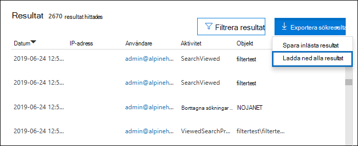

# <a name="export-configure-and-view-audit-log-records"></a><span data-ttu-id="c3588-103">Exportera, konfigurera och visa granskningsloggposter</span><span class="sxs-lookup"><span data-stu-id="c3588-103">Export, configure, and view audit log records</span></span>

<span data-ttu-id="c3588-104">När du har sökt i granskningsloggen och laddat ned sökresultatet till en CSV-fil innehåller filen en kolumn med namnet **Information,** som innehåller ytterligare information om varje händelse.</span><span class="sxs-lookup"><span data-stu-id="c3588-104">After you search the audit log and download the search results to a CSV file, the file contains a column named **AuditData**, which contains additional information about each event.</span></span> <span data-ttu-id="c3588-105">Data i den här kolumnen formateras som ett JSON-objekt, som innehåller flera egenskaper som är konfigurerade som *property:value-par* avgränsade med kommatecken.</span><span class="sxs-lookup"><span data-stu-id="c3588-105">The data in this column is formatted as a JSON object, which contains multiple properties that are configured as *property:value* pairs separated by commas.</span></span> <span data-ttu-id="c3588-106">Du kan använda funktionen JSON-transformering i Power Query-redigeraren i Excel för att dela upp varje egenskap i JSON-objektet i kolumnen **Information** i flera kolumner så att varje egenskap har en egen kolumn.</span><span class="sxs-lookup"><span data-stu-id="c3588-106">You can use the JSON transform feature in the Power Query Editor in Excel to split each property in the JSON object in the **AuditData** column into multiple columns so that each property has its own column.</span></span> <span data-ttu-id="c3588-107">Då kan du sortera och filtrera efter en eller flera av dessa egenskaper, vilket kan hjälpa dig att snabbt hitta de granskningsdata du letar efter.</span><span class="sxs-lookup"><span data-stu-id="c3588-107">This lets you sort and filter on one or more of these properties, which can help you quickly locate the specific auditing data you're looking for.</span></span>

## <a name="step-1-export-audit-log-search-results"></a><span data-ttu-id="c3588-108">Steg 1: Exportera granskningsloggsökningsresultat</span><span class="sxs-lookup"><span data-stu-id="c3588-108">Step 1: Export audit log search results</span></span>

<span data-ttu-id="c3588-109">Det första steget är att söka i granskningsloggen och sedan exportera resultatet i en fil med kommaavgränsade värden (CSV) till den lokala datorn.</span><span class="sxs-lookup"><span data-stu-id="c3588-109">The first step is to search the audit log and then export the results in a comma-separated value (CSV) file to your local computer.</span></span>
  
1. <span data-ttu-id="c3588-110">Kör en [granskningsloggsökning](search-the-audit-log-in-security-and-compliance.md#search-the-audit-log) och ändra sökvillkoren om det behövs tills du fått önskat resultat.</span><span class="sxs-lookup"><span data-stu-id="c3588-110">Run an [audit log search](search-the-audit-log-in-security-and-compliance.md#search-the-audit-log) and revise the search criteria if necessary until you have the desired results.</span></span>

2. <span data-ttu-id="c3588-111">Klicka **på Exportera resultat** och välj Ladda ned alla **resultat.**</span><span class="sxs-lookup"><span data-stu-id="c3588-111">Click **Export results** and select **Download all results**.</span></span> 

   

   <span data-ttu-id="c3588-113">Det här alternativet exporterar alla granskningsposter från granskningsloggsökningen du körde i steg 1 och laddar ned rådata från granskningsloggen till en CSV-fil.</span><span class="sxs-lookup"><span data-stu-id="c3588-113">This option to exports all the audit records from the audit log search you ran in step 1, and downloads the raw data from the audit log to a CSV file.</span></span> 

   <span data-ttu-id="c3588-114">Ett meddelande visas längst ned i fönstret som uppmanar dig att öppna eller spara CSV-filen.</span><span class="sxs-lookup"><span data-stu-id="c3588-114">A message is displayed at the bottom of the window that prompts you to open or save the CSV file.</span></span> 

3. <span data-ttu-id="c3588-115">Klicka **på > spara som** och spara CSV-filen på den lokala datorn.</span><span class="sxs-lookup"><span data-stu-id="c3588-115">Click **Save > Save as** and save the CSV file to your local computer.</span></span> <span data-ttu-id="c3588-116">Det tar en stund att ladda ned många sökresultat.</span><span class="sxs-lookup"><span data-stu-id="c3588-116">It takes a while to download many search results.</span></span> <span data-ttu-id="c3588-117">Så är det vanligtvis när du söker efter alla aktiviteter eller ett brett datumintervall.</span><span class="sxs-lookup"><span data-stu-id="c3588-117">This is typically the case when searching for all activities or a broad date range.</span></span> <span data-ttu-id="c3588-118">Ett meddelande längst ned i fönstret visas när CSV-filen har laddats ned.</span><span class="sxs-lookup"><span data-stu-id="c3588-118">A message at the bottom of the windows is displayed when the CSV file is finished downloading.</span></span>

   

> [!NOTE]
  > <span data-ttu-id="c3588-120">Du kan ladda ned högst 50 000 poster till en CSV-fil från en enskild granskningsloggsökning.</span><span class="sxs-lookup"><span data-stu-id="c3588-120">You can download a maximum of 50,000 entries to a CSV file from a single audit log search.</span></span> <span data-ttu-id="c3588-121">Om 50 000 poster laddas ned till CSV-filen kan du antagligen förutsätta att det finns fler än 50 000 händelser som uppfyller sökvillkoren.</span><span class="sxs-lookup"><span data-stu-id="c3588-121">If 50,000 entries are downloaded to the CSV file, you can probably assume there are more than 50,000 events that met the search criteria.</span></span> <span data-ttu-id="c3588-122">Om du vill exportera fler poster än så kan du prova att använda ett datumintervall för att minska antalet granskningsloggposter.</span><span class="sxs-lookup"><span data-stu-id="c3588-122">To export more than this limit, try using a date range to reduce the number of audit log records.</span></span> <span data-ttu-id="c3588-123">Du kan behöva köra flera sökningar med mindre datumintervall för att exportera fler än 50 000 poster.</span><span class="sxs-lookup"><span data-stu-id="c3588-123">You might have to run multiple searches with smaller date ranges to export more than 50,000 entries.</span></span>

## <a name="step-2-format-the-exported-audit-log-using-the-power-query-editor"></a><span data-ttu-id="c3588-124">Steg 2: Formatera den exporterade granskningsloggen med Power Query-redigeraren</span><span class="sxs-lookup"><span data-stu-id="c3588-124">Step 2: Format the exported audit log using the Power Query Editor</span></span>

<span data-ttu-id="c3588-125">Nästa steg är att använda transformeringsfunktionen JSON i Power Query-redigeraren i Excel för att dela upp varje egenskap i JSON-objektet i kolumnen **Information** i en egen kolumn.</span><span class="sxs-lookup"><span data-stu-id="c3588-125">The next step is to use the JSON transform feature in the Power Query Editor in Excel to split each property in the JSON object in the **AuditData** column into its own column.</span></span> <span data-ttu-id="c3588-126">Sedan filtrerar du kolumner för att visa poster baserat på värdena för specifika egenskaper.</span><span class="sxs-lookup"><span data-stu-id="c3588-126">Then you filter columns to view records based on the values of specific properties.</span></span> <span data-ttu-id="c3588-127">Det kan hjälpa dig att snabbt hitta de granskningsdata du letar efter.</span><span class="sxs-lookup"><span data-stu-id="c3588-127">This can help you quickly locate the specific auditing data you're looking for.</span></span>

1. <span data-ttu-id="c3588-128">Öppna en tom arbetsbok i Excel för Office 365, Excel 2019 eller Excel 2016.</span><span class="sxs-lookup"><span data-stu-id="c3588-128">Open a blank workbook in Excel for Office 365, Excel 2019, or Excel 2016.</span></span>

2. <span data-ttu-id="c3588-129">Klicka på Från **text/CSV** **i &** Hämta och omvandla data på fliken **Data.**</span><span class="sxs-lookup"><span data-stu-id="c3588-129">On the **Data** tab, in the **Get & Transform Data** ribbon group, click **From Text/CSV**.</span></span>

    

3. <span data-ttu-id="c3588-131">Öppna CSV-filen som du laddade ned i steg 1.</span><span class="sxs-lookup"><span data-stu-id="c3588-131">Open the CSV file that you downloaded in Step 1.</span></span>

4. <span data-ttu-id="c3588-132">I fönstret som visas klickar du på **Omvandla data.**</span><span class="sxs-lookup"><span data-stu-id="c3588-132">In the window that's displayed, click **Transform Data**.</span></span>

   

   <span data-ttu-id="c3588-134">CSV-filen öppnas i **Frågeredigeraren**.</span><span class="sxs-lookup"><span data-stu-id="c3588-134">The CSV file is opened in the **Query Editor**.</span></span> <span data-ttu-id="c3588-135">Det finns fyra kolumner: **CreationDate,** **UserIds**, **Operations** och **AuditData.**</span><span class="sxs-lookup"><span data-stu-id="c3588-135">There are four columns: **CreationDate**, **UserIds**, **Operations**, and **AuditData**.</span></span> <span data-ttu-id="c3588-136">Kolumnen **Information är** ett JSON-objekt som innehåller flera egenskaper.</span><span class="sxs-lookup"><span data-stu-id="c3588-136">The **AuditData** column is a JSON object that contains multiple properties.</span></span> <span data-ttu-id="c3588-137">Nästa steg är att skapa en kolumn för varje egenskap i JSON-objektet.</span><span class="sxs-lookup"><span data-stu-id="c3588-137">The next step is to create a column for each property in the JSON object.</span></span>

5. <span data-ttu-id="c3588-138">Högerklicka på rubriken i kolumnen **Information,** klicka på **Omvandla och** sedan på **JSON.**</span><span class="sxs-lookup"><span data-stu-id="c3588-138">Right-click the title in the **AuditData** column, click **Transform**, and then click **JSON**.</span></span> 

   

6. <span data-ttu-id="c3588-140">I det övre högra hörnet i **kolumnen Information klickar** du på expanderingsikonen.</span><span class="sxs-lookup"><span data-stu-id="c3588-140">In the upper-right corner of the **AuditData** column, click the expand icon.</span></span>

   

   <span data-ttu-id="c3588-142">En delvis lista över egenskaperna i JSON-objekten i kolumnen **Information** visas.</span><span class="sxs-lookup"><span data-stu-id="c3588-142">A partial list of the properties in the JSON objects in the **AuditData** column is displayed.</span></span>

7. <span data-ttu-id="c3588-143">Klicka **på Läs in** fler för att visa alla egenskaper i JSON-objekten i kolumnen **Information.**</span><span class="sxs-lookup"><span data-stu-id="c3588-143">Click **Load more** to display all properties in the JSON objects in the **AuditData** column.</span></span>

   

   <span data-ttu-id="c3588-145">Du kan avmarkera kryssrutan bredvid en egenskap som du inte vill ska ingå.</span><span class="sxs-lookup"><span data-stu-id="c3588-145">You can unselect the checkbox next to any property that you don't want to include.</span></span> <span data-ttu-id="c3588-146">Att ta bort kolumner som inte är användbara för din undersökning är ett bra sätt att minska mängden data som visas i granskningsloggen.</span><span class="sxs-lookup"><span data-stu-id="c3588-146">Eliminating columns that aren't useful for your investigation is a good way to reduce the amount of data displayed in the audit log.</span></span> 

   > [!NOTE]
   > <span data-ttu-id="c3588-147">De JSON-egenskaper som visas i föregående skärmbild (när du klickar på Läs in **mer)** baseras på egenskaperna i kolumnen **Information** från de första 1 000 raderna i CSV-filen.</span><span class="sxs-lookup"><span data-stu-id="c3588-147">The JSON properties displayed in the previous screenshot (after you click **Load more**) are based on the properties found in the **AuditData** column from the first 1,000 rows in the CSV file.</span></span> <span data-ttu-id="c3588-148">Om det finns olika JSON-egenskaper i poster efter de första 1 000 raderna inkluderas inte de här egenskaperna (och en motsvarande kolumn) när **kolumnen Information** är uppdelad i flera kolumner.</span><span class="sxs-lookup"><span data-stu-id="c3588-148">If there are different JSON properties in records after the first 1,000 rows, these properties (and a corresponding column) won't be included when the **AuditData** column is split into multiple columns.</span></span> <span data-ttu-id="c3588-149">För att förhindra detta kan du köra granskningsloggsökningen igen och begränsa sökvillkoren så att färre poster returneras.</span><span class="sxs-lookup"><span data-stu-id="c3588-149">To help prevent this, consider re-running the audit log search and narrow the search criteria so that fewer records are returned.</span></span> <span data-ttu-id="c3588-150">En annan lösning är  att filtrera objekt i kolumnen Åtgärder för att minska antalet rader (innan du utför steg 5 ovan) innan du omvandlar JSON-objektet i **kolumnen Information.**</span><span class="sxs-lookup"><span data-stu-id="c3588-150">Another workaround is to filter items in the **Operations** column to reduce the number of rows (before you perform step 5 above) before transforming the JSON object in the **AuditData** column.</span></span>

   > [!TIP]
   > <span data-ttu-id="c3588-151">Om du vill visa ett attribut i en lista,  till exempel AuditData.AffectedItems, klickar du på ikonen Expandera i det övre högra hörnet i kolumnen som du vill hämta ett attribut från och väljer sedan Utöka till ny **rad.**</span><span class="sxs-lookup"><span data-stu-id="c3588-151">To view an attribute within a list such as AuditData.AffectedItems, click the **Expand** icon in the upper right corner of the column you want to pull an attribute from, and then select **Expand to New Row**.</span></span>  <span data-ttu-id="c3588-152">Därifrån finns det en post och  du kan klicka på ikonen Expandera i det övre högra hörnet i kolumnen, visa attributen och välja det du vill visa eller extrahera.</span><span class="sxs-lookup"><span data-stu-id="c3588-152">From there it will be a record and you can click the **Expand** icon in the upper right corner of the column, view the attributes, and select the one you want to view or extract.</span></span>

8. <span data-ttu-id="c3588-153">Gör något av följande om du vill formatera rubriken för kolumnerna som läggs till för varje vald JSON-egenskap.</span><span class="sxs-lookup"><span data-stu-id="c3588-153">Do one of the following things to format the title of the columns that are added for each JSON property that's selected.</span></span>

    - <span data-ttu-id="c3588-154">Avmarkera kryssrutan **Använd det ursprungliga kolumnnamnet som prefix** om du vill använda namnet på egenskapen JSON som kolumnnamn. Till exempel **RecordType eller** **SourceFileName**.</span><span class="sxs-lookup"><span data-stu-id="c3588-154">Unselect the **Use original column name as prefix** checkbox to use the name of the JSON property as the column names; for example, **RecordType** or **SourceFileName**.</span></span>

    - <span data-ttu-id="c3588-155">Låt kryssrutan **Använd det ursprungliga kolumnnamnet som prefix** vara markerad för att lägga till prefixet Information i kolumnnamnen. Till exempel **AuditData.RecordType eller** **AuditData.SourceFileName**.</span><span class="sxs-lookup"><span data-stu-id="c3588-155">Leave the **Use original column name as prefix** checkbox selected to add the AuditData prefix to the column names; for example, **AuditData.RecordType** or **AuditData.SourceFileName**.</span></span>

9. <span data-ttu-id="c3588-156">Klicka på **OK**.</span><span class="sxs-lookup"><span data-stu-id="c3588-156">Click **OK**.</span></span>

    <span data-ttu-id="c3588-157">Kolumnen **Information är** uppdelad i flera kolumner.</span><span class="sxs-lookup"><span data-stu-id="c3588-157">The **AuditData** column is split into multiple columns.</span></span> <span data-ttu-id="c3588-158">Varje ny kolumn motsvarar en egenskap i objektet AuditData JSON.</span><span class="sxs-lookup"><span data-stu-id="c3588-158">Each new column corresponds to a property in the AuditData JSON object.</span></span> <span data-ttu-id="c3588-159">Varje rad i kolumnen innehåller värdet för egenskapen.</span><span class="sxs-lookup"><span data-stu-id="c3588-159">Each row in the column contains the value for the property.</span></span> <span data-ttu-id="c3588-160">Om egenskapen inte innehåller något värde  visas null-värdet.</span><span class="sxs-lookup"><span data-stu-id="c3588-160">If the property doesn't contain a value, the *null* value is displayed.</span></span> <span data-ttu-id="c3588-161">I Excel är celler med null-värden tomma.</span><span class="sxs-lookup"><span data-stu-id="c3588-161">In Excel, cells with null values are empty.</span></span>
  
10. <span data-ttu-id="c3588-162">På fliken **Start klickar** du på Stäng & läs in **för** att stänga Power Query-redigeraren och öppna den transformerade CSV-filen i en Excel arbetsbok.</span><span class="sxs-lookup"><span data-stu-id="c3588-162">On the **Home** tab, click **Close & Load** to close the Power Query Editor and open the transformed CSV file in an Excel workbook.</span></span>

## <a name="use-powershell-to-search-and-export-audit-log-records"></a><span data-ttu-id="c3588-163">Använda PowerShell för att söka efter och exportera granskningsloggposter</span><span class="sxs-lookup"><span data-stu-id="c3588-163">Use PowerShell to search and export audit log records</span></span>

<span data-ttu-id="c3588-164">I stället för att använda verktyget för granskningsloggsökning i Säkerhets- & och efterlevnadscenter kan du använda cmdleten [Search-UnifiedAuditLog](/powershell/module/exchange/search-unifiedauditlog) i Exchange Online PowerShell för att exportera resultatet av en granskningsloggsökning till en CSV-fil.</span><span class="sxs-lookup"><span data-stu-id="c3588-164">Instead of using the audit log search tool in the Security & Compliance Center, you can use the [Search-UnifiedAuditLog](/powershell/module/exchange/search-unifiedauditlog) cmdlet in Exchange Online PowerShell to export the results of an audit log search to a CSV file.</span></span> <span data-ttu-id="c3588-165">Sedan kan du följa samma procedur som beskrivs i steg 2 för att formatera granskningsloggen med Power Query-redigeraren.</span><span class="sxs-lookup"><span data-stu-id="c3588-165">Then you can follow the same procedure described in Step 2 to format the audit log using the Power Query editor.</span></span> <span data-ttu-id="c3588-166">En fördel med att använda PowerShell-cmdleten är att du kan söka efter händelser från en viss tjänst med hjälp av *parametern RecordType.*</span><span class="sxs-lookup"><span data-stu-id="c3588-166">One advantage of using the PowerShell cmdlet is that you can search for events from a specific service by using the *RecordType* parameter.</span></span> <span data-ttu-id="c3588-167">Här är några exempel på hur du använder PowerShell för att exportera granskningsposter till en CSV-fil så att du kan använda Power Query-redigeraren för att transformera JSON-objektet i **kolumnen AuditData** enligt beskrivningen i steg 2.</span><span class="sxs-lookup"><span data-stu-id="c3588-167">Here are few examples of using PowerShell to export audit records to a CSV file so you can use the Power Query editor to transform the JSON object in the **AuditData** column as described in Step 2.</span></span>

<span data-ttu-id="c3588-168">I det här exemplet kör du följande kommandon för att returnera alla poster som är SharePoint delningsåtgärder.</span><span class="sxs-lookup"><span data-stu-id="c3588-168">In this example, run the following commands to return all records related to SharePoint sharing operations.</span></span>

```powershell
$auditlog = Search-UnifiedAuditLog -StartDate 06/01/2019 -EndDate 06/30/2019 -RecordType SharePointSharingOperation
```

```powershell
$auditlog | Select-Object -Property CreationDate,UserIds,RecordType,AuditData | Export-Csv -Path c:\AuditLogs\PowerShellAuditlog.csv -NoTypeInformation
```

<span data-ttu-id="c3588-169">Sökresultaten exporteras till en CSV-fil med namnet *PowerShellAuditlog* som innehåller fyra kolumner: CreationDate, UserIds, RecordType och AuditData).</span><span class="sxs-lookup"><span data-stu-id="c3588-169">The search results are exported to a CSV file named *PowerShellAuditlog* that contains four columns: CreationDate, UserIds, RecordType, AuditData).</span></span>

<span data-ttu-id="c3588-170">Du kan också använda namn- eller uppräkningsvärdet för posttypen som värde för *parametern RecordType.*</span><span class="sxs-lookup"><span data-stu-id="c3588-170">You can also use the name or enum value for the record type as the value for the *RecordType* parameter.</span></span> <span data-ttu-id="c3588-171">En lista med namn på posttyper och deras motsvarande uppräkningsvärden finns i tabellen *AuditLogRecordType* [i Office 365 Api-schema för hanteringsaktivitet.](/office/office-365-management-api/office-365-management-activity-api-schema#enum-auditlogrecordtype---type-edmint32)</span><span class="sxs-lookup"><span data-stu-id="c3588-171">For a list of record type names and their corresponding enum values, see the *AuditLogRecordType* table in [Office 365 Management Activity API schema](/office/office-365-management-api/office-365-management-activity-api-schema#enum-auditlogrecordtype---type-edmint32).</span></span>

<span data-ttu-id="c3588-172">Du kan bara ta med ett enda värde för *RecordType-parametern.*</span><span class="sxs-lookup"><span data-stu-id="c3588-172">You can only include a single value for the *RecordType* parameter.</span></span> <span data-ttu-id="c3588-173">Om du vill söka efter granskningsposter efter andra posttyper måste du köra de två föregående kommandona igen för att ange en annan posttyp och lägga till dessa resultat i den ursprungliga CSV-filen.</span><span class="sxs-lookup"><span data-stu-id="c3588-173">To search for audit records for other record types, you have to run the two previous commands again to specify a different record type and append those results to the original CSV file.</span></span> <span data-ttu-id="c3588-174">Kör till exempel följande två kommandon för att lägga SharePoint filaktiviteter från samma datumintervall till den PowerShellAuditlog.csv filen.</span><span class="sxs-lookup"><span data-stu-id="c3588-174">For example, you would run the following two commands to add SharePoint file activities from the same date range to the PowerShellAuditlog.csv file.</span></span>

```powershell
$auditlog = Search-UnifiedAuditLog -StartDate 06/01/2019 -EndDate 06/30/2019 -RecordType SharePointFileOperation
```

```powershell
$auditlog | Select-Object -Property CreationDate,UserIds,RecordType,AuditData | Export-Csv -Append -Path c:\AuditLogs\PowerShellAuditlog.csv -NoTypeInformation
```

## <a name="tips-for-exporting-and-viewing-the-audit-log"></a><span data-ttu-id="c3588-175">Tips för att exportera och visa granskningsloggen</span><span class="sxs-lookup"><span data-stu-id="c3588-175">Tips for exporting and viewing the audit log</span></span>

<span data-ttu-id="c3588-176">Här är några tips och exempel på hur du exporterar och visar granskningsloggen före och efter att du använder funktionen JSON-transformering för att dela upp **kolumnen Information** i flera kolumner.</span><span class="sxs-lookup"><span data-stu-id="c3588-176">Here are some tips and examples of exporting and viewing the audit log before and after you use the JSON transform feature to split the **AuditData** column into multiple columns.</span></span>

- <span data-ttu-id="c3588-177">Filtrera **kolumnen RecordType så** att endast poster från en viss tjänst eller ett visst funktionellt område visas.</span><span class="sxs-lookup"><span data-stu-id="c3588-177">Filter the **RecordType** column to display only the records from a specific service or functional area.</span></span> <span data-ttu-id="c3588-178">Om du till exempel vill visa händelser SharePoint delning markerar du **14** (uppräkningsvärdet för poster som utlöses av SharePoint delningsaktiviteter).</span><span class="sxs-lookup"><span data-stu-id="c3588-178">For example, to show events related to SharePoint sharing, you would select **14** (the enum value for records triggered by SharePoint sharing activities).</span></span> <span data-ttu-id="c3588-179">En lista över tjänster som motsvarar uppräkningsvärdena som visas i **kolumnen RecordType** finns i [Detaljerade egenskaper i granskningsloggen.](detailed-properties-in-the-office-365-audit-log.md)</span><span class="sxs-lookup"><span data-stu-id="c3588-179">For a list of the services that correspond to the enum values displayed in the **RecordType** column, see [Detailed properties in the audit log](detailed-properties-in-the-office-365-audit-log.md).</span></span>

- <span data-ttu-id="c3588-180">Filtrera kolumnen **Åtgärder** för att visa poster för specifika aktiviteter.</span><span class="sxs-lookup"><span data-stu-id="c3588-180">Filter the **Operations** column to display the records for specific activities.</span></span> <span data-ttu-id="c3588-181">En lista över de flesta åtgärder som motsvarar en sökbar aktivitet i verktyget för granskningsloggsökning i Säkerhets- och efterlevnadscenter för & finns i avsnittet "Granskade aktiviteter" i Söka i granskningsloggen i säkerhets- och efterlevnadscentret för [&.](search-the-audit-log-in-security-and-compliance.md#audited-activities)</span><span class="sxs-lookup"><span data-stu-id="c3588-181">For a list of most operations that correspond to a searchable activity in the audit log search tool in the Security & Compliance Center, see the "Audited activities" section in [Search the audit log in the Security & Compliance Center](search-the-audit-log-in-security-and-compliance.md#audited-activities).</span></span>