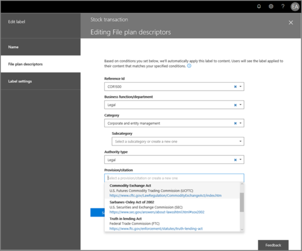
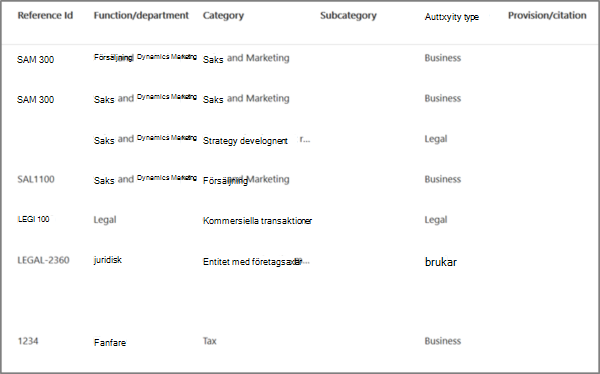
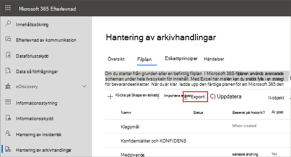
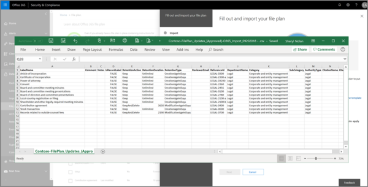
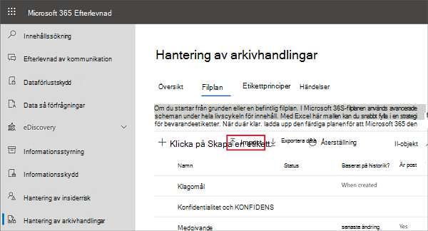
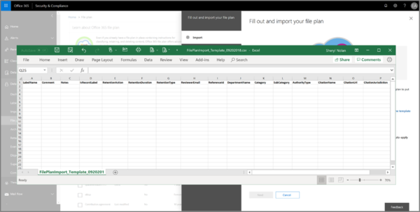
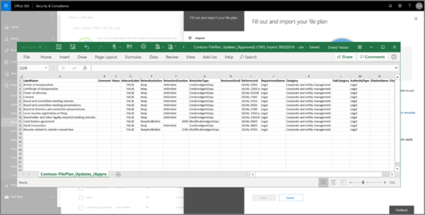
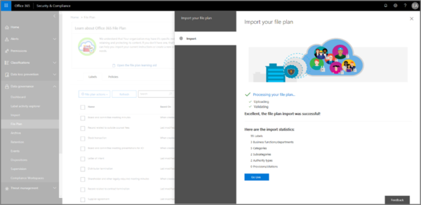

# Använd filplanen för att hantera kvarhållningsetiketterUse file plan to manage retention labels

>*[Licensieringsvägledning för Microsoft 365 för säkerhet och efterlevnad](/office365/servicedescriptions/microsoft-365-service-descriptions/microsoft-365-tenantlevel-services-licensing-guidance/microsoft-365-security-compliance-licensing-guidance).**[Microsoft 365 licensing guidance for security & compliance](/office365/servicedescriptions/microsoft-365-service-descriptions/microsoft-365-tenantlevel-services-licensing-guidance/microsoft-365-security-compliance-licensing-guidance).*

Även om du kan skapa och hantera kvarhållningsetiketter från **Informationsstyrning** i Microsoft 365 Efterlevnadscenter, har filplanen från **Hantering av arkivhandlingar** ytterligare hanteringsfunktioner:Although you can create and manage retention labels from **Information governance** in the Microsoft 365 compliance center, file plan from **Records management** has additional management capabilities:

- Du kan skapa kvarhållningsetiketter i grupp genom att importera relevant information från ett kalkylblad.You can bulk-create retention labels by importing the relevant information from a spreadsheet.

- Du kan exportera informationen från befintliga kvarhållningsetiketter för analys och offlinesamarbete eller för massredigering.You can export the information from existing retention labels for analysis and offline collaboration, or for bulk-editing.

- Mer information om kvarhållningsetiketterna visas så att det blir lättare att se och använda i inställningarna för alla kvarhållningsetiketterna i samma vy.More information about the retention labels is displayed to make it easier to see into and across the settings of all your retention labels from one view.

- Med filplansbeskrivningar finns stöd för ytterligare och valfri information för varje etikett.File plan descriptors support additional and optional information for each label.

Filplanen kan användas för alla kvarhållningsetiketter, även om de inte markerar innehållet som en post.File plan can be used for all retention labels, even if they don't mark content as a record.

Mer information om vad kvarhållningsetiketter är och hur du använder dem finns i [Mer information om Kvarhållningsprinciper och -etiketter](retention.md).For information about what retention labels are and how to use them, see [Learn about retention policies and retention labels](retention.md).

## Åtkomst till filplanenAccessing file plan

Du måste ha någon av följande administratörsroller för att komma åt filplanen:To access file plan, you must have one of the following admin roles:
    
- KvarhållningshanterareRetention Manager

- Endast visning för KvarhållningshanterareView-only Retention Manager

I Microsoft 365 Efterlevnadscenter går du till **Lösningar** > **Hantering av arkivhandlingar** > **Filplan**.In the Microsoft 365 compliance center, go to **Solutions** > **Records management** > **File plan**. 

Om **Hantering av arkivhandlingar** inte visas i navigeringsfönstret rullar du först nedåt och väljer **Visa alla**.If **Records management** doesn't display in the navigation pane, first scroll down, and select **Show all**.

## Navigera i filplanenNavigating your file plan

Om du redan har skapat kvarhållningsetiketter från **Informationsstyrning** i Microsoft 365 Efterlevnadscenter visas etiketterna automatiskt i filplanen.If you've already created retention labels from **Information governance** in the Microsoft 365 compliance center, these labels automatically display in your file plan. 

På samma sätt blir även nya kvarhållningsetiketter som du skapar i filplanen tillgängliga från **Informationsstyrning** om etiketterna inte är konfigurerade att markera innehåll som en post.Similarly, if you now create retention labels in file plan, they are also available from **Information governance** if the labels aren't configured to mark content as a record.

På sidan **Filplan** kan du se alla dina etiketter med deras status och inställningar, valfria filplansbeskrivningar, ett exportalternativ för analys eller för att aktivera offlinegranskning av dina etiketter samt ett importalternativ för att skapa kvarhållningsetiketter.On the **File plan** page, you see all your labels with their status and settings, optional file plan descriptors, an export option to analyze or enable offline reviews of your labels, and an import option to create retention labels. 

### Kolumner för etikettinställningarLabel settings columns

Alla kolumner utom **Namnet** på etiketten kan visas eller döljas genom att välja alternativet **Anpassa kolumner**.All columns except the label **Name** can be displayed or hidden by selecting the **Customize columns** option. Men som standard visas information om etikettstatus och dess inställningar i de första kolumnerna:But by default, the first few columns display information about the label status and its settings: 

- **Status** identifierar om etiketten ingår i en etikettprincip eller en automatiskt tillämpad princip (**Aktiv**) eller inte (**Inaktiv**).**Status** identifies whether the label is included in a label policy or auto-apply policy (**Active**) or not (**Inactive**).

- **Baserat på** identifierar hur eller när kvarhållningsperioden börjar.**Based on** identifies how or when the retention period begins. Giltiga värden:Valid values:
    - HändelseEvent
    - När den skapadesWhen created
    - Senast ändradLast modified
    - När den etiketteradesWhen labeled

- **Är post** identifierar om objektet är markerat som en post när etiketten tillämpas.**Is record** identifies if the item is marked as a record when the label is applied. Giltiga värden:Valid values:
    - NejNo
    - JaYes
    - Ja(föreskrifter)Yes(Regulatory)

- **Kvarhållningsvaraktighet** identifierar kvarhållningsperioden.**Retention duration** identifies the retention period. Giltiga värden:Valid values:
    - DagarDays
    - MånaderMonths
    - ÅrYears
    - För alltidForever
    - IngenNone

- **Borttagningstyp** identifierar vad som händer med innehållet i slutet av kvarhållningsperioden.**Disposition type** identifies what happens to the content at the end of the retention period. Giltiga värden:Valid values:
    - Ingen åtgärdNo action
    - Raderas automatisktAuto-delete
    - Granskning krävsReview required

### Kolumner med filplansbeskrivningarFile plan descriptors columns

Med filplanen kan du inkludera mer information som en del av dina kvarhållningsetiketter.File plan lets you include more information as part of your retention labels. De här filplansbeskrivningarna ger fler alternativ för att förbättra hanteringen och organiseringen av innehållet du behöver sätta en etikett på.These file plan descriptors provide more options to improve the manageability and organization of the content you need to label.

Som standard, med **Referens-ID** som start, visar de efterföljande kolumnerna filplansbeskrivningarna som du kan ange när du skapar en kvarhållningsetikett eller redigerar en befintlig etikett.By default, starting with **Reference ID**, the next few columns display these file plan descriptors that you can specify when you create a retention label, or edit an existing label. 

För att hjälpa dig igång finns det några out-of-box-värden för följande filplansbeskrivningar: To get you started, there are some out-of-box values for the following file plan descriptors: 
- Företagsfunktion/avdelningBusiness function/department
- KategoriCategory
- BehörighetstypAuthority type
- Krav/källhänvisningProvision/citation 

Exempel på filplansbeskrivningar när du skapar eller redigerar en kvarhållningsetikett:Example of file plan descriptors when you create or edit a retention label:

Exempelvy av kolumnerna för filplansbeskrivningar:Example view of the file plan descriptors columns:

## Exportera alla kvarhållningsetiketter för analys eller för att aktivera offlinegranskningExport all retention labels to analyze or enable offline reviews

Från filplanen kan du exportera information om alla kvarhållningsetiketter till en .csv-fil för att underlätta periodiska granskningar av intressenter i organisationens datastyrning.From your file plan, you can export the details of all retention labels into a .csv file to help you facilitate periodic compliance reviews with data governance stakeholders in your organization.

Om du vill exportera alla kvarhållningsetiketter: Gå till sidan **Filplan** och klicka på **Exportera**:To export all retention labels: On the **File plan** page, click **Export**:

En \*.csv-fil som innehåller alla befintliga kvarhållningsetiketter öppnas.A \*.csv file that contains all existing retention labels opens. Till exempel:For example:

## Importera kvarhållningsetiketter till filplanenImport retention labels into your file plan

I filplanen kan du massimportera nya kvarhållningsetiketter och använda samma metod för att massändra befintliga kvarhållningsetiketter.In file plan, you can bulk-import new retention labels, and use the same method to bulk-modify existing retention labels.

Så här importerar du nya och ändrar befintliga kvarhållningsetiketter:To import new retention labels and modify existing retention labels: 

1. På sidan **Filplan** klickar du på **Importera** för att använda sidan **Fyll i och importera din filplan**:On the **File plan** page, click **Import** to use the **Fill out and import your file plan** page:

   

   

2. Ladda ned en tom mall för att importera nya kvarhållningsetiketter.Download a blank template to import new retention labels. Du kan också börja med CSV-filen som exporteras när du exporterar befintliga kvarhållningsetiketter i organisationen.Alternatively, you can start with the .csv file that is exported when you export the existing retention labels in your organization.

   

3. Fyll i mallen med hjälp av följande information som beskriver egenskaperna och giltiga värden för varje egenskap.Fill out the template, using the following information that describes the properties and valid values for each property. För import har vissa värden en maxlängd:For import, some values have a maximum length:
    
    - **LabelName**: Upp till 64 tecken**LabelName**: Maximum length of 64 characters
    - **Kommentarer** och **Anteckningar**: Upp till 1 024 tecken**Comment** and **Notes**: Maximum length of 1024 characters
    - Övriga värden: Obegränsad längdAll other values: Unlimited length
     
    
   |EgenskapProperty|TypType|Giltiga värdenValid values|
   |:-----|:-----|:-----|
   |LabelNameLabelName|SträngString|Den här egenskapen anger namnet på kvarhållningsetiketten.This property specifies the name of the retention label.|
   |KommentarComment|SträngString|Använd den här egenskapen för att lägga till en beskrivning av kvarhållningsetiketten för administratörer.Use this property to add a description about the retention label for admins. Den här beskrivningen visas bara för administratörer som hanterar kvarhållningsetiketten i efterlevnadscentret.This description appears only to admins who manage the retention label in the compliance center.|
   |AnteckningarNotes|SträngString|Använd den här egenskapen för att lägga till en beskrivning av kvarhållningsetiketten för användare.Use this property to add a description about the retention label for users. Den här beskrivningen visas när användarna håller muspekaren över etiketten i program som Outlook, SharePoint och OneDrive.This description appears when users hover over the label in apps like Outlook, SharePoint, and OneDrive. Om du låter den här egenskapen vara tom visas en standardbeskrivning som förklarar etikettens kvarhållningsinställningar.If you leave this property blank, a default description is displayed, which explains the label's retention settings. |
   |IsRecordLabelIsRecordLabel|SträngString|Den här egenskapen anger om etiketten markerar innehållet som en post.This property specifies whether the label marks the content as a record. Giltiga värden är:Valid values are:  **SANT**: Etiketten markerar objektet som en post och därför kan objektet inte tas bort.**TRUE**: The label marks the item as a record and as a result, the item can't be deleted.  **FALSKT**: Etiketten markerar inte innehållet som en post.**FALSE**: The label doesn't mark the content as a record. Det här är standardvärdet.This is the default value.|
   |RetentionActionRetentionAction|SträngString|Den här egenskapen anger vilken åtgärd som ska vidtas efter att värdet som anges av egenskapen RetentionDuration upphör att gälla.This property specifies what action to take after the value specified by the RetentionDuration property expires. Giltiga värden är:Valid values are:  **Ta bort**: Objekt som är äldre än värdet som anges av egenskapen RetentionDuration tas bort.**Delete**: Items older than the value specified by the RetentionDuration property are deleted. **Behåll**: Behåller objekten under den varaktighet som anges av egenskapen RetentionDuration och gör därefter ingenting när varaktighetsperioden utlöper.**Keep**: Retain items for the duration specified by the RetentionDuration property and then do nothing when the duration period expires.  **BehållOchTaBort**: Behåller objekten under den varaktighet som anges av egenskapen RetentionDuration och tar bort dem när varaktighetsperioden utlöper.**KeepAndDelete**: Retain items for the duration specified by the RetentionDuration property and then delete them when the duration period expires.   |
   |RetentionDurationRetentionDuration|SträngString|Den här egenskapen anger hur många dagar innehållet ska behållas.This property specifies the number of days to retain the content. Giltiga värden är:Valid values are:  **Obegränsat**: Objekten behålls på obestämd tid.**Unlimited**: Items will be retained indefinitely.  \**_n_*_: Ett positivt heltal; till exempel _\* 365\*\*.\**_n_*_: A positive integer; for example, _\* 365\*\*. 
   |RetentionTypeRetentionType|SträngString|Den här egenskapen anger om kvarhållningsvaraktigheten beräknas utifrån datumet då innehållet skapades, händelsedatum, etikettdatum eller senast ändrade datum.This property specifies whether the retention duration is calculated from the content creation date, event date, when labeled date, or last modified date. Giltiga värden är:Valid values are:  **CreationAgeInDays****CreationAgeInDays** **EventAgeInDays****EventAgeInDays** **TaggedAgeInDays****TaggedAgeInDays** **ModificationAgeInDays****ModificationAgeInDays** |
   |ReviewerEmailReviewerEmail|SmtpAddressSmtpAddress|När den här egenskapen är fylld utlöses en borttagningsgranskning när kvarhållningsvaraktigheten utlöper.When this property is populated, a disposition review will be triggered when the retention duration expires. Den här egenskapen anger e-postadressen till en granskare för kvarhållningsåtgärden **KeepAndDelete**.This property specifies the email address of a reviewer for the **KeepAndDelete** retention action. Du kan ta med e-postadressen till enskilda användare, distributionsgrupper eller säkerhetsgrupper.You can include the email address of individual users, distribution groups, or security groups. Du kan ange flera e-postadresser avgränsade med semikolon.You can specify multiple email addresses separated by semicolons.|
   |ReferenceIdReferenceId|SträngString|Den här egenskapen anger värdet som visas i filplansbeskrivningar för **Referens-ID**, vilket du kan använda som ett unikt värde för din organisation.This property specifies the value that's displayed in the **Reference Id** file plan descriptor, which you can use as a unique value to your organization.| 
   |DepartmentNameDepartmentName|SträngString|Den här egenskapen anger värdet som visas i filplansbeskrivningen för **Funktion/avdelning**.This property specifies the value that's displayed in the **Function/department** file plan descriptor.|
   |KategoriCategory|SträngString|Den här egenskapen anger värdet som visas i filplansbeskrivningen för **Kategori**.This property specifies the value that's displayed in the **Category** file plan descriptor.|
   |SubCategorySubCategory|SträngString|Den här egenskapen anger värdet som visas i filplansbeskrivningen för **Underkategori**.This property specifies the value that's displayed in the **Sub category** file plan descriptor.|
   |AuthorityTypeAuthorityType|SträngString|Den här egenskapen anger värdet som visas i filplansbeskrivningen för **Behörighetstyp**.This property specifies the value that's displayed in the **Authority type** file plan descriptor.|
   |CitationNameCitationName|SträngString|Den här egenskapen anger namnet på källhänvisningen som visas i filplansbeskrivningen för **Krav/källhänvisning**.This property specifies the name of the citation displayed in the **Provision/citation** file plan descriptor. Till exempel "Sarbanes-Oxley Act of 2002".For example, "Sarbanes-Oxley Act of 2002". |
   |CitationUrlCitationUrl|SträngString|Den här egenskapen anger URL-adressen som visas i filplansbeskrivningen för **Krav/källhänvisning**.This property specifies the URL that's displayed in the **Provision/citation** file plan descriptor.|
   |CitationJurisdictionCitationJurisdiction|SträngString|Den här egenskapen anger befogenheten eller instansen som visas i filplansbeskrivningen för **Krav/källhänvisning**.This property specifies the jurisdiction or agency that's displayed in the **Provision/citation** file plan descriptor. Till exempel "U.S. Securities and Exchange Commission (SEC)".For example, "U.S. Securities and Exchange Commission (SEC)".|
   |RegulatoryRegulatory|SträngString|Lämna tomt.Leave blank. Den här egenskapen används inte för stunden.This property isn't used at this time.|
   |EventTypeEventType|SträngString|Den här egenskapen anger kvarhållningsregeln som är kopplad till etiketten.This property specifies the retention rule that's associated with the label. Du kan använda alla värden som unikt identifierar regeln.You can use any value that uniquely identifies the rule. Till exempel:For example: **Namn****Name** **Unikt namn (DN)****Distinguished name (DN)** **GUID****GUID**  Du kan använda cmdlet:en [Get-RetentionComplianceRule](/powershell/module/exchange/get-retentioncompliancerule) för att visa tillgängliga kvarhållningsregler.You can use the [Get-RetentionComplianceRule](/powershell/module/exchange/get-retentioncompliancerule) cmdlet to view the available retention rules. Observera att EventType-värdena är unika för en organisation. Om du exporterar etiketter från en organisation kan du inte använda värdena för dess EventType-egenskaper till att importera etiketter till en annan organisation.Note that because the EventType values are unique to an organization, if you export labels from one organization, you can't use the values for the EventType property from that organization to import labels into a different organization.|
   |||

   Här är ett exempel på mallen med information om kvarhållningsetiketter.Here's an example of the template containing the information about retention labels.

   

4. Under steg 3 på sidan **Fyll i och importera din filplan** klickar du på **Bläddra efter filer** för att ladda upp den ifyllda mallen.Under step 3 on the **Fill out and import your file plan** page, click **Browse for files** to upload the filled-out template. 

   Filplanen verifierar posterna och visar importstatistiken.File plan validates the entries and displays the import statistics.

   

   Om det uppstår ett verifieringsfel fortsätter filplansimporten att verifiera alla inmatningar i importfilen och visar alla fel som refererar till rad- och radnumren i importfilen.If there's a validation error, file plan import continues to validate every entry in the import file and displays all errors  referencing the line and row numbers in the import file. Kopiera de felmeddelanden som visas så att du kan korrigera dem när du återgår till importfilen.Copy the displayed error results so you can correct them when you return to the import file.

När importen är klar kan du lägga till kvarhållningsetiketterna i en ny princip eller tillämpa dem automatiskt.When the import is complete, you can now add the retention labels to a new retention label policy, or auto-apply them. Du kan göra det direkt från sidan **Filplan** genom att välja listrutan från **+ Skapa en etikett** och sedan **Princip för att publicera etiketter** eller **Princip för att tillämpa en etikett automatiskt**.You can do this right from the **File plan** page by selecting the dropdown from **+ Create a label** and then **Policy to publish labels**, or **Policy to auto-apply a label**.

## Nästa stegNext steps

Mer information om hur du skapar och redigerar kvarhållningsetiketter och deras principer finns i följande vägledningar:For more information about creating and editing retention labels and their policies, see the following guidance:
- [Skapa kvarhållningsetiketter och använda dem i apparCreate retention labels and apply them in apps](create-apply-retention-labels.md)
- [Använda en kvarhållningsetikett för innehåll automatisktApply a retention label to content automatically](apply-retention-labels-automatically.md)