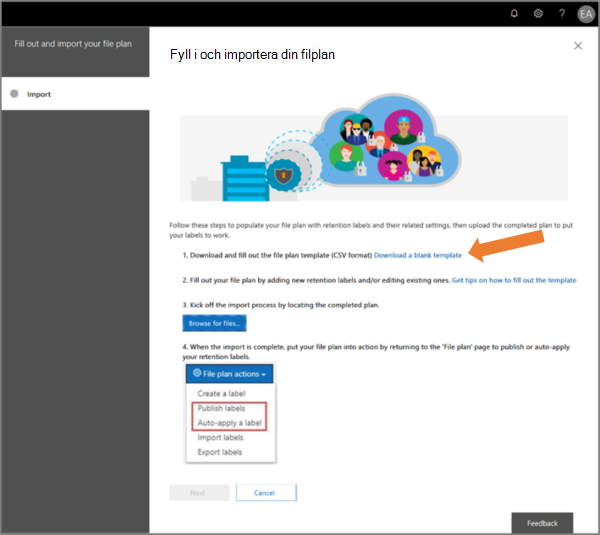

# Använd filplanen för att hantera kvarhållningsetiketter

>*[Licensieringsvägledning för Microsoft 365 för säkerhet och efterlevnad](/office365/servicedescriptions/microsoft-365-service-descriptions/microsoft-365-tenantlevel-services-licensing-guidance/microsoft-365-security-compliance-licensing-guidance).*

Även om du kan skapa och hantera kvarhållningsetiketter från **Informationsstyrning** i Microsoft 365 Efterlevnadscenter, har filplanen från **Hantering av arkivhandlingar** ytterligare hanteringsfunktioner:

- Du kan skapa kvarhållningsetiketter i grupp genom att importera relevant information från ett kalkylblad.

- Du kan exportera informationen från befintliga kvarhållningsetiketter för analys och offlinesamarbete eller för massredigering.

- Mer information om kvarhållningsetiketterna visas så att det blir lättare att se och använda i inställningarna för alla kvarhållningsetiketterna i samma vy.

- Med filplansbeskrivningar finns stöd för ytterligare och valfri information för varje etikett.

Filplanen kan användas för alla kvarhållningsetiketter, även om de inte markerar innehållet som en post.

Mer information om vad kvarhållningsetiketter är och hur du använder dem finns i [Mer information om Kvarhållningsprinciper och -etiketter](retention.md).

## Åtkomst till filplanen

Du måste ha någon av följande administratörsroller för att komma åt filplanen:
    
- Kvarhållningshanterare

- Endast visning för Kvarhållningshanterare

I Microsoft 365 Efterlevnadscenter går du till **Lösningar** > **Hantering av arkivhandlingar** > **Filplan**. 

Om **Hantering av arkivhandlingar** inte visas i navigeringsfönstret rullar du först nedåt och väljer **Visa alla**.

## Navigera i filplanen

Om du redan har skapat kvarhållningsetiketter från **Informationsstyrning** i Microsoft 365 Efterlevnadscenter visas etiketterna automatiskt i filplanen. 

På samma sätt blir även nya kvarhållningsetiketter som du skapar i filplanen tillgängliga från **Informationsstyrning** om etiketterna inte är konfigurerade att markera innehåll som en post.

På sidan **Filplan** kan du se alla dina etiketter med deras status och inställningar, valfria filplansbeskrivningar, ett exportalternativ för analys eller för att aktivera offlinegranskning av dina etiketter samt ett importalternativ för att skapa kvarhållningsetiketter. 

### Kolumner för etikettinställningar

Alla kolumner utom **Namnet** på etiketten kan visas eller döljas genom att välja alternativet **Anpassa kolumner**. Men som standard visas information om etikettstatus och dess inställningar i de första kolumnerna: 

- **Status** identifierar om etiketten ingår i en etikettprincip eller en automatiskt tillämpad princip (**Aktiv**) eller inte (**Inaktiv**).

- **Baserat på** identifierar hur eller när kvarhållningsperioden börjar. Giltiga värden:
    - Händelse
    - När den skapades
    - Senast ändrad
    - När den etiketterades

- **Är post** identifierar om objektet är markerat som en post när etiketten tillämpas. Giltiga värden:
    - Nej
    - Ja
    - Ja(föreskrifter)

- **Kvarhållningsvaraktighet** identifierar kvarhållningsperioden. Giltiga värden:
    - Dagar
    - Månader
    - År
    - För alltid
    - Ingen

- **Borttagningstyp** identifierar vad som händer med innehållet i slutet av kvarhållningsperioden. Giltiga värden:
    - Ingen åtgärd
    - Raderas automatiskt
    - Granskning krävs

### Kolumner med filplansbeskrivningar

Med filplanen kan du inkludera mer information som en del av dina kvarhållningsetiketter. De här filplansbeskrivningarna ger fler alternativ för att förbättra hanteringen och organiseringen av innehållet du behöver sätta en etikett på.

Som standard, med **Referens-ID** som start, visar de efterföljande kolumnerna filplansbeskrivningarna som du kan ange när du skapar en kvarhållningsetikett eller redigerar en befintlig etikett. 

För att hjälpa dig igång finns det några out-of-box-värden för följande filplansbeskrivningar:  
- Företagsfunktion/avdelning
- Kategori
- Behörighetstyp
- Krav/källhänvisning 

Exempel på filplansbeskrivningar när du skapar eller redigerar en kvarhållningsetikett:

Exempelvy av kolumnerna för filplansbeskrivningar:

## Exportera alla kvarhållningsetiketter för analys eller för att aktivera offlinegranskning

Från filplanen kan du exportera information om alla kvarhållningsetiketter till en .csv-fil för att underlätta periodiska granskningar av intressenter i organisationens datastyrning.

Om du vill exportera alla kvarhållningsetiketter: Gå till sidan **Filplan** och klicka på **Exportera**:

En *.csv-fil som innehåller alla befintliga kvarhållningsetiketter öppnas. Till exempel:

## Importera kvarhållningsetiketter till filplanen

I filplanen kan du massimportera nya kvarhållningsetiketter och använda samma metod för att massändra befintliga kvarhållningsetiketter.

Så här importerar du nya och ändrar befintliga kvarhållningsetiketter: 

1. På sidan **Filplan** klickar du på **Importera** för att använda sidan **Fyll i och importera din filplan**:

   

   

2. Ladda ned en tom mall för att importera nya kvarhållningsetiketter. Du kan också börja med CSV-filen som exporteras när du exporterar befintliga kvarhållningsetiketter i organisationen.

   

3. Fyll i mallen med hjälp av följande information som beskriver egenskaperna och giltiga värden för varje egenskap. För import har vissa värden en maxlängd:
    
    - **LabelName**: Upp till 64 tecken
    - **Kommentarer** och **Anteckningar**: Upp till 1 024 tecken
    - Övriga värden: Obegränsad längd
     
    
   |Egenskap|Typ|Giltiga värden|
   |:-----|:-----|:-----|
   |LabelName|Sträng|Den här egenskapen anger namnet på kvarhållningsetiketten.|
   |Kommentar|Sträng|Använd den här egenskapen för att lägga till en beskrivning av kvarhållningsetiketten för administratörer. Den här beskrivningen visas bara för administratörer som hanterar kvarhållningsetiketten i efterlevnadscentret.|
   |Anteckningar|Sträng|Använd den här egenskapen för att lägga till en beskrivning av kvarhållningsetiketten för användare. Den här beskrivningen visas när användarna håller muspekaren över etiketten i program som Outlook, SharePoint och OneDrive. Om du låter den här egenskapen vara tom visas en standardbeskrivning som förklarar etikettens kvarhållningsinställningar. |
   |IsRecordLabel|Sträng|Den här egenskapen anger om etiketten markerar innehållet som en post. Giltiga värden är:  **SANT**: Etiketten markerar objektet som en post och därför kan objektet inte tas bort.  **FALSKT**: Etiketten markerar inte innehållet som en post. Det här är standardvärdet.|
   |RetentionAction|Sträng|Den här egenskapen anger vilken åtgärd som ska vidtas efter att värdet som anges av egenskapen RetentionDuration upphör att gälla. Giltiga värden är:  **Ta bort**: Objekt som är äldre än värdet som anges av egenskapen RetentionDuration tas bort. **Behåll**: Behåller objekten under den varaktighet som anges av egenskapen RetentionDuration och gör därefter ingenting när varaktighetsperioden utlöper.  **BehållOchTaBort**: Behåller objekten under den varaktighet som anges av egenskapen RetentionDuration och tar bort dem när varaktighetsperioden utlöper.   |
   |RetentionDuration|Sträng|Den här egenskapen anger hur många dagar innehållet ska behållas. Giltiga värden är:  **Obegränsat**: Objekten behålls på obestämd tid.  **_n_*_: Ett positivt heltal; till exempel _* 365**. 
   |RetentionType|Sträng|Den här egenskapen anger om kvarhållningsvaraktigheten beräknas utifrån datumet då innehållet skapades, händelsedatum, etikettdatum eller senast ändrade datum. Giltiga värden är:  **CreationAgeInDays** **EventAgeInDays** **TaggedAgeInDays** **ModificationAgeInDays** |
   |ReviewerEmail|SmtpAddress|När den här egenskapen är fylld utlöses en borttagningsgranskning när kvarhållningsvaraktigheten utlöper. Den här egenskapen anger e-postadressen till en granskare för kvarhållningsåtgärden **KeepAndDelete**. Du kan ta med e-postadressen till enskilda användare, distributionsgrupper eller säkerhetsgrupper. Du kan ange flera e-postadresser avgränsade med semikolon.|
   |ReferenceId|Sträng|Den här egenskapen anger värdet som visas i filplansbeskrivningar för **Referens-ID**, vilket du kan använda som ett unikt värde för din organisation.| 
   |DepartmentName|Sträng|Den här egenskapen anger värdet som visas i filplansbeskrivningen för **Funktion/avdelning**.|
   |Kategori|Sträng|Den här egenskapen anger värdet som visas i filplansbeskrivningen för **Kategori**.|
   |SubCategory|Sträng|Den här egenskapen anger värdet som visas i filplansbeskrivningen för **Underkategori**.|
   |AuthorityType|Sträng|Den här egenskapen anger värdet som visas i filplansbeskrivningen för **Behörighetstyp**.|
   |CitationName|Sträng|Den här egenskapen anger namnet på källhänvisningen som visas i filplansbeskrivningen för **Krav/källhänvisning**. Till exempel "Sarbanes-Oxley Act of 2002". |
   |CitationUrl|Sträng|Den här egenskapen anger URL-adressen som visas i filplansbeskrivningen för **Krav/källhänvisning**.|
   |CitationJurisdiction|Sträng|Den här egenskapen anger befogenheten eller instansen som visas i filplansbeskrivningen för **Krav/källhänvisning**. Till exempel "U.S. Securities and Exchange Commission (SEC)".|
   |Regulatory|Sträng|Lämna tomt. Den här egenskapen används inte för stunden.|
   |EventType|Sträng|Den här egenskapen anger kvarhållningsregeln som är kopplad till etiketten. Du kan använda alla värden som unikt identifierar regeln. Till exempel: **Namn** **Unikt namn (DN)** **GUID**  Du kan använda cmdlet:en [Get-RetentionComplianceRule](/powershell/module/exchange/get-retentioncompliancerule) för att visa tillgängliga kvarhållningsregler. Observera att EventType-värdena är unika för en organisation. Om du exporterar etiketter från en organisation kan du inte använda värdena för dess EventType-egenskaper till att importera etiketter till en annan organisation.|
   |||

   Här är ett exempel på mallen med information om kvarhållningsetiketter.

   

4. Under steg 3 på sidan **Fyll i och importera din filplan** klickar du på **Bläddra efter filer** för att ladda upp den ifyllda mallen. 

   Filplanen verifierar posterna och visar importstatistiken.

   

   Om det uppstår ett verifieringsfel fortsätter filplansimporten att verifiera alla inmatningar i importfilen och visar alla fel som refererar till rad- och radnumren i importfilen. Kopiera de felmeddelanden som visas så att du kan korrigera dem när du återgår till importfilen.

När importen är klar kan du lägga till kvarhållningsetiketterna i en ny princip eller tillämpa dem automatiskt. Du kan göra det direkt från sidan **Filplan** genom att välja listrutan från **+ Skapa en etikett** och sedan **Princip för att publicera etiketter** eller **Princip för att tillämpa en etikett automatiskt**.

## Nästa steg

Mer information om hur du skapar och redigerar kvarhållningsetiketter och deras principer finns i följande vägledningar:
- [Skapa kvarhållningsetiketter och använda dem i appar](create-apply-retention-labels.md)
- [Använda en kvarhållningsetikett för innehåll automatiskt](apply-retention-labels-automatically.md)